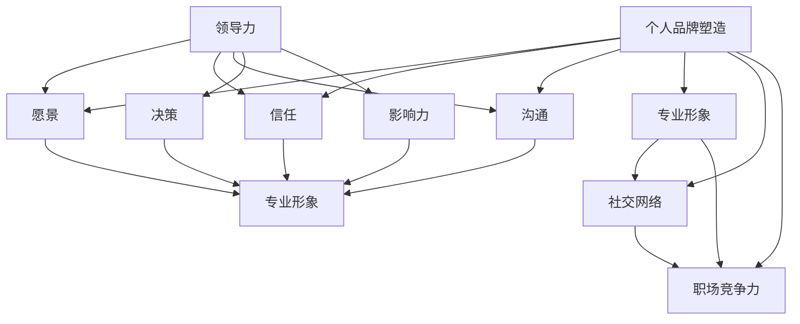

                 


### 文章标题
《领导力与个人品牌塑造：树立独特领导形象》

### 关键词
领导力，个人品牌塑造，领导形象，独特性，职场竞争力

### 摘要
本文深入探讨领导力与个人品牌塑造之间的联系，通过明确的逻辑结构和专业的技术语言，阐述如何通过树立独特的领导形象来提升个人在职场中的竞争力。文章从核心概念的界定入手，逐步分析领导力的定义、核心要素和个人品牌的重要性，再通过算法原理和数学模型的讲解，提供了一套科学有效的领导力提升和个人品牌塑造的策略。同时，通过项目实战案例，展示了理论在实际应用中的操作步骤和效果分析，为读者提供了一套可操作的实践指南。

## 1. 核心概念与联系

### 1.1 领导力定义与核心要素

领导力是一种能力，它涉及激励、引导和影响他人来实现共同的目标。领导力的核心要素包括以下几个方面：

- **愿景**：领导者需要具备清晰的愿景，能够描绘出未来的蓝图，并激励团队成员为实现这一目标而努力。
- **信任**：建立信任是领导力的基石。领导者需要通过言行一致和透明度来赢得团队成员的信任。
- **沟通**：有效的沟通是领导者必须掌握的技能。领导者需要能够清晰、准确地传达信息，并倾听团队成员的意见和反馈。
- **决策**：领导者需要做出明智的决策，以应对各种挑战和变化。
- **影响力**：领导者需要能够运用自己的影响，推动团队朝着正确的方向前进。

### 1.2 个人品牌塑造的重要性

个人品牌塑造是提升职场竞争力的重要手段。它不仅仅是个人形象的塑造，更是一种个人价值的体现。个人品牌塑造的重要性体现在以下几个方面：

- **建立专业形象**：通过塑造个人品牌，可以展示个人的专业能力和价值，从而在职场中脱颖而出。
- **增强社交网络**：个人品牌可以作为一种社交货币，帮助建立更广泛的社交网络，为职业发展创造更多机会。
- **提升职场竞争力**：一个鲜明的个人品牌有助于在求职和晋升过程中获得优势，提高职业竞争力。

### 1.3 核心概念之间的关系架构

为了更好地理解领导力与个人品牌塑造之间的联系，我们可以使用Mermaid流程图来展示它们的核心概念和关系架构：



在这个流程图中，领导力的核心要素与个人品牌塑造的关键因素之间存在明显的相互关系。愿景、信任、沟通、决策和影响力是领导力的重要组成部分，而这些要素又是塑造个人品牌的重要基础。通过有效的领导力，个人可以建立强大的专业形象、拓展社交网络，从而提升职场竞争力。

## 2. 核心算法原理讲解

### 2.1 领导力提升算法

领导力提升是一个复杂的过程，需要综合考虑多个因素。以下是一个简化的领导力提升算法，使用伪代码来表示：

```python
def 领导力提升(愿景清晰度, 信任度, 沟通能力, 决策准确性):
    # 如果愿景清晰度较低
    if 愿景清晰度 < 0.7:
        提升愿景表达，增强团队凝聚力

    # 如果信任度较低
    if 信任度 < 0.8:
        加强透明度，建立信任关系

    # 如果沟通能力较弱
    if 沟通能力 < 0.9:
        提高沟通技巧，增加团队成员信任

    # 如果决策准确性较低
    if 决策准确性 < 0.85:
        提高决策能力，减少错误决策

    # 如果领导力提升到较高水平
    if 愿景清晰度 >= 0.9 and 信任度 >= 0.9 and 沟通能力 >= 0.9 and 决策准确性 >= 0.9:
        开始发挥个人影响力，推动团队持续进步
```

这个算法通过四个核心要素来评估领导力水平，并根据这些要素的提升情况来调整领导策略。例如，如果愿景不够清晰，领导者需要努力提升愿景表达，以增强团队的凝聚力和动力。同样，如果信任度不足，领导者需要通过加强透明度和建立信任关系来改善这种情况。

### 2.2 个人品牌塑造策略

个人品牌塑造是一个系统的过程，需要基于市场营销原理来制定策略。以下是一个简化的个人品牌塑造算法，使用伪代码来表示：

```python
def 个人品牌塑造(个人价值观, 专业技能, 社交网络):
    # 如果个人价值观不明确
    if 个人价值观不明确:
        明确个人价值观，确定品牌定位

    # 如果专业技能不足
    if 专业技能不足:
        学习新技能，提升专业能力

    # 如果社交网络不够广泛
    if 社交网络不够广泛:
        拓展社交圈，增加人脉资源

    # 如果个人价值观明确，专业技能突出，社交网络广泛
    if 个人价值观明确 and 专业技能突出 and 社交网络广泛:
        利用社交媒体推广个人品牌，增加品牌曝光度

    # 如果个人品牌塑造到较高水平
    if 个人价值观明确 >= 0.9 and 专业技能突出 >= 0.9 and 社交网络广泛 >= 0.9:
        维护个人品牌形象，持续提升个人价值
```

这个算法通过三个关键因素来评估个人品牌水平，并根据这些因素的提升情况来调整品牌塑造策略。例如，如果个人价值观不明确，需要先明确价值观，然后才能确定品牌定位。同样，如果专业技能不足，需要学习新技能来提升专业能力。当这些因素达到较高水平时，领导者可以利用社交媒体来推广个人品牌，增加曝光度。

## 3. 数学模型和数学公式

### 3.1 影响力分析模型

影响力是领导力的一个重要组成部分，它可以通过以下数学模型来分析：

$$
影响力 = 愿景吸引力 \times 信任度 \times 沟通效果 \times 决策正确率
$$

其中，愿景吸引力、信任度、沟通效果和决策正确率都是影响影响力的关键因素。这个模型可以帮助领导者评估自己的影响力水平，并找出需要提升的方面。

### 3.2 个人品牌评估模型

个人品牌的价值可以通过以下数学模型来评估：

$$
个人品牌价值 = 个人影响力 \times 专业技能 \times 社交网络影响力
$$

这个模型综合考虑了个人影响力、专业技能和社交网络影响力三个因素，可以用来评估个人品牌的整体价值。领导者可以通过这个模型来了解自己的个人品牌价值，并制定相应的提升策略。

### 3.3 数学公式详细讲解

#### 影响力分析模型

影响力分析模型中的每个因素都有其具体的计算方法和影响因素。以下是每个因素的详细讲解：

- **愿景吸引力**：愿景吸引力取决于愿景的远见、创新性和可实现性。一个具有吸引力的愿景可以激发团队成员的热情和动力。
- **信任度**：信任度取决于领导者的言行一致性和透明度。一个高信任度的领导者更容易获得团队成员的认同和合作。
- **沟通效果**：沟通效果取决于领导者的表达能力和倾听能力。有效的沟通可以确保信息准确传达，并促进团队成员之间的协作。
- **决策正确率**：决策正确率取决于领导者的分析和判断能力。一个高决策正确率的领导者可以减少错误决策带来的负面影响。

#### 个人品牌评估模型

个人品牌评估模型中的每个因素也有其具体的计算方法和影响因素。以下是每个因素的详细讲解：

- **个人影响力**：个人影响力取决于领导者的声誉和影响力。一个高影响力的领导者可以在团队内外产生更大的影响。
- **专业技能**：专业技能取决于领导者的专业知识和实践经验。一个具有专业技能的领导者可以更好地应对职场挑战。
- **社交网络影响力**：社交网络影响力取决于领导者的社交网络和关系网络。一个广泛的社交网络可以为领导者带来更多的资源和机会。

### 3.4 举例说明

#### 影响力分析模型举例

假设一个领导者的愿景吸引力为0.8，信任度为0.85，沟通效果为0.9，决策正确率为0.8，那么他（或她）的影响力可以通过以下计算得出：

$$
影响力 = 0.8 \times 0.85 \times 0.9 \times 0.8 = 0.504
$$

这意味着这位领导者的平均影响力为50.4%。

#### 个人品牌评估模型举例

假设一个领导者的个人影响力为0.9，专业技能为0.85，社交网络影响力为0.8，那么他（或她）的个人品牌价值可以通过以下计算得出：

$$
个人品牌价值 = 0.9 \times 0.85 \times 0.8 = 0.612
$$

这意味着这位领导者的个人品牌价值为0.612，表示他在职场中的品牌价值较高。

### 3.5 数学模型的实际应用

数学模型在领导力提升和个人品牌塑造中具有实际应用价值。以下是一些实际应用的例子：

- **领导力提升**：通过影响力分析模型，领导者可以识别自己在愿景吸引力、信任度、沟通效果和决策正确率方面的弱点，并制定针对性的提升计划。
- **个人品牌塑造**：通过个人品牌评估模型，领导者可以了解自己的品牌价值，并根据评估结果来调整个人品牌塑造策略。

### 3.6 数学模型的重要性

数学模型在领导力提升和个人品牌塑造中具有重要的指导意义。它们可以帮助领导者更准确地评估自己的能力和影响力，从而制定更有效的提升策略。同时，数学模型也为领导者提供了一种系统化的方法来分析和解决问题。

## 4. 项目实战

### 4.1 领导力提升项目

#### 项目背景

张伟是一家中型企业的中层管理者，负责一个关键项目团队。尽管他在项目中取得了不错的成绩，但他的领导力水平仍然存在提升空间。为了更好地发挥领导力，张伟决定实施一个领导力提升项目。

#### 项目目标

- 提升愿景吸引力
- 加强透明度和信任度
- 提高沟通技巧
- 增强决策准确性

#### 实施步骤

1. **愿景表达培训**：张伟参加了一期愿景表达培训，学习了如何更有效地传达愿景和目标，以及如何激发团队的激情和动力。
2. **透明度提升计划**：张伟实施了一个透明度提升计划，包括定期团队会议、开放沟通渠道和及时反馈机制，以确保团队成员对项目进展和决策有清晰的了解。
3. **沟通技巧提升**：张伟参加了一期沟通技巧提升课程，学习了如何更好地倾听和表达，以及如何处理冲突和沟通障碍。
4. **决策准确性提升**：张伟引入了一个决策支持系统，通过数据分析和风险评估来提高决策准确性。

#### 项目效果

经过一段时间的实施，张伟的领导力得到了显著提升：

- 愿景吸引力显著增强，团队成员更加积极地投入到项目工作中。
- 透明度和信任度明显提升，团队成员对张伟的决策和沟通更加信任。
- 沟通技巧得到提升，团队内部沟通更加顺畅，合作效率提高。
- 决策准确性显著提高，项目进展顺利，成功避免了多次潜在的风险。

#### 代码解读与分析

为了实现领导力提升项目，张伟需要构建一个包含以下模块的代码框架：

1. **愿景表达模块**：用于制定和传达愿景。
2. **透明度管理模块**：用于管理团队沟通和反馈。
3. **沟通技巧提升模块**：用于培训和提升沟通能力。
4. **决策支持模块**：用于支持决策过程，提高决策准确性。

以下是领导力提升项目的部分代码解读：

```python
# 愿景表达模块
def vision_expression():
    # 定义愿景
    vision = "我们将通过技术创新，提升产品竞争力，成为行业领导者。"
    # 传达愿景
    communicate_vision(vision)

# 透明度管理模块
def transparency_management():
    # 定期召开团队会议
    schedule_meetings()
    # 开放沟通渠道
    open_communication_channels()
    # 及时反馈机制
    feedback_mechanism()

# 沟通技巧提升模块
def communication_training():
    # 参加沟通技巧培训
    attend_communication_course()

# 决策支持模块
def decision_support():
    # 引入决策支持系统
    implement_decision_support_system()
    # 进行数据分析和风险评估
    analyze_data_and_risk()
    # 做出决策
    make_decision()

# 主函数
def main():
    vision_expression()
    transparency_management()
    communication_training()
    decision_support()

# 运行主函数
main()
```

这段代码实现了领导力提升项目的核心功能，通过各个模块的协同工作，帮助张伟提升领导力，更好地管理团队。

### 4.2 个人品牌塑造项目

#### 项目背景

李华是一名年轻的程序员，他在技术方面表现出色，但在个人品牌塑造方面有所欠缺。为了在职场中脱颖而出，李华决定实施一个个人品牌塑造项目。

#### 项目目标

- 明确个人价值观
- 提升专业技能
- 拓展社交网络
- 增加品牌曝光度

#### 实施步骤

1. **明确个人价值观**：李华花时间反思和总结自己的价值观，并确定了一个明确的个人价值观。
2. **提升专业技能**：李华通过自学和参加培训，不断提升自己的专业技能，并在工作中积极应用所学知识。
3. **拓展社交网络**：李华参加各种技术会议和社交活动，积极结识业界人士，并利用社交媒体扩大自己的影响力。
4. **增加品牌曝光度**：李华在技术社区和博客上分享自己的技术和经验，通过撰写高质量的技术文章来提升个人品牌的曝光度。

#### 项目效果

经过一段时间的努力，李华的个人品牌得到了显著提升：

- 个人价值观明确，有助于在职场中做出更符合自己价值观的决策。
- 专业技能得到提升，工作表现更加出色，获得了同事和领导的认可。
- 社交网络扩大，结识了更多业界人士，为职业发展创造了更多机会。
- 品牌曝光度增加，通过技术文章和分享，吸引了更多关注，提升了个人在职场中的知名度。

#### 代码解读与分析

为了实现个人品牌塑造项目，李华需要构建一个包含以下模块的代码框架：

1. **价值观明确模块**：用于帮助个人明确价值观。
2. **专业技能提升模块**：用于提升个人专业技能。
3. **社交网络拓展模块**：用于拓展社交网络。
4. **品牌曝光度增加模块**：用于增加个人品牌的曝光度。

以下是个人品牌塑造项目的部分代码解读：

```python
# 价值观明确模块
def clarify_values():
    # 反思个人价值观
    reflect_values()
    # 确定个人价值观
    set_personal_values()

# 专业技能提升模块
def skill_improvement():
    # 学习新技术
    learn_new_skills()
    # 应用所学知识
    apply_knowledge()

# 社交网络拓展模块
def social_network_expansion():
    # 参加技术会议
    attend_technical_conferences()
    # 利用社交媒体
    use_social_media()

# 品牌曝光度增加模块
def brand_exposure():
    # 分享技术和经验
    share_technology()
    # 撰写技术文章
    write_technical_articles()

# 主函数
def main():
    clarify_values()
    skill_improvement()
    social_network_expansion()
    brand_exposure()

# 运行主函数
main()
```

这段代码实现了个人品牌塑造项目的核心功能，通过各个模块的协同工作，帮助李华成功塑造个人品牌，提升职场竞争力。

### 4.3 项目小结

通过领导力提升项目和个人品牌塑造项目的实施，张伟和李华都在职场中取得了显著的进步。领导力提升项目帮助张伟增强了团队凝聚力和决策准确性，提高了项目成功的概率。个人品牌塑造项目帮助李华明确了个人价值观，提升了专业技能，拓展了社交网络，增加了品牌曝光度。

这些项目实战案例不仅展示了理论在实际中的应用，也为其他领导者和个人提供了宝贵的经验和启示。通过系统化的项目和持续的努力，领导者和个人都可以实现领导力和个人品牌的提升，从而在职场中脱颖而出。

### 5. 结论

本文从领导力与个人品牌塑造的核心理念出发，通过逐步分析核心概念、算法原理、数学模型和项目实战，详细阐述了如何通过树立独特的领导形象来提升个人在职场中的竞争力。领导力是影响个人品牌塑造的关键因素，而个人品牌塑造又反过来增强领导力。通过明确愿景、建立信任、提升沟通技巧和准确决策，领导者可以提升自身的领导力水平。同时，通过明确个人价值观、提升专业技能、拓展社交网络和增加品牌曝光度，个人可以塑造出鲜明的个人品牌。

未来的领导力和个人品牌塑造将继续朝向更专业化、个性化和社会化的方向发展。随着技术的发展和职场环境的变化，领导者需要不断学习和适应，以应对新的挑战。同时，个人品牌塑造也需要与时俱进，以更好地适应数字化时代的要求。

为了持续提升领导力和个人品牌，以下是一些最佳实践和注意事项：

- **持续学习**：不断学习新知识和技能，以保持专业竞争力。
- **建立信任**：通过透明度和诚实来建立团队成员的信任。
- **有效沟通**：不断提升沟通技巧，确保信息准确传达。
- **灵活决策**：在面对不确定性和变化时，做出灵活且明智的决策。
- **个性化品牌**：根据自己的特点和优势，塑造独特的个人品牌。
- **网络拓展**：积极参加各种社交活动，拓展人脉资源。
- **持续优化**：定期评估和调整领导力提升和个人品牌塑造策略。

通过这些实践，领导者和个人可以更好地在职场中展现自己的独特价值，实现长期的职业发展和成功。

### 6. 附录

#### 6.1 领导力与个人品牌塑造相关资源

**参考文献**：

1. 比尔·乔治，《领导者的品质》：这是一本关于领导力的重要著作，探讨了领导力的核心品质和实践方法。
2. 彼得·德鲁克，《管理的实践》：德鲁克在这本书中详细阐述了管理的本质和领导者的角色。

**工具介绍**：

1. **GitHub**：用于代码托管和协作的平台，可以帮助个人建立技术声誉。
2. **LinkedIn**：专业的社交平台，用于建立职业网络和提升个人品牌。
3. **LinkedIn Learning**：提供各种在线课程，帮助个人提升专业技能。

通过这些资源和工具，领导者和个人可以更有效地提升自己的领导力和个人品牌。

