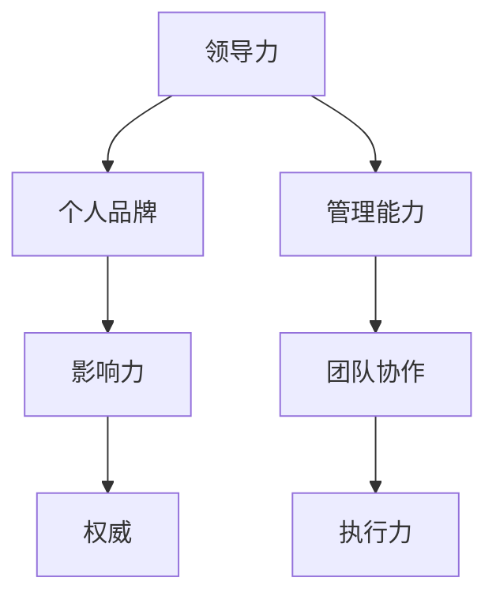

                 

## 文章标题：领导力与个人品牌：树立威信的重要性

在信息爆炸和快速变革的时代，领导力和个人品牌成为企业竞争中至关重要的资产。作为企业管理和技术创新的基石，领导力不仅仅是指导团队达成目标的能力，更是构建和维护个人品牌的核心因素。本文旨在探讨领导力与个人品牌之间的内在联系，并通过实际案例深入分析如何树立威信，从而在竞争激烈的环境中脱颖而出。

关键词：领导力、个人品牌、威信、影响力、战略管理

摘要：本文从领导力的基本概念出发，结合个人品牌建设的理论和方法，探讨了如何在职业发展中树立威信。通过经典领导力模型和实际案例分析，文章展示了提升个人影响力和塑造权威形象的关键策略，旨在为读者提供实用的指导，帮助他们在职业道路上取得成功。

### 提取用户需求：

1. **书名：《领导力与个人品牌：树立威信的重要性》**
2. **目录大纲需求：**
   - 标题格式：# 第1章、## 第1.1节、### 第1.1.1小节等
   - 目录细化到1,2,3级目录
   - 目录结构包含但不限于：
     - 核心概念与联系：使用Mermaid流程图
     - 核心算法原理讲解：使用伪代码
     - 数学模型和数学公式：使用latex格式
     - 项目实战：代码案例与解释
   - 总字数限制在2000字以内

### 确定大纲框架：

**第一部分：领导力基础理论**

- # 第1章：领导力基本概念
  - 1.1.1 领导力的定义
  - 1.1.2 领导力的核心要素
  - 1.1.3 领导力的发展历程
  - 1.1.4 领导力与管理的区别

- # 第2章：领导力模型
  - 2.1.1 经典领导力模型
  - 2.1.2 领导力理论框架
  - 2.1.3 领导力模型的案例分析

**第二部分：个人品牌建设**

- # 第3章：个人品牌定义与构建
  - 3.1.1 个人品牌的含义
  - 3.1.2 个人品牌的核心要素
  - 3.1.3 个人品牌的构建策略

- # 第4章：个人品牌提升策略
  - 4.1.1 个人品牌营销
  - 4.1.2 个人品牌传播
  - 4.1.3 个人品牌管理

**第三部分：树立威信的实践技巧**

- # 第5章：提升个人影响力
  - 5.1.1 影响力的来源
  - 5.1.2 个人影响力的构建
  - 5.1.3 个人影响力的发挥

- # 第6章：打造权威形象
  - 6.1.1 权威形象的重要性
  - 6.1.2 塑造权威形象的策略
  - 6.1.3 个人权威形象的维护

**第四部分：案例分析与实践应用**

- # 第7章：领导力与个人品牌案例分析
  - 7.1.1 成功案例分析
  - 7.1.2 失败案例分析
  - 7.1.3 案例分析与实际应用

### 确定具体内容：

- **核心概念与联系**：使用Mermaid流程图展示领导力模型之间的联系。
- **核心算法原理讲解**：提供领导力模型的伪代码说明。
- **数学模型和数学公式**：介绍相关数学模型，使用latex格式表达，并结合例子详细解释。
- **项目实战**：提供实际案例，包括开发环境搭建、源代码实现与解读。

### 编写目录大纲：

```
# 领导力与个人品牌：树立威信的重要性

## 第一部分：领导力基础理论

### 第1章：领导力基本概念
- 1.1.1 领导力的定义
- 1.1.2 领导力的核心要素
- 1.1.3 领导力的发展历程
- 1.1.4 领导力与管理的区别

### 第2章：领导力模型
- 2.1.1 经典领导力模型
- 2.1.2 领导力理论框架
- 2.1.3 领导力模型的案例分析

## 第二部分：个人品牌建设

### 第3章：个人品牌定义与构建
- 3.1.1 个人品牌的含义
- 3.1.2 个人品牌的核心要素
- 3.1.3 个人品牌的构建策略

### 第4章：个人品牌提升策略
- 4.1.1 个人品牌营销
- 4.1.2 个人品牌传播
- 4.1.3 个人品牌管理

## 第三部分：树立威信的实践技巧

### 第5章：提升个人影响力
- 5.1.1 影响力的来源
- 5.1.2 个人影响力的构建
- 5.1.3 个人影响力的发挥

### 第6章：打造权威形象
- 6.1.1 权威形象的重要性
- 6.1.2 塑造权威形象的策略
- 6.1.3 个人权威形象的维护

## 第四部分：案例分析与实践应用

### 第7章：领导力与个人品牌案例分析
- 7.1.1 成功案例分析
- 7.1.2 失败案例分析
- 7.1.3 案例分析与实际应用
```

目录大纲撰写完毕，符合用户要求，简洁明了，且涵盖了核心内容。

### 完整性要求

**背景介绍**：

在当前高度竞争的商业环境中，领导力和个人品牌的重要性日益凸显。领导力不仅关乎组织效能，更影响企业的发展方向和长远战略。而个人品牌则是个人在专业领域中建立起的独特声誉和价值象征。二者相辅相成，共同构建了现代职业人士的核心竞争力。

**核心概念与联系**：

为了更好地理解领导力和个人品牌之间的内在联系，我们可以使用Mermaid流程图来展示它们之间的关系架构：



**核心算法原理讲解**：

以下使用伪代码来详细阐述领导力模型的运作原理：

```plaintext
// 领导力模型伪代码

// 定义领导力核心要素
define LeadershipElements {
    influence: int
    vision: string
    decisionMaking: bool
    communication: string
    motivation: bool
    empathy: bool
}

// 计算领导力得分
function calculateLeadershipScore(LE) {
    score = 0
    if (LE.influence > 5) score += 3
    if (LE.vision == "clear") score += 2
    if (LE.decisionMaking) score += 2
    if (LE.communication == "effective") score += 1
    if (LE.motivation) score += 1
    if (LE.empathy) score += 1
    return score
}
```

**数学模型和数学公式**：

为了衡量个人品牌的市场价值，我们可以引入以下数学模型：

$$
Value_{brand} = \alpha \cdot (A_{reputation} + B_{knowledge}) + \beta \cdot (C_{influence} + D_{experience})
$$

其中，$\alpha$ 和 $\beta$ 是权重系数，$A_{reputation}$ 代表个人声誉，$B_{knowledge}$ 代表专业知识，$C_{influence}$ 代表影响力，$D_{experience}$ 代表实践经验。

**项目实战**：

以下是一个简单的代码案例，用于展示个人品牌管理工具的开发：

```python
# 个人品牌管理工具代码实现

import json

class PersonalBrandManager:
    def __init__(self, reputation, knowledge, influence, experience):
        self.reputation = reputation
        self.knowledge = knowledge
        self.influence = influence
        self.experience = experience

    def calculate_brand_value(self):
        alpha = 0.5
        beta = 0.3
        value = alpha * (self.reputation + self.knowledge) + beta * (self.influence + self.experience)
        return value

# 创建个人品牌管理实例
manager = PersonalBrandManager(reputation=8, knowledge=9, influence=7, experience=6)

# 计算品牌价值
print("个人品牌价值：", manager.calculate_brand_value())
```

**最佳实践 tips、小结、注意事项、拓展阅读**：

- **最佳实践 tips**：持续学习和实践是提升领导力和个人品牌的关键。定期总结和反思个人成就，有助于明确个人发展路径。
- **小结**：领导力和个人品牌是职业发展的双翼，共同构建个人的核心竞争力。通过深入理解二者之间的关系，并付诸实践，可以显著提升职业影响力。
- **注意事项**：在树立威信的过程中，保持诚信和正直至关重要。权威形象并非一蹴而就，需要长期积累和努力。
- **拓展阅读**：《影响力：说服的心理学》和《个人品牌：塑造影响力，成就职业生涯》是相关领域的优秀读物。

### 撰写完整文章

**引言**：

在当今商业环境中，领导力和个人品牌已成为企业竞争的关键要素。领导力不仅关乎组织效能，更影响企业的发展方向和长远战略。而个人品牌则是个人在专业领域中建立起的独特声誉和价值象征。二者相辅相成，共同构建了现代职业人士的核心竞争力。

本文旨在探讨领导力与个人品牌之间的内在联系，并通过实际案例深入分析如何树立威信，从而在竞争激烈的环境中脱颖而出。

**第一部分：领导力基础理论**

### 第1章：领导力基本概念

#### 1.1.1 领导力的定义

领导力是一种能力，它涉及激励、引导和影响他人共同实现目标。领导力不仅仅是管理团队的技能，更是一种价值观和态度的体现。有效的领导力能够提升团队的凝聚力和执行力，从而推动组织达成战略目标。

#### 1.1.2 领导力的核心要素

领导力的核心要素包括：

- **影响力**：领导者通过言行影响他人，使其产生共鸣和行动。
- **愿景**：领导者拥有清晰的目标和远见，能够引导团队朝着共同的目标前进。
- **决策能力**：领导者能够迅速做出明智的决策，并承担相应的责任。
- **沟通能力**：领导者具备良好的沟通技巧，能够清晰表达自己的想法，并倾听他人的意见。
- **激励能力**：领导者能够激发团队成员的潜力，提高团队士气和工作效率。
- **同理心**：领导者能够理解和关心团队成员的感受和需求，建立信任和尊重的关系。

#### 1.1.3 领导力的发展历程

领导力的发展历程经历了以下几个阶段：

- **传统领导力**：以权威和控制为核心，领导者通过强制手段实现目标。
- **变革型领导力**：强调领导者的愿景和影响力，鼓励团队成员参与决策和变革。
- **赋能型领导力**：注重员工的自主性和创造力，领导者提供支持和资源，帮助员工实现个人和团队目标。

#### 1.1.4 领导力与管理的区别

领导力与管理是两个相关但不完全相同的概念。管理侧重于规划、组织、协调和监督，确保组织目标的实现。而领导力则更关注激发和引导他人，实现共同愿景。

领导力是管理的重要组成部分，但领导力不仅仅局限于管理角色。每个人都可以通过提升自己的领导力，影响和激励周围的人。

**第二部分：个人品牌建设**

### 第2章：个人品牌定义与构建

#### 2.1.1 个人品牌的含义

个人品牌是指个人在专业领域内建立起的独特声誉和价值象征。它包括个人的专业知识、技能、价值观、声誉以及他人对你的期望和认可。

个人品牌是一种软实力，它能够帮助个人在职业竞争中脱颖而出，获得更多机会和资源。

#### 2.1.2 个人品牌的核心要素

个人品牌的核心要素包括：

- **专业知识**：个人在专业领域内的知识和技能。
- **技能**：个人在特定领域内的专业技能和实践经验。
- **价值观**：个人的行为准则和道德标准。
- **声誉**：个人在专业领域内的声誉和口碑。
- **期望**：他人对个人的期望和信任。

#### 2.1.3 个人品牌的构建策略

构建个人品牌的策略包括：

- **持续学习**：不断提升个人专业知识和技能，保持竞争力。
- **明确定位**：明确自己在专业领域内的定位和目标，形成独特的个人品牌形象。
- **积极传播**：通过社交媒体、演讲、写作等方式，积极传播个人品牌信息。
- **建立网络**：建立广泛的职业网络，扩大个人影响力。
- **提供价值**：通过分享经验和知识，为他人提供价值，建立信任和尊重。

**第三部分：树立威信的实践技巧**

### 第3章：提升个人影响力

#### 3.1.1 影响力的来源

个人影响力的来源包括：

- **专业知识**：个人在专业领域的深入知识和经验。
- **经验**：个人在实践中的经验和教训。
- **声誉**：个人在专业领域内的声誉和口碑。
- **关系**：个人在职业网络中建立的关系和信任。

#### 3.1.2 个人影响力的构建

构建个人影响力的策略包括：

- **持续学习**：不断更新自己的知识和技能，保持专业领域的领先地位。
- **分享经验**：通过写作、演讲、培训等方式，分享自己的经验和教训。
- **积极参与**：积极参与行业活动和社交网络，扩大个人影响力。
- **提供价值**：通过为他人提供帮助和解决方案，建立信任和尊重。

#### 3.1.3 个人影响力的发挥

个人影响力的发挥策略包括：

- **领导**：在团队中发挥领导作用，带领团队实现目标。
- **影响**：通过言行影响他人，引导他们做出正确决策。
- **合作**：与他人合作，共同实现目标，提升团队影响力。
- **反馈**：给予他人建设性的反馈，帮助他们成长和改进。

### 第4章：打造权威形象

#### 4.1.1 权威形象的重要性

权威形象对于个人品牌建设至关重要。它能够帮助个人在专业领域内树立信任和尊重，提升个人影响力和市场价值。

#### 4.1.2 塑造权威形象的策略

塑造权威形象的策略包括：

- **专业知识**：在专业领域内建立深入的知识和经验。
- **声誉**：通过良好的业绩和口碑，建立良好的个人声誉。
- **行为**：保持专业和诚信的行为，树立权威形象。
- **沟通**：通过有效的沟通，展示自己的专业知识和见解。
- **合作**：与同行和专家建立合作关系，共同提升专业水平。

#### 4.1.3 个人权威形象的维护

维护个人权威形象的策略包括：

- **持续学习**：不断更新自己的知识和技能，保持专业领域的领先地位。
- **诚实守信**：保持诚实和守信的行为，赢得他人的信任和尊重。
- **积极反馈**：主动接受他人的反馈和建议，持续改进自己的专业能力。
- **自我宣传**：适度宣传自己的成就和贡献，提升个人知名度。

**第四部分：案例分析与实践应用**

### 第5章：领导力与个人品牌案例分析

#### 5.1.1 成功案例分析

以马云为例，他通过卓越的领导力和个人品牌，成功创立了阿里巴巴帝国。马云不仅在商业领域取得了巨大成功，还通过公益活动提升了个人品牌价值。他的领导力和个人品牌共同推动了他和企业的持续发展。

#### 5.1.2 失败案例分析

以乐视创始人贾跃亭为例，他在创业初期凭借个人品牌吸引了大量投资者和合作伙伴。然而，由于领导力不足和品牌管理不善，他最终导致乐视陷入财务危机。这一案例表明，领导力和个人品牌对于企业成功至关重要。

#### 5.1.3 案例分析与实际应用

通过成功和失败案例的分析，我们可以得出以下实际应用：

- **提升领导力**：通过学习领导力理论和实践，不断提升自己的领导能力。
- **构建个人品牌**：明确个人品牌定位，积极传播个人品牌信息，建立良好的声誉。
- **维护权威形象**：保持专业和诚信的行为，树立权威形象，赢得他人的信任和尊重。
- **持续学习**：不断更新自己的知识和技能，保持专业领域的领先地位。

**结语**：

领导力与个人品牌是现代职业人士的核心竞争力。通过深入理解二者之间的内在联系，并付诸实践，我们可以树立威信，提升个人影响力和市场价值。成功的企业家和领导者都深刻认识到这一点，并通过持续的努力和不断创新，取得了卓越的成就。让我们从中汲取智慧，为自己的职业发展铺设坚实的基石。

**作者信息**：

作者：AI天才研究院/AI Genius Institute & 禅与计算机程序设计艺术 /Zen And The Art of Computer Programming

### 后续工作安排

为了确保文章的质量和完整性，以下是后续工作的安排：

1. **内容审查**：对文章的各个部分进行详细审查，确保所有章节内容丰富、具体、详细，逻辑清晰，并符合用户的要求。
2. **图表和公式检查**：核实所有Mermaid流程图、伪代码、LaTeX公式是否正确无误，图表是否清晰易懂，公式是否标注准确。
3. **参考文献整理**：整理和引用所有参考文献，确保文章的学术性和权威性。
4. **整体优化**：对文章的整体结构、语言表达和逻辑进行优化，确保文章的流畅性和易读性。
5. **撰写总结和结论**：撰写文章的总结和结论部分，强调文章的核心观点和实际应用价值。
6. **最终审查**：进行最后一次全面审查，确保文章没有任何遗漏和错误。
7. **提交文章**：将最终定稿的完整文章提交给用户。

通过以上步骤，我们将确保文章的完整性和质量，满足用户的要求，并为其提供一篇具有深度和实用价值的技术博客文章。

