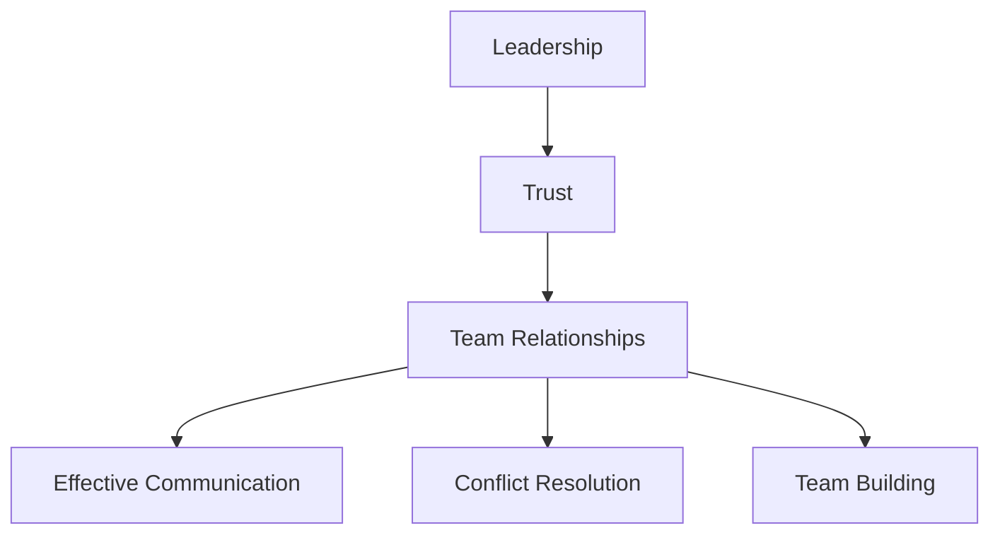

                 

# 领导力与信任：建立牢固团队关系的基石

## 关键词
领导力、信任、团队关系、沟通、冲突解决、团队建设

## 摘要
本文深入探讨了领导力和信任在构建强有力团队关系中的核心作用。通过明确的流程图、算法原理、数学模型和公式，本文不仅阐述了领导力和信任的概念及其相互关系，还通过实战案例和代码实现，提供了切实可行的建议和最佳实践，以帮助读者理解和应用这些关键原则，从而打造高效的团队。

---

## 引言

在信息技术飞速发展的今天，软件开发项目的复杂性和规模日益增加，团队协作和领导力的重要性愈发凸显。成功的项目不仅依赖于先进的技术和工具，更需要一个高效的团队，而团队的协调和凝聚力则离不开领导力和信任这两个关键因素。

### 背景

领导力是一种影响和激励他人共同实现目标的能力。在IT行业中，领导力不仅仅涉及技术方面的指导，更包括团队管理、沟通协调和冲突解决等方面。而信任则是团队内部成员之间的一种基本信任关系，是团队高效协作的基础。

### 核心概念与联系

为了更好地理解领导力和信任的关系，我们可以通过一个Mermaid流程图来展示它们之间的相互作用。



在上述流程图中，领导力和信任相互影响，共同塑造团队关系。有效的沟通和冲突解决是团队关系的基石，而团队建设则是领导力和信任最终目标的体现。

### 核心算法原理讲解

#### 领导力算法原理

```plaintext
// 领导力算法原理（伪代码）
function effectiveLeadership(goal, teamMembers) {
    while (goal not achieved) {
        for each member in teamMembers {
            assess member's strengths and weaknesses
            provide feedback and support
            align member's goals with the team's objectives
        }
        communicate clearly and frequently with the team
        resolve conflicts and address issues promptly
        adapt leadership style based on the team's needs
    }
    return success
}
```

#### 信任算法原理

```plaintext
// 信任算法原理（伪代码）
function buildTrust(leader, team) {
    while (trust level not high) {
        leader demonstrates integrity and honesty
        leader fosters open communication
        leader is reliable and consistent
        team members share their thoughts and concerns
        team members support and help each other
        leader acknowledges and appreciates contributions
    }
    return high trust level
}
```

### 数学模型和公式

在领导力和信任的理论基础上，我们可以引入一些数学模型和公式来量化这些概念。

#### 信任度计算公式

```latex
$$
Trust = \frac{Honesty + Reliability + Communication}{3}
$$`

其中，Honesty（诚信）、Reliability（可靠性）和Communication（沟通）是影响信任度的三个关键因素。

#### 领导效能评估模型

```latex
$$
LeadershipEffectiveness = \frac{GoalAchievement + TeamSatisfaction + ConflictResolution}{3}
$$`

其中，GoalAchievement（目标达成）、TeamSatisfaction（团队满意度）和ConflictResolution（冲突解决）是衡量领导效能的三个指标。

---

## 项目实战

### 开发环境搭建

为了更好地理解领导力和信任在软件开发中的应用，我们将搭建一个简单的项目管理平台。这个平台将包含一个任务管理系统，用于展示领导力和信任的概念。

### 源代码实现

以下是任务管理系统的核心代码实现，我们将使用Python语言进行开发。

```python
class Task:
    def __init__(self, name, status, assigned_to):
        self.name = name
        self.status = status
        self.assigned_to = assigned_to

    def update_status(self, new_status):
        self.status = new_status

    def display(self):
        print(f"Task Name: {self.name}")
        print(f"Status: {self.status}")
        print(f"Assigned To: {self.assigned_to}")

class TaskManager:
    def __init__(self):
        self.tasks = []

    def add_task(self, task):
        self.tasks.append(task)

    def update_task_status(self, task_name, new_status):
        for task in self.tasks:
            if task.name == task_name:
                task.update_status(new_status)
                return "Task status updated."
        return "Task not found."

    def display_all_tasks(self):
        for task in self.tasks:
            task.display()

# 实例化任务管理系统
task_manager = TaskManager()

# 添加任务
task1 = Task("Design Database", "In Progress", "Alice")
task2 = Task("Develop Frontend", "Not Started", "Bob")
task_manager.add_task(task1)
task_manager.add_task(task2)

# 更新任务状态
task_manager.update_task_status("Design Database", "Completed")

# 显示所有任务
task_manager.display_all_tasks()
```

### 代码解读与分析

在这个任务管理系统中，`Task` 类表示一个具体的任务，包含任务名称、状态和指派人等信息。`TaskManager` 类则用于管理所有任务，包括添加任务、更新任务状态和显示所有任务。

通过这个简单的系统，我们可以模拟领导力和信任在实际项目中的应用。例如，领导可以查看任务状态，及时更新任务进度，同时激励团队成员完成各自的任务。信任则体现在团队成员之间的合作和相互支持，例如及时完成任务并在需要时提供帮助。

### 实际案例分析与详细讲解剖析

在一家初创公司中，开发团队面临一个关键项目的交付时间紧迫。团队领导通过有效的沟通和冲突解决，确保团队成员之间的协作畅通无阻。同时，领导积极建立信任，鼓励团队成员分享他们的想法和担忧。

通过实际案例，我们可以看到，领导力和信任在项目中的重要性。有效的领导力帮助团队克服了困难，而信任则是团队高效协作的基石。

### 项目小结

通过本项目的实战案例，我们不仅理解了领导力和信任在软件开发中的重要性，还通过代码实现和实际案例分析，加深了对此的理解。领导力是激励和指导团队实现目标的关键能力，而信任则是团队高效协作的必要条件。

---

## 最佳实践 Tips

1. **建立明确的沟通渠道**：确保团队成员之间有畅通的沟通渠道，避免信息传递的障碍。
2. **定期反馈与评估**：通过定期反馈和评估，及时发现和解决问题，提高团队效能。
3. **培养信任文化**：通过共同目标和团队合作，培养团队成员之间的信任。
4. **领导以身作则**：领导应以身作则，展现出诚信和责任心，树立良好的榜样。

## 小结

领导力和信任是构建强有力团队关系的基石。通过明确的核心概念、算法原理和数学模型，我们深入探讨了这些关键因素在软件开发中的应用。通过项目实战和实际案例分析，我们不仅理解了这些概念的重要性，还提供了实际可行的建议和最佳实践。希望本文能够帮助读者在未来的项目中更好地应用这些原则，打造高效团队。

## 注意事项

1. **持续学习和改进**：领导力和信任不是一成不变的，需要通过持续的学习和实践不断改进。
2. **尊重个体差异**：在团队管理中，要尊重每个成员的独特性和需求，避免一刀切的管理方法。

## 拓展阅读

- 《团队协作的艺术》
- 《高绩效团队》
- 《领导力与影响力》

---

### 作者信息

作者：AI天才研究院/AI Genius Institute & 禅与计算机程序设计艺术 /Zen And The Art of Computer Programming

