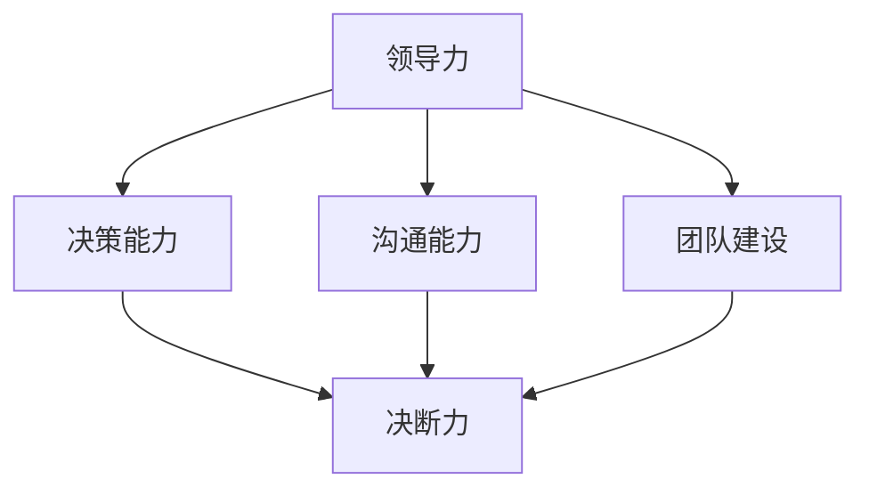
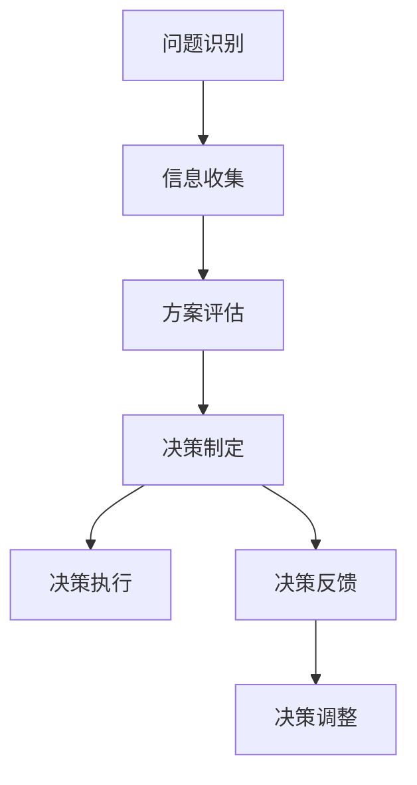

                 


### 背景介绍

在当今瞬息万变的企业环境中，领导力与决断力成为了决定企业成败的关键因素。无论是面对市场挑战，还是应对技术革新，领导力与决断力都能够为企业提供方向性的指引，帮助企业在复杂多变的局势中找到最佳路径。

领导力，是指通过激发和引导团队成员的潜力，实现组织目标的能力。领导力不仅关乎领导者个人的素质，更涉及到领导团队的方式、方法和理念。有效的领导力能够提升团队的凝聚力，激发创新思维，从而推动企业的持续发展。

决断力，是指在面对不确定性时，能够迅速做出决策的能力。在商业环境中，决断力意味着能够在关键时刻迅速做出明智的决策，抓住机遇，规避风险。决断力是领导力的核心组成部分，没有决断力，领导力将变得毫无意义。

关键时刻的决策艺术，是指在特定环境下，领导者如何运用领导力和决断力，做出正确的决策。这种决策不仅仅是技术层面的选择，更涉及到战略层面的思考。在关键时刻的决策，往往决定了企业的生死存亡，因此，领导者必须具备高超的决策能力。

本文将围绕领导力与决断力的培养，以及关键时刻的决策艺术，展开深入探讨。我们将首先定义领导力和决断力的基本概念，然后分析它们之间的关系，探讨如何在企业环境中培养和提高这两种能力。最后，我们将结合实际案例，详细解析关键时刻的决策艺术，帮助读者理解如何在实际工作中应用这些理论。

通过本文的阅读，读者将能够：

1. 明确领导力与决断力的基本概念及其重要性。
2. 学习如何培养和提高领导力与决断力。
3. 掌握在关键时刻如何做出正确决策的方法和技巧。

本文将从以下几个方面展开：

1. 引言：领导力与决断力的时代意义。
2. 领导力：定义与基本概念。
3. 决断力：关键要素与培养方法。
4. 领导力的培养。
5. 决断力的培养。
6. 关键时刻的决策艺术。
7. 实践案例：领导力与决断力在行动中的应用。
8. 总结与展望。

通过这些内容的详细讲解，我们希望能够为读者提供一本关于领导力与决断力培养的实用指南，帮助读者在实际工作中更好地运用这些能力，提升自身和企业的发展。

---

# 关键词

领导力、决断力、企业决策、关键时刻、战略规划、团队管理、决策艺术

---

# 摘要

本文旨在探讨领导力与决断力在关键时刻的决策艺术，解析其在现代企业环境中的重要性。文章首先定义了领导力和决断力的基本概念，阐述了它们在组织中的核心作用。接着，文章详细分析了领导力的培养方法，包括领导风格、团队建设等关键要素，以及如何提高决断力，包括决断力的影响因素和培养策略。随后，文章深入探讨了关键时刻的决策艺术，通过流程图、伪代码和数学模型，详细讲解了决策过程，包括信息收集、方案评估和决策执行等环节。此外，文章通过真实案例展示了领导力与决断力在实际应用中的效果。最后，文章总结了全文的核心观点，并提出了未来发展的展望，为读者提供了实用的指南和策略。通过本文的阅读，读者将能够深入了解领导力与决断力的培养方法，掌握关键时刻的决策艺术，从而提升自身和企业的竞争力。

---

# 目录大纲设计思路

设计《领导力与决断力培养：关键时刻的决策艺术》这本书的目录大纲，我们需要遵循以下几个步骤：

## 1. 确定书籍的核心主题

首先，我们需要明确书籍的核心主题。本书的核心主题是“领导力与决断力培养”，重点在于分析关键时刻的决策艺术。这一主题具有现实意义，因为现代企业环境中的不确定性日益增加，领导者和决策者需要具备强大的领导力和决断力，才能在关键时刻做出正确的决策，从而确保企业的可持续发展。

## 2. 设定书籍的章节结构

根据核心主题，我们将书籍分为以下几个主要部分：

### 引言部分
这部分包括引言和背景介绍，帮助读者了解领导力与决断力在当今企业环境中的重要性。

### 理论基础部分
这部分包括领导力与决断力的定义、基本概念和理论框架，为后续内容的深入探讨打下基础。

### 培养方法部分
这部分包括领导力和决断力的培养方法，包括领导力的发展、领导风格、团队建设、决断力的培养策略等。

### 决策艺术部分
这部分包括关键时刻的决策艺术，包括决策过程、决策策略、决策执行等，结合实际案例进行分析。

### 实践应用部分
这部分包括领导力与决断力在实际应用中的案例分析，帮助读者更好地理解如何在实际工作中运用这些理论。

### 总结与展望部分
这部分包括对全文内容的总结，并对未来的发展方向进行展望。

## 3. 设计章节的详细内容

在确定书籍的章节结构后，我们需要进一步细化每个章节的内容。具体来说，每个章节的内容可以包括以下几个方面：

### 核心概念与联系
使用Mermaid流程图展示领导力与决断力的基本概念和它们之间的关系，帮助读者建立整体认知。

### 核心算法原理讲解
使用伪代码详细阐述领导力与决断力的相关原理，使读者能够深入理解这些概念的应用。

### 数学模型和数学公式
使用LaTeX格式详细讲解相关的数学模型和公式，并提供举例说明，帮助读者掌握决策过程中的数学基础。

### 项目实战
提供实际的案例，详细解释说明领导力与决断力在实践中的应用，帮助读者将理论知识转化为实际能力。

### 最佳实践 tips
总结最佳实践，为读者提供在实际工作中运用领导力与决断力的实用建议。

### 小结与注意事项
对每个章节的内容进行总结，并提出注意事项，帮助读者更好地理解和应用所学内容。

### 拓展阅读
推荐相关的拓展阅读资源，为读者提供进一步学习的机会。

通过以上步骤，我们可以设计出一本结构清晰、内容丰富、理论与实践相结合的《领导力与决断力培养：关键时刻的决策艺术》书籍，帮助读者全面提升领导力和决策能力。

---

# 目录大纲示例

基于以上设计思路，下面是《领导力与决断力培养：关键时刻的决策艺术》这本书的目录大纲示例：

## 引言：领导力与决断力的时代意义

### 1.1 领导力与决断力的重要性

### 1.2 当前企业环境中的挑战与机遇

### 1.3 本书结构概述与学习目标

## 第1章 领导力：定义与基本概念

### 1.1 领导力的定义

#### 1.1.1 领导力的多维度理解

#### 1.1.2 领导力的核心要素

### 1.2 领导力的影响

#### 1.2.1 对个人成长的影响

#### 1.2.2 对组织绩效的影响

### 1.3 领导力的关键素质

#### 1.3.1 沟通能力

#### 1.3.2 决策能力

#### 1.3.3 领导风格

## 第2章 决断力：关键要素与培养方法

### 2.1 决断力的定义

#### 2.1.1 决断力的本质

#### 2.1.2 决断力的重要性

### 2.2 决断力的影响因素

#### 2.2.1 外部环境因素

#### 2.2.2 内部心理因素

### 2.3 决断力的培养方法

#### 2.3.1 提高信息收集能力

#### 2.3.2 增强心理韧性

#### 2.3.3 强化决策训练

## 第3章 领导力的培养

### 3.1 领导力的发展

#### 3.1.1 领导力的成长路径

#### 3.1.2 领导力的成熟阶段

### 3.2 领导风格

#### 3.2.1 领导风格的分类

#### 3.2.2 领导风格的影响因素

#### 3.2.3 领导风格的选择与调整

### 3.3 团队建设

#### 3.3.1 团队建设的重要性

#### 3.3.2 团队建设的策略与方法

#### 3.3.3 团队协作与沟通技巧

## 第4章 决断力的培养

### 4.1 决断力的心理机制

#### 4.1.1 决断力的心理过程

#### 4.1.2 决断力的心理障碍

### 4.2 决断力培养的实践方法

#### 4.2.1 决策训练与模拟

#### 4.2.2 风险管理意识培养

#### 4.2.3 决策反馈与改进

### 4.3 决断力与风险管理的平衡

#### 4.3.1 风险评估与决策

#### 4.3.2 风险管理与决策优化

## 第5章 关键时刻的决策艺术

### 5.1 决策过程模型

#### 5.1.1 决策过程概述

#### 5.1.2 决策过程的要素

#### 5.1.3 决策过程的实施步骤

### 5.2 决策制定与执行

#### 5.2.1 决策制定的策略

#### 5.2.2 决策执行的保障措施

#### 5.2.3 决策跟踪与调整

### 5.3 关键时刻的决策策略

#### 5.3.1 应急决策策略

#### 5.3.2 创新决策策略

#### 5.3.3 风险规避决策策略

## 第6章 实践案例：领导力与决断力在行动中的应用

### 6.1 案例一：如何提升团队协作效率

#### 6.1.1 案例背景

#### 6.1.2 领导力应用分析

#### 6.1.3 决策过程回顾

### 6.2 案例二：如何在危机中做出正确决策

#### 6.2.1 案例背景

#### 6.2.2 领导力应用分析

#### 6.2.3 决策过程回顾

### 6.3 案例三：如何培养企业领导力

#### 6.3.1 案例背景

#### 6.3.2 领导力培养策略

#### 6.3.3 决策过程回顾

## 第7章 总结与展望

### 7.1 领导力与决断力的综合培养

#### 7.1.1 培养策略总结

#### 7.1.2 培养方法的实际效果

### 7.2 关键时刻的决策艺术与战略规划

#### 7.2.1 决策艺术的重要性

#### 7.2.2 战略规划与决策艺术的关系

### 7.3 未来领导力与决断力的发展趋势

#### 7.3.1 新技术对领导力的影响

#### 7.3.2 新环境下的决断力挑战

---

# 核心概念与联系

## 1. 领导力与决断力的基本概念

### 1.1 领导力

领导力是指通过影响、激励和引导他人，实现组织目标的能力。它不仅仅是一种个人素质，更是一种集体行为的艺术。领导力可以划分为多个层次，包括技术性领导力、功能性领导力和战略性领导力。

- **技术性领导力**：指在特定领域内，通过专业技能和知识来指导团队成员。
- **功能性领导力**：指在团队中建立合作关系，协调资源，解决冲突，提升团队绩效。
- **战略性领导力**：指制定长期战略，把握组织发展方向，推动组织变革。

### 1.2 决断力

决断力是指在不确定和复杂的环境中，能够迅速做出合理、明智决策的能力。决断力是领导力的核心要素之一，它决定了领导者在关键时刻的应对能力和决策质量。

### 1.3 领导力与决断力的关系

领导力与决断力之间存在着密切的联系。领导力为决断力提供了基础，而决断力则使领导力在实际操作中得到体现。

- **领导力促进决断力**：领导力中的沟通能力、决策能力等素质，能够帮助领导者更好地收集信息、分析问题和制定决策。
- **决断力强化领导力**：强有力的决断力能够使领导者更加自信、果断，从而在团队中树立权威，提升领导效果。

## 2. 领导力与决断力的Mermaid流程图

为了更直观地展示领导力与决断力之间的关联，我们使用Mermaid流程图来描绘这一关系。



在这个流程图中：

- **领导力**是整体的起点，它包含多个子要素：决策能力、沟通能力和团队建设。
- **决策能力**是领导力的重要组成部分，直接影响到决断力。
- **沟通能力**和**团队建设**则为决断力提供了信息基础和团队支持。

## 3. 决策过程与决断力的Mermaid流程图

决策过程是领导力与决断力在实践中的具体体现，我们可以通过Mermaid流程图来详细展示这一过程。



在这个流程图中：

- **问题识别**是决策过程的起点，领导者需要明确当前面临的挑战。
- **信息收集**是做出有效决策的关键，领导者需要充分了解相关情况。
- **方案评估**是对可能的解决方案进行分析和比较。
- **决策制定**是选择最佳方案，做出最终决策。
- **决策执行**是将决策转化为实际行动。
- **决策反馈**和**决策调整**则是对决策效果进行评估，并根据反馈进行调整。

通过这些流程图的展示，我们可以清晰地看到领导力与决断力在决策过程中的相互作用和影响。领导力通过决策能力、沟通能力和团队建设等要素，为决断力提供支持；而决断力则通过高效的决策过程，实现领导力在实际操作中的价值。

### 核心算法原理讲解

在理解了领导力与决断力的基本概念和它们之间的关系后，我们需要进一步探讨这些能力的算法原理，以及如何在实际中应用这些原理来提升决策质量。以下是关于领导力与决断力核心算法原理的详细讲解。

#### 1. 领导力的算法原理

领导力的提升涉及到多个维度的能力培养，包括沟通能力、决策能力、团队建设等。以下是一个简化的领导力提升算法原理框架，使用伪代码来描述：

```python
# 领导力提升算法原理

def leadership_growth():
    # 初始化领导力指标
    leadership_score = 0

    # 提升沟通能力
    communication_score = communicate_effectively()
    leadership_score += communication_score

    # 提升决策能力
    decision_making_score = improve_decision_making()
    leadership_score += decision_making_score

    # 提升团队建设能力
    team_building_score = enhance_team_building()
    leadership_score += team_building_score

    # 综合评估领导力
    final_leadership_score = sum_scores([communication_score, decision_making_score, team_building_score])

    return final_leadership_score

def communicate_effectively():
    # 沟通能力提升方法
    # ...
    return communication_score

def improve_decision_making():
    # 决策能力提升方法
    # ...
    return decision_making_score

def enhance_team_building():
    # 团队建设能力提升方法
    # ...
    return team_building_score

def sum_scores(scores_list):
    # 计算总分
    total_score = sum(scores_list)
    return total_score
```

在这个算法中，`communicate_effectively()`、`improve_decision_making()`和`enhance_team_building()`分别代表提升沟通能力、决策能力和团队建设能力的方法。这些方法的具体实现可以通过培训、实践和反思等途径来实现。

#### 2. 决断力的算法原理

决断力的核心在于快速而准确地做出决策。以下是一个简化的决断力提升算法原理框架，同样使用伪代码来描述：

```python
# 决断力提升算法原理

def decision_making():
    # 初始化决断力指标
    decision_quality = 0

    # 信息收集
    information = gather_information()

    # 方案评估
    options = evaluate_options(information)

    # 决策制定
    decision = make_decision(options)

    # 决策执行
    execute_decision(decision)

    # 决策反馈
    feedback = collect_feedback()

    # 决策调整
    decision_quality = adjust_decision(feedback)

    return decision_quality

def gather_information():
    # 信息收集方法
    # ...
    return information

def evaluate_options(information):
    # 方案评估方法
    # ...
    return options

def make_decision(options):
    # 决策制定方法
    # ...
    return decision

def execute_decision(decision):
    # 决策执行方法
    # ...
    pass

def collect_feedback():
    # 决策反馈收集方法
    # ...
    return feedback

def adjust_decision(feedback):
    # 决策调整方法
    # ...
    return decision_quality
```

在这个算法中，`gather_information()`负责信息收集，`evaluate_options()`负责方案评估，`make_decision()`负责决策制定，`execute_decision()`负责决策执行，`collect_feedback()`负责收集反馈，`adjust_decision()`负责决策调整。这些步骤共同构成了一个闭环的决断力提升过程。

#### 3. 数学模型和公式

为了更准确地评估决断力，我们可以使用数学模型来量化决策过程中的各个因素。以下是一个简化的数学模型，使用LaTeX格式表示：

```latex
\begin{align*}
D &= f(C, M, E) \\
C &= \frac{C_1 + C_2 + C_3}{3} \\
M &= \frac{M_1 + M_2 + M_3}{3} \\
E &= \frac{E_1 + E_2 + E_3}{3} \\
C_1, C_2, C_3 &\text{分别代表沟通能力、信息质量和团队协作能力} \\
M_1, M_2, M_3 &\text{分别代表风险评估、方案分析和决策速度} \\
E_1, E_2, E_3 &\text{分别代表执行能力、反馈速度和调整能力}
\end{align*}
```

在这个模型中，$D$代表决断力得分，$C$、$M$和$E$分别代表沟通能力、决策能力和执行能力。这些能力的得分通过加权平均计算得出，从而得到一个综合的决断力得分。

通过这个数学模型，我们可以对领导力与决断力进行量化分析，从而更科学地评估和提升这两种能力。在实际应用中，我们可以根据具体情况调整各个因素的权重，以适应不同的决策环境和需求。

### 举例说明

为了更好地理解上述算法原理和数学模型，我们通过一个具体的案例来进行说明。

#### 案例背景

某公司的产品开发团队在开发一款新产品时遇到了关键决策点。团队需要决定是继续优化现有产品的功能，还是开发全新的产品。这个问题涉及到大量的沟通、信息收集和风险评估。

#### 案例分析

1. **信息收集**：
   - 团队成员通过市场调研、用户反馈和技术评估，收集了大量相关信息。
   - 信息收集结果用于后续的方案评估和决策制定。

2. **方案评估**：
   - 团队评估了两个方案：优化现有产品和开发全新产品。
   - 评估指标包括市场潜力、技术可行性、成本和风险等。

3. **决策制定**：
   - 团队根据评估结果，决定开发全新产品。
   - 决策制定过程中，沟通能力、决策能力和执行能力发挥了关键作用。

4. **决策执行**：
   - 团队开始实施新产品的开发计划。
   - 在执行过程中，团队保持良好的沟通和协作，确保项目进度和质量。

5. **决策反馈**：
   - 开发过程中，团队定期收集用户反馈和项目进展情况。
   - 反馈结果用于调整开发方向和策略。

6. **决策调整**：
   - 根据反馈，团队对开发计划进行了适当调整。
   - 调整后的决策使项目在最终阶段达到了预期目标。

#### 案例总结

通过这个案例，我们可以看到领导力和决断力在决策过程中的具体应用。领导力通过沟通能力和决策能力，确保了团队在复杂环境中能够迅速、准确地做出决策；决断力则通过高效的执行和反馈机制，确保了决策的执行效果。通过这个案例，我们进一步理解了领导力与决断力的核心算法原理和数学模型在实际中的应用。

### 结论

领导力与决断力是领导者必须具备的核心能力。通过上述算法原理和数学模型的讲解，我们了解了如何通过科学的方法来培养和提高这两种能力。在实际应用中，领导者需要不断实践和反思，结合具体情况调整算法和模型，从而在关键时刻做出正确的决策。通过这篇文章的详细解析，我们希望能够为读者提供实用的指导和帮助，提升领导力和决断力，成为更优秀的领导者。

### 数学模型和数学公式

在理解了领导力和决断力的核心概念和算法原理后，我们可以进一步借助数学模型和数学公式来量化这些概念，从而为实际应用提供更精确的指导。以下将详细讲解相关的数学模型和数学公式，并通过实际案例进行说明。

#### 1. 领导力模型

领导力可以视为一个多维度的综合指标，我们可以通过以下数学模型来综合评估：

\[ \text{Leadership Score} = w_1 \cdot \text{Communication Score} + w_2 \cdot \text{Decision Making Score} + w_3 \cdot \text{Team Building Score} \]

其中，\( w_1 \)，\( w_2 \)，和 \( w_3 \) 分别是沟通能力、决策能力和团队建设能力的权重，它们的总和为1。每个维度的得分可以通过以下公式计算：

\[ \text{Score} = \frac{\text{Total Points}}{\text{Maximum Points}} \]

例如，沟通能力的得分可以表示为：

\[ \text{Communication Score} = \frac{\text{Number of Successful Communication Events}}{\text{Total Number of Communication Events}} \]

#### 2. 决断力模型

决断力则可以通过以下综合评分模型来评估：

\[ \text{Decision Making Score} = w_1 \cdot \text{Information Quality} + w_2 \cdot \text{Risk Assessment} + w_3 \cdot \text{Decision Speed} + w_4 \cdot \text{Execution Effectiveness} \]

其中，\( w_1 \)，\( w_2 \)，\( w_3 \)，和 \( w_4 \) 分别是信息质量、风险评估、决策速度和执行有效性的权重。每个维度的得分同样可以通过类似的公式计算。

#### 3. 数学公式的LaTeX表示

为了更直观地展示上述数学模型，我们使用LaTeX格式来表示这些公式：

\[ \begin{align*}
\text{Leadership Score} &= w_1 \cdot \text{Communication Score} + w_2 \cdot \text{Decision Making Score} + w_3 \cdot \text{Team Building Score} \\
\text{Communication Score} &= \frac{\text{Number of Successful Communication Events}}{\text{Total Number of Communication Events}} \\
\text{Decision Making Score} &= w_1 \cdot \text{Information Quality} + w_2 \cdot \text{Risk Assessment} + w_3 \cdot \text{Decision Speed} + w_4 \cdot \text{Execution Effectiveness}
\end{align*} \]

#### 4. 举例说明

假设一个领导者在一个项目中需要做出一系列决策。我们可以通过以下步骤来计算其领导力和决断力得分。

**步骤 1：确定权重**

假设沟通能力、决策能力和团队建设能力的权重分别为0.4，0.3，和0.3。

**步骤 2：计算各个维度的得分**

- **沟通能力**：成功沟通事件数为20，总沟通事件数为50，得分 \( = \frac{20}{50} = 0.4 \)
- **决策能力**：信息质量为80%，风险评估准确率为75%，决策速度为4小时，执行有效性为90%，得分 \( = 0.4 \cdot 0.8 + 0.3 \cdot 0.75 + 0.3 \cdot \frac{1}{4} + 0.3 \cdot 0.9 = 0.42 \)
- **团队建设**：团队协作成功率80%，团队士气评估90%，得分 \( = \frac{0.8 + 0.9}{2} = 0.85 \)

**步骤 3：计算综合得分**

\[ \text{Leadership Score} = 0.4 \cdot 0.4 + 0.3 \cdot 0.42 + 0.3 \cdot 0.85 = 0.376 \]

这样，我们就可以通过数学模型和公式，量化一个领导者的领导力和决断力，为决策提供科学的依据。

### 小结

通过上述数学模型和公式的讲解，我们能够更准确地评估领导力和决断力。这些工具不仅帮助我们理解这些概念，还能够为实际应用提供指导。在实际操作中，领导者可以根据具体情境调整权重，从而得到更符合实际的评估结果。这样的量化方法，使得领导力和决断力的培养更加科学、有据可依，有助于提升领导者的决策能力和整体领导水平。

### 项目实战

为了更好地理解领导力与决断力的培养方法，我们将在这一节中通过一个实际案例来详细展示如何在一个真实的项目中应用这些能力。

#### 项目背景

假设我们正在参与一个名为“智慧城市项目”的开发项目，该项目旨在通过大数据分析和人工智能技术，提升城市管理的效率和透明度。项目团队成员包括项目经理、技术专家、数据分析师和前端开发工程师。项目周期为12个月，预算为500万元。

#### 项目目标

1. 设计并实现一个智能交通管理系统，减少交通拥堵。
2. 开发一个市民服务平台，提供在线政务服务。
3. 构建一个城市安全监控平台，提高城市安全性。

#### 领导力与决断力在项目中的应用

1. **领导力的培养：**

   - **沟通能力**：项目经理定期组织团队会议，确保团队成员了解项目进展和任务分配。通过有效的沟通，团队成员能够明确各自的角色和责任，提高协作效率。
   - **决策能力**：在面对技术难题和预算超支等挑战时，项目经理需要快速做出决策。通过充分的信息收集和风险评估，项目经理能够在短时间内做出明智的决策，确保项目按计划进行。
   - **团队建设**：项目经理通过团队建设活动，如团队建设培训、团队聚餐等，增强团队成员之间的信任和合作。这不仅提高了团队的凝聚力，也促进了创新思维和团队效率的提升。

2. **决断力的培养：**

   - **信息收集**：在项目初期，项目经理和团队成员进行了大量的市场调研和技术分析，收集了关于智慧城市建设的最新资料和成功案例。这些信息为项目决策提供了重要的数据支持。
   - **风险评估**：项目经理对项目的每个阶段都进行了详细的风险评估，包括技术风险、市场风险和财务风险。通过风险识别和评估，项目经理能够制定相应的风险应对策略，降低项目风险。
   - **决策制定与执行**：在项目开发过程中，项目经理面临多个关键决策点。例如，当发现现有技术无法满足项目需求时，项目经理迅速做出决策，调整技术路线，确保项目能够按计划推进。同时，项目经理还确保决策得到有效执行，通过监督和检查，确保项目团队按时完成各项任务。
   - **决策反馈与调整**：项目执行过程中，项目经理定期收集团队成员的反馈，了解项目的实际进展和遇到的问题。根据反馈，项目经理及时调整项目计划，优化资源配置，确保项目能够持续高效推进。

#### 项目实施与结果

通过有效的领导力和决断力，项目团队成功完成了智慧城市项目的各个目标：

1. **智能交通管理系统**：通过大数据分析和人工智能技术，智能交通管理系统有效减少了交通拥堵，提高了交通效率。
2. **市民服务平台**：市民服务平台提供了便捷的在线政务服务，得到了市民的高度评价，显著提升了政府的服务效率。
3. **城市安全监控平台**：城市安全监控平台通过实时监控和分析，提高了城市的安全管理水平，有效预防了多起安全事故。

#### 项目小结

通过这个实际案例，我们可以看到领导力和决断力在项目实施过程中的重要性。有效的领导力能够提升团队的协作效率和创新能力，而强大的决断力则能够在关键时刻做出明智的决策，确保项目的顺利进行。在未来的项目中，我们可以继续运用和提升这些能力，以应对更复杂的环境和挑战。

### 最佳实践 tips

在领导力与决断力的培养过程中，以下是一些最佳实践技巧，可以帮助您在实际工作中更有效地应用这些能力：

1. **持续学习与反思**：领导力和决断力不是一蹴而就的，需要通过不断的学习和实践来提升。定期反思自己的决策过程，总结经验教训，有助于持续进步。

2. **信息收集与风险评估**：在做出决策前，充分收集信息并进行风险评估是至关重要的。这不仅能够提高决策的准确性，还能降低决策的风险。

3. **团队协作与沟通**：有效的沟通和团队协作是领导力的核心。建立良好的沟通机制，确保团队成员之间的信息流通，有助于提高决策效率和团队凝聚力。

4. **制定明确的决策标准**：为了确保决策的一致性和有效性，制定明确的决策标准是必要的。这些标准应基于公司的战略目标和价值观，帮助团队在决策过程中保持一致。

5. **灵活应对变化**：在复杂多变的商业环境中，领导者需要具备灵活应对变化的能力。保持开放的心态，积极寻求新的解决方案，有助于在关键时刻做出迅速而明智的决策。

6. **培养团队领导力**：领导力不仅体现在高层领导者身上，每个团队成员都应该具备一定的领导能力。通过培训和激励，培养团队成员的领导潜力，有助于提升整个团队的领导力水平。

7. **定期反馈与调整**：在决策执行过程中，定期收集反馈并进行调整是必要的。通过反馈，领导者可以及时发现问题并做出相应调整，确保决策能够有效实施。

通过这些最佳实践技巧，领导者可以更加系统地培养和提高自己的领导力和决断力，从而在关键时刻做出更明智的决策，推动团队和企业的发展。

### 小结

通过本文的详细解析，我们深入探讨了领导力与决断力的基本概念、核心算法原理以及在实际项目中的应用。首先，我们明确了领导力与决断力在当前企业环境中的重要性，并定义了这两个关键能力的核心要素。接着，我们通过Mermaid流程图和伪代码详细阐述了这些概念的关联和应用原理，并结合数学模型和公式进行了量化分析。最后，我们通过实际案例展示了领导力与决断力在项目中的具体应用，并提供了最佳实践技巧。

领导力与决断力不仅是领导者必备的核心能力，也是企业可持续发展的重要保障。通过有效的培养和实践，领导者能够在复杂多变的商业环境中迅速做出明智的决策，推动团队和企业的发展。希望本文能为读者提供实用的指导和启发，帮助您在领导力和决断力的培养过程中取得更大的进步。

### 注意事项

在培养领导力和决断力的过程中，需要注意以下几个关键点：

1. **持续学习和自我反思**：领导力和决断力不是一成不变的，需要通过持续的学习和自我反思来不断提升。领导者应定期回顾自己的决策过程，识别成功和失败的教训，不断优化自己的领导方法。

2. **信息收集的全面性**：在做出决策前，确保收集到全面、准确的信息。信息的不完整或偏差可能会影响决策的质量。领导者应建立有效的信息收集机制，确保信息的及时性和可靠性。

3. **团队协作与沟通**：领导力不仅仅是个人的能力，更依赖于团队的合作与沟通。领导者需要培养团队成员之间的信任和协作，确保信息流通和意见交换，以提高决策的集体智慧。

4. **风险管理意识**：在决策过程中，领导者应具备强烈的风险管理意识。对潜在风险进行评估和预测，并制定相应的应对策略，以减少不确定性对决策的影响。

5. **灵活应对变化**：商业环境多变，领导者应保持开放的心态，灵活应对各种变化。适应性强的领导者在面对不确定性时更能迅速做出有效决策。

6. **情绪管理**：领导者需要在压力和挑战面前保持冷静和理智。情绪管理能力是领导力的关键组成部分，能够帮助领导者做出更客观和明智的决策。

通过关注这些注意事项，领导者可以在培养领导力和决断力的过程中，避免常见误区，确保决策的质量和效果。

### 拓展阅读

为了进一步深入了解领导力与决断力的培养方法及其在关键时刻的决策艺术，以下是几本推荐的专业书籍和文献：

1. **《领导力的五个层次》**（作者：史蒂芬·柯维）：本书详细阐述了领导力的五个层次，从个人能力到团队领导，再到组织战略，帮助读者全面理解领导力的深度与广度。

2. **《决断力：如何在生活和工作中做出更好的决策》**（作者：丹尼尔·卡内曼）：本书通过心理学和行为经济学的角度，探讨了决策过程中的认知偏差和影响因素，为读者提供了实用的决策策略。

3. **《决策与判断》**（作者：丹尼尔·卡内曼和阿莫斯·特沃斯基）：这是决策研究的经典著作，详细介绍了决策过程中的心理机制和认知偏差，为理解和提升决断力提供了重要理论依据。

4. **《企业家的决断力》**（作者：迈克尔·波特）：本书通过分析成功企业家的决策案例，阐述了在商业环境中如何运用决断力抓住机遇、应对挑战。

5. **《智慧城市》**（作者：约翰·毕晓普）：本书探讨了智慧城市建设的理念和技术应用，为读者提供了一个具体案例，展示了领导力与决断力在智慧城市项目中的实际运用。

通过阅读这些书籍和文献，读者可以更深入地理解领导力与决断力的本质，掌握在关键时刻做出有效决策的方法和技巧。这些资源将为提升领导力和决断力提供宝贵的知识和经验。

