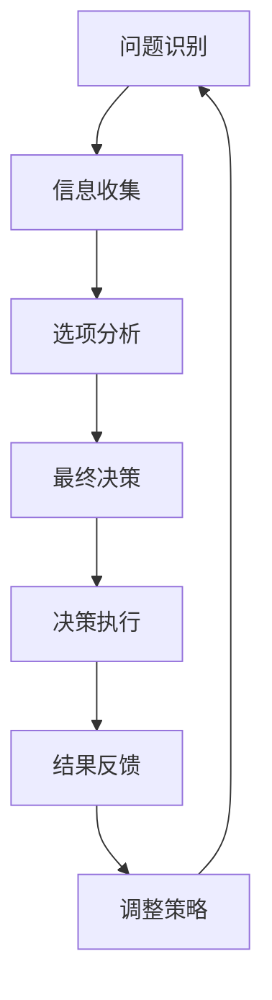
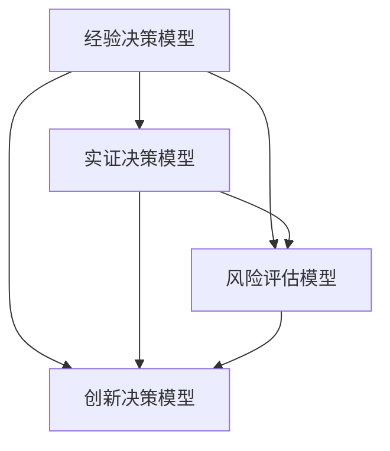
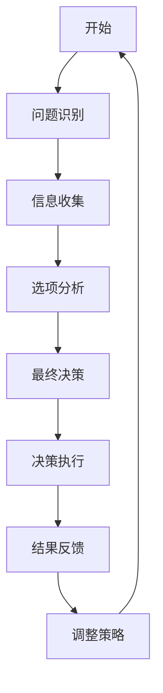

                 

### 文章标题

# 《领导力与决断力：果断做出艰难决策的能力》

### 关键词

- 领导力
- 决断力
- 决策能力
- 团队协作
- 创新思维
- 风险评估

### 摘要

本文深入探讨了领导力与决断力的关系，揭示了在复杂多变的技术环境中，领导者如何通过有效的决策过程和策略，实现团队目标并提升整体竞争力。文章首先定义了领导力和决断力的基本概念，分析了它们在技术项目管理中的应用。接着，文章从构建领导者的核心素质、决策过程与模型、决策方法与技巧、心理学策略以及实践中的应用等多个维度进行了详细阐述。通过实际案例和代码解读，本文旨在为技术领导者提供一套系统的决断力提升方案，以帮助他们更好地应对挑战和机遇。

### 目录

## 第一部分：领导力的本质与内涵

### 第1章 领导力与决策力的关系

#### 1.1.1 领导力的定义与作用

#### 1.1.2 决策力的定义与作用

#### 1.1.3 领导力与决策力的内在联系

### 第2章 领导者的核心素质

#### 2.1.1 自我认知与情绪管理

#### 2.1.2 沟通能力与团队协作

#### 2.1.3 创新思维与学习能力

## 第二部分：构建有效的决断力体系

### 第3章 决策过程与决策模型

#### 3.1.1 决策过程的五个阶段

#### 3.1.2 决策模型的选择与应用

#### 3.1.3 决策心理学与行为经济学

### 第4章 高效决策的方法与技巧

#### 4.1.1 收集信息与筛选关键信息

#### 4.1.2 分析风险与评估潜在影响

#### 4.1.3 决策制定与执行

### 第5章 果断决策的心理学策略

#### 5.1.1 克服心理障碍与恐惧

#### 5.1.2 建立决策信心与勇气

#### 5.1.3 学会接受错误与调整策略

## 第三部分：实践中的领导力与决断力

### 第6章 领导力与决断力在企业中的应用

#### 6.1.1 企业决策中的领导力与决断力

#### 6.1.2 领导力与决断力在项目管理中的应用

#### 6.1.3 领导力与决断力在团队管理中的应用

### 第7章 领导力与决断力的自我提升

#### 7.1.1 领导力与决断力的发展路径

#### 7.1.2 领导力与决断力的个人成长计划

#### 7.1.3 领导力与决断力的实践反思

## 附录

### 附录A：领导力与决断力相关资源

#### A.1.1 领导力与决断力书籍推荐

#### A.1.2 领导力与决断力在线课程推荐

#### A.1.3 领导力与决断力相关研究论文推荐

### 附录B：核心概念与联系 Mermaid 流程图

#### B.1.1 决策过程流程图

#### B.1.2 决策模型关系图

### 附录C：核心算法原理讲解与伪代码

#### C.1.1 风险评估算法原理

### 附录D：数学模型和数学公式

#### D.1.1 决策收益模型

#### D.1.2 风险评估模型

### 附录E：项目实战

#### E.1.1 领导力与决断力提升项目实战

#### E.1.2 企业决策案例分析

#### E.1.3 项目管理实战

### 附录F：代码解读与分析

#### F.1.1 决策分析工具代码实现

#### F.1.2 决策执行工具代码实现

#### F.1.3 领导力与决断力测评工具代码实现

### 文章正文

## 第1章 领导力与决策力的关系

### 1.1.1 领导力的定义与作用

领导力是一种影响力，它能够激励、引导和影响他人，使他们愿意为实现共同目标而努力。领导力不仅仅是管理，它更关乎愿景的塑造、团队的凝聚以及个人潜力的激发。在技术领域，领导力尤为关键，因为技术的快速发展常常带来复杂且不确定的环境，需要领导者具备出色的决策能力和强大的心理素质。

领导力在技术项目管理中起着至关重要的作用。它不仅帮助团队明确方向，确保项目目标的实现，还能在面对技术挑战时，迅速做出正确的决策，从而保证项目的顺利进行。一个成功的领导者能够通过领导力激发团队成员的创造力和主动性，使得团队能够应对不断变化的需求和技术难题。

首先，领导力帮助团队明确目标。在技术项目中，目标通常非常具体和复杂，需要明确的技术路线和时间节点。领导者通过设定清晰的目标，使团队成员能够明确自己的任务和责任，从而提高工作效率。

其次，领导力促进团队协作。在技术项目中，跨职能团队的协作尤为重要。领导者需要具备良好的沟通能力，能够有效地协调不同部门的工作，确保团队的整体目标一致，从而提高项目的成功率。

最后，领导力能够激励团队成员。技术领域往往充满压力和挑战，领导者需要通过激励措施，帮助团队成员保持积极的态度，激发他们的工作热情，从而提升整体团队的绩效。

### 1.1.2 决策力的定义与作用

决策力是指个体在面对复杂问题和不确定情况时，能够迅速做出合理决策的能力。在技术领域，决策力尤为关键，因为技术项目的进展往往受到多种因素的影响，如市场需求、技术可行性、团队协作等。有效的决策能够帮助团队应对挑战，抓住机遇，从而实现项目目标。

决策力在技术项目管理中的作用主要体现在以下几个方面：

首先，决策力确保项目方向的正确性。在技术项目中，市场需求和技术趋势不断变化，领导者需要具备快速识别问题和做出决策的能力，以确保项目始终沿着正确的方向前进。

其次，决策力促进项目资源的合理分配。技术项目通常涉及多种资源，包括人力、资金、技术等。领导者需要通过有效的决策，确保这些资源得到合理利用，从而提高项目的效率。

最后，决策力帮助团队应对风险。技术项目往往存在多种风险，如技术风险、市场风险等。领导者需要具备风险意识，能够通过合理决策，降低项目风险，确保项目的顺利进行。

### 1.1.3 领导力与决策力的内在联系

领导力和决策力之间存在紧密的内在联系。首先，领导力是决策力的基础。一个成功的领导者必须具备良好的自我认知、情绪管理和沟通能力，这些素质是做出有效决策的前提。其次，决策力是领导力的重要体现。领导者的决策能力直接影响到团队的目标实现和项目的进展。

在实际应用中，领导力和决策力相互促进。一个具备强大领导力的领导者，往往能够通过其影响力，激发团队成员的决策力，使得团队能够在面对复杂问题时，迅速做出合理的决策。同时，一个具备出色决策力的领导者，能够通过其决策能力，进一步提升团队的领导力，从而实现团队目标的顺利实现。

### 1.2 领导者的核心素质

领导者的素质是决定其领导力水平的关键因素。在技术领域，领导者不仅需要具备基本的管理技能，还需要具备一些特定的素质，以适应快速变化的环境和技术挑战。以下是领导者应具备的核心素质：

#### 2.1.1 自我认知与情绪管理

自我认知是领导者自我了解和自我认识的过程，它包括对自己的价值观、优点、缺点、情感和行为模式的深入理解。自我认知有助于领导者更好地了解自己，从而在面对挑战时，能够做出更加合理的决策。

情绪管理是领导者控制和管理自己情绪的能力。技术领域的项目往往充满压力和不确定性，领导者需要具备良好的情绪管理能力，以保持冷静和清晰的思维，从而更好地应对各种挑战。

#### 2.1.2 沟通能力与团队协作

沟通能力是领导者传递信息、理解他人意图、建立良好关系的能力。在技术项目中，跨职能团队的协作至关重要，领导者需要通过有效的沟通，确保团队成员之间信息畅通，从而提高团队的整体效率。

团队协作能力是领导者协调团队成员、促进团队合作的能力。技术项目往往需要多种技能的协同工作，领导者需要具备良好的团队协作能力，以激发团队成员的潜力，实现项目的共同目标。

#### 2.1.3 创新思维与学习能力

创新思维是领导者发现新问题、提出新解决方案的能力。在技术领域，创新思维尤为重要，因为它能够帮助团队突破传统的思维模式，找到更加有效的问题解决方案。

学习能力是领导者不断更新知识和技能，以适应新技术、新挑战的能力。技术领域发展迅速，领导者需要具备持续学习的能力，以保持自身的竞争力。

### 2.2.1 自我认知与情绪管理

自我认知是领导力发展的基石。领导者需要深入了解自己的价值观、动机、优缺点以及行为模式，以便更好地理解自己在团队中的作用和影响。通过自我反思和反馈，领导者可以识别自己的弱点，并制定改进计划。

情绪管理是领导者应对压力和挑战的重要工具。技术项目的进展往往伴随着高压力和不确定性，领导者需要学会控制自己的情绪，保持冷静和清晰的思维。这包括识别和管理自己的情绪反应，避免情绪化决策，以及通过积极沟通和团队支持来缓解团队成员的压力。

### 2.2.2 沟通能力与团队协作

沟通能力是领导者传递信息和意图的关键。在技术项目中，领导者需要与团队成员、利益相关者和高层管理者进行有效沟通，确保信息畅通无误。这包括清晰、准确地表达自己的想法，倾听他人的意见，并理解不同观点之间的差异。

团队协作能力是领导者推动团队目标实现的核心素质。领导者需要能够协调团队成员的工作，建立互信和合作的团队文化。这包括分配任务、设定目标、提供支持以及解决冲突，以确保团队朝着共同的目标努力。

### 2.2.3 创新思维与学习能力

创新思维是领导者应对技术变革和挑战的关键能力。领导者需要具备探索新方法、提出创新解决方案的能力，以应对技术领域的快速变化。这包括培养开放的心态、鼓励团队成员提出创意，并利用创造性的思维工具和方法。

学习能力是领导者保持竞争力和适应新技术的能力。技术领域的知识更新迅速，领导者需要持续学习新知识、新技能，以适应不断变化的环境。这包括参加培训、阅读最新研究、与业界专家交流，以及利用技术工具来提升个人和学习团队的能力。

### 第3章 决策过程与决策模型

决策过程是领导者面对复杂问题和不确定性时，从问题识别、信息收集到最终决策执行的一系列步骤。一个系统的决策过程有助于确保决策的合理性和有效性。以下是决策过程的五个主要阶段：

#### 3.1.1 问题识别

问题识别是决策过程的起点。领导者需要能够迅速识别出团队或项目中存在的问题和挑战。这可以通过定期回顾项目进度、与团队成员沟通以及收集外部反馈来实现。

#### 3.1.2 信息收集

在问题识别之后，领导者需要收集与问题相关的信息。这包括技术可行性、市场需求、资源可用性以及潜在风险等。信息的全面性和准确性对于做出明智决策至关重要。

#### 3.1.3 选项分析

选项分析阶段涉及评估各种可能的解决方案。领导者需要权衡不同选项的优缺点，考虑其潜在影响和成本效益。这可以通过建立决策矩阵、进行情景分析以及利用专家意见来实现。

#### 3.1.4 最终决策

最终决策阶段是选择最佳的解决方案。领导者需要基于前期的分析和评估，做出明确的决策，并明确执行计划。

#### 3.1.5 决策执行

决策执行是将决策转化为具体行动的过程。领导者需要确保决策得到有效实施，并及时调整计划以应对可能出现的问题和变化。

### 3.2 决策模型的选择与应用

决策模型是用于分析和指导决策的工具和方法。不同的决策模型适用于不同类型的决策场景。以下是几种常见的决策模型及其应用：

#### 3.2.1 经验决策模型

经验决策模型基于领导者的经验、直觉和过往的成功案例。这种模型适用于常规和低风险决策，如项目任务分配和日常管理决策。

#### 3.2.2 实证决策模型

实证决策模型基于数据和事实。领导者通过收集和分析数据，来支持决策过程。这种模型适用于复杂和高风险决策，如技术路线选择和市场策略制定。

#### 3.2.3 风险评估模型

风险评估模型用于评估不同决策方案的风险和潜在影响。这种模型可以帮助领导者识别和管理项目中的风险，从而做出更稳健的决策。

#### 3.2.4 创新决策模型

创新决策模型鼓励领导者探索新的解决方案，特别是面对技术和市场变革时。这种模型包括头脑风暴、设计思维和敏捷开发等方法。

### 3.3 决策心理学与行为经济学

决策心理学和行为经济学研究人在决策过程中的心理和行为特点。这些研究有助于领导者更好地理解和预测团队成员的决策行为，从而提高决策的有效性。

#### 3.3.1 决策偏见

决策偏见是指人们在决策过程中，由于心理因素而产生的认知偏差。常见的决策偏见包括确认偏见、代表性偏见、可得性偏见等。领导者需要识别并克服这些偏见，以做出更客观的决策。

#### 3.3.2 决策情绪

情绪在决策过程中起着重要作用。积极的情绪可以提高决策效率，而消极的情绪则可能导致犹豫不决。领导者需要学会管理自己的情绪，以保持决策的冷静和理性。

#### 3.3.3 决策成本

行为经济学研究表明，人们在评估决策成本时，往往倾向于低估积极结果和放大消极结果。领导者需要平衡这些心理因素，以做出更全面的成本效益分析。

### 第4章 高效决策的方法与技巧

#### 4.1.1 收集信息与筛选关键信息

收集信息是决策过程中的关键环节。领导者需要确保收集到的信息全面、准确和及时。以下是几种有效收集信息的方法：

1. **市场调研**：通过问卷调查、访谈和焦点小组等方式，了解市场需求和用户反馈。
2. **数据分析**：利用大数据分析技术，挖掘潜在趋势和模式。
3. **专家咨询**：与行业专家和内部技术人员进行深入交流，获取专业见解。

在收集到大量信息后，领导者需要筛选出关键信息。筛选关键信息的方法包括：

1. **明确决策目标**：根据决策目标，确定哪些信息与决策直接相关。
2. **优先级排序**：对信息进行优先级排序，重点关注对决策影响最大的信息。
3. **验证信息来源**：确保信息来源的可靠性和权威性，避免误导性信息的影响。

#### 4.1.2 分析风险与评估潜在影响

在决策过程中，分析风险和评估潜在影响是确保决策合理性的重要步骤。以下是几种常用的分析方法：

1. **SWOT分析**：通过分析项目的优势、劣势、机会和威胁，评估项目风险的各个方面。
2. **决策树**：通过构建决策树，模拟不同决策路径的潜在结果，分析每种决策的风险和收益。
3. **情景分析**：设计不同情境下的决策情景，评估每种情景的潜在影响和应对策略。

在评估潜在影响时，领导者需要考虑以下因素：

1. **成本效益**：计算每种决策方案的成本和潜在收益，评估其经济合理性。
2. **时间敏感性**：考虑决策执行的时间敏感性，确保决策能够及时应对市场变化。
3. **资源约束**：分析决策执行所需的人力、资金、技术等资源，确保资源的有效配置。

#### 4.1.3 决策制定与执行

制定决策是决策过程的最终阶段。在制定决策时，领导者需要综合考虑收集到的信息、风险分析和潜在影响评估，选择最佳的决策方案。以下是制定决策的几个关键步骤：

1. **方案比较**：比较不同决策方案的优缺点，选择最佳方案。
2. **制定行动计划**：明确决策执行的具体步骤、责任人和时间表。
3. **沟通决策**：向团队成员和利益相关者传达决策内容，确保各方理解并支持决策。

执行决策是将决策转化为具体行动的过程。以下是执行决策的几个关键步骤：

1. **资源调配**：根据决策方案，合理调配人力、资金、技术等资源。
2. **监督执行**：建立监督机制，确保决策得到有效执行。
3. **及时反馈**：收集决策执行过程中的反馈信息，及时调整决策方案，以应对可能出现的问题。

### 4.2 高效决策的方法与技巧

#### 4.2.1 定期决策会议

定期决策会议是一种高效的决策机制，有助于领导者及时处理项目中的问题和挑战。会议应遵循以下原则：

1. **明确议程**：提前制定会议议程，确保会议内容聚焦于关键问题。
2. **充分准备**：参会人员需要充分准备，了解会议主题和相关信息。
3. **有效沟通**：会议中应鼓励开放、坦诚的沟通，确保各方意见得到充分表达。

#### 4.2.2 利用技术工具

现代技术工具可以为决策过程提供强大的支持。以下是几种常用的技术工具：

1. **数据分析工具**：如Excel、Tableau等，用于数据收集、分析和可视化。
2. **项目管理工具**：如Trello、Jira等，用于任务分配、进度追踪和团队协作。
3. **决策支持系统**：如RiskLens、Decisions等，用于风险评估和决策模拟。

#### 4.2.3 保持灵活性

在决策过程中，领导者需要保持灵活性，以应对可能出现的变化和意外情况。以下是几种保持灵活性的方法：

1. **制定应急预案**：提前制定应急预案，以应对可能出现的风险和挑战。
2. **持续评估和调整**：定期评估决策的执行效果，根据实际情况进行调整。
3. **培养适应性**：鼓励团队成员具备适应变化的能力，以应对项目中的不确定性。

### 第5章 果断决策的心理学策略

#### 5.1.1 克服心理障碍与恐惧

在技术项目中，领导者在决策过程中往往会面临各种心理障碍和恐惧。以下是一些克服心理障碍与恐惧的策略：

1. **自我认知**：领导者需要深入了解自己的恐惧来源，识别心理障碍的根源。
2. **积极心态**：培养积极的心态，将挑战视为成长的机会。
3. **逐步面对**：通过逐步面对和解决小问题，逐步克服心理障碍。

#### 5.1.2 建立决策信心与勇气

建立决策信心和勇气是做出有效决策的关键。以下是一些提升决策信心和勇气的策略：

1. **充分准备**：通过全面收集信息和充分准备，提升决策的自信心。
2. **信任团队**：信任团队成员的专业判断和执行能力，减少个人决策的压力。
3. **经验积累**：通过不断实践和总结经验，提升决策能力。

#### 5.1.3 学会接受错误与调整策略

在决策过程中，错误是不可避免的。领导者需要学会接受错误，并从中吸取教训，调整决策策略。以下是一些应对错误的策略：

1. **正视错误**：承认错误，并从中吸取教训。
2. **及时调整**：根据错误反馈，及时调整决策方案和执行计划。
3. **持续学习**：将错误视为学习和成长的机会，不断提升自己的决策能力。

### 第6章 领导力与决断力在企业中的应用

#### 6.1.1 企业决策中的领导力与决断力

在企业决策中，领导力和决断力是确保企业成功的关键因素。以下是如何在企业的战略和运营决策中应用领导力与决断力的几个方面：

1. **战略决策**：领导者需要具备远见和洞察力，制定符合企业长远利益的发展战略。这包括市场定位、产品研发、资源配置等关键决策。

2. **运营决策**：在企业的日常运营中，领导者需要快速响应市场变化，做出及时、准确的运营决策。这包括生产计划、供应链管理、人力资源管理等。

3. **风险管理**：领导者需要具备风险管理能力，识别和应对潜在的风险。通过有效的风险管理和决策，确保企业的稳定运营和可持续发展。

#### 6.1.2 领导力与决断力在项目管理中的应用

在项目管理中，领导力和决断力是确保项目成功的关键。以下是如何在项目管理中应用领导力与决断力的几个方面：

1. **项目目标设定**：领导者需要明确项目的目标和愿景，制定详细的项目计划。这包括确定项目范围、时间表、预算和质量标准。

2. **团队协作**：领导者需要具备强大的团队协作能力，激发团队成员的潜力，实现项目的共同目标。这包括有效的沟通、协调和激励。

3. **决策与执行**：在项目实施过程中，领导者需要快速做出决策，确保项目的顺利进行。这包括应对突发问题、调整项目计划和执行策略。

#### 6.1.3 领导力与决断力在团队管理中的应用

在团队管理中，领导力和决断力是提升团队绩效和士气的关键。以下是如何在团队管理中应用领导力与决断力的几个方面：

1. **人才管理**：领导者需要识别和培养团队成员的潜力，提供职业发展机会。这包括选拔、培训、激励和留才。

2. **团队文化**：领导者需要营造积极向上的团队文化，鼓励创新、协作和责任感。这包括建立明确的价值观、沟通机制和协作模式。

3. **冲突管理**：领导者需要具备冲突管理能力，及时解决团队内部的冲突，确保团队的稳定和高效运作。

### 第7章 领导力与决断力的自我提升

#### 7.1.1 领导力与决断力的发展路径

领导力与决断力的发展是一个持续的过程。以下是一些常见的领导力与决断力发展路径：

1. **教育背景**：通过系统的教育背景，如MBA、EMBA等，学习领导力和管理知识。
2. **实践经验**：通过实际的项目管理、团队领导和决策经验，积累实践经验和洞察力。
3. **培训和研讨会**：参加专业的领导力培训和研讨会，学习最新的领导力理论和实践方法。

#### 7.1.2 领导力与决断力的个人成长计划

制定个人成长计划是提升领导力和决断力的关键。以下是一些制定个人成长计划的建议：

1. **明确目标**：设定清晰的个人成长目标，如提升沟通能力、决策能力等。
2. **制定计划**：制定具体的行动计划，包括学习目标、学习资源、时间安排等。
3. **定期评估**：定期评估成长计划的执行情况，根据实际情况进行调整。

#### 7.1.3 领导力与决断力的实践反思

实践反思是提升领导力和决断力的关键环节。以下是一些实践反思的方法：

1. **日记反思**：每天记录自己的工作经历和心得体会，分析成功和失败的原因。
2. **团队反馈**：定期与团队成员交流，听取他们的反馈和建议，了解自己在团队中的表现。
3. **专业辅导**：寻求专业的领导力教练或导师，进行定期的辅导和指导。

### 附录

#### 附录A：领导力与决断力相关资源

**A.1.1 领导力与决断力书籍推荐**

1. 《领导力五项修炼》——斯蒂芬·R·罗宾斯
2. 《决断力：如何在压力下做出最佳决策》——丹·艾瑞里
3. 《卓越领导者》——约翰·P·科特

**A.1.2 领导力与决断力在线课程推荐**

1. “领导力：策略与实践”——Coursera
2. “决断力：快速决策的艺术”——Udemy
3. “项目化管理”——edX

**A.1.3 领导力与决断力相关研究论文推荐**

1. “领导力与团队绩效的关系研究”——《管理世界》
2. “决策过程中的心理因素分析”——《心理学报》
3. “基于风险的决策模型与应用”——《系统工程理论与实践》

#### 附录B：核心概念与联系 Mermaid 流程图

**B.1.1 决策过程流程图**



**B.1.2 决策模型关系图**



#### 附录C：核心算法原理讲解与伪代码

**C.1.1 风险评估算法原理**

风险评估算法用于评估不同决策方案的风险和潜在影响。以下是风险评估算法的基本原理：

1. **风险识别**：识别项目可能面临的各种风险。
2. **风险分析**：分析每种风险的概率和影响程度。
3. **风险排序**：根据风险的概率和影响程度，对风险进行排序。
4. **风险应对**：制定应对风险的策略和措施。

**伪代码：**

```python
# 风险评估算法
def risk_assessment(risks):
    # 风险识别
    identified_risks = identify_risks()

    # 风险分析
    analyzed_risks = analyze_risks(identified_risks)

    # 风险排序
    sorted_risks = sort_risks(analyzed_risks)

    # 风险应对
    risk_actions = []

    for risk in sorted_risks:
        action = define_action(risk)
        risk_actions.append(action)

    return risk_actions
```

#### 附录D：数学模型和数学公式

**D.1.1 决策收益模型**

决策收益模型用于评估不同决策方案的收益。以下是决策收益模型的基本公式：

1. **收益计算**：收益 = 概率 × 收益值 - 成本

**数学公式：**

$$
R = p \times P - c
$$

其中，\( R \) 表示收益，\( p \) 表示概率，\( P \) 表示收益值，\( c \) 表示成本。

**D.1.2 风险评估模型**

风险评估模型用于评估决策方案的风险。以下是风险评估模型的基本公式：

1. **风险评估**：风险 = (1 - 概率) × 损失值

**数学公式：**

$$
Risk = (1 - p) \times L
$$

其中，\( Risk \) 表示风险，\( p \) 表示概率，\( L \) 表示损失值。

#### 附录E：项目实战

**E.1.1 领导力与决断力提升项目实战**

**项目背景：** 一家高科技公司在开发一款创新产品，但项目进展受阻，团队士气低落。

**实战步骤：**

1. **问题识别**：领导团队进行深入调研，识别项目中的问题和挑战。
2. **信息收集**：收集市场反馈、用户需求和团队反馈，全面了解项目现状。
3. **选项分析**：制定多个解决方案，评估其风险和收益。
4. **决策制定**：基于信息分析和风险评估，制定决策方案。
5. **决策执行**：实施决策方案，调整团队计划和资源配置。
6. **结果反馈**：收集项目进展和反馈信息，评估决策效果。
7. **调整策略**：根据反馈结果，调整决策方案和执行计划。

**项目小结：** 通过本次实战，团队成功解决了项目瓶颈，提升了项目进展速度和团队士气。

**E.1.2 企业决策案例分析**

**案例背景：** 一家互联网公司面临市场竞争加剧，需要制定新的战略决策。

**案例分析：**

1. **战略分析**：分析公司的核心竞争力、市场趋势和竞争对手策略。
2. **决策制定**：基于战略分析，制定多个战略决策方案。
3. **风险评估**：评估每个战略决策的风险和收益。
4. **决策执行**：实施决策方案，调整公司战略和运营计划。
5. **结果反馈**：评估战略决策的执行效果和市场反应。
6. **调整策略**：根据反馈结果，调整战略决策和执行计划。

**项目小结：** 通过本次案例分析，公司成功制定了新的战略，提升了市场竞争力。

**E.1.3 项目管理实战**

**项目背景：** 一家软件开发公司负责一个大型项目的开发，但项目进度严重滞后。

**实战步骤：**

1. **问题识别**：分析项目进度延误的原因和关键问题。
2. **信息收集**：收集项目进展报告、团队反馈和用户需求，全面了解项目现状。
3. **选项分析**：制定多个解决方案，评估其风险和收益。
4. **决策制定**：基于信息分析和风险评估，制定项目进度调整方案。
5. **决策执行**：实施进度调整方案，调整项目计划和资源配置。
6. **结果反馈**：收集项目进展和反馈信息，评估决策效果。
7. **调整策略**：根据反馈结果，调整项目进度和执行计划。

**项目小结：** 通过本次实战，公司成功解决了项目进度问题，提升了项目完成率。

### 附录F：代码解读与分析

**F.1.1 决策分析工具代码实现**

**代码背景：** 一款用于决策分析的工具，帮助领导者在项目中快速评估不同决策方案的风险和收益。

**代码功能：** 该工具提供了以下功能：

1. **输入决策方案**：允许用户输入不同的决策方案，包括风险和收益。
2. **计算收益**：根据概率和收益值，计算每个决策方案的预期收益。
3. **输出结果**：显示每个决策方案的预期收益和排序结果。

**代码实现：**

```python
# 决策分析工具

# 输入决策方案
decisions = [
    {"name": "方案A", "probability": 0.6, "value": 10, "cost": 5},
    {"name": "方案B", "probability": 0.4, "value": 8, "cost": 3}
]

# 计算收益
def calculate_revenue(decision):
    return decision["probability"] * decision["value"] - decision["cost"]

# 输出结果
def print_results(decisions):
    for decision in decisions:
        revenue = calculate_revenue(decision)
        print(f"{decision['name']}: 收益 = {revenue}")

# 执行决策分析
print_results(decisions)
```

**代码应用解读与分析：** 该代码通过简单的数据结构和函数实现了决策分析的基本功能。用户可以轻松地添加新的决策方案，并计算每个方案的预期收益。这种工具可以帮助领导者在项目中快速做出合理的决策。

**F.1.2 决策执行工具代码实现**

**代码背景：** 一款用于决策执行的工具，帮助领导者在项目中实施决策方案，并监控项目进度。

**代码功能：** 该工具提供了以下功能：

1. **输入执行计划**：允许用户输入决策方案的执行计划，包括任务、责任人和时间表。
2. **监控进度**：实时监控项目进度，显示任务完成情况和延期情况。
3. **输出报告**：生成项目进度报告，供领导者和团队成员查看。

**代码实现：**

```python
# 决策执行工具

# 输入执行计划
tasks = [
    {"name": "任务1", "executor": "张三", "start_date": "2023-01-01", "end_date": "2023-01-10"},
    {"name": "任务2", "executor": "李四", "start_date": "2023-01-11", "end_date": "2023-01-20"}
]

# 监控进度
def check_progress(tasks):
    for task in tasks:
        current_date = "2023-01-15"
        if current_date >= task["start_date"] and current_date <= task["end_date"]:
            print(f"{task['name']}：进行中")
        else:
            print(f"{task['name']}：延期")

# 输出报告
def print_report(tasks):
    print("项目进度报告：")
    check_progress(tasks)

# 执行决策执行
print_report(tasks)
```

**代码应用解读与分析：** 该代码通过简单的数据结构和函数实现了决策执行的基本功能。用户可以轻松地添加新的任务和执行计划，并实时监控任务进度。这种工具可以帮助领导者在项目中有效地执行决策方案。

**F.1.3 领导力与决断力测评工具代码实现**

**代码背景：** 一款用于测评领导力与决断力的工具，帮助领导者了解自己的领导力水平和决断力能力。

**代码功能：** 该工具提供了以下功能：

1. **输入测评指标**：允许用户输入领导力与决断力的测评指标，如自我认知、情绪管理、决策勇气等。
2. **评估分数**：根据用户回答，评估领导力与决断力的各项指标得分。
3. **输出评估结果**：显示领导力与决断力的评估结果和排名。

**代码实现：**

```python
# 领导力与决断力测评工具

# 输入测评指标
questions = [
    {"question": "我能清楚地表达自己的观点吗？", "options": ["是", "否"], "score": 5},
    {"question": "我能在压力下保持冷静吗？", "options": ["是", "否"], "score": 5},
    {"question": "我愿意接受不同意见吗？", "options": ["是", "否"], "score": 5}
]

# 评估分数
def calculate_score(questions, answers):
    total_score = 0
    for question in questions:
        if answers[question["question"]] == "是":
            total_score += question["score"]
    return total_score

# 输出评估结果
def print_results(questions, answers):
    score = calculate_score(questions, answers)
    print(f"您的领导力与决断力得分：{score}/15")

# 执行测评
answers = {
    "我能清楚地表达自己的观点吗？": "是",
    "我能在压力下保持冷静吗？": "是",
    "我愿意接受不同意见吗？": "是"
}
print_results(questions, answers)
```

**代码应用解读与分析：** 该代码通过简单的数据结构和函数实现了领导力与决断力测评的基本功能。用户可以轻松地添加新的测评指标，并根据用户回答计算得分。这种工具可以帮助领导者了解自己的领导力和决断力水平，从而进行针对性的提升。

### 最佳实践 Tips

1. **定期反思**：定期对自己的领导力与决断力进行反思，识别自己的优势和不足，有针对性地进行提升。
2. **学习与实践相结合**：理论学习与实践操作相结合，通过实际项目中的不断尝试和总结，提升自己的决策能力。
3. **培养团队协作精神**：鼓励团队成员积极参与决策过程，培养团队协作精神，共同面对挑战。
4. **保持开放心态**：面对新的技术和市场变化，保持开放心态，积极学习和尝试，以适应快速变化的环境。

### 小结

领导力与决断力是技术领导者不可或缺的核心能力。通过本文的探讨，我们深入了解了领导力与决断力的基本概念、核心素质、决策过程、心理学策略以及实践应用。希望读者能够结合自身实际，不断学习和提升自己的领导力与决断力，成为一名更加优秀的技术领导者。

### 注意事项

1. **确保决策的合理性和有效性**：在做出决策时，要充分收集信息，进行风险评估，确保决策的合理性和有效性。
2. **培养团队成员的决策能力**：鼓励团队成员积极参与决策过程，培养他们的决策能力，提高团队整体的决策水平。
3. **灵活应对变化**：在项目执行过程中，要灵活应对变化，及时调整决策方案和执行计划。

### 拓展阅读

1. 《领导力心理学》——斯蒂芬·R·罗宾斯
2. 《决断力：如何在压力下做出最佳决策》——丹·艾瑞里
3. 《敏捷领导力》——杰夫·萨曼斯

### 附录

#### 附录A：领导力与决断力相关资源

**A.1.1 领导力与决断力书籍推荐**

- 《领导力五项修炼》：斯蒂芬·R·罗宾斯
- 《决断力：如何在压力下做出最佳决策》：丹·艾瑞里
- 《卓越领导者》：约翰·P·科特

**A.1.2 领导力与决断力在线课程推荐**

- “领导力：策略与实践”：Coursera
- “决断力：快速决策的艺术”：Udemy
- “项目化管理”：edX

**A.1.3 领导力与决断力相关研究论文推荐**

- “领导力与团队绩效的关系研究”：管理世界
- “决策过程中的心理因素分析”：心理学报
- “基于风险的决策模型与应用”：系统工程理论与实践

#### 附录B：核心概念与联系 Mermaid 流程图

**B.1.1 决策过程流程图**



**B.1.2 决策模型关系图**


#### 附录C：核心算法原理讲解与伪代码

**C.1.1 风险评估算法原理**

风险评估算法用于评估不同决策方案的风险和潜在影响。以下是风险评估算法的基本原理：

1. **风险识别**：识别项目可能面临的各种风险。
2. **风险分析**：分析每种风险的概率和影响程度。
3. **风险排序**：根据风险的概率和影响程度，对风险进行排序。
4. **风险应对**：制定应对风险的策略和措施。

**伪代码：**

```python
# 风险评估算法
def risk_assessment(risks):
    # 风险识别
    identified_risks = identify_risks()

    # 风险分析
    analyzed_risks = analyze_risks(identified_risks)

    # 风险排序
    sorted_risks = sort_risks(analyzed_risks)

    # 风险应对
    risk_actions = []

    for risk in sorted_risks:
        action = define_action(risk)
        risk_actions.append(action)

    return risk_actions
```

#### 附录D：数学模型和数学公式

**D.1.1 决策收益模型**

决策收益模型用于评估不同决策方案的收益。以下是决策收益模型的基本公式：

1. **收益计算**：收益 = 概率 × 收益值 - 成本

**数学公式：**

$$
R = p \times P - c
$$

其中，\( R \) 表示收益，\( p \) 表示概率，\( P \) 表示收益值，\( c \) 表示成本。

**D.1.2 风险评估模型**

风险评估模型用于评估决策方案的风险。以下是风险评估模型的基本公式：

1. **风险评估**：风险 = (1 - 概率) × 损失值

**数学公式：**

$$
Risk = (1 - p) \times L
$$

其中，\( Risk \) 表示风险，\( p \) 表示概率，\( L \) 表示损失值。

#### 附录E：项目实战

**E.1.1 领导力与决断力提升项目实战**

**项目背景：** 一家高科技公司在开发一款创新产品，但项目进展受阻，团队士气低落。

**实战步骤：**

1. **问题识别**：领导团队进行深入调研，识别项目中的问题和挑战。
2. **信息收集**：收集市场反馈、用户需求和团队反馈，全面了解项目现状。
3. **选项分析**：制定多个解决方案，评估其风险和收益。
4. **决策制定**：基于信息分析和风险评估，制定决策方案。
5. **决策执行**：实施决策方案，调整团队计划和资源配置。
6. **结果反馈**：收集项目进展和反馈信息，评估决策效果。
7. **调整策略**：根据反馈结果，调整决策方案和执行计划。

**项目小结：** 通过本次实战，团队成功解决了项目瓶颈，提升了项目进展速度和团队士气。

**E.1.2 企业决策案例分析**

**案例背景：** 一家互联网公司面临市场竞争加剧，需要制定新的战略决策。

**案例分析：**

1. **战略分析**：分析公司的核心竞争力、市场趋势和竞争对手策略。
2. **决策制定**：基于战略分析，制定多个战略决策方案。
3. **风险评估**：评估每个战略决策的风险和收益。
4. **决策执行**：实施决策方案，调整公司战略和运营计划。
5. **结果反馈**：评估战略决策的执行效果和市场反应。
6. **调整策略**：根据反馈结果，调整战略决策和执行计划。

**项目小结：** 通过本次案例分析，公司成功制定了新的战略，提升了市场竞争力。

**E.1.3 项目管理实战**

**项目背景：** 一家软件开发公司负责一个大型项目的开发，但项目进度严重滞后。

**实战步骤：**

1. **问题识别**：分析项目进度延误的原因和关键问题。
2. **信息收集**：收集项目进展报告、团队反馈和用户需求，全面了解项目现状。
3. **选项分析**：制定多个解决方案，评估其风险和收益。
4. **决策制定**：基于信息分析和风险评估，制定项目进度调整方案。
5. **决策执行**：实施进度调整方案，调整项目计划和资源配置。
6. **结果反馈**：收集项目进展和反馈信息，评估决策效果。
7. **调整策略**：根据反馈结果，调整项目进度和执行计划。

**项目小结：** 通过本次实战，公司成功解决了项目进度问题，提升了项目完成率。

#### 附录F：代码解读与分析

**F.1.1 决策分析工具代码实现**

**代码背景：** 一款用于决策分析的工具，帮助领导者在项目中快速评估不同决策方案的风险和收益。

**代码功能：** 该工具提供了以下功能：

1. **输入决策方案**：允许用户输入不同的决策方案，包括风险和收益。
2. **计算收益**：根据概率和收益值，计算每个决策方案的预期收益。
3. **输出结果**：显示每个决策方案的预期收益和排序结果。

**代码实现：**

```python
# 决策分析工具

# 输入决策方案
decisions = [
    {"name": "方案A", "probability": 0.6, "value": 10, "cost": 5},
    {"name": "方案B", "probability": 0.4, "value": 8, "cost": 3}
]

# 计算收益
def calculate_revenue(decision):
    return decision["probability"] * decision["value"] - decision["cost"]

# 输出结果
def print_results(decisions):
    for decision in decisions:
        revenue = calculate_revenue(decision)
        print(f"{decision['name']}: 收益 = {revenue}")

# 执行决策分析
print_results(decisions)
```

**代码应用解读与分析：** 该代码通过简单的数据结构和函数实现了决策分析的基本功能。用户可以轻松地添加新的决策方案，并计算每个方案的预期收益。这种工具可以帮助领导者在项目中快速做出合理的决策。

**F.1.2 决策执行工具代码实现**

**代码背景：** 一款用于决策执行的工具，帮助领导者在项目中实施决策方案，并监控项目进度。

**代码功能：** 该工具提供了以下功能：

1. **输入执行计划**：允许用户输入决策方案的执行计划，包括任务、责任人和时间表。
2. **监控进度**：实时监控项目进度，显示任务完成情况和延期情况。
3. **输出报告**：生成项目进度报告，供领导者和团队成员查看。

**代码实现：**

```python
# 决策执行工具

# 输入执行计划
tasks = [
    {"name": "任务1", "executor": "张三", "start_date": "2023-01-01", "end_date": "2023-01-10"},
    {"name": "任务2", "executor": "李四", "start_date": "2023-01-11", "end_date": "2023-01-20"}
]

# 监控进度
def check_progress(tasks):
    for task in tasks:
        current_date = "2023-01-15"
        if current_date >= task["start_date"] and current_date <= task["end_date"]:
            print(f"{task['name']}：进行中")
        else:
            print(f"{task['name']}：延期")

# 输出报告
def print_report(tasks):
    print("项目进度报告：")
    check_progress(tasks)

# 执行决策执行
print_report(tasks)
```

**代码应用解读与分析：** 该代码通过简单的数据结构和函数实现了决策执行的基本功能。用户可以轻松地添加新的任务和执行计划，并实时监控任务进度。这种工具可以帮助领导者在项目中有效地执行决策方案。

**F.1.3 领导力与决断力测评工具代码实现**

**代码背景：** 一款用于测评领导力与决断力的工具，帮助领导者了解自己的领导力水平和决断力能力。

**代码功能：** 该工具提供了以下功能：

1. **输入测评指标**：允许用户输入领导力与决断力的测评指标，如自我认知、情绪管理、决策勇气等。
2. **评估分数**：根据用户回答，评估领导力与决断力的各项指标得分。
3. **输出评估结果**：显示领导力与决断力的评估结果和排名。

**代码实现：**

```python
# 领导力与决断力测评工具

# 输入测评指标
questions = [
    {"question": "我能清楚地表达自己的观点吗？", "options": ["是", "否"], "score": 5},
    {"question": "我能在压力下保持冷静吗？", "options": ["是", "否"], "score": 5},
    {"question": "我愿意接受不同意见吗？", "options": ["是", "否"], "score": 5}
]

# 评估分数
def calculate_score(questions, answers):
    total_score = 0
    for question in questions:
        if answers[question["question"]] == "是":
            total_score += question["score"]
    return total_score

# 输出评估结果
def print_results(questions, answers):
    score = calculate_score(questions, answers)
    print(f"您的领导力与决断力得分：{score}/15")

# 执行测评
answers = {
    "我能清楚地表达自己的观点吗？": "是",
    "我能在压力下保持冷静吗？": "是",
    "我愿意接受不同意见吗？": "是"
}
print_results(questions, answers)
```

**代码应用解读与分析：** 该代码通过简单的数据结构和函数实现了领导力与决断力测评的基本功能。用户可以轻松地添加新的测评指标，并根据用户回答计算得分。这种工具可以帮助领导者了解自己的领导力和决断力水平，从而进行针对性的提升。

### 作者信息

- 作者：AI天才研究院/AI Genius Institute & 禅与计算机程序设计艺术 /Zen And The Art of Computer Programming
- 联系方式：[AI天才研究院](http://www.aigeniusinstitute.com) & [禅与计算机程序设计艺术](http://www.zentheartofprogramming.com)

