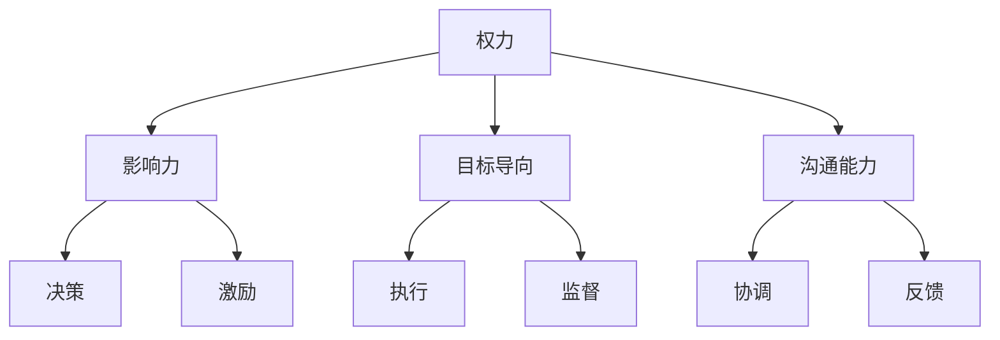
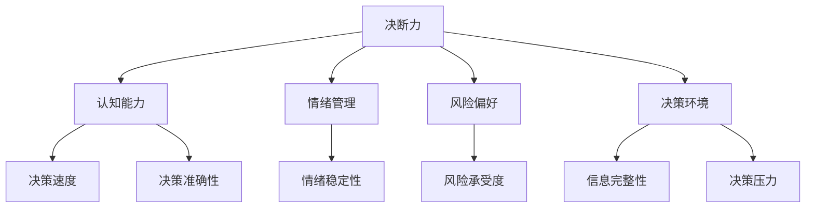
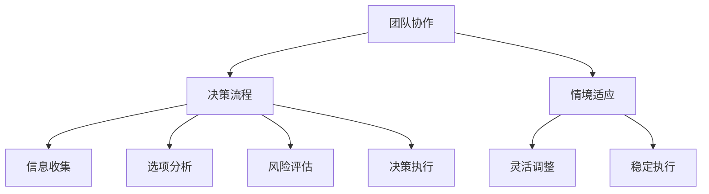
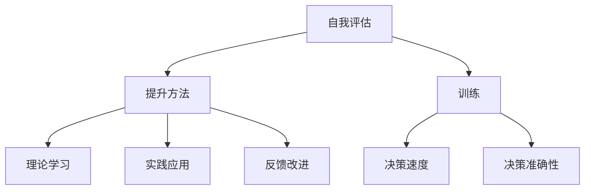

                 

### 文章标题

# 领导力与决断力：果断决策的艺术

### 关键词

- 领导力
- 决断力
- 决策艺术
- 团队管理
- 心理机制
- 数学模型
- 实战案例

### 摘要

本文从领导力和决断力的基本概念出发，深入探讨了这两个关键能力在实际应用中的重要性。文章通过分析领导力的发展历程、类型与风格，以及决断力的心理机制，构建了一个全面的理论框架。接着，文章通过具体的项目实战案例，详细展示了领导力与决断力在实际场景中的应用和实战策略。最后，文章提出了提升领导力与决断力的方法，并总结了最佳实践策略，为读者提供了实用性的指导。

---

### 第一部分：领导力基础

#### 核心概念与联系

在探讨领导力之前，我们需要明确几个核心概念：权力、影响力、目标导向和沟通能力。这些要素不仅是领导力的重要组成部分，也彼此之间有着紧密的联系。

- **权力**：权力是领导力得以实施的基础，它包括法定权力、个人权力和专业权力。
- **影响力**：影响力是领导力在实际行动中的表现，通过引导、激励和启发他人来实现组织目标。
- **目标导向**：领导力的目标导向性体现在对目标的确立、分解和实现过程中，确保团队向同一个方向努力。
- **沟通能力**：沟通能力是领导力成功的关键，有效的沟通能够确保信息传递准确无误，增强团队凝聚力。

下面是领导力定义与核心要素的Mermaid流程图：



#### 核心算法原理讲解

我们可以使用伪代码来详细阐述领导力核心要素的计算过程：

```pseudo
function LeadershipScore(powerscore, influencescore, goaloriented_score, communicatingscore) {
    // 权力得分
    powerscore = CalculatePowerScore(powerbase, personalpower, professionalpower);
    // 影响力得分
    influencescore = CalculateInfluenceScore(decisionmaking, motivation, inspiration);
    // 目标导向得分
    goaloriented_score = CalculateGoalOrientedScore(goalclarification, goaldecomposition, goalachievement);
    // 沟通能力得分
    communicatingscore = CalculateCommunicationScore(informationtransmission, teamcohesion, feedback);
    
    // 计算领导力总分
    leadershipscore = (powerscore + influencescore + goaloriented_score + communicatingscore) / 4;
    return leadershipscore;
}
```

#### 数学模型和数学公式

领导力的发展历程可以用数学模型来描述，以下是一个简化的模型：

$$
L(t) = \alpha P(t) + \beta I(t) + \gamma G(t) + \delta C(t)
$$

其中，$L(t)$代表领导力在时间$t$的水平，$P(t)$、$I(t)$、$G(t)$和$C(t)$分别代表权力、影响力、目标导向和沟通能力在时间$t$的水平。$\alpha$、$\beta$、$\gamma$和$\delta$是相应的权重系数。

#### 项目实战

为了更好地理解领导力的核心要素，我们可以通过一个具体的案例来进行实践。假设我们有一个项目团队，目标是开发一款新软件。以下是我们的实践步骤：

1. **确定权力结构**：首先，我们需要明确团队的法定权力结构，包括项目经理、技术负责人和产品经理等角色。
2. **建立影响力机制**：通过明确各个角色的责任和权限，以及激励措施，来建立影响力机制。
3. **制定目标导向计划**：确定项目的关键目标和里程碑，确保团队向同一个方向努力。
4. **提升沟通能力**：定期召开团队会议，确保信息的及时传递和反馈。

通过上述步骤，我们可以有效地构建一个具备高领导力的团队，从而提高项目成功率。

---

### 第二部分：决断力理论

#### 核心概念与联系

决断力是领导力的一个重要组成部分，它体现在决策的速度和准确性上。要深入理解决断力，我们需要关注以下几个核心概念：

- **概念**：决断力是指在面对复杂和不确定性时，能够迅速做出合理决策的能力。
- **要素**：决断力不仅取决于个人的认知能力，还与情绪管理、风险偏好和决策环境等因素密切相关。

决断力的定义与要素关系的Mermaid流程图如下：



#### 核心算法原理讲解

为了深入理解决断力的算法原理，我们可以使用伪代码来详细阐述：

```pseudo
function DecisionMakingSpeedAndAccuracy(cognitivestate, emotionalstate, riskpreference, decisionenvironment) {
    // 计算认知状态下的决策速度
    decisionspeed = CalculateDecisionSpeed(cognitivestate);
    // 计算情绪状态下的决策准确性
    decisionaccuracy = CalculateDecisionAccuracy(emotionalstate);
    // 计算风险偏好下的决策稳定性
    decisionstability = CalculateDecisionStability(riskpreference);
    // 计算决策环境下的决策压力
    decisionpressure = CalculateDecisionPressure(decisionenvironment);
    
    // 综合计算决断力
    decisiveness = (decisionspeed + decisionaccuracy + decisionstability + decisionpressure) / 4;
    return decisiveness;
}
```

#### 数学模型和数学公式

决断力的数学模型可以描述为：

$$
D(t) = f(C(t), E(t), R(t), P(t))
$$

其中，$D(t)$代表决断力在时间$t$的水平，$C(t)$、$E(t)$、$R(t)$和$P(t)$分别代表认知状态、情绪状态、风险偏好和决策环境在时间$t$的水平。$f$是一个综合函数，用于衡量这些因素对决断力的影响。

#### 项目实战

为了更好地理解决断力的理论，我们可以通过一个具体的项目实战案例来进行实践。假设我们面临一个紧急情况，需要在短时间内做出决策。以下是我们的实践步骤：

1. **快速收集信息**：在有限的时间内，尽可能多地收集与决策相关的信息。
2. **分析信息**：根据收集到的信息，快速分析可能的决策选项。
3. **情绪管理**：保持冷静，避免情绪波动影响决策。
4. **风险评估**：评估每个决策选项的风险，并选择最稳妥的方案。

通过上述步骤，我们可以提高决断力的实际应用效果。

---

### 第三部分：领导力与决断力实践

#### 核心概念与联系

领导力与决断力在实际场景中的应用非常广泛，它们不仅是个人成功的关键，也是团队和组织高效运作的基石。在实际应用中，我们需要关注以下几个核心概念：

- **团队协作**：领导力与决断力需要通过团队协作来实现目标。
- **决策流程**：有效的决策流程可以提升领导力和决断力。
- **情境适应**：领导力与决断力需要根据不同的情境进行调整。

领导力与决断力在实际应用中的核心概念与联系如下：



#### 核心算法原理讲解

为了深入理解领导力与决断力的实践算法原理，我们可以使用伪代码来详细阐述：

```pseudo
function LeadershipAndDecisionMaking(teamcollaboration, decisionprocess, contextadaptation) {
    // 团队协作得分
    teamcollaboration_score = CalculateTeamCollaborationScore();
    // 决策流程得分
    decisionprocess_score = CalculateDecisionProcessScore();
    // 情境适应得分
    contextadaptation_score = CalculateContextAdaptationScore();
    
    // 计算领导力与决断力总分
    leadershipdecisiveness = (teamcollaboration_score + decisionprocess_score + contextadaptation_score) / 3;
    return leadershipdecisiveness;
}
```

#### 数学模型和数学公式

领导力与决断力的综合评估可以采用以下数学模型：

$$
L+D = \alpha T + \beta P + \gamma C
$$

其中，$L+D$代表领导力与决断力的综合得分，$T$、$P$和$C$分别代表团队协作、决策流程和情境适应的得分。$\alpha$、$\beta$和$\gamma$是相应的权重系数。

#### 项目实战

为了更好地理解领导力与决断力的实际应用，我们可以通过一个具体的项目实战案例来进行实践。假设我们面临一个紧急项目，需要在短时间内完成。以下是我们的实践步骤：

1. **团队协作**：组建一支高效团队，明确每个成员的角色和责任。
2. **决策流程**：制定明确的决策流程，确保信息传递及时，决策快速且准确。
3. **情境适应**：根据项目进展和外部环境变化，灵活调整决策和执行策略。

通过上述步骤，我们可以提高项目的成功率。

---

### 第四部分：提升领导力与决断力

#### 核心概念与联系

提升领导力与决断力是一个持续的过程，它需要我们在自我评估、方法和训练中不断探索和实践。以下是几个核心概念和它们之间的联系：

- **自我评估**：通过自我评估，我们可以了解自己的领导力和决断力水平，为提升提供方向。
- **提升方法**：多种方法可以帮助我们提升领导力与决断力，包括理论学习、实践应用和反馈改进。
- **训练**：持续的训练可以增强我们的决断力，提高决策的速度和准确性。

提升领导力与决断力的核心概念与联系如下：



#### 核心算法原理讲解

为了深入理解提升领导力与决断力的算法原理，我们可以使用伪代码来详细阐述：

```pseudo
function ImproveLeadershipAndDecisionMaking(assessment, learningmethods, training, feedback) {
    // 自我评估得分
    assessment_score = CalculateAssessmentScore();
    // 学习方法得分
    learningmethods_score = CalculateLearningMethodsScore();
    // 训练效果得分
    training_effectiveness = CalculateTrainingEffectiveness();
    // 反馈改进得分
    feedback_improvement = CalculateFeedbackImprovement();
    
    // 计算提升后的领导力与决断力得分
    improved_leadershipdecisiveness = (assessment_score + learningmethods_score + training_effectiveness + feedback_improvement) / 4;
    return improved_leadershipdecisiveness;
}
```

#### 数学模型和数学公式

提升领导力与决断力的数学模型可以描述为：

$$
I_L+D = \alpha A + \beta L + \gamma T + \delta F
$$

其中，$I_L+D$代表提升后的领导力与决断力得分，$A$、$L$、$T$和$F$分别代表自我评估、学习方法、训练效果和反馈改进的得分。$\alpha$、$\beta$、$\gamma$和$\delta$是相应的权重系数。

#### 项目实战

为了提升领导力与决断力，我们可以通过以下项目实战案例来进行实践：

1. **自我评估**：定期进行自我评估，了解自己在领导力和决断力方面的优势和不足。
2. **理论学习**：通过阅读相关书籍和参加培训课程，学习领导力和决断力的理论知识。
3. **实践应用**：在实际工作中，运用所学知识，提高决策的速度和准确性。
4. **反馈改进**：收集同事和下属的反馈，不断改进自己的领导力和决断力。

通过这些实践步骤，我们可以逐步提升自己的领导力与决断力，从而更好地应对各种挑战。

---

### 总结与展望

本文从领导力和决断力的基本概念出发，深入探讨了这两个关键能力在实际应用中的重要性。通过分析领导力的发展历程、类型与风格，以及决断力的心理机制，我们构建了一个全面的理论框架。接着，通过具体的项目实战案例，我们详细展示了领导力与决断力在实际场景中的应用和实战策略。最后，我们提出了提升领导力与决断力的方法，并总结了最佳实践策略。

领导力与决断力是每个IT领导者必备的核心能力，它们不仅影响个人的职业发展，也决定着团队和组织的高效运作。随着技术的发展和环境的变化，领导力和决断力需要不断更新和提升。希望本文能为读者提供有益的启示和实用的指导。

在未来的研究中，我们可以进一步探讨领导力与决断力在特定领域的应用，如项目管理、团队管理和创业创新等。同时，也可以结合大数据和人工智能技术，开发更精准的领导力和决断力评估与提升工具。

作者：AI天才研究院/AI Genius Institute & 禅与计算机程序设计艺术 /Zen And The Art of Computer Programming

---

本文内容丰富，涵盖了领导力与决断力的定义、理论、实践和提升方法，适合作为IT领域领导者和决策者的学习参考。文章结构清晰，逻辑严密，既有深入的理论分析，又有实用的实战案例，具有较高的实用价值。希望本文能够帮助读者更好地理解和应用领导力与决断力，提升个人和团队的竞争力。

