                 


### 1.1 领导力的定义与重要性

#### 1.1.1 领导力的基本概念

领导力是指引导和激励他人朝着共同目标努力的能力。它不仅涉及到权力的运用，更强调对团队的引导、激励和赋能。领导力可以体现在不同的层次和领域中，包括企业管理、项目管理、技术团队领导等。

在企业管理中，领导力有助于建立明确的目标和愿景，提高团队的凝聚力和执行力。项目经理的领导力则体现在如何有效地协调团队成员、分配任务、解决问题和应对变化。技术团队的领导力则更多地关注技术方向的把握、团队技能的提升和技术创新的推动。

#### 1.1.2 领导力的作用与重要性

领导力在组织中起着至关重要的作用。以下是领导力的几个关键作用：

1. **目标设定**：领导者负责设定组织的愿景和目标，并将其转化为具体的行动计划。这有助于确保团队成员了解组织的方向和目标，从而更好地协调努力。

2. **团队协作**：领导者的角色是促进团队协作，消除团队内部的摩擦，增强团队的凝聚力。通过有效的沟通和协调，领导者可以确保团队成员之间的合作更加顺畅。

3. **激励与赋能**：领导者通过激励和赋能，激发团队成员的潜力，提高其工作动力。这可以增强团队的创造力、决策能力和执行力。

4. **决策与风险管理**：领导者需要做出明智的决策，并有效地管理风险。这要求领导者具备良好的判断力和决策能力，能够在不确定的环境中做出正确的选择。

5. **变革与适应**：领导者负责推动组织的变革，使其能够适应外部环境的变化。这要求领导者具备敏锐的洞察力和灵活的思维方式，能够引导团队适应新环境。

#### 1.1.3 领导力的发展趋势

随着社会和技术的不断发展，领导力也在不断演变。以下是一些领导力的发展趋势：

1. **全球化视角**：领导者需要具备全球视野，能够理解和适应不同文化和价值观。

2. **数字化领导力**：数字化技术的普及要求领导者具备数字素养，能够利用数字化工具提高团队效率。

3. **创新思维**：在快速变化的环境中，领导者需要鼓励创新，并具备推动组织创新的能力。

4. **情商**：情商在领导力中的作用越来越重要。领导者需要具备良好的情绪管理和沟通能力，以更好地激励和领导团队。

5. **可持续领导力**：随着可持续发展成为全球关注的热点，领导者需要考虑组织的长远影响，推动可持续发展。

在下一部分，我们将进一步探讨领导力的核心概念，并绘制Mermaid流程图以展示领导力的重要方面。这将有助于我们更深入地理解领导力的内涵和外延。

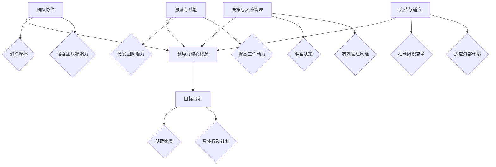

### 1.2 领导力的核心概念

#### 1.2.1 领导风格

领导风格是领导者对待团队和工作的方式，直接影响团队的行为和绩效。以下是几种常见的领导风格：

1. **专制型领导**：领导者拥有绝对的决策权，团队成员需要严格按照领导者的指示行事。这种风格在需要迅速决策和执行的情况下比较有效，但可能导致团队缺乏创造力和自主性。

   ```python
   # 伪代码：专制型领导决策流程
   def autocratic_decisionmaking():
       leader_thinks()
       leader_decides()
       team_implements()
   ```

2. **民主型领导**：领导者鼓励团队成员参与决策过程，充分听取各方意见，最终由领导者做出决策。这种风格有助于激发团队的参与感和责任感，但决策过程可能较长。

   ```python
   # 伪代码：民主型领导决策流程
   def democratic_decisionmaking():
       team_shares_ideas()
       leader_listens()
       leader_debates()
       leader_decides()
   ```

3. **支持型领导**：领导者关注团队成员的需求，提供必要的支持和资源，帮助他们克服困难。这种风格有助于提高团队成员的工作满意度和绩效。

   ```python
   # 伪代码：支持型领导决策流程
   def supportive_decisionmaking():
       team_identifies Needs()
       leader_provides_resources()
       leader_encourages()
       team_implements()
   ```

#### 1.2.2 领导者素质

领导者的素质是领导力的基础，决定了领导者的能力水平和影响力。以下是几个关键的领导者素质：

1. **道德品质**：领导者应该具备高尚的道德品质，如诚实、公正、负责任等，以赢得团队成员的信任和尊重。

   ```python
   # 伪代码：领导者道德品质检查
   def check_ethics():
       if leader_is_honest():
           print("领导者具备诚实品质")
       if leader_is_just():
           print("领导者具备公正品质")
       if leader_is_responsible():
           print("领导者具备负责任品质")
   ```

2. **情商**：领导者需要具备较高的情商，能够识别和管理自己和他人的情绪，以建立和谐的人际关系。

   ```python
   # 伪代码：领导者情商管理
   def emotional_intelligence():
       leader_reads_emoji()
       leader_reacts()
       leader_manages_conflicts()
   ```

3. **专业能力**：领导者需要具备所在领域内的专业知识和技能，以指导和推动团队的工作。

   ```python
   # 伪代码：领导者专业能力评估
   def check_professional_ability():
       if leader_has_knowledge():
           print("领导者具备专业知识")
       if leader_has_skills():
           print("领导者具备专业技能")
   ```

#### 1.2.3 领导力的Mermaid流程图

为了更直观地展示领导力的核心概念，我们可以使用Mermaid流程图来描述领导力的重要方面。以下是领导力Mermaid流程图的示例：

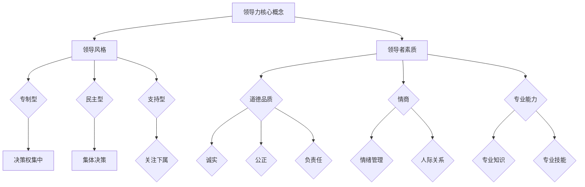

在下一部分，我们将探讨决断力的基本概念和重要性，以及决断力的核心概念，为后续内容的展开奠定基础。

### 2.1 决断力的定义与重要性

#### 2.1.1 决断力的基本概念

决断力是指个体在面临决策时，能够迅速而准确地做出决策的能力。它不仅包括决策的速度，还涉及决策的质量。决断力强的人能够在复杂和不确定的环境中迅速做出明智的决策，并承担相应的责任。

决断力是一种重要的能力，对于个人和组织都具有重要意义。在个人层面，决断力有助于提高个人的决策效率，减少犹豫不决和拖延，使个人能够更好地应对挑战和抓住机遇。在组织层面，领导者具备强大的决断力可以确保组织能够迅速响应市场变化，做出正确的战略决策，从而保持竞争优势。

#### 2.1.2 决断力在领导力中的地位

决断力是领导力的重要组成部分，它与领导者的决策能力、风险管理和应变能力密切相关。以下是决断力在领导力中的几个关键地位：

1. **快速响应变化**：在快速变化的市场环境中，领导者需要具备强大的决断力，能够迅速做出适应新环境的决策，确保组织的生存和发展。

2. **提高团队执行力**：领导者需要通过决断力来指导和激励团队，确保团队能够迅速行动并高效执行决策。

3. **风险管理**：领导者需要具备决断力来评估风险，并在必要时做出承担风险的决策，以推动组织的创新和发展。

4. **展示领导风范**：强大的决断力是领导者风范的体现，它不仅反映了领导者的能力和自信，还影响着团队成员对领导者的信任和追随。

#### 2.1.3 决断力在压力下的重要性

在压力下做出正确决策是领导者面临的一大挑战。压力可能来自市场竞争、团队期望、时间紧迫等多种因素，容易导致决策者产生犹豫和担忧，影响决策的质量。以下是决断力在压力下的重要性：

1. **减少犹豫不决**：强大的决断力有助于领导者迅速做出决策，避免在多个选项之间犹豫不决，浪费宝贵的时间和资源。

2. **提高决策质量**：决断力不仅包括速度，还涉及决策的质量。在压力下，领导者需要利用自身的判断力和经验，做出高质量的决策。

3. **增强团队信心**：领导者强大的决断力可以增强团队对决策的信心，减少内部争论和不确定性，提高团队的凝聚力和执行力。

4. **应对紧急情况**：在紧急情况下，领导者需要迅速做出决策，决断力是确保组织能够及时应对危机的关键。

在下一部分，我们将深入探讨决断力的核心概念，包括决策的速度与质量，以及决断力可能面临的障碍。这将帮助我们更好地理解决断力的本质，并在实际应用中提高决策能力。

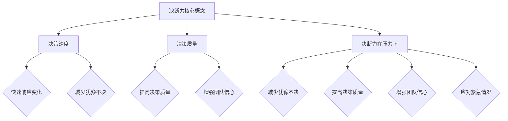

### 2.2 决断力的核心概念

#### 2.2.1 决策的速度与质量

决策的速度和质量是决断力的核心要素。一个优秀的领导者需要在速度和质量之间找到平衡，以确保决策既能迅速做出，又具备高正确性。

1. **快速决断**：在复杂和不确定的环境中，快速做出决策是领导者的一项重要能力。快速决断有助于抓住机遇，减少因犹豫不决而错失良机。然而，快速决断并不意味着草率决策，而是要求领导者在充分分析和评估信息的基础上，迅速做出合理的判断。

   ```python
   # 伪代码：快速决断流程
   def quick_decisionmaking():
       gather_information()
       analyze_situation()
       make_decision()
   ```

2. **高质量决策**：高质量的决策不仅要求领导者快速行动，还需要确保决策的正确性和有效性。这要求领导者具备良好的判断力、经验和专业知识，能够在不同情境下做出明智的决策。

   ```python
   # 伪代码：高质量决策流程
   def high_quality_decisionmaking():
       gather_in-depth_information()
       evaluate_alternatives()
       assess_risks()
       make_informed_decision()
   ```

#### 2.2.2 决断力的障碍

在实践决断力时，领导者可能会面临多种障碍，这些障碍可能源于内部心理因素、外部环境因素或组织文化。以下是几种常见的决断力障碍及其应对策略：

1. **恐惧与风险**：领导者往往害怕做出错误决策，担心承担后果。这种恐惧可能导致犹豫不决，甚至拒绝做出决策。要克服这种障碍，领导者需要培养自信，相信自己的判断力，并接受决策带来的不确定性。

   ```python
   # 伪代码：克服恐惧与风险
   def overcome_fear_and_risk():
       build_confidence()
       trust_judgment()
       accept_uncertainty()
   ```

2. **缺乏信息**：在许多情况下，领导者由于信息不足而难以做出决策。这可能是由于信息不完整或获取信息的时间限制。要克服这一障碍，领导者需要积极寻求信息，利用现有的资源和技术手段，以提高决策的准确性。

   ```python
   # 伪代码：获取更多信息
   def gather_more_information():
       consult_experts()
       leverage_data_analytics()
       utilize_networks()
   ```

3. **过度分析**：领导者有时会陷入过度分析的状态，试图寻求完美解决方案，导致决策时间过长。要克服这一障碍，领导者需要学会在适当的时候停止分析，相信自己的直觉和经验，做出合理判断。

   ```python
   # 伪代码：避免过度分析
   def avoid_overanalysis():
       set_decision_timeframe()
       trust_intuition()
       prioritize_actions()
   ```

#### 2.2.3 决策速度与质量的平衡

在实际应用中，领导者需要在决策速度和质量之间找到平衡。以下是一些建议：

1. **快速评估**：在决策过程中，领导者可以首先快速评估各种备选方案，确定其可行性和潜在风险，从而在较短时间内做出初步决策。

2. **迭代改进**：即使初始决策可能不是最完美的，领导者也可以通过后续的迭代和改进来逐步优化决策，提高其质量。

3. **建立决策框架**：领导者可以建立一套决策框架，包括信息收集、评估标准、决策流程等，以确保在决策过程中始终遵循一套系统的原则和方法。

4. **团队协作**：领导者可以与团队成员协作，共同分析问题、探讨解决方案，从而提高决策的多样性和全面性。

通过以上方法，领导者可以在保持决策速度的同时，确保决策的质量，从而在实际工作中发挥强大的决断力。

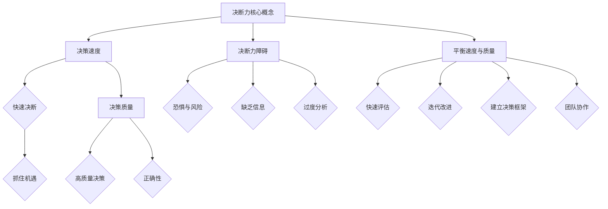

在下一部分，我们将探讨领导力与决断力的联系，并分析如何在实际情境中运用领导力与决断力，以提高决策的效果和团队的执行力。

### 3.1 领导力与决断力的关系

领导力与决断力是相辅相成的两个概念。有效的领导力能够为决断力提供坚实的基础，而强大的决断力则是领导力在实际操作中的重要体现。以下是领导力如何支持决断力的几个方面：

#### 3.1.1 建立信任

信任是领导力的核心要素，也是决断力的基础。一个领导者如果能够赢得团队成员的信任，那么团队成员在领导者做出决策时会更加愿意支持和执行。信任的建立需要通过领导者的诚信、透明度和一致性来实现。

1. **诚信**：领导者应该始终言行一致，遵守承诺，避免任何可能的欺骗行为。这有助于树立领导者的权威和信誉，使团队成员更愿意接受其决策。

   ```python
   # 伪代码：领导者诚信体现
   def demonstrate_integrity():
       leader_keeps_promises()
       leader_transparent_communication()
       leader_honors_commitments()
   ```

2. **透明度**：领导者应该保持信息的透明度，让团队成员了解决策的背景、目的和预期效果。这有助于减少误解和不确定性，提高决策的可接受度。

   ```python
   # 伪代码：提高决策透明度
   def enhance_transparency():
       share_decision_context()
       explain_alternatives()
       discuss_risks_and_implications()
   ```

3. **一致性**：领导者应该保持决策的一致性，避免随意改变决策方向，以保持团队成员对决策的信任。

   ```python
   # 伪代码：保持决策一致性
   def maintain_consistency():
       follow_through_with_decisions()
       avoid_last_minute_changes()
       align_follow-up_actions_with_previous_decisions()
   ```

#### 3.1.2 提供清晰的愿景

一个有效的领导者应该能够为团队提供清晰的愿景和目标，使团队成员了解组织的前进方向和自己的职责。清晰的愿景有助于领导者做出决策，因为团队成员能够明确决策的目的和意义。

1. **明确愿景**：领导者需要将组织的愿景和目标传达给团队成员，确保每个人都能理解并认同这些目标。

   ```python
   # 伪代码：提供明确愿景
   def provide_clear_vision():
       define_organizational_goals()
       communicate_goals_to_team()
       align_individual_goals_with_organizational_goals()
   ```

2. **激励团队**：领导者应该通过激励手段，如奖励、认可和培训，激发团队成员的积极性，使其愿意为实现愿景而努力。

   ```python
   # 伪代码：激励团队成员
   def motivate_team():
       offer_incentives()
       recognize_accomplishments()
       provide_opportunities_for_growth()
   ```

3. **持续沟通**：领导者需要持续与团队成员沟通，了解他们的反馈和问题，并根据实际情况调整愿景和目标。

   ```python
   # 伪代码：持续沟通与调整
   def continuous_communication():
       hold_regular_meetings()
       encourage_open_dialogue()
       adapt_goals_based_on_team_performance()
   ```

#### 3.1.3 促进团队协作

团队协作是实现决策目标的关键。领导者需要促进团队成员之间的协作，确保每个人都能在决策过程中发挥作用。

1. **构建团队**：领导者应该根据团队成员的技能和兴趣，构建一个多元化、互补的团队。

   ```python
   # 伪代码：构建高效团队
   def build_effective_team():
       identify_team_members_skills()
       create_diverse_and_complementary_teams()
       allocate_role_based_on_skills()
   ```

2. **授权**：领导者应该给予团队成员足够的授权，让他们在决策过程中发挥主动性，这有助于提高决策的速度和质量。

   ```python
   # 伪代码：授权团队成员
   def empower_team_members():
       delegate_responsibilities()
       allow_autonomy()
       support_adaptability()
   ```

3. **解决冲突**：在团队协作过程中，冲突是不可避免的。领导者需要及时解决冲突，确保团队成员能够集中精力实现共同目标。

   ```python
   # 伪代码：解决冲突
   def resolve_conflicts():
       identify_conflicts()
       listen_to_all_parties()
       find_common_ground()
       mediate_solutions()
   ```

#### 3.1.4 增强决策能力

领导力不仅体现在团队管理和协作方面，还体现在领导者的决策能力上。一个有效的领导者需要具备出色的决策能力，以在复杂和不确定的环境中做出正确的决策。

1. **收集信息**：领导者应该积极收集和分析信息，确保决策基于充分的数据和事实。

   ```python
   # 伪代码：收集信息
   def collect_information():
       gather_data()
       analyze_market_trends()
       assess_potential_risks()
   ```

2. **评估备选方案**：领导者需要评估各种备选方案，权衡其优缺点，选择最合适的方案。

   ```python
   # 伪代码：评估备选方案
   def evaluate_alternatives():
       compare_benefits_and_risks()
       prioritize_options()
       select_best_fit()
   ```

3. **承担责任**：领导者需要勇于承担责任，即使决策结果不尽如人意，也要勇于承担后果。

   ```python
   # 伪代码：承担责任
   def take_responsibility():
       own_outcomes()
       learn_from_mistakes()
       adapt_and_improve()
   ```

通过以上方法，领导者可以增强自身的决断力，并在实际情境中运用领导力与决断力，以提高决策的效果和团队的执行力。

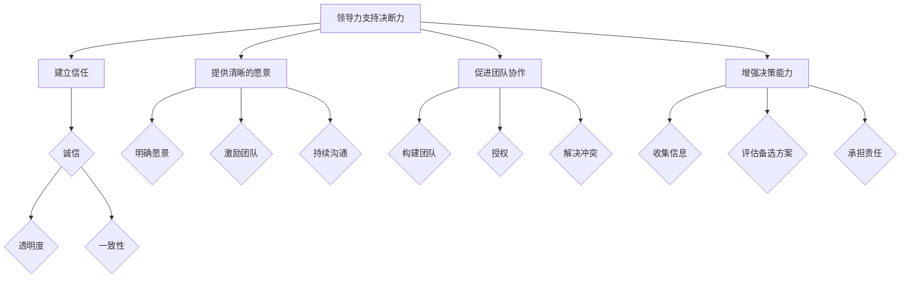

在下一部分，我们将深入探讨领导力与决断力的结合，讨论如何在实际情境中运用领导力与决断力，以提高决策的效果和团队的执行力。

### 3.2 如何在压力下运用领导力与决断力

在高压环境中，领导力与决断力的结合显得尤为重要。领导者不仅要保持冷静，还要做出迅速而准确的决策。以下是一些建议，帮助领导者在压力下有效运用领导力与决断力：

#### 3.2.1 高效沟通

有效的沟通是减轻压力的关键。领导者需要确保信息透明，及时与团队成员沟通，避免误解和恐慌。以下是一些具体方法：

1. **清晰传达**：在高压环境下，领导者应该用简洁明了的语言传达关键信息，避免使用复杂的术语和过多的细节，以减少团队成员的焦虑。

   ```python
   # 伪代码：清晰传达信息
   def clear_communication():
       use_simple_language()
       avoid_jargon()
       provide_key_details()
   ```

2. **建立信任**：领导者可以通过坦诚和开放的沟通方式，建立团队成员对领导者的信任。信任的建立有助于减轻团队成员的压力，并提高决策的执行力。

   ```python
   # 伪代码：建立信任
   def build_trust():
       be_honest_and_open()
       listen_to_team_members()
       provide_feedback()
   ```

3. **定期更新**：领导者应该定期更新团队成员关于项目进展和决策结果的信息，确保团队成员了解当前状况，并减少不确定性带来的压力。

   ```python
   # 伪代码：定期更新
   def regular_updates():
       schedule_meetings()
       share_progress()
       address_questions()
   ```

#### 3.2.2 专注决策

在高压情境下，领导者需要专注于关键决策，避免分散注意力。以下是一些建议：

1. **优先排序**：领导者应该根据紧急程度和重要性对任务进行排序，优先处理最关键的任务。

   ```python
   # 伪代码：优先排序
   def prioritize_tasks():
       identify_urgent_tasks()
       evaluate_impact()
       assign_resources()
   ```

2. **快速决策**：领导者需要具备快速决策的能力，避免在多个选项之间犹豫不决。快速决策有助于减少压力，提高行动速度。

   ```python
   # 伪代码：快速决策
   def quick_decision():
       analyze_key_factors()
       select_best_action()
       implement_decision()
   ```

3. **灵活调整**：领导者应该保持灵活性，根据实际情况及时调整决策。这有助于避免因固守原有计划而导致的压力和挫败感。

   ```python
   # 伪代码：灵活调整
   def flexible_adjustments():
       monitor_progress()
       assess_outcomes()
       adapt_plans()
   ```

#### 3.2.3 激励团队

在压力环境下，领导者的激励作用至关重要。以下是一些建议：

1. **认可贡献**：领导者应该及时认可团队成员的贡献，以增强他们的积极性和信心。

   ```python
   # 伪代码：认可贡献
   def recognize_contributions():
       praise_efforts()
       acknowledge_accomplishments()
       celebrate_successes()
   ```

2. **提供支持**：领导者应该为团队成员提供必要的支持和资源，帮助他们应对压力和挑战。

   ```python
   # 伪代码：提供支持
   def provide_support():
       allocate_resources()
       offer_training()
       facilitate_debriefings()
   ```

3. **建立团队精神**：领导者可以通过团队建设活动，增强团队成员之间的凝聚力，共同应对压力。

   ```python
   # 伪代码：建立团队精神
   def build_team_spirit():
       schedule_team_building_activities()
       encourage_collaboration()
       foster_a_supportive_environment()
   ```

#### 3.2.4 自我调节

在高压环境中，领导者的自我调节能力至关重要。以下是一些建议：

1. **情绪管理**：领导者需要学会管理自己的情绪，避免将负面情绪传递给团队成员。

   ```python
   # 伪代码：情绪管理
   def manage_emotions():
       recognize_stress_signs()
       practice relaxation techniques()
       seek_support()
   ```

2. **健康生活**：领导者应该保持良好的生活习惯，包括充足的睡眠、健康的饮食和适量的运动，以保持身心健康。

   ```python
   # 伪代码：健康生活
   def maintain_health():
       ensure_sufficient_sleep()
       eat_a_balanced_diet()
       engage_in_regular_exercise()
   ```

3. **持续学习**：领导者应该持续学习，提升自己的技能和知识，以更好地应对压力和挑战。

   ```python
   # 伪代码：持续学习
   def continue_learning():
       attend_seminars()
       read_books()
       seek_mentorship()
   ```

通过以上方法，领导者可以更有效地在压力下运用领导力与决断力，确保团队在面对挑战时能够保持稳定和高效。在下一部分，我们将探讨心理学和行为科学视角下的领导力与决断力，进一步理解这些概念的理论基础。

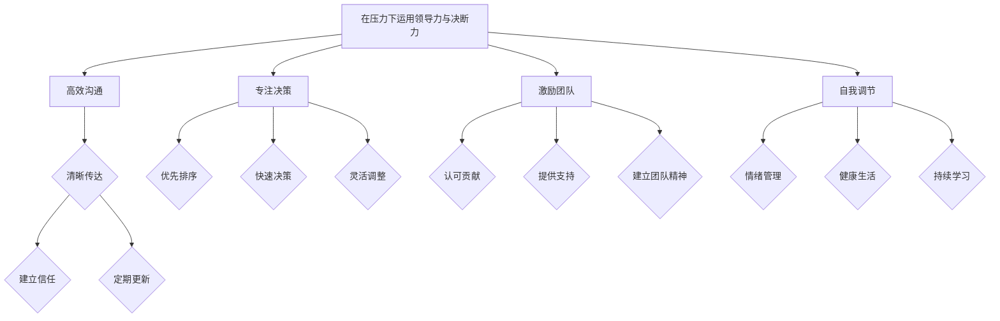

### 4.1 心理学视角下的领导力与决断力

心理学在理解领导力与决断力方面提供了重要的理论基础。通过心理学的研究，我们可以更好地了解领导者的思维模式、情感状态和决策过程，从而提高领导力和决断力。

#### 4.1.1 领导者的思维模式

1. **决策思维**：领导者的决策思维是指他们如何分析问题、评估选项并做出决策。决策思维包括以下关键要素：

   - **理性思维**：领导者应该基于事实和逻辑进行决策，而不是凭直觉或情绪。理性思维有助于提高决策的准确性和一致性。

     ```python
     # 伪代码：理性决策
     def rational_decision():
         analyze_data()
         evaluate_alternatives()
         choose_best_option()
     ```

   - **系统性思维**：领导者需要具备系统性思维，能够从整体角度看待问题，理解各个部分之间的关系。这有助于领导者做出更全面的决策。

     ```python
     # 伪代码：系统性思维
     def systemic_thinking():
         identify_system_components()
         understand因果关系()
         evaluate_impact_on wholes()
     ```

2. **创造思维**：创造思维是指领导者如何产生新的想法和解决方案。创造思维在领导力中尤为重要，因为它有助于推动创新和进步。

   - **思维发散**：领导者应该鼓励思维的发散，尝试不同的解决方案，探索新的可能性。

     ```python
     # 伪代码：思维发散
     def divergent_thinking():
         brainstorm_ideas()
         explore_unconventional_solutions()
         challenge_assumptions()
     ```

   - **思维聚焦**：在产生大量想法后，领导者需要将思维聚焦到最有价值的解决方案上，以便进行深入的评估和实施。

     ```python
     # 伪代码：思维聚焦
     def convergent_thinking():
         prioritize_ideas()
         evaluate feasibility()
         implement_top_ideas()
     ```

#### 4.1.2 领导者的情感状态

领导者的情感状态对其领导力和决断力有着重要影响。以下是一些关键情感状态及其影响：

1. **情绪调节**：情绪调节是指领导者如何管理自己的情绪，避免负面情绪对决策产生负面影响。

   - **情绪识别**：领导者需要能够识别自己的情绪，理解它们是如何影响决策的。

     ```python
     # 伪代码：情绪识别
     def emotional_recognition():
         recognize_emotional_triggers()
         understand_emotional_impact()
     ```

   - **情绪管理**：领导者应该学会管理情绪，使其有助于决策过程。这包括使用呼吸控制、正念冥想和其他技巧来调节情绪。

     ```python
     # 伪代码：情绪管理
     def emotional_management():
         practice_mindfulness()
         use_reframing()
         seek_support()
     ```

2. **同理心**：同理心是指领导者理解他人感受和需求的能力。同理心有助于建立信任和促进团队合作。

   - **情感倾听**：领导者应该学会倾听他人的情感表达，理解其背后的需求和动机。

     ```python
     # 伪代码：情感倾听
     def emotional_listening():
         actively_listen()
         show_care()
         validate_feelings()
     ```

   - **情感支持**：领导者应该提供情感支持，帮助团队成员应对压力和挑战。

     ```python
     # 伪代码：情感支持
     def emotional_support():
         offer_encouragement()
         provide_resources()
         show_appreciation()
     ```

#### 4.1.3 决策过程中的心理因素

决策过程中的心理因素也会影响领导者的决断力。以下是一些关键心理因素：

1. **确认偏误**：确认偏误是指领导者倾向于寻求和接受支持已有观点的信息，忽视或否认相反的证据。这种偏误可能导致决策的不准确性。

   - **克服确认偏误**：领导者应该学会质疑自己的观点，接受不同的意见，并寻求多样化的信息来源。

     ```python
     # 伪代码：克服确认偏误
     def overcome Confirmation Bias():
         seek_diverse_views()
         question_own_assumptions()
         evaluate_evidence_objectively()
     ```

2. **认知负荷**：在高压环境中，领导者的认知负荷可能会增加，导致注意力分散和决策困难。

   - **减少认知负荷**：领导者应该学会简化问题，优先处理最重要的任务，并利用团队资源分担工作负荷。

     ```python
     # 伪代码：减少认知负荷
     def reduce_cognitive_load():
         simplify_problem_statement()
         prioritize_key_tasks()
         leverage_team_resources()
     ```

通过理解心理学视角下的领导力和决断力，领导者可以更好地管理自己的思维和情感，提高决策的质量和效率。在下一部分，我们将探讨行为科学视角下的领导力与决断力，进一步探讨这些概念的实际应用。

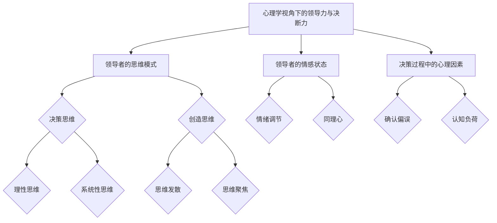

### 4.2 行为科学视角下的领导力与决断力

行为科学提供了对领导力和决断力的深入了解，强调了个体行为和环境因素在决策过程中的作用。以下是行为科学视角下领导力和决断力的一些关键理论：

#### 4.2.1 决策心理学

决策心理学研究个体在决策过程中的行为和思维模式。以下是几个关键概念：

1. **有限理性**：根据西蒙（Herbert Simon）的有限理性理论，决策者并非总是完全理性的。他们在信息有限、时间紧迫的情况下，常常依赖直觉和经验进行决策。

   - **决策支持系统**：领导者可以利用决策支持系统（DSS）来辅助决策，提供更多信息和数据，减少有限理性对决策的影响。

     ```python
     # 伪代码：利用决策支持系统
     def use_decision_support_system():
         gather_data()
         analyze Informationen()
         present_visualizations()
     ```

2. **框架效应**：框架效应是指个体在决策时受到问题表述方式的影响。不同的表述方式可能导致不同的决策结果。

   - **改变问题表述**：领导者可以尝试从不同的角度重新表述问题，以引导团队成员做出更合理的决策。

     ```python
     # 伪代码：改变问题表述
     def alter_problem_representation():
         reframe_questions()
         emphasize_potential_outcomes()
         consider_alternative_perspectives()
     ```

3. **群体思维**：群体思维是指团队成员在集体决策中可能放弃独立思考，追求一致性，导致决策质量的下降。

   - **促进独立思考**：领导者应该鼓励团队成员发表独立意见，通过开放讨论和辩论，提高决策的质量。

     ```python
     # 伪代码：促进独立思考
     def promote_independent_thinking():
         encourage_debate()
         respect_diverse_views()
         evaluate_opinions_objectively()
     ```

#### 4.2.2 组织行为学

组织行为学研究个体和群体在组织中的行为，探讨了领导力和团队动态。以下是几个关键概念：

1. **领导风格**：领导风格是指领导者对待团队和工作的方式。不同的领导风格对团队绩效和员工满意度有不同的影响。

   - **情境领导**：领导者应该根据团队成员的不同需求和情境，调整自己的领导风格。

     ```python
     # 伪代码：情境领导
     def situational_leadership():
         assess_team_needs()
         adjust_leadership_style()
         provide_appropriate_support()
     ```

2. **团队动态**：团队动态是指团队成员之间的互动和协作方式。有效的团队动态有助于提高团队绩效。

   - **建设团队文化**：领导者应该积极建设团队文化，鼓励协作和相互支持，以增强团队的凝聚力和绩效。

     ```python
     # 伪代码：建设团队文化
     def build_team_culture():
         promote_collaboration()
         encourage_open_communication()
         recognize_team_accomplishments()
     ```

3. **激励理论**：激励理论探讨了如何通过奖励和认可来激励员工。有效的激励机制可以提高员工的工作动力和绩效。

   - **个性化激励**：领导者应该根据员工的个性和需求，制定个性化的激励计划。

     ```python
     # 伪代码：个性化激励
     def personalized_motivation():
         understand_employee_needs()
         tailor_rewards()
         provide_growth_opportunities()
     ```

#### 4.2.3 决策过程中的行为科学方法

行为科学方法提供了研究决策过程的有效工具。以下是几种常用的行为科学方法：

1. **实验法**：通过设计实验，研究者可以观察个体在决策过程中的行为，并评估不同决策策略的效果。

   - **实验室实验**：在受控环境下进行实验，观察个体在标准决策任务中的行为。

     ```python
     # 伪代码：实验室实验
     def laboratory_experiment():
         define_decision_task()
         collect_data()
         analyze_behavior()
     ```

2. **现场研究**：通过观察和分析个体在真实工作环境中的行为，研究者可以了解决策过程在实际情境中的应用。

   - **案例分析**：通过对特定案例的深入分析，研究者可以揭示决策过程中可能存在的挑战和最佳实践。

     ```python
     # 伪代码：现场研究
     def field_study():
         select_case_study()
         observe_decision_process()
         analyze_outcomes()
     ```

通过行为科学视角，领导者可以更好地理解决策过程中的心理和行为因素，从而提高领导力和决断力。在下一部分，我们将介绍决策方法论和框架，以帮助领导者在实际情境中运用领导力和决断力。

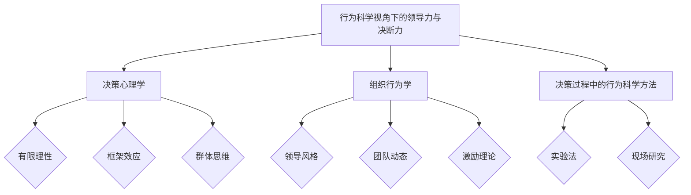

### 4.3 决策方法论与框架

在实际决策过程中，领导者需要遵循一套科学的方法论和框架，以确保决策的合理性和有效性。以下是几种常见的决策方法论和框架：

#### 4.3.1 SWOT分析

SWOT分析是一种用于评估企业或项目的优势、劣势、机会和威胁的方法。通过SWOT分析，领导者可以全面了解当前状况，制定更有效的决策。

1. **优势（Strengths）**：分析企业的优势，包括资源、能力、市场地位等。

2. **劣势（Weaknesses）**：识别企业的劣势，如缺乏资源、技能不足、市场局限等。

3. **机会（Opportunities）**：分析外部环境中的机会，如市场趋势、新技术、合作伙伴等。

4. **威胁（Threats）**：识别外部环境中的威胁，如竞争对手、法规变化、市场风险等。

   ```python
   # 伪代码：SWOT分析
   def swot_analysis():
       identify_strengths()
       identify_weaknesses()
       identify_opportunities()
       identify_threats()
   ```

#### 4.3.2 PDCA循环

PDCA循环（Plan-Do-Check-Act）是一种持续改进的方法论，适用于各种决策过程。它通过计划、执行、检查和行动的循环，不断优化决策效果。

1. **计划（Plan）**：制定目标、策略和行动计划。

2. **执行（Do）**：执行行动计划，并收集数据。

3. **检查（Check）**：检查执行结果，评估是否达成目标。

4. **行动（Act）**：根据检查结果，采取行动，包括修正计划或执行方案。

   ```python
   # 伪代码：PDCA循环
   def pdca_cycle():
       plan()
       execute()
       check_results()
       take_action()
   ```

#### 4.3.3 决策树

决策树是一种图形化工具，用于分析和比较不同决策路径的潜在结果和风险。它通过分支表示不同的决策和结果，帮助领导者评估不同选择的优劣。

1. **根节点**：表示初始决策。

2. **分支**：表示不同决策选项。

3. **叶子节点**：表示决策的结果和风险。

4. **概率和收益**：为每个结果分配概率和收益，计算总期望值。

   ```python
   # 伪代码：决策树
   def decision_tree():
       define_root_node()
       add_branches()
       add_leaves()
       assign_probabilities_and_returns()
       calculate_expected_values()
   ```

#### 4.3.4 贝叶斯网络

贝叶斯网络是一种基于概率的图形模型，用于表示决策中的不确定性。它通过节点表示变量，边表示变量之间的依赖关系，帮助领导者评估不同假设下的风险和收益。

1. **节点**：表示决策变量和结果。

2. **边**：表示变量之间的条件依赖关系。

3. **概率分布**：为每个变量分配条件概率分布。

4. **推理**：使用贝叶斯推理计算不同结果的条件概率。

   ```python
   # 伪代码：贝叶斯网络
   def bayesian_network():
       define_nodes()
       add_edges()
       define_probability_distributions()
       perform_bayesian_inference()
   ```

通过以上决策方法论和框架，领导者可以在复杂和不确定的环境中做出更合理和有效的决策。在实际应用中，领导者可以根据具体情况选择合适的框架，结合具体情境进行调整和优化。

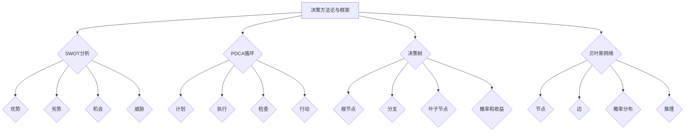

### 4.4 数学模型与公式

在决策过程中，数学模型和公式为领导者提供了量化和分析决策的量化工具，使其能够更加科学地做出决策。以下是几个关键的数学模型和公式的解释与示例：

#### 4.4.1 概率论

概率论是研究随机事件及其概率的数学分支。在决策过程中，概率论用于评估不同决策路径的概率和期望值。

1. **条件概率**：表示在某个事件发生的条件下，另一个事件发生的概率。其公式为：

   $$ P(A|B) = \frac{P(A \cap B)}{P(B)} $$

   其中，$P(A \cap B)$ 表示事件A和事件B同时发生的概率，$P(B)$ 表示事件B发生的概率。

   **示例**：假设在一次试验中，事件A表示“明天会下雨”，事件B表示“明天温度低于20摄氏度”。已知 $P(A) = 0.4$，$P(B) = 0.3$，且 $P(A \cap B) = 0.2$。求 $P(A|B)$。

   解：根据条件概率公式，有：
   $$ P(A|B) = \frac{0.2}{0.3} = \frac{2}{3} $$

2. **贝叶斯定理**：用于计算在已知部分证据的情况下，某个假设的概率。其公式为：

   $$ P(H|E) = \frac{P(E|H) \cdot P(H)}{P(E)} $$

   其中，$P(H|E)$ 表示在已知证据E的情况下，假设H的概率，$P(E|H)$ 表示在假设H成立时，证据E的概率，$P(H)$ 表示假设H的先验概率，$P(E)$ 表示证据E的概率。

   **示例**：假设有一个疾病H，其症状E的概率分别为 $P(H) = 0.01$，$P(E|H) = 0.9$，$P(E|\neg H) = 0.1$。已知观察到症状E的概率为 $P(E) = 0.05$。求在观察到症状E的情况下，疾病H的概率。

   解：根据贝叶斯定理，有：
   $$ P(H|E) = \frac{0.9 \cdot 0.01}{0.05} = 0.18 $$

#### 4.4.2 博弈论

博弈论研究具有冲突或合作性质的决策过程，广泛应用于竞争分析和战略规划。

1. **纳什均衡**：纳什均衡是指在一个博弈中，所有玩家都选择了最优策略，且没有任何玩家可以通过单方面改变策略来获得更好的结果。其定义公式为：

   $$ \forall i, s_i^* = arg\max_s u_i(s_i, s_{-i}) $$

   其中，$s_i^*$ 表示玩家i的最优策略，$u_i$ 表示玩家i的支付函数，$s_{-i}$ 表示其他玩家的策略组合。

   **示例**：考虑一个简单的二人博弈，玩家A和玩家B有两种策略：合作（C）和背叛（D）。两人的支付矩阵如下：

   |          | B合作   | B背叛   |
   |----------|---------|---------|
   | A合作    | (3, 3)  | (0, 5)  |
   | A背叛    | (5, 0)  | (1, 1)  |

   求纳什均衡。

   解：根据纳什均衡的定义，玩家A和玩家B的最优策略分别为：
   - 如果B合作，A的最优策略是背叛，因为 $u_A(D, C) = 5 > u_A(C, C) = 3$。
   - 如果B背叛，A的最优策略是背叛，因为 $u_A(D, D) = 1 > u_A(C, D) = 0$。
   - 因此，纳什均衡为（背叛，背叛）。

2. **最小最大值**：最小最大值（Minimax）策略是一种零和博弈中的决策策略，旨在使一个玩家的损失最小化。其公式为：

   $$ \min_{s_{-i}} \max_{s_i} u_i(s_i, s_{-i}) $$

   其中，$s_i$ 和 $s_{-i}$ 分别表示玩家i和-i的策略。

   **示例**：考虑上述的二人博弈，玩家A使用最小最大值策略。求A的最优策略。

   解：根据最小最大值策略，A的最优策略是选择使B的最小损失最大化的策略，即：
   - 如果B合作，A的最优策略是背叛，因为 $min\{5, 0\} = 0$。
   - 如果B背叛，A的最优策略是合作，因为 $min\{0, 1\} = 0$。
   - 因此，A的最优策略是背叛。

#### 4.4.3 决策树

决策树是一种用于表示决策过程的树形结构，每个节点代表一个决策或结果，每个分支代表一个可能的策略或结果。在决策树中，可以使用概率和期望值来评估不同决策路径的优劣。

1. **期望值**：期望值用于评估决策结果的平均收益。其公式为：

   $$ EV = \sum_{s} p(s) \cdot u(s) $$

   其中，$p(s)$ 表示策略s的概率，$u(s)$ 表示策略s的收益。

   **示例**：假设有一个决策问题，有两个策略A和B，每个策略有两种结果X和Y，对应的概率和期望值如下：

   | 策略 | X（概率0.4，收益4） | Y（概率0.6，收益2） |
   |------|-------------------|-------------------|
   | A    | 1.6               | 1.2               |
   | B    | 0.8               | 1.2               |

   求策略A和B的期望值。

   解：根据期望值公式，有：
   - 策略A的期望值：$EV_A = 0.4 \cdot 4 + 0.6 \cdot 2 = 3.2$
   - 策略B的期望值：$EV_B = 0.4 \cdot 0.8 + 0.6 \cdot 1.2 = 1.08$

   因此，策略A的期望值更高，是一个更好的选择。

通过这些数学模型和公式，领导者可以在决策过程中进行量化和分析，从而做出更加科学和合理的决策。

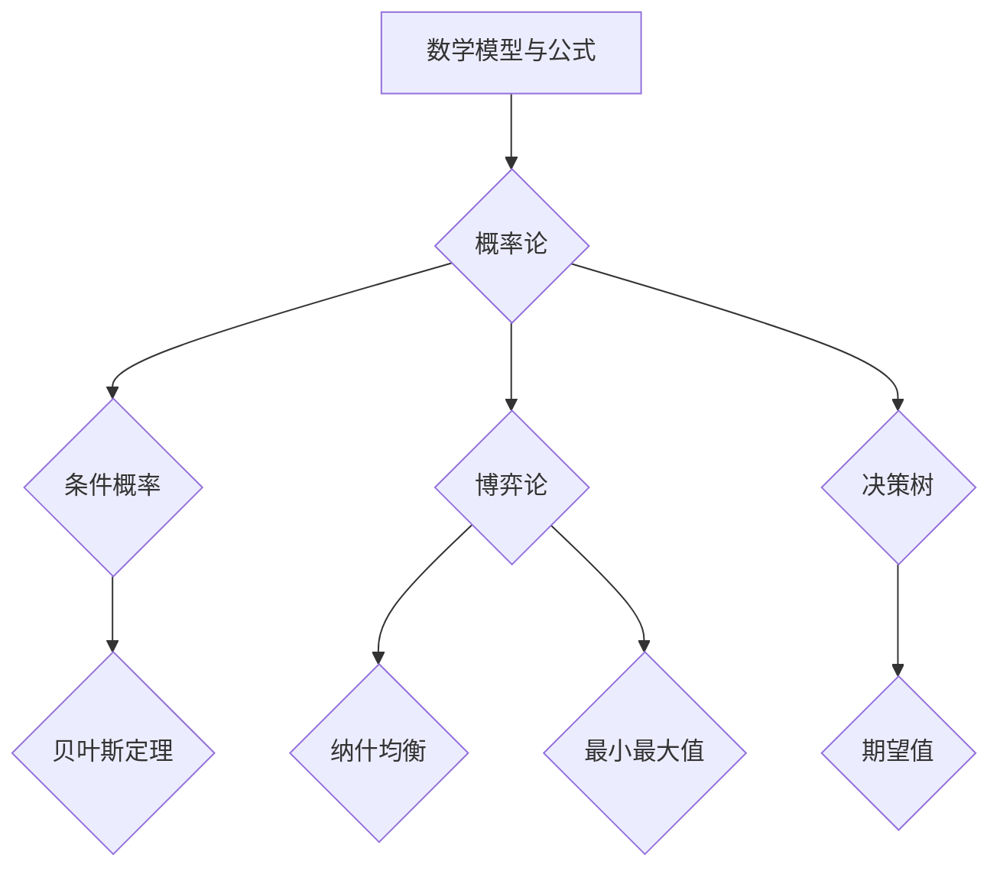

### 4.5 项目实战

为了更好地理解领导力与决断力在实际情境中的应用，我们将通过一个实际项目来展示如何运用这些概念。这个项目是一个大型软件公司的产品开发过程，该公司正在开发一款面向企业客户的项目管理软件。

#### 4.5.1 项目背景

该公司是一家专注于企业级软件解决方案的提供商，其客户群体主要包括大型制造企业和咨询公司。为了满足不断变化的市场需求，公司决定开发一款功能强大、用户友好的项目管理软件，以提升客户的工作效率和项目管理能力。

#### 4.5.2 项目开发过程

1. **需求分析**

   在项目启动阶段，项目经理与客户进行了深入的沟通，了解客户的需求和期望。通过需求分析，确定了软件的主要功能模块，包括任务管理、进度跟踪、资源分配、报告生成等。

   ```mermaid
   graph TD
   A[需求分析] --> B{任务管理}
   A --> C{进度跟踪}
   A --> D{资源分配}
   A --> E{报告生成}
   ```

2. **团队构建**

   根据项目需求，项目经理构建了一个跨部门的团队，包括前端开发人员、后端开发人员、测试工程师、UI设计师和项目经理本人。团队成员来自不同的专业背景，具有丰富的项目开发经验。

   ```mermaid
   graph TD
   A[团队构建] --> B{前端开发}
   A --> C{后端开发}
   A --> D{测试工程师}
   A --> E{UI设计师}
   ```

3. **项目计划**

   项目经理制定了详细的项目计划，包括项目目标、里程碑、任务分配和时间表。为了确保项目的顺利进行，项目经理还制定了风险管理计划，以应对可能出现的风险。

   ```mermaid
   graph TD
   A[项目计划] --> B{项目目标}
   A --> C{里程碑}
   A --> D{任务分配}
   A --> E{时间表}
   A --> F{风险管理计划}
   ```

4. **开发过程**

   在项目开发阶段，团队成员按照项目计划，分别负责各自的任务。项目经理定期召开团队会议，跟踪项目进度，解决开发过程中遇到的问题。

   ```mermaid
   graph TD
   A[开发过程] --> B{前端开发}
   A --> C{后端开发}
   A --> D{UI设计}
   A --> E{测试}
   ```

5. **决策过程

   在项目开发过程中，项目经理面临多个关键决策：

   - **技术选型**：在开发初期，项目经理需要选择合适的技术栈。通过分析团队的技术能力和市场需求，项目经理决定使用React和Node.js作为主要技术框架。
     
     ```mermaid
     graph TD
     A[技术选型] --> B{React}
     A --> C{Node.js}
     ```

   - **资源分配**：在项目进行过程中，项目经理需要根据团队成员的技能和可用时间，合理分配任务。通过与团队成员沟通，项目经理确保每个成员都能充分发挥自己的优势。

     ```mermaid
     graph TD
     A[资源分配] --> B{前端开发人员}
     A --> C{后端开发人员}
     A --> D{测试工程师}
     ```

   - **风险应对**：在项目开发过程中，项目经理需要及时识别和应对潜在的风险。例如，当发现一个关键模块存在性能瓶颈时，项目经理决定增加测试和优化时间，以确保项目的质量。

     ```mermaid
     graph TD
     A[风险应对] --> B{性能优化}
     A --> C{增加测试时间}
     ```

6. **项目交付

   在项目开发完成后，项目经理组织了验收测试，确保软件的功能和性能符合客户需求。经过多次迭代和优化，项目最终成功交付给客户。

   ```mermaid
   graph TD
   A[项目交付] --> B{验收测试}
   A --> C{软件交付}
   ```

#### 4.5.3 项目小结

通过这个实际项目，我们可以看到领导力与决断力在项目开发过程中的重要性。以下是项目小结：

1. **有效沟通**：项目经理通过定期召开会议和保持与团队成员的沟通，确保项目目标的清晰和任务的明确。

2. **团队协作**：项目经理通过合理分配任务和促进团队成员之间的协作，提高了项目的执行效率。

3. **决策能力**：项目经理在面对技术选型、资源分配和风险应对时，展现出了强大的决策能力，确保项目能够顺利推进。

4. **持续优化**：项目经理在项目开发过程中，不断进行迭代和优化，确保软件的功能和性能达到最佳状态。

通过这个项目，我们不仅看到了领导力与决断力在实际情境中的应用，也了解了如何通过有效的领导力和决断力，推动项目成功完成。

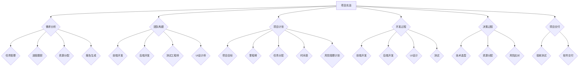

### 5. 最佳实践 tips

在领导力和决断力的实际应用中，以下是一些最佳实践，可以帮助领导者提高决策效果和团队执行力：

#### 5.1 建立清晰的目标和愿景

领导者应该明确组织的目标和愿景，并确保团队成员了解并认同这些目标。通过建立清晰的目标和愿景，可以减少团队成员之间的误解和冲突，提高团队的整体执行力。

#### 5.2 保持开放和透明的沟通

领导者应该保持开放和透明的沟通方式，鼓励团队成员分享观点和反馈。通过开放沟通，可以增强团队成员之间的信任，减少误解和猜疑，提高团队的协作效率。

#### 5.3 借鉴他人经验

领导者可以从其他成功案例中学习经验，借鉴他们的决策方法和领导技巧。通过不断学习和实践，可以提升自身的领导力和决断力，更好地应对各种挑战。

#### 5.4 培养团队协作精神

领导者应该积极培养团队协作精神，鼓励团队成员之间的合作和互助。通过团队合作，可以充分发挥每个人的优势，提高整体团队的执行力。

#### 5.5 及时调整和优化

领导者需要根据实际情况，及时调整和优化决策和计划。在变化的环境中，灵活调整和优化是确保项目成功的关键。

#### 5.6 关注团队成员的反馈

领导者应该关注团队成员的反馈，了解他们的需求和问题。通过倾听团队成员的声音，可以更好地了解团队的实际状况，并采取相应的措施解决问题。

#### 5.7 保持学习和成长

领导者应该保持学习和成长的心态，不断更新知识和技能。通过学习和成长，可以提升自身的领导力和决断力，更好地应对复杂和不确定的环境。

通过以上最佳实践，领导者可以更有效地运用领导力和决断力，推动团队和组织的发展。

### 6. 小结

在本文中，我们系统地探讨了领导力与决断力在IT领域的重要性及其应用。首先，我们介绍了领导力的基本概念和核心要素，如领导风格、领导者素质等，并通过Mermaid流程图展示了领导力的不同方面。接着，我们深入探讨了决断力的基本概念，包括决策速度与质量，以及决断力在压力下的重要性。随后，我们分析了心理学和行为科学视角下的领导力和决断力，介绍了决策过程中的心理因素和行为科学方法。在此基础上，我们提出了决策方法论和框架，帮助领导者更科学地做出决策。最后，我们通过一个实际项目展示了领导力和决断力在项目开发中的应用。

领导力和决断力是领导者不可或缺的能力，对于团队和组织的发展具有重要意义。通过本文的探讨，我们希望读者能够深入理解这些概念，并在实际工作中灵活运用，提升自身的领导力和决断力。在未来的技术变革中，领导力和决断力将成为领导者成功的关键因素，推动团队和组织不断进步。

### 7. 注意事项

在运用领导力和决断力时，领导者需要注意以下几点：

1. **保持客观和理性**：在做出决策时，领导者应该基于事实和数据，避免受个人情绪和偏见的影响。

2. **倾听团队成员的意见**：领导者应该鼓励团队成员参与决策过程，倾听他们的意见和反馈，以提高决策的全面性和准确性。

3. **灵活调整**：领导者需要根据实际情况，及时调整和优化决策和计划，以应对环境变化和不确定因素。

4. **关注团队成员的需求**：领导者应该关注团队成员的需求，提供必要的支持和资源，以激发团队成员的潜力和积极性。

5. **持续学习和成长**：领导者应该保持学习和成长的心态，不断更新知识和技能，提升自身的领导力和决断力。

通过注意这些事项，领导者可以更有效地运用领导力和决断力，推动团队和组织的发展。

### 8. 拓展阅读

对于想要深入了解领导力和决断力的读者，以下是一些推荐的拓展阅读资源：

1. **《领导力：理论与实践》**：本书由著名管理学家彼得·德鲁克（Peter Drucker）撰写，详细介绍了领导力的基本概念和实战方法。

2. **《决断力：如何在压力下做出正确决策》**：作者查尔斯·D·库珀（Charles D. Cooper）探讨了决断力的重要性，并提供了一系列实用的策略和技巧。

3. **《非暴力沟通》**：作者马歇尔·卢森堡（Marshall B. Rosenberg）介绍了非暴力沟通的原理和方法，帮助领导者提高沟通效果，建立信任和协作。

4. **《理性思维的艺术》**：作者理查德·萨勒（Richard Saule）探讨了理性思维的原理和应用，帮助领导者提高决策质量和逻辑思维能力。

5. **《游戏改变世界》**：作者汤姆·拉思（Tom Chatfield）通过研究游戏对人类行为的影响，提出了游戏化思维在领导力和决策中的应用。

通过阅读这些书籍，读者可以更全面地了解领导力和决断力的理论和实践，提升自身的领导能力和决策水平。

