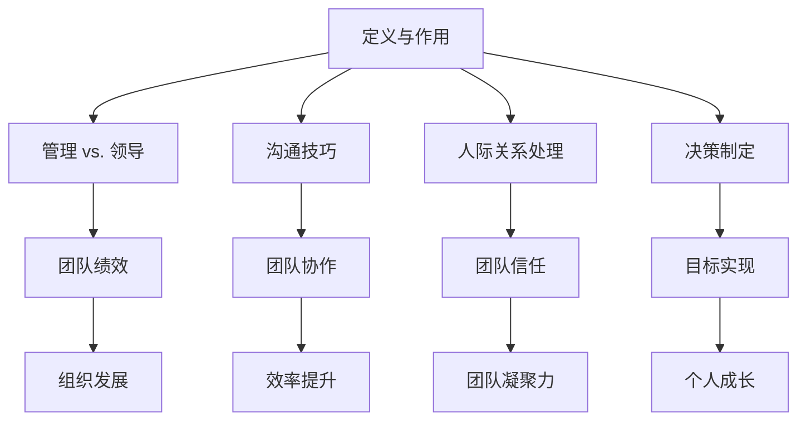
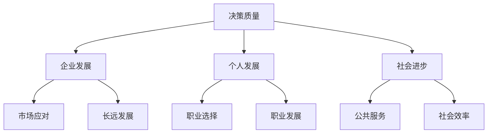

                 


### 第1章 引言与背景

#### 1.1 领导力的定义与作用

领导力是指一个人在组织或团队中通过影响、激励和引导他人来实现共同目标的能力。它不仅仅是管理，更是一种艺术，涉及沟通技巧、人际关系处理、决策制定等多方面。领导力不仅对企业的生存和发展起着至关重要的作用，也对个人的职业成长有着深远的影响。

**核心概念与联系：**

以下是领导力核心概念之间的联系架构的 Mermaid 流程图：



#### 1.2 决策质量的重要性

决策质量直接影响企业的竞争力和发展前景。一个高水平的决策不仅能够帮助企业应对市场变化，还能够抓住机遇，促进企业长远发展。对于个人而言，决策质量则关系到职业路径的选择和发展。在社会层面，高质量的决策能够推动社会进步，提高公共服务的效率和质量。

**核心概念与联系：**

以下是决策质量核心概念之间的联系架构的 Mermaid 流程图：



#### 1.3 本书结构安排与目标

本书旨在系统地探讨领导力与决策科学的关系，帮助读者提高决策质量。具体目标如下：

1. **阐述领导力与决策科学的基本概念和内涵。**
2. **分析领导力在决策过程中的作用和影响。**
3. **介绍决策科学的理论基础和实践方法。**
4. **探讨决策质量评估的方法和影响因素。**
5. **提供提高决策质量的策略和实践案例。**
6. **展望领导力与决策科学未来的发展趋势和挑战。**

**核心算法原理讲解：**

为了提高决策质量，可以采用以下算法原理：

```pseudo
Algorithm ImproveDecisionQuality(decisionContext):
    Input: decisionContext - The context of the decision to be made
    Output: improvedDecision - The decision made with improved quality

    1. Identify key factors in the decision context
    2. Collect relevant data and information
    3. Analyze the data using statistical and optimization methods
    4. Generate alternative solutions based on the analysis
    5. Evaluate each solution using a decision-making model
    6. Select the best solution based on the evaluation
    7. Implement the decision and monitor the outcomes
    8. Reflect on the decision process and learn from the outcomes
```

**数学模型和公式：**

在决策过程中，常常会用到一些数学模型和公式，如：

$$
\text{Expected Utility} = \sum_{i=1}^{n} p_i \cdot u_i
$$

其中，$p_i$ 是第 $i$ 种方案的概率，$u_i$ 是第 $i$ 种方案所带来的效用。

**详细讲解与举例说明：**

假设一家公司需要决定是否投资一项新项目。以下是具体的决策过程：

1. **定义与作用**：首先，明确投资新项目的目标，如增加市场份额、提升品牌影响力等。
2. **收集数据**：收集与投资项目相关的市场数据、竞争对手信息、成本和收益预估等。
3. **数据分析**：使用统计分析方法，如回归分析、方差分析等，对数据进行分析，以确定项目的潜在收益和风险。
4. **生成方案**：根据分析结果，生成不同的投资方案，如全投、部分投资或放弃投资。
5. **评价方案**：使用决策模型，如期望效用模型，对每个方案进行评价，比较其预期收益和风险。
6. **决策实施**：选择最佳方案并实施，如全投或部分投资。
7. **结果监控**：在项目实施过程中，定期监控项目进展，评估实际收益和风险，与预期目标进行对比。
8. **反思与学习**：项目结束后，对整个决策过程进行反思，分析成功和失败的原因，总结经验教训，为未来决策提供参考。

**项目实战：**

以一个实际项目为例，假设一家互联网公司需要决定是否开发一款新的社交媒体应用。以下是该项目决策过程的实战：

1. **需求分析**：分析市场现状和用户需求，确定新应用的功能和特点。
2. **技术评估**：评估开发新应用所需的技术难度和时间成本。
3. **市场预测**：预测新应用的市场前景，如用户规模、收益预估等。
4. **风险分析**：分析可能面临的市场竞争、技术风险等。
5. **决策制定**：根据分析结果，制定开发计划，如开发时间表、预算分配等。
6. **项目实施**：按计划开展项目开发，定期评估进展，确保项目按计划进行。
7. **结果评估**：项目上线后，评估用户反馈和市场表现，确定项目成功与否。
8. **总结经验**：总结项目经验，为未来类似项目提供决策参考。

**小结：**

领导力与决策科学是相辅相成的，一个优秀的领导者不仅要有良好的领导力，还要具备科学的决策能力。通过系统化的分析和科学的决策方法，可以提高决策质量，为企业和社会带来更大的价值。

**注意事项：**

1. 决策过程中，要充分考虑各种因素，包括内部和外部因素。
2. 决策时，要遵循逻辑和数据分析，避免主观臆断。
3. 决策后，要持续监控和评估决策结果，以便及时调整和改进。

**拓展阅读：**

- Tannenbaum, R. L., & Schmidt, W. H. (1973). How Leaders Lead. Harvard Business Review, 51(5), 75-79.
- Simon, H. A. (1991). Bounded Rationality and Organizational Learning. Organization Science, 2(1), 125-134.
- Davenport, T. H., & Prusak, L. (1998). Working Knowledge: How Organizations Manage What They Know. Harvard Business School Press.

### 总结：

领导力与决策科学是现代企业和组织中不可或缺的两个要素。一个优秀的领导者不仅需要具备领导力，还要掌握科学的决策方法。通过本书，读者可以了解到领导力与决策科学的基本概念、理论基础和实践方法，从而提高决策质量，为个人和组织的成功奠定坚实基础。作者：AI天才研究院/AI Genius Institute & 禅与计算机程序设计艺术 /Zen And The Art of Computer Programming

