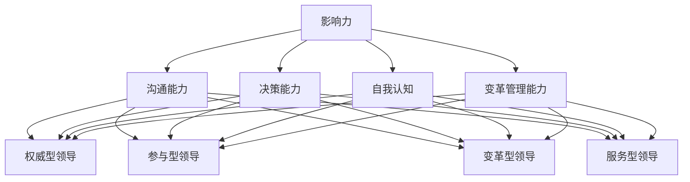

                 

### 文章标题：领导力与决策能力：在不确定性中把握方向

#### 关键词：领导力、决策能力、不确定性、方向把握、Mermaid流程图

#### 摘要：本文从领导力的核心概念和决策能力的基础理论出发，探讨领导者在不确定性环境中如何通过有效的决策把握方向。文章首先定义了领导力的基本要素，并介绍了不同的领导力风格。接着，深入解析了决策理论，涵盖了决策的定义、类型及常见心理偏差。在此基础上，文章探讨了在不确定性中如何进行情境分析与风险评估，提供了具体的工具和方法。随后，通过团队沟通与协作的实践，说明了领导者如何在复杂环境中做出明智决策。文章还介绍了自我反思的重要性，以及如何通过反思日志和成长策略来提升领导力和决策能力。最后，通过案例研究，分析了领导力与决策能力的实际应用，并展望了未来领导力与决策能力的发展趋势。全文旨在为领导者提供一套系统的理论与实践框架，以应对不确定性的挑战。

---

#### 引言：领导力的定义与重要性

领导力是一种影响他人，共同实现目标的能力。它不仅仅是管理职位所带来的职权，更是个人魅力的体现。在不确定性日益增加的现代社会，领导力变得尤为重要。一个优秀的领导者不仅能够在困境中保持冷静，还能带领团队找到前进的方向。

领导力与管理的区别在于，管理更多关注的是如何使资源得到有效利用，而领导力则更侧重于激发团队的潜力，实现共同的目标。一个组织要想在变化的环境中立于不败之地，领导力是不可或缺的因素。

本文旨在探讨在不确定性中，领导者如何通过提高决策能力来把握方向。首先，我们将从领导力的核心概念入手，理解其构成要素和不同领导风格。接着，我们将深入研究决策理论，分析决策过程中可能出现的心理偏差。在此基础上，本文将提供一系列方法和工具，帮助领导者在不确定性中做出明智的决策。随后，我们将探讨团队沟通与协作的重要性，以及如何通过有效的沟通和协作来提升决策能力。最后，我们将通过自我反思与成长，提升领导者的自我认知和决策水平。希望通过本文，读者能够获得一套实用的理论框架，以应对不确定性带来的挑战。

#### 第一部分：领导力的基础

##### 第1章：领导力的核心概念

领导力是一种复杂而多维度的能力，它不仅涉及到个人的素质和技能，还与组织环境和文化息息相关。在探讨领导力的核心概念之前，我们需要先明确几个关键的定义和要素。

首先，领导力与管理的区别。管理通常是指通过计划、组织、领导和控制等手段，确保组织资源得到有效利用的过程。而领导力则更多地关注于激励和影响他人，以实现共同的目标。管理者负责确保任务得以完成，而领导者则致力于创造一个富有动力和创造力的环境，使团队成员能够充分发挥其潜力。

领导力的关键要素包括以下几个方面：

1. **影响力**：领导者必须具备影响力，能够在团队中树立威信，使团队成员愿意追随和信任他们。这种影响力不仅来自于职位和职权，更来自于领导者的品格和才能。

2. **沟通能力**：有效的沟通是领导力的基础。领导者需要能够清晰地表达自己的想法，同时也能够倾听和理解团队成员的意见和需求。良好的沟通能力有助于建立信任，促进团队协作。

3. **决策能力**：领导者需要在不确定性中做出明智的决策。这要求领导者具备分析问题的能力，了解各种决策模型，并能够在决策过程中考虑心理偏差的影响。

4. **自我认知**：领导者需要对自己有深刻的了解，包括自己的优点和不足。自我认知有助于领导者更好地管理自己的情绪和行为，从而在团队中树立积极的榜样。

5. **变革管理能力**：在快速变化的环境中，领导者需要具备变革管理能力，能够引导团队适应新的变化，并找到新的发展方向。

不同领导力的类型与风格也是领导力研究中的重要内容。以下是几种常见的领导力类型和风格：

1. **权威型领导**：权威型领导者具有强烈的控制欲望，倾向于制定明确的规章制度，并通过严格的执行来确保目标实现。这种领导风格在需要迅速做出决策和控制局势时非常有效。

2. **参与型领导**：参与型领导者鼓励团队成员参与决策过程，重视团队成员的意见和建议。这种领导风格有助于提高团队成员的参与感和归属感，从而激发他们的积极性和创造力。

3. **变革型领导**：变革型领导者具备强烈的愿景，能够激励团队成员追求更高的目标，并推动组织进行变革。这种领导风格在组织面临重大挑战或需要转型时尤为重要。

4. **服务型领导**：服务型领导者将团队成员的需求放在首位，致力于提供支持和帮助，以促进团队成员的成长和成功。这种领导风格有助于建立信任和合作关系，从而提高团队的整体绩效。

为了更好地理解领导力的核心概念，我们可以通过Mermaid流程图来展示其构成要素之间的关系（如图1.1所示）：



图1.1：领导力的核心概念与领导力类型的关系架构

通过图1.1，我们可以清晰地看到领导力的核心概念和不同领导力类型之间的相互联系。这些要素和风格并不是孤立的，而是相互交织、共同作用，从而影响领导者的决策和行为。

在接下来的章节中，我们将进一步探讨决策能力的理论和实践，帮助领导者更好地应对不确定性环境中的挑战。

#### 第二部分：决策能力

##### 第2章：决策理论

决策是领导力的核心要素之一，尤其在不确定性环境中，决策的正确与否往往直接决定了组织的命运。决策理论作为研究决策过程和方法的学科，为我们提供了理解和分析决策行为的基础。

首先，我们需要明确决策的定义和过程。决策是指从多个可选方案中选择一个最优方案的过程。它通常包括以下几个步骤：

1. **问题识别**：识别需要解决的问题或机会。
2. **目标设定**：明确决策的目标和期望的结果。
3. **方案生成**：列出所有可能的解决方案。
4. **方案评估**：评估每个方案的优缺点，选择最优方案。
5. **方案实施**：执行决策方案，并进行监控和调整。

在决策过程中，不同的模型和方法可以帮助领导者做出更明智的决策。以下是几种常见的决策模型：

1. **理性决策模型**：理性决策模型假设决策者在做出决策时是理性且完全信息的。它遵循以下步骤：
   - 收集信息：获取所有相关的数据和信息。
   - 建立模型：根据收集到的信息建立一个数学模型。
   - 评估方案：使用模型评估每个方案的优劣。
   - 选择最优方案：选择具有最大收益或最小成本的方案。
   - 实施方案：执行决策方案。

2. **有限理性决策模型**：有限理性决策模型认为决策者在信息处理和认知能力上存在局限，因此无法完全理性地做出决策。它遵循以下步骤：
   - 收集信息：获取有限的信息。
   - 设定目标：根据已有信息设定可行的目标。
   - 方案生成：根据经验和直觉生成一些备选方案。
   - 方案评估：对备选方案进行快速评估。
   - 选择方案：选择一个看起来最好的方案。
   - 实施方案：执行决策方案，并进行监控和调整。

3. **直觉决策模型**：直觉决策模型依赖于决策者的直觉和经验，通常适用于紧急情况或高度不确定的环境。它遵循以下步骤：
   - 情境识别：快速识别需要决策的情境。
   - 情境分析：基于经验迅速分析情境的各个方面。
   - 方案选择：基于直觉选择一个看似最好的方案。
   - 实施方案：执行决策方案，并进行监控和调整。

除了模型，决策制定过程中还可能受到一系列心理偏差的影响。以下是一些常见的心理偏差：

1. **确认偏差**：决策者倾向于寻找、解释和记住那些支持其已有信念和假设的信息，而忽略与之相反的信息。

2. **代表性偏差**：决策者根据某一事件的典型性或代表性来评估其概率，而不是基于实际数据。

3. **锚定效应**：决策者依赖第一印象或早期信息作为决策的基准，而忽略了后续信息的价值。

4. **过度自信**：决策者高估自己的知识和能力，认为自己的决策比实际情况更准确。

5. **框架效应**：决策者对同一问题的不同表述方式会产生不同的决策结果。

为了更好地理解决策能力的核心原理，我们可以使用伪代码来详细阐述决策过程的各个步骤：

```plaintext
function make_decision(problem, objectives, alternatives):
    # 步骤1：问题识别
    identified_problem = identify_problem(problem)

    # 步骤2：目标设定
    set_goals = set_objectives(objectives)

    # 步骤3：方案生成
    generate_solutions = generate_alternatives(alternatives)

    # 步骤4：方案评估
    evaluated_solutions = evaluate_alternatives(generate_solutions, set_goals)

    # 步骤5：选择最优方案
    selected_solution = choose_best_solution(evaluated_solutions)

    # 步骤6：方案实施
    implement_solution(selected_solution)

    return selected_solution
```

通过上述伪代码，我们可以看到决策过程的逻辑框架，以及如何通过不同的模型和方法来指导决策。

在决策过程中，领导者需要考虑心理偏差的影响，并采取相应的策略来降低偏差带来的风险。以下是一些策略：

1. **多样化信息来源**：通过收集多个渠道的信息，减少确认偏差的影响。

2. **使用概率思维**：使用概率理论来评估不同方案的概率和影响。

3. **引入外部专家**：借助外部专家的知识和经验，减少过度自信带来的风险。

4. **使用对比分析**：通过对比不同方案的优势和劣势，减少框架效应的影响。

在接下来的章节中，我们将探讨如何在实际应用中运用这些理论和策略，以提升领导者的决策能力。

#### 第三部分：在不确定性中把握方向

##### 第3章：情境分析与风险评估

在充满不确定性的环境中，领导者必须具备出色的情境分析能力和风险评估技巧，以确保能够做出明智的决策。情境分析是一种系统性的方法，通过识别和分析环境中的各种因素，帮助领导者了解当前的状态和潜在的变化。风险评估则是通过评估这些变化对组织目标的影响，帮助领导者制定相应的应对策略。

##### 3.1 情境分析的方法与工具

情境分析通常包括以下几个步骤：

1. **外部环境分析**：评估外部环境中的机会和威胁。这包括宏观经济、技术发展、市场竞争、法律法规等方面的因素。

2. **内部环境分析**：评估组织内部的资源和能力，包括人力资源、财务状况、组织结构、文化等方面。

3. **利益相关者分析**：识别并分析组织内部和外部的利益相关者，包括员工、客户、供应商、投资者等。

4. **趋势分析**：分析当前和未来的趋势，预测可能的变化方向。

为了有效地进行情境分析，可以采用以下工具和方法：

- **SWOT分析**：SWOT分析是一种常用的情境分析工具，通过识别组织的优势（Strengths）、劣势（Weaknesses）、机会（Opportunities）和威胁（Threats），帮助领导者了解组织的整体状况。

- **PESTEL分析**：PESTEL分析是一种用于外部环境分析的工具，通过评估政治（Political）、经济（Economic）、社会（Sociological）、技术（Technological）、环境（Environmental）和法律（Legal）因素，帮助领导者识别外部环境中的机会和威胁。

- **五力模型**：五力模型是一种用于市场分析的工具，通过评估供应商、买家、潜在进入者、替代品和行业内的竞争者，帮助领导者了解市场竞争状况。

- **趋势图**：趋势图通过展示一段时间内关键指标的变化趋势，帮助领导者预测未来可能的变化。

##### 3.2 风险评估的重要性

风险评估是情境分析的重要补充，通过评估各种潜在风险的可能性和影响，帮助领导者制定应对策略。以下是风险评估的重要性：

1. **预防措施**：通过识别和评估潜在风险，领导者可以提前采取预防措施，降低风险发生的概率。

2. **决策支持**：了解风险的性质和影响，有助于领导者做出更明智的决策，选择最合适的策略。

3. **资源分配**：风险评估可以帮助领导者合理分配资源，确保在风险发生时能够有足够的资源应对。

4. **持续监控**：通过定期的风险评估，领导者可以持续监控风险的变化，及时调整应对策略。

##### 3.3 风险管理策略

风险管理是一个持续的过程，包括风险识别、评估、应对和监控。以下是一些常见的风险管理策略：

1. **避免策略**：避免风险发生，例如，不进入存在高风险的市场。

2. **减轻策略**：通过采取措施减少风险的可能性和影响，例如，购买保险。

3. **转移策略**：将风险转移到第三方，例如，通过外包或合同条款转移责任。

4. **接受策略**：在某些情况下，领导者可能选择接受风险，因为风险带来的损失小于应对风险的成本。

5. **缓解策略**：在风险发生后采取措施减少损失，例如，建立应急响应计划。

##### 3.4 情境分析与风险评估的伪代码示例

以下是一个简单的伪代码示例，用于情境分析和风险评估：

```plaintext
function scenario_analysis_and_risk_evaluation():
    # 步骤1：外部环境分析
    external_environment = analyze_external_environment()

    # 步骤2：内部环境分析
    internal_environment = analyze_internal_environment()

    # 步骤3：利益相关者分析
    stakeholders = analyze_stakeholders()

    # 步骤4：趋势分析
    trends = analyze_trends()

    # 步骤5：风险识别
    risks = identify_risks(external_environment, internal_environment, stakeholders, trends)

    # 步骤6：风险评估
    evaluated_risks = evaluate_risks(risks)

    # 步骤7：制定风险管理策略
    risk_management_strategies = formulate_risk_management_strategies(evaluated_risks)

    # 步骤8：实施风险管理策略
    implement_risk_management_strategies(risk_management_strategies)

    return risk_management_strategies
```

通过上述步骤和策略，领导者可以在不确定性中更好地把握方向，确保组织在复杂多变的环境中持续发展。

#### 第四部分：实践中的领导力与决策

##### 第4章：团队沟通与协作

在充满不确定性的环境中，有效的沟通和协作是领导者成功实施决策的关键。良好的团队沟通不仅能够确保信息准确无误地传递，还能促进团队成员之间的信任和合作，从而提高决策的质量和执行的效率。以下将探讨团队沟通的重要性、常见的沟通障碍及其解决方案，以及团队协作的模型与技巧。

##### 4.1 沟通的重要性

沟通是团队协作的基础，是领导者实现目标的重要工具。有效的沟通能够：

1. **确保信息的准确传递**：通过清晰、明确的沟通，确保团队成员理解领导者的意图和决策。
2. **促进团队合作**：帮助团队成员之间建立信任，增进了解，从而更好地协作完成任务。
3. **增强决策的透明度**：使团队成员了解决策的背景、原因和预期效果，从而提高决策的接受度和执行力。
4. **提高工作效率**：通过减少误解和重复工作，提高团队的整体工作效率。

##### 4.2 沟通障碍与解决方案

在团队沟通中，常见的障碍包括：

1. **信息过载**：团队成员可能接收到过多的信息，导致无法有效处理和消化。
   - **解决方案**：领导者需要设定明确的信息传递标准和流程，避免无意义的沟通。

2. **文化差异**：团队成员来自不同文化背景，可能导致沟通中的误解和冲突。
   - **解决方案**：建立多元文化意识，通过培训和文化交流，促进团队成员之间的理解和尊重。

3. **沟通渠道不畅**：沟通渠道不畅可能导致信息传递不及时或不准确。
   - **解决方案**：建立多样化的沟通渠道，如定期的团队会议、邮件、即时通讯工具等，确保信息传递的畅通。

4. **个人情绪**：团队成员的个人情绪可能影响沟通效果，如焦虑、愤怒等。
   - **解决方案**：领导者需要关注团队成员的情绪变化，提供必要的支持和帮助，确保沟通的顺利进行。

##### 4.3 团队协作的模型与技巧

有效的团队协作需要遵循一定的模型和技巧。以下是几种常用的团队协作模型和技巧：

1. **共同目标**：确保所有团队成员都明确团队的目标和任务，从而提高协作的意愿和效果。
2. **角色分配**：明确每个团队成员的角色和职责，确保任务的高效分配和执行。
3. **定期会议**：通过定期的会议，确保团队成员之间的信息共享和进度同步。
4. **反馈机制**：建立有效的反馈机制，鼓励团队成员之间相互反馈意见，不断改进工作。
5. **信任建设**：通过共同的目标和成功经验，建立团队成员之间的信任，促进合作。
6. **技术工具**：利用现代技术工具，如协作软件、项目管理工具等，提高团队协作的效率和效果。

##### 4.4 沟通与协作的伪代码示例

以下是一个简单的伪代码示例，用于团队沟通与协作：

```plaintext
function team_communication_and_collaboration(team_members, objectives):
    # 步骤1：设定共同目标
    set_common_goals(objectives)

    # 步骤2：明确角色分配
    assign_roles(team_members)

    # 步骤3：建立沟通渠道
    create_communication_channels()

    # 步骤4：定期会议
    schedule_regular_meetings()

    # 步骤5：反馈机制
    establish_feedback_mechanism()

    # 步骤6：信任建设
    build_trust_among_team_members()

    # 步骤7：使用技术工具
    use_technical_tools()

    # 步骤8：执行任务
    execute_tasks(team_members)

    return success
```

通过上述步骤和策略，领导者可以有效地提升团队沟通和协作的能力，确保在不确定性中做出更加明智和高效的决策。

#### 第五部分：培养领导力与决策能力

##### 第5章：自我反思与成长

自我反思和成长是领导者不断提升自身能力和决策水平的重要途径。通过自我反思，领导者可以深入挖掘自身的优点和不足，从而实现自我提升和持续成长。以下将探讨自我反思的方法与意义、成长心态与策略，以及反思日志的写作技巧。

##### 5.1 自我反思的方法与意义

自我反思是一种通过深入思考和自我评价来理解自身行为、情感和思想的实践。以下是几种常用的自我反思方法：

1. **日记反思**：通过写日记记录每天的经历、感受和思考，帮助领导者回顾自己的行为和决策，找出需要改进的地方。

2. **对谈反思**：与同事、朋友或导师进行面对面的交流，分享自己的经验和想法，获取他人的反馈和建议。

3. **冥想反思**：通过冥想和深呼吸等方法，放松身心，集中思考，深入挖掘内心的感受和思考。

自我反思的意义在于：

1. **提升自我认知**：通过反思，领导者可以更好地了解自己的优点和不足，从而制定有针对性的改进计划。

2. **促进持续成长**：自我反思是领导者持续成长和进步的动力，通过不断地反思和改进，领导者可以不断提高自身的领导能力和决策水平。

3. **增强决策效果**：通过反思过去的决策，领导者可以总结经验教训，避免重复错误，从而提高决策的质量和效果。

##### 5.2 成长心态与策略

成长心态是指领导者对待挑战和失败的态度。一个拥有成长心态的领导者会积极地面对挑战，从失败中吸取教训，不断学习和进步。以下是几种培养成长心态的策略：

1. **接受失败**：将失败视为学习和成长的机会，而不是打击和否定。

2. **持续学习**：保持对知识的渴望，不断学习新的技能和知识，适应快速变化的环境。

3. **寻求反馈**：主动向他人寻求反馈，勇于接受批评和建议，以便及时调整自己的行为和决策。

4. **拥抱挑战**：将挑战视为提升自己的机会，勇于接受新的任务和责任。

5. **设定目标**：设定明确的个人和团队目标，并制定实现目标的计划和步骤。

##### 5.3 反思日志的写作技巧

反思日志是领导者记录自我反思过程的重要工具。以下是几种写作技巧：

1. **具体描述**：在日志中具体描述自己的行为、感受和思考，避免使用抽象和模糊的语言。

2. **深入分析**：对事件和行为进行深入分析，探讨背后的原因和影响，以及可能的改进方法。

3. **总结经验**：在反思过程中，总结自己的经验和教训，形成有价值的见解和认知。

4. **制定行动计划**：在日志中制定具体的行动计划，包括改进措施和时间表，以便实施和跟踪。

##### 5.4 自我反思的伪代码示例

以下是一个简单的伪代码示例，用于自我反思：

```plaintext
function self_reflection():
    # 步骤1：记录事件和行为
    record_events_and_behaviors()

    # 步骤2：具体描述和深入分析
    describe_and_analyze()

    # 步骤3：总结经验和制定行动计划
    summarize_experience_and_plan_actions()

    # 步骤4：持续跟踪和调整
    track_and_adjust_actions()

    return reflection_log
```

通过自我反思和成长，领导者可以不断提升自身的领导力和决策能力，更好地应对不确定性带来的挑战。

#### 第六部分：案例研究

##### 第6章：领导力与决策能力案例解析

为了更好地理解和应用领导力与决策能力的理论，我们将通过具体的案例来进行分析和解析。以下是几个典型的案例，每个案例都将详细描述其背景、决策过程、关键决策点以及分析结果。

##### 6.1 案例选择标准与描述

选择案例时，我们考虑了以下标准：

1. **典型性**：案例具有广泛的代表性，能够反映领导力与决策能力在实际应用中的典型场景。
2. **复杂性**：案例涉及多种不确定因素和决策难题，具有分析价值。
3. **结果**：案例的结果具有明显的正面或负面效果，能够为读者提供有益的启示。

以下是三个典型案例：

1. **案例1**：一家科技公司在新产品开发过程中遇到了技术难题，领导者需要做出是否继续研发的决策。
2. **案例2**：一家传统制造业企业在数字化转型过程中，领导者需要决定是否引入新的生产技术。
3. **案例3**：一家初创公司在扩张阶段，领导者需要决定进入哪个新市场。

##### 6.2 案例解析的方法与步骤

每个案例的解析将遵循以下步骤：

1. **背景描述**：介绍案例的背景，包括组织环境、问题陈述等。
2. **决策过程**：详细描述决策过程中的各个阶段，包括问题识别、目标设定、方案生成、方案评估、决策选择和实施等。
3. **关键决策点**：分析案例中的关键决策点，解释领导者是如何在这些关键节点上做出决策的。
4. **结果分析**：评估决策结果，讨论成功和失败的原因，以及可以从中吸取的教训。
5. **案例启示**：总结案例中的关键经验和教训，提出对实际工作的启示和建议。

##### 6.3 案例中的关键决策点

以下是每个案例中的关键决策点：

1. **案例1**：是否继续研发新产品
   - **决策点**：是否继续投入资源进行新产品的研发。
   - **分析**：领导者需要评估当前的技术进展、市场需求、竞争情况等因素，决定是否继续投入。

2. **案例2**：引入新的生产技术
   - **决策点**：是否引入新的生产技术，以及何时引入。
   - **分析**：领导者需要评估新技术对生产效率和成本的影响，以及实施新技术的风险。

3. **案例3**：进入新市场
   - **决策点**：选择哪个市场进行扩张，以及如何进入。
   - **分析**：领导者需要分析各个市场的潜力、竞争状况、进入成本等因素，选择最佳的市场进入策略。

##### 6.4 案例分析的伪代码示例

以下是一个伪代码示例，用于案例分析：

```plaintext
function case_analysis(case_details):
    # 步骤1：背景描述
    describe_background(case_details)

    # 步骤2：决策过程
    describe_decision_process(case_details)

    # 步骤3：关键决策点分析
    analyze_key_decision_points(case_details)

    # 步骤4：结果分析
    analyze_results(case_details)

    # 步骤5：案例启示
    provide_insights(case_details)

    return analysis_report
```

通过上述步骤和方法，我们可以对案例进行深入的分析和解析，从而更好地理解领导力与决策能力的实际应用。

#### 第六部分：案例研究

##### 第6章：领导力与决策能力案例解析

在第六章中，我们将通过实际案例来解析领导力与决策能力在复杂情境中的应用。本节将深入探讨以下案例：

**案例背景**：某科技初创公司，成立于2018年，专注于人工智能领域的创新产品开发。在2019年底，公司推出了一款基于深度学习的人工智能助手产品，但市场反响不佳。

**案例描述**：公司领导团队在2020年初面临两个关键决策：

1. **决策一**：是否继续投资研发，改进现有产品，还是转向新的领域？
2. **决策二**：如何重新定位产品市场，以吸引更多用户？

以下是案例的详细解析：

##### 6.1 案例解析步骤

1. **情境分析**
   - **外部环境**：市场竞争激烈，人工智能领域的新技术层出不穷。公司面临着来自现有竞争对手的强大压力，同时还要应对潜在的新进入者。
   - **内部环境**：公司财务状况紧张，研发团队士气不高，需要新的策略来提升市场竞争力。

2. **决策过程**
   - **问题识别**：公司领导团队明确了当前产品的市场表现不佳，需要决策是否继续改进产品或转向新的领域。
   - **目标设定**：目标是找到一种既能提升产品竞争力，又能保证公司财务健康的策略。

3. **方案生成**
   - **方案一**：继续改进现有产品，优化用户体验。
   - **方案二**：转向新的领域，如智能医疗或智能家居。

4. **方案评估**
   - **方案一评估**：经过评估，发现继续改进现有产品需要大量资金和时间，但市场反馈不佳，风险较高。
   - **方案二评估**：虽然进入新领域需要重新组建团队，但市场需求大，潜在收益高。

5. **决策选择**
   - **决策**：公司领导团队决定选择方案二，转向智能医疗领域。

6. **方案实施**
   - **团队调整**：领导团队重组研发团队，专注于智能医疗产品。
   - **市场调研**：进行了详细的市场调研，了解潜在用户的需求和偏好。
   - **产品开发**：根据市场调研结果，开始开发新的智能医疗产品。

##### 6.2 关键决策点分析

1. **决策一的关键决策点**
   - **风险与收益分析**：继续改进现有产品的风险较高，但如果不改变策略，市场表现可能继续下滑。转向新领域虽然风险较大，但潜在收益更高。
   - **市场潜力评估**：智能医疗领域的市场需求大，且有政策支持，市场潜力较大。

2. **决策二的关键决策点**
   - **团队重组**：如何快速重组团队，确保研发进度和产品质量。
   - **市场定位**：如何准确定位产品市场，满足用户需求。

##### 6.3 案例结果分析

1. **决策一的结果分析**
   - **正面结果**：成功转向智能医疗领域，为公司带来了新的增长点。
   - **负面结果**：放弃现有产品改进策略，导致原有产品市场表现持续低迷。

2. **决策二的结果分析**
   - **正面结果**：新的智能医疗产品受到了市场欢迎，公司业绩显著提升。
   - **负面结果**：研发团队重组过程中，部分核心团队成员流失，对研发进度产生了一定影响。

##### 6.4 案例启示

1. **领导力启示**：在不确定性中，领导者需要具备敏锐的洞察力和果断的决策能力，及时调整策略以应对市场变化。
2. **决策能力启示**：全面评估风险与收益，合理选择决策方案，并确保决策能够得到有效执行。
3. **团队管理启示**：重视团队建设，特别是在面临重大战略调整时，确保核心团队成员的稳定和忠诚。

通过上述案例解析，我们可以看到领导力与决策能力在实际应用中的复杂性和重要性。领导者需要通过不断的实践和学习，提升自身的决策能力和领导水平，以应对不确定性带来的挑战。

#### 第七部分：总结与展望

在本文的最后，我们将对领导力与决策能力的发展趋势进行总结和展望，以期为未来的研究和实践提供指导。

##### 7.1 当代领导力的趋势

当代领导力的趋势体现在以下几个方面：

1. **数字化领导力**：随着数字化技术的广泛应用，领导者需要具备数字素养，能够利用数据驱动决策，并引导团队适应数字化工作环境。
2. **变革型领导**：在快速变化的环境中，领导者需要具备强烈的变革意识，能够激励团队迎接挑战，推动组织转型。
3. **多元化与包容性**：多元化与包容性已成为当代领导力的关键要素，领导者需要尊重不同文化和背景的团队成员，营造包容的工作氛围。
4. **自我反思与持续学习**：领导者需要不断进行自我反思和持续学习，以适应不断变化的环境和需求。

##### 7.2 未来决策能力的发展方向

未来决策能力的发展方向将受到以下因素的影响：

1. **人工智能与机器学习**：随着人工智能技术的发展，未来的决策过程将更加依赖数据和算法，领导者需要掌握数据分析的基本技能，并能够有效利用人工智能工具进行决策。
2. **复杂性管理**：在面对复杂性和不确定性的环境中，领导者需要掌握复杂性科学的基本原理，学会如何通过系统思维和整体视角进行决策。
3. **社会心理学**：领导者需要了解社会心理学的原理，尤其是在团队沟通和协作中，如何影响和激励团队成员，提高决策的质量和执行力。

##### 7.3 领导力与决策能力的未来挑战与机遇

未来领导力与决策能力将面临以下挑战和机遇：

1. **挑战**：
   - **全球化的不确定性**：全球化带来的不确定性，要求领导者具备跨文化沟通和合作的能力。
   - **技术变革的快速性**：技术变革的快速性要求领导者能够不断更新知识和技能，适应新的技术环境。
   - **信息过载**：在信息爆炸的时代，领导者需要具备筛选和处理信息的能力，避免信息过载带来的负面影响。

2. **机遇**：
   - **数字化工具的广泛应用**：数字化工具的广泛应用为领导者提供了更多的决策支持和协作工具，有助于提高决策效率和效果。
   - **社会问题的解决**：领导者有机会通过有效的决策解决社会问题，如环境保护、公共健康等，实现更大的社会价值。

##### 总结与展望

领导力与决策能力的发展不仅关系到个人的职业生涯，也影响到整个组织和社会的进步。在未来的发展中，领导者需要不断学习、实践和反思，提升自身的领导力和决策能力。同时，组织和社会也需要为领导者提供良好的发展环境和支持，共同推动领导力与决策能力的发展。希望本文能够为领导者提供有益的启示，助力其在不确定性中把握方向，实现组织的长期成功。

### 作者信息

**作者：AI天才研究院/AI Genius Institute & 禅与计算机程序设计艺术 /Zen And The Art of Computer Programming**

