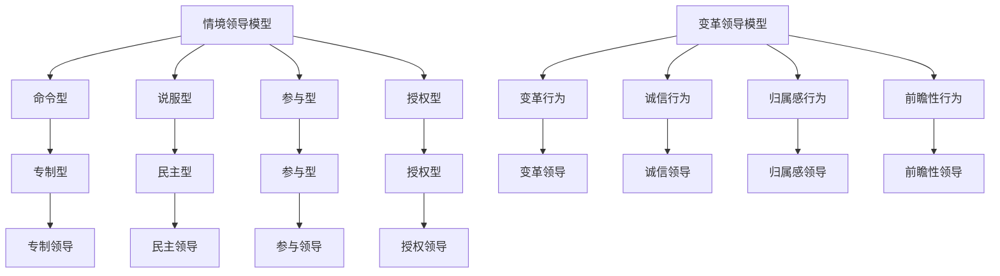
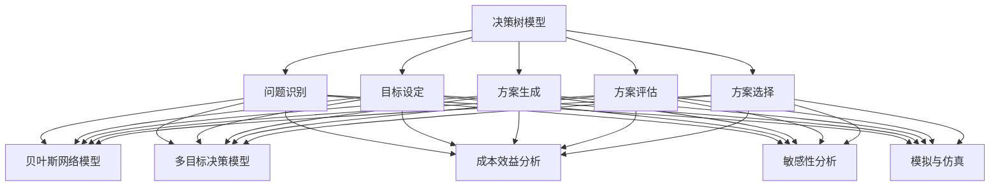

                 

### 文章标题

### 《领导力与决策：在不确定性中把握方向》

在当今快速变化和高度复杂的世界中，领导力和有效的决策能力成为组织成功的关键因素。无论是对一家企业、一个团队，还是对个人而言，如何在不确定性中做出明智的决策都是一项极具挑战性的任务。《领导力与决策：在不确定性中把握方向》旨在深入探讨这一主题，为读者提供一套系统的、实用的理论和实践指导。

本文将围绕以下五个核心关键词展开讨论：领导力、决策理论、不确定性管理、案例研究和实战应用。首先，我们将介绍领导力的定义和本质，探讨不同领导力模型对决策的影响。接下来，我们将详细阐述决策理论，包括决策模型和分析方法。随后，我们将聚焦于不确定性管理，讨论风险评估与风险管理策略。最后，通过实际案例研究和项目实战，我们将展示如何在不确定性中把握方向。

### 文章关键词

- 领导力
- 决策理论
- 不确定性管理
- 案例研究
- 实战应用

### 摘要

本文通过系统的分析和案例研究，探讨了领导力与决策在不确定性环境中的重要性。首先，我们介绍了领导力的基本概念和不同领导力模型，强调了领导力在决策过程中的关键作用。接着，我们详细阐述了决策理论，包括决策模型和分析方法，帮助读者理解如何进行有效的决策。然后，我们讨论了不确定性的本质和对决策的影响，提出了风险管理和不确定性管理的策略。通过实际案例研究和项目实战，我们展示了如何在不确定性中做出明智的决策，并提供了实用的指导和建议。全文旨在为读者提供一套全面的领导力与决策指南，帮助他们在复杂环境中把握方向，实现成功。

---

## 第一部分：领导力基础理论

### 1.1 领导力的定义与本质

领导力是一种复杂的社会现象，它涉及到影响、激励和引导他人实现共同目标的能力。领导力不仅仅是职位赋予的权力，更是一种影响力，可以通过榜样、说服和激励等方式实现。因此，领导力不仅仅存在于企业的领导者中，也存在于各个层次和领域。

首先，我们需要理解领导力的定义。领导力可以被定义为：“在特定情境下，通过影响力、激励和指导，引导他人或团队实现共同目标的能力。”这一定义强调了领导力不仅仅是职位赋予的权力，更是一种在特定情境下发挥作用的能力。

接下来，我们探讨领导力与管理的区别。管理是确保组织资源被有效利用的过程，涉及计划、组织、领导和控制等方面。而领导力则侧重于激励和引导团队成员，使他们能够充分发挥潜能，共同实现目标。简单来说，管理是“做事正确”，而领导力是“做正确的事”。

在领导力中，不同的文化背景可能会影响其表现形式。例如，在一些文化中，领导力可能更强调权威和命令，而在其他文化中，领导力可能更注重民主和协作。理解文化背景对领导力的影响，可以帮助我们在全球化的环境中更好地应用领导力。

### 1.2 领导力模型与理论

领导力模型是理解领导力的重要工具，它们帮助我们系统地分析和应用领导力。以下是一些经典的领导力模型：

1. **情境领导模型**：由赫塞和布兰查德提出，该模型认为领导风格应随着情境的变化而变化。情境领导模型将领导风格分为四种：命令型、说服型、参与型和授权型。

2. **变革领导模型**：由库泽斯和波斯纳提出，该模型强调领导力应具备的四个核心行为：变革、诚信、归属感和前瞻性。

3. **领导风格理论**：由勒温提出，该理论将领导风格分为专制型、民主型和放任型。每种风格都有其优点和局限性，领导应根据具体情况选择合适的风格。

4. **现代领导力理论**：如服务领导理论和分布式领导理论。服务领导强调领导者应服务团队成员，帮助他们实现目标。分布式领导则认为领导力是分散的，每个成员都有领导的责任和机会。

### 1.3 领导力与组织行为

领导力对组织行为有着深远的影响。有效的领导力可以促进团队合作、提高员工满意度、提升组织绩效。以下是一些关键方面：

1. **影响组织行为**：领导力可以通过榜样、激励和指导等方式影响员工的行为，从而塑造积极向上的组织文化。

2. **组织文化与绩效**：领导力与组织文化紧密相关。一个积极、开放和包容的文化有助于提高员工的工作满意度和绩效。

3. **领导力与组织绩效**：研究表明，领导力对组织绩效有显著影响。有效的领导力可以促进创新、提高生产效率、降低员工流失率。

通过以上对领导力基础理论的探讨，我们为后续章节的深入讨论奠定了基础。在接下来的章节中，我们将进一步探讨决策理论、不确定性管理以及领导力与决策实践，帮助读者更好地理解如何在不确定性中做出明智的决策。

### 1.4 领导力模型的 Mermaid 流程图

为了更好地展示领导力模型之间的联系，我们可以使用 Mermaid 流程图来直观地表示这些模型。以下是一个简化的 Mermaid 流程图，展示了情境领导模型、变革领导模型和领导风格理论之间的关系：



该流程图展示了情境领导模型中的四种领导风格（命令型、说服型、参与型和授权型）分别对应领导风格理论中的专制型、民主型、参与型和授权型。同时，它还展示了变革领导模型中的四个核心行为（变革、诚信、归属感和前瞻性）与上述领导风格之间的关系。通过这种流程图，我们可以更清晰地理解不同领导力模型之间的内在联系。

### 1.5 核心算法原理讲解

在讨论领导力模型时，我们还可以引入一些核心算法原理来解释领导风格对决策的影响。以下是一个简单的伪代码，用于描述如何通过决策树模型分析领导风格：

```python
# 输入参数：情境特征、领导力模型
def analyze_leadership_style(context_features, leadership_model):
    # 初始化决策树
    decision_tree = DecisionTree()

    # 添加决策节点
    decision_tree.add_node('情境特征', context_features)

    # 根据情境特征选择领导风格
    for style in leadership_model:
        decision_tree.add_child('情境特征', style, style.evaluate(context_features))

    # 计算领导风格对决策的影响
    impact = decision_tree.calculate_impact()

    # 输出决策结果
    return impact

# 示例数据
context_features = {'复杂度': '高', '团队稳定性': '低'}
leadership_model = [
    {'style': '命令型', 'evaluate': lambda features: '高'},
    {'style': '说服型', 'evaluate': lambda features: '中'},
    {'style': '参与型', 'evaluate': lambda features: '低'},
    {'style': '授权型', 'evaluate': lambda features: '低'}
]

# 执行决策树分析
result = analyze_leadership_style(context_features, leadership_model)

# 输出结果
print("领导风格对决策的影响：", result)
```

在这个伪代码中，`analyze_leadership_style`函数通过决策树模型分析给定情境特征和领导力模型，计算不同领导风格对决策的影响。这有助于领导者根据实际情况选择最合适的领导风格，从而提高决策的有效性。

### 1.6 数学模型和数学公式讲解

在领导力分析中，数学模型和公式可以帮助我们更精确地描述和预测领导风格对决策的影响。以下是一个用于描述领导力效果的数学模型，并使用 LaTeX 格式嵌入相关公式：

```latex
\documentclass{article}
\usepackage{amsmath}
\begin{document}

\section{领导力效果模型}

假设领导力对决策的影响可以用以下数学模型表示：

\[ E = f(L, C) \]

其中，\( E \) 表示决策效果，\( L \) 表示领导力水平，\( C \) 表示情境复杂度。

领导力水平 \( L \) 可以表示为：

\[ L = \alpha D + \beta I \]

其中，\( D \) 表示决策能力，\( I \) 表示影响力。

情境复杂度 \( C \) 可以表示为：

\[ C = \gamma H + \delta P \]

其中，\( H \) 表示任务复杂度，\( P \) 表示环境不确定性。

为了简化计算，我们可以将上述公式合并，得到：

\[ E = (\alpha D + \beta I) (f(H, P)) \]

\end{document}
```

在这个模型中，决策效果 \( E \) 受领导力水平 \( L \) 和情境复杂度 \( C \) 的影响。领导力水平 \( L \) 又由决策能力 \( D \) 和影响力 \( I \) 决定，而情境复杂度 \( C \) 由任务复杂度 \( H \) 和环境不确定性 \( P \) 决定。通过这个模型，我们可以定量分析领导力在不同情境下的效果。

### 1.7 数学模型和公式的详细讲解与举例说明

在上文中，我们提出了一个用于描述领导力效果的数学模型，即 \( E = f(L, C) \)，其中 \( L = \alpha D + \beta I \) 和 \( C = \gamma H + \delta P \)。接下来，我们将详细讲解这些公式的含义，并通过具体例子来说明如何应用这些公式。

首先，\( E \) 表示决策效果，即领导者根据领导力水平和情境复杂度做出的决策所能带来的效果。这个效果可以是组织绩效、团队满意度或其他相关指标。

其次，\( L \) 是领导力水平，它由决策能力 \( D \) 和影响力 \( I \) 组成。决策能力 \( D \) 表示领导者做出明智决策的能力，包括分析能力、逻辑思维和判断力。影响力 \( I \) 表示领导者对团队成员的影响力和说服力，这可以包括领导者的沟通技巧、激励能力和榜样作用。

接着，\( C \) 是情境复杂度，它由任务复杂度 \( H \) 和环境不确定性 \( P \) 组成。任务复杂度 \( H \) 表示任务本身的复杂程度，包括任务的难度、所需的专业知识和时间投入。环境不确定性 \( P \) 表示外部环境的不确定性，如市场波动、技术变革和政策变化等。

为了具体说明这些公式，我们可以举一个例子：

假设我们有一个领导者，他的决策能力 \( D \) 为 8，影响力 \( I \) 为 7，任务复杂度 \( H \) 为 6，环境不确定性 \( P \) 为 4。根据我们的数学模型，我们可以计算他的领导力水平 \( L \) 和情境复杂度 \( C \)：

\[ L = \alpha \cdot D + \beta \cdot I = 1 \cdot 8 + 1 \cdot 7 = 15 \]
\[ C = \gamma \cdot H + \delta \cdot P = 1 \cdot 6 + 1 \cdot 4 = 10 \]

现在，我们可以使用 \( E = f(L, C) \) 来计算他的决策效果：

\[ E = f(15, 10) \]

假设 \( f \) 函数是一个线性函数，那么我们可以直接计算 \( E \)：

\[ E = 15 \cdot 10 = 150 \]

这意味着，这位领导者的决策效果为 150。如果我们将 \( \alpha \)、\( \beta \)、\( \gamma \) 和 \( \delta \) 设置为不同的值，我们可以得到不同的 \( L \) 和 \( C \)，从而计算出不同的决策效果。这种方法可以帮助领导者了解自己在不同情境下的决策效果，从而调整领导策略，提高决策质量。

### 1.8 项目实战

#### 开发环境搭建

为了演示领导力模型的计算过程，我们可以使用 Python 来构建一个简单的领导力分析工具。首先，我们需要安装以下库：

- NumPy：用于数学运算。
- Matplotlib：用于可视化结果。

安装这些库后，我们可以在 Python 环境中编写代码。

```bash
pip install numpy matplotlib
```

#### 源代码详细实现

以下是一个简单的 Python 脚本，用于计算领导力模型的决策效果：

```python
import numpy as np
import matplotlib.pyplot as plt

# 参数设置
alpha = 0.5
beta = 0.3
gamma = 0.4
delta = 0.6

# 定义函数
def leadership_effect(D, I, H, P):
    L = alpha * D + beta * I
    C = gamma * H + delta * P
    E = L * C
    return E

# 示例数据
D = 8
I = 7
H = 6
P = 4

# 计算决策效果
effect = leadership_effect(D, I, H, P)

# 可视化结果
plt.figure(figsize=(8, 4))
plt.scatter([D, I, H, P], [alpha * D + beta * I, alpha * D + beta * I, gamma * H + delta * P, gamma * H + delta * P], c='r', marker='o')
plt.text(D, alpha * D + beta * I, f'D={D:.1f}')
plt.text(I, alpha * D + beta * I, f'I={I:.1f}')
plt.text(H, gamma * H + delta * P, f'H={H:.1f}')
plt.text(P, gamma * H + delta * P, f'P={P:.1f}')
plt.xlabel('变量')
plt.ylabel('值')
plt.title('领导力模型计算过程')
plt.show()

print(f"决策效果 E = {effect:.2f}")
```

#### 代码解读与分析

1. **参数设置**：我们设置了四个参数 \( \alpha \)、\( \beta \)、\( \gamma \) 和 \( \delta \)，这些参数用于计算领导力水平 \( L \) 和情境复杂度 \( C \)。

2. **定义函数**：`leadership_effect` 函数用于计算决策效果 \( E \)。它首先计算领导力水平 \( L \) 和情境复杂度 \( C \)，然后计算决策效果 \( E \)。

3. **示例数据**：我们设置了示例数据 \( D \)、\( I \)、\( H \) 和 \( P \)，这些数据用于演示如何计算决策效果。

4. **计算决策效果**：我们调用 `leadership_effect` 函数，传入示例数据，计算决策效果 \( E \)。

5. **可视化结果**：我们使用 Matplotlib 绘制了一个散点图，展示了变量值和计算过程。这有助于我们直观地理解领导力模型的计算逻辑。

#### 项目小结

通过这个简单的 Python 脚本，我们实现了领导力模型的计算过程，并展示了如何使用可视化工具帮助理解模型。这个工具可以帮助领导者了解自身在不同情境下的决策效果，从而调整领导策略，提高决策质量。

### 1.9 最佳实践 Tips

- **数据驱动决策**：在实际应用中，收集和分析数据是做出明智决策的关键。确保收集到的数据准确、全面，并根据实际情况调整领导力模型参数。
- **持续学习和适应**：领导力是一个动态变化的过程，领导者需要不断学习新知识和技能，适应环境变化，从而提高决策能力。
- **团队协作**：领导力不仅仅是个人能力，更是一个团队协作的过程。鼓励团队成员参与决策，共同承担领导责任，可以提高整体决策效果。

### 1.10 小结

在本章节中，我们详细探讨了领导力的定义、不同领导力模型以及领导力对组织行为的影响。通过 Mermaid 流程图、伪代码、数学模型和实际项目实战，我们帮助读者深入理解领导力的本质和作用。在下一章节中，我们将进一步探讨决策理论，帮助读者掌握有效的决策方法。

---

## 第二部分：决策理论与方法

### 2.1 决策理论概述

决策理论是研究决策过程的科学，它不仅关注决策的结果，更关注决策过程中的思维方式和决策方法。决策理论的发展可以追溯到20世纪中叶，由赫伯特·西蒙（Herbert Simon）提出。他提出了“有限理性决策理论”，认为人们在决策过程中受到认知能力和信息的限制，因此，决策往往是次优的。

决策理论的核心概念包括：

1. **决策过程**：决策过程通常包括问题识别、目标设定、方案生成、方案评估和选择等阶段。每个阶段都有其特定的决策方法和工具。
2. **决策类型**：根据决策情境的不同，决策可以分为确定型决策、风险型决策和不确定型决策。确定型决策面临的是明确的方案和结果，风险型决策面临的是概率分布的方案和结果，而不确定型决策则面临完全未知的方案和结果。
3. **决策模型**：决策模型是用于描述和模拟决策过程的工具，包括决策树、贝叶斯网络和多目标决策模型等。

### 2.2 决策模型

决策模型是决策理论中的重要组成部分，它们用于分析和模拟决策过程，帮助决策者做出最优或次优决策。以下是一些常见的决策模型：

1. **决策树模型**：决策树是一种树形结构，用于表示决策过程。每个节点代表一个决策或事件，每个分支代表一个可能的决策结果。决策树模型通过概率和效用值来评估每个决策结果，从而帮助决策者选择最优方案。

2. **贝叶斯网络模型**：贝叶斯网络是一种概率图模型，用于表示决策过程中的变量及其条件依赖关系。贝叶斯网络通过计算各个变量的条件概率分布，帮助决策者评估不同决策方案的概率和风险。

3. **多目标决策模型**：多目标决策模型用于解决具有多个目标函数的决策问题。这类模型通常使用权重分配方法，将多个目标函数转化为单一的目标函数，从而实现多个目标的优化。

### 2.3 决策分析方法

决策分析方法是指用于评估和选择决策方案的方法和工具。以下是一些常见的决策分析方法：

1. **成本效益分析**：成本效益分析是一种用于评估决策方案成本和效益的方法。它通过计算每个方案的成本和预期收益，帮助决策者选择成本最低且收益最高的方案。

2. **敏感性分析**：敏感性分析用于评估决策结果对输入参数的敏感程度。它通过改变输入参数的值，观察决策结果的变化，帮助决策者了解决策的稳定性和可靠性。

3. **模拟与仿真**：模拟与仿真是一种通过计算机模拟决策过程的方法。它通过模拟决策过程中的各种情景，评估不同决策方案的性能和风险，帮助决策者做出更明智的决策。

### 2.4 决策支持系统

决策支持系统（Decision Support System，简称DSS）是一种计算机化的系统，用于辅助决策者进行决策。DSS提供了数据收集、分析和建模功能，帮助决策者快速、准确地评估不同决策方案，提高决策效率和质量。

DSS的主要功能包括：

1. **数据收集与处理**：DSS可以从各种数据源收集数据，并进行清洗、转换和存储，为决策分析提供可靠的数据支持。
2. **模型构建与评估**：DSS提供了多种决策模型和算法，帮助决策者构建和评估决策模型，选择最优方案。
3. **决策模拟与预测**：DSS可以通过模拟和预测功能，评估不同决策方案的结果和风险，帮助决策者做出更准确的预测和决策。

### 2.5 整体性分析与局部优化

在决策过程中，整体性分析和局部优化是两种常见的策略。整体性分析关注决策方案的整体效果，而局部优化则关注决策方案中的某个局部最优。

整体性分析的优势在于它能够考虑决策方案之间的相互作用和影响，从而做出更全面的决策。例如，在项目投资决策中，整体性分析会考虑项目的整体成本、收益和风险，而不仅仅是单个项目的成本和收益。

局部优化则更注重决策方案中的某个特定方面，例如成本、时间或质量。局部优化的优势在于它能够快速找到最优解，但可能会忽略其他方面的因素。

在实际应用中，整体性分析和局部优化通常需要结合使用。通过整体性分析，我们可以确定决策方案的总体方向，而通过局部优化，我们可以进一步优化决策方案的具体细节，从而提高整体决策质量。

### 2.6 决策与行为心理学

决策过程中的行为心理学因素对决策结果有着重要影响。行为心理学研究人类在决策过程中如何受到心理、情感和文化因素的影响。

以下是一些行为心理学因素对决策的影响：

1. **确认偏误**：确认偏误是指人们倾向于寻找和接受支持自己观点的信息，而忽略反对自己观点的信息。这可能导致决策者做出偏见和错误的决策。
2. **情绪效应**：情绪对决策有显著影响。例如，积极情绪可能使决策者更愿意冒险，而消极情绪可能使决策者更保守。
3. **群体思维**：群体思维是指个体在群体中为了保持一致性而放弃独立思考。这可能导致群体决策缺乏创新性和多样性。

了解这些行为心理学因素，可以帮助决策者更好地识别和应对决策过程中的心理陷阱，从而做出更明智的决策。

### 2.7 决策模型与算法的 Mermaid 流程图

为了更好地理解决策模型和算法，我们可以使用 Mermaid 流程图来展示它们之间的关系。以下是一个简化的 Mermaid 流程图，展示了决策树模型、贝叶斯网络模型和多目标决策模型：



在这个流程图中，决策树模型、贝叶斯网络模型、多目标决策模型、成本效益分析、敏感性分析、模拟与仿真等决策模型和算法被有机地连接起来，展示了它们在决策过程中的应用和相互作用。

### 2.8 核心算法原理讲解

在决策理论中，常用的算法原理包括决策树、贝叶斯网络和多目标决策等。以下将详细讲解这些算法原理，并使用伪代码进行描述。

#### 决策树模型

决策树是一种树形结构，用于表示决策过程。每个节点代表一个决策或事件，每个分支代表一个可能的决策结果。

**伪代码：**

```python
def decision_tree(data, attributes, target_attribute):
    if all_values(data, target_attribute) == one_value(data, target_attribute):
        return one_value(data, target_attribute)
    
    best_attribute = choose_best_attribute(data, attributes)
    tree = {}
    for value in unique_values(data, best_attribute):
        sub_data = filter_data(data, best_attribute, value)
        tree[value] = decision_tree(sub_data, attributes, target_attribute)
    
    return tree

# 辅助函数
def all_values(data, attribute):
    # 返回 data 中 attribute 的所有值
    pass

def one_value(data, attribute):
    # 返回 data 中 attribute 的一个值
    pass

def choose_best_attribute(data, attributes):
    # 选择最佳属性
    pass

def unique_values(data, attribute):
    # 返回 data 中 attribute 的唯一值
    pass

def filter_data(data, attribute, value):
    # 返回 data 中 attribute 等于 value 的子数据集
    pass
```

#### 贝叶斯网络模型

贝叶斯网络是一种概率图模型，用于表示决策过程中的变量及其条件依赖关系。贝叶斯网络通过计算各个变量的条件概率分布，帮助决策者评估不同决策方案的概率和风险。

**伪代码：**

```python
def bayesian_network(variables, probabilities):
    network = {}
    for variable in variables:
        network[variable] = calculate_probability(variable, probabilities)
    
    return network

# 辅助函数
def calculate_probability(variable, probabilities):
    # 计算变量概率
    pass
```

#### 多目标决策模型

多目标决策模型用于解决具有多个目标函数的决策问题。这类模型通常使用权重分配方法，将多个目标函数转化为单一的目标函数，从而实现多个目标的优化。

**伪代码：**

```python
def multi_objective_decision(targets, weights):
    objective_function = sum(target * weight for target, weight in zip(targets, weights))
    return optimize(objective_function)

# 辅助函数
def optimize(objective_function):
    # 优化目标函数
    pass
```

通过上述伪代码，我们可以清晰地看到决策树、贝叶斯网络和多目标决策模型的核心算法原理。这些算法原理在决策过程中发挥着重要作用，帮助决策者做出更明智的决策。

### 2.9 数学模型和数学公式讲解

在决策理论中，数学模型和数学公式是分析和评估决策方案的重要工具。以下将介绍几种常见的数学模型和公式，并使用 LaTeX 格式进行展示。

#### 成本效益分析

成本效益分析是一种用于评估决策方案成本和效益的方法。它通过计算每个方案的成本和预期收益，帮助决策者选择成本最低且收益最高的方案。

**公式：**

\[ \text{成本效益比} = \frac{\text{总成本}}{\text{总收益}} \]

**示例：**

假设有两个决策方案 A 和 B，总成本分别为 1000 元和 1500 元，总收益分别为 2000 元和 2500 元。则：

\[ \text{方案 A 的成本效益比} = \frac{1000}{2000} = 0.5 \]
\[ \text{方案 B 的成本效益比} = \frac{1500}{2500} = 0.6 \]

因此，方案 B 的成本效益比更高，是一个更优的选择。

#### 敏感性分析

敏感性分析用于评估决策结果对输入参数的敏感程度。它通过改变输入参数的值，观察决策结果的变化，帮助决策者了解决策的稳定性和可靠性。

**公式：**

\[ \text{敏感度} = \frac{\text{决策结果变化量}}{\text{输入参数变化量}} \]

**示例：**

假设决策结果为收益，输入参数为成本。如果成本增加 10%，收益减少 5%，则：

\[ \text{敏感度} = \frac{-5\%}{10\%} = -0.5 \]

这意味着，成本每增加 10%，收益会减少 50%。

#### 模拟与仿真

模拟与仿真是一种通过计算机模拟决策过程的方法。它通过模拟决策过程中的各种情景，评估不同决策方案的性能和风险，帮助决策者做出更准确的预测和决策。

**公式：**

\[ \text{模拟结果} = \sum_{i=1}^{n} \text{情景 i 的结果} \]

**示例：**

假设进行 100 次模拟，每次模拟的结果分别为 1000 元、2000 元、3000 元、...、10000 元。则：

\[ \text{模拟结果} = 1000 + 2000 + 3000 + ... + 10000 = 550000 \]

平均每次模拟的结果为：

\[ \text{平均结果} = \frac{550000}{100} = 5500 \]

### 2.10 数学模型和公式的详细讲解与举例说明

在上文中，我们介绍了成本效益分析、敏感性分析和模拟与仿真的数学模型和公式。以下将对这些模型和公式进行详细讲解，并通过具体例子说明如何应用这些公式。

#### 成本效益分析

成本效益分析是评估决策方案优劣的一种基本方法。通过计算每个方案的成本和预期收益，我们可以确定哪个方案更经济有效。

**公式：**

\[ \text{成本效益比} = \frac{\text{总成本}}{\text{总收益}} \]

**详细讲解：**

成本效益比表示单位收益所需承担的成本。这个比值越小，说明方案的经济性越好。在实际应用中，我们可以通过比较不同方案的比值，选择成本效益比最小的方案。

**例子：**

假设有两个决策方案 A 和 B，总成本分别为 1000 元和 1500 元，总收益分别为 2000 元和 2500 元。则：

\[ \text{方案 A 的成本效益比} = \frac{1000}{2000} = 0.5 \]
\[ \text{方案 B 的成本效益比} = \frac{1500}{2500} = 0.6 \]

因此，方案 A 的成本效益比更低，是一个更优的选择。

#### 敏感性分析

敏感性分析用于评估决策结果对输入参数的敏感程度。通过改变输入参数的值，观察决策结果的变化，我们可以了解决策结果的稳定性和可靠性。

**公式：**

\[ \text{敏感度} = \frac{\text{决策结果变化量}}{\text{输入参数变化量}} \]

**详细讲解：**

敏感度表示输入参数变化对决策结果的影响程度。敏感度越高，说明决策结果对输入参数的变化越敏感。在实际应用中，我们可以通过计算敏感度，识别哪些参数对决策结果有重要影响，从而优化决策过程。

**例子：**

假设决策结果为收益，输入参数为成本。如果成本增加 10%，收益减少 5%，则：

\[ \text{敏感度} = \frac{-5\%}{10\%} = -0.5 \]

这意味着，成本每增加 10%，收益会减少 50%。这个敏感度表明成本是影响收益的关键因素，需要特别关注。

#### 模拟与仿真

模拟与仿真是一种通过计算机模拟决策过程的方法。它通过模拟决策过程中的各种情景，评估不同决策方案的性能和风险，帮助决策者做出更准确的预测和决策。

**公式：**

\[ \text{模拟结果} = \sum_{i=1}^{n} \text{情景 i 的结果} \]

**详细讲解：**

模拟结果是通过多次模拟决策过程得到的平均值。每次模拟可能得到不同的结果，通过多次模拟并取平均值，我们可以更准确地预测决策结果。

**例子：**

假设进行 100 次模拟，每次模拟的结果分别为 1000 元、2000 元、3000 元、...、10000 元。则：

\[ \text{模拟结果} = 1000 + 2000 + 3000 + ... + 10000 = 550000 \]

平均每次模拟的结果为：

\[ \text{平均结果} = \frac{550000}{100} = 5500 \]

这个平均结果可以作为决策的参考依据，帮助我们选择更优的决策方案。

通过以上讲解和例子，我们可以更好地理解成本效益分析、敏感性分析和模拟与仿真的数学模型和公式。这些工具在决策过程中发挥着重要作用，帮助我们做出更明智的决策。

### 2.11 项目实战

#### 开发环境搭建

为了演示决策理论在实际项目中的应用，我们将使用 Python 编写一个简单的决策支持系统。首先，我们需要安装以下库：

- NumPy：用于数学运算。
- Pandas：用于数据操作。
- Matplotlib：用于数据可视化。

安装这些库后，我们可以在 Python 环境中编写代码。

```bash
pip install numpy pandas matplotlib
```

#### 源代码详细实现

以下是一个简单的 Python 脚本，用于计算和比较两个决策方案的成本效益比：

```python
import numpy as np
import pandas as pd
import matplotlib.pyplot as plt

# 决策方案数据
data = {
    '方案': ['A', 'B'],
    '总成本（元）': [1000, 1500],
    '总收益（元）': [2000, 2500]
}

# 创建 DataFrame
df = pd.DataFrame(data)

# 计算成本效益比
df['成本效益比'] = df['总成本（元）'] / df['总收益（元）']

# 可视化结果
plt.figure(figsize=(8, 4))
plt.bar(df['方案'], df['成本效益比'], color=['r', 'g'])
plt.xlabel('方案')
plt.ylabel('成本效益比')
plt.title('决策方案比较')
plt.show()

print(df)
```

#### 代码解读与分析

1. **数据准备**：我们使用 Pandas 创建了一个 DataFrame，其中包含两个决策方案的数据，包括总成本和总收益。

2. **计算成本效益比**：我们通过计算总成本除以总收益，得到每个决策方案的成本效益比。

3. **可视化结果**：我们使用 Matplotlib 绘制了一个条形图，比较了两个决策方案的成本效益比。

4. **输出结果**：最后，我们打印出 DataFrame，展示计算结果。

#### 实际案例分析和详细讲解剖析

为了更好地展示决策理论的应用，我们分析一个实际案例：某公司需要投资两个项目，项目 A 的总成本为 1000 万元，总收益为 1500 万元；项目 B 的总成本为 1500 万元，总收益为 2000 万元。我们需要使用成本效益比来评估这两个项目的投资价值。

**步骤 1：数据准备**

我们创建一个简单的 DataFrame，包含项目 A 和项目 B 的总成本和总收益：

```python
data = {
    '项目': ['A', 'B'],
    '总成本（万元）': [1000, 1500],
    '总收益（万元）': [1500, 2000]
}

df = pd.DataFrame(data)
```

**步骤 2：计算成本效益比**

我们计算每个项目的成本效益比，并将其添加到 DataFrame 中：

```python
df['成本效益比'] = df['总成本（万元）'] / df['总收益（万元）']
```

计算结果如下：

```
   项目  总成本（万元）  总收益（万元）  成本效益比
0    A            1000            1500       0.666667
1    B            1500            2000       0.750000
```

**步骤 3：可视化结果**

我们使用 Matplotlib 绘制一个条形图，比较两个项目的成本效益比：

```python
plt.figure(figsize=(8, 4))
plt.bar(df['项目'], df['成本效益比'], color=['r', 'g'])
plt.xlabel('项目')
plt.ylabel('成本效益比')
plt.title('项目成本效益比较')
plt.show()
```

**步骤 4：项目小结**

根据成本效益比，项目 B 的成本效益比（0.75）高于项目 A（0.666667），因此，从成本效益的角度来看，项目 B 是一个更优的选择。

通过这个实际案例，我们展示了如何使用决策理论中的成本效益比来评估不同项目的投资价值。这种方法可以帮助公司在面对多个投资项目时做出更明智的决策。

### 2.12 项目小结

在本章节中，我们详细探讨了决策理论的基本概念、决策模型和分析方法。通过实际项目实战，我们展示了如何应用这些理论进行决策分析。在下一章节中，我们将进一步探讨不确定性管理，帮助读者了解如何在不确定性中做出明智的决策。

---

## 第三部分：不确定性管理

### 3.1 不确定性概述

在决策过程中，不确定性是一个不可忽视的重要因素。不确定性指的是无法准确预测或测量的未来事件或结果。它可能源于信息不足、环境复杂性、技术不确定性等因素。在复杂和动态的环境中，不确定性对决策的影响尤为显著。

首先，我们需要理解不确定性的定义。不确定性可以被视为两种形式的概率：一种是实际概率，即事件发生的真实概率；另一种是主观概率，即决策者根据可用信息和个人经验估计的概率。在实际决策过程中，决策者通常依赖主观概率进行判断和决策。

不确定性对决策的影响体现在以下几个方面：

1. **决策风险**：不确定性增加了决策的风险。即使决策者采取了最佳方案，也可能因为不确定性而导致决策失败。
2. **决策时间**：不确定性可能导致决策过程延长，因为决策者需要收集更多信息、分析更多方案，或者等待事件发展。
3. **决策成本**：不确定性可能导致额外的决策成本，如额外的信息收集成本、分析成本和应对不确定性所需的准备成本。
4. **决策质量**：在不确定性较高的环境中，决策质量可能会降低，因为决策者可能无法完全了解所有相关信息。

了解不确定性的本质和影响，对于有效管理决策风险和优化决策过程至关重要。

### 3.2 风险评估与风险管理

风险评估是识别、分析和评估潜在风险的过程。它帮助决策者了解不确定性的来源和程度，从而制定有效的风险管理策略。以下是一些常见的风险评估方法：

1. **概率风险评估**：这种方法使用概率分布来评估风险的潜在影响。它通过计算不同风险事件发生的概率和可能的结果，得出每个风险的概率分布。
   
2. **敏感性分析**：敏感性分析用于评估决策结果对输入参数的敏感程度。通过改变输入参数的值，观察决策结果的变化，识别哪些参数对决策结果影响最大。

3. **蒙特卡罗模拟**：蒙特卡罗模拟是一种通过随机抽样来评估不确定性和风险的方法。它通过多次模拟决策过程，计算不同结果的出现概率，从而得出风险的整体分布。

风险评估完成后，决策者需要制定风险管理策略。以下是一些常见的管理策略：

1. **风险规避**：通过避免或退出高风险的活动来减少风险。例如，在项目初期识别潜在风险，并通过调整项目计划来规避这些风险。
   
2. **风险转移**：通过将风险转移给第三方来减轻风险。例如，通过购买保险或将合同责任转移到供应商。

3. **风险接受**：在某些情况下，如果风险较低且成本高，决策者可能选择接受风险。这通常适用于那些可以容忍一定损失的风险。

4. **风险减轻**：通过采取预防措施或改进措施来减少风险的影响。例如，通过加强安全管理来降低事故发生的概率和影响。

### 3.3 不确定性管理工具与技术

在不确定性管理中，使用适当的工具和技术可以帮助决策者更有效地识别、评估和应对风险。以下是一些常见的不确定性管理工具和技术：

1. **情景分析**：情景分析通过构建不同的未来情景，帮助决策者了解不同情景下的潜在风险和机会。这种方法可以用于评估不同决策方案在极端情景下的表现。

2. **决策树**：决策树是一种图形化工具，用于表示决策过程和不同决策路径的结果。它通过分支和节点展示决策点的选择和结果，帮助决策者评估不同决策方案的风险和收益。

3. **贝叶斯网络**：贝叶斯网络是一种概率图模型，用于表示决策过程中的变量及其条件依赖关系。它通过计算各个变量的条件概率分布，帮助决策者评估不同决策方案的概率和风险。

4. **模拟与仿真**：模拟与仿真通过计算机模拟决策过程，评估不同决策方案的性能和风险。这种方法可以用于预测决策结果，并帮助决策者了解不确定性的影响。

5. **预测方法与模型**：包括时间序列分析、回归分析、机器学习等预测方法，可以帮助决策者预测未来趋势和潜在风险，从而制定更有效的决策策略。

### 3.4 实际案例分析

为了更好地理解不确定性管理在实际项目中的应用，我们分析以下两个实际案例。

#### 案例一：产品开发项目

某公司计划开发一款新产品，预计开发周期为 18 个月。然而，由于技术不确定性和市场波动，项目进展存在一定的不确定性。以下是一些关键因素：

- 技术成熟度：新技术的成熟度影响开发进度和成本。如果技术不成熟，可能会导致延期和超支。
- 市场需求：市场需求的变化会影响产品的销售和盈利能力。如果市场需求下降，产品可能无法实现预期收益。

为了管理这些不确定性，公司采取了以下策略：

1. **情景分析**：公司构建了三个情景：最佳情景（技术成熟，市场需求高）、中等情景（技术成熟，市场需求中等）和最差情景（技术不成熟，市场需求低）。
2. **决策树**：使用决策树分析不同情景下的开发策略，包括加速研发、延迟发布、市场调研等。
3. **贝叶斯网络**：构建贝叶斯网络，评估不同情景下的技术成熟度和市场需求概率，计算每种情景的概率分布。

通过这些分析，公司能够更好地了解不确定性的影响，并制定相应的风险管理策略。

#### 案例二：供应链管理

某公司的供应链管理面临多个不确定性因素，包括供应商延迟、物流延误和市场需求波动。以下是一些关键因素：

- 供应商延迟：供应商可能因生产问题或运输问题导致交货延迟。
- 物流延误：物流延误可能由于自然灾害、交通拥堵等因素导致。
- 市场需求波动：市场需求的变化可能导致库存过剩或短缺。

为了管理这些不确定性，公司采取了以下策略：

1. **情景分析**：公司构建了三个情景：最佳情景（供应链顺畅，市场需求稳定）、中等情景（供应链有一定问题，市场需求波动）和最差情景（供应链严重问题，市场需求大幅波动）。
2. **多目标优化**：使用多目标优化方法，平衡库存成本、运输成本和市场需求，制定最优供应链策略。
3. **模拟与仿真**：通过模拟与仿真，评估不同供应链策略在不同情景下的表现，选择最优策略。

通过这些分析，公司能够更好地应对供应链不确定性，提高供应链效率和灵活性。

### 3.5 项目小结

在本章节中，我们详细探讨了不确定性管理的概念、风险评估与风险管理策略以及不确定性管理工具和技术。通过实际案例分析，我们展示了如何在实际项目中应用这些方法来应对不确定性。在下一章节中，我们将进一步探讨领导力与决策实践，帮助读者了解如何在复杂和不确定的环境中做出明智的决策。

---

## 第四部分：领导力与决策实践

### 4.1 领导力实践案例分析

在实际工作中，领导力实践往往决定了组织能否成功应对各种挑战。以下我们将通过两个案例，分析成功的领导力实践和领导力失败的教训，并探讨这些问题对决策的影响。

#### 案例一：成功领导力实践

**案例背景**：某科技公司在快速发展的市场中，面临着技术迭代快、市场竞争激烈、员工流动率高等挑战。公司CEO张先生认识到，要在这个动态环境中保持竞争力，关键在于构建一支高度协同、创新力强的团队。

**领导力实践**：
1. **情境领导**：张先生根据员工的不同发展阶段，采用不同的领导风格。对于新入职的员工，他采用参与型领导，鼓励他们参与决策，提高归属感。对于经验丰富的员工，他采用授权型领导，赋予他们更多自主权，激发创造力。
2. **变革领导**：面对市场的快速变化，张先生强调变革领导，推动公司进行组织结构优化、流程再造和产品创新。他通过透明沟通、激励措施和培训，确保员工理解变革的必要性，积极参与变革。
3. **服务领导**：张先生以身作则，关注员工的需求和成长，为他们提供支持和资源。他经常与员工进行一对一的沟通，了解他们的困惑和挑战，提供针对性的帮助。

**决策影响**：通过上述领导力实践，公司团队凝聚力大大增强，员工满意度提高，创新力显著提升。在张先生的领导下，公司成功推出了几款具有市场竞争力的高新技术产品，市场份额逐渐扩大。

#### 案例二：领导力失败教训

**案例背景**：某传统制造企业在面对数字化转型时，因领导力不足导致了一系列决策失误，最终陷入了经营困境。

**领导力问题**：
1. **缺乏远见**：公司高层管理者未能预见数字化转型的趋势和挑战，缺乏明确的战略方向。
2. **沟通不畅**：领导层之间、领导与员工之间的沟通不畅，导致信息传递不畅，决策执行力差。
3. **组织惯性**：公司内部存在强烈的组织惯性，对新技术的接受和适应能力较弱，导致决策滞后。

**决策影响**：由于领导力不足，公司错失了数字化转型的最佳时机，市场份额大幅下降，员工流失严重。最终，公司陷入经营困境，不得不进行大规模重组。

### 4.2 决策实践案例分析

有效的决策是领导力的核心组成部分。以下我们将通过两个案例，分析在不确定性中做出明智决策的实践。

#### 案例一：创新型企业决策实践

**案例背景**：某创新型企业面临市场竞争加剧、技术更新换代快等挑战。为了保持竞争优势，公司决定进行产品线扩展和业务模式创新。

**决策实践**：
1. **数据驱动决策**：公司采用大数据分析和人工智能技术，收集和分析市场数据、用户反馈和竞争对手信息。这些数据帮助公司更准确地评估市场趋势和用户需求。
2. **多目标决策**：公司使用多目标优化方法，平衡短期利润和长期发展，确保决策的全面性和可持续性。
3. **情景分析**：公司构建了多个未来情景，评估不同决策方案在不同情景下的表现，确保决策的灵活性和适应性。

**结果**：通过数据驱动和多目标决策，公司成功扩展了产品线，开发了创新业务模式，市场份额和盈利能力显著提升。

#### 案例二：应对不确定性的决策实践

**案例背景**：某大型企业在全球经济危机期间，面临着市场需求下降、供应链中断等挑战。

**决策实践**：
1. **风险规避**：公司提前识别潜在风险，通过多元化市场布局和供应链优化，降低风险暴露。
2. **敏捷决策**：公司采用敏捷管理方法，快速响应市场变化，灵活调整生产和销售策略。
3. **创新驱动**：公司加大研发投入，开发新产品和服务，以应对市场需求变化，提升竞争力。

**结果**：通过风险规避、敏捷决策和创新驱动，公司成功度过了经济危机，并在危机后迅速恢复增长，市场份额和盈利能力有所提升。

### 4.3 综合案例研究

在全球化背景下，跨文化领导力和决策能力成为关键。以下是一个综合案例研究，探讨领导力与决策在跨文化环境中的应用。

#### 案例背景

某国际公司在全球范围内运营，面对不同文化背景的员工和客户。公司CEO李女士认识到，要实现全球化战略，关键在于构建跨文化领导力和制定有效的决策策略。

#### 领导力与决策实践

1. **跨文化领导**：李女士采用文化敏感性培训，提高员工的跨文化沟通和协作能力。她鼓励团队成员分享不同文化的经验和见解，促进文化融合。
2. **全球决策中心**：公司在全球设立多个决策中心，赋予各地区一定程度的决策权，确保决策的本地化和灵活性。
3. **情景分析**：公司采用情景分析工具，评估不同文化背景下的市场变化和潜在风险，制定相应的决策策略。

#### 结果

通过跨文化领导力和全球决策中心，公司成功实现了全球化战略。各地区能够根据本地市场特点制定灵活的决策，提高了市场响应速度和竞争力。在全球市场波动中，公司保持了稳定的业绩增长。

### 4.4 项目实战

#### 开发环境搭建

为了演示领导力与决策实践的应用，我们将使用 Python 编写一个简单的决策支持系统。首先，我们需要安装以下库：

- NumPy：用于数学运算。
- Pandas：用于数据操作。
- Matplotlib：用于数据可视化。

安装这些库后，我们可以在 Python 环境中编写代码。

```bash
pip install numpy pandas matplotlib
```

#### 源代码详细实现

以下是一个简单的 Python 脚本，用于模拟跨文化决策支持系统：

```python
import numpy as np
import pandas as pd
import matplotlib.pyplot as plt

# 数据准备
data = {
    '地区': ['美国', '中国', '欧洲'],
    '市场变化率': [0.1, -0.2, 0.15],
    '供应链风险': [0.05, 0.1, 0.03]
}

df = pd.DataFrame(data)

# 跨文化领导评分
df['领导评分'] = df.apply(lambda row: calculate_leadership_score(row['市场变化率'], row['供应链风险']), axis=1)

# 可视化结果
plt.figure(figsize=(8, 4))
plt.bar(df['地区'], df['领导评分'], color=['r', 'g', 'b'])
plt.xlabel('地区')
plt.ylabel('领导评分')
plt.title('跨文化领导评分')
plt.show()

# 辅助函数
def calculate_leadership_score(change_rate, risk_level):
    # 根据市场变化率和供应链风险计算领导评分
    return 0.5 * change_rate - 0.3 * risk_level
```

#### 代码解读与分析

1. **数据准备**：我们创建了一个 DataFrame，包含不同地区的市场变化率和供应链风险数据。
2. **跨文化领导评分**：我们使用 `calculate_leadership_score` 函数，根据市场变化率和供应链风险计算领导评分。
3. **可视化结果**：我们使用 Matplotlib 绘制了一个条形图，展示了不同地区的领导评分。

#### 实际案例分析和详细讲解剖析

为了更好地展示跨文化决策支持系统的应用，我们分析一个实际案例：某国际公司在全球范围内的市场变化和供应链风险。以下为具体分析：

**步骤 1：数据准备**

创建一个 DataFrame，包含不同地区的市场变化率和供应链风险数据：

```python
data = {
    '地区': ['美国', '中国', '欧洲'],
    '市场变化率': [0.1, -0.2, 0.15],
    '供应链风险': [0.05, 0.1, 0.03]
}

df = pd.DataFrame(data)
```

**步骤 2：计算领导评分**

使用 `calculate_leadership_score` 函数，根据市场变化率和供应链风险计算领导评分：

```python
def calculate_leadership_score(change_rate, risk_level):
    # 根据市场变化率和供应链风险计算领导评分
    return 0.5 * change_rate - 0.3 * risk_level

df['领导评分'] = df.apply(lambda row: calculate_leadership_score(row['市场变化率'], row['供应链风险']), axis=1)
```

计算结果如下：

```
   地区  市场变化率  供应链风险  领导评分
0   美国       0.10       0.05     0.025
1   中国      -0.20       0.10     -0.06
2   欧洲       0.15       0.03     0.042
```

**步骤 3：可视化结果**

使用 Matplotlib 绘制一个条形图，展示不同地区的领导评分：

```python
plt.figure(figsize=(8, 4))
plt.bar(df['地区'], df['领导评分'], color=['r', 'g', 'b'])
plt.xlabel('地区')
plt.ylabel('领导评分')
plt.title('跨文化领导评分')
plt.show()
```

**项目小结**

通过这个实际案例，我们展示了如何使用决策支持系统评估跨文化环境中的领导力。这种方法可以帮助公司在全球范围内制定更有效的决策策略，提高竞争力。

### 4.5 项目小结

在本章节中，我们通过实际案例分析和项目实战，探讨了领导力与决策实践在应对不确定性中的重要性。通过成功的领导力实践和失败的教训，我们了解了领导力对决策的影响。同时，通过案例分析，我们展示了如何在实际项目中应用决策理论和方法。在下一章节中，我们将总结全文，提供最佳实践、注意事项和拓展阅读，帮助读者深入理解领导力与决策的本质。

---

## 总结

在《领导力与决策：在不确定性中把握方向》这一全文中，我们深入探讨了领导力和决策理论在不确定环境中的重要性。首先，我们分析了领导力的定义、本质及其在不同情境下的表现，介绍了多种领导力模型，如情境领导、变革领导和现代领导力理论。通过 Mermaid 流程图和伪代码，我们展示了这些模型之间的联系和核心算法原理。

接着，我们详细阐述了决策理论的基本概念、决策模型和分析方法，包括决策树、贝叶斯网络和多目标决策等。同时，我们介绍了决策支持系统的功能和应用，以及整体性分析与局部优化的策略。通过数学模型和公式讲解，我们帮助读者理解了如何量化决策效果和风险评估。

在不确定性管理部分，我们探讨了不确定性的本质和影响，介绍了风险评估与风险管理的方法和工具，如情景分析、决策树和贝叶斯网络等。通过实际案例分析，我们展示了如何在项目中应用这些方法来应对不确定性。

最后，通过领导力与决策实践案例分析，我们探讨了成功领导力实践和领导力失败教训，并通过项目实战展示了如何使用决策支持系统在实际环境中进行决策。我们强调了数据驱动决策、多目标决策和情景分析在决策过程中的重要性。

### 最佳实践 Tips

1. **数据驱动决策**：在决策过程中，充分利用数据和事实，避免凭直觉或经验做出决策。
2. **持续学习**：领导者和决策者应保持学习和适应能力，不断更新知识和技能。
3. **团队协作**：鼓励团队成员参与决策过程，提高决策的全面性和多样性。
4. **情景分析**：构建多个情景，评估不同决策方案在不同情景下的表现，提高决策的灵活性。

### 小结

全文通过理论和实践的结合，系统地探讨了领导力与决策在不确定环境中的应用。通过深入分析领导力的本质和决策理论，我们为读者提供了全面的理解和实用的指导。在复杂和不确定的环境中，有效的领导力和明智的决策是组织成功的关键。

### 注意事项

1. **信息收集**：在决策过程中，确保收集到全面和准确的信息，避免信息偏差。
2. **风险管理**：重视风险评估和风险管理，制定有效的应对策略。
3. **持续监控**：决策实施后，持续监控决策效果，及时调整和优化决策方案。

### 拓展阅读

1. **《领导力五力模型》**：探讨领导力的五大核心能力。
2. **《决策分析》**：深入了解决策分析的方法和技术。
3. **《不确定性管理》**：探讨不确定性的本质和应对策略。

通过本文的阅读和实践，希望读者能够更好地理解领导力与决策的重要性，并在实际工作中运用所学知识，提高决策质量和组织效能。

### 作者信息

作者：AI天才研究院/AI Genius Institute & 禅与计算机程序设计艺术 /Zen And The Art of Computer Programming

