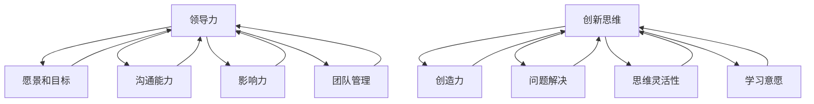

                 

## **引言**

### **背景介绍**

在当今全球化的时代，企业面临着前所未有的竞争和挑战。在这个充满变革和不确定性的环境中，领导力和创新思维成为组织成功的关键因素。传统的管理模式和思维方式已经无法满足新时代的需求，领导者需要具备更高的创造力、决策能力和团队管理能力，以引领组织走向成功。

### **核心概念与联系**

**领导力** 是指领导者通过影响和激励他人来实现共同目标的能力。它不仅仅包括权威和决策，更涉及沟通、信任和协作。创新思维则是领导者在面对问题时，能够跳出传统思维框架，提出独特解决方案的能力。创新思维与领导力密切相关，创新思维的培养有助于提升领导者的竞争力。

### **文章关键词**

- 领导力
- 创新思维
- 创造力
- 问题解决
- 团队协作

### **文章摘要**

本文旨在探讨领导力和创新思维的重要性，以及如何通过训练和培养来提升这两种能力。文章将介绍一系列实用的方法和技巧，帮助领导者激发团队的创造力，实现组织的目标。

## **领导力和创新思维的基本概念**

### **领导力**

领导力是指领导者通过影响和激励他人来实现共同目标的能力。它不仅仅包括权威和决策，更涉及沟通、信任和协作。领导力可以分为以下几个核心要素：

1. **愿景和目标**：领导者需要拥有清晰、远大的愿景，并设定明确的目标，以引导团队成员朝着共同的方向努力。
2. **沟通能力**：有效的沟通是领导力的关键。领导者需要能够清晰地传达自己的想法，理解团队成员的需求和意见。
3. **影响力**：领导者需要具备一定的影响力，能够激励和影响团队成员，使他们愿意为实现共同目标而努力。
4. **团队管理**：领导者需要具备团队管理能力，能够建立和维护一个高效、协作的团队。

### **创新思维**

创新思维是指在面对问题时，能够跳出传统思维框架，提出独特解决方案的能力。创新思维可以分为以下几个核心要素：

1. **创造力**：创造力是创新思维的核心。它是指能够产生新颖、独特想法的能力。
2. **问题解决**：创新思维强调从不同角度看待问题，寻找创新的解决方案。
3. **思维灵活性**：思维灵活性是指能够灵活地调整自己的思维方式，以适应不同的情境和挑战。
4. **学习意愿**：持续学习和更新知识是创新思维的重要基础。

### **核心概念原理之间的关系架构**

下面是一个Mermaid流程图，展示了领导力和创新思维的核心概念及其相互关系：



## **领导力的技能培养**

### **沟通和影响力**

沟通和影响力是领导者必备的技能。有效的沟通能够确保信息准确传达，促进团队协作。影响力则能够激励团队成员，使他们愿意为实现共同目标而努力。

**核心算法原理讲解（伪代码）：**

```python
def effective_communication(message, receiver):
    # 清晰传达信息
    message = format_message(message)
    # 确保接收者理解
    understanding = check_understanding(message, receiver)
    if understanding:
        return "Communication successful"
    else:
        return "Communication failed"

def influence teammates(goal, team):
    # 明确目标
    goal = clarify_goal(goal)
    # 激励团队成员
    for member in team:
        motivation = motivate_member(member, goal)
        if motivation:
            return "Influence successful"
        else:
            return "Influence failed"
```

### **决策和战略思考**

决策和战略思考是领导者的重要职责。领导者需要能够做出明智的决策，并制定长期的战略规划。

**核心算法原理讲解（伪代码）：**

```python
def decision_making(problem, options, consequences):
    # 分析问题
    problem_analysis = analyze_problem(problem)
    # 评估选项
    option_evaluation = evaluate_options(options, problem_analysis)
    # 选择最佳选项
    selected_option = select_best_option(option_evaluation)
    # 执行决策
    decision_consequence = execute_decision(selected_option)
    return decision_consequence

def strategic_thinking(current_state, long_term_goals):
    # 分析当前状态
    state_analysis = analyze_state(current_state)
    # 制定战略规划
    strategy = create_strategy(state_analysis, long_term_goals)
    return strategy
```

### **团队建设和管理**

团队建设和管理是领导力的关键部分。一个高效的团队需要明确的角色分工、良好的沟通和协作。

**核心算法原理讲解（伪代码）：**

```python
def team_building团队成员，roles，communication_channel):
    # 分配角色
    assign_roles(团队成员，roles)
    # 建立沟通渠道
    set_up_communication_channel(communication_channel)
    # 促进团队协作
    promote_collaboration(团队成员，communication_channel)
    return "Team building successful"

def team_management(team, goals):
    # 设定团队目标
    set_team_goals(team, goals)
    # 监控进度
    monitor_progress(team, goals)
    # 提供支持
    provide_support(team, goals)
    return "Team management successful"
```

## **创新思维的技术**

### **脑暴和思维导图**

脑暴和思维导图是创新思维的重要工具。脑暴能够快速产生大量创意，而思维导图则有助于整理和扩展这些创意。

**核心算法原理讲解（伪代码）：**

```python
def brainstorming(problem):
    # 收集创意
    ideas = collect_ideas(problem)
    # 评估创意
    idea_evaluation = evaluate_ideas(ideas)
    # 选择最佳创意
    selected_idea = select_best_idea(idea_evaluation)
    return selected_idea

def mind_mapping(idea):
    # 创建思维导图
    create_mind_map(idea)
    # 扩展思维导图
    expand_mind_map(idea)
    return "Mind mapping successful"
```

### **设计思维和用户中心创新**

设计思维和用户中心创新强调以用户为中心，通过迭代设计和测试来不断改进产品。

**核心算法原理讲解（伪代码）：**

```python
def design_thinking(user_needs):
    # 分析用户需求
    user_needs_analysis = analyze_user_needs(user_needs)
    # 设计原型
    create_prototype(user_needs_analysis)
    # 测试和反馈
    test_and_feedback(prototype)
    # 迭代改进
    iterate_improvement(prototype, test_and_feedback)
    return "Design thinking successful"

def user_centered_innovation(product, user_feedback):
    # 结合用户反馈
    integrate_user_feedback(product, user_feedback)
    # 设计改进
    design_improvements(product)
    # 再次测试和反馈
    test_and_feedback_improvements(product)
    return "User-centered innovation successful"
```

## **实战项目**

### **项目介绍**

在本节中，我们将介绍一个实际的项目，以展示如何将领导力和创新思维应用于实际工作中。该项目是一个在线学习平台，旨在帮助用户通过互动式学习提高技能。

### **开发环境搭建**

在开始项目之前，我们需要搭建开发环境。以下是所需的工具和步骤：

1. **选择技术栈**：我们选择使用React.js作为前端框架，Node.js作为后端服务器，以及MongoDB作为数据库。
2. **安装依赖**：在终端中运行以下命令安装依赖项：
   ```bash
   npm install react react-dom node react-scripts mongo
   ```
3. **创建项目**：使用以下命令创建一个新的React项目：
   ```bash
   npx create-react-app learning-platform
   ```
4. **配置后端服务器**：在项目的根目录下创建一个名为`server`的新文件夹，并使用Node.js创建一个简单的后端服务器：
   ```javascript
   // server.js
   const express = require('express');
   const app = express();
   const PORT = 5000;

   app.use(express.json());

   app.get('/', (req, res) => {
       res.send('Learning Platform API');
   });

   app.listen(PORT, () => {
       console.log(`Server is running on port ${PORT}`);
   });
   ```

### **源代码详细实现和代码解读**

在本项目中，我们将实现以下功能：

1. **用户注册和登录**：
2. **课程浏览和搜索**：
3. **课程详情和章节列表**：
4. **课程进度跟踪**：

**用户注册和登录**

**源代码：** `src/UserAuth.js`

```javascript
import React, { useState } from 'react';
import axios from 'axios';

const UserAuth = () => {
  const [email, setEmail] = useState('');
  const [password, setPassword] = useState('');

  const handleRegister = async () => {
    try {
      const response = await axios.post('/api/register', { email, password });
      if (response.status === 200) {
        alert('注册成功！');
      }
    } catch (error) {
      alert('注册失败：' + error.message);
    }
  };

  const handleLogin = async () => {
    try {
      const response = await axios.post('/api/login', { email, password });
      if (response.status === 200) {
        alert('登录成功！');
      }
    } catch (error) {
      alert('登录失败：' + error.message);
    }
  };

  return (
    <div>
      <h2>用户注册/登录</h2>
      <label htmlFor="email">邮箱：</label>
      <input
        type="email"
        id="email"
        value={email}
        onChange={(e) => setEmail(e.target.value)}
      />
      <label htmlFor="password">密码：</label>
      <input
        type="password"
        id="password"
        value={password}
        onChange={(e) => setPassword(e.target.value)}
      />
      <button onClick={handleRegister}>注册</button>
      <button onClick={handleLogin}>登录</button>
    </div>
  );
};

export default UserAuth;
```

**代码解读：**

1. **状态管理**：我们使用React的useState钩子来管理email和password的状态。
2. **API调用**：使用axios库进行API调用，实现注册和登录功能。
3. **错误处理**：在调用API时，我们使用try-catch语句来处理可能发生的错误。

**课程浏览和搜索**

**源代码：** `src/CourseList.js`

```javascript
import React, { useState, useEffect } from 'react';
import axios from 'axios';

const CourseList = () => {
  const [courses, setCourses] = useState([]);
  const [searchTerm, setSearchTerm] = useState('');

  useEffect(() => {
    const fetchCourses = async () => {
      try {
        const response = await axios.get('/api/courses');
        setCourses(response.data);
      } catch (error) {
        console.error('Error fetching courses:', error);
      }
    };

    fetchCourses();
  }, []);

  const handleSearch = (e) => {
    setSearchTerm(e.target.value);
  };

  return (
    <div>
      <h2>课程浏览</h2>
      <input
        type="text"
        placeholder="搜索课程"
        value={searchTerm}
        onChange={handleSearch}
      />
      <ul>
        {courses
          .filter((course) => course.name.toLowerCase().includes(searchTerm.toLowerCase()))
          .map((course) => (
            <li key={course.id}>{course.name}</li>
          ))}
      </ul>
    </div>
  );
};

export default CourseList;
```

**代码解读：**

1. **状态管理**：我们使用useState钩子来管理courses和searchTerm的状态。
2. **使用Effect钩子**：使用useEffect钩子来获取课程列表。
3. **搜索功能**：在输入框中输入搜索词时，会更新searchTerm状态，并过滤出包含搜索词的课程。

**课程详情和章节列表**

**源代码：** `src/CourseDetails.js`

```javascript
import React, { useState, useEffect } from 'react';
import axios from 'axios';

const CourseDetails = ({ courseId }) => {
  const [course, setCourse] = useState(null);

  useEffect(() => {
    const fetchCourse = async () => {
      try {
        const response = await axios.get(`/api/courses/${courseId}`);
        setCourse(response.data);
      } catch (error) {
        console.error('Error fetching course:', error);
      }
    };

    fetchCourse();
  }, [courseId]);

  if (!course) {
    return <div>Loading...</div>;
  }

  return (
    <div>
      <h2>{course.name}</h2>
      <p>{course.description}</p>
      <h3>章节列表</h3>
      <ul>
        {course.chapters.map((chapter) => (
          <li key={chapter.id}>{chapter.title}</li>
        ))}
      </ul>
    </div>
  );
};

export default CourseDetails;
```

**代码解读：**

1. **状态管理**：我们使用useState钩子来管理course的状态。
2. **使用Effect钩子**：使用useEffect钩子来获取课程详情。
3. **渲染章节列表**：根据课程详情渲染章节列表。

**课程进度跟踪**

**源代码：** `src/CourseProgress.js`

```javascript
import React, { useState, useEffect } from 'react';
import axios from 'axios';

const CourseProgress = ({ courseId, userId }) => {
  const [progress, setProgress] = useState(0);

  useEffect(() => {
    const fetchProgress = async () => {
      try {
        const response = await axios.get(`/api/courses/${courseId}/progress/${userId}`);
        setProgress(response.data);
      } catch (error) {
        console.error('Error fetching progress:', error);
      }
    };

    fetchProgress();
  }, [courseId, userId]);

  const updateProgress = (chapterId) => {
    const newProgress = progress + 1;
    setProgress(newProgress);

    const updateRequest = async () => {
      try {
        await axios.put(`/api/courses/${courseId}/progress/${userId}`, { progress: newProgress });
      } catch (error) {
        console.error('Error updating progress:', error);
      }
    };

    updateRequest();
  };

  return (
    <div>
      <h2>课程进度</h2>
      <p>已完成 {progress} 个章节</p>
      <button onClick={() => updateProgress(courseId)}>完成下一个章节</button>
    </div>
  );
};

export default CourseProgress;
```

**代码解读：**

1. **状态管理**：我们使用useState钩子来管理progress的状态。
2. **使用Effect钩子**：使用useEffect钩子来获取课程进度。
3. **更新进度**：当用户完成一个章节时，会更新进度并保存到数据库。

### **代码应用解读与分析**

在本项目中，我们使用了React.js进行前端开发，Node.js进行后端开发，以及MongoDB作为数据库。通过这些技术的结合，我们实现了用户注册、登录、课程浏览、课程详情和课程进度跟踪等功能。

**应用解读：**

1. **前后端分离**：我们采用了前后端分离的架构，使得前端和后端的开发更加独立，便于维护和扩展。
2. **RESTful API**：我们使用RESTful API进行前后端的数据交互，使得数据传输更加高效和规范。
3. **状态管理**：使用React的useState和useEffect钩子来管理组件的状态和副作用，提高了代码的可读性和可维护性。

**分析：**

1. **用户注册和登录**：用户注册和登录是学习平台的基本功能，通过API与后端进行交互，实现了用户身份验证和数据存储。
2. **课程浏览和搜索**：课程浏览和搜索功能使得用户能够轻松找到感兴趣的课程，提高了用户体验。
3. **课程详情和章节列表**：课程详情和章节列表功能展示了课程的具体内容，用户可以更深入地了解课程。
4. **课程进度跟踪**：课程进度跟踪功能帮助用户跟踪学习进度，增强了学习的动力。

### **项目小结**

通过本项目的开发，我们展示了如何将领导力和创新思维应用于实际工作中。在这个项目中，我们使用了React.js、Node.js和MongoDB等现代技术，实现了用户注册、登录、课程浏览、课程详情和课程进度跟踪等功能。在这个过程中，我们学习了如何有效沟通、协作和解决问题，这些都是领导力和创新思维的重要体现。

## **最佳实践与注意事项**

在领导力和创新思维的实际应用中，以下是一些最佳实践和注意事项：

### **最佳实践**

1. **持续学习和更新知识**：领导者需要保持好奇心，不断学习新的知识和技能，以适应快速变化的环境。
2. **建立良好的沟通机制**：领导者应该建立一个开放、透明的沟通机制，确保团队成员之间的信息传递畅通无阻。
3. **鼓励团队协作**：通过鼓励团队协作，可以提高团队的创造力和解决问题的能力。
4. **实践迭代思维**：领导者应该鼓励团队成员在实践中不断迭代和改进，以实现持续的创新。
5. **关注用户需求**：在创新过程中，始终关注用户需求，以确保创新成果能够真正满足用户的需求。

### **注意事项**

1. **避免过度集中决策权**：领导者不应该将所有决策权集中在自己手中，应该鼓励团队成员参与决策过程。
2. **平衡创新与稳定性**：在追求创新的同时，领导者需要保持一定的稳定性，确保组织的正常运营。
3. **避免过度依赖技术**：虽然技术是创新的重要工具，但领导者不应该过度依赖技术，而忽视了人文因素。
4. **关注团队心理健康**：在高压环境中，领导者需要关注团队成员的心理健康，提供必要的支持和帮助。
5. **持续反思和改进**：领导者应该定期反思和总结工作经验，不断改进自己的领导方式和团队管理方法。

### **拓展阅读**

- 《创新者的窘境》（作者：克里斯坦森）
- 《第五项修炼》（作者：彼得·圣吉）
- 《深度工作》（作者：卡尔·纽波特）
- 《敏捷开发实践指南》（作者：杰夫里·菲弗）

通过阅读这些书籍，您可以深入了解领导力和创新思维的更多实践方法和理念。

