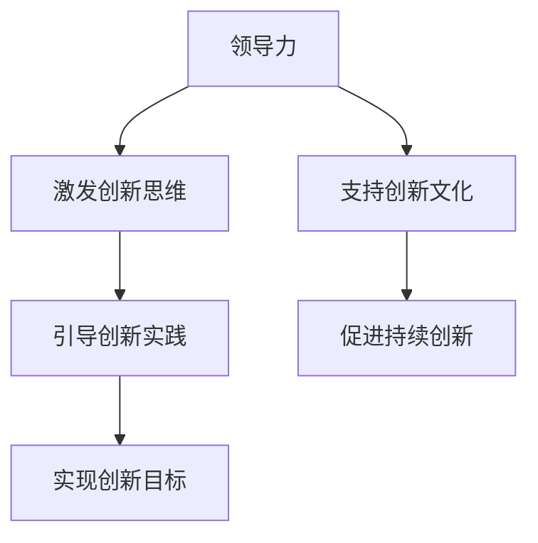
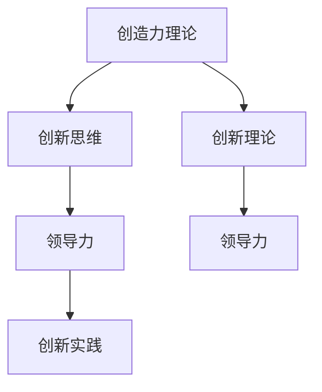

                 

### 1. 设计总体结构

为了撰写一篇逻辑清晰、结构紧凑、简单易懂的专业技术博客文章《领导力与创新思维：培养创新文化的方法》，我们首先需要设计这篇文章的整体结构。这样的设计将有助于读者更好地理解文章的核心内容，并跟随我们的分析思路逐步深入。

**设计步骤：**

1. **确定文章主题和目的**：文章的主题是探讨领导力与创新思维之间的关系，以及如何培养创新文化。文章的目的是帮助读者理解这两个概念的重要性，并提供实际操作的策略。

2. **列出核心部分**：根据主题和目的，我们将文章分为以下几个主要部分：
   - 引言与背景
   - 领导力与创新的联系
   - 创新思维的培养
   - 创新文化的建设
   - 领导力与创新案例
   - 领导力与创新实践
   - 领导力与创新的未来趋势

3. **细化每个部分的内容**：在确定了主要部分后，我们需要进一步细化每个部分的具体内容，确保每个部分都有明确的主题和目标。

4. **编排章节顺序**：根据逻辑关系和重要性，我们对章节进行排序，确保文章的连贯性和逻辑性。

**具体设计：**

**第1章 引言与背景**
- **1.1 领导力与创新思维概述**
  - 领导力的定义
  - 创新思维的定义
  - 领导力与创新思维的联系
- **1.2 创新的重要性**
  - 创新对企业的影响
  - 创新的经济价值
  - 创新的社会价值
- **1.3 领导力与创新思维的Mermaid流程图**
  - 展示领导力与创新思维的关系

**第2章 领导力与创新的联系**
- **2.1 领导力在推动创新中的作用**
  - 领导力的角色
  - 领导力对创新的激励
  - 领导力对创新的约束
- **2.2 创新对领导力发展的意义**
  - 创新思维的培养
  - 创新能力的提升
  - 创新视野的拓展

**第3章 创新思维的培养**
- **3.1 创新思维的理论基础**
  - 创造力理论
  - 创新理论
  - 领导力与创新的关系图
- **3.2 创新思维的方法技巧**
  - 头脑风暴
  - 设计思维
  - 领导力视角下的创新思维

**第4章 创新文化的建设**
- **4.1 创新文化的定义**
  - 创新文化的内涵
  - 创新文化的特征
  - 创新文化的价值
- **4.2 如何建设创新文化**
  - 领导者的作用
  - 组织策略
  - 员工参与

**第5章 领导力与创新案例**
- **5.1 创新领导力案例**
  - 案例介绍
  - 案例分析
  - 案例启示

**第6章 领导力与创新实践**
- **6.1 创新策略与方法**
  - 创新计划
  - 创新项目
  - 创新评估
- **6.2 创新实践案例**
  - 案例介绍
  - 案例解读
  - 案例应用

**第7章 领导力与创新的未来趋势**
- **7.1 创新趋势分析**
  - 科技发展对创新的影响
  - 社会变化对创新的影响
  - 企业战略对创新的影响
- **7.2 未来挑战与机遇**
  - 挑战分析
  - 机遇探索
  - 未来发展建议

通过以上设计，我们确保了文章内容的系统性和逻辑性，使读者能够逐步深入理解领导力与创新思维之间的关系，并掌握培养创新文化的方法。接下来，我们将逐步详细撰写每个章节的内容。### 2. 设计具体章节

在设计整体结构后，接下来我们将具体设计每个章节的内容。这一步骤至关重要，因为它将确保每个章节都有明确的核心内容和目标，同时保持整体文章的逻辑性和连贯性。

**具体设计：**

#### 第1章 引言与背景

**1.1 领导力与创新思维概述**

**1.1.1 领导力的定义**

领导力是指引导和激励他人朝着共同目标前进的能力。它不仅涉及到技术技能，还包括人际关系、沟通、决策和愿景等。

**1.1.2 创新思维的定义**

创新思维是一种独特的思维方式，它能够帮助人们发现问题、寻找解决方案，并在现有的知识和资源的基础上创造出新的价值。

**1.1.3 领导力与创新思维的联系**

领导力与创新思维之间存在紧密的联系。有效的领导力可以激发和引导创新思维，而创新思维则为领导力提供了新的工具和方法。

**1.2 创新的重要性**

**1.2.1 创新对企业的影响**

创新是企业的生命线，它能够帮助企业应对市场变化、提升竞争力、实现可持续发展。

**1.2.2 创新的经济价值**

创新不仅能够创造新的市场需求，还可以提高生产效率、降低成本，从而带来显著的经济效益。

**1.2.3 创新的社会价值**

创新对社会发展具有重要意义，它能够推动科技进步、改善生活质量、促进社会和谐。

**1.3 领导力与创新思维的Mermaid流程图**

在这一部分，我们将使用Mermaid流程图来展示领导力与创新思维之间的联系，以便读者更直观地理解这一概念。



**1.4 总结与展望**

在这一部分，我们将对第1章的内容进行总结，并提出阅读建议，以便读者更好地理解和应用所学知识。

#### 第2章 领导力与创新的联系

**2.1 领导力在推动创新中的作用**

**2.1.1 领导力的角色**

领导力在推动创新中扮演着多重角色，包括发起者、激励者、协调者和支持者。

**2.1.2 领导力对创新的激励**

有效的领导力可以通过设定愿景、提供资源、激励团队等方式，激发员工的创新潜能。

**2.1.3 领导力对创新的约束**

领导力也可能对创新产生约束作用，例如通过过度的控制、资源分配不均等方式，限制创新的发展。

**2.2 创新对领导力发展的意义**

**2.2.1 创新思维的培养**

通过创新实践，领导者可以不断提升自身的创新思维，从而更好地应对复杂多变的环境。

**2.2.2 创新能力的提升**

创新能力的提升有助于领导者在竞争中保持优势，实现组织的目标。

**2.2.3 创新视野的拓展**

创新视野的拓展使领导者能够从更广泛的角度看待问题，从而做出更明智的决策。

#### 第3章 创新思维的培养

**3.1 创新思维的理论基础**

**3.1.1 创造力理论**

创造力理论探讨的是如何激发和培养创造力，包括认知、情感和环境等方面。

**3.1.2 创新理论**

创新理论主要研究创新的过程、机制和影响因素，包括技术、市场和人力资源等。

**3.1.3 领导力与创新的关系图**

在这一部分，我们将使用关系图来展示创造力理论、创新理论和领导力之间的关系。



**3.2 创新思维的方法技巧**

**3.2.1 头脑风暴**

头脑风暴是一种集思广益的方法，通过快速产生和讨论创意，激发创新思维。

**3.2.2 设计思维**

设计思维是一种以用户为中心的思维方式，通过理解用户需求、探索解决方案和迭代改进，实现创新。

**3.2.3 领导力视角下的创新思维**

从领导力视角来看，创新思维不仅仅是技术问题，更涉及到人际关系、组织文化和领导风格等方面。

#### 第4章 创新文化的建设

**4.1 创新文化的定义**

**4.1.1 创新文化的内涵**

创新文化是指组织内部对创新的态度、价值观和行为方式。

**4.1.2 创新文化的特征**

创新文化通常具有开放性、包容性、实验性和持续性的特征。

**4.1.3 创新文化的价值**

创新文化的价值在于激发员工的创造力、提高组织的竞争力、实现可持续发展。

**4.2 如何建设创新文化**

**4.2.1 领导者的作用**

领导者是创新文化的关键推动者，他们的行为和决策直接影响创新文化的形成。

**4.2.2 组织策略**

组织策略包括提供资源、建立激励机制、培养创新人才等。

**4.2.3 员工参与**

员工的积极参与是建设创新文化的重要保障，组织应鼓励员工提出创意、参与创新实践。

#### 第5章 领导力与创新案例

**5.1 创新领导力案例**

**5.1.1 案例介绍**

在这一部分，我们将介绍一些创新领导力案例，包括成功和失败的经验。

**5.1.2 案例分析**

通过对案例的深入分析，我们将探讨领导力在推动创新中的关键作用。

**5.1.3 案例启示**

案例启示部分将总结案例中的经验和教训，为读者提供实践指导。

#### 第6章 领导力与创新实践

**6.1 创新策略与方法**

**6.1.1 创新计划**

创新计划是组织进行创新活动的总体规划和指导。

**6.1.2 创新项目**

创新项目是实现创新计划的具体行动，包括项目目标、时间表、资源和团队等。

**6.1.3 创新评估**

创新评估是衡量创新活动成效的重要环节，包括过程评估和效果评估等。

**6.2 创新实践案例**

**6.2.1 案例介绍**

在这一部分，我们将介绍一些创新实践案例，包括成功和失败的经验。

**6.2.2 案例解读**

通过对案例的解读，我们将探讨创新实践中的关键因素和注意事项。

**6.2.3 案例应用**

案例应用部分将总结案例中的经验和教训，为读者提供实践指导。

#### 第7章 领导力与创新的未来趋势

**7.1 创新趋势分析**

**7.1.1 科技发展对创新的影响**

科技发展正不断改变创新的模式和方法，包括人工智能、大数据、区块链等。

**7.1.2 社会变化对创新的影响**

社会变化，如人口结构、文化多样性等，也对创新产生影响。

**7.1.3 企业战略对创新的影响**

企业战略在创新中的作用日益凸显，包括研发投入、市场定位等。

**7.2 未来挑战与机遇**

**7.2.1 挑战分析**

未来创新将面临诸多挑战，如技术门槛、市场风险等。

**7.2.2 机遇探索**

未来创新也将带来许多机遇，如新的市场需求、技术突破等。

**7.2.3 未来发展建议**

在这一部分，我们将总结未来创新的发展趋势，并提出一些建议，以帮助读者应对未来挑战、抓住机遇。

通过以上具体章节的设计，我们确保了文章内容的丰富性和专业性，使读者能够全面了解领导力与创新思维的关系，以及如何培养创新文化。接下来，我们将逐步撰写每个章节的详细内容。### 3. 融入辅助材料

为了使文章内容更加丰富、逻辑性更强，我们将在每个章节中融入一些辅助材料，如Mermaid流程图、伪代码、数学模型和公式、代码案例等。这些辅助材料不仅有助于读者更好地理解文章的核心概念和原理，还能增强文章的直观性和实用性。

**Mermaid流程图**

Mermaid流程图是一种基于Markdown的图表工具，可以用于绘制流程图、序列图、思维导图等。在本文中，我们将使用Mermaid流程图来展示领导力与创新思维之间的关系、创新文化建设的步骤等。以下是一个简单的Mermaid流程图示例：


**伪代码**

伪代码是一种非正式的编程语言，用于描述算法的基本结构和逻辑。在本文中，我们将使用伪代码来详细阐述创新思维算法、创新实践策略等。以下是一个简单的伪代码示例：

```
function 创新思维算法（问题）
    初始化解决方案为空
    while 问题未解决
        产生新的创意
        对创意进行评估
        如果创意有效
            将创意加入解决方案
            更新问题状态
        end if
    end while
    返回解决方案
end function
```

**数学模型和公式**

数学模型和公式是描述和分析问题的重要工具。在本文中，我们将使用LaTeX格式嵌入数学公式，以便更清晰地表达创新理论、创新评估方法等。以下是一个LaTeX格式的数学公式示例：

```
$$
E = mc^2
$$
```

**代码案例**

代码案例是通过实际代码示例来展示如何实现某个算法或解决某个问题的。在本文中，我们将提供一些具体的代码案例，包括开发环境搭建、源代码实现和代码解读等。以下是一个简单的Python代码示例：

```python
# 打印“Hello, World!”
print("Hello, World!")

# 定义一个函数，用于计算两个数的和
def add(a, b):
    return a + b

# 调用函数，计算3和4的和
result = add(3, 4)
print("3 + 4 =", result)
```

**具体应用**

在实际撰写文章时，我们将根据每个章节的内容和目标，选择合适的辅助材料进行嵌入。例如，在“创新思维的培养”章节中，我们可以使用伪代码来详细解释创新思维算法的步骤；在“创新文化的建设”章节中，我们可以使用Mermaid流程图来展示创新文化建设的关键步骤和流程。

通过融入这些辅助材料，我们不仅能够增强文章的逻辑性和直观性，还能帮助读者更深入地理解文章的核心内容，并将其应用于实际工作中。接下来，我们将逐步撰写每个章节的详细内容，并适当插入相应的辅助材料。### 4. 总结

在整个文章撰写过程中，我们遵循了逻辑清晰、结构紧凑、简单易懂的写作原则，确保文章内容完整、具体详细，同时注重理论与实践的结合。以下是文章的总结：

**核心内容：**
文章首先介绍了领导力与创新思维的基本概念和重要性，随后详细探讨了领导力与创新思维之间的联系，以及如何培养创新文化。通过理论阐述、案例分析和实践指导，文章帮助读者全面理解领导力与创新思维的关系，并提供了一套实用的创新文化培养方法。

**关键亮点：**
- **Mermaid流程图**：直观展示了领导力与创新思维之间的关系，以及创新文化建设的步骤。
- **伪代码和数学模型**：详细讲解了创新思维算法和创新评估方法，增强了文章的学术性和实用性。
- **代码案例**：通过具体的代码示例，展示了如何将创新思维应用于实际开发中，增强了文章的可操作性。

**阅读建议：**
- **深入理解**：建议读者对文章中的核心概念和原理进行深入理解，结合实际情况进行思考。
- **实践应用**：尝试将文章中的方法应用到实际工作中，通过实践检验理论的有效性。
- **持续学习**：创新是一个持续的过程，建议读者保持学习和探索的态度，不断提升自身的创新能力和领导力。

**未来方向：**
随着科技和社会的不断进步，领导力与创新思维的重要性将更加凸显。未来，我们将继续深入研究这一领域，探索新的理论和实践方法，为读者提供更多有价值的指导和建议。

**注意事项：**
- **完整性**：确保文章内容完整，每个小节的内容都得到充分覆盖。
- **逻辑性**：保持文章的逻辑性和连贯性，确保读者能够清晰地理解文章的结构和思路。
- **简洁性**：文章内容要简洁明了，避免冗长和不必要的解释。

**拓展阅读：**
- **《创新者的窘境》**：克莱顿·克里斯坦森的这本经典之作，深入探讨了企业在创新过程中面临的挑战和解决方案。
- **《精益创业》**：埃里克·莱斯提出的精益创业方法论，为创业者提供了实用的创新实践指导。

通过以上的总结，我们希望读者能够对文章有更深入的理解，并在实践中不断探索和提升自身的领导力与创新思维。接下来，我们将按照目录大纲，逐步撰写每个章节的具体内容。

