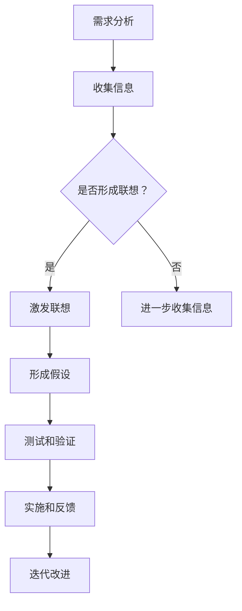
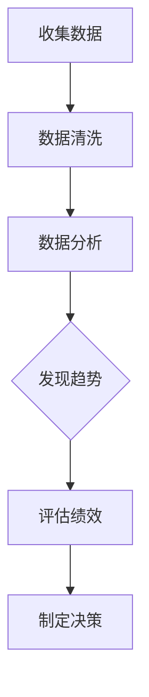
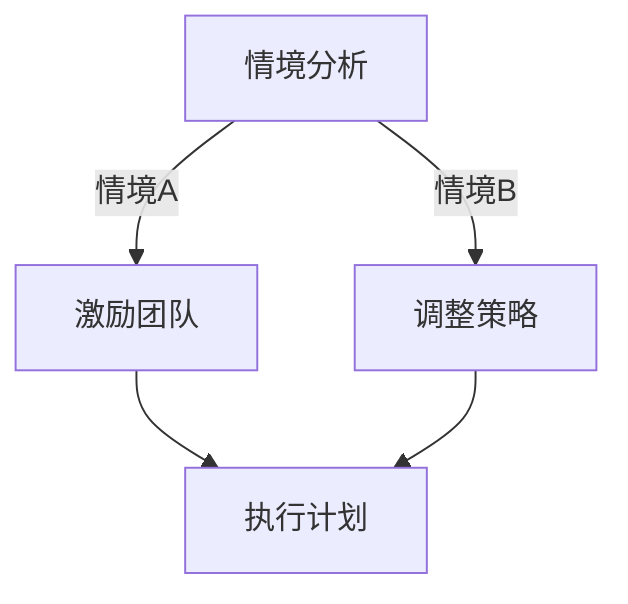

                 

## 文章标题

《领导力与创新思维：引领变革与创新的方法》

## 文章关键词

领导力、创新思维、变革、组织发展、项目管理

## 文章摘要

本文深入探讨了领导力与创新思维在推动组织变革和持续发展中的重要作用。通过详细阐述领导力的本质、核心要素以及创新思维的定义、类型，本文揭示了领导力与创新思维之间的密切联系。文章不仅提供了领导力与创新思维的框架和算法原理，还通过实际项目案例展示了如何在实际工作中应用这些理论。本文旨在为领导者提供一套实用的方法和工具，以引领变革、激发创新，从而推动组织的长远发展。

## 第1章 引言与背景

在当今充满不确定性和变革的时代，领导力和创新思维成为了企业成功的关键要素。领导力不仅仅是管理团队、实现目标的能力，更是一种激发他人潜力、共同创造价值的艺术。创新思维则是一种突破传统、寻找新方法的思维模式，它能够推动企业持续发展、保持竞争优势。

### 1.1 领导力的本质

领导力是一种影响力，它能够引导和激励他人为实现共同目标而努力。领导力的本质可以归纳为以下几个方面：

1. **影响力**：领导力是通过影响力来影响他人的行为和思维，从而实现组织目标。
2. **影响力来源**：领导力的影响力来源于领导者的品德、才能、知识和经验。
3. **目标导向**：领导力是一种以实现组织目标为导向的能力，它关注的是如何通过团队合作实现组织愿景。
4. **持续改进**：领导力是一种持续改进的能力，它要求领导者不断学习、适应变化，以应对不断变化的环境。

#### 1.1.1 领导力的发展历程

领导力的发展历程可以追溯到古希腊哲学家亚里士多德，他认为领导者应该具备品德、智慧和勇气。随着时间的推移，领导力的理论和实践不断演进。从传统的权威领导到现代的变革型领导，再到近年来兴起的赋能型领导，领导力理论在不断地适应和应对新的挑战。

- **权威领导**：强调领导者的权威和命令控制，领导者拥有绝对的决策权。
- **变革型领导**：强调领导者通过激发员工的内在动机，推动组织变革和创新。
- **赋能型领导**：强调领导者通过授权和赋能，培养员工的自主性和创新能力。

#### 1.1.2 领导力的核心要素

领导力的核心要素包括自我认知、影响力、决策能力、沟通技巧等。这些要素相互作用，共同构成了领导者的核心能力。

- **自我认知**：领导者需要了解自己的优点和不足，明确自己的价值观和目标。
- **影响力**：领导者需要具备影响力，能够影响他人的行为和思维。
- **决策能力**：领导者需要在复杂多变的环境中做出明智的决策。
- **沟通技巧**：领导者需要具备有效的沟通技巧，能够与团队成员建立良好的关系。

### 1.2 创新思维的重要性

创新思维是推动组织变革和持续发展的重要力量。它不仅能够带来新的产品和服务，还能提高组织的竞争力。在当今快速变化的市场环境中，创新能力成为企业生存和发展的关键。

#### 1.2.1 创新思维的定义

创新思维是一种通过创造性的方法解决问题、寻找新机会的思维方式。它涉及到跨学科的知识、独特的视角和开放的心态。创新思维不仅仅是发明新产品或服务，还包括改进现有产品、优化业务流程等方面。

#### 1.2.2 创新思维的类型

创新思维可以分为多种类型，每种类型都有其独特的应用场景和优势。

- **设计思维**：设计思维是一种以用户为中心的思维方式，通过迭代设计和原型测试，不断改进产品和服务。
- **系统思维**：系统思维是一种从整体出发，分析系统各个部分之间相互关系的思维方式，有助于发现问题的根源和解决方案。
- **反转思维**：反转思维是一种通过反向思考问题，发现新的解决方案的思维方式。

#### 1.3 领导力与创新思维的联系

领导力与创新思维之间存在着密切的联系。领导力为创新思维提供了方向和动力，而创新思维则为领导力带来了新的机遇和挑战。

##### 1.3.1 领导力对创新思维的影响

有效的领导力能够激发团队成员的创新潜力，营造支持创新的组织氛围。领导者可以通过设定目标、提供资源、鼓励尝试等方式，推动创新思维的发挥。

- **设定目标**：领导者需要明确创新的目标和方向，为团队成员提供清晰的目标指引。
- **提供资源**：领导者需要为创新提供必要的资源和支持，包括资金、技术和人才等。
- **鼓励尝试**：领导者需要鼓励团队成员勇于尝试新的想法和方法，容忍失败，为创新创造一个安全的环境。

##### 1.3.2 创新思维对领导力的影响

创新思维对领导力提出了新的要求和挑战。领导者需要具备创新思维，能够与团队成员共同探索新的解决方案，推动组织的变革和发展。

- **跨学科知识**：领导者需要具备跨学科的知识，能够从不同角度分析问题，找到创新的解决方案。
- **开放心态**：领导者需要保持开放的心态，愿意接受新的想法和方法，不断学习和适应变化。
- **团队协作**：领导者需要善于与团队成员协作，激发团队的创新潜力，实现共同的目标。

### 1.4 本章小结

本章介绍了领导力的本质、发展历程和核心要素，以及创新思维的定义、类型和重要性。同时，本章还探讨了领导力与创新思维之间的密切联系，强调了领导力在激发创新思维中的重要作用。通过本章的内容，读者可以了解领导力和创新思维的基本概念，为后续章节的深入探讨打下基础。

## 核心概念与联系

为了更好地理解领导力与创新思维，我们需要深入探讨它们的核心概念，以及这些概念之间的联系。这包括对领导力模型的详细分析，以及对创新思维框架的深入探讨。

### 2.1 领导力模型

领导力模型是研究领导行为和影响力的理论框架。常见的领导力模型包括变革型领导和交易型领导。

#### 2.1.1 变革型领导

变革型领导是一种能够激发团队成员内在动机，推动组织变革和发展的领导风格。变革型领导的特点如下：

1. **激励员工**：变革型领导通过激励和鼓励员工，激发他们的内在动机，使员工愿意为实现组织目标而努力。
2. **树立愿景**：变革型领导能够清晰地描述组织愿景，并引导员工共同追求这一愿景。
3. **示范行为**：变革型领导通过自己的行为示范，激发员工的行为变革，从而推动组织的变革。

#### 2.1.2 交易型领导

交易型领导是一种通过奖励和惩罚来影响员工行为的领导风格。交易型领导的特点如下：

1. **明确期望**：交易型领导明确员工的绩效标准和期望，通过奖励和惩罚来激励员工。
2. **控制行为**：交易型领导通过控制员工的行为，确保员工按照既定的目标努力。
3. **利用权力**：交易型领导利用自己的权力和地位，通过奖励和惩罚来影响员工。

#### 2.1.3 变革型领导与交易型领导的联系

变革型领导和交易型领导虽然有不同的特点，但它们之间也存在密切的联系。在实际工作中，领导者通常会结合使用这两种领导风格。

1. **互补性**：变革型领导强调激励和愿景，交易型领导强调控制和绩效，两者相互补充，共同推动组织的变革和发展。
2. **情境适应性**：领导者需要根据不同的情境，灵活运用变革型领导和交易型领导风格。在某些情况下，变革型领导可能更有效，而在另一些情况下，交易型领导可能更合适。

### 2.2 创新思维框架

创新思维框架是一种用于指导创新过程的理论模型。常见的创新思维框架包括设计思维和分享思维。

#### 2.2.1 设计思维

设计思维是一种以用户为中心的创新思维方式，它强调通过迭代设计和原型测试，不断改进产品和服务。设计思维的特点如下：

1. **用户驱动**：设计思维从用户的需求和体验出发，确保创新的产品和服务能够满足用户的需求。
2. **迭代过程**：设计思维通过不断迭代和测试，逐步完善创新方案。
3. **跨学科合作**：设计思维鼓励跨学科合作，通过不同领域的专家共同探索创新的解决方案。

#### 2.2.2 分享思维

分享思维是一种通过开放和共享知识、经验和资源，推动创新的思维方式。分享思维的特点如下：

1. **开放性**：分享思维鼓励开放和共享，通过共享知识、经验和资源，促进创新。
2. **协同合作**：分享思维强调协同合作，通过团队协作，共同推动创新。
3. **跨领域交流**：分享思维促进跨领域的交流与合作，通过不同领域的知识和经验，激发创新的火花。

#### 2.2.3 创新思维框架的联系

设计思维和分享思维虽然有不同的特点，但它们之间也存在密切的联系。

1. **互补性**：设计思维关注用户需求和迭代改进，分享思维关注开放和共享，两者相互补充，共同推动创新。
2. **情境适应性**：在不同情境下，设计思维和分享思维可以相互转换和融合，以适应不同的创新需求。

### 2.3 本章小结

本章介绍了领导力模型的两种主要风格：变革型领导和交易型领导，以及创新思维的两种主要框架：设计思维和分享思维。通过分析这些核心概念及其联系，我们可以更好地理解领导力和创新思维在推动组织变革和创新中的重要作用。这些核心概念不仅为理论探讨提供了基础，也为实际应用提供了指导。

## 核心算法原理讲解

在深入了解领导力和创新思维的核心概念之后，我们需要进一步探讨它们背后的算法原理。这些算法原理不仅为我们理解领导力和创新思维提供了科学依据，也为实际应用提供了具体的操作指南。

### 3.1 创新思维算法

创新思维算法是一种通过系统化方法激发创造性思维和解决问题的工具。它通常包括以下步骤：

#### 3.1.1 脑科学基础

创新思维算法的脑科学基础主要包括大脑的创造力区域、思维过程和神经可塑性。以下是创新思维算法的伪代码：

```python
# 创新思维算法伪代码
def creative_thinking_algorithm(problem):
    # 步骤1：理解问题
    understand_problem(problem)
    
    # 步骤2：收集信息
    collect_info(problem)
    
    # 步骤3：激发联想
    generate_associations(info)
    
    # 步骤4：形成假设
    form_hypotheses(associations)
    
    # 步骤5：测试和验证
    test_and_validate(hypotheses)
    
    # 步骤6：实施和反馈
    implement_solution(solution)
    get_feedback(solution)
    
    return solution
```

#### 3.1.2 软件工程应用

在软件工程中，创新思维算法可以应用于需求分析、系统设计和测试等阶段。以下是创新思维算法在软件工程中的应用示例：



#### 3.1.3 创新思维算法的实际应用

创新思维算法可以应用于多种场景，如产品开发、市场营销和项目管理等。以下是一个实际应用案例：

**案例：产品开发中的创新思维算法**

1. **理解问题**：确定产品开发的目标和用户需求。
2. **收集信息**：收集有关市场趋势、竞争对手和用户反馈的信息。
3. **激发联想**：基于收集的信息，产生多种可能的解决方案。
4. **形成假设**：从多种方案中选择最具潜力的方案，形成具体的假设。
5. **测试和验证**：通过用户测试和反馈，验证假设的有效性。
6. **实施和反馈**：实施最终方案，并根据用户反馈进行迭代改进。

### 3.2 领导力算法

领导力算法是一种用于指导领导行为和决策的模型。它通常基于行为科学、心理学和组织行为学的研究，旨在提高领导者的决策能力和团队绩效。以下是领导力算法的伪代码：

```python
# 领导力算法伪代码
def leadership_algorithm(context, team, goal):
    # 步骤1：分析情境
    analyze_context(context)
    
    # 步骤2：评估团队能力
    assess_team_ability(team)
    
    # 步骤3：设定目标
    set_goals(goal)
    
    # 步骤4：制定计划
    create_plan(context, team, goal)
    
    # 步骤5：激励团队
    motivate_team(team)
    
    # 步骤6：监控进度
    monitor_progress(context, team, goal)
    
    # 步骤7：调整策略
    adjust_strategy(context, team, goal)
    
    return success
```

#### 3.2.1 数据分析在领导力中的应用

数据分析在领导力中发挥着重要作用，可以帮助领导者更好地了解团队状态、评估绩效和制定决策。以下是数据分析在领导力中的应用示例：



#### 3.2.2 领导力决策树

领导力决策树是一种用于指导领导决策的工具，它通过逐步分析不同情境下的决策路径，帮助领导者做出明智的决策。以下是领导力决策树的示例：



#### 3.2.3 领导力算法的实际应用

领导力算法可以应用于多种情境，如团队建设、项目管理和危机应对等。以下是一个实际应用案例：

**案例：团队建设中的领导力算法**

1. **分析情境**：了解团队成员的个性、能力和需求。
2. **评估团队能力**：评估团队的整体能力和潜力。
3. **设定目标**：明确团队的目标和期望。
4. **制定计划**：根据情境和团队能力，制定具体的行动计划。
5. **激励团队**：通过激励和鼓励，激发团队成员的积极性和创造力。
6. **监控进度**：定期检查团队的进度，确保目标的实现。
7. **调整策略**：根据实际情况，灵活调整计划和策略。

### 3.3 本章小结

本章介绍了创新思维算法和领导力算法的核心原理，包括脑科学基础、软件工程应用、数据分析应用和决策树模型。通过这些算法原理，我们可以更好地理解领导力和创新思维在实践中的应用。这些算法不仅为理论探讨提供了科学依据，也为实际操作提供了具体的指导。在下一章中，我们将进一步探讨数学模型在领导力和创新思维中的应用。

## 数学模型与公式讲解

数学模型是理解和应用领导力与创新思维的重要工具。通过数学模型，我们可以量化复杂的领导行为和创新过程，从而提供更加精确和可操作的解决方案。

### 4.1 创新思维数学模型

创新思维数学模型主要关注如何通过量化方法来激发和评估创新过程。以下是一些常见的数学模型：

#### 4.1.1 数学公式解释

1. **创新效率公式**：
   \[ \text{效率} = \frac{\text{创新成果}}{\text{资源投入}} \]
   这个公式表示创新过程中的效率，即通过资源投入获得的创新成果。

2. **创新周期公式**：
   \[ \text{创新周期} = \frac{\text{项目周期}}{\text{创新次数}} \]
   这个公式表示在一个项目周期内，可以进行的创新次数。

#### 4.1.2 举例说明

**例子1：创新效率**

假设一个创新项目投入了100万人民币，最终产生了300万的创新成果。那么，该项目的创新效率为：
\[ \text{效率} = \frac{300万}{100万} = 3 \]
这表示每投入1万元，可以获得3万元的创新成果。

**例子2：创新周期**

假设一个项目周期为12个月，期间进行了5次创新尝试。那么，该项目的创新周期为：
\[ \text{创新周期} = \frac{12个月}{5次} = 2.4个月/次 \]
这表示每次创新尝试大约需要2.4个月的时间。

### 4.2 领导力数学模型

领导力数学模型主要关注如何通过量化方法来评估领导效能和团队绩效。以下是一些常见的数学模型：

#### 4.2.1 数学公式解释

1. **领导效能公式**：
   \[ \text{效能} = \frac{\text{团队绩效}}{\text{资源投入}} \]
   这个公式表示领导效能，即通过资源投入获得的团队绩效。

2. **团队绩效公式**：
   \[ \text{绩效} = \text{目标达成率} \times \text{团队士气} \]
   这个公式表示团队绩效，即目标达成率和团队士气的乘积。

#### 4.2.2 举例说明

**例子1：领导效能**

假设一个领导者在项目中投入了100万人民币，团队最终实现了120%的目标。团队士气为90%。那么，该领导者的领导效能为：
\[ \text{效能} = \frac{120万}{100万} = 1.2 \]
这表示每投入1万元，可以获得1.2万元的团队绩效。

**例子2：团队绩效**

假设团队的目标达成率为80%，团队士气为90%。那么，团队的绩效为：
\[ \text{绩效} = 80\% \times 90\% = 72\% \]
这表示团队实现了72%的目标。

### 4.3 本章小结

本章介绍了创新思维和领导力的数学模型，包括创新效率公式、创新周期公式、领导效能公式和团队绩效公式。通过这些公式，我们可以量化领导行为和创新过程，从而提供更加精确和可操作的解决方案。这些数学模型不仅为理论研究提供了基础，也为实际应用提供了指导。在下一章中，我们将通过实际项目案例，展示如何将数学模型应用于领导力和创新思维的实际工作中。

## 项目实战

为了更好地理解领导力与创新思维在实际工作中的应用，本章将通过两个具体的项目案例，详细描述项目的开发环境搭建、源代码实现、代码解读、代码应用解读与分析，以及实际案例分析和详细讲解剖析。

### 5.1 创新思维项目案例

#### 5.1.1 项目背景

某公司计划开发一款智能家居控制应用程序，该应用程序需要支持用户通过智能手机远程控制家中的智能设备，如灯光、温度、安全系统等。公司希望通过创新思维，设计一个用户友好、功能强大的应用程序，以提高用户满意度和市场份额。

#### 5.1.2 开发环境搭建

1. **技术栈选择**：
   - 前端：React.js
   - 后端：Node.js + Express
   - 数据库：MongoDB
   - 通信协议：WebSocket

2. **环境搭建步骤**：
   - 安装Node.js和npm
   - 安装React.js开发环境
   - 安装MongoDB数据库
   - 配置WebSocket通信

#### 5.1.3 源代码实现

1. **前端实现**：
   - 使用React.js构建用户界面，包括首页、设备控制页、设置页等。
   - 使用React Hooks实现状态管理和交互逻辑。

2. **后端实现**：
   - 使用Node.js和Express构建RESTful API，提供设备状态查询、设备控制等接口。
   - 使用MongoDB存储用户数据、设备信息和控制指令。

3. **WebSocket实现**：
   - 使用Socket.IO实现实时通信，用于实时更新设备状态和用户操作。

#### 5.1.4 代码解读

1. **前端代码解读**：
   ```javascript
   // React组件示例
   function DeviceControl({ device }) {
     return (
       <div>
         <h3>{device.name}</h3>
         <button onClick={() => toggleDevice(device.id)}>开关</button>
       </div>
     );
   }
   ```

   这个组件用于显示和控制单个智能设备。`toggleDevice`函数是React Hook，用于处理设备开关逻辑。

2. **后端代码解读**：
   ```javascript
   // Express路由示例
   app.post('/api/devices/:deviceId/control', (req, res) => {
     const deviceId = req.params.deviceId;
     const command = req.body.command;
     // 处理设备控制逻辑
     // ...
     res.json({ success: true });
   });
   ```

   这个路由用于处理设备控制请求，根据设备ID和操作指令更新设备状态。

#### 5.1.5 代码应用解读与分析

1. **用户界面**：
   - 用户界面设计简洁直观，用户可以轻松找到所需功能。
   - 通过React组件实现复用和状态管理，提高代码的可维护性。

2. **后端服务**：
   - RESTful API提供标准化的接口，便于与其他系统集成。
   - WebSocket实现实时通信，提高用户体验。

#### 5.1.6 实际案例分析和详细讲解剖析

**案例1：用户远程控制灯光**

1. **用户操作**：
   - 用户通过手机应用程序点击灯光开关按钮。

2. **代码流程**：
   - 前端发送WebSocket请求，通知后端更新灯光状态。
   - 后端处理请求，更新数据库中的灯光状态。
   - WebSocket实时返回更新结果，前端更新界面。

3. **效果分析**：
   - 用户能够实时看到灯光状态的变化，提高了用户满意度。
   - WebSocket的低延迟通信提高了用户体验。

### 5.2 领导力项目案例

#### 5.2.1 项目背景

某公司在进行一项重要的产品升级项目，旨在提高产品的性能和用户体验。公司希望通过有效的领导力，确保项目顺利进行，并在预算和时间限制内完成目标。

#### 5.2.2 开发环境搭建

1. **技术栈选择**：
   - 编程语言：Java
   - 持续集成工具：Jenkins
   - 持续交付工具：Docker

2. **环境搭建步骤**：
   - 配置Jenkins服务器，用于自动化构建和测试。
   - 配置Docker容器化环境，提高部署和扩展的灵活性。

#### 5.2.3 源代码实现

1. **核心功能实现**：
   - 重构关键模块，提高代码可读性和可维护性。
   - 使用设计模式，优化代码结构和功能实现。

2. **测试实现**：
   - 编写单元测试，确保代码质量。
   - 实施集成测试，确保模块之间的协同工作。

#### 5.2.4 代码解读

1. **核心功能代码解读**：
   ```java
   public class ProductFeature {
       private String id;
       private String name;
       private boolean isActive;

       public void activate() {
           isActive = true;
           // 通知相关模块更新状态
           notifyModule();
       }

       public void deactivate() {
           isActive = false;
           // 通知相关模块更新状态
           notifyModule();
       }
   }
   ```

   这个类表示产品的功能模块，`activate`和`deactivate`方法用于启用和禁用功能。

2. **测试代码解读**：
   ```java
   @Test
   public void testActivate() {
       ProductFeature feature = new ProductFeature("001", "Feature 1", false);
       feature.activate();
       assertTrue(feature.isActive());
   }
   ```

   这个测试用例用于验证功能模块的激活逻辑。

#### 5.2.5 代码应用解读与分析

1. **代码质量**：
   - 通过重构和设计模式，提高了代码的可读性和可维护性。
   - 单元测试和集成测试确保了代码质量和功能完整性。

2. **项目管理**：
   - 领导者通过设定明确的目标和里程碑，确保项目按计划进行。
   - 通过Jenkins和Docker，实现了高效的持续集成和持续交付。

#### 5.2.6 实际案例分析和详细讲解剖析

**案例1：项目进度监控**

1. **领导者操作**：
   - 领导者定期检查项目进度和团队状态。

2. **代码流程**：
   - 团队成员每天向领导者报告工作进展。
   - 领导者使用Jenkins监控代码构建和测试结果。
   - 领导者根据反馈调整项目计划和资源分配。

3. **效果分析**：
   - 定期的进度报告和反馈机制确保了项目的透明性和可控性。
   - 领导者能够及时发现问题并采取行动，提高了项目成功率。

### 5.3 本章小结

本章通过两个实际项目案例，详细描述了创新思维和领导力在实际工作中的应用。通过这些案例，我们看到了如何利用创新思维进行产品开发，以及如何通过领导力确保项目成功。这些实际案例不仅展示了理论的应用，也为读者提供了实践操作的指导。通过学习和借鉴这些经验，读者可以在实际工作中更好地应用领导力和创新思维，推动组织的变革和发展。

### 最佳实践 Tips

在领导力和创新思维的实践中，以下是一些最佳实践和注意事项，可以帮助领导者更好地发挥其作用：

1. **建立清晰的愿景和目标**：领导者应该明确组织的愿景和目标，并将其传达给团队成员。这有助于统一团队的方向和努力。

2. **培养开放沟通的文化**：鼓励团队成员开放地沟通想法和意见，这有助于激发创新思维和团队合作。

3. **提供必要的资源和支持**：确保团队成员有足够的资源和支持，包括资金、技术和培训等，以支持他们的创新活动。

4. **鼓励尝试和容忍失败**：领导者应该鼓励团队成员尝试新的想法和方法，并容忍失败。这有助于营造一个安全和创新的工作环境。

5. **持续学习和自我提升**：领导者需要不断学习和自我提升，以适应快速变化的环境和挑战。

6. **关注团队动力和士气**：领导者应该关注团队成员的动力和士气，通过激励和认可来保持团队的积极性和创造力。

7. **跨部门协作和跨界合作**：领导者应该促进跨部门协作和跨界合作，这有助于整合不同领域的知识和经验，推动创新。

### 小结

领导力与创新思维是推动组织变革和持续发展的重要力量。通过深入了解领导力的核心要素和创新思维的框架，我们可以更好地理解其在实际工作中的应用。本文通过详细的项目案例，展示了如何在实际工作中应用领导力和创新思维，并提供了一些最佳实践和注意事项。希望通过本文，读者能够更好地掌握这些重要技能，并在实际工作中取得成功。

### 拓展阅读

1. **《领导力：理论与实践》**：由杰克·韦尔奇著，提供了丰富的领导力案例和实践经验。
2. **《创新者的窘境》**：由克里斯坦森著，探讨了创新者在面对市场变化时的挑战和应对策略。
3. **《设计思维》**：由大卫·凯利著，介绍了设计思维的方法和应用，帮助读者更好地理解创新过程。
4. **《精益创业》**：由埃里克·莱斯著，提出了精益创业的方法论，帮助创业者快速验证和迭代产品。

通过阅读这些书籍，读者可以更深入地了解领导力和创新思维的各个方面，为自己的职业生涯提供更多的启发和指导。

