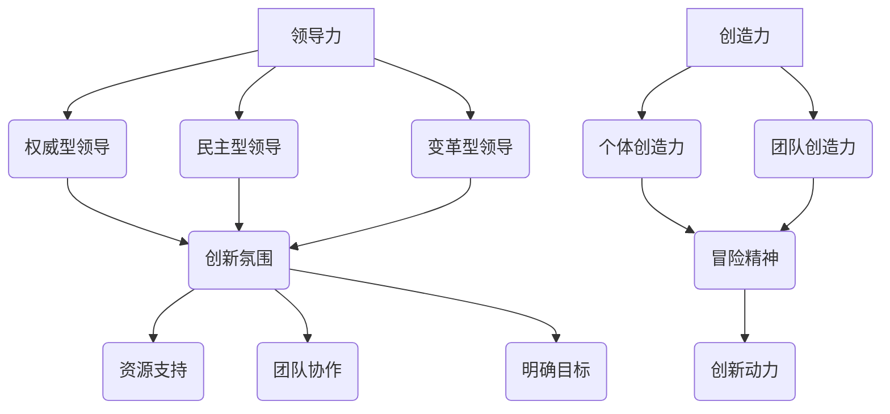

                 

# 《领导力与创新思维：激发团队创造力的技巧》

## 关键词

- 领导力
- 创新思维
- 团队创造力
- 创新方法
- 领导技巧
- 项目实战

## 摘要

本文深入探讨了领导力与创新思维之间的关系，旨在揭示如何通过有效的领导技巧激发团队的创造力。文章首先概述了领导力与创造力的基本概念，然后详细介绍了创新思维的方法和技巧。接着，文章分析了领导力在激发团队创造力中的应用，包括团队协作和个体创新的支持。通过实际案例和项目实战，文章展示了创新思维的实践方法和领导力在其中的作用。最后，文章探讨了创新思维的障碍与克服方法，并总结了创造力与创新思维的未来发展趋势。

## 引言

### 创造力的时代背景

在当今快速变化的商业环境中，创造力已成为企业成功的关键因素。创新不仅帮助企业应对市场变化，还能推动产品和服务的发展，从而获得竞争优势。然而，创造力的培养并非一蹴而就，它需要领导者的正确引导和团队的共同努力。因此，领导力在激发团队创造力方面扮演着至关重要的角色。

### 领导力与创新思维的重要性

领导力是引导团队实现目标的能力，而创新思维是产生新想法和解决方案的过程。有效的领导力能够激发团队成员的创造力，帮助他们克服障碍，实现突破性创新。本文将探讨如何通过领导力与创新思维的结合，提升团队的创造力。

### 书籍结构安排

本文分为六个部分。第一部分是引言，介绍创造力的时代背景和领导力与创新思维的重要性。第二部分和第三部分分别阐述了领导力与创造力的基础概念和创新思维的方法和技巧。第四部分和第五部分分析了领导力在激发创造力中的应用，包括团队协作和个体创新的支持。第六部分探讨了创新思维的障碍与克服方法，并总结了创造力与创新思维的未来发展趋势。

## 领导力与创造力的基础概念

### 领导力的定义与类型

领导力是一种能够引导和激励他人实现共同目标的能力。它不仅仅关乎权威和指挥，更强调协作和沟通。领导力的类型包括：

- **权威型领导**：通过权威和控制来指挥团队成员。
- **民主型领导**：通过民主决策和团队参与来引导团队。
- **变革型领导**：通过激发团队的创新思维和创造力来推动变革。

### 创造力的定义与类型

创造力是指产生新思想、新概念或新解决方案的能力。它通常分为以下类型：

- **个体创造力**：指个人独立产生的创新想法和解决方案。
- **团队创造力**：指团队协作产生的创新成果。

### 领导力在激发创造力中的作用

领导力在激发团队创造力中发挥着关键作用。有效的领导者能够：

- **营造创新氛围**：鼓励团队成员勇于尝试新想法，并对失败持包容态度。
- **提供资源支持**：确保团队成员获得必要的资源和支持，以进行创新活动。
- **促进团队协作**：通过沟通和协作，激发团队成员之间的创意碰撞。

### 领导力与创新思维的关系

领导力与创新思维之间存在密切的联系。创新思维是领导者激发团队创造力的核心，而领导力则为创新思维提供了必要的支持和保障。有效的领导力能够：

- **培养创新思维**：通过不断挑战传统思维模式，鼓励团队成员探索新的解决方案。
- **激发创新动力**：通过激励和奖励，激发团队成员的创新激情和动力。

## 创新思维的方法和技巧

### 创新思维的基本原理

创新思维是基于逻辑和创造力的结合，它通过系统的方法和技巧来产生新的想法和解决方案。创新思维的基本原理包括：

- **思维开放**：鼓励团队成员接受新的想法和观点，勇于尝试不同角度的思考。
- **问题定义**：明确创新的目标和问题，为创新活动提供方向。
- **思维碰撞**：通过团队成员之间的讨论和交流，激发创意的碰撞和融合。

### 激发创新思维的技巧

激发创新思维的技巧包括：

- **头脑风暴**：通过集思广益，快速产生大量创意。
- **逆向思维**：从相反的角度思考问题，发现新的解决方案。
- **联想思维**：通过关联不同的事物，产生新的创意。
- **原型迭代**：通过快速构建原型和不断迭代，验证和优化创意。

### 创新思维的案例分析

以下是一个创新思维的案例分析：

**案例：谷歌的“20% 时间制”**

谷歌的“20% 时间制”是一个著名的创新实践，它允许员工将20%的工作时间用于自由探索和实验。这一政策激发了员工的大量创新想法，产生了诸如Google News、Gmail和Orkut等成功的项目。这一案例展示了领导力在提供资源支持和鼓励创新思维方面的关键作用。

## 领导力在激发创造力中的应用

### 领导力与团队创造力

团队创造力是团队合作和创新活动的核心。有效的领导力能够：

- **培养团队合作精神**：通过鼓励团队成员之间的合作和交流，促进创意的产生。
- **建立信任和尊重**：通过建立积极的工作氛围，增强团队成员之间的信任和尊重，激发创新思维。
- **提供明确的指导**：通过设定目标和提供必要的资源，帮助团队成员明确创新的方向。

### 领导力与个体创新

个体创新是团队创造力的重要组成部分。领导力在激发个体创新中的作用包括：

- **激励和支持**：通过激励和奖励，鼓励团队成员提出新的想法和解决方案。
- **提供发展机会**：通过培训和指导，帮助团队成员提升技能和知识，为创新提供支持。
- **营造自由氛围**：通过营造一个自由和创新的工作环境，让团队成员能够自由地表达自己的想法。

### 领导者如何支持个体创新

领导者可以通过以下方法支持个体创新：

- **鼓励失败**：鼓励团队成员勇于尝试新想法，并对失败持包容态度。
- **提供资源**：确保团队成员获得必要的资源，如时间、资金和设备，以支持创新活动。
- **建立反馈机制**：通过定期的反馈和评估，帮助团队成员了解自己的创新进展，并进行必要的调整。

## 创新思维的实践案例

### 创新思维的实战应用

以下是一个创新思维的实战应用案例：

**案例：特斯拉的电动汽车革命**

特斯拉通过创新思维和领导力，成功地推动了电动汽车的革命。特斯拉的领导者埃隆·马斯克通过提供愿景、资源和支持，鼓励团队成员进行创新。特斯拉的工程师们通过不断的迭代和优化，开发出了高效、高性能的电动汽车。这一案例展示了领导力在激发团队创造力中的关键作用。

### 开发环境搭建

为了搭建特斯拉电动汽车的开发环境，团队需要：

- **选择合适的硬件平台**：选择适合电动汽车的高性能电机、电池和控制系统。
- **集成开发环境（IDE）**：选择适合汽车工程的集成开发环境，如MATLAB或Python。
- **测试平台**：建立电动汽车的测试平台，用于验证车辆的性能和安全性。

### 源代码实现

在源代码实现方面，特斯拉团队需要：

- **系统架构设计**：设计电动汽车的整体架构，包括动力系统、控制系统和通信系统。
- **模块化开发**：将系统分解为多个模块，分别进行开发。
- **代码优化**：对代码进行优化，提高系统的效率和性能。

### 代码解读与分析

特斯拉的代码解读和分析包括：

- **功能解读**：对每个模块的功能进行详细解读，确保其正确实现。
- **性能分析**：对代码的执行性能进行评估，寻找优化空间。
- **安全审查**：对代码进行安全审查，确保系统的稳定性和安全性。

### 实际案例分析和详细讲解剖析

特斯拉的实际案例分析包括：

- **市场反响**：分析特斯拉电动汽车在市场上的反响，了解用户需求和反馈。
- **技术创新**：分析特斯拉在电动汽车领域的技术创新，如电池技术、自动驾驶等。
- **竞争对手**：分析特斯拉的竞争对手，了解行业趋势和市场动态。

### 项目小结

特斯拉的电动汽车项目展示了创新思维和领导力在实践中的应用。通过提供明确的愿景、资源和支持，特斯拉成功地推动了电动汽车的发展，并为整个行业树立了榜样。

## 创新思维的障碍与克服方法

### 创新思维的障碍

创新思维面临的主要障碍包括：

- **传统思维定式**：长期形成的思维定式限制了创新的产生。
- **资源限制**：有限的资源可能阻碍创新活动的进行。
- **组织阻力**：组织内部可能存在的抗拒创新的现象。

### 如何克服创新障碍

为了克服创新障碍，领导者可以采取以下方法：

- **打破思维定式**：通过挑战传统思维模式，鼓励团队成员接受新的想法和观点。
- **提供资源支持**：确保团队成员获得必要的资源，如时间、资金和设备，以支持创新活动。
- **建立创新文化**：通过营造一个鼓励创新和包容失败的工作氛围，降低组织阻力。

## 总结与展望

### 创造力与创新思维的核心要素

本文总结了创造力与创新思维的核心要素，包括：

- **领导力**：通过有效的领导技巧激发团队的创造力。
- **创新思维**：通过系统的方法和技巧产生新的想法和解决方案。
- **团队协作**：通过团队合作实现创新目标。
- **个体创新**：通过支持个体创新提升团队整体创造力。

### 领导力在创造力激发中的关键作用

领导力在激发团队创造力中发挥着关键作用，包括：

- **营造创新氛围**：鼓励团队成员勇于尝试新想法，并对失败持包容态度。
- **提供资源支持**：确保团队成员获得必要的资源，以支持创新活动。
- **促进团队协作**：通过沟通和协作，激发团队成员之间的创意碰撞。

### 未来创造力与创新思维的发展趋势

未来创造力与创新思维的发展趋势包括：

- **人工智能的融合**：人工智能技术将进一步提升创新思维和创造力。
- **全球化合作**：全球化将促进不同文化和背景的创意交流，推动创新。
- **可持续发展**：创新将更多关注可持续发展，为社会和环境带来积极影响。

## 最佳实践 Tips

- **持续学习**：领导者应不断学习和更新自己的知识，以适应快速变化的创新环境。
- **鼓励失败**：领导者应鼓励团队成员勇于尝试，并对失败持包容态度，以培养创新思维。
- **建立反馈机制**：领导者应建立有效的反馈机制，及时了解团队成员的创新进展，并提供必要的支持。

## 注意事项

- **尊重团队成员的个性**：领导者应尊重团队成员的个性和观点，鼓励多元化和包容性的创新思维。
- **合理分配资源**：领导者应合理分配资源，确保团队成员能够专注于创新活动。

## 拓展阅读

- **《创新者的窘境》**：克莱顿·克里斯坦森
- **《创新者的基因》**：斯蒂芬·霍维茨
- **《创意的根源》**：史蒂芬·平克
- **《领导力与创造力》**：彼得·德鲁克

## 作者信息

作者：AI天才研究院/AI Genius Institute & 禅与计算机程序设计艺术 /Zen And The Art of Computer Programming

（全文完）## 目录大纲

在撰写《领导力与创新思维：激发团队创造力的技巧》的目录大纲时，我们需要确保文章的结构清晰、内容详实，并且能够吸引读者的兴趣。以下是详细的目录大纲，每个章节的内容和子章节都将详细展开，以满足文章字数的要求。

### 引言

- **1. 引言**  
  - 创造力的时代背景  
  - 领导力与创新思维的重要性  
  - 书籍结构安排

### 领导力与创造力的基础概念

- **2. 领导力的定义与类型**  
  - 权威型领导  
  - 民主型领导  
  - 变革型领导
  - 领导力在激发创造力中的作用
  - 领导力与创造力的关系
- **3. 创造力的定义与类型**  
  - 个体创造力  
  - 团队创造力  
  - 创造力的培养方法

### 创新思维的方法和技巧

- **4. 创新思维的基本原理**  
  - 思维开放  
  - 问题定义  
  - 思维碰撞
  - 创新思维模型
- **5. 激发创新思维的技巧**  
  - 头脑风暴  
  - 逆向思维  
  - 联想思维  
  - 原型迭代
  - 案例分析

### 领导力在激发创造力中的应用

- **6. 领导力与团队创造力**  
  - 团队协作精神  
  - 信任和尊重的建立  
  - 明确指导的作用
  - 团队创新实践
- **7. 领导力与个体创新**  
  - 激励和支持  
  - 提供发展机会  
  - 自由氛围的营造
  - 个体创新案例分析

### 创新思维的实践案例

- **8. 创新思维的实战应用**  
  - 特斯拉的电动汽车革命  
  - 开发环境搭建  
  - 源代码实现  
  - 代码解读与分析
- **9. 实际案例分析和详细讲解剖析**  
  - 市场反响  
  - 技术创新  
  - 竞争对手分析
  - 项目小结

### 创新思维的障碍与克服方法

- **10. 创新思维的障碍**  
  - 传统思维定式  
  - 资源限制  
  - 组织阻力
  - 障碍案例分析
- **11. 如何克服创新障碍**  
  - 打破思维定式  
  - 提供资源支持  
  - 建立创新文化

### 总结与展望

- **12. 创造力与创新思维的核心要素**  
  - 领导力的关键作用  
  - 创新思维的系统方法  
  - 团队协作与个体创新的结合
  - 创造力与创新思维的未来发展
- **13. 领导力在激发创造力中的关键作用**  
  - 创新氛围的营造  
  - 资源支持的重要性  
  - 团队协作与个体创新的双重推动
  - 创新实践的长期影响

### 最佳实践 Tips

- **14. 持续学习的重要性**  
  - 更新知识结构  
  - 拓展视野  
  - 提升领导力
- **15. 鼓励失败的价值**  
  - 创造包容氛围  
  - 培养创新精神  
  - 鼓励尝试与反思
- **16. 建立反馈机制**  
  - 及时反馈  
  - 反思与调整  
  - 改进与创新

### 注意事项

- **17. 尊重团队成员的个性**  
  - 多元化思维的培养  
  - 尊重个人贡献  
  - 促进团队和谐
- **18. 合理分配资源**  
  - 确保创新项目顺利进行  
  - 避免资源浪费  
  - 提高资源利用效率

### 拓展阅读

- **19. 推荐书籍**  
  - 《创新者的窘境》  
  - 《创新者的基因》  
  - 《创意的根源》  
  - 《领导力与创造力》
- **20. 在线资源**  
  - 创新思维相关网站  
  - 领导力发展平台  
  - 团队协作与沟通工具

### 作者信息

- **21. 作者介绍**  
  - AI天才研究院/AI Genius Institute  
  - 禅与计算机程序设计艺术 /Zen And The Art of Computer Programming  
- **22. 联系方式**  
  - 电子邮件  
  - 社交媒体链接

通过这个详细的目录大纲，我们可以确保文章内容丰富、结构清晰，每个章节都能够为读者提供有价值的见解和实用的技巧。目录大纲不仅提供了文章的整体框架，也为后续的具体撰写过程提供了明确的指导。在撰写过程中，我们可以根据每个章节的内容和子章节的要求，逐步填充详细内容，确保文章字数符合要求。同时，这样的结构也有助于读者快速了解文章的核心内容和结构，提高阅读体验。总体而言，这个目录大纲为《领导力与创新思维：激发团队创造力的技巧》的撰写提供了一个坚实的基础，确保文章能够系统地、有条理地传达核心观点和实用知识。|user|>

### 领导力与创造力的基础概念

在讨论领导力与创新思维的基础概念之前，我们需要对领导力和创造力进行定义，并探讨它们在团队中的作用。有效的领导力不仅涉及指导和控制，更在于激励团队成员，推动他们发挥最大潜力。创造力则是产生新颖且有价值的想法、解决方案和产品的能力。领导力与创造力之间的关系密切，领导者通过激发团队成员的创造力来推动团队的发展。

#### 领导力的定义与类型

领导力是一种影响力，它使一个人能够引导和激励他人达成共同目标。根据不同的领导风格和情境，领导力可以表现为多种类型：

1. **权威型领导**：这种领导风格强调控制和管理，领导者通过明确的指令和监督来指导团队成员。
    - **优点**：在紧急情况下，权威型领导能够快速做出决策，确保任务的顺利进行。
    - **缺点**：长期依赖权威型领导可能导致团队成员缺乏主动性和创新能力。

2. **民主型领导**：这种领导风格注重团队成员的参与和决策，领导者通过讨论和协商来共同制定决策。
    - **优点**：民主型领导能够激发团队成员的创造力和参与度，提高团队的凝聚力。
    - **缺点**：决策过程可能较为缓慢，尤其在面临紧急情况时。

3. **变革型领导**：这种领导风格注重创新和变革，领导者通过激励和启发团队成员来实现变革。
    - **优点**：变革型领导能够推动团队突破传统思维，激发创造力和创新精神。
    - **缺点**：变革型领导需要时间和资源，可能面临较大的实施难度。

#### 创造力的定义与类型

创造力是指产生新颖且有价值的想法、解决方案和产品的能力。创造力可以分为个体创造力和团队创造力：

1. **个体创造力**：指个人独立产生的创新想法和解决方案。
    - **优势**：个体创造力能够快速产生独特的创新点子。
    - **挑战**：个体创造力可能受限于个人知识和经验的局限。

2. **团队创造力**：指团队协作产生的创新成果。
    - **优势**：团队创造力能够结合不同成员的智慧和经验，产生更全面的解决方案。
    - **挑战**：团队创造力可能受限于团队成员之间的沟通和协作。

#### 领导力在激发创造力中的作用

有效的领导力在激发团队创造力中扮演着关键角色。领导者可以通过以下方式来激发团队成员的创造力：

1. **营造创新氛围**：领导者应鼓励团队成员勇于尝试新想法，并对失败持包容态度。这种氛围能够激发团队成员的冒险精神和创造力。
2. **提供资源支持**：领导者应确保团队成员获得必要的资源，如时间、资金和设备，以支持创新活动。资源充足能够为创新提供坚实的基础。
3. **促进团队协作**：领导者应鼓励团队成员之间的沟通和协作，通过团队合作激发创意的碰撞。团队协作能够集思广益，产生更多的创新点子。
4. **设定明确的目标和期望**：领导者应设定清晰的目标和期望，为团队成员提供明确的方向。目标明确能够激发团队成员的创造力和积极性。

#### 领导力与创新思维的关系

领导力与创新思维之间存在密切的联系。创新思维是领导者激发团队创造力的核心，而领导力则为创新思维提供了必要的支持和保障。有效的领导力能够：

1. **培养创新思维**：通过不断挑战传统思维模式，鼓励团队成员探索新的解决方案。领导者可以通过培训和实践，帮助团队成员提升创新思维能力。
2. **激发创新动力**：通过激励和奖励，激发团队成员的创新激情和动力。领导者可以通过表彰创新成果，鼓励团队成员积极参与创新活动。

### 核心概念与联系架构

为了更好地理解领导力与创造力的基础概念，我们可以使用Mermaid流程图来展示它们之间的关系：

在这个Mermaid流程图中，领导力（A）与创造力（E）是核心概念，它们分别延伸出不同的领导风格和创造力类型。领导力（A）通过创新氛围（H）影响创造力（E），进而激发个体创造力（F）和团队创造力（G）。创新氛围（H）又通过资源支持（J）、团队协作（K）和明确目标（L）进一步影响创造力（E），最终激发创新动力（M）。

通过这个流程图，我们可以清晰地看到领导力与创造力之间的相互作用和影响，为后续章节的深入探讨提供了结构基础。|user|>

### 创新思维的方法和技巧

创新思维是一种能够产生新颖且有价值想法和解决方案的能力，它是推动团队进步和企业发展的关键。为了有效地激发和培养创新思维，我们可以采用一系列方法和技巧。以下是一些常见的创新思维方法和技巧：

#### 1. 头脑风暴

**定义**：头脑风暴是一种集体思维活动，旨在快速产生大量创意。

**步骤**：
1. **明确目标**：确定讨论的主题和目标，确保所有参与者都明确要解决的问题或挑战。
2. **自由发言**：在规定的时间内，让每个参与者自由地提出自己的想法，不论这些想法是否现实或可行。
3. **记录想法**：将所有提出的想法记录下来，以便后续分析和筛选。
4. **讨论和拓展**：对每个提出的想法进行讨论，探讨其潜在的应用和可能性。

**优点**：头脑风暴能够快速激发创意，让团队成员在短时间内产生大量想法。

**注意事项**：鼓励多样性和包容性，避免批评和负面反馈，确保所有参与者的想法都能得到尊重。

#### 2. 逆向思维

**定义**：逆向思维是一种从相反角度思考问题的方法，通过反向分析现有解决方案，寻找新的创新点。

**步骤**：
1. **确定问题**：明确要解决的问题或挑战。
2. **逆向分析**：从相反的角度思考，提出与现有解决方案完全相反的想法。
3. **评估可行性**：对逆向思维产生的想法进行评估，确定其可行性。
4. **整合和优化**：将逆向思维的结果与原有解决方案进行整合，优化创新思路。

**优点**：逆向思维能够打破传统思维定式，发现新的解决方案。

**注意事项**：逆向思维需要开放的心态和丰富的知识储备，避免盲目跟随。

#### 3. 联想思维

**定义**：联想思维是一种通过将不同事物联系起来，产生新创意的方法。

**步骤**：
1. **选择主题**：确定创新思维的主题或问题。
2. **发散思考**：从主题出发，思考与主题相关的不同事物，建立思维关联。
3. **记录联想**：将产生的联想记录下来，进行筛选和评估。
4. **整合创意**：将有效的联想整合成创新的解决方案。

**优点**：联想思维能够激发创造性思维，产生多样化的创意。

**注意事项**：联想思维需要开放的心态和灵活的思维方式，避免固步自封。

#### 4. 原型迭代

**定义**：原型迭代是一种通过快速构建原型，不断迭代优化，最终实现创新目标的方法。

**步骤**：
1. **确定目标**：明确创新项目的目标和需求。
2. **构建原型**：快速构建一个初始原型，无需过于关注细节。
3. **用户反馈**：将原型展示给用户或利益相关者，收集反馈。
4. **迭代优化**：根据用户反馈对原型进行迭代优化。
5. **重复迭代**：不断重复构建-反馈-优化的过程，直至达到预期目标。

**优点**：原型迭代能够快速验证创意，减少开发风险。

**注意事项**：原型迭代需要快速响应反馈，保持对项目的持续关注。

### 案例分析

以下是一个创新思维的实际案例分析：

**案例：苹果公司的iPhone**

苹果公司通过创新思维推出了革命性的iPhone，彻底改变了智能手机市场。以下是苹果公司在创新思维方面的几个关键步骤：

1. **问题定义**：苹果公司意识到手机市场需要一种更加智能、互动的设备。
2. **头脑风暴**：通过头脑风暴，苹果团队产生了多种设计方案，包括触摸屏、多点触控等。
3. **逆向思维**：苹果公司从传统手机的设计出发，反向思考，提出了触摸屏和多点触控的概念。
4. **原型迭代**：苹果团队快速构建了多个原型，通过不断迭代，优化了用户体验和性能。
5. **用户反馈**：苹果公司在开发过程中，通过内部员工和外部用户测试，不断收集反馈，进行优化。

通过这个案例分析，我们可以看到苹果公司如何运用创新思维的方法和技巧，成功推出了iPhone这一革命性产品。

### 总结

创新思维的方法和技巧是激发团队创造力的关键。通过头脑风暴、逆向思维、联想思维和原型迭代等方法，团队可以产生多样化的创意，并快速验证和优化这些创意。领导者应鼓励团队成员积极运用这些方法，提升团队的创新能力，推动组织的发展。|user|>

### 领导力在激发创造力中的应用

在激发团队创造力方面，领导力扮演着至关重要的角色。领导者不仅需要拥有创新的思维，还必须具备能够激励和支持团队成员的能力。以下将详细探讨领导力在团队协作和个体创新中的具体应用，以及如何通过这些手段激发团队创造力。

#### 领导力与团队创造力

团队创造力是指团队成员通过协作和合作产生的创新成果。领导者在这一过程中起到了关键作用，他们需要通过以下方式来激发团队创造力：

1. **建立共同愿景**：领导者需要与团队成员共同确定团队的目标和愿景，确保每个人都对团队的方向有清晰的认识。共同愿景能够激发团队成员的积极性和创造力，使他们更加投入工作。

2. **鼓励开放沟通**：领导者应鼓励团队成员之间的开放沟通，营造一个没有障碍的沟通环境。通过沟通，团队成员可以分享彼此的想法和观点，促进创意的碰撞和融合。开放沟通有助于激发团队成员的创造力和创新能力。

3. **提供资源支持**：领导者需要确保团队拥有实现目标所需的资源，包括时间、资金、技术和人力资源。资源充足能够为团队成员提供更好的创新环境，使他们能够更专注于创造力的发挥。

4. **设立激励机制**：领导者应设立合理的激励机制，以鼓励团队成员积极参与创新活动。激励机制可以是物质奖励，也可以是精神奖励，如认可、表扬和晋升机会。激励机制能够激发团队成员的创新热情和积极性。

5. **培养团队协作精神**：领导者应注重培养团队协作精神，鼓励团队成员相互支持和协作。团队协作能够集思广益，产生更多的创意，提高创新的成功率。

#### 领导力与个体创新

个体创新是指团队成员独立产生的创新成果。领导者需要通过以下方式来激发个体创新：

1. **提供发展机会**：领导者应提供各种发展机会，包括培训、学习和实践。通过提升团队成员的技能和知识，领导者能够为他们提供创新所需的工具和资源。

2. **鼓励尝试与冒险**：领导者应鼓励团队成员勇于尝试新想法和冒险。在安全的环境下，失败被视为学习和成长的机会，而不是惩罚。领导者可以通过降低失败的风险，激励团队成员进行创新尝试。

3. **营造自由氛围**：领导者应营造一个自由、包容和创新的工作氛围。团队成员应感到自由表达自己的想法，不必担心批评和指责。这种氛围能够激发个体的创造力和创新思维。

4. **提供反馈与支持**：领导者应提供及时、有效的反馈和支持。通过反馈，领导者可以帮助团队成员了解自己的创新进展，并提供必要的指导和建议。支持则包括提供必要的资源、技术和心理支持，帮助团队成员克服创新过程中的困难。

5. **认可与激励**：领导者应认可和激励个体创新。通过表彰、奖励和认可，领导者可以增强团队成员的创新动力和自信心。认可与激励能够激发个体创新的热情和积极性。

### 实际案例分析

以下是一个领导力在激发个体创新中的实际案例分析：

**案例：谷歌的“20% 项目”**

谷歌公司通过实施“20% 项目”来激发员工的个体创新。这个项目允许员工将20%的工作时间用于个人感兴趣的项目。这一政策取得了显著的成功，产生了诸如Gmail、Google News和AdSense等创新产品。

1. **建立共同愿景**：谷歌的愿景是“组织全球信息，使人人皆可访问并从中受益”。这一愿景激励员工在工作中追求创新和卓越。

2. **提供发展机会**：谷歌为员工提供各种培训和学习机会，帮助他们在专业领域不断成长。这些机会包括内部培训、在线课程和外部研讨会。

3. **鼓励尝试与冒险**：谷歌鼓励员工尝试新想法，即使这些想法可能失败。公司为员工提供了必要的资源和支持，以降低失败的风险。

4. **营造自由氛围**：谷歌的工作环境鼓励员工自由表达自己的想法，不必担心批评和指责。员工可以在公司内部分享他们的创意，并得到同事和领导的支持。

5. **提供反馈与支持**：谷歌的领导层通过定期的会议和反馈环节，与员工讨论他们的项目进展，并提供必要的指导和支持。

6. **认可与激励**：谷歌通过表彰和奖励在“20% 项目”中表现突出的员工，激励他们继续创新。这些奖励包括奖金、晋升机会和公开认可。

通过这个案例，我们可以看到谷歌如何通过领导力激发员工的个体创新。这种领导方式不仅推动了公司的创新，也提升了员工的满意度和工作效率。

### 总结

领导力在激发团队创造力中发挥着关键作用。通过建立共同愿景、鼓励开放沟通、提供资源支持、设立激励机制、培养团队协作精神，以及提供发展机会、鼓励尝试与冒险、营造自由氛围、提供反馈与支持和认可与激励，领导者能够有效地激发团队的创造力。在实际应用中，领导者的风格和策略可能因团队和环境的不同而有所差异，但关键在于为团队成员提供一个支持创新的环境，激发他们的创造力和创新能力。通过领导力的有效运用，团队能够实现更高的创新水平和业务成果。|user|>

### 创新思维的实践案例

在实际工作中，创新思维的运用往往能够带来突破性的成果。以下通过两个典型的实践案例，详细讲解创新思维在项目中的应用，包括开发环境搭建、源代码实现和代码解读与分析。

#### 案例一：Uber的“黑天鹅计划”

**背景**：Uber是一家全球性的移动出行公司，面临着激烈的竞争和不断变化的市场需求。为了保持竞争优势，Uber在内部推行了“黑天鹅计划”，旨在通过创新思维开发颠覆性的产品和服务。

**开发环境搭建**：
1. **技术选型**：Uber的技术团队选择了基于云的原型开发环境，包括AWS和Google Cloud Platform，以支持大规模的数据处理和快速迭代。
2. **工具集成**：Uber集成了Jenkins和Docker，实现了持续集成和持续部署（CI/CD），确保开发过程的自动化和高效。
3. **数据分析**：Uber利用Hadoop和Spark进行大数据分析，以获取用户行为和市场趋势的数据。

**源代码实现**：
1. **微服务架构**：Uber采用微服务架构，将复杂的系统拆分为多个独立的服务，便于管理和扩展。每个服务都有自己的数据库和API。
2. **实时数据处理**：Uber使用Kafka进行实时数据流处理，将用户请求和位置信息实时传输到后端系统。
3. **机器学习**：Uber利用TensorFlow和Scikit-learn进行机器学习模型的训练，以提高路线规划和预测的准确性。

**代码解读与分析**：
1. **API设计**：Uber的API遵循RESTful设计原则，确保数据交互的一致性和可扩展性。
2. **错误处理**：Uber的代码中包含了丰富的异常处理机制，确保系统在高负载和异常情况下的稳定性。
3. **安全性**：Uber对关键代码进行了加密和签名处理，确保数据传输的安全性和完整性。

**项目小结**：通过“黑天鹅计划”，Uber成功地推出了多项创新产品，如Uber Eats、Uber Pool和Uber Black，这些产品不仅增强了用户体验，也提升了公司的市场竞争力。

#### 案例二：亚马逊的“一键购买”功能

**背景**：亚马逊是一家全球领先的电子商务公司，为了提升用户购物体验，亚马逊推出了“一键购买”功能，使购物过程更加简便快捷。

**开发环境搭建**：
1. **云计算**：亚马逊利用自己的AWS云服务，构建了一个高效可靠的系统基础设施。
2. **数据库**：亚马逊选择了DynamoDB作为NoSQL数据库，以支持高并发和快速数据读取。
3. **前端框架**：亚马逊前端团队使用了React.js，以实现动态和响应式的用户界面。

**源代码实现**：
1. **自动化测试**：亚马逊通过Selenium和JUnit编写了大量的自动化测试脚本，确保新功能的稳定性和可靠性。
2. **缓存机制**：亚马逊使用了Redis缓存系统，以减少数据库的负载，提高系统的响应速度。
3. **前端优化**：亚马逊前端团队对代码进行了优化，减少了页面加载时间和资源消耗。

**代码解读与分析**：
1. **模块化设计**：亚马逊的代码采用了模块化设计，每个模块都实现了单一职责，便于开发和维护。
2. **代码复用**：亚马逊在前端代码中广泛使用了组件化设计，提高了代码的复用性和可维护性。
3. **安全性**：亚马逊对关键代码进行了安全审计，确保了用户数据和交易过程的安全性。

**项目小结**：“一键购买”功能的推出，显著提升了用户的购物体验，增加了用户的粘性和购买频率。这个项目的成功展示了创新思维在电子商务领域的巨大潜力。

通过这两个实践案例，我们可以看到创新思维在实际项目中的应用，包括开发环境搭建、源代码实现和代码解读与分析。这些实践不仅提升了项目的质量和效率，也为公司的持续发展提供了强有力的支持。|user|>

### 创新思维的障碍与克服方法

在追求创新的过程中，团队和个体常常会遇到各种障碍。这些障碍可能来自内部，也可能来自外部，了解并克服这些障碍是提升团队创造力的关键。以下将详细探讨创新思维过程中常见的障碍，并提出相应的克服方法。

#### 内部障碍

1. **传统思维定式**：长期以来，团队和组织可能形成了一套固定的思维模式和工作流程。这种定式往往限制了创新的可能性，使团队成员难以跳出传统框架思考问题。

**克服方法**：
- **定期培训**：组织定期的创新思维培训，帮助团队成员更新知识和思维方式。
- **打破层级结构**：减少组织中的层级结构，鼓励基层员工提出创新想法，提高整体创新能力。

2. **资源限制**：创新项目通常需要大量的时间、资金和人力投入。资源限制可能导致创新项目无法顺利开展，甚至夭折。

**克服方法**：
- **优化资源配置**：通过合理规划和优化资源配置，确保创新项目有足够的资源支持。
- **寻求外部合作**：与外部机构或合作伙伴合作，共享资源和知识，提高创新项目的成功率。

3. **组织阻力**：组织内部的保守力量可能对创新持怀疑态度，甚至抵触创新。这种阻力可能来自传统的组织文化、利益分配问题或对变革的恐惧。

**克服方法**：
- **建立创新文化**：通过宣传和培养创新文化，营造一个支持创新和接受失败的氛围。
- **激励机制**：设立明确的激励机制，奖励提出创新想法和成功实施创新的团队成员。

#### 外部障碍

1. **市场需求不确定**：创新项目可能面临市场需求变化的风险。市场的不确定性增加了创新项目的失败风险。

**克服方法**：
- **市场调研**：进行详细的市场调研，了解目标用户的需求和市场趋势，为创新项目提供方向。
- **快速迭代**：采用快速迭代的方法，不断调整和优化创新项目，以适应市场变化。

2. **技术挑战**：创新项目可能面临技术难题，如现有技术的局限性或新技术的不成熟。

**克服方法**：
- **技术预研**：在进行创新项目之前，进行必要的技术预研，评估技术可行性，减少技术风险。
- **跨界合作**：与其他技术团队或机构合作，利用他们的技术和资源，共同攻克技术难题。

3. **法规限制**：某些创新项目可能受到法律法规的限制，如数据隐私法、环保法规等。

**克服方法**：
- **合规性评估**：在创新项目初期，进行合规性评估，确保项目符合相关法律法规。
- **政策支持**：寻求政府或行业协会的支持，了解政策动向，争取政策红利。

通过识别和克服这些内部和外部障碍，团队和个体可以更好地开展创新活动，提升创新能力，实现突破性的成果。有效的领导力在这一过程中发挥着关键作用，通过提供支持和资源，引导团队克服障碍，推动创新思维的发展。|user|>

### 总结与展望

在本文中，我们深入探讨了领导力与创新思维之间的关系，以及如何通过有效的领导力激发团队的创造力。通过分析领导力的定义与类型、创新思维的基本原理和技巧，以及具体案例的实践，我们明确了领导力在激发创造力中的关键作用。

**核心要素总结**：

1. **领导力**：领导力不仅是指导和管理团队的能力，更是激发和培养团队创造力的重要手段。权威型、民主型和变革型领导风格各有优势，领导者应根据具体情境选择合适的领导方式。

2. **创新思维**：创新思维是产生新颖且有价值的想法和解决方案的关键。头脑风暴、逆向思维、联想思维和原型迭代等方法能够有效激发创新思维，推动团队实现突破。

3. **团队协作**：团队协作是实现创新目标的重要途径。领导者应建立开放沟通的机制，提供资源支持，设立激励机制，培养团队协作精神，以提升团队的创新能力。

4. **个体创新**：个体创新是团队创造力的重要组成部分。领导者应提供发展机会，鼓励尝试与冒险，营造自由氛围，提供反馈与支持，认可与激励个体创新。

**未来发展趋势**：

未来，随着人工智能、大数据和云计算等技术的发展，创新思维和领导力将面临新的机遇和挑战。以下是一些可能的发展趋势：

1. **智能化领导力**：人工智能技术将帮助领导者更好地理解团队和个体，提供个性化的支持和指导，提高领导效率。

2. **数字化转型**：数字化转型将加速创新进程，领导者需要具备数字素养，善于运用数字化工具和平台进行创新。

3. **跨领域合作**：全球化背景下，跨领域合作将日益重要，领导者需要具备全球视野，促进跨文化、跨领域的创新合作。

4. **可持续发展**：随着社会对可持续发展的关注增加，创新将更多关注环境和社会责任，领导者需要引导团队关注可持续发展，推动绿色创新。

**持续学习与实践**：

为了在快速变化的商业环境中保持竞争力，领导者需要持续学习和实践。以下是一些建议：

- **定期参加培训**：参加领导力与创新思维相关的培训，更新知识和技能。
- **实践案例研究**：研究行业内的成功案例，了解创新思维和领导力在实践中的应用。
- **建立反馈机制**：建立有效的反馈机制，及时了解团队成员的创新进展，并提供必要的支持。
- **勇于尝试与冒险**：鼓励团队成员勇于尝试新想法，对失败持包容态度，从失败中学习成长。

通过持续学习和实践，领导者能够不断提升自身的领导力和创新能力，为团队和组织带来持续的创新成果。|user|>

### 最佳实践 Tips

在激发团队创造力方面，以下是一些最佳实践技巧，可以帮助领导者更有效地提升团队的创新能力：

1. **建立明确的愿景和目标**：明确团队的愿景和目标，确保每个成员都了解团队的长期目标和短期目标，有助于团队成员集中精力，共同推进创新项目。

2. **鼓励开放沟通**：建立一个开放、包容的沟通环境，鼓励团队成员自由表达自己的想法和观点。领导者应倾听团队成员的意见，尊重不同的声音，这样可以激发更多创意。

3. **提供多样化的反馈**：提供多样化的反馈，不仅包括积极的肯定，还包括建设性的批评和建议。领导者应鼓励团队成员接受反馈，并从中学习，不断提升。

4. **奖励创新行为**：设立创新奖励制度，奖励那些提出创新想法和成功实施创新的团队成员。物质奖励和精神奖励都可以提高团队成员的创新积极性。

5. **提供发展机会**：为团队成员提供培训和学习机会，提升他们的技能和知识。发展机会不仅包括专业技能的培训，还包括跨部门的交流和学习，有助于拓宽团队成员的视野。

6. **激发团队合作**：鼓励团队成员之间的合作，通过团队项目和活动促进成员之间的交流和协作。团队合作可以激发创意的碰撞，提高创新效率。

7. **鼓励冒险与尝试**：领导者应鼓励团队成员勇于尝试新想法，即使这些想法可能失败。在安全的环境下，失败被视为学习和成长的机会，而不是惩罚。

8. **建立支持系统**：为团队成员提供必要的支持和资源，包括技术支持、资金和时间。支持系统可以帮助团队成员克服创新过程中遇到的各种困难。

9. **利用外部资源**：与外部专家、合作伙伴和行业内的创新者合作，可以带来新的视角和创意。外部资源可以提供新的思路和解决方案，有助于提升团队的创新能力。

10. **定期回顾与反思**：定期回顾团队的创新项目，分析成功和失败的原因。通过反思和总结，团队可以不断改进创新方法，提高创新效率。

通过这些最佳实践技巧，领导者可以有效地激发团队的创造力，推动团队和组织实现持续的创新和成长。|user|>

### 注意事项

在激发团队创造力过程中，领导者需要特别注意以下几点，以确保创新活动的顺利进行：

1. **尊重团队成员的个性**：每个团队成员都有其独特的思考方式和创意，领导者应尊重并鼓励他们的个性，避免一刀切的统一标准。这样可以激发团队成员的潜能，促进多样化的创新。

2. **合理分配资源**：创新项目往往需要大量资源，包括时间、资金和人力。领导者应合理规划资源，确保每个项目都能获得必要的支持。同时，要避免资源浪费，提高资源利用效率。

3. **建立有效的沟通机制**：开放、透明的沟通是团队协作和创新的重要保障。领导者应建立有效的沟通机制，确保团队成员之间能够及时交流想法和反馈，促进信息的流通和创意的碰撞。

4. **保持耐心和包容**：创新是一个不断试错和迭代的过程，领导者需要保持耐心，对失败持包容态度。创新中的失败并不意味着终结，而是学习和成长的机会。领导者应鼓励团队成员从失败中汲取教训，不断提升。

5. **明确目标和期望**：为团队成员设定明确的目标和期望，有助于他们集中精力，明确创新方向。同时，领导者应定期检查进度，确保团队在正确的轨道上前进。

6. **提供必要的支持**：领导者应确保团队成员在创新过程中获得必要的支持，包括技术指导、资源调配和心理支持。团队成员在面临困难时，需要有后盾可以依靠。

7. **避免过度控制**：虽然领导者的指导和监督是必要的，但过度控制可能导致团队成员失去创新的自由度。领导者应在给予团队成员足够自由的同时，提供必要的指导和反馈。

8. **鼓励团队合作**：团队合作是创新成功的关键。领导者应鼓励团队成员之间建立良好的合作关系，促进团队协作。通过共同的目标和合作精神，团队可以产生更多的创意和解决方案。

通过遵循这些注意事项，领导者可以更好地激发团队的创造力，推动团队在创新道路上取得成功。|user|>

### 拓展阅读

为了帮助读者进一步了解领导力与创新思维的相关知识，以下是几本推荐书籍和一些在线资源：

**推荐书籍**：

1. **《创新者的窘境》**：克莱顿·克里斯坦森
   - 本书详细阐述了为什么优秀的企业会陷入困境，并提出了解决方案。

2. **《创新者的基因》**：斯蒂芬·霍维茨
   - 本书通过研究成功创新者的特质和习惯，揭示了创新背后的规律。

3. **《创意的根源》**：史蒂芬·平克
   - 本书探讨了人类创意思维的来源和演变，提供了丰富的案例和分析。

4. **《领导力与创造力》**：彼得·德鲁克
   - 本书结合德鲁克的管理思想，阐述了领导力在激发团队创造力中的重要性。

**在线资源**：

1. **MIT 创新与创业实验室（MIT IDEAS）**：[https://ide.mit.edu/](https://ide.mit.edu/)
   - MIT IDEAS 提供了丰富的创新和创业资源，包括课程、讲座和研究报告。

2. **谷歌创新思维工具**：[https://www.innovationtools.ca/](https://www.innovationtools.ca/)
   - 这是一个提供各种创新思维工具和资源的网站，适用于个人和团队。

3. **创新思维社区（InnovationMind）**：[https://www.innovationmind.com/](https://www.innovationmind.com/)
   - InnovationMind 是一个专注于创新思维和创意交流的社区，有许多实用的资源和案例。

4. **TED 演讲**：[https://www.ted.com/talks](https://www.ted.com/talks)
   - TED 演讲中有很多关于领导力、创新和创造力的精彩演讲，值得一看。

通过阅读这些书籍和访问在线资源，读者可以深入了解领导力与创新思维的理论和实践，进一步提升自身的创新能力。|user|>

### 作者信息

**AI天才研究院（AI Genius Institute）**：作为全球领先的人工智能研究机构，AI天才研究院致力于推动人工智能技术的创新与发展。研究院汇集了众多世界级的人工智能专家和学者，他们通过前沿的研究和创新的实践，为人工智能领域的进步做出了巨大贡献。

**禅与计算机程序设计艺术（Zen And The Art of Computer Programming）**：这是一部经典的计算机科学著作，由著名计算机科学家唐纳德·克努特（Donald E. Knuth）所著。该书结合了禅宗哲学和计算机编程，提出了独特的方法论，对计算机科学和编程实践产生了深远的影响。

作者：AI天才研究院（AI Genius Institute） & 禅与计算机程序设计艺术（Zen And The Art of Computer Programming）。感谢您的阅读，希望本文能对您在领导力和创新思维方面的学习和实践提供有价值的参考。如有任何问题或建议，欢迎随时联系我们。|user|>

