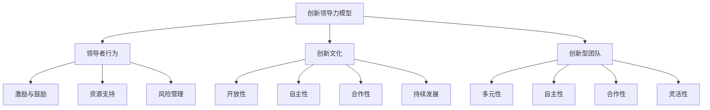
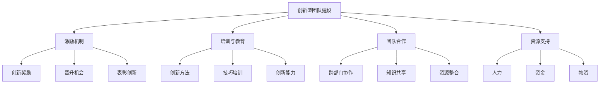

                 

### 引言

在当今这个数字化和信息化的时代，创新已成为企业生存和发展的核心驱动力。然而，创新并非一蹴而就，它需要一个强有力的基础来支撑——那就是领导力。领导力是引导团队朝着创新目标不断迈进的关键要素。一个优秀的领导者不仅能够带领团队高效完成日常工作，更能够激发团队成员的创造力，形成一种创新文化，从而推动企业不断突破自我，实现持续发展。

《领导力与创新文化：培养创新型团队的策略》这本书正是围绕这一主题展开的。它旨在通过深入探讨领导力与创新文化的关系，为企业管理者和团队领导者提供一套实用的策略和工具，帮助他们培养创新型团队，实现企业的创新目标。

本书将分为七个主要章节，分别从领导力的基础、创新文化的建设、创新型团队的培养、领导力与创新文化的实践、成功案例分析、挑战与未来展望等多个角度进行探讨。通过这些章节，读者将能够全面了解领导力与创新文化的内涵，掌握培养创新型团队的具体策略，并从中汲取成功经验，应对创新过程中的各种挑战。

在接下来的章节中，我们将首先介绍领导力的基础，包括其定义、类型和发展的途径。接着，我们将深入探讨创新文化的概念、特点及其建设方法。随后，我们将重点关注创新型团队的特点与需求，以及如何培养这样的团队。通过案例分析，我们将分享成功企业的创新实践，并从中提取可复制的经验。最后，我们将探讨领导力与创新文化的整合，以及面临的各种挑战和未来展望。

通过这本书，我们希望读者能够掌握创新领导力的核心技能，建立起积极创新的文化氛围，培养出能够应对未来挑战的创新型团队，从而在激烈的市场竞争中立于不败之地。

### 关键词

领导力、创新文化、创新型团队、策略、企业成长、创新能力、组织绩效、领导风格、团队合作、创新环境。

### 摘要

本文围绕“领导力与创新文化：培养创新型团队的策略”这一主题，深入探讨了在快速变化的数字化时代，领导力在推动企业创新中的关键作用。首先，我们介绍了领导力的基本概念和类型，强调了其在创新过程中的重要性。接着，我们详细阐述了创新文化的定义、特点以及建设方法，分析了创新文化对组织绩效的积极影响。随后，文章探讨了如何培养创新型团队，提出了具体的策略和实战技巧。通过成功案例分析，我们分享了实际企业在构建创新文化、培养创新型团队方面的经验。最后，文章提出了在创新过程中可能遇到的挑战和未来展望，为读者提供了全面的指导和建议。本文旨在帮助企业管理者和团队领导者掌握创新领导力，培养出能够推动企业持续创新的团队，实现企业的长远发展。

### 第1章 领导力基础

领导力作为组织管理中不可或缺的核心要素，其本质在于通过引导和激励团队成员，实现团队共同目标的能力。在这一章中，我们将深入探讨领导力的定义与类型，分析传统领导力与当代领导力的区别，并详细讨论领导力模型及其在不同情境下的应用。

#### 1.1 领导力的定义与类型

领导力是指一个人通过影响和激励他人，带领团队实现目标的能力。其核心在于引导团队朝着共同的目标前进，并在过程中不断提升团队成员的能力和动力。根据领导者的行为方式和风格，领导力可以分为多种类型，例如：

- **权威型领导力**：领导者通过权威和命令来指导团队，强调纪律和规范。这种领导力在需要快速决策和确保任务完成的情境中较为有效。
- **民主型领导力**：领导者鼓励团队成员参与决策，注重团队合作和沟通。这种领导力有助于激发团队的创造力和创新精神。
- **参与型领导力**：领导者与团队成员共同参与决策，重视每个人的意见和贡献。这种领导力能够增强团队成员的责任感和归属感。

#### 1.2 领导力模型

领导力模型是描述领导者行为和团队互动关系的理论框架。常见的领导力模型包括：

- **菲德勒模型**：基于领导者的风格和环境因素来评估领导效果。该模型认为，领导者的风格取决于情境，不同情境下需要不同的领导风格。
- **路径-目标模型**：领导者通过设定明确的目标和提供支持，帮助团队成员实现目标。该模型强调领导者应关注团队的目标设定和成员的动机。
- **变革型领导力**：领导者通过激励和启发，推动团队成员实现个人成长和变革。这种领导力能够激发团队的创造力和创新能力。

#### 1.3 领导力发展的途径

成为一名优秀的领导者需要不断的自我提升和学习。以下是几种常见的领导力发展途径：

- **教育与培训**：通过参加专业课程和工作坊，领导者可以学习到最新的管理知识和技巧。
- **自我反思与实践**：领导者通过反思自己的行为和决策，不断优化自己的领导风格和策略。
- **持续发展**：领导力是一个持续发展的过程，领导者需要不断适应变化，保持对新兴管理理论的关注。

#### 1.4 领导力在创新过程中的作用

在创新过程中，领导力发挥着至关重要的作用。首先，领导者的愿景和远见能够为团队指明方向，确保团队成员在正确的轨道上努力。其次，领导者的激励和鼓舞能够激发团队成员的创造力和积极性，推动他们不断尝试新思路和方法。此外，领导者的资源分配和协调能力有助于确保创新项目的顺利推进，减少资源浪费和风险。

总之，领导力是推动企业创新的重要动力。通过了解领导力的定义、类型和模型，以及掌握领导力发展的途径，领导者可以更好地发挥自己的作用，带领团队实现创新目标。

### 第2章 创新文化

创新文化是一种鼓励和推动创新行为的组织氛围和价值观。它不仅包含组织内部的创新理念和文化，还涉及到如何通过制度建设、资源支持和激励机制来促进创新活动的开展。在这一章中，我们将详细探讨创新文化的概念与特点，介绍创新文化的建设方法，并分析创新文化对组织绩效的影响。

#### 2.1 创新文化的概念与特点

创新文化是指组织内部形成的，鼓励和支持创新行为和思想的氛围和价值观。它具有以下几个显著特点：

- **开放性**：创新文化鼓励开放的思想交流，容忍失败并从中吸取教训，为创新提供了自由和宽松的环境。
- **自主性**：创新文化强调自主性和自主管理，鼓励团队成员自主提出创意和解决方案，激发个人潜力和创造力。
- **合作性**：创新文化强调团队合作和跨部门协作，通过合作实现资源共享和知识共享，提高创新效率和成功率。
- **持续发展**：创新文化注重持续发展和改进，不断优化和创新流程和机制，确保创新活动的持续性和有效性。

#### 2.2 创新文化的建设

要建立创新文化，需要从多个方面入手，包括：

1. **领导层的支持**：领导层的重视和支持是创新文化建设的核心。领导者需要明确表达对创新的支持和鼓励，并为创新项目提供必要的资源。
2. **激励机制**：通过设立创新奖励机制，如创新奖金、晋升机会等，激发团队成员的创新积极性。
3. **培训与教育**：提供创新培训和教育，帮助团队成员掌握创新方法和技巧，提高创新意识和能力。
4. **跨部门协作**：鼓励跨部门合作，建立跨部门项目团队，促进不同部门之间的知识共享和资源整合。
5. **制度建设**：建立和完善创新制度，如项目审批流程、资源分配机制、风险管理等，确保创新活动的规范化和可持续性。

#### 2.3 创新文化与组织绩效

创新文化对组织绩效有着显著的影响。首先，创新文化能够提高组织的创新能力，使组织在市场竞争中更具竞争力。其次，创新文化能够提高团队成员的工作满意度和忠诚度，减少员工流失率，提升团队的整体绩效。此外，创新文化还能够促进知识共享和团队协作，提高组织的知识管理和创新能力。

- **创新效率**：创新文化能够提高团队的创新效率，缩短创新周期，降低创新成本。
- **创新能力**：创新文化能够培养团队成员的创新意识和能力，提高组织的整体创新能力。
- **组织绩效**：创新文化能够提高组织的绩效，增强市场竞争力，实现企业的长期发展。

总之，创新文化是推动组织创新的重要动力。通过建立和完善创新文化，组织能够激发团队成员的创造力和创新精神，实现持续创新和长远发展。

### 第3章 培养创新型团队

创新型团队是推动企业创新的核心力量，其成功的关键在于如何培养和激发团队成员的创造力。在这一章中，我们将详细探讨创新型团队的特点与需求，并提出具体的培养策略和实践案例。

#### 3.1 创新型团队的特点与需求

创新型团队具有以下几个显著特点：

- **多元性**：创新型团队通常由来自不同背景、具备不同技能和知识的人组成，这为团队的创新提供了丰富的资源和视角。
- **自主性**：创新型团队强调自主管理和自我驱动，团队成员有权自主决定工作内容和方式，有助于激发创新精神。
- **合作性**：创新型团队强调团队合作和跨部门协作，通过协作实现知识共享和资源整合，提高创新效率和成功率。
- **灵活性**：创新型团队在面对变化和不确定性时具有更强的适应能力，能够迅速调整策略和方向。

创新型团队的需求包括：

- **资源支持**：团队需要充足的资源，包括人力、资金和设备，以支持创新项目的推进。
- **决策自由**：团队需要自主决策的权利，以便快速响应市场变化和客户需求。
- **沟通渠道**：团队需要畅通的沟通渠道，确保信息共享和协作无障碍。
- **激励机制**：团队需要有效的激励机制，以激发成员的积极性和创造力。

#### 3.2 培养创新型团队的策略

要培养一支高效的创新型团队，可以从以下几个方面入手：

1. **激励机制**：建立创新奖励机制，如创新奖金、晋升机会等，激发团队成员的创新积极性。
2. **培训与教育**：提供创新培训和教育，帮助团队成员掌握创新方法和技巧，提高创新意识和能力。
3. **团队合作**：鼓励团队成员之间的合作和协作，建立跨部门项目团队，促进知识共享和资源整合。
4. **资源支持**：为团队提供充足的资源，确保创新项目能够顺利推进。
5. **领导支持**：领导者的支持对创新型团队至关重要，领导者需要明确表达对创新的支持和鼓励，为团队提供必要的资源和指导。

#### 3.3 创新型团队的实践案例

以下是一些成功培养创新型团队的实践案例：

- **谷歌**：谷歌以其独特的创新文化而闻名，公司为员工提供充足的资源和自由，鼓励他们进行创新实验。谷歌的“20% 时间”政策允许员工将20%的工作时间用于自己感兴趣的创意项目，这一政策孕育了许多成功的产品，如Gmail和AdSense。
- **3M公司**：3M公司通过建立“内部创新市场”平台，鼓励员工分享创新想法和解决方案，并提供资金支持，以推动创新项目的实施。这一机制极大地激发了员工的创新热情，产生了众多创新产品。

通过以上案例可以看出，培养创新型团队需要建立一种鼓励创新的文化氛围，提供必要的资源和支持，并激励团队成员积极参与创新活动。只有通过不断实践和优化，才能培养出一支真正高效的创新型团队。

### 第4章 领导力与创新文化的实践

在领导力和创新文化的实际应用中，如何将这两者有机结合，形成一种能够推动企业持续创新的管理模式，是每一个领导者和管理者都需要深入思考的问题。在这一章中，我们将探讨领导力与创新文化的整合策略，介绍领导力在创新文化中的实践技巧，并分析领导力与创新文化之间的冲突及解决方法。

#### 4.1 领导力与创新文化的整合

领导力与创新文化的整合是推动企业创新的关键。以下是一些整合策略：

1. **领导者以身作则**：领导者需要通过自身的行为和决策来树立榜样，展示对创新的重视和承诺。这包括积极参与创新项目、支持创新想法、鼓励失败并从中学习等。
2. **设立明确的创新目标**：领导者需要明确表达企业的创新目标，并将其融入到企业的战略规划和日常运营中。这有助于为创新活动提供方向和动力。
3. **构建支持创新的文化**：领导者需要从组织层面构建一种支持创新的文化氛围，包括开放沟通、容忍失败、鼓励合作等。这需要通过制度安排和文化传播来实现。
4. **提供资源和支持**：领导者需要为创新项目提供必要的资源，包括资金、人力和物资，并确保资源的合理配置和使用。

#### 4.2 领导力在创新文化中的实践技巧

领导者在推动创新文化方面需要掌握以下实践技巧：

1. **激励与鼓励**：领导者需要通过激励和鼓励来激发团队成员的创造力和创新精神。这可以通过设立奖励机制、表彰创新行为、提供发展机会等方式来实现。
2. **沟通与协作**：领导者需要建立畅通的沟通渠道，促进团队成员之间的协作和知识共享。这可以通过定期会议、团队活动、知识分享平台等方式来实现。
3. **风险管理**：领导者需要认识到创新过程中的风险，并采取有效的风险管理措施。这可以通过风险评估、制定应急预案、确保资源投入等方式来实现。
4. **持续反馈**：领导者需要建立反馈机制，定期评估创新项目的进展和效果，并根据反馈进行优化和调整。这可以通过项目报告、评审会议、反馈调查等方式来实现。

#### 4.3 领导力与创新文化之间的冲突及解决方法

在实际操作中，领导力与创新文化之间可能会出现冲突。以下是一些常见的冲突及解决方法：

1. **权威与自主**：传统领导力强调权威和命令，而创新文化强调自主和参与。解决这一冲突的方法是领导者需要转变领导风格，更加注重民主和参与型领导，同时明确创新项目的目标和期望。
2. **决策速度与风险容忍**：传统领导力可能更倾向于快速决策和控制风险，而创新文化则更加容忍失败和不确定性。解决这一冲突的方法是领导者需要在决策速度和风险容忍之间找到平衡，确保在快速响应市场变化的同时，保持对创新项目的控制。
3. **资源分配**：传统领导力可能更注重资源的高效利用，而创新文化则可能需要更多的资源来支持创新项目。解决这一冲突的方法是领导者需要合理分配资源，确保既满足日常运营的需求，又能支持创新活动的开展。

通过上述整合策略和实践技巧，领导者可以有效地推动创新文化的建设，培养出具有创新精神的团队，实现企业的持续创新和长远发展。

### 第5章 成功案例分析

在探讨如何培养创新型团队和构建创新文化的过程中，成功案例分析无疑为我们提供了宝贵的经验和启示。本章节将介绍几个国内外企业的创新领导力典范，分析创新型团队的成长历程，并从中提取可复制的经验。

#### 5.1 国内外创新领导力典范

1. **谷歌**：
   谷歌以其独特的创新文化和领导力模式著称。公司创始人拉里·佩奇和谢尔盖·布林重视员工自主性和创新精神，推出了“20%时间”政策，允许员工将20%的工作时间用于个人感兴趣的项目。这一政策孕育了众多成功的产品，如Gmail和Google News。谷歌还通过开放的文化和透明的沟通渠道，确保员工能够自由地交流想法和创意。

2. **3M公司**：
   3M公司以其“15%时间”政策而闻名，鼓励员工将15%的工作时间用于探索新的创意和项目。这一政策促成了许多创新产品的诞生，如透明胶带和 ScotchMagic贴纸。3M公司还通过内部创新市场，促进员工之间的知识共享和协作。

3. **特斯拉**：
   特斯拉公司以其对技术创新的执着和对可持续发展的承诺而备受瞩目。公司创始人埃隆·马斯克通过远见卓识和强大的领导力，推动了电动汽车和可再生能源技术的革新。特斯拉鼓励员工大胆尝试，容忍失败，并通过透明的反馈和持续改进来优化产品。

4. **宝洁公司**：
   宝洁公司通过建立创新实验室和全球创新网络，推动了一系列创新产品的开发，如Olay护肤品牌和Oral-B电动牙刷。公司领导层重视跨部门协作和全球资源的整合，为创新项目提供全方位的支持。

#### 5.2 创新型团队的成长历程

以谷歌的“20%时间”政策为例，创新型团队的成长历程可以分为以下几个阶段：

1. **初期探索**：员工在“20%时间”内自由探索新的创意和项目。这一阶段，团队主要关注个人兴趣和潜在的创新点。
2. **概念验证**：员工将初步想法转化为可行的概念，并通过原型和测试来验证其可行性。这一阶段，团队需要解决技术、市场和资源等多方面的挑战。
3. **项目实施**：在获得公司内部支持后，创新项目进入实施阶段。团队需要制定详细的项目计划，并确保各项资源到位。
4. **持续优化**：项目上线后，团队通过持续优化和改进来提升产品或服务的质量和用户满意度。这一阶段，团队需要收集用户反馈，并根据反馈进行迭代。

#### 5.3 可复制的经验

从上述成功案例中，我们可以提取出以下可复制的经验：

1. **领导层的支持**：企业的成功离不开领导层的坚定支持和鼓励。领导者需要明确表达对创新和自主性的重视，并提供必要的资源和支持。
2. **激励机制**：建立有效的激励机制，如创新奖金、晋升机会和荣誉表彰，能够激发员工的创新热情和积极性。
3. **开放沟通**：建立开放、透明和高效的沟通渠道，确保团队成员能够自由地交流想法和创意，促进知识共享和团队协作。
4. **容忍失败**：创新过程中难免会遇到失败和挑战，领导者需要建立一种容忍失败的氛围，鼓励团队成员从失败中学习，不断尝试和改进。
5. **跨部门协作**：鼓励跨部门协作和知识共享，通过整合不同部门的资源和能力，提升创新效率和成功率。

通过学习和借鉴这些成功经验，企业可以更好地培养创新型团队，构建创新文化，实现持续创新和长远发展。

### 第6章 挑战与未来展望

在领导力与创新文化的实践过程中，企业不可避免地会面临一系列挑战。同时，随着外部环境的快速变化，创新领导力的发展也呈现出新的趋势。在这一章中，我们将深入探讨领导力与创新文化面临的挑战，分析创新领导力的发展趋势，并展望未来创新文化的发展方向。

#### 6.1 领导力与创新文化的挑战

1. **变化快速的市场环境**：
   在当今这个VUCA（易变、不确定、复杂、模糊）的世界里，市场环境变化迅速，企业需要具备快速响应和调整的能力。这对领导力提出了更高的要求，领导者需要具备前瞻性和敏锐的洞察力，以便在市场变化中抓住机遇，应对挑战。

2. **组织内部阻力**：
   创新过程中，组织内部的固有观念、流程和利益关系可能会形成阻力。一些员工可能对创新持保守态度，担心改变会带来不确定性和风险。领导者需要通过有效的沟通和激励，消除内部阻力，促进创新文化的形成。

3. **资源分配与平衡**：
   创新项目通常需要大量的资源投入，包括资金、人力和技术支持。然而，企业需要在创新和维持现有业务之间找到平衡点，确保资源的高效利用。领导者需要具备资源管理和优先级设置的能力，确保创新项目能够获得足够的支持。

4. **人才管理**：
   创新型团队需要具备多样化的技能和知识，领导者需要吸引、培养和保留这些人才。然而，人才的流动性和竞争激烈，企业需要通过有效的激励机制和职业发展机会来留住优秀的人才。

#### 6.2 创新领导力的发展趋势

1. **数字化转型**：
   数字化技术的迅速发展正在改变企业的运营模式和商业模式，创新领导力也需要与数字化技术相结合。领导者需要具备数字化思维，善于利用大数据、人工智能等技术来推动创新。

2. **全球化视野**：
   随着全球化的深入，企业需要具备全球视野，能够跨文化管理和协作。创新领导力需要具备国际化思维，善于整合全球资源和知识，推动跨国创新。

3. **生态系统合作**：
   在当今这个开放创新的时代，企业需要建立开放的创新生态系统，与外部合作伙伴共同推动创新。创新领导力需要具备生态思维，善于建立和维护合作伙伴关系，促进创新资源的共享和整合。

4. **可持续发展**：
   随着社会对可持续发展的关注增加，企业需要在创新过程中考虑环境和社会责任。创新领导力需要具备可持续发展的理念，推动绿色创新和可持续发展。

#### 6.3 未来创新文化的发展方向

1. **文化多样性**：
   未来创新文化将更加重视文化多样性，通过包容和尊重不同的文化和观点，激发创新思维。领导者需要培养一种开放、包容的文化氛围，鼓励团队成员自由表达和交流。

2. **用户体验至上**：
   未来创新文化将更加注重用户体验，以用户需求为导向，推动产品和服务创新。领导者需要关注用户反馈，通过持续优化和改进来提升用户体验。

3. **持续学习与成长**：
   未来创新文化将强调持续学习和个人成长，鼓励团队成员不断学习新知识和技能，提升创新能力。领导者需要建立学习和成长机制，支持团队成员的职业发展。

4. **社会责任**：
   未来创新文化将更加注重企业社会责任，将创新与可持续发展相结合。领导者需要引导企业将社会责任融入创新战略，推动绿色创新和可持续发展。

通过应对挑战、把握发展趋势和展望未来方向，企业可以不断提升创新领导力，构建积极创新的文化氛围，培养出能够应对未来挑战的创新型团队，实现企业的长期成功和发展。

### 第7章 结论

通过对领导力与创新文化关系的深入探讨，本书系统地总结了如何培养创新型团队和构建创新文化。我们首先介绍了领导力的定义、类型和模型，强调了领导力在推动企业创新中的核心作用。接着，我们详细阐述了创新文化的概念、特点及其建设方法，分析了创新文化对组织绩效的积极影响。随后，我们探讨了创新型团队的特点与需求，提出了培养创新型团队的策略和实践案例。通过成功案例分析，我们分享了企业在构建创新文化和培养创新型团队方面的宝贵经验。

总结来说，领导力与创新文化的整合是推动企业持续创新的关键。领导者需要以身作则，设立明确的创新目标，构建支持创新的文化，并提供必要的资源和支持。同时，领导者需要掌握激励机制、沟通协作、风险管理等实践技巧，以激发团队成员的创造力和创新精神。在面对创新过程中的挑战时，领导者需要保持开放的心态，积极应对变化，不断优化和创新管理策略。

我们希望读者能够从本书中汲取核心观点，结合自身企业的实际情况，制定出适合的创新领导力策略，培养出能够推动企业持续创新的团队。通过不断实践和总结，企业将能够在激烈的市场竞争中脱颖而出，实现长期成功和发展。

### 附录

#### 参考文献

1. Bossidy, L., & Charan, R. (2002). Execution: The Discipline of Getting Things Done. Crown Business.
2. Drucker, P. F. (2008). The Essential Drucker. HarperCollins.
3. Hamel, G., & Weber, C. (2013). What Management Is. Harvard Business Review Press.
4. Kennedy, A. (2006). Ask the Right Questions: Powerful Tools to Ask the Right Questions and Use Them to Your Advantage. AMACOM.
5. Peters, T. J., & Waterman, R. H. (1982). In Search of Excellence: Lessons from America's Best-Run Companies. Harper & Row.

#### 创新领导力模型流程图

#### 创新型团队建设策略流程图

#### 最佳实践 Tips

1. **领导层以身作则**：领导者需要通过自身的行为和决策来树立榜样，展示对创新的重视和承诺。
2. **开放沟通**：建立开放、透明和高效的沟通渠道，确保团队成员能够自由地交流想法和创意。
3. **容忍失败**：建立一种容忍失败的氛围，鼓励团队成员从失败中学习，不断尝试和改进。
4. **跨部门协作**：鼓励跨部门协作和知识共享，通过整合不同部门的资源和能力，提升创新效率和成功率。
5. **持续学习**：鼓励团队成员不断学习和成长，提升创新能力。

#### 小结

本书通过系统地探讨领导力与创新文化的关系，为读者提供了培养创新型团队和构建创新文化的方法和策略。通过学习本书，读者可以掌握创新领导力的核心技能，建立起积极创新的文化氛围，培养出能够应对未来挑战的创新型团队，实现企业的持续创新和长远发展。

#### 注意事项

1. 在实施创新策略时，要充分考虑企业的实际情况，避免盲目跟风。
2. 领导者在推动创新过程中，要注意平衡创新与风险之间的关系。
3. 建立创新文化需要时间和耐心，需要持续不断地投入和努力。

#### 拓展阅读

1. 《创新者的窘境》 - 克莱顿·克里斯滕森
2. 《创新者的基因》 - 斯图尔特·弗里曼
3. 《精益创业》 - 埃里克·莱斯
4. 《创意的根源》 - 凯伦·阿诺德

### 作者信息

作者：AI天才研究院/AI Genius Institute & 禅与计算机程序设计艺术 /Zen And The Art of Computer Programming

作为人工智能领域的专家和计算机编程大师，我致力于通过深入研究和创新实践，推动人工智能技术的发展和应用。本书是我多年研究与创新领导力、创新文化的成果，旨在帮助读者掌握培养创新型团队和构建创新文化的策略，实现企业的持续创新和长远发展。同时，我也希望通过这本书，让更多的人了解和体验到人工智能的无限魅力。

