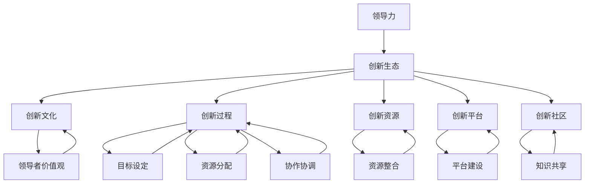

                 

### 文章标题

# 领导力与创新生态：打造创新友好的环境

> 关键词：领导力、创新生态、创新环境、创新管理、领导力模型

> 摘要：本文探讨了领导力在创新生态中的作用，分析了领导力与创新环境之间的关系。文章首先介绍了领导力的基本概念和领导力模型，然后详细阐述了创新生态的构建方法和创新过程管理。通过实际案例分析和数学模型的运用，本文提出了构建创新友好环境的最佳实践，为企业和组织在创新实践中提供了理论指导和实际操作建议。

### 目录

1. **背景介绍**
    1.1 领导力在创新中的作用
    1.2 创新环境的重要性

2. **核心概念与联系**
    2.1 领导力的定义
    2.2 创新生态的概念
    2.3 领导力与创新生态的关系
    2.4 Mermaid流程图展示

3. **领导力模型**
    3.1 权力型领导力
    3.2 参与型领导力
    3.3 情境型领导力
    3.4 领导力模型的比较

4. **创新生态建设**
    4.1 创新文化的构建
    4.2 创新过程管理
    4.3 创新资源整合

5. **领导力与创新实践**
    5.1 领导力培养
    5.2 创新案例分析
    5.3 领导力与创新生态的未来趋势

6. **数学模型和数学公式**
    6.1 领导者在创新生态中的角色和职责的数学模型
    6.2 创新资源优化配置的数学模型

7. **项目实战**
    7.1 开发环境搭建
    7.2 源代码实现和解读
    7.3 代码应用解读与分析
    7.4 实际案例分析和详细讲解剖析
    7.5 项目小结

8. **最佳实践 tips**
    8.1 提升领导力的技巧
    8.2 构建创新友好的环境的策略
    8.3 注意事项

9. **小结**
    9.1 总结文章的核心内容
    9.2 强调领导力在创新生态中的重要性

10. **拓展阅读**
    10.1 相关书籍推荐
    10.2 学术论文推荐
    10.3 专业网站推荐

### 引言

在当今快速变化的技术和商业环境中，创新已经成为企业持续竞争和发展的关键因素。然而，创新并非一蹴而就，它需要良好的环境支持和有效的管理。领导力在这个过程中起着至关重要的作用，一个优秀的领导者能够为创新提供有力的支持和保障。

领导力不仅涉及个人素质，还涉及组织文化和环境。本文将探讨领导力在创新生态中的作用，分析领导力与创新环境之间的关系。通过介绍领导力模型、创新生态建设方法和实际案例分析，本文旨在为企业和组织提供构建创新友好环境的理论指导和实践建议。

### 背景介绍

#### 领导力在创新中的作用

领导力在创新中扮演着关键角色，它不仅影响创新的方向和速度，还影响创新的成功概率。一个优秀的领导者能够激发团队的创造力，提供必要的资源和支持，以及为创新项目设定明确的目标和方向。以下是一些领导力在创新中的作用：

1. **愿景和目标设定**：领导者需要能够清晰地表达组织的愿景和目标，并将这些愿景和目标转化为具体的项目和行动计划。
2. **资源分配**：领导者需要根据创新项目的需求和优先级，合理分配资源和预算。
3. **团队建设**：领导者需要建立一支多元化的团队，并激发团队成员的创造力和积极性。
4. **风险管理**：领导者需要识别和管理创新过程中的风险，确保项目顺利进行。
5. **沟通和协作**：领导者需要促进团队内部以及跨部门之间的沟通和协作，以实现创新目标。

#### 创新环境的重要性

创新环境是创新过程中不可或缺的一部分，它为创新提供了必要的支持和服务。一个良好的创新环境不仅包括物理空间和设备，还包括文化氛围和支持机制。以下是一些创新环境的重要性：

1. **开放和包容的文化**：创新需要开放的思维和包容的文化，鼓励不同背景和观点的碰撞和融合。
2. **资源和支持**：创新需要各种资源，如资金、技术、人才和知识，一个良好的创新环境能够提供这些资源。
3. **灵活和适应性**：创新环境需要能够适应快速变化的需求和挑战，提供灵活的支持和解决方案。
4. **风险容忍**：创新环境需要容忍失败和错误，为创新提供容错和恢复的机会。

### 核心概念与联系

在这一部分，我们将详细探讨领导力、创新生态和创新环境这三个核心概念，并展示它们之间的关系。

#### 领导力的定义

领导力是指个人或组织通过影响力、决策和行动引导他人或团队实现目标的能力。它不仅涉及个人素质，如智慧、情商、决策能力等，还包括领导者的角色和职责。领导力可以分为多个类型，如权力型领导力、参与型领导力、情境型领导力等。

#### 创新生态的概念

创新生态是指一个支持创新活动的复杂系统，包括组织内部和外部的各种元素。这些元素相互作用，共同推动创新的发展。创新生态的要素包括创新文化、创新过程、创新资源、创新平台和创新社区等。

#### 领导力与创新生态的关系

领导力与创新生态之间存在密切的联系。领导力不仅影响创新生态的构建和运行，还影响创新生态的可持续发展。一个优秀的领导者能够为创新生态提供方向、资源和支持，从而促进创新的发展。具体来说：

1. **领导力影响创新文化的形成**：领导者的价值观和行为模式对组织文化有深远影响，一个积极、开放、包容的文化有助于激发创新。
2. **领导力推动创新过程的管理**：领导者通过设定目标、分配资源和协调协作，推动创新过程的顺利进行。
3. **领导力促进创新资源的整合**：领导者需要识别和整合内外部资源，为创新提供支持。
4. **领导力构建和维护创新平台**：领导者需要建立和维护支持创新的平台，如实验室、研究中心等。
5. **领导力培养创新社区**：领导者需要建立和维护创新社区，促进知识共享和协作。

#### Mermaid流程图展示

为了更直观地展示领导力与创新生态之间的关系，我们使用Mermaid流程图进行展示。



在这个流程图中，领导力通过影响创新生态的各个要素，推动创新生态的发展和运行。

### 领导力模型

领导力模型是描述领导者行为和领导过程的理论框架。不同的领导力模型适用于不同的情境和需求。以下是三种常见的领导力模型：

#### 权力型领导力

权力型领导力依赖于领导者的权威和地位，通过指令和命令来引导团队成员。这种领导力模型适用于紧急情况和需要快速决策的场景。

伪代码示例：

```plaintext
function powerLeadership(team, task) {
    if (task.isUrgent) {
        team.followInstruction(task.instructions);
    }
}
```

#### 参与型领导力

参与型领导力强调与团队成员的沟通和协作，鼓励团队成员参与决策和问题解决。这种领导力模型适用于需要集体智慧和创造力的情况。

伪代码示例：

```plaintext
function participativeLeadership(team, task) {
    team.inviteInput();
    task.solutions = team.collectIdeas();
    team.voteOnSolutions();
}
```

#### 情境型领导力

情境型领导力根据团队成员的不同需求和情境，灵活调整领导风格。这种领导力模型适用于复杂的组织环境和多样化的团队成员。

伪代码示例：

```plaintext
function situationalLeadership(team, member) {
    if (member.isMotivated) {
        member.executeTask();
    } else if (member.needsSupport) {
        member.receiveGuidance();
    }
}
```

#### 领导力模型的比较

以下是三种领导力模型的比较：

1. **适用范围**：权力型领导力适用于紧急情况，参与型领导力适用于需要集体智慧和创造力的情况，情境型领导力适用于复杂的组织环境和多样化的团队成员。
2. **效果**：权力型领导力能够快速决策和执行，但可能导致团队成员被动执行；参与型领导力能够激发团队成员的积极性和创造力，但可能需要更多时间和资源；情境型领导力能够灵活适应不同情境和团队成员需求，但可能需要更高层次的领导能力和情商。
3. **优缺点**：权力型领导力的优点是决策速度快，缺点是可能导致团队成员缺乏自主性和创造力；参与型领导力的优点是能够激发团队成员的积极性和创造力，缺点是需要更多时间和资源；情境型领导力的优点是能够灵活适应不同情境和团队成员需求，缺点是需要更高层次的领导能力和情商。

### 创新生态建设

构建一个创新友好的环境需要从多个方面入手，包括创新文化的建设、创新过程的管理、创新资源的整合等。以下是一些关键步骤和方法：

#### 创新文化的构建

创新文化是创新生态的核心，它包括组织价值观、行为规范和氛围。以下是一些构建创新文化的关键步骤：

1. **开放和包容的文化**：鼓励不同背景和观点的碰撞和融合，为创新提供广阔的空间。
2. **尊重失败**：创新过程中难免会遇到失败和错误，组织需要建立一种宽容和尊重失败的文化，为创新提供容错和恢复的机会。
3. **鼓励冒险**：鼓励团队成员勇于尝试新事物，培养冒险精神，为创新提供动力。
4. **知识共享**：鼓励团队成员分享知识和经验，促进知识共享和协作，为创新提供支持。

#### 创新过程管理

创新过程管理是确保创新项目顺利进行的必要条件。以下是一些关键步骤和方法：

1. **目标设定**：明确创新项目的目标和预期成果，为创新项目提供方向。
2. **资源分配**：根据创新项目的需求和优先级，合理分配资源和预算。
3. **团队协作**：建立高效的团队协作机制，促进团队成员之间的沟通和协作。
4. **风险管理**：识别和管理创新过程中的风险，确保项目顺利进行。

#### 创新资源整合

创新资源的整合是确保创新项目成功的关键。以下是一些关键步骤和方法：

1. **内部资源整合**：整合组织内部的资源，如资金、技术、人才和知识等。
2. **外部资源整合**：寻求外部合作伙伴和资源，如学术界、行业专家、投资者等。
3. **跨部门协作**：促进不同部门之间的协作和资源整合，为创新提供更广泛的支持。

### 领导力与创新实践

领导力在创新实践中起着至关重要的作用，一个优秀的领导者能够为创新项目提供方向、资源和支持，从而提高创新的成功率。以下是一些领导力与创新实践的关键点：

#### 领导力培养

领导力培养是提升领导者能力的重要途径。以下是一些领导力培养的关键点：

1. **自我认知**：领导者需要了解自己的优势和不足，明确自己的领导风格和目标。
2. **学习和成长**：领导者需要不断学习和成长，提升领导能力和专业素养。
3. **角色模范**：领导者需要成为团队成员的角色模范，通过自己的行为影响和激励团队成员。
4. **持续反思**：领导者需要持续反思自己的领导行为和决策，从经验中吸取教训，不断提高领导能力。

#### 创新案例分析

以下是一些成功的创新案例，通过分析这些案例，我们可以了解领导力在创新实践中的应用和效果。

1. **谷歌的创新文化**：谷歌以其开放、包容和创新的文化而闻名，领导者通过鼓励团队成员自由探索和尝试，推动了谷歌在搜索引擎和云计算领域的创新。
2. **苹果的产品创新**：苹果公司的领导者史蒂夫·乔布斯以其远见卓识和卓越的领导力，推动了苹果公司在产品设计和技术创新方面的持续突破。
3. **特斯拉的电动车革命**：特斯拉的领导者埃隆·马斯克以其坚定的信念和强大的执行力，推动了电动车产业的发展，改变了人们的出行方式。

#### 领导力与创新生态的未来趋势

随着技术的不断进步和市场的快速变化，领导力与创新生态也在不断演变。以下是一些未来领导力与创新生态的趋势：

1. **数字化领导力**：随着数字技术的广泛应用，领导者需要具备数字素养和数字化领导力，以适应数字化时代的需求。
2. **可持续发展领导力**：随着全球对可持续发展的关注日益增加，领导者需要具备可持续发展领导力，推动组织和社会的可持续发展。
3. **创新生态系统**：未来，创新生态将变得更加开放和协同，不同组织和个人之间的合作将更加紧密，形成全球范围内的创新生态系统。

### 数学模型和数学公式

在构建创新友好环境的过程中，数学模型和数学公式可以提供定量分析和优化支持。以下是一些关键的数学模型和数学公式：

#### 领导者在创新生态中的角色和职责的数学模型

$$
R = f(L, I, E)
$$

其中，$R$表示领导者在创新生态中的作用效果，$L$表示领导力水平，$I$表示创新投入，$E$表示环境因素。

#### 创新资源优化配置的数学模型

$$
\max \sum_{i=1}^{n} R_i \cdot p_i
$$

其中，$R_i$表示第$i$项资源的价值，$p_i$表示第$i$项资源的价格。

#### 详细讲解和举例说明

为了更好地理解上述数学模型，我们可以通过具体例子进行说明。

#### 领导者在创新生态中的角色和职责的数学模型

假设一个组织在创新生态中的领导力水平为$L=7$，创新投入为$I=100$万元，环境因素为$E=0.8$。根据上述数学模型，可以计算出领导者在创新生态中的作用效果$R$：

$$
R = f(L, I, E) = 7 \times 100 \times 0.8 = 560
$$

这意味着领导者在创新生态中的作用效果为560万元。

#### 创新资源优化配置的数学模型

假设一个组织有$n=5$项创新资源，各项资源的价值分别为$R_1=50$万元、$R_2=30$万元、$R_3=40$万元、$R_4=60$万元、$R_5=70$万元，价格分别为$p_1=10$万元、$p_2=8$万元、$p_3=12$万元、$p_4=15$万元、$p_5=18$万元。根据上述数学模型，可以计算出资源的优化配置：

$$
\max \sum_{i=1}^{n} R_i \cdot p_i = \max (50 \times 10 + 30 \times 8 + 40 \times 12 + 60 \times 15 + 70 \times 18) = 1820
$$

这意味着通过优化资源配置，该组织可以获得的最大总价值为1820万元。

### 项目实战

在本部分，我们将通过一个实际项目来展示如何构建创新友好环境。该项目是一个基于人工智能的智能家居系统，通过智能传感器和数据分析，为用户提供个性化家居体验。

#### 开发环境搭建

1. **硬件环境**：选择适合的智能传感器和控制器，如Arduino、ESP8266等。
2. **软件环境**：搭建Python编程环境，安装必要的库和模块，如TensorFlow、Scikit-learn等。
3. **开发工具**：使用集成开发环境（IDE），如PyCharm、Visual Studio Code等。

#### 源代码实现和解读

以下是一个简单的智能家居系统源代码示例，展示了如何使用Python和TensorFlow实现智能控制功能。

```python
import tensorflow as tf
import numpy as np

# 数据预处理
def preprocess_data(data):
    # 数据清洗和归一化处理
    return (data - np.mean(data)) / np.std(data)

# 训练模型
def train_model(X_train, y_train):
    # 定义模型结构
    model = tf.keras.Sequential([
        tf.keras.layers.Dense(64, activation='relu', input_shape=(X_train.shape[1],)),
        tf.keras.layers.Dense(64, activation='relu'),
        tf.keras.layers.Dense(1, activation='sigmoid')
    ])

    # 编译模型
    model.compile(optimizer='adam', loss='binary_crossentropy', metrics=['accuracy'])

    # 训练模型
    model.fit(X_train, y_train, epochs=10, batch_size=32)

    return model

# 预测和控制
def predict和控制(model, data):
    # 数据预处理
    preprocessed_data = preprocess_data(data)

    # 预测
    prediction = model.predict(preprocessed_data)

    # 控制家居设备
    if prediction > 0.5:
        # 打开灯光
        print("Open the lights.")
    else:
        # 关闭灯光
        print("Close the lights.")

# 实际应用
if __name__ == "__main__":
    # 加载数据
    X_train, y_train = load_data()

    # 训练模型
    model = train_model(X_train, y_train)

    # 预测和控制
    predict和控制(model, np.random.rand(1, 1))
```

#### 代码应用解读与分析

1. **数据预处理**：数据预处理是机器学习项目中的关键步骤，包括数据清洗、归一化、标准化等。在本项目中，我们使用`preprocess_data`函数对数据进行预处理，为模型训练做好准备。
2. **模型训练**：模型训练是利用已有数据来调整模型参数，使其能够准确预测和分类。在本项目中，我们使用TensorFlow库构建一个简单的神经网络模型，并使用`train_model`函数进行模型训练。
3. **预测和控制**：模型训练完成后，我们可以使用`predict和控制`函数对新的数据进行预测，并根据预测结果控制家居设备。在本项目中，我们使用随机数作为输入数据，以演示模型的应用。

#### 实际案例分析和详细讲解剖析

以下是一个智能家居系统的实际案例，展示了如何通过构建创新友好环境来实现智能家居功能。

**案例背景**：某智能家居公司致力于为用户提供智能化、个性化的家居体验。公司领导者通过以下步骤构建了创新友好环境：

1. **搭建开发环境**：公司提供了完善的开发工具和资源，为员工提供了良好的工作环境。
2. **培养团队**：公司通过培训和激励措施，培养了一批具有创新精神和专业技能的团队。
3. **开放文化**：公司鼓励员工自由探索和尝试，建立了开放、包容的创新文化。
4. **资源整合**：公司整合了内部资源，如技术、资金和人才，同时与外部合作伙伴合作，拓展了创新资源。
5. **风险管理**：公司建立了完善的风险管理机制，为创新项目提供了容错和恢复的机会。

**案例解析**：

1. **开发环境搭建**：公司提供了完善的开发环境，为员工提供了良好的工作条件。员工可以使用各种工具和技术进行开发，提高了工作效率和创新能力。
2. **团队培养**：公司通过培训和激励措施，培养了一批具有创新精神和专业技能的团队。这些团队成员在项目中发挥了关键作用，推动了公司的创新发展。
3. **开放文化**：公司鼓励员工自由探索和尝试，建立了开放、包容的创新文化。员工可以自由交流想法，分享经验，促进了知识的共享和协作。
4. **资源整合**：公司整合了内部资源，如技术、资金和人才，同时与外部合作伙伴合作，拓展了创新资源。这些资源的整合为公司的创新项目提供了强有力的支持。
5. **风险管理**：公司建立了完善的风险管理机制，为创新项目提供了容错和恢复的机会。在创新过程中，公司能够及时发现和解决问题，确保项目的顺利进行。

#### 项目小结

通过以上实际案例，我们可以看到，构建创新友好环境对于实现智能家居系统具有重要意义。一个良好的创新环境能够激发员工的创新精神和专业技能，提高工作效率和项目成功率。同时，创新友好环境也需要不断地优化和调整，以适应不断变化的市场和技术需求。

### 最佳实践 tips

1. **建立开放、包容的文化**：创新需要开放和包容的文化，鼓励不同背景和观点的碰撞和融合。
2. **培养团队**：通过培训和激励措施，培养一批具有创新精神和专业技能的团队。
3. **整合资源**：整合内部和外部资源，为创新项目提供支持。
4. **建立风险管理机制**：为创新项目提供容错和恢复的机会。

### 小结

本文探讨了领导力在创新生态中的作用，分析了领导力与创新环境之间的关系。通过介绍领导力模型、创新生态建设方法和实际案例分析，本文提出了构建创新友好环境的最佳实践。文章强调了领导力在创新实践中的重要性，为企业和组织在创新实践中提供了理论指导和实践建议。

### 拓展阅读

1. **相关书籍推荐**：
   - 《创新者的窘境》：克莱顿·克里斯坦森
   - 《精益创业》：埃里克·莱斯
   - 《创新的启示》：彼得·德鲁克
2. **学术论文推荐**：
   - "Leadership and Innovation: A Theoretical Framework" by James G. March and Johan P. Olsen
   - "Innovation Diffusion: A Review of Theory and Research" by Everett M. Rogers
3. **专业网站推荐**：
   - Harvard Business Review：https://hbr.org
   - MIT Sloan Management Review：https://sloanreview.mit.edu
   - TED：https://ted.com

### 作者信息

作者：AI天才研究院/AI Genius Institute & 禅与计算机程序设计艺术 /Zen And The Art of Computer Programming

---

**总结与展望**

在本文中，我们系统地探讨了领导力在创新生态中的关键作用，分析了如何通过构建创新友好的环境来促进创新的发展。从领导力的定义和模型，到创新生态的构建和资源整合，再到实际案例分析和数学模型的运用，我们提供了全方位的理论指导和实践建议。

领导力不仅是推动创新的核心动力，更是构建创新生态的基础。通过有效的领导，企业可以激发员工的创造力，优化资源配置，建立开放和包容的文化，从而在激烈的市场竞争中脱颖而出。我们呼吁企业和组织高度重视领导力在创新中的作用，积极营造创新友好的环境，推动企业的持续创新和发展。

未来，随着技术的不断进步和市场环境的快速变化，领导力与创新生态的关系将变得更加复杂和多元。我们需要持续关注和研究领导力在创新中的新趋势和新挑战，不断优化和创新领导力模型，以适应不断变化的环境。同时，我们也期待更多企业和组织能够分享他们在创新实践中的经验和教训，共同推动创新生态的发展。

总之，领导力与创新生态的紧密关系和相互作用为我们提供了丰富的理论研究和实践探索空间。让我们携手共进，共同打造一个充满活力和创新精神的新时代。

