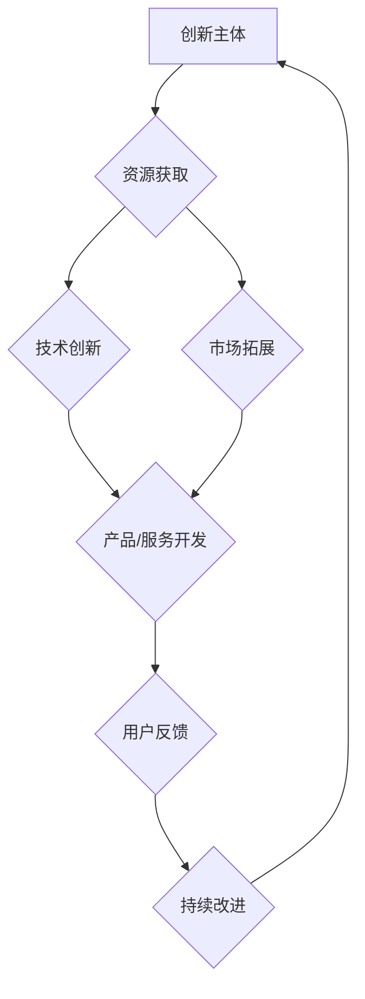

                 

### 文章标题

# 《领导力与创新生态：营造创新友好的团队环境》

### 关键词

- 领导力
- 创新生态
- 团队环境
- 创新能力
- 领导者角色
- 创新思维
- 项目管理

### 摘要

本文探讨了领导力与创新生态之间的紧密联系，以及如何营造一个创新友好的团队环境。文章首先介绍了创新的重要性及其在领导力中的角色，随后详细阐述了领导力的基本概念和理论，并分析了领导力在创新环境中的作用。接着，文章探讨了创新生态系统的概念、要素及建立方法，以及团队环境对创新能力的影响和提升策略。最后，文章深入分析了领导力与团队创新能力培养的关系，并结合实际案例，为创新项目的实践与管理提供了实用的方法。通过本文，读者将了解到如何通过领导力提升团队创新能力，从而构建一个创新友好的团队环境。

## 第1章 引言

### 1.1 书籍主题介绍

创新，作为推动社会进步和经济发展的重要动力，其重要性不言而喻。创新不仅仅体现在技术领域，更贯穿于各个行业和领域。一个企业或组织要想在竞争激烈的市场中立于不败之地，必须具备强大的创新能力。而领导力，作为企业或组织发展的重要推动力，其在创新过程中的作用至关重要。

领导力与创新的关系可以概括为以下几个方面：

1. **领导者的角色与责任**：领导者作为团队的核心人物，其职责不仅仅是确保团队的日常运营，更重要的是激发团队的创新能力，推动企业或组织的持续创新。

2. **创新文化的塑造**：领导力在创新文化的塑造中起着关键作用。一个具备创新文化的团队，能够更好地激发团队成员的创新潜力，从而实现企业的创新目标。

3. **创新环境的营造**：领导力直接影响团队的工作环境和氛围。一个创新友好的团队环境，能够为团队成员提供更多的创新空间和资源，从而提升团队的整体创新能力。

本文旨在探讨领导力与创新生态的关系，以及如何通过领导力提升团队创新能力，构建一个创新友好的团队环境。通过分析领导力的基本概念、理论及其在创新环境中的作用，以及创新生态系统的构建方法和团队环境对创新能力的影响，本文希望能够为领导者和管理者提供有益的参考和指导。

### 1.2 目标读者群体

本文的目标读者群体主要包括以下几个方面：

1. **领导者与团队领导者**：本文针对领导者和管理者，旨在帮助他们更好地理解领导力与创新之间的关系，掌握提升团队创新能力的方法和策略。

2. **创新倡导者与研究人员**：对于致力于推动创新的研究人员和倡导者，本文提供了关于创新生态系统构建和团队环境优化的实用建议，以帮助他们在实际工作中更好地发挥创新能力。

3. **想要提升团队创新能力的专业人士**：无论是企业内部的员工还是外部咨询顾问，本文提供了关于如何通过领导力提升团队创新能力的一系列实用方法和案例分析，以帮助他们实现团队创新能力的提升。

总之，本文的目标是帮助各类读者深入了解领导力与创新生态的关系，掌握提升团队创新能力的方法和策略，从而构建一个创新友好的团队环境。

## 第2章 领导力概述

### 2.1 领导力基本概念

领导力是一个广泛而多维的概念，其定义和解释在不同的学科和领域中有着不同的理解。然而，总体来说，领导力可以被看作是一种影响力，通过影响和激励他人来实现共同的目标。具体来说，领导力包括以下几个方面：

1. **影响力**：领导者通过自身的行为、决策和理念来影响他人，使团队成员愿意追随和信任他们。这种影响力不仅体现在日常的管理和决策中，更体现在对团队成员心理和情感上的影响。

2. **目标导向**：领导力强调目标的重要性。一个成功的领导者能够明确团队的目标，并通过制定和实现这些目标来推动团队的发展和进步。

3. **激励**：领导者需要具备激励团队成员的能力，使他们在面对挑战和困难时能够保持积极和乐观的态度。这种激励不仅包括物质激励，还包括精神激励和情感激励。

4. **沟通与协作**：领导力强调有效的沟通和协作。一个成功的领导者需要能够与团队成员建立良好的沟通渠道，理解他们的需求和想法，并促进团队成员之间的协作和合作。

与管理的区别：

领导力与管理是两个紧密相关但又有所区别的概念。管理通常指的是对资源的分配、计划、组织、指导和控制，以确保组织目标的实现。而领导力则更侧重于影响和激励团队成员，以实现组织的目标。

1. **目标**：管理强调实现既定的目标，而领导力则更关注设定和实现目标的过程和方法。

2. **方式**：管理通常通过规章制度和流程来确保目标的实现，而领导力则更多依赖于个人魅力、影响力以及团队的自主性和创新性。

3. **范围**：管理通常关注组织和团队内部的运作，而领导力则更广泛，不仅关注内部，还关注外部环境的变化和影响。

### 2.2 领导力理论

领导力的发展经历了多个阶段，每个阶段都有其独特的理论和观点。以下是几种主要的领导力理论：

1. **特质理论**：特质理论认为，领导者具备一系列独特的特质和品质，这些特质是领导者成功的关键。这些特质包括智力、自信、决心、道德品质等。

   优点：能够明确领导者的基本素质，有助于选拔和培养潜在的领导者。
   
   缺点：过于强调个体特质，忽略了环境和其他因素的影响。

2. **行为理论**：行为理论关注领导者的行为和风格，认为领导者的行为对团队绩效有重要影响。行为理论将领导者分为任务导向型和关系导向型两种。

   优点：强调了领导者行为的重要性，为领导者提供了具体的行动指南。
   
   缺点：过于简化领导者的行为，忽略了个体差异和情境因素的影响。

3. **情境理论**：情境理论认为，领导者的有效行为取决于具体的环境和情境。领导者的行为应该根据不同的情境进行调整。

   优点：强调了领导者的灵活性和适应性，为领导者提供了更全面的行动指南。
   
   缺点：过于强调环境因素，忽略了领导者自身的特质和能力。

4. **变革型领导理论**：变革型领导理论认为，领导者通过激励和启发团队成员，推动团队实现变革和发展。变革型领导者通常具备较高的道德品质和领导能力。

   优点：强调了领导者的积极影响和激励作用，为领导者提供了新的视角和理念。
   
   缺点：过于理想化，忽略了领导者的实际困境和挑战。

5. **服务型领导理论**：服务型领导理论认为，领导者通过为团队成员提供服务和支持，来推动团队的发展和进步。服务型领导者通常具备较强的沟通能力和同理心。

   优点：强调了领导者与团队成员之间的互动和合作，为领导者提供了新的视角和理念。
   
   缺点：过于强调服务，可能忽略领导者的决策和指挥作用。

### 2.3 领导力在创新环境中的作用

领导力在创新环境中扮演着至关重要的角色。一个成功的领导者能够激发团队的创新能力，推动组织实现创新目标。以下是领导力在创新环境中的几个关键作用：

1. **塑造创新文化**：领导力直接影响团队的文化氛围。一个创新文化强的团队，通常具备开放、包容、鼓励创新的特点。领导者可以通过自身的言行和行为，塑造和强化这种创新文化。

2. **激励团队成员**：领导者需要具备激励团队成员的能力，使他们在面对创新挑战时能够保持积极和乐观的态度。这种激励不仅包括物质激励，还包括精神激励和情感激励。

3. **提供资源和支持**：创新通常需要大量的资源和支持。领导者需要确保团队有足够的资源来开展创新工作，并为他们提供必要的支持和帮助。

4. **制定和实现创新目标**：领导者需要明确团队的创新目标，并制定相应的策略和计划，以确保创新目标的实现。

5. **处理创新过程中的挑战**：创新过程中往往面临各种挑战和困难。领导者需要具备解决问题的能力，帮助团队克服这些挑战，确保创新的顺利进行。

6. **促进团队合作和协作**：创新通常需要跨部门的协作和合作。领导者需要协调不同部门和团队成员之间的合作，确保创新项目的顺利进行。

总之，领导力在创新环境中的作用至关重要。一个成功的领导者不仅能够激发团队的创新能力，还能推动团队实现创新目标，从而为组织的持续发展提供强有力的支持。

### 2.4 创新领导者必备的能力

要成为一位成功的创新领导者，领导者需要具备一系列关键的能力和素质。以下是创新领导者必备的几个能力：

1. **创新思维**：创新领导者需要具备独特的创新思维，能够从不同的角度和维度看待问题，发现新的解决方案。创新思维不仅包括创造力，还包括逻辑思维、系统思维和批判性思维。

2. **风险承受能力**：创新往往伴随着风险。创新领导者需要具备承担风险的能力，敢于在不确定的环境中做出决策，并接受失败的可能。

3. **沟通与协作能力**：创新领导者需要具备出色的沟通和协作能力，能够与团队成员建立良好的沟通渠道，理解他们的需求和想法，并促进团队成员之间的协作和合作。

4. **学习能力**：创新环境变化迅速，创新领导者需要具备持续学习的能力，不断更新知识和技能，以适应新的挑战和需求。

5. **决策能力**：创新领导者需要具备快速决策的能力，能够在复杂和不确定的环境下做出明智的决策，并承担相应的责任。

6. **战略规划能力**：创新领导者需要具备战略规划能力，能够制定清晰的创新目标和策略，并制定相应的行动计划，确保创新目标的实现。

7. **同理心**：创新领导者需要具备同理心，能够理解团队成员的情感和需求，并为他们提供必要的支持和帮助。

8. **领导力**：创新领导者需要具备强大的领导力，能够激发团队的创新能力，推动团队实现创新目标。

总之，创新领导者需要具备多方面的能力和素质，能够在不断变化和创新的环境中，带领团队实现创新目标。这些能力不仅有助于提升团队的创新能力，还能为组织的持续发展提供强有力的支持。

### 第3章 创新生态系统

#### 3.1 创新生态系统概念

创新生态系统是一个复杂且动态的系统，由多个相互关联的要素组成。这些要素包括组织内部和外部环境中的个体、团队、资源、文化、机制等。创新生态系统不仅仅是创新活动的场所，更是创新资源、知识、信息和能量的流动网络。

**定义**：创新生态系统是指在一个特定的环境中，由各种创新主体（包括企业、科研机构、政府、非营利组织等）通过协作和互动，共同推动创新活动持续发展的复杂系统。

**组成要素**：

1. **创新主体**：包括企业、科研机构、高校、政府等，它们是创新生态系统的主要成员，承担着创新的发起、执行和传播的角色。
   
2. **资源**：包括资金、技术、信息、人才等，是创新活动的基础和支撑。

3. **文化**：创新生态系统的文化氛围直接影响创新主体的行为和决策。一个开放、包容、鼓励创新的文化能够激发创新主体的活力。

4. **机制**：包括市场机制、法律制度、政策环境等，为创新活动提供保障和支持。

**创新生态系统与团队环境的关系**：

创新生态系统与团队环境密切相关。团队环境是创新生态系统的一部分，它直接影响团队的创新能力和创新效果。一个创新友好的团队环境能够激发团队成员的创新能力，促进知识的共享和协作，从而提升团队的整体创新水平。

1. **资源共享**：创新生态系统中的各种资源可以共享给团队，为团队的创新活动提供支持。

2. **知识流动**：创新生态系统中的知识流动有助于团队成员获取新的知识和技能，提升团队的创新水平。

3. **协作机制**：创新生态系统中的协作机制可以促进团队之间的合作，实现资源的优化配置和协同创新。

4. **文化氛围**：创新生态系统的文化氛围可以影响团队的文化，使其更加开放和包容，激发团队成员的创新潜力。

#### 3.2 创新生态系统的要素

创新生态系统由多个关键要素组成，每个要素都在创新过程中发挥着重要作用。以下是创新生态系统的主要要素：

1. **创新氛围**：创新氛围是指一个组织或团队对创新的支持程度和鼓励氛围。一个积极、开放、包容的创新氛围能够激发团队成员的创新潜力，促进知识的共享和协作。

2. **创新过程**：创新过程是指从创意产生到产品或服务实现的整个过程。一个高效的创新过程能够加速创新速度，提高创新成功率。

3. **创新团队**：创新团队是指专门负责创新活动的团队。创新团队需要具备多样化的技能和知识，能够跨领域、跨学科合作，实现创新目标。

**创新氛围**：

创新氛围是创新生态系统的核心要素之一，它直接影响团队成员的创新行为和团队的创新效果。以下是几个关键点：

1. **开放性**：一个开放的创新氛围能够鼓励团队成员分享自己的想法和意见，促进知识共享和协作。

2. **包容性**：一个包容的创新氛围能够接纳不同的观点和想法，避免因个性差异或观点不同而导致的冲突。

3. **鼓励创新**：领导者和管理者需要明确表达对创新的支持和鼓励，为团队成员提供创新的机会和资源。

4. **容错机制**：创新过程中难免会出现失败，一个完善的容错机制能够帮助团队成员从失败中吸取教训，不断改进和创新。

**创新过程**：

创新过程是创新生态系统的关键环节，它决定了创新的速度和效率。以下是几个关键点：

1. **创意产生**：创意产生是创新过程的起点，需要激发团队成员的创意思维，收集和筛选创新的点子和想法。

2. **筛选与评估**：对创意进行筛选和评估，确定哪些创意具有实际应用价值，并制定详细的创新计划。

3. **实验与验证**：对创新的初步成果进行实验和验证，验证其可行性、效果和用户需求。

4. **优化与完善**：根据实验和验证的结果，对创新进行优化和完善，确保其能够满足用户需求和市场需求。

5. **市场推广**：将创新成果推向市场，通过市场反馈不断优化和改进，实现创新的价值。

**创新团队**：

创新团队是创新生态系统的核心执行者，其能力和协作水平直接影响创新的效果。以下是几个关键点：

1. **多样化**：创新团队需要具备多样化的技能和知识，能够跨领域、跨学科合作，实现创新目标。

2. **跨职能协作**：创新团队需要打破部门和职能壁垒，实现跨职能协作，提升创新效率。

3. **领导力**：创新团队需要一个强有力的领导者，能够激发团队的创新能力，协调团队内部的合作。

4. **激励机制**：合理的激励机制能够激发团队成员的创新积极性，提升团队的创新效果。

#### 3.3 建立创新生态系统的方法

要建立一个有效的创新生态系统，需要从多个方面进行系统性的规划和实施。以下是建立创新生态系统的几个关键方法：

1. **组织结构设计**：合理的组织结构能够促进信息的流通和团队的协作。可以考虑采用矩阵式组织结构或跨部门协作团队，以实现资源的优化配置和协同创新。

2. **文化塑造**：创新文化是创新生态系统的灵魂，需要通过一系列措施来塑造和强化。包括鼓励创新、包容失败、尊重多样性等。

3. **资源配置**：确保团队有足够的资源来支持创新活动，包括资金、技术、信息和人才等。同时，要优化资源配置，提高资源利用效率。

4. **激励机制**：设计合理的激励机制，激发团队成员的创新积极性。可以包括绩效奖励、晋升机会、职业发展等。

5. **制度建设**：建立完善的创新制度和流程，确保创新活动的规范化和高效化。包括创意收集机制、评估机制、实验与验证机制等。

6. **外部合作**：积极寻求与外部合作伙伴的合作，包括其他企业、科研机构、高校等，共同推动创新。

7. **人才培养**：培养和引进具有创新能力和专业技能的人才，提升团队的整体创新能力。

8. **知识管理**：建立有效的知识管理系统，促进知识的共享和传承，提高团队的创新能力。

通过以上方法，可以有效建立一个创新生态系统，为团队的创新活动提供强有力的支持和保障。

### 第4章 团队环境与创新能力

#### 4.1 团队环境对创新能力的影响

团队环境对创新能力有着深远的影响。一个良好的团队环境能够激发团队成员的创造力，促进知识共享和协作，从而提升整体创新能力。以下是团队环境对创新能力的影响：

1. **团队协作与沟通**：良好的团队协作和沟通是创新的基础。在一个协作紧密、沟通畅通的团队环境中，成员之间可以更好地分享想法、讨论问题，从而激发创新的火花。

2. **团队激励与反馈**：团队激励和反馈机制能够激发团队成员的创新积极性，帮助他们克服困难，持续创新。一个积极的反馈机制可以及时指出问题，提供改进建议，帮助团队成员不断提升创新能力。

3. **团队学习与成长**：一个注重学习和成长的团队环境能够为成员提供不断进步的动力。通过学习和实践，团队成员可以不断提升自己的知识和技能，从而在创新过程中发挥更大的作用。

**团队协作与沟通**：

团队协作与沟通是创新能力提升的关键因素。以下是一些建议：

1. **建立高效的沟通渠道**：确保团队成员之间有畅通的沟通渠道，包括定期的会议、团队聊天工具等，以便及时分享信息和讨论问题。

2. **培养协作文化**：鼓励团队成员相互合作，共同解决问题。可以通过团队建设活动、跨部门协作项目等方式，增强团队成员之间的协作意识。

3. **利用协作工具**：使用协作工具，如项目管理系统、文档共享平台等，帮助团队成员更好地协同工作，提高工作效率。

4. **定期反馈和评估**：定期对团队协作和沟通进行评估和反馈，找出存在的问题，并提出改进措施。

**团队激励与反馈**：

团队激励和反馈机制能够激发团队成员的创新积极性。以下是一些建议：

1. **奖励创新行为**：对在创新过程中表现出色的团队成员给予奖励，如奖金、晋升机会等，以激励他们持续创新。

2. **鼓励开放反馈**：建立一个开放的反馈机制，鼓励团队成员提出问题和建议，并对这些反馈给予积极回应。

3. **定期评估和反馈**：定期对团队成员的创新成果进行评估，给予正面的反馈和改进建议。

4. **建立激励计划**：设计合理的激励计划，如创新竞赛、团队奖励等，激发团队成员的创新热情。

**团队学习与成长**：

团队学习和成长是提升创新能力的重要途径。以下是一些建议：

1. **提供培训和学习机会**：为团队成员提供专业的培训和学习机会，帮助他们提升知识和技能，从而在创新过程中发挥更大的作用。

2. **鼓励自主学习**：鼓励团队成员自主学习和探索，通过阅读书籍、参加线上课程、参加行业会议等方式，不断提升自己的专业水平。

3. **建立知识共享平台**：建立知识共享平台，鼓励团队成员分享自己的经验和知识，促进团队整体知识的积累和提升。

4. **定期组织学习活动**：定期组织学习活动，如内部讲座、研讨会等，帮助团队成员不断学习和成长。

#### 4.2 提升团队创新能力的方法

要提升团队创新能力，需要从多个方面进行系统性的改进。以下是几种有效的方法：

1. **创新思维训练**：通过培训和学习，培养团队成员的创新思维，提高他们的创意产生和解决问题的能力。

2. **创新流程优化**：优化创新流程，减少不必要的环节和步骤，提高创新效率。

3. **创新团队建设**：建设一支具有多样化背景和技能的创新团队，促进跨领域、跨学科的协作和合作。

4. **知识管理**：建立有效的知识管理机制，促进知识的共享和传承，提高团队的创新能力。

5. **激励机制**：设计合理的激励机制，激发团队成员的创新积极性，提升整体创新能力。

6. **外部合作**：寻求与外部合作伙伴的合作，共同推动创新，共享资源和知识。

7. **文化建设**：塑造开放、包容、鼓励创新的企业文化，为团队成员提供创新友好的环境和支持。

通过以上方法，可以有效提升团队创新能力，推动企业或组织的持续创新和发展。

#### 4.3 团队环境营造案例分析

为了更好地理解团队环境对创新能力的影响，我们可以通过一些成功的案例分析，看看不同的团队如何通过优化环境来提升创新能力。

**成功案例：谷歌**

谷歌以其独特的创新文化和团队环境而闻名。以下是一些关键点：

1. **自由开放的办公空间**：谷歌提供了自由开放的办公空间，鼓励员工自由交流和合作，激发了大量的创意和合作机会。

2. **20% 项目时间**：谷歌允许员工将20%的工作时间用于自己感兴趣的项目，这种政策激发了员工的创新热情，产生了许多具有突破性的产品，如Gmail。

3. **跨职能团队**：谷歌鼓励跨职能团队的合作，这些团队通常由来自不同部门、拥有不同技能背景的员工组成，有助于产生多样化的观点和创新的解决方案。

4. **创新奖励制度**：谷歌设有创新奖励制度，对在创新项目中取得显著成绩的员工给予奖励，进一步激励了员工的创新积极性。

**失败案例：诺基亚**

诺基亚曾是一家在手机行业占据主导地位的公司，但最终未能跟上市场变化，导致衰落。以下是一些关键点：

1. **过时的组织结构**：诺基亚的组织结构过于僵化，缺乏灵活性，难以适应快速变化的市场需求。

2. **缺乏创新激励**：诺基亚缺乏有效的创新激励机制，员工缺乏创新的动力和激励。

3. **文化保守**：诺基亚的文化相对保守，对创新持怀疑态度，难以接受新的想法和变化。

4. **忽视客户需求**：诺基亚在产品开发过程中忽视了客户需求，导致产品与市场脱节。

**总结**

通过以上案例可以看出，一个良好的团队环境能够极大地提升创新能力，而一个不良的团队环境则会抑制创新。领导者需要关注团队环境的构建，通过优化办公空间、激励机制、团队结构等方式，为团队提供良好的创新环境和支持。

### 第5章 领导力与团队创新能力的培养

#### 5.1 领导者的角色与责任

在团队创新能力的培养中，领导者的角色与责任至关重要。领导者不仅是团队的引导者，更是创新过程的推动者。以下是领导者在这个过程中的几个关键角色和责任：

1. **塑造创新文化**：领导者需要营造一个鼓励创新的文化氛围，让团队成员感受到创新的重要性和可行性。这种文化应强调开放性、包容性、冒险精神和持续学习。

2. **制定清晰目标**：领导者需要为团队设定明确的创新目标，确保团队成员知道他们需要达到的具体成果。这些目标应具有挑战性，但也是可实现的，以激发团队成员的创新动力。

3. **提供资源支持**：领导者需要确保团队有足够的资源来支持创新活动，包括资金、技术、信息和人力资源等。同时，领导者应优化资源配置，提高资源利用效率。

4. **培养创新思维**：领导者应通过培训和学习活动，培养团队成员的创新思维。这包括鼓励他们挑战现状、提出新想法、解决问题和进行实验。

5. **激励团队成员**：领导者需要设计合理的激励机制，激发团队成员的创新积极性。这可以包括奖金、晋升机会、荣誉奖励等，以表彰在创新过程中表现突出的成员。

6. **处理创新过程中的挑战**：创新过程中难免会遇到各种挑战和困难。领导者需要具备解决问题的能力，帮助团队克服这些障碍，确保创新项目的顺利进行。

7. **促进团队合作**：领导者需要促进团队成员之间的合作和协作，打破部门和职能壁垒，实现跨领域、跨学科的合作。这有助于激发团队成员的创造力，产生更有效的创新解决方案。

8. **评估和反馈**：领导者需要定期评估团队的创新成果，给予积极的反馈和改进建议。这有助于团队成员了解自己的表现，不断改进和创新。

总之，领导者在团队创新能力培养中的作用不可忽视。通过扮演多个角色和履行多种责任，领导者可以为团队提供强有力的支持和指导，推动团队实现创新目标。

#### 5.2 团队创新能力的培养策略

要提升团队创新能力，领导者需要采取一系列系统性的培养策略。以下是一些关键策略：

1. **个人能力提升**：个人是团队创新能力的基石。领导者应鼓励团队成员不断学习和提升自己的技能和知识，通过培训、阅读、参加行业会议等方式，增强他们的专业能力和创新思维。

2. **团队协作能力培养**：团队合作是实现创新的关键。领导者需要培养团队成员之间的协作精神，通过团队建设活动、跨部门协作项目等方式，增强团队凝聚力，促进知识共享和协同创新。

3. **创新文化培育**：创新文化是团队创新能力的保障。领导者需要塑造和强化一个鼓励创新、包容失败、持续学习的文化氛围。这可以通过宣传创新理念、设立创新奖项、组织创新研讨会等方式来实现。

4. **激励机制设计**：合理的激励机制能够激发团队成员的创新积极性。领导者应设计包括奖金、晋升机会、荣誉奖励等在内的多种激励机制，以表彰在创新过程中表现突出的成员。

5. **资源优化配置**：领导者需要确保团队有足够的资源来支持创新活动，包括资金、技术、信息和人力资源等。同时，要优化资源配置，提高资源利用效率，确保创新项目的顺利实施。

6. **风险管理和容错机制**：创新过程中不可避免地会遇到风险和失败。领导者需要建立有效的风险管理体系和容错机制，帮助团队成员从失败中吸取教训，不断改进和创新。

7. **持续学习和反馈**：领导者应鼓励团队成员持续学习和反思，通过定期的反馈和评估，帮助他们了解自己的表现，不断改进和创新。

通过以上策略，领导者可以有效地提升团队创新能力，推动团队实现持续创新和发展。

#### 5.3 领导力与团队创新能力发展的关系

领导力与团队创新能力的发展之间存在着密切而复杂的关系。领导者的行为和决策不仅直接影响团队的创新氛围和效率，还通过多种途径影响团队成员的创新能力和积极性。

1. **领导力对团队创新能力的影响**：
   - **激励作用**：领导者的激励作用能够显著影响团队成员的创新积极性。通过合理的激励机制，如奖励和认可，领导者可以激发团队成员的创新动力。
   - **榜样作用**：领导者的榜样作用对团队成员的创新行为具有潜移默化的影响。当领导者表现出强烈的创新意愿和行动时，团队成员更可能效仿并积极参与创新活动。
   - **决策支持**：领导者在创新决策过程中扮演关键角色。他们的决策不仅影响创新项目的方向和优先级，还决定资源的分配和支持力度，从而直接影响创新的成功率。
   - **沟通与协作**：领导者的沟通与协作能力是创新成功的重要因素。有效的沟通可以确保创新团队内部的信息畅通，促进知识共享和协作，提高创新的效率和效果。

2. **团队创新能力对领导力发展的作用**：
   - **反馈与改进**：团队创新能力的发展可以为领导者提供宝贵的反馈信息，帮助他们了解团队的创新需求和潜力，从而调整领导策略和风格，提升领导力水平。
   - **领导角色转变**：随着团队创新能力的提升，领导者的角色和责任也在发生变化。从传统的控制者和指挥者转变为资源提供者、激励者和支持者，这种转变有助于领导者更好地适应团队的发展需求。
   - **领导风格适应**：团队创新能力的发展要求领导者具备灵活的领导风格，能够根据不同的创新项目和团队需求进行调整。这种适应能力有助于提升领导者的整体领导效果。
   - **组织文化塑造**：团队创新能力的发展有助于塑造积极的组织文化，鼓励创新和实验。这种文化氛围不仅有助于提高团队的创新效率，还为领导者提供了良好的领导环境。

综上所述，领导力与团队创新能力的发展相互影响、相互促进。一个成功的领导者不仅能够通过有效的领导力提升团队创新能力，还能通过团队的创新能力不断发展和完善自身的领导力。这种良性循环有助于推动组织实现持续创新和长期发展。

### 第6章 创新项目的实践与管理

#### 6.1 创新项目的定义与特点

创新项目是指为了实现新的产品、服务或过程，通过系统的规划和执行，将创意转化为实际成果的过程。创新项目具有以下几个显著特点：

1. **创新性**：创新项目旨在创造新的价值，解决现有问题或满足新的市场需求。这种创新性是项目区别于常规项目的核心特征。

2. **不确定性**：创新项目通常面临着较高的不确定性和风险。由于创新项目涉及新的领域或技术，很难准确预测项目的进展和结果。

3. **复杂性**：创新项目往往涉及多个学科和领域，需要跨部门、跨职能的协作。这种复杂性增加了项目的管理和执行难度。

4. **灵活性**：创新项目需要具备较高的灵活性，以适应不断变化的需求和情况。这要求项目团队具备快速响应和调整的能力。

5. **长期性**：创新项目通常需要较长的时间来完成。由于创新过程涉及大量的研究和开发工作，项目周期往往较长。

6. **高风险性**：创新项目面临着失败的风险，包括技术风险、市场风险、资金风险等。这种高风险性要求项目团队具备良好的风险管理能力。

#### 6.2 创新项目的管理方法

创新项目的成功实施需要系统性的管理和协调。以下是几种常见的管理方法：

1. **项目规划**：在项目启动阶段，制定详细的项目规划，明确项目的目标、范围、时间表和资源需求。项目规划是确保项目按计划进行的基础。

2. **风险管理**：识别和管理项目风险是创新项目管理的重要环节。通过风险识别、评估和应对策略，降低项目风险，确保项目顺利进行。

3. **团队协作**：创新项目通常需要跨部门、跨职能的协作。建立高效的团队协作机制，确保团队成员之间的沟通和合作，提高项目效率。

4. **资源管理**：合理配置项目资源，包括资金、人力、技术等，确保项目有足够的资源支持。同时，要优化资源配置，提高资源利用效率。

5. **进度控制**：通过定期的项目进展报告和进度跟踪，确保项目按照预定计划进行。如果发现进度偏差，及时调整计划，确保项目按时完成。

6. **质量管理**：确保项目成果符合预期的质量标准。通过质量管理和控制，提高项目成果的可靠性和用户满意度。

7. **沟通管理**：建立有效的沟通机制，确保项目团队成员之间的信息畅通。定期召开项目会议，分享进展和问题，促进团队成员之间的沟通和协作。

8. **评估与反馈**：项目完成后，对项目进行评估和总结，分析项目的成功经验和不足之处，为未来项目提供参考和改进。

#### 6.3 创新项目的实践案例

以下是两个创新项目的实践案例，分别展示了成功和失败的原因。

**成功案例：苹果公司iPhone项目**

**背景**：2007年，苹果公司发布了iPhone，这一革命性的产品彻底改变了智能手机市场。

**成功原因**：
- **创新性**：iPhone结合了手机、互联网和多媒体功能，开创了智能手机的新时代。
- **团队协作**：苹果公司组建了一支跨学科、跨职能的团队，确保了项目的高效执行。
- **资源管理**：苹果公司投入了大量的资金和人力资源，确保了项目的顺利进行。
- **风险管理**：通过早期识别和应对技术风险，苹果公司成功降低了项目风险。
- **市场推广**：苹果公司通过精准的市场推广和用户反馈，确保了iPhone的成功上市。

**失败案例：索尼爱立信Z1项目**

**背景**：2010年，索尼爱立信发布了Z1手机，但这款产品并未获得预期的市场成功。

**失败原因**：
- **创新不足**：Z1在功能和技术上并未显著超越竞争对手，缺乏创新性。
- **团队协作**：索尼爱立信内部存在沟通障碍和协作问题，影响了项目的进展。
- **市场定位**：Z1的市场定位不准确，未能吸引目标用户。
- **风险管理**：索尼爱立信在项目早期未能充分识别和应对市场风险。
- **产品缺陷**：Z1在产品质量和用户体验方面存在问题，影响了用户满意度。

通过以上成功和失败案例，可以看出创新项目在实践过程中面临的各种挑战。成功的创新项目需要创新性、团队协作、资源管理、风险管理和市场推广等多方面的支持。而失败的案例则提醒我们，在创新项目管理中必须认真识别和应对各种风险，确保项目的成功实施。

#### 6.4 创新项目的管理方法

创新项目的成功实施需要有效的管理方法，以下是一些常见的管理方法：

1. **项目规划**：在项目启动阶段，制定详细的项目规划，明确项目的目标、范围、时间表和资源需求。项目规划是确保项目按计划进行的基础。

2. **风险管理**：识别和管理项目风险是创新项目管理的重要环节。通过风险识别、评估和应对策略，降低项目风险，确保项目顺利进行。

3. **团队协作**：创新项目通常需要跨部门、跨职能的协作。建立高效的团队协作机制，确保团队成员之间的沟通和合作，提高项目效率。

4. **资源管理**：合理配置项目资源，包括资金、人力、技术等，确保项目有足够的资源支持。同时，要优化资源配置，提高资源利用效率。

5. **进度控制**：通过定期的项目进展报告和进度跟踪，确保项目按照预定计划进行。如果发现进度偏差，及时调整计划，确保项目按时完成。

6. **质量管理**：确保项目成果符合预期的质量标准。通过质量管理和控制，提高项目成果的可靠性和用户满意度。

7. **沟通管理**：建立有效的沟通机制，确保项目团队成员之间的信息畅通。定期召开项目会议，分享进展和问题，促进团队成员之间的沟通和协作。

8. **评估与反馈**：项目完成后，对项目进行评估和总结，分析项目的成功经验和不足之处，为未来项目提供参考和改进。

通过以上管理方法，可以有效地确保创新项目的顺利进行，提高项目的成功率。

### 第7章 未来展望

#### 7.1 创新生态系统的未来发展

创新生态系统的未来发展将受到多种因素的影响，包括技术进步、市场变化、政策调整等。以下是一些关键趋势：

1. **人工智能和大数据的融合**：人工智能和大数据技术的不断发展，将进一步提升创新生态系统的效率和创新能力。通过数据分析和智能算法，企业和组织可以更快速地识别市场需求，开发创新产品和服务。

2. **跨界合作与开放创新**：随着全球化和技术融合的加速，创新生态系统将更加开放和多元化。企业、科研机构、高校、非营利组织等将加强跨界合作，共同推动创新。

3. **可持续发展与创新**：可持续发展已成为全球共识。未来创新生态系统将更加注重环境、社会和经济可持续性，推动绿色技术和环保解决方案的发展。

4. **数字治理与信息安全**：随着数字化进程的加快，创新生态系统中的数字治理和信息安全问题将日益突出。企业和组织需要建立有效的数字治理体系，确保数据安全和隐私保护。

5. **政策支持与监管**：政府的政策支持和监管将在创新生态系统中发挥重要作用。合理有效的政策将激发创新活力，促进创新资源的优化配置。

#### 7.2 领导力与创新能力的挑战与机遇

未来，领导力与创新能力的培养将面临一系列挑战和机遇：

1. **挑战**：
   - **技术变革**：技术的快速变革对领导者的适应能力和持续学习能力提出了更高要求。
   - **全球竞争**：全球化背景下，企业面临的竞争更加激烈，领导者需要具备全球视野和跨文化管理能力。
   - **人才竞争**：吸引和保留创新人才成为企业发展的关键，领导者需要设计有效的激励机制和职业发展路径。
   - **风险管理**：创新过程中的不确定性增加了风险，领导者需要具备良好的风险管理和应对能力。

2. **机遇**：
   - **数字化转型**：数字化技术的广泛应用为领导者提供了新的管理工具和方法，有助于提升领导力和创新能力。
   - **合作与创新**：跨界合作和开放创新为领导者提供了更广阔的视野和资源，有助于提升团队的创新能力和竞争力。
   - **人才培养**：通过有效的领导力和人才培养策略，领导者可以激发团队的潜力，实现持续创新和发展。
   - **政策支持**：政府的政策支持将为领导者提供更优的创新环境和资源，有助于提升创新能力和竞争力。

总之，未来领导力与创新能力的培养将面临一系列挑战和机遇。领导者需要不断学习和适应，积极应对挑战，把握机遇，推动企业实现持续创新和发展。

#### 7.3 未来领导力的培养方向

未来，领导力的培养方向将更加注重以下几个方面的能力：

1. **技术敏感度**：随着技术的快速发展，领导者需要具备较高的技术敏感度，能够快速理解和应用新技术，以推动组织的数字化转型。

2. **全球化视野**：全球化使得领导者需要具备跨文化管理能力和全球视野，能够有效应对不同国家和地区的市场挑战。

3. **创新思维**：领导者需要培养创新思维，能够激励团队不断探索新的解决方案，推动组织实现持续创新。

4. **适应性**：领导者需要具备高度适应性，能够灵活应对不断变化的环境和挑战。

5. **领导力的数字化**：领导者需要掌握数字化工具和方法，如数据分析、人工智能等，以提升领导力和决策效率。

6. **团队协作能力**：领导者需要培养团队协作精神，促进跨部门、跨职能的协作，提升组织的整体创新能力。

7. **可持续发展**：领导者需要关注可持续发展，推动企业实现环境、社会和经济可持续发展的目标。

通过培养这些能力，未来的领导者将能够更好地应对挑战，推动组织实现持续创新和发展。

### 附录

#### 附录 A 创新生态系统的Mermaid流程图

以下是一个创新生态系统的Mermaid流程图示例：



该流程图展示了创新生态系统中各个关键环节之间的相互作用和反馈机制，包括创新主体、资源获取、技术创新、市场拓展、产品/服务开发、用户反馈和持续改进。

#### 附录 B 创新项目管理的伪代码示例

以下是一个创新项目管理的伪代码示例：

```python
# 定义项目类
class Project:
    def __init__(self, name, start_date, end_date, resources):
        self.name = name
        self.start_date = start_date
        self.end_date = end_date
        self.resources = resources
    
    def plan_resources(self):
        # 规划资源分配
        print("Planning resources for project:", self.name)
    
    def manage_risk(self):
        # 管理项目风险
        print("Managing risks for project:", self.name)
    
    def track_progress(self):
        # 跟踪项目进度
        print("Tracking progress for project:", self.name)
    
    def evaluate_results(self):
        # 评估项目结果
        print("Evaluating results for project:", self.name)

# 创建项目实例
project1 = Project("Project A", "2023-01-01", "2024-01-01", {"资金": 1000000, "人力": 10})
project2 = Project("Project B", "2023-04-01", "2024-06-01", {"资金": 500000, "人力": 5})

# 规划资源分配
project1.plan_resources()
project2.plan_resources()

# 管理项目风险
project1.manage_risk()
project2.manage_risk()

# 跟踪项目进度
project1.track_progress()
project2.track_progress()

# 评估项目结果
project1.evaluate_results()
project2.evaluate_results()
```

该伪代码定义了一个`Project`类，包括规划资源分配、管理风险、跟踪进度和评估结果等基本功能。通过创建项目实例并调用相应的方法，可以实现创新项目的基本管理流程。

#### 附录 C 数学模型与数学公式

在创新生态系统中，数学模型和数学公式可以帮助我们更准确地描述和预测创新能力的增长。以下是一个简单的创新能力的数学模型示例：

```latex
$$
C = f(\text{知识储备}, \text{创新思维}, \text{团队协作})
$$

其中，C代表创新能力，知识储备、创新思维和团队协作分别表示三个影响因素。知识储备可以用\( K \)表示，创新思维用\( I \)表示，团队协作用\( T \)表示。假设每个因素对创新能力的贡献是线性的，则可以进一步表示为：

$$
C = aK + bI + cT
$$

其中，\( a \)、\( b \)和\( c \)分别表示知识储备、创新思维和团队协作对创新能力的权重系数。

例如，如果知识储备对创新能力的权重为0.4，创新思维的权重为0.3，团队协作的权重为0.3，则创新能力的计算公式可以表示为：

$$
C = 0.4K + 0.3I + 0.3T
$$

通过调整权重系数，我们可以根据实际情况调整各个因素对创新能力的贡献比例。

#### 附录 D 实际案例分析

**案例一：如何通过领导力提升团队创新能力**

公司A是一家专注于人工智能应用的企业，在市场竞争中面临着激烈的挑战。公司领导意识到，要提升竞争力，必须加强团队的创新能力。以下是公司A通过领导力提升团队创新能力的一些具体措施：

1. **建立创新文化**：公司领导通过宣传和鼓励创新文化，让员工感受到创新的重要性。他们组织了创新研讨会、创意工作坊等活动，激发员工的创新热情。

2. **提供资源支持**：公司领导确保团队有足够的资源来支持创新活动，包括资金、技术支持和培训机会。他们还优化了资源配置，确保资源能够高效利用。

3. **培养创新思维**：公司领导通过培训和学习活动，培养员工的创新思维。他们邀请行业专家进行讲座，分享最新的创新理念和案例，激发员工的创新灵感。

4. **建立激励机制**：公司领导设计了一套激励机制，对在创新项目中表现突出的员工给予奖励。这包括奖金、晋升机会和荣誉证书等，以激励员工的创新积极性。

5. **促进团队合作**：公司领导鼓励团队合作，打破部门和职能壁垒。他们组织跨部门项目，促进不同团队之间的协作，提升整体创新能力。

通过这些措施，公司A的团队创新能力得到了显著提升，公司在市场上的竞争力也大幅增强。

**案例二：如何在创新项目中克服挑战**

公司B正在开发一款基于人工智能的智能客服系统，项目初期遇到了一些挑战。以下是公司B如何通过有效管理和领导力克服这些挑战的具体案例：

1. **识别和评估风险**：项目团队在项目启动阶段进行了详细的风险评估，识别出潜在的技术风险、市场风险和资源风险。他们制定了相应的风险应对策略，确保项目顺利进行。

2. **及时沟通和协作**：项目团队建立了有效的沟通机制，定期召开项目会议，分享进展和问题。他们通过跨部门协作，确保资源和支持能够及时到位。

3. **灵活调整计划**：在项目实施过程中，团队遇到了一些技术难题。领导及时调整了项目计划，增加了研发时间和预算，确保项目能够按计划完成。

4. **激励团队成员**：领导通过激励机制，激发团队成员的积极性和创造力。他们设置了项目奖励计划，对在项目中表现突出的员工给予奖励，提升团队的士气和创新能力。

5. **持续学习和改进**：领导鼓励团队在项目过程中不断学习和改进，通过反思和总结，提升项目管理的水平。他们还邀请外部专家进行指导和培训，提升团队的技术能力。

通过这些措施，公司B成功克服了创新项目中的各种挑战，最终顺利完成了项目，并在市场上取得了良好的反响。

### 结论

#### 领导力与创新生态的关系

领导力与创新生态之间的紧密联系决定了组织的创新能力和竞争力。一个成功的领导者不仅能够塑造创新文化、提供资源支持，还能激励团队成员、处理创新过程中的挑战。领导力在创新生态系统中扮演着至关重要的角色，直接影响团队的创新能力和发展。

#### 如何营造创新友好的团队环境

要营造一个创新友好的团队环境，领导者需要从以下几个方面着手：

1. **建立创新文化**：营造一个开放、包容、鼓励创新的文化氛围，鼓励团队成员分享想法和意见，激发创新潜力。

2. **提供资源支持**：确保团队有足够的资源来支持创新活动，包括资金、技术、信息和人力资源等。

3. **培养创新思维**：通过培训和学习活动，培养团队成员的创新思维，提高他们的创意产生和解决问题的能力。

4. **激励机制**：设计合理的激励机制，激发团队成员的创新积极性，如奖励、晋升机会和荣誉证书等。

5. **促进团队合作**：鼓励团队合作，打破部门和职能壁垒，实现跨领域、跨学科的协作和合作。

#### 对未来工作的启示

对于未来的工作，领导者和管理者应关注以下几个方面：

1. **技术变革**：随着技术的快速发展，领导者需要具备较高的技术敏感度，能够快速理解和应用新技术，以推动组织的数字化转型。

2. **全球视野**：全球化背景下，领导者需要具备跨文化管理能力和全球视野，能够有效应对不同国家和地区的市场挑战。

3. **持续学习**：领导者应保持持续学习的态度，不断提升自己的知识和技能，以适应不断变化的环境和需求。

4. **创新思维**：领导者需要培养创新思维，能够激励团队不断探索新的解决方案，推动组织实现持续创新和发展。

5. **团队协作**：领导者应重视团队合作，促进团队成员之间的沟通和协作，提升组织的整体创新能力。

通过关注以上方面，领导者和管理者可以更好地应对未来的挑战，推动组织实现持续创新和长期发展。

