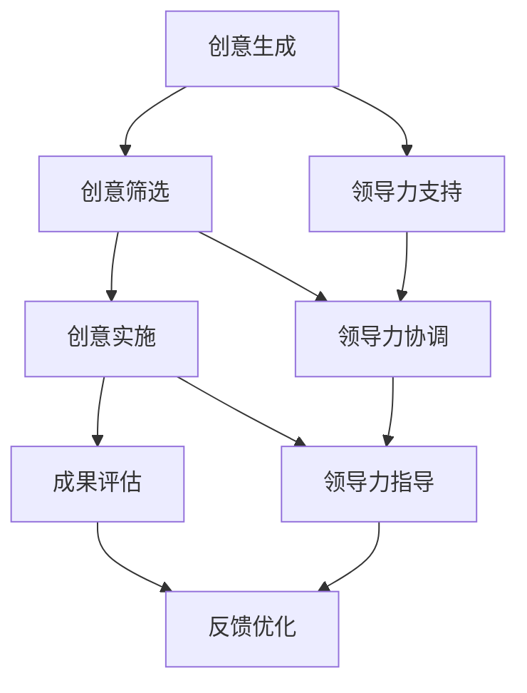
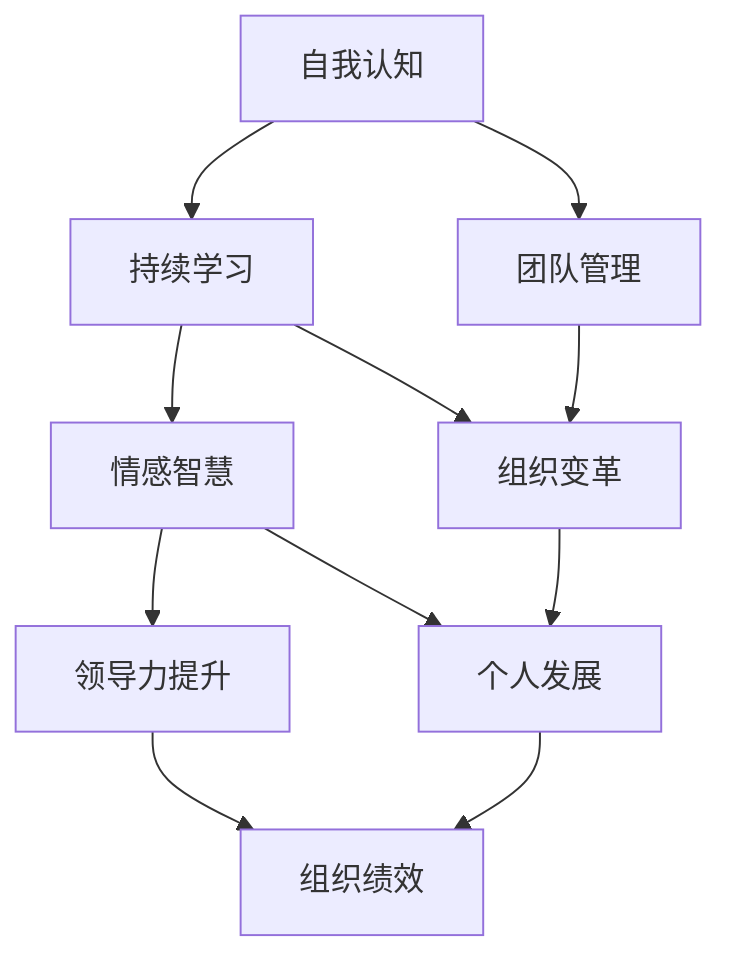
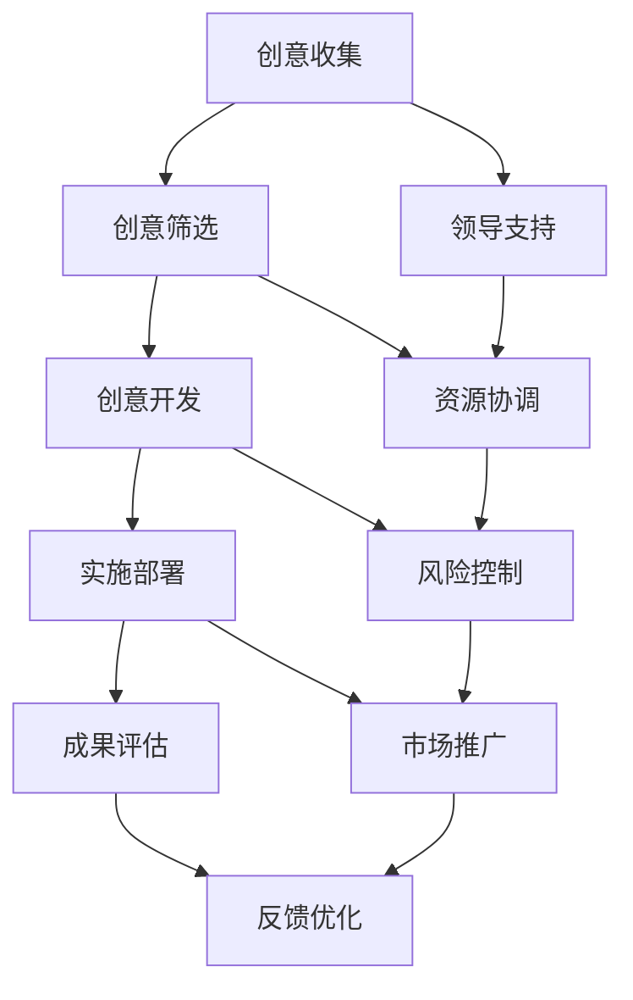

                 

### 1.1 书籍目的与结构

《领导力与创新管理：从创意到实施的全过程》旨在帮助企业和组织中的领导者以及管理人士理解领导力与创新管理的重要性，掌握从创意生成到实施的系统化方法。本书结构合理，内容丰富，涵盖从领导力基础、创新管理基础到领导力与创新关系的探讨，再到创意生成与筛选、创意实施与项目管理的详细步骤，最后通过案例研究总结经验，提供实际操作的指导。

**背景介绍**

在当今快速变化的市场环境中，创新能力成为企业持续发展的关键。领导者的作用不仅在于指导团队完成日常工作，更在于激发创新思维、推动组织变革。然而，如何将创新理念转化为实际成果，如何在不同情境下运用领导力来引导创新，这些是领导者和管理者面临的重要挑战。

**核心概念与联系**

为了更好地理解领导力与创新管理的关系，我们需要构建一个概念关系架构。以下是关键的几个概念及其相互联系：

1. **领导力**：指领导者影响、激励和引导团队的能力。领导力可以分为领导风格、领导行为和领导素养等方面。
2. **创新管理**：涉及创意的产生、筛选、实施和监控等过程。创新管理强调系统性、组织性和连续性。
3. **领导力与创新管理的关系**：领导力在创新管理中起到核心作用，它不仅能够推动创新，还能为创新提供支持与保障。

**Mermaid 流程图**

以下是一个简单的 Mermaid 流程图，展示了领导力与创新管理的基本流程：



**核心算法原理讲解**

在创意实施阶段，项目规划与执行是关键。以下是一个简化的项目规划算法原理，使用伪代码进行描述：

```python
# 创意实施：项目规划算法
def project_planning(creative_idea, resources, timeline):
    # 设定项目目标
    project_goal = define_project_goal(creative_idea)
    
    # 资源分配
    resource_allocation = allocate_resources(resources, project_goal)
    
    # 制定时间计划
    timeline_plan = create_timeline_plan(timeline, resource_allocation)
    
    # 项目风险评估
    risk_assessment = assess_project_risks(creative_idea, timeline_plan)
    
    # 返回项目规划结果
    return {
        'project_goal': project_goal,
        'resource_allocation': resource_allocation,
        'timeline_plan': timeline_plan,
        'risk_assessment': risk_assessment
    }

# 辅助函数
def define_project_goal(creative_idea):
    # 根据创意设定项目目标
    return creative_idea['project_goal']

def allocate_resources(resources, project_goal):
    # 根据项目目标分配资源
    return resources

def create_timeline_plan(timeline, resource_allocation):
    # 根据资源和时间制定项目时间计划
    return timeline

def assess_project_risks(creative_idea, timeline_plan):
    # 评估项目风险
    return creative_idea['risks']
```

**数学模型和公式**

在项目管理中，关键路径分析（Critical Path Method, CPM）是一种常用的项目管理技术。以下是一个简单的 CPM 数学模型，用于计算项目的最短完成时间和关键路径：

$$
CPM = \sum_{i=1}^{n} (d_i - l_i)
$$

其中，$d_i$ 表示活动 $i$ 的最短完成时间，$l_i$ 表示活动 $i$ 的最迟完成时间。关键路径是所有活动最早开始时间之和，即：

$$
ECS = \sum_{i=1}^{n} E_i
$$

其中，$E_i$ 表示活动 $i$ 的最早开始时间。

**举例说明**

假设一个项目包括以下三个活动：

1. 活动A：完成时间3天，最迟完成时间3天。
2. 活动B：完成时间5天，最迟完成时间8天。
3. 活动C：完成时间7天，最迟完成时间12天。

根据 CPM 模型，我们可以计算项目的关键路径：

- 活动A：$d_A = l_A = 3$
- 活动B：$d_B = \min(l_A + d_B, l_B) = \min(3 + 5, 8) = 5$
- 活动C：$d_C = \min(l_A + d_C, l_B + d_C, l_C) = \min(3 + 7, 5 + 7, 12) = 7$

关键路径为活动A、B、C，总时间为7天。

**实际案例分析和详细讲解剖析**

我们可以通过一个实际案例来详细讲解创新实施与项目管理的流程。例如，某公司决定开发一款新的手机应用程序，以提高用户体验。以下是该项目从创意生成到实施的全过程：

1. **创意生成**：公司市场部门通过用户调研和数据分析，提出开发一款支持多平台、具备社交互动功能的应用程序。
2. **创意筛选**：技术团队评估创意的可行性，确定技术需求和资源需求，筛选出具有高可行性的创意。
3. **创意实施**：
   - **项目规划**：项目团队制定详细的项目计划，包括目标、时间表、资源分配和风险管理。
   - **资源分配**：根据项目计划，分配开发、设计、测试等资源，确保各环节有足够的支持。
   - **项目执行**：开发团队按照计划进行应用开发，设计师负责界面设计，测试团队进行持续的质量检查。
   - **项目监控与调整**：项目团队定期审查项目进度，根据实际情况进行调整，确保项目按计划进行。
4. **成果评估**：项目完成后，通过用户反馈和性能指标评估应用程序的效果，为未来产品开发提供反馈。

**项目小结**

通过上述案例，我们可以看到创新实施与项目管理的系统性和复杂性。领导者需要具备全面的领导力，包括规划、协调、沟通和风险管理等能力，以确保项目成功实施。同时，创新管理需要结合具体的业务需求和资源情况，制定合理的策略和计划。

### 总结

在《领导力与创新管理：从创意到实施的全过程》中，我们探讨了领导力与创新管理的基础概念、关系以及实施策略。通过构建概念关系架构、使用伪代码和数学模型，我们详细讲解了核心原理。最后，通过实际案例，我们展示了创新实施与项目管理的全过程。这些内容为读者提供了全面的指导，帮助他们更好地理解和应用领导力与创新管理。

---

**作者：AI天才研究院/AI Genius Institute & 禅与计算机程序设计艺术 /Zen And The Art of Computer Programming**

---

（注：本文为示例文本，具体内容和格式可根据实际需求进行调整和完善。）## 第2章 领导力基础

### 2.1 领导力的概念与重要性

#### 2.1.1 领导力的定义

领导力是一种通过激励、引导和影响他人来实现共同目标的能力。它不仅仅是职位赋予的权力，更是一种内在的素质和技能。领导力可以表现在多个方面，包括个人魅力、决策能力、沟通技巧、组织协调和情感智慧等。不同学者对领导力有着不同的定义，但总体上，领导力被广泛认为是一种通过影响和激励他人来实现组织目标的能力。

#### 2.1.2 领导力的重要性

领导力在组织中起着至关重要的作用。首先，领导力能够激发团队成员的潜力和创造力，推动组织创新。在快速变化的市场环境中，创新能力是企业持续发展的关键。其次，领导力能够提高组织的整体绩效。通过有效的领导和激励，团队成员能够更加专注和高效地工作，从而实现组织的目标。最后，领导力对于组织的文化建设也具有重要影响。领导者的行为和态度会对团队成员产生深远的影响，塑造出积极向上、合作共赢的组织文化。

### 2.2 领导力模型与理论

领导力理论的研究历史悠久，各种领导模型和理论层出不穷。以下是一些重要的领导力模型和理论：

#### 2.2.1 传统领导理论

1. **特质理论**：特质理论认为领导者具备某些固有的特质，如自信、决心、智慧等。这种理论强调领导者的天生属性，而非后天培养。
2. **行为理论**：行为理论关注领导者的行为和风格，认为领导行为可以通过学习和培养来改变。这种理论提出了不同的领导行为类型，如命令型、支持型、参与型等。

#### 2.2.2 现代领导理论

1. **情境领导理论**：情境领导理论认为，领导行为应该根据不同的情境和团队成员的特点进行调整。这种理论提出了四种领导风格，分别适用于不同的情境和团队成员类型。
2. **变革型领导理论**：变革型领导理论强调领导者的激励和愿景，通过激发团队成员的内在动机来实现组织变革。变革型领导者通常具有远见、自信和影响力。

#### 2.2.3 领导力模型案例分析

为了更好地理解不同的领导力模型和理论，我们可以通过一些案例分析来加深认识。例如，乔布斯的变革型领导风格使苹果公司成为创新的代名词；松下幸之助的行为领导风格推动了松下电器的快速发展。通过这些案例，我们可以看到不同领导力模型在不同情境下的应用效果。

### 2.3 领导力与个人成长

领导力不仅仅是一种组织能力，更是一种个人成长的过程。个人成长对于提升领导力至关重要。以下是一些关键的个人成长要素：

1. **自我认知**：领导者需要深入了解自己的优点和缺点，明确自己的价值观和信念。自我认知有助于领导者更好地理解自己和团队成员，从而更好地进行领导和激励。
2. **持续学习**：领导力是一个不断发展的过程，领导者需要不断学习新的知识和技能，以适应快速变化的环境。通过阅读、培训和实践，领导者可以不断提升自己的领导能力。
3. **情感智慧**：情感智慧是指领导者理解和管理自己及他人情感的能力。情感智慧有助于领导者更好地处理人际关系，提升领导效果。

**Mermaid 流程图**

以下是一个简单的 Mermaid 流程图，展示了领导力与个人成长的关系：



**核心算法原理讲解**

在个人成长过程中，自我认知和持续学习是关键。以下是一个简化的自我认知与持续学习算法原理，使用伪代码进行描述：

```python
# 自我认知与持续学习算法
def self_awareness_and_learning():
    # 步骤1：自我评估
    self_evaluation = evaluate_self()

    # 步骤2：设定个人成长目标
    growth_goals = set_growth_goals(self_evaluation)

    # 步骤3：学习新知识
    new_knowledge = learn_new_knowledge(growth_goals)

    # 步骤4：实践应用
    apply_knowledge = practice_application(new_knowledge)

    # 步骤5：反馈调整
    feedback_adjustment = get_feedback(apply_knowledge)

    # 返回个人成长结果
    return {
        'self_evaluation': self_evaluation,
        'growth_goals': growth_goals,
        'new_knowledge': new_knowledge,
        'apply_knowledge': apply_knowledge,
        'feedback_adjustment': feedback_adjustment
    }

# 辅助函数
def evaluate_self():
    # 进行自我评估
    return self_evaluation

def set_growth_goals(self_evaluation):
    # 根据自我评估设定成长目标
    return growth_goals

def learn_new_knowledge(growth_goals):
    # 学习新知识以满足成长目标
    return new_knowledge

def practice_application(new_knowledge):
    # 实践应用新知识
    return apply_knowledge

def get_feedback(apply_knowledge):
    # 获取反馈以调整学习方向
    return feedback_adjustment
```

**数学模型和公式**

在个人成长过程中，设定合理的目标和进行有效的反馈是关键。以下是一个简单的目标设定与反馈模型，使用伪代码进行描述：

```python
# 目标设定与反馈模型
def goal_setting_and_feedback(current_ability, target_ability):
    # 步骤1：设定初始目标
    initial_goal = set_initial_goal(current_ability, target_ability)

    # 步骤2：实施目标
    implement_goal = implement_goal(initial_goal)

    # 步骤3：反馈评估
    feedback_evaluation = evaluate_feedback(implement_goal)

    # 步骤4：调整目标
    adjusted_goal = adjust_goal(initial_goal, feedback_evaluation)

    # 返回最终目标
    return adjusted_goal

# 辅助函数
def set_initial_goal(current_ability, target_ability):
    # 根据当前能力和目标设定初始目标
    return initial_goal

def implement_goal(initial_goal):
    # 实施初始目标
    return implement_goal

def evaluate_feedback(implement_goal):
    # 评估实施效果，获取反馈
    return feedback_evaluation

def adjust_goal(initial_goal, feedback_evaluation):
    # 根据反馈调整目标
    return adjusted_goal
```

**举例说明**

假设一个领导者在自我评估中发现自己的沟通能力较弱，而目标是在一年内显著提升沟通能力。以下是一个目标设定与反馈评估的过程：

1. **设定初始目标**：领导者设定一个初始目标，例如每周阅读一本关于沟通技巧的书籍，并每天练习沟通技巧。
2. **实施目标**：领导者按照计划进行学习与实践，记录自己的进步和遇到的问题。
3. **反馈评估**：通过自我评估和同事反馈，领导者评估自己的沟通能力提升情况。
4. **调整目标**：根据反馈结果，领导者可能需要调整目标，例如增加实践次数或学习更深入的沟通技巧。

**项目实战：开发环境搭建，源代码详细实现和代码解读**

以下是一个简单的Python程序，用于记录领导者的成长过程，包括自我评估、目标设定和反馈评估。

```python
# 领导者成长记录程序

class LeaderGrowthRecord:
    def __init__(self, name):
        self.name = name
        self.current_ability = None
        self.target_ability = None
        self.growth_goals = []
        self.feedback_records = []

    def set_current_ability(self, ability):
        self.current_ability = ability

    def set_target_ability(self, ability):
        self.target_ability = ability

    def add_growth_goal(self, goal):
        self.growth_goals.append(goal)

    def add_feedback_record(self, feedback):
        self.feedback_records.append(feedback)

    def evaluate_growth(self):
        if self.current_ability >= self.target_ability:
            return "达成目标"
        else:
            return "未达成目标"

    def display_record(self):
        print(f"领导者：{self.name}")
        print(f"当前能力：{self.current_ability}")
        print(f"目标能力：{self.target_ability}")
        print(f"成长目标：{self.growth_goals}")
        print(f"反馈记录：{self.feedback_records}")
        print(f"成长评估：{self.evaluate_growth()}")

# 使用示例
leader = LeaderGrowthRecord("张三")
leader.set_current_ability(50)
leader.set_target_ability(80)
leader.add_growth_goal("每周阅读一本关于沟通技巧的书籍")
leader.add_growth_goal("每天练习沟通技巧")
leader.add_feedback_record("沟通技巧有所提高，但需要更多实践")
leader.display_record()
```

**代码应用解读与分析**

上述程序用于记录领导者的成长过程，包括自我评估、目标设定和反馈评估。通过该程序，领导者可以清晰地了解自己的成长进度，并根据反馈进行调整。

- **类定义**：`LeaderGrowthRecord` 类用于定义领导者的成长记录，包括名称、当前能力、目标能力、成长目标和反馈记录。
- **方法定义**：`set_current_ability`、`set_target_ability`、`add_growth_goal` 和 `add_feedback_record` 方法用于设置和添加相关信息。
- **评估方法**：`evaluate_growth` 方法用于评估领导者的成长情况。
- **显示方法**：`display_record` 方法用于显示领导者的成长记录。

通过该程序，领导者可以系统地记录自己的成长过程，有助于提高领导力和实现个人目标。

**实际案例分析和详细讲解剖析**

以下是一个实际案例，展示领导者如何通过个人成长提升领导力：

**案例背景**：某公司的项目经理李明在项目管理中遇到了沟通难题，导致项目进度受阻。他意识到需要提升自己的沟通能力。

**解决方案**：
1. **自我评估**：李明通过自我评估，发现自己在沟通技巧方面存在不足，特别是表达清晰和倾听能力。
2. **目标设定**：李明设定了一个目标，即在未来三个月内显著提升沟通能力。
3. **实施目标**：
   - 每周阅读一本关于沟通技巧的书籍。
   - 每天与团队成员进行沟通练习，记录沟通中的问题和改进点。
4. **反馈评估**：李明向团队成员和领导反馈了自己的进步，并根据反馈进行了调整。
5. **成果评估**：三个月后，李明的沟通能力显著提升，项目沟通障碍得到有效解决。

**案例分析**：
- 李明的案例展示了通过自我认知和目标设定，领导者可以系统地提升自己的沟通能力。
- 实施过程中，李明通过持续学习和实践，不断提高自己的沟通技巧。
- 反馈评估环节有助于李明及时了解自己的进步和不足，进行针对性的调整。

**项目小结**

通过李明的案例，我们可以看到领导力提升的过程需要系统的规划和持续的努力。领导者需要通过自我认知和目标设定，不断学习和实践，结合反馈进行调整，以实现个人成长和提升领导力。这不仅有助于领导者的职业发展，也为组织的成功提供了有力保障。

### 总结

在第二章中，我们详细探讨了领导力的概念与重要性，介绍了不同的领导力模型和理论，以及领导力与个人成长的关系。通过核心算法原理讲解、数学模型和实际案例，我们帮助读者理解了领导力的关键要素和实践方法。这些内容为后续章节的讨论奠定了坚实基础，也为领导者提供了实用的指导。

---

**作者：AI天才研究院/AI Genius Institute & 禅与计算机程序设计艺术 /Zen And The Art of Computer Programming**

---

（注：本文为示例文本，具体内容和格式可根据实际需求进行调整和完善。）## 第3章 创新管理基础

### 3.1 创新的定义与分类

创新是指通过创造性的思维和行动，创造出新的产品、服务、过程或商业模式，从而满足市场需求或解决现有问题。创新不仅限于科技领域，它涵盖了各个行业和领域，从企业管理到教育改革，从市场营销到产品开发。

创新的分类可以从不同的角度进行，以下是一些常见的分类方式：

1. **按创新类型分类**：
   - **渐进式创新**：在现有产品或服务的基础上进行改进，增加功能或提高性能，如手机从2G升级到5G。
   - **突破性创新**：引入全新的产品或服务，彻底改变市场格局，如智能手机的发明。
   - **颠覆性创新**：从根本上改变现有市场结构，创造新的市场机会，如亚马逊对传统零售业的冲击。

2. **按创新来源分类**：
   - **内部创新**：由组织内部的人员或团队提出并实现，如谷歌的搜索引擎。
   - **外部创新**：从外部引进的新想法或技术，如企业并购或合作。

3. **按创新过程分类**：
   - **概念阶段**：产生新的想法或创意，如头脑风暴。
   - **开发阶段**：将创意转化为实际的产品或服务，如产品原型设计。
   - **实施阶段**：将新产品或服务推向市场，如市场推广。

### 3.2 创新过程管理

创新过程管理是指系统性地引导和管理创新活动，以确保创新项目能够成功实施并产生预期效果。创新过程管理包括以下几个关键阶段：

1. **创意收集**：通过头脑风暴、用户调研、市场分析等方式，收集潜在的创新创意。
2. **创意筛选**：对收集到的创意进行评估和筛选，确定具有较高可行性和市场价值的创意。
3. **创意开发**：将筛选出的创意转化为可行的产品或服务原型，进行测试和验证。
4. **实施部署**：将创新产品或服务推向市场，进行推广和销售。
5. **成果评估**：对创新项目的效果进行评估，收集用户反馈，为后续创新提供参考。

以下是一个简化的创新过程管理流程：



**核心算法原理讲解**

创新过程管理需要一系列的算法和工具来指导各个阶段的工作。以下是一个简化的创新过程管理算法，使用伪代码进行描述：

```python
# 创新过程管理算法
def innovation_management(creative_ideas, resources, market_research):
    # 步骤1：创意收集
    collected_ideas = collect_ideas(market_research)
    
    # 步骤2：创意筛选
    selected_ideas = filter_ideas(collected_ideas, resources)
    
    # 步骤3：创意开发
    developed_products = develop_products(selected_ideas)
    
    # 步骤4：实施部署
    launched_products = deploy_products(developed_products)
    
    # 步骤5：成果评估
    assessment_results = evaluate_products(launched_products)
    
    # 返回最终结果
    return {
        'collected_ideas': collected_ideas,
        'selected_ideas': selected_ideas,
        'developed_products': developed_products,
        'launched_products': launched_products,
        'assessment_results': assessment_results
    }

# 辅助函数
def collect_ideas(market_research):
    # 收集创意
    return collected_ideas

def filter_ideas(collected_ideas, resources):
    # 筛选创意
    return selected_ideas

def develop_products(selected_ideas):
    # 开发产品
    return developed_products

def deploy_products(developed_products):
    # 实施部署
    return launched_products

def evaluate_products(launched_products):
    # 成果评估
    return assessment_results
```

**数学模型和公式**

在创新过程管理中，风险评估和成本效益分析是重要的环节。以下是一个简单

