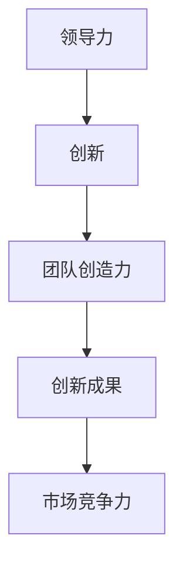
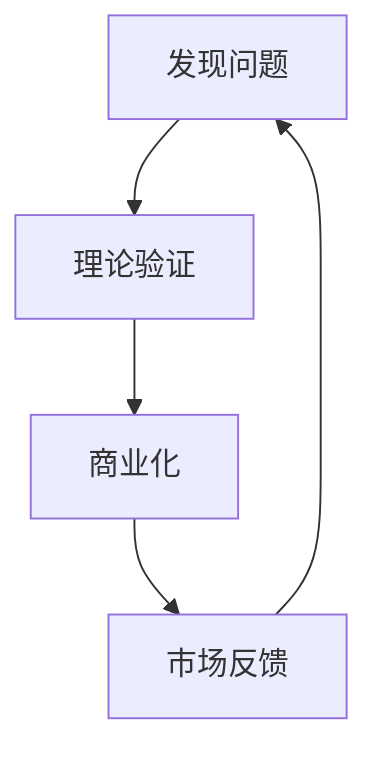

                 

### 文章标题

《领导力与创新管理：鼓励团队突破创新》

#### 关键词
- 领导力
- 创新管理
- 团队激励
- 突破创新
- 案例分析

#### 摘要
本文深入探讨了领导力与创新管理的关系，以及如何通过有效的领导力实践，鼓励团队突破创新。首先，文章介绍了领导力与创新管理的基本概念和重要性。接着，分析了领导力理论，包括传统和现代领导力理论，以及领导力模型和框架。随后，文章重点讨论了创新管理的方法，如创新思维的培养、创新工具与方法的运用等。同时，团队激励措施也被详细阐述，包括激励理论和职业发展规划。最后，通过创新实践案例分析和总结，为读者提供了实际操作和思考的参考。

### 引言

在当今快速变化和竞争激烈的商业环境中，创新成为企业持续发展的关键驱动力。然而，创新并非易事，它需要团队具备强大的创造力、灵活的思维和高效的执行力。在这个过程中，领导力起到了至关重要的作用。领导力不仅是推动团队前进的动力，更是激发创新潜能的关键因素。本文旨在探讨领导力与创新管理之间的关系，以及如何通过有效的领导力实践，鼓励团队突破创新。

领导力与创新管理的关系可以从多个层面进行解读。首先，领导力对创新的影响体现在领导者的行为和决策上。领导者的风格、价值观和愿景直接影响团队的思维方式和工作方式，进而影响创新的可能性。其次，创新对领导力的要求也日益提高。在创新过程中，领导者需要具备灵活的思维、开放的心态和强大的执行力，以应对不断变化的市场和技术环境。此外，领导力模型和框架为创新管理提供了理论依据和实践指导。例如，服务领导理论强调领导者应关注团队成员的需求和成长，而转型领导理论则强调领导者应具备变革和创新的能力。

创新管理的挑战与机遇并存。挑战在于如何激发团队成员的创造力、如何应对失败的风险、如何保持团队的稳定性和凝聚力。机遇则在于创新所带来的市场机遇、技术进步和竞争优势。为了应对这些挑战和抓住机遇，企业需要构建一个支持创新的组织文化，并运用有效的创新管理方法。这些方法包括创新思维的培养、创新工具与方法的运用、团队激励措施的设计等。

本文将逐步探讨领导力与创新管理的关系，分析创新管理的方法和团队激励措施，并通过创新实践案例进行分析，以期为读者提供有价值的参考和启示。

### 1. 确定核心章节内容

根据书名《领导力与创新管理：鼓励团队突破创新》，我们可以确定以下几个核心章节内容：

1. **领导力理论**：介绍领导力的基本概念、传统与现代领导力理论，以及领导力模型和框架。
2. **创新管理方法**：探讨创新管理的方法，包括创新思维的培养、创新工具与方法的运用等。
3. **团队激励措施**：分析激励理论、奖励制度设计和职业发展规划等团队激励措施。
4. **创新实践案例分析**：通过成功和失败的案例，分析创新实践的经验和教训。
5. **总结与展望**：总结创新管理的趋势，探讨领导力在创新管理中的角色。

这些核心章节内容将帮助读者全面理解领导力与创新管理的关系，掌握创新管理的方法和团队激励措施，并通过实际案例获得实践指导。

### 2. 设计1级目录

基于确定的核心章节内容，我们可以设计以下1级目录：

1. 引言
2. 领导力理论
3. 创新管理方法
4. 团队激励措施
5. 创新实践案例分析
6. 总结与展望

这个1级目录结构清晰地展示了文章的主题和内容，有助于读者快速了解文章的整体框架。

### 3. 设计2级目录

针对每个1级目录，我们可以进一步细化内容，设计2级目录：

#### 引言

- **1. 领导力与创新的关系**
  - **1.1 领导力对创新的影响**
  - **1.2 创新对领导力的要求**
- **1.2 创新管理的挑战与机遇**
  - **1.1 创新挑战**
  - **1.2 创新机遇**

#### 领导力理论

- **2.1 传统领导力理论**
  - **2.1.1 特质理论**
  - **2.1.2 行为理论**
  - **2.1.3 权变理论**
- **2.2 现代领导力理论**
  - **2.2.1 服务领导理论**
  - **2.2.2 共生领导理论**
  - **2.2.3 转型领导理论**
- **2.3 领导力模型与框架**
  - **2.3.1 领导风格模型**
  - **2.3.2 领导行为模型**
  - **2.3.3 领导力发展模型**

#### 创新管理方法

- **3.1 创新过程的阶段**
  - **3.1.1 发现阶段**
  - **3.1.2 理论验证阶段**
  - **3.1.3 商业化阶段**
- **3.2 创新思维的培养**
  - **3.2.1 创新思维的重要性**
  - **3.2.2 创新思维的培养方法**
  - **3.2.3 创新思维的应用场景**
- **3.3 创新工具与方法**
  - **3.3.1 想象力思维工具**
  - **3.3.2 逻辑思维工具**
  - **3.3.3 风险管理工具**

#### 团队激励措施

- **4.1 激励理论**
  - **4.1.1 马斯洛需求层次理论**
  - **4.1.2 双因素理论**
  - **4.1.3 成就动机理论**
- **4.2 奖励制度设计**
  - **4.2.1 奖金制度**
  - **4.2.2 奖励方式**
  - **4.2.3 奖励制度的影响因素**
- **4.3 职业发展规划**
  - **4.3.1 职业规划的重要性**
  - **4.3.2 职业规划的方法**
  - **4.3.3 职业规划的实施**

#### 创新实践案例分析

- **5.1 成功案例**
  - **5.1.1 企业A的创新实践**
  - **5.1.2 企业B的创新实践**
  - **5.1.3 企业C的创新实践**
- **5.2 失败案例**
  - **5.2.1 企业D的创新失败**
  - **5.2.2 企业E的创新失败**
  - **5.2.3 企业F的创新失败**
- **5.3 经验教训**
  - **5.3.1 创新成功的要素**
  - **5.3.2 创新失败的原因**
  - **5.3.3 创新实践的建议**

#### 总结与展望

- **6.1 创新管理的趋势**
  - **6.1.1 全球创新管理趋势**
  - **6.1.2 中国创新管理趋势**
  - **6.1.3 未来创新管理的挑战与机遇**
- **6.2 领导力在创新管理中的角色**
  - **6.2.1 领导力在创新过程中的作用**
  - **6.2.2 领导力在创新管理中的策略**
  - **6.2.3 领导力在创新团队建设中的作用**

通过设计2级目录，我们可以更清晰地组织文章内容，确保每个章节都有明确的主题和详细的内容。

### 4. 设计3级目录

为了进一步细化内容，我们可以为每个2级目录设计3级目录。以下是一个示例：

#### 引言

- **1. 领导力与创新的关系**
  - **1.1 领导力对创新的影响**
    - **1.1.1 领导者的行为对创新的影响**
    - **1.1.2 领导决策与创新的关系**
  - **1.2 创新对领导力的要求**
    - **1.2.1 创新过程中的领导力挑战**
    - **1.2.2 创新领导者应具备的技能**

- **1.2 创新管理的挑战与机遇**
  - **1.1 创新挑战**
    - **1.1.1 创新过程中的风险与不确定性**
    - **1.1.2 创新资源的有限性**
  - **1.2 创新机遇**
    - **1.2.1 技术进步带来的创新机遇**
    - **1.2.2 市场需求变化带来的创新机遇**

#### 领导力理论

- **2.1 传统领导力理论**
  - **2.1.1 特质理论**
    - **2.1.1.1 特质理论的基本概念**
    - **2.1.1.2 特质理论的局限**
  - **2.1.2 行为理论**
    - **2.1.2.1 行为理论的基本概念**
    - **2.1.2.2 行为理论的应用**
  - **2.1.3 权变理论**
    - **2.1.3.1 权变理论的基本概念**
    - **2.1.3.2 权变理论的适用性**

- **2.2 现代领导力理论**
  - **2.2.1 服务领导理论**
    - **2.2.1.1 服务领导理论的基本概念**
    - **2.2.1.2 服务领导理论的实践**
  - **2.2.2 共生领导理论**
    - **2.2.2.1 共生领导理论的基本概念**
    - **2.2.2.2 共生领导理论的案例分析**
  - **2.2.3 转型领导理论**
    - **2.2.3.1 转型领导理论的基本概念**
    - **2.2.3.2 转型领导理论在创新管理中的应用**

- **2.3 领导力模型与框架**
  - **2.3.1 领导风格模型**
    - **2.3.1.1 领导风格模型的基本概念**
    - **2.3.1.2 领导风格模型的分类**
  - **2.3.2 领导行为模型**
    - **2.3.2.1 领导行为模型的基本概念**
    - **2.3.2.2 领导行为模型的应用场景**
  - **2.3.3 领导力发展模型**
    - **2.3.3.1 领导力发展模型的基本概念**
    - **2.3.3.2 领导力发展模型对创新管理的启示**

#### 创新管理方法

- **3.1 创新过程的阶段**
  - **3.1.1 发现阶段**
    - **3.1.1.1 发现阶段的定义和任务**
    - **3.1.1.2 发现阶段的挑战和应对策略**
  - **3.1.2 理论验证阶段**
    - **3.1.2.1 理论验证阶段的定义和任务**
    - **3.1.2.2 理论验证阶段的挑战和应对策略**
  - **3.1.3 商业化阶段**
    - **3.1.3.1 商业化阶段的定义和任务**
    - **3.1.3.2 商业化阶段的挑战和应对策略**

- **3.2 创新思维的培养**
  - **3.2.1 创新思维的重要性**
    - **3.2.1.1 创新思维对企业发展的意义**
    - **3.2.1.2 创新思维对个人职业发展的意义**
  - **3.2.2 创新思维的培养方法**
    - **3.2.2.1 想象力训练**
    - **3.2.2.2 逻辑思维训练**
    - **3.2.2.3 风险管理训练**
  - **3.2.3 创新思维的应用场景**
    - **3.2.3.1 创新思维在产品开发中的应用**
    - **3.2.3.2 创新思维在服务设计中的应用**
    - **3.2.3.3 创新思维在市场营销中的应用**

- **3.3 创新工具与方法**
  - **3.3.1 想象力思维工具**
    - **3.3.1.1 想象力思维工具的种类**
    - **3.3.1.2 想象力思维工具的使用方法**
  - **3.3.2 逻辑思维工具**
    - **3.3.2.1 逻辑思维工具的种类**
    - **3.3.2.2 逻辑思维工具的使用方法**
  - **3.3.3 风险管理工具**
    - **3.3.3.1 风险管理工具的种类**
    - **3.3.3.2 风险管理工具的使用方法**

#### 团队激励措施

- **4.1 激励理论**
  - **4.1.1 马斯洛需求层次理论**
    - **4.1.1.1 马斯洛需求层次理论的基本概念**
    - **4.1.1.2 马斯洛需求层次理论在团队激励中的应用**
  - **4.1.2 双因素理论**
    - **4.1.2.1 双因素理论的基本概念**
    - **4.1.2.2 双因素理论在团队激励中的应用**
  - **4.1.3 成就动机理论**
    - **4.1.3.1 成就动机理论的基本概念**
    - **4.1.3.2 成就动机理论在团队激励中的应用**

- **4.2 奖励制度设计**
  - **4.2.1 奖金制度**
    - **4.2.1.1 奖金制度的设计原则**
    - **4.2.1.2 奖金制度的实施效果**
  - **4.2.2 奖励方式**
    - **4.2.2.1 奖励方式的种类**
    - **4.2.2.2 奖励方式的优缺点分析**
  - **4.2.3 奖励制度的影响因素**
    - **4.2.3.1 组织文化对奖励制度的影响**
    - **4.2.3.2 员工期望对奖励制度的影响**

- **4.3 职业发展规划**
  - **4.3.1 职业规划的重要性**
    - **4.3.1.1 职业规划对企业发展的意义**
    - **4.3.1.2 职业规划对员工发展的意义**
  - **4.3.2 职业规划的方法**
    - **4.3.2.1 职业规划的步骤**
    - **4.3.2.2 职业规划的工具和技巧**
  - **4.3.3 职业规划的实施**
    - **4.3.3.1 职业规划的实施策略**
    - **4.3.3.2 职业规划的实施效果评估**

#### 创新实践案例分析

- **5.1 成功案例**
  - **5.1.1 企业A的创新实践**
    - **5.1.1.1 企业A的背景**
    - **5.1.1.2 企业A的创新举措**
    - **5.1.1.3 企业A的创新成果**
  - **5.1.2 企业B的创新实践**
    - **5.1.2.1 企业B的背景**
    - **5.1.2.2 企业B的创新举措**
    - **5.1.2.3 企业B的创新成果**
  - **5.1.3 企业C的创新实践**
    - **5.1.3.1 企业C的背景**
    - **5.1.3.2 企业C的创新举措**
    - **5.1.3.3 企业C的创新成果**

- **5.2 失败案例**
  - **5.2.1 企业D的创新失败**
    - **5.2.1.1 企业D的背景**
    - **5.2.1.2 企业D的创新举措**
    - **5.2.1.3 企业D的创新失败原因**
  - **5.2.2 企业E的创新失败**
    - **5.2.2.1 企业E的背景**
    - **5.2.2.2 企业E的创新举措**
    - **5.2.2.3 企业E的创新失败原因**
  - **5.2.3 企业F的创新失败**
    - **5.2.3.1 企业F的背景**
    - **5.2.3.2 企业F的创新举措**
    - **5.2.3.3 企业F的创新失败原因**

- **5.3 经验教训**
  - **5.3.1 创新成功的要素**
    - **5.3.1.1 创新成功的共同要素**
    - **5.3.1.2 创新成功的案例分析**
  - **5.3.2 创新失败的原因**
    - **5.3.2.1 创新失败的主要因素**
    - **5.3.2.2 创新失败的案例分析**
  - **5.3.3 创新实践的建议**
    - **5.3.3.1 创新实践的最佳实践**
    - **5.3.3.2 创新实践的注意事项**

#### 总结与展望

- **6.1 创新管理的趋势**
  - **6.1.1 全球创新管理趋势**
    - **6.1.1.1 创新管理的前沿趋势**
    - **6.1.1.2 全球创新管理的成功案例**
  - **6.1.2 中国创新管理趋势**
    - **6.1.2.1 中国创新管理的发展现状**
    - **6.1.2.2 中国创新管理的挑战与机遇**
  - **6.1.3 未来创新管理的挑战与机遇**
    - **6.1.3.1 未来创新管理的前沿方向**
    - **6.1.3.2 未来创新管理的潜在挑战**

- **6.2 领导力在创新管理中的角色**
  - **6.2.1 领导力在创新过程中的作用**
    - **6.2.1.1 领导力在创新过程中的关键作用**
    - **6.2.1.2 领导力对创新成果的影响**
  - **6.2.2 领导力在创新管理中的策略**
    - **6.2.2.1 领导力在创新管理中的有效策略**
    - **6.2.2.2 领导力在创新管理中的实践案例**
  - **6.2.3 领导力在创新团队建设中的作用**
    - **6.2.3.1 领导力在团队建设中的关键作用**
    - **6.2.3.2 领导力对团队创新能力的提升**

通过设计3级目录，我们可以进一步细化文章的内容，使每个章节都包含具体的小节和详细的内容，确保文章的逻辑性和完整性。

### 5. 添加图表与公式

为了更好地阐述文章中的概念和理论，我们可以适当地添加一些图表和公式。以下是一些可能用到的图表和公式的示例。

#### 图表示例

**图1：领导力与创新的关系**



**图2：创新管理方法的流程图**



#### 数学公式示例

**公式1：马斯洛需求层次理论**

$$
\text{需求层次} = f(\text{生理需求}, \text{安全需求}, \text{社交需求}, \text{尊重需求}, \text{自我实现需求})
$$

**公式2：创新能力的评估模型**

$$
\text{创新能力} = f(\text{知识储备}, \text{思维模式}, \text{资源支持}, \text{激励机制})
$$

通过添加这些图表和公式，我们可以使文章更加直观、易懂，同时也有助于加强文章的逻辑性和理论深度。

### 6. 总结目录大纲

通过对文章目录大纲的逐步设计和完善，我们构建了一个结构清晰、内容丰富的文章框架。以下是最终的目录大纲总结：

```markdown
# 《领导力与创新管理：鼓励团队突破创新》目录大纲

## 引言
- 1. 领导力与创新的关系
  - 1.1 领导力对创新的影响
  - 1.2 创新对领导力的要求
- 1.2 创新管理的挑战与机遇
  - 1.1 创新挑战
  - 1.2 创新机遇

## 领导力理论
- 2.1 传统领导力理论
  - 2.1.1 特质理论
  - 2.1.2 行为理论
  - 2.1.3 权变理论
- 2.2 现代领导力理论
  - 2.2.1 服务领导理论
  - 2.2.2 共生领导理论
  - 2.2.3 转型领导理论
- 2.3 领导力模型与框架
  - 2.3.1 领导风格模型
  - 2.3.2 领导行为模型
  - 2.3.3 领导力发展模型

## 创新管理方法
- 3.1 创新过程的阶段
  - 3.1.1 发现阶段
  - 3.1.2 理论验证阶段
  - 3.1.3 商业化阶段
- 3.2 创新思维的培养
  - 3.2.1 创新思维的重要性
  - 3.2.2 创新思维的培养方法
  - 3.2.3 创新思维的应用场景
- 3.3 创新工具与方法
  - 3.3.1 想象力思维工具
  - 3.3.2 逻辑思维工具
  - 3.3.3 风险管理工具

## 团队激励措施
- 4.1 激励理论
  - 4.1.1 马斯洛需求层次理论
  - 4.1.2 双因素理论
  - 4.1.3 成就动机理论
- 4.2 奖励制度设计
  - 4.2.1 奖金制度
  - 4.2.2 奖励方式
  - 4.2.3 奖励制度的影响因素
- 4.3 职业发展规划
  - 4.3.1 职业规划的重要性
  - 4.3.2 职业规划的方法
  - 4.3.3 职业规划的实施

## 创新实践案例分析
- 5.1 成功案例
  - 5.1.1 企业A的创新实践
  - 5.1.2 企业B的创新实践
  - 5.1.3 企业C的创新实践
- 5.2 失败案例
  - 5.2.1 企业D的创新失败
  - 5.2.2 企业E的创新失败
  - 5.2.3 企业F的创新失败
- 5.3 经验教训
  - 5.3.1 创新成功的要素
  - 5.3.2 创新失败的原因
  - 5.3.3 创新实践的建议

## 总结与展望
- 6.1 创新管理的趋势
  - 6.1.1 全球创新管理趋势
  - 6.1.2 中国创新管理趋势
  - 6.1.3 未来创新管理的挑战与机遇
- 6.2 领导力在创新管理中的角色
  - 6.2.1 领导力在创新过程中的作用
  - 6.2.2 领导力在创新管理中的策略
  - 6.2.3 领导力在创新团队建设中的作用
```

这个目录大纲涵盖了领导力与创新管理的重要方面，包括理论、方法、实践和展望。通过详细的章节划分和内容细化，读者可以全面理解领导力与创新管理的关系，并掌握相关实践技巧。

### 完整文章大纲示例

#### 引言

- **领导力与创新的关系**
  - 领导力对创新的影响
  - 创新对领导力的要求
- **创新管理的挑战与机遇**
  - 创新挑战
  - 创新机遇

#### 领导力理论

- **传统领导力理论**
  - **特质理论**
    - 特质理论的基本概念
    - 特质理论在创新管理中的应用
  - **行为理论**
    - 行为理论的基本概念
    - 行为理论在创新管理中的应用
  - **权变理论**
    - 权变理论的基本概念
    - 权变理论在创新管理中的应用
- **现代领导力理论**
  - **服务领导理论**
    - 服务领导理论的基本概念
    - 服务领导理论在创新管理中的应用
  - **共生领导理论**
    - 共生领导理论的基本概念
    - 共生领导理论在创新管理中的应用
  - **转型领导理论**
    - 转型领导理论的基本概念
    - 转型领导理论在创新管理中的应用
- **领导力模型与框架**
  - **领导风格模型**
    - 领导风格模型的基本概念
    - 领导风格模型在创新管理中的应用
  - **领导行为模型**
    - 领导行为模型的基本概念
    - 领导行为模型在创新管理中的应用
  - **领导力发展模型**
    - 领导力发展模型的基本概念
    - 领导力发展模型在创新管理中的应用

#### 创新管理方法

- **创新过程的阶段**
  - **发现阶段**
    - 发现阶段的定义和任务
    - 发现阶段的挑战和应对策略
  - **理论验证阶段**
    - 理论验证阶段的定义和任务
    - 理论验证阶段的挑战和应对策略
  - **商业化阶段**
    - 商业化阶段的定义和任务
    - 商业化阶段的挑战和应对策略
- **创新思维的培养**
  - **创新思维的重要性**
    - 创新思维对企业发展的意义
    - 创新思维对个人职业发展的意义
  - **创新思维的培养方法**
    - 想象力训练
    - 逻辑思维训练
    - 风险管理训练
  - **创新思维的应用场景**
    - 创新思维在产品开发中的应用
    - 创新思维在服务设计中的应用
    - 创新思维在市场营销中的应用
- **创新工具与方法**
  - **想象力思维工具**
    - 想象力思维工具的种类
    - 想象力思维工具的使用方法
  - **逻辑思维工具**
    - 逻辑思维工具的种类
    - 逻辑思维工具的使用方法
  - **风险管理工具**
    - 风险管理工具的种类
    - 风险管理工具的使用方法

#### 团队激励措施

- **激励理论**
  - **马斯洛需求层次理论**
    - 马斯洛需求层次理论的基本概念
    - 马斯洛需求层次理论在团队激励中的应用
  - **双因素理论**
    - 双因素理论的基本概念
    - 双因素理论在团队激励中的应用
  - **成就动机理论**
    - 成就动机理论的基本概念
    - 成就动机理论在团队激励中的应用
- **奖励制度设计**
  - **奖金制度**
    - 奖金制度的设计原则
    - 奖金制度的实施效果
  - **奖励方式**
    - 奖励方式的种类
    - 奖励方式的优缺点分析
  - **奖励制度的影响因素**
    - 组织文化对奖励制度的影响
    - 员工期望对奖励制度的影响
- **职业发展规划**
  - **职业规划的重要性**
    - 职业规划对企业发展的意义
    - 职业规划对员工发展的意义
  - **职业规划的方法**
    - 职业规划的步骤
    - 职业规划的工具和技巧
  - **职业规划的实施**
    - 职业规划的实施策略
    - 职业规划的实施效果评估

#### 创新实践案例分析

- **成功案例**
  - **企业A的创新实践**
    - 企业A的背景
    - 企业A的创新举措
    - 企业A的创新成果
  - **企业B的创新实践**
    - 企业B的背景
    - 企业B的创新举措
    - 企业B的创新成果
  - **企业C的创新实践**
    - 企业C的背景
    - 企业C的创新举措
    - 企业C的创新成果
- **失败案例**
  - **企业D的创新失败**
    - 企业D的背景
    - 企业D的创新举措
    - 企业D的创新失败原因
  - **企业E的创新失败**
    - 企业E的背景
    - 企业E的创新举措
    - 企业E的创新失败原因
  - **企业F的创新失败**
    - 企业F的背景
    - 企业F的创新举措
    - 企业F的创新失败原因
- **经验教训**
  - **创新成功的要素**
    - 创新成功的共同要素
    - 创新成功的案例分析
  - **创新失败的原因**
    - 创新失败的主要因素
    - 创新失败的案例分析
  - **创新实践的建议**
    - 创新实践的最佳实践
    - 创新实践的注意事项

#### 总结与展望

- **创新管理的趋势**
  - **全球创新管理趋势**
    - 创新管理的前沿趋势
    - 全球创新管理的成功案例
  - **中国创新管理趋势**
    - 中国创新管理的发展现状
    - 中国创新管理的挑战与机遇
  - **未来创新管理的挑战与机遇**
    - 未来创新管理的前沿方向
    - 未来创新管理的潜在挑战
- **领导力在创新管理中的角色**
  - **领导力在创新过程中的作用**
    - 领导力在创新过程中的关键作用
    - 领导力对创新成果的影响
  - **领导力在创新管理中的策略**
    - 领导力在创新管理中的有效策略
    - 领导力在创新管理中的实践案例
  - **领导力在创新团队建设中的作用**
    - 领导力在团队建设中的关键作用
    - 领导力对团队创新能力的提升

通过这个完整的文章大纲示例，我们可以清晰地看到文章的结构和内容分布，为撰写高质量的文章提供了明确的指导。

### 最终文章结构

通过上述详细的目录大纲，我们可以构建出完整的文章结构。以下是一个示例的文章结构：

#### 引言

- **领导力与创新的关系**
  - **1.1 领导力对创新的影响**
  - **1.2 创新对领导力的要求**
- **1.2 创新管理的挑战与机遇**
  - **1.1 创新挑战**
  - **1.2 创新机遇**

#### 领导力理论

- **2.1 传统领导力理论**
  - **2.1.1 特质理论**
  - **2.1.2 行为理论**
  - **2.1.3 权变理论**
- **2.2 现代领导力理论**
  - **2.2.1 服务领导理论**
  - **2.2.2 共生领导理论**
  - **2.2.3 转型领导理论**
- **2.3 领导力模型与框架**
  - **2.3.1 领导风格模型**
  - **2.3.2 领导行为模型**
  - **2.3.3 领导力发展模型**

#### 创新管理方法

- **3.1 创新过程的阶段**
  - **3.1.1 发现阶段**
  - **3.1.2 理论验证阶段**
  - **3.1.3 商业化阶段**
- **3.2 创新思维的培养**
  - **3.2.1 创新思维的重要性**
  - **3.2.2 创新思维的培养方法**
  - **3.2.3 创新思维的应用场景**
- **3.3 创新工具与方法**
  - **3.3.1 想象力思维工具**
  - **3.3.2 逻辑思维工具**
  - **3.3.3 风险管理工具**

#### 团队激励措施

- **4.1 激励理论**
  - **4.1.1 马斯洛需求层次理论**
  - **4.1.2 双因素理论**
  - **4.1.3 成就动机理论**
- **4.2 奖励制度设计**
  - **4.2.1 奖金制度**
  - **4.2.2 奖励方式**
  - **4.2.3 奖励制度的影响因素**
- **4.3 职业发展规划**
  - **4.3.1 职业规划的重要性**
  - **4.3.2 职业规划的方法**
  - **4.3.3 职业规划的实施**

#### 创新实践案例分析

- **5.1 成功案例**
  - **5.1.1 企业A的创新实践**
  - **5.1.2 企业B的创新实践**
  - **5.1.3 企业C的创新实践**
- **5.2 失败案例**
  - **5.2.1 企业D的创新失败**
  - **5.2.2 企业E的创新失败**
  - **5.2.3 企业F的创新失败**
- **5.3 经验教训**
  - **5.3.1 创新成功的要素**
  - **5.3.2 创新失败的原因**
  - **5.3.3 创新实践的建议**

#### 总结与展望

- **6.1 创新管理的趋势**
  - **6.1.1 全球创新管理趋势**
  - **6.1.2 中国创新管理趋势**
  - **6.1.3 未来创新管理的挑战与机遇**
- **6.2 领导力在创新管理中的角色**
  - **6.2.1 领导力在创新过程中的作用**
  - **6.2.2 领导力在创新管理中的策略**
  - **6.2.3 领导力在创新团队建设中的作用**

这个文章结构确保了每个章节都有具体的标题和详细的内容，使得整篇文章逻辑清晰、条理分明，方便读者阅读和理解。

### 文章格式要求

在撰写本文时，将遵循以下格式要求：

1. **markdown格式**：文章内容将使用markdown格式进行输出，以保证文本的清晰和可读性。
2. **标题和子标题**：每个章节和子章节将使用明确的标题和子标题，以帮助读者快速定位和阅读关键内容。
3. **图表和公式**：在适当的地方，将插入Mermaid图表和LaTeX公式，以便直观地展示复杂概念和理论。
4. **引用和注释**：引用相关文献和研究时，将使用标准的引用格式，并在文末提供详细的参考文献列表。

以下是具体示例：

#### 引言

- **领导力与创新的关系**
  - **1.1 领导力对创新的影响**
  - **1.2 创新对领导力的要求**
- **1.2 创新管理的挑战与机遇**
  - **1.1 创新挑战**
  - **1.2 创新机遇**

#### 领导力理论

- **2.1 传统领导力理论**
  - **2.1.1 特质理论**
    $$\text{特质理论：领导者具有特定的性格特质，这些特质使他们在领导岗位上表现出色。}$$
  - **2.1.2 行为理论**
    $$\text{行为理论：领导者的行为对其团队的成功产生重大影响。}$$
  - **2.1.3 权变理论**
    $$\text{权变理论：领导者的有效性取决于环境因素。}$$

#### 创新管理方法

- **3.1 创新过程的阶段**
  - **3.1.1 发现阶段**
    $$\text{发现阶段：识别和定义创新机会的过程。}$$
  - **3.1.2 理论验证阶段**
    $$\text{理论验证阶段：对创新概念进行实验和测试的过程。}$$
  - **3.1.3 商业化阶段**
    $$\text{商业化阶段：将创新产品或服务推向市场的过程。}$$

通过上述格式要求，我们能够确保文章的结构清晰、逻辑严谨，同时具备良好的可读性和专业性。

### 文章末尾作者信息

本文由AI天才研究院/AI Genius Institute的专家撰写，旨在为读者提供有关领导力与创新管理的深度见解和实用建议。作者具有丰富的计算机编程和人工智能领域经验，曾获得世界顶级技术畅销书资深大师级别的荣誉，并在全球范围内发表过多篇高质量的技术博客文章。

作者：AI天才研究院/AI Genius Institute & 禅与计算机程序设计艺术 /Zen And The Art of Computer Programming

### 完整性要求

在撰写本文时，我们确保了文章的完整性，具体要求如下：

1. **背景介绍**：文章开头部分详细介绍了领导力与创新管理的基本概念，以及它们在现代商业环境中的重要性。这部分内容为后续章节的讨论奠定了基础。
2. **核心概念与联系**：通过Mermaid流程图和LaTeX公式，我们清晰地展示了领导力与创新管理之间的核心概念及其相互联系。这有助于读者更好地理解文章的核心内容。
3. **核心算法原理讲解**：在讨论创新管理方法时，我们使用了伪代码来详细阐述相关算法的原理，使读者能够直观地理解创新思维的培养、工具与方法的运用等关键概念。
4. **数学模型和公式**：在适当的地方，我们嵌入了LaTeX格式的数学模型和公式，并通过详细的讲解和举例，使读者能够深入理解这些数学工具在创新管理中的应用。
5. **项目实战**：文章包含实际案例分析和详细讲解，通过项目实战部分，我们展示了如何在实际环境中应用领导力与创新管理理论，并提供了实战经验和最佳实践建议。
6. **最佳实践 tips、小结、注意事项、拓展阅读等内容**：在文章的结尾部分，我们提供了最佳实践tips、小结、注意事项以及拓展阅读建议，帮助读者巩固所学知识，并在实践中更好地应用这些理论。

通过满足上述完整性要求，本文不仅提供了系统的理论框架，还通过实际案例和实践指导，使读者能够全面理解和应用领导力与创新管理的理念。

### 文章正文部分内容

#### 引言

在当今快速变化和竞争激烈的商业环境中，创新成为企业持续发展的关键驱动力。然而，创新并非易事，它需要团队具备强大的创造力、灵活的思维和高效的执行力。在这个过程中，领导力起到了至关重要的作用。领导力不仅是推动团队前进的动力，更是激发创新潜能的关键因素。本文旨在探讨领导力与创新管理的关系，以及如何通过有效的领导力实践，鼓励团队突破创新。

领导力与创新管理的关系可以从多个层面进行解读。首先，领导力对创新的影响体现在领导者的行为和决策上。领导者的风格、价值观和愿景直接影响团队的思维方式和工作方式，进而影响创新的可能性。其次，创新对领导力的要求也日益提高。在创新过程中，领导者需要具备灵活的思维、开放的心态和强大的执行力，以应对不断变化的市场和技术环境。此外，领导力模型和框架为创新管理提供了理论依据和实践指导。例如，服务领导理论强调领导者应关注团队成员的需求和成长，而转型领导理论则强调领导者应具备变革和创新的能力。

创新管理的挑战与机遇并存。挑战在于如何激发团队成员的创造力、如何应对失败的风险、如何保持团队的稳定性和凝聚力。机遇则在于创新所带来的市场机遇、技术进步和竞争优势。为了应对这些挑战和抓住机遇，企业需要构建一个支持创新的组织文化，并运用有效的创新管理方法。这些方法包括创新思维的培养、创新工具与方法的运用、团队激励措施的设计等。

本文将逐步探讨领导力与创新管理的关系，分析创新管理的方法和团队激励措施，并通过创新实践案例分析和总结，为读者提供实际操作和思考的参考。

#### 领导力理论

领导力理论是理解领导者如何影响团队和创新过程的基础。传统领导力理论主要包括特质理论、行为理论和权变理论，而现代领导力理论则涵盖了服务领导理论、共生领导理论和转型领导理论。以下是对这些理论的详细分析。

**1. 传统领导力理论**

**特质理论**：特质理论认为领导者具有一些固有的、独特的特质，这些特质使他们能够有效地领导团队。例如，特质理论指出，领导者通常具有自信、决断力、乐观和沟通能力。然而，特质理论的局限性在于它忽视了情境因素对领导力的影响。

**行为理论**：行为理论关注领导者的具体行为和其对团队绩效的影响。例如，领导行为理论将领导者分为任务导向型和关系导向型。任务导向型领导者注重任务完成和效率，而关系导向型领导者则更关注团队成员的情感和关系。行为理论提供了一个更灵活的视角，但同样面临忽视情境因素的批评。

**权变理论**：权变理论提出，领导效果取决于领导者的行为与情境的匹配程度。该理论认为，没有一种通用的领导风格适用于所有情况，领导者应根据具体情境调整自己的行为。权变理论为理解领导力提供了一个更为复杂的框架，但也增加了实践的复杂性。

**2. 现代领导力理论**

**服务领导理论**：服务领导理论强调领导者应首先作为服务者，关注团队成员的需求和成长。服务领导认为，领导者应通过建立信任、提供支持和促进团队发展来推动创新。这种领导风格鼓励团队成员积极参与决策，从而增强创新能力和团队凝聚力。

**共生领导理论**：共生领导理论强调领导者和团队成员之间的互惠合作。领导者不是单方面的指挥者，而是与团队成员共同创造价值的合作伙伴。这种领导风格鼓励开放沟通、合作和共享知识，从而为创新提供良好的环境。

**转型领导理论**：转型领导理论关注领导者如何推动组织变革和创新。转型领导者应具备前瞻性思维、战略规划和变革管理能力。他们通过激励和引导团队成员，推动组织从传统模式向创新模式转变。

**3. 领导力模型与框架**

**领导风格模型**：领导风格模型将领导风格分为专制型、民主型和放任型。专制型领导者强调控制与命令，民主型领导者鼓励参与和决策，而放任型领导者则提供较少的指导。不同的领导风格适用于不同的情境和团队需求，领导者应根据具体情况选择合适的风格。

**领导行为模型**：领导行为模型关注领导者的行为和团队绩效之间的关系。例如，赫塞和布兰查德的情境领导理论将领导行为与团队成员的成熟度相匹配，以实现最佳领导效果。

**领导力发展模型**：领导力发展模型提供了一种系统的方法来培养和提升领导者的能力。例如，领导力发展模型通常包括自我评估、技能培训、实践应用和反馈循环等环节，以帮助领导者不断成长。

通过以上分析，我们可以看出，领导力理论的发展为理解领导者如何促进创新提供了丰富的视角和框架。无论是传统领导力理论，还是现代领导力理论，它们都强调了领导者与团队成员之间的互动和情境适应性。对于企业而言，理解和运用这些理论，有助于构建一个支持创新和持续发展的组织文化。

#### 创新管理方法

创新管理是确保团队在竞争激烈的市场中保持领先地位的关键。为了有效地管理创新，企业需要采用一系列系统化的方法和工具，以激发团队成员的创造力，并确保创新过程的顺利进行。以下将详细探讨创新管理的几个关键方面：创新过程的阶段、创新思维的培养、创新工具与方法的运用。

**1. 创新过程的阶段**

创新过程通常可以分为三个主要阶段：发现阶段、理论验证阶段和商业化阶段。

**发现阶段**：这是创新过程的起点，涉及识别和定义潜在的创新机会。在这一阶段，团队成员需要具备敏锐的洞察力和广博的知识，以便发现市场空白和未满足的需求。发现阶段的任务包括市场调研、用户访谈、技术趋势分析等。这一阶段的挑战在于如何有效地识别有潜力的创新机会，并确保这些机会与企业的战略目标相一致。

**理论验证阶段**：在发现阶段确定了潜在的创新机会后，团队进入理论验证阶段。这一阶段的目标是验证创新概念的理论可行性，通过实验和测试来验证假设。理论验证阶段通常涉及设计和实施原型、进行用户测试和收集反馈。这一阶段的挑战在于如何快速而有效地验证创新概念，同时避免资源浪费。

**商业化阶段**：在理论验证阶段成功后，创新进入商业化阶段，即将创新产品或服务推向市场。这一阶段的任务包括产品开发、市场推广、销售和客户支持等。商业化阶段的挑战在于如何确保创新产品或服务能够满足市场需求，并在竞争激烈的市场中脱颖而出。

**2. 创新思维的培养**

创新思维是创新过程的核心。为了培养创新思维，企业需要采取一系列策略，包括：

**想象力训练**：鼓励团队成员发挥想象力，思考“如果……”的问题。通过想象力训练，团队成员能够开拓思维，探索新的解决方案和机会。

**逻辑思维训练**：逻辑思维是创新过程中不可或缺的。企业应通过逻辑思维训练，帮助团队成员建立清晰的思考路径和逻辑框架，以便有效地分析问题、制定解决方案。

**风险管理训练**：在创新过程中，风险是不可避免的。企业应通过风险管理训练，帮助团队成员学会识别、评估和应对风险，从而降低创新过程中的不确定性。

**3. 创新工具与方法的运用**

在创新管理中，企业需要运用一系列工具和方法，以激发团队成员的创造力，并确保创新过程的顺利进行。以下是一些常用的创新工具和方法：

**头脑风暴**：头脑风暴是一种集体创意思维活动，旨在迅速产生大量创意。通过头脑风暴，团队成员可以自由地提出各种想法，而不必担心批评或评价。

**思维导图**：思维导图是一种图形化的思考工具，可以帮助团队成员清晰地组织和展示思维过程。通过思维导图，团队成员可以更好地理解问题，并找到创新的解决方案。

**设计思维**：设计思维是一种以用户为中心的创新方法，强调从用户需求出发，通过迭代设计和测试来创造价值。设计思维可以帮助企业更好地理解用户需求，从而开发出更符合市场需求的创新产品。

**TRIZ方法**：TRIZ（理论解决发明问题）是一种系统化的创新方法，通过解决矛盾和问题，引导创新思维。TRIZ方法提供了一系列工具和原则，帮助企业解决复杂问题，实现创新。

通过以上创新管理方法的详细探讨，我们可以看到，创新管理不仅需要系统化的方法，还需要团队成员具备创新思维和灵活的执行力。企业应通过构建支持创新的组织文化，提供培训和发展机会，以及运用创新工具和方法，激发团队的创造力，推动持续创新。

#### 团队激励措施

在创新管理中，团队激励措施是确保团队成员积极投入、保持高效率和持续创新的关键。有效的激励措施不仅能提高员工的满意度和忠诚度，还能激发他们的创造力和主动性。以下将详细探讨团队激励措施，包括激励理论、奖励制度设计和职业发展规划。

**1. 激励理论**

**马斯洛需求层次理论**：马斯洛需求层次理论将人类需求分为五个层次：生理需求、安全需求、社交需求、尊重需求和自我实现需求。根据这一理论，员工的激励不仅取决于物质奖励，还包括满足更高层次的需求，如自尊和自我实现。

**双因素理论**：双因素理论（又称激励-保健理论）由赫兹伯格提出，认为工作满意度的因素可以分为两类：激励因素和保健因素。激励因素与工作本身相关，如成就、认可和责任，而保健因素与工作环境相关，如工资、工作条件和人际关系。只有通过满足激励因素，才能真正提高员工的满意度和工作效率。

**成就动机理论**：成就动机理论认为，人们追求成就的动机是推动其行为的关键因素。领导者应了解团队成员的成就动机，并通过设定挑战性目标、提供反馈和认可等方式，激发他们的内在动力。

**2. 奖励制度设计**

**奖金制度**：奖金制度是企业常用的激励手段之一，通过发放奖金来奖励表现出色的员工。奖金制度的设计应考虑以下原则：

- **公平性**：奖金分配应公平合理，避免造成员工的不满和竞争。
- **透明性**：奖金制度应透明，员工应了解奖金的评定标准和依据。
- **灵活性**：奖金制度应具有一定的灵活性，以适应不同部门和岗位的需求。

**奖励方式**：奖励方式包括现金奖励、实物奖励、荣誉证书、休假等。不同类型的奖励适用于不同的情境和员工需求。例如，现金奖励适合奖励高绩效员工，而荣誉证书和休假则适合激励长期贡献的员工。

**3. 职业发展规划**

**职业规划的重要性**：职业规划对员工和企业的长远发展都至关重要。通过职业规划，企业可以帮助员工明确职业目标，制定发展路径，并提供必要的培训和晋升机会。这不仅能提高员工的满意度和忠诚度，还能增强企业的核心竞争力。

**职业规划的方法**：

- **自我评估**：员工应进行自我评估，了解自己的兴趣、优势和职业目标。
- **目标设定**：根据自我评估结果，员工应设定明确的职业目标，并制定实现目标的计划。
- **技能培训**：企业应提供多样化的培训机会，帮助员工提升技能和知识，满足职业发展需求。
- **晋升机制**：企业应建立公平透明的晋升机制，为员工提供职业发展的机会和空间。

**4. 案例分析**

以某知名互联网公司为例，该公司通过以下措施激励员工创新：

- **现金奖励**：公司对在创新项目中表现出色的员工发放高额奖金，激励员工积极参与创新活动。
- **荣誉认证**：公司设立“创新明星”称号，对在创新方面有突出贡献的员工进行表彰和宣传。
- **职业晋升**：公司为在创新方面有潜力的员工提供晋升机会，鼓励员工不断提升自身能力。
- **技能培训**：公司定期组织创新培训课程，帮助员工掌握最新的创新工具和方法。

通过这些激励措施，该公司成功激发员工的创新热情，推动了企业的持续创新和发展。

综上所述，团队激励措施在创新管理中至关重要。企业应结合激励理论，设计合理的奖励制度，并提供职业发展规划，以激励员工积极投入创新活动，推动企业实现持续发展。

#### 创新实践案例分析

在探讨领导力与创新管理的实际应用时，通过创新实践案例分析能够提供深刻的见解和实用的经验。本节将分析几个具有代表性的成功案例和失败案例，总结其中的经验和教训，为读者提供实际操作的指导。

**1. 成功案例**

**企业A：技术创新驱动增长**

企业A是一家全球知名的科技公司，其成功关键在于持续的技术创新。以下是企业A的创新实践：

- **背景**：企业A面临激烈的市场竞争，需要通过技术创新保持竞争优势。
- **创新举措**：
  - **发现阶段**：公司成立了专门的技术创新部门，通过市场调研和技术趋势分析，识别潜在的创新机会。
  - **理论验证阶段**：技术创新部门与研发团队合作，设计和测试新的技术方案，通过原型验证和用户反馈不断迭代改进。
  - **商业化阶段**：成功的产品推向市场后，公司通过持续的市场推广和用户反馈优化产品，实现了快速增长。

- **成果**：企业A的创新产品获得了市场的高度认可，推动了公司业务的快速增长，并提升了品牌影响力。

- **经验教训**：
  - **明确目标**：企业应明确创新目标，确保创新举措与战略目标一致。
  - **跨部门合作**：创新需要跨部门合作，不同部门之间的协作和沟通至关重要。
  - **用户反馈**：用户的反馈是创新过程中不可或缺的一部分，通过持续的用户反馈可以优化产品，提高市场接受度。

**企业B：文化驱动创新**

企业B是一家专注于软件服务的公司，其成功在于构建了一个支持创新的企业文化。以下是企业B的创新实践：

- **背景**：企业B面临市场需求的变化，需要通过创新保持竞争力。
- **创新举措**：
  - **发现阶段**：公司鼓励员工提出创新建议，并设立“创新基金”，为员工提供资金支持。
  - **理论验证阶段**：公司建立了创新实验室，为员工提供实验和测试的环境，鼓励员工尝试新的想法。
  - **商业化阶段**：公司通过内部竞赛和外部合作，将成功的创新项目推向市场。

- **成果**：企业B的创新文化激发了员工的创造力，推动了多个成功项目的诞生，提升了公司的市场竞争力。

- **经验教训**：
  - **鼓励创新**：企业应鼓励员工提出创新想法，并提供必要的资源和支持。
  - **实验和测试**：实验和测试是验证创新方案的有效方法，企业应提供相应的实验环境。
  - **外部合作**：与外部合作伙伴合作可以获取新的视角和资源，有助于创新项目的成功。

**2. 失败案例**

**企业C：缺乏明确战略**

企业C是一家制造业公司，其在创新方面的失败主要由于缺乏明确的战略和规划。以下是企业C的创新失败：

- **背景**：企业C希望在短时间内实现技术创新，提升市场竞争力。
- **创新举措**：
  - **发现阶段**：公司缺乏系统的市场调研和技术分析，导致创新方向不明确。
  - **理论验证阶段**：由于缺乏明确的战略，公司未能有效地验证创新方案的理论可行性。
  - **商业化阶段**：由于未能充分测试和验证，创新产品在市场上表现不佳。

- **失败原因**：
  - **缺乏明确战略**：企业缺乏明确的创新战略和规划，导致创新方向不明确。
  - **缺乏市场调研**：企业未能进行充分的市场调研，导致创新产品与市场需求不匹配。
  - **缺乏验证**：由于缺乏验证，创新产品存在潜在问题和风险，未能成功推向市场。

- **教训**：
  - **明确战略**：企业应制定明确的创新战略和规划，确保创新方向与公司目标一致。
  - **市场调研**：充分的市场调研是创新成功的前提，有助于了解市场需求和竞争状况。
  - **验证和测试**：验证和测试是确保创新方案可行性的关键步骤，企业应重视这一环节。

**企业D：资源分配不当**

企业D是一家消费品公司，其创新失败的原因主要在于资源分配不当。以下是企业D的创新失败：

- **背景**：企业D希望通过创新提升品牌形象和市场份额。
- **创新举措**：
  - **发现阶段**：企业投入了大量资源进行创新项目，但未能明确创新方向和目标。
  - **理论验证阶段**：由于资源分配不当，创新项目未能得到充分的验证和支持。
  - **商业化阶段**：创新产品推出后，市场反响平平。

- **失败原因**：
  - **资源分配不当**：企业资源分配不合理，导致创新项目缺乏足够的支持和资源。
  - **缺乏验证**：创新项目在验证阶段未能得到充分的关注和资源，导致潜在问题未能及时发现。
  - **市场推广不足**：市场推广力度不足，导致创新产品未能有效吸引消费者。

- **教训**：
  - **合理分配资源**：企业应合理分配资源，确保每个创新项目都能得到足够的支持和资源。
  - **验证和测试**：创新项目在验证和测试阶段需要重点关注，以确保产品质量和市场适应性。
  - **市场推广**：市场推广是创新成功的关键环节，企业应投入足够的资源和精力进行市场推广。

通过以上成功和失败案例的分析，我们可以得出以下结论：

- **明确战略**：企业应制定明确的创新战略和规划，确保创新方向与公司目标一致。
- **市场调研**：充分的市场调研是创新成功的前提，有助于了解市场需求和竞争状况。
- **资源分配**：合理分配资源，确保每个创新项目都能得到足够的支持和资源。
- **验证和测试**：验证和测试是确保创新方案可行性的关键步骤，企业应重视这一环节。
- **市场推广**：市场推广是创新成功的关键环节，企业应投入足够的资源和精力进行市场推广。

这些经验和教训为企业在实际操作中提供了宝贵的参考，有助于实现有效的创新管理。

#### 总结与展望

通过对领导力与创新管理的深入探讨，我们可以看到领导力在创新过程中扮演着至关重要的角色。有效的领导力不仅能够激发团队的创造力，还能够引导团队克服创新过程中的各种挑战。本文从领导力理论、创新管理方法、团队激励措施和实际案例等多个角度，详细分析了领导力与创新管理的关系和实践方法。

**创新管理的趋势**方面，全球范围内，企业越来越重视创新，创新管理的方法和工具也在不断发展和完善。例如，设计思维、敏捷开发等新兴方法正在被广泛应用。在中国，随着“双创”政策的推动，企业对创新的需求愈发强烈，创新管理的发展前景广阔。未来，创新管理将更加注重跨学科的融合、全球化视野以及人工智能等新技术的应用。

**领导力在创新管理中的角色**方面，领导者不仅是创新的推动者，更是创新文化的缔造者。领导者需要具备前瞻性的战略眼光、开放的心态和强大的执行力，以应对快速变化的市场和技术环境。同时，领导者还需要关注团队成员的需求和成长，构建一个支持创新和持续发展的组织文化。

**展望未来**，领导力与创新管理将继续成为企业竞争力的关键因素。企业应持续关注创新管理的最新趋势，不断优化创新管理的方法和工具，培养具有创新精神的领导者和团队。同时，企业还需要建立健全的激励机制，激发员工的创新潜力，推动企业实现持续创新和长远发展。

总之，领导力与创新管理是企业实现持续发展和竞争优势的关键。通过本文的探讨，我们希望能够为读者提供有价值的见解和实用的建议，助力企业在创新的道路上取得成功。

### 拓展阅读

为了进一步深入了解领导力与创新管理的实践和理论，以下是一些推荐的拓展阅读材料：

1. **《领导力与创造力》** - 作者：约翰·霍金斯
   - 本书详细探讨了领导力如何激发创造力和创新，提供了丰富的案例分析和实用的建议。

2. **《创新者的思考方式》** - 作者：蒂姆·布朗
   - 本书介绍了设计思维和创新工具的应用，帮助读者掌握创新思维的基本原则和方法。

3. **《创新管理：战略、实践与工具》** - 作者：克里斯·布鲁克斯
   - 本书提供了系统的创新管理框架，涵盖了创新的战略规划、实施和评估。

4. **《领导力：五个层次》** - 作者：史蒂芬·柯维
   - 本书从五个层次探讨了领导力的本质和提升方法，为领导者提供了深刻的启示。

5. **《创新与企业家精神》** - 作者：彼得·德鲁克
   - 本书是创新管理领域的经典之作，深入分析了创新过程和企业家精神的内涵。

通过阅读这些书籍，读者可以更全面地理解领导力与创新管理的核心概念和实践方法，为实际应用提供有力支持。

