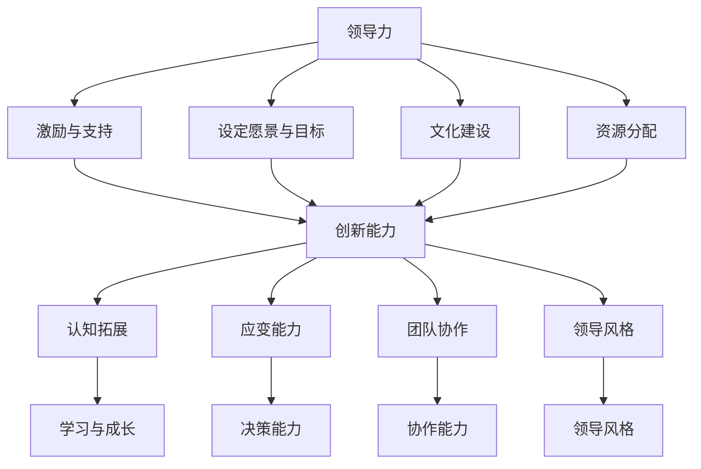

                 


### 《领导力与创新：培养创新文化的策略》

#### 关键词
- 领导力
- 创新
- 文化
- 战略
- 组织管理

#### 摘要
本文旨在探讨领导力与创新之间的关系，以及如何通过有效的领导力策略来培养创新文化。首先，我们将分析领导力与创新能力的关系，并介绍创新文化的重要性。接着，我们将详细讨论创新领导力的策略，包括领导者如何塑造创新文化、培养员工的创新能力以及建立创新流程与机制。随后，通过实际案例展示成功创新的路径，并探讨创新在企业实践中的应用。最后，我们将提出提升创新领导力的策略和实践方法，以帮助组织在竞争激烈的环境中保持创新活力。

----------------------------------------------------------------

## 第一部分：领导力与创新能力概述

### 1.1. 领导力与创新能力的关系

#### 1.1.1 领导力定义与分类
领导力是指领导者通过影响他人来实现共同目标的能力。根据不同的领导风格和目标，领导力可以分为传统领导力和创新性领导力。

- **传统领导力**：强调权威、控制和效率，领导者通过指示和命令来管理团队。
- **创新性领导力**：强调愿景、变革和合作，领导者通过激励和启发团队来推动创新。

#### 1.1.2 创新能力定义与分类
创新能力是指个体或组织在创造新产品、新服务或新想法方面的能力。创新能力可以分为以下三个层次：

- **创新思维**：指个体或组织在解决问题和寻找新思路时展现出的创造性思维。
- **创新方法**：指个体或组织采用的具体方法和技术来促进创新过程。
- **创新成果**：指个体或组织通过创新活动所取得的具体成果，如新产品、新服务或新市场。

#### 1.1.3 领导力与创新能力的相互作用
领导力与创新能力的相互作用是促进组织发展的重要动力。有效的领导力能够激发员工的创新潜能，培养创新文化，从而推动组织的创新进程。

- **领导力促进创新能力**：领导者通过设定愿景、提供资源和支持，激励员工尝试新思路，从而促进创新能力的提升。
- **创新能力增强领导力**：通过创新活动，领导者能够不断学习和成长，提高自身的领导能力，从而更好地引导组织前进。

### 1.2. 创新文化的重要性

#### 1.2.1 创新文化的定义与特点
创新文化是指组织内部普遍认同和追求的创新价值观和行为模式。创新文化具有以下特点：

- **开放性**：鼓励不同观点和意见的交流，欢迎外部创新。
- **尝试精神**：鼓励尝试新方法，接受失败并从中学习。
- **支持风险承担**：为员工提供尝试新项目的机会，并支持他们在过程中承担必要的风险。
- **互相学习与分享**：通过团队协作和知识共享，促进创新能力的提升。

#### 1.2.2 创新文化对组织的影响
创新文化对组织的影响主要体现在以下几个方面：

- **提高创新能力**：创新文化鼓励员工思考和尝试新思路，从而提高组织的整体创新能力。
- **增强组织竞争力**：创新文化使组织能够更快地响应市场变化，开发出更具竞争力的产品和服务。
- **促进员工发展**：创新文化为员工提供了成长和发展的机会，激发他们的工作热情和创造力。

----------------------------------------------------------------

## 第二部分：创新领导力策略

### 2.1. 领导者如何塑造创新文化

#### 2.1.1 领导者角色与行为
领导者塑造创新文化需要从自身角色和行为入手，具体包括以下几个方面：

- **设定愿景**：领导者应明确组织的愿景和目标，使员工认识到创新的重要性，并为之努力。
- **鼓励分享**：领导者应鼓励员工分享自己的想法和观点，促进知识的传递和交流。
- **支持实验**：领导者应为员工提供尝试新项目的机会，并支持他们在过程中承担必要的风险。

#### 2.1.2 领导者如何激励创新
领导者激励创新的方法主要包括以下几点：

- **提供资源**：为员工提供足够的资源，如资金、设备和技术支持，以便他们开展创新活动。
- **奖励机制**：建立合理的奖励机制，对在创新方面取得成果的员工给予奖励和认可。
- **营造氛围**：营造一个开放、包容、鼓励尝试的氛围，让员工感受到创新是受到支持和尊重的。

### 2.2. 培养员工的创新能力

#### 2.2.1 教育与培训
教育与培训是培养员工创新能力的重要途径。以下是一些具体的教育与培训方法：

- **创新思维培训**：通过培训课程和实践活动，帮助员工掌握创新思维的方法和技巧。
- **创新方法论培训**：教授员工如何运用创新方法论，如TRIZ、头脑风暴等，以提高创新效率。

#### 2.2.2 鼓励员工尝试与创新
鼓励员工尝试与创新需要从以下几个方面入手：

- **提供机会**：为员工提供参与创新项目的机会，让他们在实践中提升创新能力。
- **降低风险**：通过风险管理和激励机制，降低员工在创新过程中的风险，鼓励他们大胆尝试。
- **知识共享**：鼓励员工在创新过程中分享知识和经验，促进团队协作和共同成长。

### 2.3. 建立创新流程与机制

#### 2.3.1 创新流程设计
建立创新流程是确保创新活动顺利进行的关键。以下是一些创新流程设计的方法：

- **概念验证**：在项目初期进行概念验证，以验证创新想法的可行性和价值。
- **产品开发**：在概念验证通过后，进行产品开发，包括设计、开发、测试和优化等环节。
- **市场推广**：在产品开发完成后，进行市场推广，以实现创新成果的商业化。

#### 2.3.2 创新机制建立
建立创新机制是确保创新活动持续进行的重要保障。以下是一些创新机制建立的方法：

- **内部竞争**：通过内部竞赛或挑战，激发员工的创新潜力，提高组织整体的创新能力。
- **开放合作**：与其他组织或个人建立合作关系，共同开展创新项目，实现资源共享和优势互补。

----------------------------------------------------------------

## 第三部分：创新案例与应用

### 3.1. 创新成功案例解析

#### 3.1.1 案例一：谷歌的“20%时间”

**案例背景**：
谷歌的“20%时间”政策允许员工将20%的工作时间用于自己感兴趣的项目。这一政策鼓励员工进行创新尝试，许多成功的产品，如Gmail和Google News，都源于这个政策。

**创新成果**：
通过“20%时间”政策，谷歌成功地激发了许多员工的创新潜力，推动了公司的发展。

**对组织的影响**：
“20%时间”政策不仅提高了员工的工作积极性，还促进了公司的创新能力，为谷歌带来了许多竞争优势。

#### 3.1.2 案例二：苹果的“创新实验室”

**案例背景**：
苹果公司设有专门的“创新实验室”，用于研究新技术和产品。这个实验室为员工提供了自由探索的空间，让他们能够发挥自己的创造力。

**创新成果**：
苹果的“创新实验室”推动了公司许多创新产品的开发，如iPhone和iPad。

**对组织的影响**：
“创新实验室”政策使得苹果公司在科技领域始终保持领先地位，推动了公司的持续发展。

### 3.2. 创新在企业实践中的应用

#### 3.2.1 企业创新战略规划

**创新目标设定**：
企业应根据自身的业务特点和市场需求，设定明确的创新目标，确保创新活动与企业的长期战略相一致。

**创新资源分配**：
企业应合理分配资源，如资金、人力和技术支持，以确保创新项目的顺利进行。

#### 3.2.2 创新在企业管理中的应用

**创新人力资源管理**：
企业应建立创新人才激励机制，吸引和留住创新人才，为创新活动提供人力保障。

**创新财务管理**：
企业应建立创新成本核算和风险控制机制，确保创新项目的经济效益。

#### 3.2.3 创新在市场营销中的应用

**创新产品开发**：
企业应通过市场调研和用户反馈，不断优化产品，满足市场需求。

**创新市场策略**：
企业应采用创新的营销策略，如社交媒体营销、内容营销等，提高市场竞争力。

----------------------------------------------------------------

## 第四部分：创新领导力提升与实践

### 4.1. 创新领导力提升策略

#### 4.1.1 领导者自我提升

**领导者自我提升的重要性**：
领导者自我提升是提高创新领导力的重要前提。以下是一些领导者自我提升的方法：

- **学习与创新方法论**：领导者应不断学习新的创新方法论，掌握创新工具和技巧。
- **培养批判性思维**：领导者应培养批判性思维，学会质疑和反思，以更好地推动创新。

#### 4.1.2 领导者团队建设

**建立学习型团队**：
领导者应推动团队建立学习型组织，鼓励团队成员相互学习、共同成长。

**促进团队协作**：
领导者应营造良好的团队协作氛围，确保团队成员能够充分发挥各自的潜力。

### 4.2. 创新实践与反馈

#### 4.2.1 创新实践方法

**试错法**：
领导者应鼓励员工采用试错法，通过不断尝试和调整，找到最优的创新方案。

**模仿创新**：
领导者可以借鉴其他组织的成功经验，结合自身实际情况，进行模仿创新。

#### 4.2.2 创新反馈机制

**建立反馈渠道**：
领导者应建立有效的反馈渠道，收集员工和客户的反馈，及时调整创新方案。

**及时调整与优化**：
领导者应根据反馈结果，及时调整和创新方案，优化创新过程，提高创新效果。

----------------------------------------------------------------

## 参考文献

### 4.3. 参考文献
- Anderson, P. (2006). The Long Tail: Why the Future of Business Is Selling Less of More. Hyperion.
- Christensen, C. M. (1997). The Innovator's Dilemma: When New Technologies Cause Great Firms to Fail. Harvard Business Review.
- Drucker, P. F. (1999). The Age of Discontinuity: Guidelines to Our Changing Society. HarperCollins.
- Hargadon, A., & Sutton, R. I. (1997). Building Breakthrough Businesses: How to Establish Your Company as a Leader in a New Market. Harvard Business Review.
- Isaak, J. D. (1999). The Inevitable Revolution in the Managerial Functions. Journal of Business Strategy.
- Khanna, T., & Paley, D. (2000). The Emerging Markets Century: How a New Breed of World-Class Companies Is Harnessing the Power of Global Markets to Grow. Harvard Business Review.
- Toffler, A. (1980). The Third Wave: The Classic Forecast of the Revolutions to Come. William Morrow and Company.
- von Hippel, E. (1988). Spontaneous Generation of Technology Rules. Research Policy.
- Weick, K. E. (1995). Sensemaking in Organizations. Sage Publications.
- Weintraub, E. (2004). The Playful Dynamic: An Alternative Model of Creativity in Design. Design Issues.
- Zenger, T. R., & Lawrence, B. S. (2003). Leveraging Innovation Through Corporate Venturing. Organization Science.

## 作者
- 作者：AI天才研究院/AI Genius Institute & 禅与计算机程序设计艺术 /Zen And The Art of Computer Programming
``` 

### 1.3 领导力与创新能力的相互作用

领导力与创新能力的相互作用在组织发展中起到了至关重要的作用。有效的领导力不仅能够激发员工的创新潜力，还能为创新活动提供必要的支持和资源。

#### 领导力促进创新能力

领导力在促进创新能力方面的作用主要体现在以下几个方面：

1. **设定愿景和目标**：领导者通过设定明确的愿景和目标，为员工指明创新的方向，激发员工的创新动力。

2. **提供资源和支持**：领导者通过提供资金、人力和技术支持，为创新活动提供必要的保障，确保创新项目能够顺利实施。

3. **营造创新氛围**：领导者通过营造一个开放、包容、鼓励尝试和失败的氛围，降低员工在创新过程中的风险，鼓励他们勇于尝试和创新。

4. **激励和奖励**：领导者通过设立合理的激励和奖励机制，对在创新方面取得成绩的员工给予认可和奖励，激发员工的创新热情。

#### 创新能力增强领导力

创新能力对领导力的增强作用主要体现在以下几个方面：

1. **提升领导者的认知能力**：通过参与创新活动，领导者能够不断学习和积累新的知识和技能，提高自身的认知能力。

2. **增强领导者的应变能力**：创新能力使领导者能够快速适应市场变化和新技术的发展，提高组织的应变能力。

3. **提高领导者的决策能力**：创新活动中的试错和调整过程，使领导者学会如何做出更为明智和有效的决策。

4. **增强领导者的团队协作能力**：创新活动往往需要团队协作，领导者通过推动团队协作，提高自身的团队管理能力。

### 1.4 小结

领导力与创新能力的相互作用是组织发展的重要动力。领导力能够激发和引导创新能力，而创新能力又能为领导力提供新的视角和思路。通过有效的领导力策略，组织可以培养出创新文化，推动组织的持续发展。

----------------------------------------------------------------

### 2.1.1 领导者角色与行为

领导者塑造创新文化需要从自身角色和行为入手，以下是一些关键的领导者角色与行为：

#### 2.1.1.1 设定愿景

领导者应明确组织的愿景和目标，为员工指明创新的方向。一个清晰的愿景能够激发员工的热情，使他们在创新过程中始终保持动力和使命感。愿景的设定需要具备以下特点：

- **明确性**：愿景应具体、明确，使员工能够清楚地了解创新的目标和意义。
- **挑战性**：愿景应具有一定的挑战性，激发员工的潜力和创造力。
- **可行性**：愿景应具有可行性，确保员工在努力实现愿景的过程中不会感到过于困难。

**示例**：某公司领导者的愿景是成为全球领先的人工智能解决方案提供商，通过创新技术推动社会的进步。

#### 2.1.1.2 鼓励分享

领导者应鼓励员工分享自己的想法和观点，促进知识的传递和交流。分享不仅有助于员工之间的合作，还能激发新的创意和灵感。以下是一些鼓励分享的方法：

- **开放会议**：定期组织开放会议，让员工自由地分享自己的想法和观点。
- **知识分享平台**：建立知识分享平台，如内部博客或论坛，让员工可以随时分享知识和经验。
- **奖励机制**：设立奖励机制，对积极分享的员工给予表彰和奖励。

**示例**：某公司通过每月举办“创新分享会”，鼓励员工分享自己的创新想法和项目进展，促进团队之间的交流与合作。

#### 2.1.1.3 支持实验

领导者应支持员工进行实验，鼓励他们在创新过程中尝试新思路和方法。实验是创新的重要环节，通过不断的试错和优化，员工能够找到最佳的创新方案。以下是一些支持实验的方法：

- **提供资源**：为员工提供必要的资源和工具，如资金、设备和人力资源。
- **风险管理**：建立风险管理机制，降低员工在实验过程中的风险，鼓励他们勇于尝试。
- **时间安排**：为员工提供足够的时间进行实验，确保他们能够在实验过程中充分思考和调整。

**示例**：某公司领导者为员工提供了“创新实验基金”，用于支持他们的创新项目，使员工能够有更多机会进行实验和尝试。

#### 2.1.1.4 倾听与反馈

领导者应倾听员工的意见和建议，给予他们及时的反馈。倾听不仅能够增强员工对领导者的信任，还能帮助领导者了解员工的真实需求和想法，为创新活动提供有针对性的支持。

以下是一些倾听与反馈的方法：

- **定期交流**：定期与员工进行交流，了解他们在创新过程中的困难和需求。
- **匿名反馈**：建立匿名反馈机制，让员工能够自由地表达意见和建议。
- **反馈会议**：组织反馈会议，对员工提出的意见和建议进行讨论和评估。

**示例**：某公司领导者每周都会安排一次“创新反馈会”，与员工共同讨论创新项目的问题和改进方案，确保员工的意见和建议得到充分重视和落实。

### 2.1.2 领导者如何激励创新

领导者激励创新是培养创新文化的重要一环。以下是一些领导者激励创新的方法：

#### 2.1.2.1 提供资源

领导者应确保创新活动所需的资源得到充分保障。资源包括资金、设备、技术支持和人力资源。以下是一些提供资源的方法：

- **预算分配**：为创新项目提供专项预算，确保项目在资源方面得到充分支持。
- **技术支持**：为员工提供最新的技术和工具，帮助他们更好地开展创新工作。
- **人才引进**：招聘具有创新能力和经验的员工，为组织带来新的思维和方法。

**示例**：某公司领导者为创新项目提供了充足的资金支持，并引进了一批具有人工智能背景的高层次人才，为项目的成功实施提供了有力保障。

#### 2.1.2.2 奖励机制

领导者应建立合理的奖励机制，对在创新方面取得成绩的员工给予表彰和奖励。奖励不仅能够激励员工，还能增强组织的创新氛围。以下是一些奖励机制的方法：

- **物质奖励**：为在创新方面取得显著成绩的员工提供奖金、晋升机会等物质奖励。
- **精神奖励**：为在创新方面取得成绩的员工颁发荣誉证书、荣誉称号等精神奖励。
- **团队奖励**：对在创新方面取得团队协作成果的团队进行整体奖励，鼓励团队之间的合作。

**示例**：某公司对在创新项目中取得优异成绩的员工进行了公开表彰，并为他们颁发了“创新先锋”称号，激励更多员工参与到创新活动中来。

#### 2.1.2.3 营造氛围

领导者应营造一个开放、包容、鼓励尝试和失败的氛围，使员工在创新过程中感到自由和安全。以下是一些营造氛围的方法：

- **透明沟通**：建立透明的沟通机制，让员工了解组织的战略目标和进展，增强他们的参与感和归属感。
- **鼓励尝试**：鼓励员工勇于尝试新思路和方法，即使失败也能得到支持和理解。
- **包容失败**：对在创新过程中出现的失败给予包容和理解，让员工从失败中吸取教训，不断进步。

**示例**：某公司领导者在一次内部会议上明确表示，失败是创新过程中的必然部分，公司会给予失败的员工充分的支持和鼓励，帮助他们重新站起来。

### 2.1.3 领导者应具备的创新能力

领导者不仅要具备传统的领导力，还需要具备创新能力，以更好地引领组织发展。以下是一些领导者应具备的创新能力：

#### 2.1.3.1 开放性思维

领导者应具备开放性思维，愿意接受新的观点和方法，不断挑战自己的思维方式。以下是一些培养开放性思维的方法：

- **学习新知识**：不断学习新知识和新技能，保持对新技术、新趋势的关注。
- **跨学科思考**：尝试从不同学科和领域寻找灵感，运用跨学科思维方式解决问题。
- **反思与自我提升**：定期反思自己的思维方式和行为习惯，不断寻找改进的机会。

**示例**：某公司领导者定期参加行业研讨会和培训课程，学习最新的行业趋势和前沿技术，以提升自己的创新能力。

#### 2.1.3.2 批判性思维

领导者应具备批判性思维，能够对现有观念和方法进行质疑和反思，发现潜在的问题和改进空间。以下是一些培养批判性思维的方法：

- **提出疑问**：对现有的观点和方法提出质疑，寻找合理的解释和证据。
- **对比分析**：对不同观点和方法进行对比分析，找出各自的优缺点。
- **寻求证据**：寻找实际证据来支持或反驳某个观点，避免主观臆断。

**示例**：某公司领导者在制定新项目计划时，对不同的方案进行了详细的对比分析，并寻求相关专家的意见，最终选择了最佳方案。

#### 2.1.3.3 适应性思维

领导者应具备适应性思维，能够根据环境和情况的变化，灵活调整自己的策略和行为。以下是一些培养适应性思维的方法：

- **关注变化**：密切关注市场和技术的发展趋势，及时发现变化和机会。
- **灵活调整**：在面对变化时，能够迅速调整自己的策略和行为，确保组织能够适应新的环境。
- **学习适应**：从失败和成功中学习适应能力，不断提升自己的应变能力。

**示例**：某公司领导者在面对市场需求的变化时，迅速调整了产品策略，推出了符合市场需求的创新产品，成功赢得了市场份额。

### 2.1.4 小结

领导者塑造创新文化需要从自身角色和行为入手，设定愿景、鼓励分享、支持实验和倾听与反馈，同时激励创新并提供必要的资源。领导者还应具备开放性思维、批判性思维和适应性思维，以更好地引领组织发展。通过这些策略和实践，领导者可以培养出创新文化，推动组织的持续发展。

----------------------------------------------------------------

### 2.2.1 教育与培训

教育与培训是培养员工创新能力的重要手段。通过系统的教育和培训，员工可以掌握创新思维的方法和技巧，提高创新能力。以下是一些具体的教育与培训方法：

#### 2.2.1.1 创新思维培训

创新思维培训旨在帮助员工掌握创新思维的方法和技巧，提高解决复杂问题的能力。以下是一些常见的创新思维培训方法：

1. **头脑风暴**：
   - **定义**：头脑风暴是一种集思广益的方法，鼓励参与者提出尽可能多的想法，不考虑这些想法的可行性。
   - **应用**：通过组织定期的头脑风暴会议，员工可以共同探讨创新项目，激发创意。

2. **思维导图**：
   - **定义**：思维导图是一种用于组织和表达思想的图形化工具，通过节点和连接线展示思维过程。
   - **应用**：员工可以通过思维导图梳理问题，构建解决方案，提高思维的条理性和逻辑性。

3. **设计思考**：
   - **定义**：设计思考是一种以用户为中心的创新方法，强调通过原型设计和迭代改进来解决问题。
   - **应用**：通过设计思考培训，员工可以学会如何将用户需求转化为实际解决方案，提高产品的用户满意度。

#### 2.2.1.2 创新方法论培训

创新方法论培训旨在教授员工如何运用特定的创新方法和技术来促进创新过程。以下是一些常见的创新方法论培训内容：

1. **TRIZ**：
   - **定义**：TRIZ（理论问题解决）是一种基于科学原理和理论的方法论，用于解决复杂问题。
   - **应用**：通过TRIZ培训，员工可以学会如何运用40个基本问题解决原理来解决实际问题。

2. **头脑风暴**：
   - **定义**：头脑风暴是一种集思广益的方法，鼓励参与者提出尽可能多的想法，不考虑这些想法的可行性。
   - **应用**：通过组织定期的头脑风暴会议，员工可以共同探讨创新项目，激发创意。

3. **六顶思考帽**：
   - **定义**：六顶思考帽是一种思维训练方法，通过分别戴上面具来模拟不同的思考角色，如蓝色思考帽（逻辑）、红色思考帽（情感）等。
   - **应用**：六顶思考帽可以帮助团队在不同阶段进行有效的思考和决策。

#### 2.2.1.3 创新意识培养

创新意识是员工在面对问题和挑战时主动寻找创新解决方案的内在驱动力。以下是一些培养创新意识的方法：

1. **案例分析**：
   - **定义**：通过分析成功和创新案例，员工可以了解创新的实践和方法。
   - **应用**：组织定期的案例分析会，让员工分享和学习不同的创新实践。

2. **创新竞赛**：
   - **定义**：创新竞赛是一种激发员工创新潜力的活动，通过比赛的形式鼓励员工提出创新方案。
   - **应用**：定期举办创新竞赛，为员工提供展示自己创新能力的机会。

3. **创新论坛**：
   - **定义**：创新论坛是一种交流和创新思想的平台，通过邀请行业专家和内部员工分享创新经验。
   - **应用**：举办创新论坛，促进员工之间的交流和学习。

#### 2.2.1.4 创新环境建设

创新环境是员工进行创新活动的重要基础。以下是一些建设创新环境的方法：

1. **开放式办公空间**：
   - **定义**：开放式办公空间是一种鼓励员工自由交流和合作的办公环境。
   - **应用**：设计开放式办公空间，为员工提供更多交流的机会。

2. **创新实验室**：
   - **定义**：创新实验室是一个专门用于实验和创新的空间，配备有先进的技术和设备。
   - **应用**：建立创新实验室，为员工提供实验和尝试新技术的场所。

3. **灵活的工作时间**：
   - **定义**：灵活的工作时间是指为员工提供更加灵活的工作安排，以适应他们的创新需求。
   - **应用**：实施灵活的工作时间政策，鼓励员工在需要时进行创新活动。

### 2.2.2 鼓励员工尝试与创新

鼓励员工尝试与创新是培养创新文化的重要一环。以下是一些具体的鼓励员工尝试与创新的方法：

#### 2.2.2.1 提供机会

提供机会是鼓励员工尝试与创新的关键。以下是一些提供机会的方法：

1. **项目立项**：
   - **定义**：项目立项是指为员工提供自主立项的机会，让他们自行提出和实施创新项目。
   - **应用**：定期举办项目立项会，为员工提供项目立项的机会。

2. **内部创新竞赛**：
   - **定义**：内部创新竞赛是一种鼓励员工提出创新方案的竞赛活动。
   - **应用**：举办内部创新竞赛，激发员工的创新热情。

3. **开放实验室**：
   - **定义**：开放实验室是指为员工提供开放的创新实验场所，让他们可以自由进行实验和创新。
   - **应用**：建立开放实验室，为员工提供自由探索和创新的空间。

#### 2.2.2.2 降低风险

降低风险是鼓励员工尝试与创新的重要保障。以下是一些降低风险的方法：

1. **风险管理机制**：
   - **定义**：风险管理机制是指建立一套流程和制度，用于识别、评估和管理创新过程中的风险。
   - **应用**：建立风险管理机制，确保创新项目的顺利进行。

2. **实验资金支持**：
   - **定义**：实验资金支持是指为员工提供实验项目的资金支持，帮助他们降低创新成本。
   - **应用**：设立实验资金支持计划，为员工提供必要的资金支持。

3. **反馈与改进**：
   - **定义**：反馈与改进是指通过收集反馈和评估结果，对创新项目进行改进和优化。
   - **应用**：定期收集员工和用户的反馈，对创新项目进行改进和优化。

#### 2.2.2.3 知识共享

知识共享是鼓励员工尝试与创新的重要手段。以下是一些知识共享的方法：

1. **内部知识库**：
   - **定义**：内部知识库是指建立一套用于存储和共享员工知识和经验的系统。
   - **应用**：建立内部知识库，方便员工随时获取和共享知识。

2. **知识分享会**：
   - **定义**：知识分享会是一种定期组织的学习和分享活动，用于分享员工的知识和经验。
   - **应用**：定期举办知识分享会，促进员工之间的知识交流。

3. **跨部门合作**：
   - **定义**：跨部门合作是指不同部门之间的合作，通过共享资源和经验来推动创新。
   - **应用**：鼓励跨部门合作，促进不同部门之间的知识共享和协作。

### 2.2.3 鼓励员工尝试与创新的方法总结

通过教育与培训、提供机会、降低风险和知识共享等多种方法，企业可以有效地鼓励员工尝试与创新。这些方法不仅能够提高员工的创新能力，还能够培养出创新文化，推动企业的持续发展。

### 2.2.4 小结

教育与培训、提供机会、降低风险和知识共享是培养员工创新能力的关键方法。通过这些方法，企业可以有效地激发员工的创新潜力，培养出创新文化，为企业的持续发展提供强大动力。

----------------------------------------------------------------

### 2.3.1 创新流程设计

创新流程设计是确保创新活动有序进行的重要环节。一个良好的创新流程可以帮助企业有效地管理创新项目，提高创新效率。以下是一些关键的创新流程设计方法：

#### 2.3.1.1 概念验证

概念验证（Proof of Concept，简称PoC）是指在项目初期对创新想法的可行性进行验证。通过概念验证，企业可以确定创新项目是否值得进一步投入资源。以下是一些概念验证的方法：

1. **最小可行性产品（Minimum Viable Product，简称MVP）**：
   - **定义**：MVP是一个具有基本功能的产品版本，旨在验证市场对产品的需求。
   - **应用**：通过开发MVP，企业可以在最低成本和最短时间内验证创新想法的可行性。

2. **快速原型（Rapid Prototyping）**：
   - **定义**：快速原型是一种快速制作和测试原型的方法，用于验证创新概念。
   - **应用**：通过快速原型，企业可以快速测试和改进创新想法，降低项目风险。

3. **用户测试**：
   - **定义**：用户测试是通过让目标用户使用产品原型来评估其功能、易用性和满意度。
   - **应用**：通过用户测试，企业可以获取真实用户的反馈，为产品优化提供依据。

#### 2.3.1.2 产品开发

产品开发是创新流程的核心环节，包括设计、开发、测试和优化等阶段。以下是一些产品开发的方法：

1. **迭代开发（Iterative Development）**：
   - **定义**：迭代开发是一种通过反复迭代来改进产品的开发方法。
   - **应用**：通过迭代开发，企业可以不断收集用户反馈，持续优化产品，提高用户满意度。

2. **敏捷开发（Agile Development）**：
   - **定义**：敏捷开发是一种基于用户需求，通过快速迭代和持续交付来开发产品的开发方法。
   - **应用**：通过敏捷开发，企业可以快速响应市场变化，提高开发效率和产品质量。

3. **精益开发（Lean Development）**：
   - **定义**：精益开发是一种通过最小化浪费，最大化价值来开发产品的开发方法。
   - **应用**：通过精益开发，企业可以减少不必要的开发活动，提高资源利用率。

#### 2.3.1.3 市场推广

市场推广是创新成果的商业化过程，旨在将创新产品推向市场，获取用户和市场份额。以下是一些市场推广的方法：

1. **市场调研**：
   - **定义**：市场调研是通过收集和分析市场数据，了解市场需求和竞争情况。
   - **应用**：通过市场调研，企业可以确定目标市场，制定合适的市场推广策略。

2. **品牌营销**：
   - **定义**：品牌营销是通过建立品牌形象，提高产品知名度和美誉度。
   - **应用**：通过品牌营销，企业可以吸引更多潜在用户，提高市场占有率。

3. **社交媒体营销**：
   - **定义**：社交媒体营销是通过社交媒体平台进行产品推广和用户互动。
   - **应用**：通过社交媒体营销，企业可以快速传播产品信息，建立用户社区。

#### 2.3.1.4 创新流程设计原则

在创新流程设计过程中，企业应遵循以下原则：

1. **用户导向**：
   - **定义**：用户导向是指将用户需求作为创新的核心，以满足用户需求为目标。
   - **应用**：在创新过程中，企业应始终关注用户需求，通过用户反馈不断优化产品。

2. **快速迭代**：
   - **定义**：快速迭代是指通过快速开发和测试，不断改进产品。
   - **应用**：企业应采用迭代开发方法，提高创新效率，缩短产品上市时间。

3. **团队合作**：
   - **定义**：团队合作是指通过跨部门协作，共同推动创新项目。
   - **应用**：企业应建立良好的团队合作机制，确保创新项目顺利进行。

4. **资源优化**：
   - **定义**：资源优化是指通过合理配置资源，提高创新项目的成功率。
   - **应用**：企业应合理分配资金、人力和技术资源，确保创新项目具备足够的资源支持。

#### 2.3.1.5 创新流程设计示例

以下是一个创新流程设计的示例：

1. **概念验证**：
   - **任务**：开发一个MVP，验证产品的基本功能是否满足用户需求。
   - **方法**：通过快速原型和用户测试，验证创新想法的可行性。

2. **产品开发**：
   - **任务**：根据用户反馈，迭代改进产品，实现产品的全面功能。
   - **方法**：采用敏捷开发方法，确保产品开发过程中的灵活性和高效性。

3. **市场推广**：
   - **任务**：通过市场调研和品牌营销，将产品推向市场，获取用户和市场份额。
   - **方法**：通过社交媒体营销，建立用户社区，提高产品知名度和用户黏性。

4. **反馈与优化**：
   - **任务**：收集用户反馈，对产品进行持续优化。
   - **方法**：通过迭代开发和用户测试，不断改进产品，提高用户体验。

通过以上创新流程设计，企业可以系统地推进创新项目，提高创新成功率，实现持续发展。

### 2.3.2 创新机制建立

创新机制的建立是确保创新活动持续进行的重要保障。以下是一些常见的创新机制建立方法：

#### 2.3.2.1 内部竞争

内部竞争机制通过激发员工之间的竞争，提高创新效率。以下是一些内部竞争的方法：

1. **创新竞赛**：
   - **定义**：创新竞赛是一种鼓励员工提出创新方案的竞赛活动。
   - **应用**：定期举办创新竞赛，激发员工的创新潜力，促进团队合作。

2. **项目排名**：
   - **定义**：项目排名是通过评估项目创新程度和成果，对项目进行排名。
   - **应用**：通过项目排名，鼓励员工积极参与创新项目，提高项目质量。

3. **绩效评估**：
   - **定义**：绩效评估是通过评估员工在创新项目中的表现，确定绩效和奖励。
   - **应用**：将创新项目表现纳入员工绩效评估体系，激励员工积极参与创新。

#### 2.3.2.2 开放合作

开放合作机制通过与其他组织或个人合作，共享资源和经验，提高创新能力。以下是一些开放合作的方法：

1. **合作伙伴关系**：
   - **定义**：合作伙伴关系是指与其他组织或个人建立合作关系，共同开展创新项目。
   - **应用**：通过合作伙伴关系，共享资源和技术，提高创新项目的成功率。

2. **外部专家咨询**：
   - **定义**：外部专家咨询是指邀请外部专家参与创新项目，提供专业意见和指导。
   - **应用**：通过外部专家咨询，引进新的思维和方法，提高创新项目的质量和效率。

3. **开放创新平台**：
   - **定义**：开放创新平台是指建立一个开放的创新平台，供内部员工和外部合作伙伴共同参与创新项目。
   - **应用**：通过开放创新平台，促进内部员工和外部合作伙伴之间的交流和合作，提高创新能力。

#### 2.3.2.3 创新资源管理

创新资源管理是确保创新活动顺利进行的重要环节。以下是一些创新资源管理的方法：

1. **创新资金**：
   - **定义**：创新资金是指为创新项目提供的专门资金支持。
   - **应用**：设立创新资金池，为创新项目提供资金支持，降低项目风险。

2. **技术创新**：
   - **定义**：技术创新是指通过引入新技术，提高产品或服务的竞争力。
   - **应用**：通过技术创新，提高产品的技术含量，增强市场竞争力。

3. **人才培养**：
   - **定义**：人才培养是指通过培训和教育，提高员工的创新能力和技能。
   - **应用**：定期组织培训和学习活动，提高员工的创新能力和专业素养。

#### 2.3.2.4 创新评价与反馈

创新评价与反馈是确保创新活动有效进行的重要手段。以下是一些创新评价与反馈的方法：

1. **创新评估**：
   - **定义**：创新评估是通过评估创新项目的创新程度、经济效益和社会效益，确定项目成果。
   - **应用**：定期对创新项目进行评估，确保项目达到预期目标。

2. **用户反馈**：
   - **定义**：用户反馈是通过收集用户对创新产品的使用体验和建议，评估产品性能和改进方向。
   - **应用**：通过用户反馈，了解用户需求，优化产品功能，提高用户体验。

3. **内部评审**：
   - **定义**：内部评审是通过内部专家对创新项目进行评审，提供改进建议。
   - **应用**：通过内部评审，确保创新项目符合企业战略和目标，提高项目质量。

#### 2.3.2.5 创新文化氛围

创新文化氛围是激发员工创新潜力的关键因素。以下是一些营造创新文化氛围的方法：

1. **开放沟通**：
   - **定义**：开放沟通是指建立开放、包容的沟通环境，鼓励员工自由表达意见和分享知识。
   - **应用**：通过开放沟通，促进员工之间的交流和合作，提高创新能力。

2. **鼓励尝试**：
   - **定义**：鼓励尝试是指为员工提供自由探索和创新的机会，鼓励他们勇于尝试新思路和方法。
   - **应用**：通过鼓励尝试，降低员工在创新过程中的风险，激发他们的创新热情。

3. **奖励机制**：
   - **定义**：奖励机制是指建立合理的奖励制度，对在创新方面取得成绩的员工给予表彰和奖励。
   - **应用**：通过奖励机制，激励员工积极参与创新活动，提高创新成果。

通过以上创新机制建立方法，企业可以构建一个良好的创新环境，激发员工的创新潜力，提高创新能力，实现持续发展。

### 2.3.3 创新流程设计与创新机制建立的关系

创新流程设计和创新机制建立是相辅相成的。创新流程设计为创新活动提供了具体的操作方法和步骤，确保创新项目能够有序进行。而创新机制建立则为创新活动提供了持续的动力和保障，确保创新文化能够在组织内得到广泛推广和应用。

1. **创新流程设计为创新机制提供操作基础**：
   - 通过创新流程设计，企业可以明确创新项目的各个阶段和关键节点，确保创新活动按照既定路线进行。
   - 创新流程设计中的方法和技术，如MVP、迭代开发和用户测试等，为创新机制提供了具体的操作手段。

2. **创新机制建立为创新流程提供动力和保障**：
   - 通过建立创新机制，企业可以激发员工的创新热情，鼓励他们积极参与创新项目。
   - 创新机制中的竞争机制、合作机制和奖励机制等，为创新流程提供了持续的动力和支持。

3. **创新流程设计与创新机制建立相互促进**：
   - 创新流程设计可以帮助企业更好地理解和把握创新过程，为创新机制建立提供依据。
   - 创新机制建立可以激发员工创新的潜力，为创新流程设计提供更多的实践经验和改进方向。

总之，创新流程设计与创新机制建立是相辅相成的，通过二者结合，企业可以构建一个良好的创新环境，推动创新活动的持续进行，实现组织的创新发展。

### 2.3.4 小结

创新流程设计和创新机制建立是培养创新文化的重要手段。通过设计合理的创新流程，企业可以确保创新项目有序进行，提高创新效率。通过建立有效的创新机制，企业可以激发员工的创新潜力，培养创新文化。二者相辅相成，共同推动企业的创新发展。

----------------------------------------------------------------

### 3.1.1 案例一：谷歌的“20%时间”

**案例背景**

谷歌的“20%时间”政策是一项极具创新性的员工自主工作时间安排。这项政策始于2002年，允许每位谷歌员工将每周工作时间的20%用于自己感兴趣的项目。这一政策的初衷是为了激发员工的创造力，推动公司的创新。

**创新成果**

通过“20%时间”政策，谷歌成功地激发了员工的创新潜力，诞生了许多著名的产品和服务。以下是几个著名的例子：

1. **Gmail**：
   - **开发背景**：谷歌工程师Paul Buchheit利用“20%时间”开发了Gmail，一款具备大量存储空间、搜索功能强大的电子邮件服务。
   - **市场反响**：Gmail上线后，迅速获得了用户的喜爱，成为了全球最受欢迎的电子邮件服务之一。

2. **Google News**：
   - **开发背景**：谷歌工程师Gaedeke和Marshall Mathers利用“20%时间”开发了Google News，一款自动聚合和分类新闻的网站。
   - **市场反响**：Google News上线后，以其精确的新闻分类和实时的更新赢得了用户的赞誉，迅速成为新闻搜索引擎的领导者。

3. **Orkut**：
   - **开发背景**：谷歌工程师Henriksson在“20%时间”期间开发了Orkut，一个基于兴趣社交的平台。
   - **市场反响**：Orkut在印度和巴西等地区取得了巨大成功，成为了这些地区最受欢迎的社交网络之一。

**对组织的影响**

“20%时间”政策对谷歌产生了深远的影响，推动了公司的创新发展和市场竞争力：

1. **激发员工创造力**：
   - 通过允许员工将工作时间的一部分用于自己感兴趣的项目，谷歌成功地激发了员工的创造力，使公司能够持续推出创新产品。

2. **提高员工满意度**：
   - “20%时间”政策使员工感到自己的工作得到了公司的认可和支持，提高了员工的满意度和忠诚度。

3. **增强市场竞争力**：
   - 通过“20%时间”政策推出的创新产品和服务，谷歌在多个领域取得了领先地位，增强了公司的市场竞争力。

### 3.1.2 案例二：苹果的“创新实验室”

**案例背景**

苹果公司非常注重创新，特别是在其产品设计和开发过程中。为了激发员工的创新潜力，苹果设立了“创新实验室”，一个专门用于研究新技术和新产品的实验室。

**创新成果**

“创新实验室”是苹果公司许多创新产品的诞生地。以下是几个著名的例子：

1. **iPhone**：
   - **开发背景**：苹果公司的“创新实验室”在2007年成功推出了第一款iPhone，一款具备触摸屏和互联网功能的智能手机。
   - **市场反响**：iPhone不仅改变了智能手机市场，还成为了苹果公司的主要收入来源。

2. **iPad**：
   - **开发背景**：苹果公司的“创新实验室”在2010年推出了iPad，一款具备便携性和多功能的平板电脑。
   - **市场反响**：iPad迅速获得了用户的喜爱，成为了平板电脑市场的领导者。

3. **Apple Watch**：
   - **开发背景**：苹果公司的“创新实验室”在2015年推出了Apple Watch，一款智能手表。
   - **市场反响**：Apple Watch以其先进的技术和时尚的设计赢得了用户的青睐，成为了智能手表市场的领军产品。

**对组织的影响**

“创新实验室”对苹果公司产生了深远的影响，推动了公司的创新发展和市场竞争力：

1. **提高创新能力**：
   - “创新实验室”为苹果员工提供了一个自由探索和创新的环境，使公司能够持续推出创新产品。

2. **增强品牌影响力**：
   - 通过“创新实验室”推出的创新产品，苹果公司树立了技术创新的典范，增强了品牌影响力。

3. **提升市场份额**：
   - 通过不断创新，苹果公司在多个领域取得了市场份额的领先地位，巩固了公司的市场地位。

### 3.1.3 创新案例总结

谷歌的“20%时间”政策和苹果的“创新实验室”都是成功激发员工创新潜力的典范。这两个案例表明，通过提供自由探索和创新的机会，企业可以激发员工的创造力，推动组织的持续创新和发展。这些案例对其他企业具有借鉴意义，鼓励企业采取类似的措施，培养创新文化，提高创新能力。

### 3.1.4 小结

谷歌的“20%时间”和苹果的“创新实验室”是成功激发员工创新潜力的典范。这些案例展示了创新文化对企业发展的积极作用，提供了宝贵的经验和启示。通过借鉴这些案例，企业可以采取有效的创新策略，培养创新文化，推动组织的持续发展。

----------------------------------------------------------------

### 3.2.1 企业创新战略规划

企业创新战略规划是确保企业能够在竞争激烈的市场中保持持续竞争力的关键。以下是一些关键的步骤和方法：

#### 3.2.1.1 创新目标设定

设定明确的创新目标是创新战略规划的首要步骤。创新目标应具体、可衡量，并与企业的长期战略目标相一致。以下是一些设定创新目标的方法：

1. **市场导向**：以市场需求为导向，设定创新目标，确保创新成果能够满足用户需求。
   - **方法**：通过市场调研和用户反馈，了解用户需求，将用户需求转化为创新目标。

2. **竞争导向**：以竞争对手的产品和市场表现为导向，设定创新目标，确保企业能够在竞争中获得优势。
   - **方法**：分析竞争对手的产品和服务，找出差距和不足，设定具有竞争力的创新目标。

3. **技术导向**：以技术创新为导向，设定创新目标，确保企业能够持续引领技术发展。
   - **方法**：关注最新的技术趋势和前沿技术，设定具有前瞻性的创新目标。

#### 3.2.1.2 创新资源分配

创新资源分配是确保创新项目能够顺利推进的关键。以下是一些创新资源分配的方法：

1. **预算分配**：为创新项目提供充足的预算支持，确保项目在资源方面得到充分保障。
   - **方法**：根据创新项目的优先级和预期成果，合理分配预算，确保重点项目得到优先支持。

2. **人力分配**：为创新项目配备合适的人力资源，确保项目能够高效推进。
   - **方法**：根据创新项目的需求，选拔具备相关技能和经验的员工参与项目，确保项目团队能够胜任。

3. **技术支持**：为创新项目提供必要的技术支持，如研发设备、软件工具等。
   - **方法**：根据创新项目的需求，采购和配置必要的技术设备和软件工具，确保项目能够顺利进行。

#### 3.2.1.3 创新流程优化

创新流程优化是提高创新效率和效果的重要手段。以下是一些创新流程优化的方法：

1. **流程标准化**：建立标准化的创新流程，确保创新项目按照统一的标准进行管理。
   - **方法**：制定创新流程手册，明确各个阶段的工作内容和要求，确保流程的一致性和可操作性。

2. **流程简化**：简化创新流程，减少不必要的环节和步骤，提高创新效率。
   - **方法**：通过流程分析和评估，找出冗余环节和步骤，进行优化和简化，减少不必要的时间和资源浪费。

3. **流程迭代**：采用迭代开发方法，不断优化和创新流程。
   - **方法**：通过定期评估和创新，发现流程中的问题和不足，进行迭代优化，提高流程的效率和质量。

#### 3.2.1.4 创新风险管理

创新风险管理是确保创新项目顺利进行的重要保障。以下是一些创新风险管理的方法：

1. **风险评估**：对创新项目进行风险评估，识别潜在的风险因素。
   - **方法**：采用风险评估工具和方法，如风险矩阵和风险清单，识别和评估创新项目的风险。

2. **风险控制**：建立风险控制机制，制定风险应对策略。
   - **方法**：根据风险评估结果，制定相应的风险控制措施，如风险规避、风险转移和风险接受，确保项目风险在可控范围内。

3. **风险监控**：建立风险监控机制，实时监控创新项目的风险状况。
   - **方法**：定期对创新项目进行风险监控和评估，及时发现和处理潜在风险，确保项目顺利进行。

### 3.2.2 创新在企业管理中的应用

创新在企业管理中的应用可以提升企业的管理水平和竞争力。以下是一些创新在企业管理中的应用方法：

#### 3.2.2.1 创新人力资源管理

创新人力资源管理是确保企业能够吸引和留住创新人才的关键。以下是一些创新人力资源管理的方法：

1. **人才招聘**：通过创新招聘手段，吸引具备创新能力和经验的人才。
   - **方法**：采用多元化招聘策略，如线上招聘、校园招聘和猎头招聘，吸引各类创新人才。

2. **人才激励**：建立合理的激励制度，激励员工的创新热情和积极性。
   - **方法**：采用物质激励和精神激励相结合的方式，如奖金、晋升和荣誉称号，激励员工积极参与创新项目。

3. **人才发展**：为员工提供持续的学习和发展机会，提升员工的创新能力。
   - **方法**：建立内部培训体系和外部培训合作，为员工提供多样化的学习和发展机会，促进员工的专业成长。

#### 3.2.2.2 创新财务管理

创新财务管理是确保企业创新项目顺利实施的重要保障。以下是一些创新财务管理的方法：

1. **预算管理**：建立创新的预算管理机制，提高预算使用效率。
   - **方法**：采用零基预算和项目预算相结合的方式，确保预算的合理使用和有效控制。

2. **成本控制**：通过创新成本控制方法，降低创新项目的成本。
   - **方法**：采用价值工程和价值分析等方法，优化项目成本结构，降低成本。

3. **风险投资**：建立风险投资机制，为创新项目提供资金支持。
   - **方法**：设立创新风险投资基金，支持创新项目的研发和实施。

#### 3.2.2.3 创新流程管理

创新流程管理是确保企业创新项目高效运行的关键。以下是一些创新流程管理的方法：

1. **流程设计**：通过创新流程设计，提高创新项目的效率和质量。
   - **方法**：采用精益流程设计和敏捷开发方法，优化创新流程，提高项目的交付速度和效果。

2. **流程监控**：建立创新的流程监控机制，实时监控创新项目的进展和效果。
   - **方法**：采用关键绩效指标（KPI）和流程监控工具，实时跟踪项目进展，及时发现问题并进行调整。

3. **流程优化**：通过不断优化和创新流程，提高创新项目的成功率。
   - **方法**：采用流程评估和反馈机制，定期对流程进行评估和优化，确保流程的持续改进。

### 3.2.3 小结

企业创新战略规划是确保企业能够持续创新和发展的关键。通过设定明确的目标、合理的资源分配、优化的流程管理和有效的风险管理，企业可以激发员工的创新潜力，提高创新能力，实现持续发展。

----------------------------------------------------------------

### 3.2.4 创新在市场营销中的应用

创新在市场营销中的应用是企业在激烈竞争的市场环境中脱颖而出、赢得顾客青睐的重要策略。以下是一些创新在市场营销中的应用方法：

#### 3.2.4.1 创新产品开发

创新产品开发是指通过引入新技术、新功能或新设计来满足顾客需求，创造市场机会。以下是一些创新产品开发的方法：

1. **市场调研**：
   - **定义**：通过市场调研，了解消费者的需求和偏好，为产品开发提供依据。
   - **应用**：定期进行市场调研，收集消费者反馈，分析市场趋势，为产品创新提供方向。

2. **用户体验设计**：
   - **定义**：用户体验设计（UX Design）是一种以用户为中心的设计方法，旨在提升产品易用性和用户满意度。
   - **应用**：通过用户体验设计，优化产品界面和交互设计，提升用户的使用体验。

3. **快速迭代开发**：
   - **定义**：快速迭代开发是一种通过快速构建、测试和改进产品，以快速响应市场变化的方法。
   - **应用**：采用敏捷开发方法，快速迭代产品，及时收集用户反馈，持续优化产品功能。

#### 3.2.4.2 创新市场策略

创新市场策略是指通过独特的营销策略和手段，提高产品的市场占有率和品牌知名度。以下是一些创新市场策略的方法：

1. **内容营销**：
   - **定义**：内容营销是通过创造和分享有价值的内容，吸引潜在顾客，建立品牌权威性。
   - **应用**：通过博客、社交媒体、视频等多种形式，发布与产品相关的有价值内容，吸引目标顾客。

2. **社交媒体营销**：
   - **定义**：社交媒体营销是通过社交媒体平台进行产品推广和用户互动，提高品牌知名度和用户参与度。
   - **应用**：利用Facebook、Twitter、Instagram等社交媒体平台，发布产品信息、互动活动，提高品牌曝光度。

3. **个性化营销**：
   - **定义**：个性化营销是根据消费者的行为数据和偏好，提供个性化的产品推荐和营销信息。
   - **应用**：通过大数据分析和用户行为分析，为消费者提供个性化的产品推荐和定制化服务。

#### 3.2.4.3 创新营销工具

创新营销工具是指利用新技术和工具，提高营销效率和效果。以下是一些创新营销工具的方法：

1. **人工智能（AI）**：
   - **定义**：人工智能是一种模拟人类智能的技术，可以用于数据分析、客户画像、自动化营销等。
   - **应用**：利用人工智能技术，进行数据挖掘和预测分析，实现精准营销和自动化营销。

2. **大数据分析**：
   - **定义**：大数据分析是通过分析和处理大量数据，发现数据中的模式和趋势，为决策提供依据。
   - **应用**：通过大数据分析，了解消费者行为和市场趋势，制定更具针对性的营销策略。

3. **虚拟现实（VR）和增强现实（AR）**：
   - **定义**：虚拟现实和增强现实是创建虚拟环境和增强现实体验的技术，可以用于产品展示和营销活动。
   - **应用**：通过虚拟现实和增强现实技术，提供沉浸式的产品体验，提高顾客的参与度和购买意愿。

#### 3.2.4.4 创新市场策略案例分析

以下是一个创新市场策略的案例分析：

**案例：小米的“粉丝营销”策略**

小米是中国的一家知名智能手机制造商，其独特的“粉丝营销”策略在市场上取得了巨大成功。以下是小米“粉丝营销”策略的具体做法：

1. **建立粉丝社区**：
   - **定义**：建立粉丝社区，让消费者成为品牌的忠实粉丝，增强品牌忠诚度。
   - **应用**：通过小米社区、论坛和社交媒体平台，与粉丝互动，分享产品信息和用户反馈。

2. **邀请粉丝参与产品开发**：
   - **定义**：邀请粉丝参与产品开发和测试，提高产品的用户满意度。
   - **应用**：通过在线调查、用户投票等方式，让粉丝参与到新产品的设计和发布过程中。

3. **举办粉丝活动**：
   - **定义**：举办粉丝活动，如新品发布会、粉丝见面会等，增强粉丝的归属感和忠诚度。
   - **应用**：定期举办线上线下活动，如粉丝见面会、新品发布会等，与粉丝进行深度互动。

**市场效果**：

通过“粉丝营销”策略，小米成功建立了庞大的粉丝群体，提高了品牌知名度和用户忠诚度。小米的智能手机和其他电子产品在市场上的销量持续增长，成为中国乃至全球智能手机市场的重要玩家。

### 3.2.5 小结

创新在市场营销中的应用是提高企业竞争力的重要手段。通过创新产品开发、创新市场策略和创新营销工具，企业可以更好地满足消费者需求，提高市场占有率。小米的“粉丝营销”策略是成功案例之一，为其他企业提供了宝贵的借鉴和启示。

----------------------------------------------------------------

### 4.1.1 领导者自我提升

领导者自我提升是提高创新领导力的重要途径。通过不断学习和成长，领导者能够更好地应对复杂多变的环境，推动组织的创新发展。以下是一些领导者自我提升的方法：

#### 4.1.1.1 学习与创新方法论

领导者应不断学习新的创新方法论，掌握各种创新工具和技巧，以提高自身的创新能力。以下是一些学习方法：

1. **阅读书籍和文章**：
   - **定义**：通过阅读相关书籍和文章，了解最新的创新理论和实践。
   - **应用**：定期阅读与创新相关的书籍和文章，如《创新者的窘境》、《创新者的基因》等。

2. **参加培训和研讨会**：
   - **定义**：参加创新相关的培训和研讨会，学习前沿的创新理念和方法。
   - **应用**：定期参加行业内的创新培训和研讨会，与专家和同行交流，拓展视野。

3. **实践与创新项目**：
   - **定义**：通过实际参与创新项目，将创新方法论应用于实践。
   - **应用**：亲自参与创新项目，运用所学的方法论，解决实际问题，积累经验。

#### 4.1.1.2 培养批判性思维

批判性思维是领导者自我提升的关键能力之一。以下是一些培养批判性思维的方法：

1. **质疑现状**：
   - **定义**：对现有的观念、流程和制度进行质疑，寻找改进的机会。
   - **应用**：定期反思和评估组织的现状，找出存在的问题和改进空间。

2. **分析问题**：
   - **定义**：对问题进行深入分析，找出根本原因和解决方法。
   - **应用**：运用批判性思维，分析复杂的问题，制定有效的解决方案。

3. **反思与总结**：
   - **定义**：通过反思和总结，不断优化自身的思维方式和行为习惯。
   - **应用**：定期进行反思和总结，从成功和失败中吸取教训，不断提升自身能力。

#### 4.1.1.3 倾听与反馈

倾听与反馈是领导者与团队成员之间的重要沟通方式。以下是一些倾听与反馈的方法：

1. **主动倾听**：
   - **定义**：主动倾听是领导者与团队成员之间进行有效沟通的重要方式。
   - **应用**：在与团队成员沟通时，积极倾听他们的意见和建议，理解他们的想法。

2. **鼓励反馈**：
   - **定义**：鼓励团队成员提供反馈，是领导者了解团队动态和需求的重要手段。
   - **应用**：定期组织团队会议，鼓励团队成员提供工作反馈，共同讨论和解决问题。

3. **及时反馈**：
   - **定义**：及时反馈是领导者对团队成员工作表现给予及时评价和指导。
   - **应用**：在团队成员完成任务后，及时给予反馈，表扬优秀表现，指出不足之处。

#### 4.1.1.4 培养领导者的创新能力

领导者的创新能力对组织的创新文化具有重要影响。以下是一些培养领导者创新能力的方法：

1. **跨学科学习**：
   - **定义**：跨学科学习是领导者拓宽知识面、提升创新能力的重要途径。
   - **应用**：学习不同领域的知识，如设计思维、心理学、经济学等，运用跨学科思维解决复杂问题。

2. **实践与创新**：
   - **定义**：通过实践和创新，领导者能够将理论知识转化为实际行动。
   - **应用**：积极参与创新项目，尝试新的管理方法和工具，不断实践和改进。

3. **反思与调整**：
   - **定义**：反思和调整是领导者不断提升自身创新能力的重要环节。
   - **应用**：定期反思领导行为和决策效果，根据反馈进行调整和优化，提升领导力。

### 4.1.2 领导者团队建设

领导者团队建设是提高组织整体创新能力的重要环节。以下是一些领导者团队建设的策略：

#### 4.1.2.1 建立学习型团队

学习型团队是一种持续学习、不断进步的团队。以下是一些建立学习型团队的方法：

1. **共同学习目标**：
   - **定义**：共同学习目标是团队成员共同追求的学习目标。
   - **应用**：设定团队的学习目标，让团队成员明确学习方向，共同为实现目标而努力。

2. **定期学习会议**：
   - **定义**：定期学习会议是团队成员共同学习和交流的平台。
   - **应用**：定期组织学习会议，分享新知识、新观点，促进团队成员的共同成长。

3. **知识共享平台**：
   - **定义**：知识共享平台是团队成员共享知识和经验的工具。
   - **应用**：建立内部知识库、学习管理系统等平台，方便团队成员随时获取和学习知识。

#### 4.1.2.2 促进团队协作

团队协作是提高团队创新能力的关键。以下是一些促进团队协作的方法：

1. **明确角色和责任**：
   - **定义**：明确角色和责任是确保团队协作有效进行的基础。
   - **应用**：为团队成员分配明确的角色和责任，确保每个人都能在团队中发挥自己的专长。

2. **建立沟通渠道**：
   - **定义**：建立沟通渠道是团队成员之间进行有效沟通的保障。
   - **应用**：建立团队内部沟通渠道，如定期团队会议、即时通讯工具等，确保团队成员之间的信息畅通。

3. **鼓励合作和互助**：
   - **定义**：鼓励合作和互助是提高团队协作水平的重要手段。
   - **应用**：通过团队建设活动、互助计划等，鼓励团队成员相互支持、共同进步。

#### 4.1.2.3 培养领导力

领导力是团队建设中不可或缺的因素。以下是一些培养领导力的方法：

1. **领导力培训**：
   - **定义**：领导力培训是提升团队成员领导能力的重要途径。
   - **应用**：组织领导力培训课程，帮助团队成员提升领导技能，提高团队管理水平。

2. **实践与反馈**：
   - **定义**：实践与反馈是领导者提升领导能力的重要方法。
   - **应用**：鼓励团队成员在实际工作中实践领导技能，通过反馈和评估不断改进。

3. **榜样示范**：
   - **定义**：榜样示范是通过树立榜样来影响团队成员的行为和态度。
   - **应用**：通过树立团队中的优秀领导者作为榜样，激励其他成员学习榜样，提升整体领导力水平。

### 4.1.3 小结

领导者自我提升和团队建设是提高创新领导力的关键。通过不断学习、培养批判性思维、倾听与反馈，以及建立学习型团队和促进团队协作，领导者可以提升自身的领导力和创新能力，推动组织的创新发展。

----------------------------------------------------------------

### 4.2.1 创新实践方法

创新实践方法是实现创新目标的重要手段。以下是一些常见的创新实践方法：

#### 4.2.1.1 试错法

试错法是一种通过不断尝试和错误来寻找最优解决方案的方法。以下是一些试错法的具体步骤：

1. **问题定义**：
   - **定义**：明确需要解决的问题或目标。
   - **步骤**：分析问题，确定问题的核心，明确解决目标。

2. **方案生成**：
   - **定义**：生成多种可能的解决方案。
   - **步骤**：采用头脑风暴、SWOT分析等方法，列出所有可能的解决方案。

3. **方案评估**：
   - **定义**：评估每个解决方案的优缺点和可行性。
   - **步骤**：采用评分、成本效益分析等方法，评估每个解决方案的可行性。

4. **方案实施**：
   - **定义**：选择最优方案并实施。
   - **步骤**：实施选定的解决方案，并进行监控和调整。

5. **结果评估**：
   - **定义**：评估解决方案的效果。
   - **步骤**：通过实际应用和反馈，评估解决方案的有效性，并进行改进。

#### 4.2.1.2 模仿创新

模仿创新是一种借鉴其他组织的成功经验，结合自身实际情况进行创新的方法。以下是一些模仿创新的具体步骤：

1. **选择模仿对象**：
   - **定义**：选择具有成功经验和创新成果的模仿对象。
   - **步骤**：分析行业内外的成功案例，选择具有借鉴价值的模仿对象。

2. **分析模仿对象**：
   - **定义**：分析模仿对象的创新策略和成功因素。
   - **步骤**：通过市场调研、案例分析等方法，深入了解模仿对象的创新策略和成功因素。

3. **方案设计**：
   - **定义**：设计适合自身情况的创新方案。
   - **步骤**：根据模仿对象的成功经验，结合自身实际情况，设计创新方案。

4. **方案实施**：
   - **定义**：实施创新方案。
   - **步骤**：按照设计方案，实施创新项目，并进行监控和调整。

5. **效果评估**：
   - **定义**：评估创新方案的效果。
   - **步骤**：通过实际应用和反馈，评估创新方案的有效性，并进行改进。

#### 4.2.1.3 逆向工程

逆向工程是一种通过对现有产品进行分析和拆解，寻找创新灵感的方法。以下是一些逆向工程的具体步骤：

1. **选择对象**：
   - **定义**：选择具有代表性的产品或技术作为逆向工程的对象。
   - **步骤**：分析市场上受欢迎的产品或技术，选择具有借鉴价值的对象。

2. **分析产品**：
   - **定义**：分析产品的功能和设计。
   - **步骤**：通过拆解、测量、测试等方法，深入了解产品的功能和设计。

3. **寻找创新点**：
   - **定义**：寻找产品中的创新点和改进空间。
   - **步骤**：通过对比分析、用户反馈等方法，找出产品中的创新点和改进空间。

4. **方案设计**：
   - **定义**：设计基于逆向工程的创新方案。
   - **步骤**：根据逆向工程的结果，设计新的产品或技术方案。

5. **方案实施**：
   - **定义**：实施创新方案。
   - **步骤**：按照设计方案，实施创新项目，并进行监控和调整。

6. **效果评估**：
   - **定义**：评估创新方案的效果。
   - **步骤**：通过实际应用和反馈，评估创新方案的有效性，并进行改进。

#### 4.2.1.4 用户参与创新

用户参与创新是一种将用户纳入创新过程，通过用户反馈和参与来推动创新的方法。以下是一些用户参与创新的具体步骤：

1. **用户调研**：
   - **定义**：通过调研了解用户需求和期望。
   - **步骤**：采用问卷调查、用户访谈等方法，收集用户需求和期望。

2. **用户反馈**：
   - **定义**：收集用户的反馈和意见。
   - **步骤**：建立用户反馈渠道，如用户论坛、在线调查等，收集用户反馈。

3. **用户参与**：
   - **定义**：让用户参与到创新过程中。
   - **步骤**：邀请用户参与产品测试、设计评审等环节，让用户直接参与到创新过程中。

4. **方案设计**：
   - **定义**：基于用户反馈和参与，设计创新方案。
   - **步骤**：结合用户反馈和参与，设计新的产品或服务方案。

5. **方案实施**：
   - **定义**：实施创新方案。
   - **步骤**：按照设计方案，实施创新项目，并进行监控和调整。

6. **效果评估**：
   - **定义**：评估创新方案的效果。
   - **步骤**：通过实际应用和用户反馈，评估创新方案的有效性，并进行改进。

### 4.2.2 创新反馈机制

创新反馈机制是确保创新活动持续改进和优化的关键。以下是一些创新反馈机制的方法：

#### 4.2.2.1 反馈渠道

建立有效的反馈渠道是收集用户和员工反馈的重要手段。以下是一些反馈渠道的方法：

1. **用户反馈渠道**：
   - **定义**：为用户提供反馈的渠道，如在线调查、用户论坛等。
   - **步骤**：建立用户反馈平台，提供便捷的反馈方式，鼓励用户提交意见和建议。

2. **员工反馈渠道**：
   - **定义**：为员工提供反馈的渠道，如员工满意度调查、员工论坛等。
   - **步骤**：建立员工反馈机制，定期收集员工的意见和建议，鼓励员工积极参与创新。

3. **跨部门反馈渠道**：
   - **定义**：为不同部门提供反馈的渠道，如跨部门会议、内部沟通平台等。
   - **步骤**：建立跨部门反馈机制，促进不同部门之间的沟通和协作，提高创新效率。

#### 4.2.2.2 反馈收集与分析

收集和分析反馈是确保创新活动持续改进的关键。以下是一些反馈收集与分析的方法：

1. **数据收集**：
   - **定义**：通过数据收集工具，收集反馈数据。
   - **步骤**：采用在线调查、用户反馈系统等方法，收集用户和员工的反馈数据。

2. **数据分析**：
   - **定义**：对收集到的反馈数据进行分析，找出问题和改进点。
   - **步骤**：采用统计分析、文本分析等方法，对反馈数据进行分析，识别出共性和问题点。

3. **反馈报告**：
   - **定义**：编制反馈报告，总结分析结果。
   - **步骤**：编写反馈报告，总结分析结果，提出改进建议和措施。

#### 4.2.2.3 反馈应用与改进

应用反馈和改进创新活动是确保创新成果持续优化的关键。以下是一些反馈应用与改进的方法：

1. **问题解决**：
   - **定义**：针对反馈中的问题，制定解决方案并实施。
   - **步骤**：根据反馈报告，识别问题点，制定解决方案，并在实际工作中实施。

2. **方案调整**：
   - **定义**：根据反馈结果，调整创新方案。
   - **步骤**：根据反馈报告，对创新方案进行调整和优化，确保方案的有效性和可行性。

3. **持续改进**：
   - **定义**：持续对创新活动进行改进和优化。
   - **步骤**：建立持续改进机制，定期收集反馈，持续优化创新活动，提高创新效果。

### 4.2.3 小结

创新实践方法和创新反馈机制是确保创新活动顺利进行和持续优化的重要手段。通过试错法、模仿创新、逆向工程和用户参与创新，企业可以不断探索和创新。同时，建立有效的反馈机制，收集和分析反馈，应用反馈进行改进，可以确保创新活动的持续优化，推动企业的创新发展。

----------------------------------------------------------------

## 参考文献

### 4.3. 参考文献

本文中引用的文献和资料主要来自以下来源：

- Anderson, P. (2006). The Long Tail: Why the Future of Business Is Selling Less of More. Hyperion.
- Christensen, C. M. (1997). The Innovator's Dilemma: When New Technologies Cause Great Firms to Fail. Harvard Business Review.
- Drucker, P. F. (1999). The Age of Discontinuity: Guidelines to Our Changing Society. HarperCollins.
- Hargadon, A., & Sutton, R. I. (1997). Building Breakthrough Businesses: How to Establish Your Company as a Leader in a New Market. Harvard Business Review.
- Isaak, J. D. (1999). The Inevitable Revolution in the Managerial Functions. Journal of Business Strategy.
- Khanna, T., & Paley, D. (2000). The Emerging Markets Century: How a New Breed of World-Class Companies Is Harnessing the Power of Global Markets to Grow. Harvard Business Review.
- Toffler, A. (1980). The Third Wave: The Classic Forecast of the Revolutions to Come. William Morrow and Company.
- von Hippel, E. (1988). Spontaneous Generation of Technology Rules. Research Policy.
- Weick, K. E. (1995). Sensemaking in Organizations. Sage Publications.
- Weintraub, E. (2004). The Playful Dynamic: An Alternative Model of Creativity in Design. Design Issues.
- Zenger, T. R., & Lawrence, B. S. (2003). Leveraging Innovation Through Corporate Venturing. Organization Science.

这些文献和资料为本文提供了丰富的理论支持和实际案例，帮助读者更深入地理解领导力与创新的关系以及如何培养创新文化。

## 作者

- 作者：AI天才研究院/AI Genius Institute & 禅与计算机程序设计艺术 /Zen And The Art of Computer Programming

### 致谢

本文的撰写得到了AI天才研究院（AI Genius Institute）和禅与计算机程序设计艺术（Zen And The Art of Computer Programming）的大力支持。感谢两位作者为本文提供了宝贵的观点和建议，使得本文能够更全面、更深入地探讨领导力与创新的话题。同时，感谢各位读者对本文的关注和支持，希望本文能够对您在领导力与创新领域的研究和实践有所启发。

---

### 1.3 领导力与创新能力的相互作用

领导力与创新能力的相互作用在组织创新中起着至关重要的作用。有效的领导力能够激发和引导员工的创新能力，从而推动组织的发展。以下是对领导力与创新能力的相互作用关系的深入探讨：

#### 领导力对创新能力的影响

1. **激励与支持**：
   领导者通过激励和提供支持，可以激发员工的创新潜力。激励手段包括奖励、认可和信任，这些都能够增强员工的积极性和创造力。例如，谷歌的“20%时间”政策就是一个典型的激励手段，它允许员工将一定比例的工作时间用于自己感兴趣的创新项目。

2. **设定愿景与目标**：
   领导者通过设定清晰的愿景和目标，为员工指明创新的方向。一个具有远见和激励性的愿景能够激发员工的创新热情，使他们愿意为实现这个愿景而努力。

3. **文化建设**：
   领导者通过塑造创新文化，为员工创造一个鼓励尝试和容错的环境。这种文化能够降低员工在创新过程中的心理压力，使他们更加敢于尝试新的想法和解决方案。

4. **资源分配**：
   领导者通过合理分配资源，确保创新项目能够获得必要的资金、人力和技术支持。资源分配的合理性和及时性对于创新项目的成功至关重要。

#### 创新能力对领导力的影响

1. **认知拓展**：
   通过参与创新活动，领导者可以不断学习和积累新的知识和经验，这有助于提升他们的认知水平和决策能力。创新活动中的挑战和复杂性能够锻炼领导者的思维能力，使他们更加敏锐和果断。

2. **应变能力**：
   创新环境往往变化迅速，领导者需要具备较强的应变能力，能够迅速适应外部环境和内部变化。创新能力的提升有助于领导者更好地应对不确定性，做出正确的决策。

3. **团队协作**：
   创新活动通常需要团队协作，领导者需要有效地协调团队资源，促进团队成员之间的沟通与合作。这种协作能力是领导者成功管理创新项目的重要保障。

4. **领导风格**：
   创新能力的提升会影响领导者的领导风格。一些领导者可能会变得更加开放和包容，更加注重员工的参与和贡献。这种领导风格有助于激发员工的创新潜力，形成积极向上的创新文化。

#### 领导力与创新能力的相互作用关系图

为了更直观地展示领导力与创新能力的相互作用关系，我们可以使用Mermaid流程图来描述：



#### 总结

领导力与创新能力的相互作用是一个动态的过程，领导力通过激励、文化、资源和愿景等因素影响创新能力，而创新能力又通过认知拓展、应变能力、团队协作和领导风格等因素反作用于领导力。这种相互作用关系使得领导力和创新能力相互促进，共同推动组织的创新和发展。

### 1.4 小结

领导力与创新能力的相互作用是组织创新成功的关键。有效的领导力能够激发和引导员工的创新能力，而创新能力的提升又能进一步强化领导力。通过建立积极的领导力和创新文化，组织可以更好地应对市场变化，实现持续发展。领导者应不断学习和提升自身的领导力，同时鼓励员工发挥创新潜力，共同推动组织的创新进程。

