                 

### 文章标题：领导力与创新：引领变革的能力

### 关键词：领导力、创新、变革、管理、团队协作

### 摘要：

本文从领导力与创新的定义出发，探讨了领导力在创新过程中的关键作用。文章首先分析了领导力的基本概念与作用，接着阐述了创新的概念及其在现代社会中的价值。通过对领导力与创新核心能力的深入探讨，文章提出了视野开阔、团队协作、风险管理等核心能力，并详细介绍了设计思维、TRIZ理论等创新方法与工具。此外，文章还探讨了创新项目管理、创新生态系统与政策环境等方面，总结了领导力与创新的未来趋势及教育与实践启示。本文旨在为IT领域的领导者和研究人员提供关于领导力与创新的系统思考和实践指导。

----------------------------------------------------------------

### 第1章：领导力与创新的概述

领导力与创新是推动组织变革和发展的重要力量。在这一章中，我们将对领导力和创新进行深入探讨，理解它们的基本概念、价值以及它们之间的紧密联系。

#### 1.1.1 领导力的定义与作用

**定义**：领导力是一种能够激发他人潜力，共同实现目标的个人特质和能力。它不仅仅关乎个人魅力，更是一种系统性能力，涉及决策、沟通、激励、团队建设等多方面。

**作用**：领导力在组织发展和变革中起着至关重要的作用。首先，领导力能够明确组织的目标和愿景，并通过有效的沟通和激励，使团队成员朝着共同的目标努力。其次，领导力能够应对外部环境的变化，推动组织进行适应和创新。在快速变化的IT行业中，具备强大领导力的人能够带领团队迅速响应市场变化，抓住发展机遇。

**Mermaid流程图**：
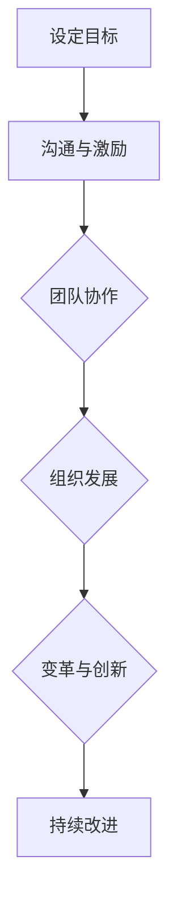

#### 1.1.2 创新的概念与价值

**概念**：创新是指通过新的想法、方法或技术，创造或改进产品、服务、过程或业务模式的过程。创新可以分为技术性创新和商业模式创新，它们在不同的领域发挥着重要作用。

**价值**：创新是推动社会进步和经济增长的重要动力。在IT领域，创新能够带来更高的效率、更好的用户体验和更广阔的市场机会。创新的价值不仅体现在经济层面，还在于它能够推动社会文化和生活方式的变革。

**Mermaid流程图**：
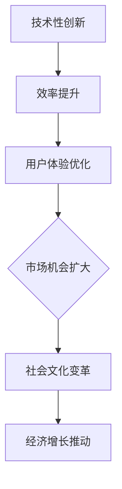

#### 1.1.3 领导力与创新的联系

领导力与创新之间的联系紧密且复杂。领导力为创新提供了方向和动力，而创新则为领导力提供了实现目标的新途径。以下是领导力与创新之间的一些关键联系：

1. **愿景与战略**：领导力通过设定愿景和制定战略，为创新提供明确的方向和目标。
2. **团队协作**：领导力能够促进团队成员之间的协作，激发团队的创新潜力。
3. **风险管理**：领导力在创新过程中扮演着风险管理者的角色，确保创新项目能够成功落地。
4. **文化氛围**：领导力能够塑造组织的文化氛围，鼓励创新思维和实践。

**Mermaid流程图**：
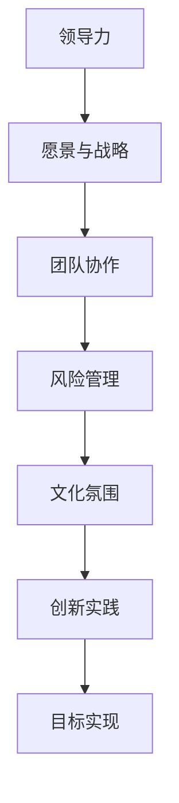

通过上述内容，我们初步了解了领导力和创新的基本概念及其相互联系。在接下来的章节中，我们将深入探讨领导力与创新的核心能力、创新方法与工具、项目管理等方面，帮助读者更全面地理解和应用这些概念。

### 第1章：领导力与创新的核心能力

领导力与创新的核心能力是推动组织变革和持续发展的关键。在本章节中，我们将深入探讨以下核心能力：视野开阔、团队协作和风险管理。

#### 1.2.1 视野开阔：拓展思维边界

视野开阔是领导力与创新的重要基础。一个具备广阔视野的领导者能够洞察市场趋势，发现潜在的创新机会，从而引领组织走向成功。

**1.2.1.1 寻找创新机会**

**背景介绍**：在快速变化的IT行业中，创新机会无处不在。然而，如何发现和利用这些机会是领导力的重要体现。

**核心概念与联系**：

- **市场趋势**：通过分析市场趋势，领导者可以预测未来的发展方向，从而发现创新机会。

- **用户需求**：了解用户需求是创新的核心。领导者需要通过与用户互动，了解用户的需求和痛点，从而激发创新灵感。

**Mermaid流程图**：
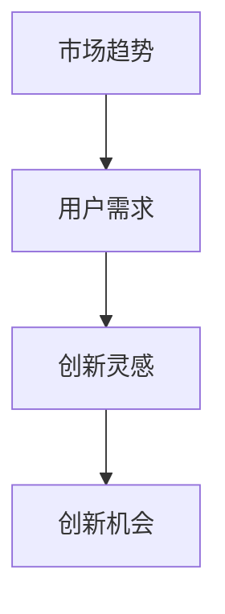

**核心算法原理讲解**：

- **市场趋势分析算法**：可以使用数据挖掘和机器学习技术，对市场数据进行分析，预测未来趋势。

- **用户需求分析算法**：可以通过用户调研、问卷调查等方式，收集用户需求信息，并进行文本分析，提取关键需求。

**数学模型和公式**：

- **预测模型**：可以使用时间序列分析、回归分析等方法，建立预测模型，预测市场趋势。

- **需求分析模型**：可以使用文本分类、主题模型等方法，分析用户需求，提取关键需求。

**举例说明**：

- **案例分析**：某科技公司通过分析市场趋势和用户需求，发现了一个新的市场机会，推出了一个创新的智能家居产品，取得了巨大成功。

**最佳实践 tips**：

- **定期市场调研**：领导者需要定期进行市场调研，了解市场动态和用户需求。

- **跨界合作**：通过与不同领域的专家合作，可以拓宽视野，发现更多的创新机会。

**小结**：

视野开阔是领导力与创新的重要能力。通过分析市场趋势和用户需求，领导者可以找到创新机会，推动组织发展。

#### 1.2.1.2 洞察市场趋势

**背景介绍**：市场趋势是决定组织战略方向的重要因素。一个具备洞察力的领导者能够准确把握市场趋势，提前布局，抢占先机。

**核心概念与联系**：

- **市场动态**：领导者需要关注市场动态，包括竞争对手、市场需求、行业趋势等，从而把握市场发展方向。

- **竞争分析**：通过对竞争对手的分析，领导者可以了解市场格局，找到自己的竞争优势。

**Mermaid流程图**：
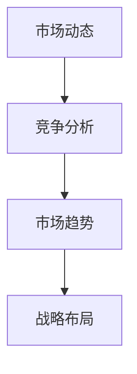

**核心算法原理讲解**：

- **市场动态分析算法**：可以使用数据挖掘和机器学习技术，对市场数据进行分析，识别市场动态。

- **竞争分析算法**：可以通过竞争情报分析、对比分析等方法，了解竞争对手的动态。

**数学模型和公式**：

- **市场动态分析模型**：可以使用时间序列分析、回归分析等方法，建立市场动态预测模型。

- **竞争分析模型**：可以使用数据可视化、对比分析等方法，分析竞争对手的动态。

**举例说明**：

- **案例分析**：某互联网公司通过分析市场动态和竞争分析，发现了一个新的市场机会，迅速调整战略，成功进入新市场。

**最佳实践 tips**：

- **定期市场分析**：领导者需要定期进行市场分析，了解市场动态和竞争态势。

- **跨界学习**：通过学习不同领域的知识和经验，可以拓宽视野，提高洞察力。

**小结**：

洞察市场趋势是领导力与创新的重要能力。通过分析市场动态和竞争态势，领导者可以准确把握市场方向，制定有效的战略布局。

#### 1.2.1.3 开放式思维

**背景介绍**：在创新过程中，开放式思维能够帮助领导者跳出传统思维框架，发现新的解决方案。

**核心概念与联系**：

- **思维模式**：开放式思维是一种突破传统思维模式的思维方式，鼓励领导者接受新的观点和想法。

- **多元化视角**：开放式思维能够带来多元化的视角，有助于发现创新的解决方案。

**Mermaid流程图**：
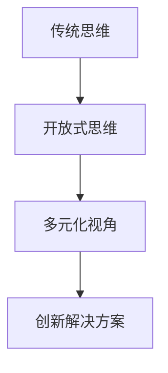

**核心算法原理讲解**：

- **思维模式转换算法**：可以使用认知心理学方法，帮助领导者从传统思维模式转向开放式思维。

- **多元化视角分析方法**：可以通过头脑风暴、跨学科合作等方法，拓宽领导者的思维视角。

**数学模型和公式**：

- **思维模式转换模型**：可以使用贝叶斯网络、决策树等方法，建立思维模式转换模型。

- **多元化视角分析模型**：可以使用聚类分析、多维尺度分析等方法，分析多元化视角。

**举例说明**：

- **案例分析**：某科技公司通过开放式思维，成功开发出一种全新的产品，颠覆了传统市场格局。

**最佳实践 tips**：

- **定期思维训练**：领导者需要定期进行思维训练，提高开放式思维能力。

- **跨学科学习**：通过学习不同学科的知识，可以拓宽思维视野，提高创新能力。

**小结**：

开放式思维是领导力与创新的重要能力。通过打破传统思维框架，领导者可以拓展思维边界，发现创新的解决方案。

### 第1章：领导力与创新的核心能力（续）

#### 1.2.2 团队协作：构建创新团队

团队协作是领导力与创新的重要体现。一个高效的创新团队能够通过合作和共享，实现创新目标。在本章节中，我们将探讨团队协作的关键要素。

**1.2.2.1 人才选拔与培养**

**背景介绍**：创新团队的成功离不开优秀的人才。领导者需要通过选拔和培养，组建一支高效的创新团队。

**核心概念与联系**：

- **人才选拔**：领导者需要识别和选拔具有创新能力的人才。

- **人才培养**：领导者需要通过培训和发展，提升团队成员的创新能力和团队协作能力。

**Mermaid流程图**：
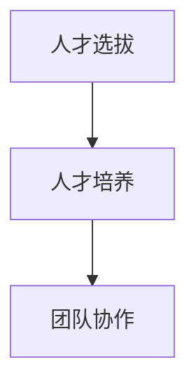

**核心算法原理讲解**：

- **人才选拔算法**：可以使用人才测评、面试等方法，评估候选人的创新能力。

- **人才培养算法**：可以通过在线培训、实战演练等方法，提升团队成员的创新能力和团队协作能力。

**数学模型和公式**：

- **人才选拔模型**：可以使用线性回归、逻辑回归等方法，建立人才选拔模型。

- **人才培养模型**：可以使用学习曲线、K-均值聚类等方法，分析人才培养效果。

**举例说明**：

- **案例分析**：某互联网公司通过选拔和培养，组建了一支高效的创新团队，成功推出了一系列创新产品。

**最佳实践 tips**：

- **定期人才评估**：领导者需要定期评估团队成员的创新能力和团队协作能力。

- **多元化团队建设**：通过引入不同背景的人才，可以促进团队的创新和协作。

**小结**：

人才选拔与培养是构建创新团队的重要环节。通过选拔和培养优秀的人才，领导者可以打造一支高效的创新团队，实现创新目标。

#### 1.2.2.2 团队协作模式

**背景介绍**：团队协作模式是创新团队高效运作的关键。领导者需要设计和优化团队协作模式，提高团队协作效率。

**核心概念与联系**：

- **协作模式设计**：领导者需要根据团队特点和项目需求，设计合适的团队协作模式。

- **协作工具与方法**：领导者需要引入和推广协作工具和方法，提高团队协作效率。

**Mermaid流程图**：
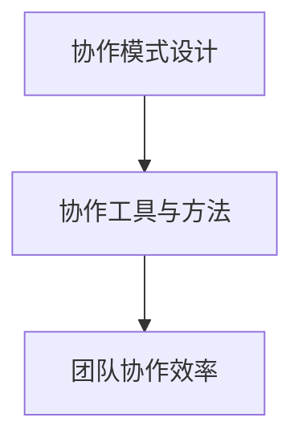

**核心算法原理讲解**：

- **协作模式设计算法**：可以通过流程图、鱼骨图等方法，设计团队协作模式。

- **协作工具与方法**：可以通过项目管理工具、协作软件等方法，提高团队协作效率。

**数学模型和公式**：

- **协作模式设计模型**：可以使用网络分析、多目标优化等方法，优化团队协作模式。

- **协作工具与方法**：可以使用效率评估、用户满意度等方法，评估协作工具和方法的效率。

**举例说明**：

- **案例分析**：某科技公司通过设计优化的团队协作模式，成功提升了团队协作效率，实现了创新目标。

**最佳实践 tips**：

- **定期协作模式评估**：领导者需要定期评估团队协作模式的效率和效果。

- **协作工具的持续优化**：根据团队需求和反馈，不断优化和改进协作工具和方法。

**小结**：

团队协作模式的设计和优化是提高团队协作效率的关键。通过设计合适的团队协作模式，引入和推广协作工具和方法，领导者可以提升团队协作效率，实现创新目标。

#### 1.2.2.3 激励与激励机制

**背景介绍**：创新团队需要高效的激励机制，以激发团队成员的积极性和创造力。领导者需要设计和实施有效的激励机制，推动团队创新。

**核心概念与联系**：

- **激励机制设计**：领导者需要根据团队特点和项目需求，设计合适的激励机制。

- **激励机制评估**：领导者需要定期评估激励机制的效果，进行调整和优化。

**Mermaid流程图**：
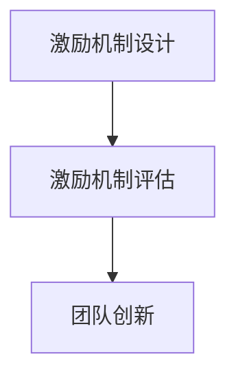

**核心算法原理讲解**：

- **激励机制设计算法**：可以通过行为心理学、激励理论等方法，设计激励机制。

- **激励机制评估算法**：可以通过员工满意度、绩效评估等方法，评估激励机制的效果。

**数学模型和公式**：

- **激励机制设计模型**：可以使用博弈论、期望理论等方法，建立激励机制设计模型。

- **激励机制评估模型**：可以使用回归分析、相关分析等方法，评估激励机制的效果。

**举例说明**：

- **案例分析**：某科技公司通过设计有效的激励机制，成功激发了团队成员的积极性和创造力，推动了团队创新。

**最佳实践 tips**：

- **个性化激励机制**：根据团队成员的个性特点和需求，设计个性化的激励机制。

- **持续激励机制评估**：定期评估激励机制的效果，及时进行调整和优化。

**小结**：

激励与激励机制是推动团队创新的重要手段。通过设计合适的激励机制，领导者可以激发团队成员的积极性和创造力，推动团队实现创新目标。

#### 1.2.3 风险管理：勇于面对挑战

创新过程中不可避免地会遇到各种风险。领导者需要具备风险管理能力，勇于面对挑战，确保创新项目的顺利进行。

**1.2.3.1 风险识别与评估**

**背景介绍**：风险识别与评估是风险管理的重要环节。领导者需要识别创新项目中的风险，并进行评估，为风险应对提供依据。

**核心概念与联系**：

- **风险识别**：领导者需要通过调查、分析等方法，识别创新项目中的潜在风险。

- **风险评估**：领导者需要评估风险的可能性和影响，确定风险的优先级。

**Mermaid流程图**：
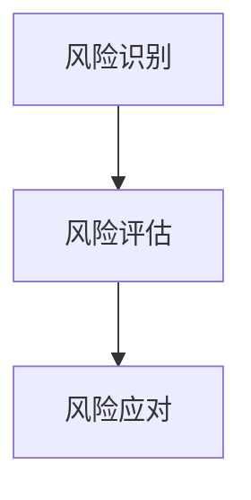

**核心算法原理讲解**：

- **风险识别算法**：可以通过数据挖掘、风险分析等方法，识别潜在风险。

- **风险评估算法**：可以通过概率分析、影响评估等方法，评估风险的可能性和影响。

**数学模型和公式**：

- **风险识别模型**：可以使用贝叶斯网络、决策树等方法，建立风险识别模型。

- **风险评估模型**：可以使用蒙特卡洛模拟、回归分析等方法，评估风险的可能性和影响。

**举例说明**：

- **案例分析**：某科技公司通过风险识别与评估，成功识别并应对了一个潜在的技术风险，确保了项目的顺利进行。

**最佳实践 tips**：

- **定期风险评估**：领导者需要定期评估创新项目中的风险，及时调整风险应对策略。

- **多元化风险评估团队**：引入不同领域的专家，提高风险评估的准确性。

**小结**：

风险识别与评估是风险管理的关键环节。通过识别和评估创新项目中的风险，领导者可以为风险应对提供科学依据，确保创新项目的顺利进行。

#### 1.2.3.2 风险应对策略

**背景介绍**：在创新过程中，风险应对策略的制定和实施至关重要。领导者需要根据风险评估的结果，制定有效的风险应对策略，降低风险对项目的影响。

**核心概念与联系**：

- **风险应对策略**：领导者需要根据风险评估的结果，制定风险应对策略。

- **风险应对措施**：领导者需要采取具体的措施，降低风险的影响。

**Mermaid流程图**：
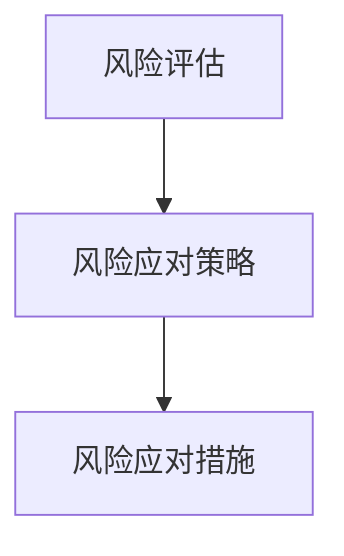

**核心算法原理讲解**：

- **风险应对策略设计**：可以通过决策分析、博弈论等方法，设计风险应对策略。

- **风险应对措施实施**：可以通过应急计划、风险管理工具等方法，实施风险应对措施。

**数学模型和公式**：

- **风险应对策略设计模型**：可以使用线性规划、动态规划等方法，优化风险应对策略。

- **风险应对措施实施模型**：可以使用模拟仿真、优化算法等方法，实施风险应对措施。

**举例说明**：

- **案例分析**：某科技公司通过制定并实施有效的风险应对策略，成功降低了一个潜在的技术风险，确保了项目的顺利进行。

**最佳实践 tips**：

- **多元化风险应对团队**：引入不同领域的专家，提高风险应对策略的准确性。

- **定期策略评估**：领导者需要定期评估风险应对策略的有效性，及时进行调整和优化。

**小结**：

风险应对策略是确保创新项目顺利进行的重要手段。通过制定和实施有效的风险应对策略，领导者可以降低风险对项目的影响，提高项目的成功率。

#### 1.2.3.3 风险管理工具与应用

**背景介绍**：风险管理工具是领导者进行风险管理的有力辅助。在本章节中，我们将探讨几种常见的风险管理工具及其应用。

**核心概念与联系**：

- **风险管理工具**：包括风险评估工具、风险应对工具等。

- **应用场景**：领导者需要根据具体项目需求，选择合适的风险管理工具。

**Mermaid流程图**：
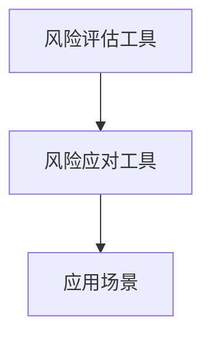

**核心算法原理讲解**：

- **风险评估工具**：可以使用风险矩阵、风险树等方法，评估风险的可能性和影响。

- **风险应对工具**：可以使用应急计划、风险管理软件等方法，实施风险应对措施。

**数学模型和公式**：

- **风险评估工具**：可以使用概率分布、期望值等方法，评估风险的可能性和影响。

- **风险应对工具**：可以使用决策树、仿真模型等方法，优化风险应对策略。

**举例说明**：

- **案例分析**：某科技公司使用风险矩阵和应急计划，成功应对了一个潜在的市场风险，确保了项目的顺利进行。

**最佳实践 tips**：

- **定制化工具选择**：根据项目特点和需求，选择合适的风险管理工具。

- **工具的持续优化**：根据实践经验，不断优化和改进风险管理工具。

**小结**：

风险管理工具是领导者进行风险管理的重要辅助。通过选择和应用合适的风险管理工具，领导者可以更有效地识别、评估和应对风险，确保创新项目的顺利进行。

### 第1章：创新方法与工具

创新方法是推动组织持续发展的关键。在本章节中，我们将探讨几种重要的创新方法与工具，包括设计思维、TRIZ理论和创新方法学，帮助领导者更好地实现创新目标。

#### 1.3.1 设计思维：以用户为中心的创新

设计思维是一种以用户需求为中心的创新方法，通过理解用户需求、构思解决方案和迭代改进，实现创新目标。

**1.3.1.1 设计思维的基本原则**

**背景介绍**：设计思维是一种以用户需求为中心的创新方法，强调通过理解用户需求、构建原型和迭代改进，实现创新目标。

**核心概念与联系**：

- **用户需求理解**：设计思维的核心是深入理解用户需求，通过观察、访谈和用户调研等方法，获取用户反馈。

- **原型构建与迭代**：设计思维鼓励快速构建原型，通过迭代改进，不断完善解决方案。

**Mermaid流程图**：
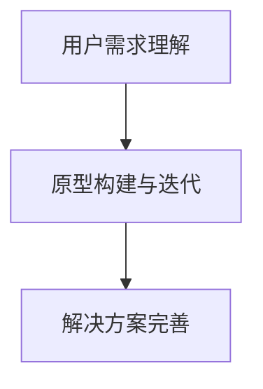

**核心算法原理讲解**：

- **用户需求理解算法**：可以使用用户画像、需求分析等方法，深入理解用户需求。

- **原型构建与迭代算法**：可以使用迭代设计、敏捷开发等方法，构建原型并进行迭代改进。

**数学模型和公式**：

- **用户需求理解模型**：可以使用回归分析、聚类分析等方法，建立用户需求理解模型。

- **原型构建与迭代模型**：可以使用仿真模型、优化算法等方法，优化原型设计和迭代过程。

**举例说明**：

- **案例分析**：某科技公司通过设计思维方法，成功开发出一种符合用户需求的新产品，取得了市场成功。

**最佳实践 tips**：

- **定期用户调研**：领导者需要定期进行用户调研，了解用户需求和反馈。

- **快速原型构建**：鼓励团队成员快速构建原型，通过迭代改进，不断提高解决方案质量。

**小结**：

设计思维是一种以用户需求为中心的创新方法，通过理解用户需求、构建原型和迭代改进，实现创新目标。

#### 1.3.1.2 设计思维的应用流程

设计思维的应用流程包括用户调研、原型构建、迭代改进和解决方案验证等步骤，通过系统化地执行这些步骤，可以确保创新目标的实现。

**1.3.1.2.1 用户调研**

**背景介绍**：用户调研是设计思维的第一步，通过深入理解用户需求，为后续的创新工作提供基础。

**核心概念与联系**：

- **调研方法**：可以使用问卷调查、访谈、用户观察等方法，收集用户反馈。

- **数据分析**：对收集到的用户数据进行分析，提取关键需求和痛点。

**Mermaid流程图**：
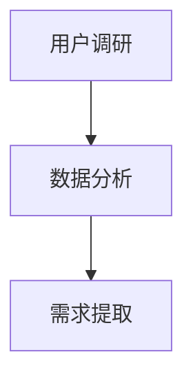

**核心算法原理讲解**：

- **用户调研方法**：可以使用问卷调查、访谈等方法，收集用户反馈。

- **数据分析方法**：可以使用回归分析、聚类分析等方法，分析用户数据。

**数学模型和公式**：

- **用户调研模型**：可以使用线性回归、逻辑回归等方法，建立用户调研模型。

- **数据分析模型**：可以使用主成分分析、因子分析等方法，分析用户数据。

**举例说明**：

- **案例分析**：某科技公司通过用户调研，发现了一个新的用户需求，从而开发出了一种满足用户需求的新产品。

**最佳实践 tips**：

- **多样化调研方法**：结合问卷调查、访谈、用户观察等多种方法，提高用户调研的准确性。

- **数据多维度分析**：对用户数据进行多维度分析，提取关键需求和痛点。

**小结**：

用户调研是设计思维的重要步骤，通过深入理解用户需求，为后续的创新工作提供基础。

#### 1.3.1.2.2 原型构建与迭代

**背景介绍**：原型构建是设计思维的第二步，通过快速构建原型，验证和改进设计方案。

**核心概念与联系**：

- **原型构建**：使用简单而实用的方法，快速构建可交互的原型。

- **迭代改进**：通过用户反馈，对原型进行多次迭代，不断优化设计方案。

**Mermaid流程图**：
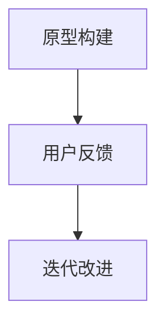

**核心算法原理讲解**：

- **原型构建方法**：可以使用草图、线框图、交互原型等方法，快速构建原型。

- **迭代改进方法**：可以使用用户测试、反馈循环等方法，不断优化原型。

**数学模型和公式**：

- **原型构建模型**：可以使用仿真模型、优化算法等方法，构建原型。

- **迭代改进模型**：可以使用回归分析、相关分析等方法，评估迭代效果。

**举例说明**：

- **案例分析**：某科技公司通过原型构建和迭代，成功开发出了一个满足用户需求的新产品，并在市场上取得了成功。

**最佳实践 tips**：

- **快速构建原型**：鼓励团队成员快速构建原型，提高开发效率。

- **用户测试反馈**：通过用户测试和反馈，及时了解用户需求，优化设计方案。

**小结**：

原型构建与迭代是设计思维的关键步骤，通过快速构建原型和不断迭代改进，可以确保创新解决方案的质量。

#### 1.3.1.2.3 设计思维案例分析

**背景介绍**：设计思维在实际应用中，已经取得了许多成功的案例。通过分析这些案例，我们可以更好地理解设计思维的应用过程和效果。

**核心概念与联系**：

- **成功案例**：分析成功案例的设计过程和成果，了解设计思维的实践效果。

- **经验总结**：总结成功案例中的经验，为后续创新工作提供借鉴。

**Mermaid流程图**：
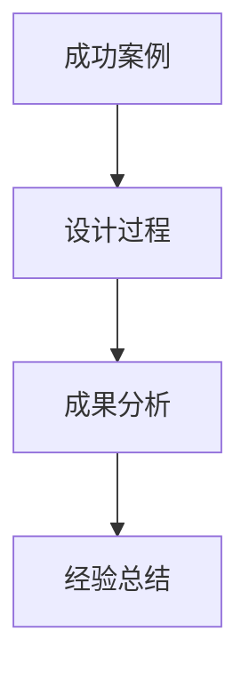

**核心算法原理讲解**：

- **案例分析方法**：可以使用文献分析、案例研究等方法，分析成功案例的设计过程和成果。

- **经验总结方法**：可以使用归纳总结、对比分析等方法，总结成功案例中的经验。

**数学模型和公式**：

- **案例分析方法**：可以使用回归分析、相关性分析等方法，分析成功案例的数据。

- **经验总结模型**：可以使用贝叶斯网络、决策树等方法，建立经验总结模型。

**举例说明**：

- **案例分析**：某科技公司通过设计思维方法，成功开发出了一款智能家居产品，取得了市场成功。

**最佳实践 tips**：

- **多案例分析**：通过分析多个成功案例，可以更全面地了解设计思维的应用效果。

- **持续改进**：根据成功案例的经验，不断改进和创新设计思维方法。

**小结**：

设计思维在实际应用中已经取得了许多成功案例。通过分析这些案例，我们可以更好地理解设计思维的应用过程和效果，为后续的创新工作提供借鉴。

#### 1.3.2 TRIZ理论：问题解决的思维工具

TRIZ（理论解决的创新问题）是一种系统化的问题解决方法论，通过解决矛盾的原理和工具，帮助领导者找到创新的解决方案。

**1.3.2.1 TRIZ理论的基本概念**

**背景介绍**：TRIZ理论起源于苏联，是一种系统化的问题解决方法论，旨在帮助人们解决复杂问题，实现创新。

**核心概念与联系**：

- **矛盾原理**：TRIZ理论认为，问题本质上是由矛盾引起的，解决问题的关键在于找到和解决这些矛盾。

- **创新工具**：TRIZ提供了一系列工具和方法，如矛盾矩阵、物理矛盾分析等，帮助领导者找到创新的解决方案。

**Mermaid流程图**：
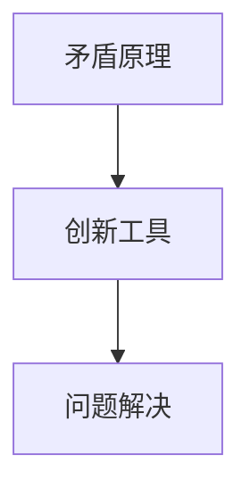

**核心算法原理讲解**：

- **矛盾原理**：可以使用对立统一原理、动态原理等方法，理解问题的矛盾本质。

- **创新工具**：可以使用矛盾矩阵、物理矛盾分析等方法，找到解决问题的创新思路。

**数学模型和公式**：

- **矛盾原理模型**：可以使用逻辑推理、辩证法等方法，建立矛盾原理模型。

- **创新工具模型**：可以使用统计分析、优化算法等方法，优化创新工具的应用效果。

**举例说明**：

- **案例分析**：某科技公司通过TRIZ理论，成功解决了一个复杂的技术问题，实现了产品的创新。

**最佳实践 tips**：

- **系统学习TRIZ理论**：领导者需要系统学习TRIZ理论，掌握基本原理和创新工具。

- **结合实际问题应用**：将TRIZ理论应用于实际问题，提高问题解决的效率和质量。

**小结**：

TRIZ理论是一种系统化的问题解决方法论，通过矛盾原理和创新工具，帮助领导者找到创新的解决方案。

#### 1.3.2.2 TRIZ理论的应用方法

TRIZ理论的应用方法包括矛盾矩阵、物理矛盾分析等，通过系统化的步骤，帮助领导者解决复杂问题，实现创新。

**1.3.2.2.1 矛盾矩阵**

**背景介绍**：矛盾矩阵是TRIZ理论中的一个核心工具，通过分析问题的矛盾关系，找到创新的解决方案。

**核心概念与联系**：

- **矛盾分析**：通过矛盾矩阵，分析问题的矛盾关系，确定矛盾的类型。

- **解决方案**：根据矛盾类型，选择合适的解决方案，解决矛盾。

**Mermaid流程图**：
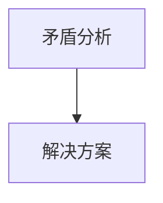

**核心算法原理讲解**：

- **矛盾分析算法**：可以使用逻辑推理、辩证法等方法，分析问题的矛盾关系。

- **解决方案算法**：可以使用矛盾矩阵、物理矛盾分析等方法，找到解决方案。

**数学模型和公式**：

- **矛盾分析模型**：可以使用贝叶斯网络、决策树等方法，建立矛盾分析模型。

- **解决方案模型**：可以使用线性规划、动态规划等方法，优化解决方案。

**举例说明**：

- **案例分析**：某科技公司通过矛盾矩阵，成功解决了一个技术难题，实现了产品的创新。

**最佳实践 tips**：

- **系统学习矛盾矩阵**：领导者需要系统学习矛盾矩阵，掌握基本原理和应用方法。

- **结合实际问题应用**：将矛盾矩阵应用于实际问题，提高问题解决的效率和质量。

**小结**：

矛盾矩阵是TRIZ理论中的一个核心工具，通过分析问题的矛盾关系，找到创新的解决方案。

#### 1.3.2.2.2 物理矛盾分析

**背景介绍**：物理矛盾分析是TRIZ理论中的另一个重要工具，通过分析物理矛盾，找到创新的解决方案。

**核心概念与联系**：

- **物理矛盾**：物理矛盾是指问题的两个方面相互矛盾，但又必须同时存在。

- **解决方案**：通过分析物理矛盾，找到解决矛盾的原理和工具，实现创新。

**Mermaid流程图**：
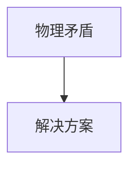

**核心算法原理讲解**：

- **物理矛盾分析算法**：可以使用矛盾矩阵、物理矛盾分析等方法，分析物理矛盾。

- **解决方案算法**：可以使用物理矛盾解决原理、创新工具等方法，找到解决方案。

**数学模型和公式**：

- **物理矛盾分析模型**：可以使用贝叶斯网络、决策树等方法，建立物理矛盾分析模型。

- **解决方案模型**：可以使用优化算法、仿真模型等方法，优化解决方案。

**举例说明**：

- **案例分析**：某科技公司通过物理矛盾分析，成功解决了一个复杂的工程问题，实现了技术的突破。

**最佳实践 tips**：

- **系统学习物理矛盾分析**：领导者需要系统学习物理矛盾分析，掌握基本原理和应用方法。

- **结合实际问题应用**：将物理矛盾分析应用于实际问题，提高问题解决的效率和质量。

**小结**：

物理矛盾分析是TRIZ理论中的一个重要工具，通过分析物理矛盾，找到创新的解决方案。

### 1.3.3 创新方法学：系统化创新实践

创新方法学是一种系统化的创新实践方法，通过一系列的步骤和工具，帮助组织实现持续创新。在本章节中，我们将探讨创新方法学的体系结构、实施步骤和应用案例。

#### 1.3.3.1 创新方法学的体系结构

创新方法学是一种系统化的创新实践方法，它包括多个模块和步骤，旨在通过结构化的过程，实现从创意生成到产品化的全程创新。

**核心概念与联系**：

- **创意生成**：创新方法学的第一步是创意生成，通过头脑风暴、思维导图等方法，激发创意的产生。

- **筛选与评估**：在创意生成后，需要对这些创意进行筛选和评估，确定哪些创意具有实现潜力。

- **产品化**：最后，创新方法学将创意转化为实际的产品或服务，通过原型设计、迭代测试等步骤，实现产品的商业化。

**Mermaid流程图**：
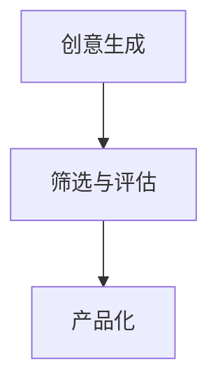

**核心算法原理讲解**：

- **创意生成算法**：可以使用随机算法、遗传算法等方法，激发创意的产生。

- **筛选与评估算法**：可以使用回归分析、聚类分析等方法，评估创意的潜力和可行性。

- **产品化算法**：可以使用仿真模型、优化算法等方法，设计并实现产品的商业化。

**数学模型和公式**：

- **创意生成模型**：可以使用贝叶斯网络、决策树等方法，建立创意生成模型。

- **筛选与评估模型**：可以使用支持向量机、神经网络等方法，建立筛选与评估模型。

- **产品化模型**：可以使用优化算法、仿真模型等方法，建立产品化模型。

**举例说明**：

- **案例分析**：某科技公司通过创新方法学，成功从多个创意中筛选出了一个具有市场前景的产品，并实现了产品的商业化。

**最佳实践 tips**：

- **持续创意激发**：定期组织头脑风暴、思维导图等活动，激发创意的产生。

- **科学评估与筛选**：使用数据分析和算法模型，对创意进行科学评估和筛选。

**小结**：

创新方法学的体系结构包括创意生成、筛选与评估、产品化等步骤，通过系统化的过程，帮助组织实现持续创新。

#### 1.3.3.2 创新方法学的实施步骤

创新方法学的实施步骤是一个系统化的过程，它包括创意生成、筛选与评估、产品化等多个阶段，每个阶段都有其特定的方法和工具。

**1.3.3.2.1 创意生成**

**背景介绍**：创意生成是创新方法学的第一步，它涉及到如何激发和收集创意。在这一阶段，领导者和团队成员需要积极参与，通过多种方法激发创意的产生。

**核心概念与联系**：

- **头脑风暴**：头脑风暴是一种常用的创意生成方法，通过集体讨论，激发团队成员的创意思维。

- **思维导图**：思维导图是一种图形化的工具，可以帮助团队成员整理和展示创意。

**Mermaid流程图**：
```mermaid
graph TB
A[头脑风暴] --> B[思维导图]
```

**核心算法原理讲解**：

- **头脑风暴算法**：可以使用群体智能算法、协同过滤算法等方法，优化头脑风暴过程。

- **思维导图算法**：可以使用图形算法、网络分析等方法，设计思维导图。

**数学模型和公式**：

- **头脑风暴模型**：可以使用贝叶斯网络、决策树等方法，建立头脑风暴模型。

- **思维导图模型**：可以使用多目标优化、图论等方法，建立思维导图模型。

**举例说明**：

- **案例分析**：某科技公司在开发新产品时，通过头脑风暴和思维导图，成功收集到了多个创新创意，为产品开发奠定了基础。

**最佳实践 tips**：

- **定期创意激发活动**：定期组织创意激发活动，如头脑风暴、思维导图等，鼓励团队成员积极参与。

- **多样化创意收集方法**：结合问卷调查、用户访谈等多种方法，收集创意。

**小结**：

创意生成是创新方法学的重要阶段，通过头脑风暴和思维导图等方法，可以激发团队成员的创意思维，为创新提供基础。

#### 1.3.3.2.2 筛选与评估

**背景介绍**：在创意生成后，需要对创意进行筛选和评估，确定哪些创意具有实现潜力。筛选与评估阶段是创新方法学中的关键步骤，它决定了哪些创意可以进入后续的产品化阶段。

**核心概念与联系**：

- **创意筛选**：在创意生成后，对创意进行初步筛选，去除明显不可行的创意。

- **创意评估**：对筛选后的创意进行详细评估，包括技术可行性、市场潜力、资源需求等方面。

**Mermaid流程图**：
```mermaid
graph TB
A[创意筛选] --> B[创意评估]
```

**核心算法原理讲解**：

- **创意筛选算法**：可以使用机器学习、聚类分析等方法，对创意进行初步筛选。

- **创意评估算法**：可以使用多目标优化、仿真模型等方法，对创意进行详细评估。

**数学模型和公式**：

- **创意筛选模型**：可以使用支持向量机、神经网络等方法，建立创意筛选模型。

- **创意评估模型**：可以使用回归分析、决策树等方法，建立创意评估模型。

**举例说明**：

- **案例分析**：某科技公司通过对创意的筛选和评估，从多个创意中确定了一个具有市场前景的技术方案，并投入开发。

**最佳实践 tips**：

- **数据驱动评估**：使用数据分析和算法模型，对创意进行科学评估。

- **多元化评估团队**：引入不同领域的专家，提高评估的准确性和全面性。

**小结**：

筛选与评估是创新方法学中的关键步骤，通过科学的数据分析和算法模型，可以筛选出具有实现潜力的创意，为产品化奠定基础。

#### 1.3.3.2.3 产品化

**背景介绍**：产品化是创新方法学的最后一个阶段，将筛选和评估后的创意转化为实际的产品或服务。在这一阶段，领导者和团队成员需要通过原型设计、迭代测试等步骤，确保产品的质量和市场适应性。

**核心概念与联系**：

- **原型设计**：原型设计是将创意转化为可视化的产品模型，通过用户测试，验证产品的可行性。

- **迭代测试**：迭代测试是在产品原型的基础上，通过多次迭代，不断优化产品，提高用户体验。

**Mermaid流程图**：
```mermaid
graph TB
A[原型设计] --> B[迭代测试]
```

**核心算法原理讲解**：

- **原型设计算法**：可以使用计算机辅助设计（CAD）工具、虚拟现实（VR）等方法，设计产品原型。

- **迭代测试算法**：可以使用用户体验测试、A/B测试等方法，优化产品原型。

**数学模型和公式**：

- **原型设计模型**：可以使用计算机图形学、仿真模型等方法，建立原型设计模型。

- **迭代测试模型**：可以使用回归分析、方差分析等方法，评估迭代效果。

**举例说明**：

- **案例分析**：某科技公司通过原型设计和迭代测试，成功开发出了一款智能家居产品，并在市场上取得了良好反响。

**最佳实践 tips**：

- **快速原型设计**：鼓励快速原型设计，提高开发效率。

- **用户参与测试**：通过用户参与测试，获取真实的用户反馈，优化产品设计。

**小结**：

产品化是将创意转化为实际产品的过程，通过原型设计和迭代测试，可以确保产品的质量和市场适应性。

### 1.3.4 创新工具：支持创新实践的软件和平台

创新工具是推动创新实践的重要支持。在本章节中，我们将探讨几种常见的创新工具，包括项目管理工具、协作平台、创新软件等，并分析它们在不同场景中的应用。

#### 1.3.4.1 创新工具的种类与功能

创新工具种类繁多，包括项目管理工具、协作平台、创新软件等，每种工具都有其特定的功能和用途。

**核心概念与联系**：

- **项目管理工具**：如JIRA、Trello等，用于项目规划、任务分配和进度跟踪。

- **协作平台**：如Slack、Microsoft Teams等，用于团队沟通和协作。

- **创新软件**：如Miro、Figma等，用于创意生成、原型设计和协作。

**Mermaid流程图**：
```mermaid
graph TB
A[项目管理工具] --> B[协作平台]
B --> C[创新软件]
```

**核心算法原理讲解**：

- **项目管理工具**：可以使用算法优化、任务调度等方法，优化项目管理和任务分配。

- **协作平台**：可以使用自然语言处理（NLP）、语音识别等技术，提高沟通和协作效率。

- **创新软件**：可以使用计算机图形学、交互设计等方法，优化创意生成和原型设计。

**数学模型和公式**：

- **项目管理工具**：可以使用线性规划、动态规划等方法，优化项目管理。

- **协作平台**：可以使用回归分析、聚类分析等方法，分析用户行为和沟通模式。

- **创新软件**：可以使用优化算法、仿真模型等方法，优化创意生成和原型设计。

**举例说明**：

- **案例分析**：某科技公司使用JIRA进行项目管理，使用Slack进行团队沟通，使用Figma进行原型设计，成功提高了项目效率和质量。

**最佳实践 tips**：

- **多样化工具选择**：根据项目需求，选择合适的创新工具。

- **工具集成与协同**：实现工具之间的集成与协同，提高工作效率。

**小结**：

创新工具是支持创新实践的重要资源，通过合理选择和使用，可以显著提高项目效率和质量。

#### 1.3.4.2 创新工具的应用场景

创新工具在不同应用场景中发挥着重要作用，从项目管理到团队协作，再到创意生成和原型设计，各个工具都有其独特的应用价值。

**1.3.4.2.1 项目管理工具的应用场景**

**背景介绍**：项目管理工具在复杂项目的规划、执行和监控中发挥着关键作用。它们能够帮助领导者和管理团队有效地分配任务、跟踪进度、管理资源。

**核心概念与联系**：

- **任务分配**：项目管理工具可以帮助团队分配任务，确保每个人都知道自己的职责和目标。

- **进度跟踪**：通过项目管理工具，可以实时监控项目的进展，确保项目按时完成。

**Mermaid流程图**：
```mermaid
graph TB
A[任务分配] --> B[进度跟踪]
```

**核心算法原理讲解**：

- **任务分配算法**：可以使用算法优化、任务调度等方法，实现任务的科学分配。

- **进度跟踪算法**：可以使用时间序列分析、预测模型等方法，实时监控项目进度。

**数学模型和公式**：

- **任务分配模型**：可以使用线性规划、多目标优化等方法，优化任务分配。

- **进度跟踪模型**：可以使用回归分析、决策树等方法，建立进度跟踪模型。

**举例说明**：

- **案例分析**：某科技公司使用JIRA进行项目管理，通过任务分配和进度跟踪，成功实现了复杂项目的按时交付。

**最佳实践 tips**：

- **定期进度审查**：领导者需要定期审查项目进度，确保项目按计划进行。

- **灵活调整资源**：根据项目需求和实际情况，灵活调整资源和任务分配。

**小结**：

项目管理工具在复杂项目的规划和执行中至关重要，通过科学分配任务和实时进度跟踪，可以确保项目的成功实施。

#### 1.3.4.2.2 协作平台的应用场景

**背景介绍**：协作平台在团队沟通和协作中扮演着重要角色，它们能够帮助团队成员实时沟通、共享资源和协同工作，提高团队的整体效率。

**核心概念与联系**：

- **实时沟通**：协作平台提供实时聊天、视频会议等功能，促进团队成员之间的沟通。

- **资源共享**：协作平台允许团队成员共享文件、资料和进度，方便协作和知识共享。

**Mermaid流程图**：
```mermaid
graph TB
A[实时沟通] --> B[资源共享]
```

**核心算法原理讲解**：

- **实时沟通算法**：可以使用NLP、语音识别等技术，提高沟通效率和准确性。

- **资源共享算法**：可以使用分布式存储、数据同步等技术，实现资源的实时共享。

**数学模型和公式**：

- **实时沟通模型**：可以使用排队论、网络分析等方法，优化沟通机制。

- **资源共享模型**：可以使用分布式算法、一致性模型等方法，优化资源共享。

**举例说明**：

- **案例分析**：某科技公司使用Slack进行团队沟通，通过实时聊天、视频会议等功能，提高了团队的协作效率。

**最佳实践 tips**：

- **明确沟通规范**：制定明确的沟通规范，确保团队成员能够高效沟通。

- **定期团队交流**：定期组织团队交流会议，促进知识共享和团队凝聚力。

**小结**：

协作平台在团队沟通和协作中发挥着重要作用，通过实时沟通和资源共享，可以提高团队的整体效率。

#### 1.3.4.2.3 创新软件的应用场景

**背景介绍**：创新软件在创意生成、原型设计和协作中有着广泛应用。它们为团队成员提供了一个可视化、互动的平台，促进创新的实现。

**核心概念与联系**：

- **创意生成**：创新软件可以帮助团队成员快速生成创意，通过头脑风暴和思维导图等工具，激发创造力。

- **原型设计**：创新软件提供了丰富的原型设计工具，如Sketch、Figma等，帮助团队成员快速构建原型，进行迭代设计。

**Mermaid流程图**：
```mermaid
graph TB
A[创意生成] --> B[原型设计]
```

**核心算法原理讲解**：

- **创意生成算法**：可以使用群体智能、协同过滤等方法，激发创意生成。

- **原型设计算法**：可以使用计算机图形学、交互设计等方法，优化原型设计。

**数学模型和公式**：

- **创意生成模型**：可以使用回归分析、聚类分析等方法，建立创意生成模型。

- **原型设计模型**：可以使用仿真模型、优化算法等方法，优化原型设计。

**举例说明**：

- **案例分析**：某科技公司使用Figma进行原型设计，通过可视化工具和迭代设计方法，成功开发出了一款用户友好的应用程序。

**最佳实践 tips**：

- **灵活应用工具**：根据实际需求，灵活选择和使用创新软件。

- **持续迭代优化**：通过不断的迭代和优化，提升创新解决方案的质量。

**小结**：

创新软件在创意生成和原型设计中发挥着重要作用，通过灵活应用和持续迭代，可以显著提高创新的效率和效果。

### 1.3.5 创新工具的实战案例

在本章节中，我们将通过几个具体的实战案例，分析创新工具在不同场景中的应用，以及如何通过这些工具实现创新目标。

#### 1.3.5.1 项目管理工具在大型项目中的应用

**背景介绍**：某科技公司正在开发一款复杂的人工智能系统，项目涉及多个团队，任务繁多且时间紧迫。为了确保项目的顺利进行，公司决定使用项目管理工具来管理项目。

**核心概念与联系**：

- **任务分配**：使用JIRA进行任务分配，确保每个团队成员都清楚自己的职责。

- **进度跟踪**：使用JIRA的看板功能，实时跟踪项目的进展，及时发现和解决问题。

**Mermaid流程图**：
```mermaid
graph TB
A[JIRA任务分配] --> B[JIRA进度跟踪]
```

**核心算法原理讲解**：

- **任务分配算法**：使用JIRA的分配规则，根据团队成员的技能和工作负荷，合理分配任务。

- **进度跟踪算法**：使用JIRA的进度统计功能，根据任务的完成情况，实时更新项目进度。

**数学模型和公式**：

- **任务分配模型**：使用线性规划模型，优化任务分配。

- **进度跟踪模型**：使用时间序列分析模型，预测项目完成时间。

**举例说明**：

- **案例分析**：通过使用JIRA，该科技公司成功实现了任务的科学分配和进度的实时跟踪，确保了项目的按时交付。

**最佳实践 tips**：

- **定期任务回顾**：定期召开任务回顾会议，评估任务完成情况，及时调整分配策略。

- **灵活调整任务**：根据项目实际情况，灵活调整任务分配和进度计划。

**小结**：

项目管理工具在大型项目的任务分配和进度跟踪中起到了关键作用，通过科学的管理和实时监控，可以显著提高项目效率。

#### 1.3.5.2 协作平台在跨团队合作中的应用

**背景介绍**：某科技公司是一家国际化的企业，其研发团队分布在不同的国家。为了确保团队成员能够高效沟通和协作，公司决定采用协作平台来统一团队沟通。

**核心概念与联系**：

- **实时沟通**：使用Slack进行实时沟通，确保团队成员能够随时交流。

- **资源共享**：使用Google Drive等云存储服务，实现文件的实时共享。

**Mermaid流程图**：
```mermaid
graph TB
A[Slack实时沟通] --> B[Google Drive资源共享]
```

**核心算法原理讲解**：

- **实时沟通算法**：使用NLP技术，自动整理和分类聊天信息，提高沟通效率。

- **资源共享算法**：使用分布式存储技术，确保文件的高效传输和实时更新。

**数学模型和公式**：

- **实时沟通模型**：使用聚类分析模型，分析聊天信息，识别关键话题。

- **资源共享模型**：使用分布式一致性模型，确保文件共享的实时性和一致性。

**举例说明**：

- **案例分析**：通过使用Slack和Google Drive，该科技公司的跨团队合作效率显著提高，项目进展顺利。

**最佳实践 tips**：

- **制定沟通规范**：制定明确的沟通规范，确保团队成员能够高效交流。

- **定期团队会议**：定期召开线上团队会议，确保团队成员之间的沟通和信息同步。

**小结**：

协作平台在跨团队合作中发挥了重要作用，通过实时沟通和资源共享，可以显著提高团队协作效率。

#### 1.3.5.3 创新软件在产品开发中的应用

**背景介绍**：某科技公司正在开发一款智能家居设备，为了确保产品的创新性和用户体验，公司决定采用创新软件进行原型设计和迭代优化。

**核心概念与联系**：

- **原型设计**：使用Figma进行原型设计，快速构建用户界面和交互流程。

- **迭代优化**：通过用户测试和反馈，不断优化产品设计，提升用户体验。

**Mermaid流程图**：
```mermaid
graph TB
A[Figma原型设计] --> B[用户测试与反馈]
```

**核心算法原理讲解**：

- **原型设计算法**：使用计算机图形学和交互设计方法，优化界面设计和交互体验。

- **迭代优化算法**：使用A/B测试等方法，分析用户反馈，优化产品设计。

**数学模型和公式**：

- **原型设计模型**：使用多目标优化模型，平衡设计美感和用户体验。

- **迭代优化模型**：使用回归分析模型，分析用户行为和偏好。

**举例说明**：

- **案例分析**：通过使用Figma，该科技公司成功设计并优化了一款智能家居设备，产品上市后受到了用户的广泛好评。

**最佳实践 tips**：

- **用户参与设计**：邀请用户参与设计过程，获取真实用户反馈。

- **持续迭代优化**：根据用户反馈，持续优化产品设计，提升用户体验。

**小结**：

创新软件在产品开发中发挥着重要作用，通过原型设计和迭代优化，可以显著提升产品的创新性和用户体验。

### 1.4 创新项目管理

创新项目管理是确保创新项目顺利进行的关键环节。在本章节中，我们将探讨创新项目的特点与挑战，以及创新项目管理的核心要素和实践方法。

#### 1.4.1 创新项目的特点与挑战

**背景介绍**：创新项目通常涉及新技术、新产品或新服务，具有较大的不确定性和复杂性。为了确保创新项目的成功，领导者需要深入了解创新项目的特点与挑战。

**核心概念与联系**：

- **创新项目的特点**：包括不确定性、高风险、复杂性和多样性。

- **创新项目的挑战**：包括资源分配、时间管理、风险管理、团队协作等方面。

**Mermaid流程图**：
```mermaid
graph TB
A[不确定性] --> B[高风险]
B --> C[复杂性]
C --> D[多样性]
```

**核心算法原理讲解**：

- **不确定性分析**：可以使用蒙特卡洛模拟、概率分析等方法，评估项目的不确定性。

- **风险分析**：可以使用风险评估模型、决策树等方法，识别和管理项目风险。

- **复杂性分析**：可以使用网络分析、仿真模型等方法，评估项目的复杂度。

**数学模型和公式**：

- **不确定性模型**：可以使用贝叶斯网络、随机过程等方法，建立不确定性模型。

- **风险评估模型**：可以使用蒙特卡洛模拟、敏感性分析等方法，建立风险评估模型。

- **复杂性模型**：可以使用网络分析、仿真模型等方法，建立复杂性模型。

**举例说明**：

- **案例分析**：某科技公司通过评估创新项目的不确定性、风险和复杂度，制定了科学的项目管理计划，确保了项目的成功。

**最佳实践 tips**：

- **定期风险评估**：领导者需要定期评估项目风险，及时调整管理策略。

- **多样化风险管理**：引入多种风险管理工具和方法，提高项目风险管理的效率。

**小结**：

创新项目具有不确定性、高风险、复杂性和多样性等特点，领导者需要深入了解这些特点，应对项目中的各种挑战。

#### 1.4.2 创新项目管理的核心要素

创新项目管理需要考虑多个核心要素，包括目标设定与规划、团队建设与沟通、风险管理与控制等方面。这些要素共同构成了创新项目的管理框架。

**1.4.2.1 目标设定与规划**

**背景介绍**：明确的目标是创新项目成功的关键。目标设定与规划阶段需要制定项目的具体目标和计划，确保项目方向的正确性和可行性。

**核心概念与联系**：

- **目标设定**：明确项目的目标，包括技术目标、商业目标和社会目标。

- **规划制定**：制定详细的项目计划，包括时间表、资源分配、预算等。

**Mermaid流程图**：
```mermaid
graph TB
A[目标设定] --> B[规划制定]
```

**核心算法原理讲解**：

- **目标设定算法**：可以使用目标优化算法、多目标优化方法，制定科学的目标。

- **规划制定算法**：可以使用项目管理算法、优化算法，制定详细的项目计划。

**数学模型和公式**：

- **目标设定模型**：可以使用线性规划、多目标优化等方法，建立目标设定模型。

- **规划制定模型**：可以使用时间序列分析、网络优化等方法，建立项目计划模型。

**举例说明**：

- **案例分析**：某科技公司通过明确的目标设定和详细的规划制定，确保了创新项目的顺利进行。

**最佳实践 tips**：

- **定期目标评估**：领导者需要定期评估项目目标的实现情况，及时调整目标。

- **科学规划制定**：结合实际情况，制定科学合理的项目计划。

**小结**：

目标设定与规划是创新项目管理的重要环节，通过明确的目标和详细的计划，可以确保项目的正确方向和可行性。

#### 1.4.2.2 团队建设与沟通

**背景介绍**：创新项目通常涉及多个领域的专业知识和技能，团队建设与沟通是项目成功的关键。有效的团队建设与沟通可以提高项目的协作效率，确保项目目标的实现。

**核心概念与联系**：

- **团队建设**：建立高效的团队，包括选拔合适的人才、培养团队协作能力。

- **沟通**：建立有效的沟通机制，确保团队成员之间的信息传递和协作。

**Mermaid流程图**：
```mermaid
graph TB
A[团队建设] --> B[沟通]
```

**核心算法原理讲解**：

- **团队建设算法**：可以使用人才测评、团队构建模型等方法，建立高效的团队。

- **沟通算法**：可以使用NLP、沟通模型等方法，提高沟通效果。

**数学模型和公式**：

- **团队建设模型**：可以使用聚类分析、社会网络分析等方法，建立团队建设模型。

- **沟通模型**：可以使用回归分析、因子分析等方法，建立沟通模型。

**举例说明**：

- **案例分析**：某科技公司通过有效的团队建设和沟通机制，成功提升了项目团队的协作效率。

**最佳实践 tips**：

- **多样化团队建设活动**：定期组织团队建设活动，提高团队凝聚力。

- **明确沟通规范**：制定明确的沟通规范，确保团队成员能够高效沟通。

**小结**：

团队建设与沟通是创新项目管理的重要环节，通过建立高效的团队和有效的沟通机制，可以显著提升项目的协作效率。

#### 1.4.2.3 风险管理与控制

**背景介绍**：创新项目面临诸多风险，有效的风险管理是项目成功的关键。风险管理与控制阶段需要识别、评估和应对项目中的各种风险，确保项目的顺利进行。

**核心概念与联系**：

- **风险识别**：识别项目中的潜在风险，包括技术风险、市场风险、财务风险等。

- **风险评估**：评估风险的可能性和影响，确定风险的优先级。

- **风险应对**：制定应对策略，降低风险对项目的影响。

**Mermaid流程图**：
```mermaid
graph TB
A[风险识别] --> B[风险评估]
B --> C[风险应对]
```

**核心算法原理讲解**：

- **风险识别算法**：可以使用数据挖掘、风险分析等方法，识别潜在风险。

- **风险评估算法**：可以使用概率分析、影响评估等方法，评估风险的可能性和影响。

- **风险应对算法**：可以使用决策分析、博弈论等方法，制定风险应对策略。

**数学模型和公式**：

- **风险识别模型**：可以使用贝叶斯网络、决策树等方法，建立风险识别模型。

- **风险评估模型**：可以使用蒙特卡洛模拟、回归分析等方法，建立风险评估模型。

- **风险应对模型**：可以使用优化算法、仿真模型等方法，建立风险应对模型。

**举例说明**：

- **案例分析**：某科技公司通过有效的风险识别、评估和应对，成功降低了项目风险，确保了项目的顺利进行。

**最佳实践 tips**：

- **定期风险评审**：领导者需要定期进行风险评审，及时识别和应对新出现的风险。

- **多元化风险管理团队**：引入不同领域的专家，提高风险管理的能力。

**小结**：

风险管理与控制是创新项目管理的重要环节，通过有效的风险识别、评估和应对，可以显著降低项目风险，确保项目的顺利进行。

#### 1.4.3 创新项目管理的实践方法

创新项目管理的实践方法包括传统项目管理方法在创新项目中的应用和新兴的创新项目管理方法，通过结合不同的方法，可以更好地应对创新项目的挑战。

**1.4.3.1 传统项目管理方法在创新项目中的应用**

**背景介绍**：传统项目管理方法如项目计划、任务分配、进度跟踪等，在创新项目中仍然发挥着重要作用。通过结合传统项目管理方法，可以确保创新项目的有序进行。

**核心概念与联系**：

- **项目计划**：制定详细的项目计划，包括时间表、资源分配、预算等。

- **任务分配**：根据团队成员的技能和工作负荷，合理分配任务。

- **进度跟踪**：实时监控项目进度，确保项目按计划进行。

**Mermaid流程图**：
```mermaid
graph TB
A[项目计划] --> B[任务分配]
B --> C[进度跟踪]
```

**核心算法原理讲解**：

- **项目计划算法**：可以使用网络分析、优化算法等方法，制定科学的项目计划。

- **任务分配算法**：可以使用分配规则、优化算法等方法，合理分配任务。

- **进度跟踪算法**：可以使用时间序列分析、预测模型等方法，实时监控项目进度。

**数学模型和公式**：

- **项目计划模型**：可以使用网络优化、线性规划等方法，建立项目计划模型。

- **任务分配模型**：可以使用聚类分析、多目标优化等方法，建立任务分配模型。

- **进度跟踪模型**：可以使用回归分析、决策树等方法，建立进度跟踪模型。

**举例说明**：

- **案例分析**：某科技公司通过结合传统项目管理方法和创新方法，成功完成了多个创新项目，确保了项目的顺利进行。

**最佳实践 tips**：

- **灵活调整计划**：根据实际情况，灵活调整项目计划和任务分配。

- **定期进度审查**：定期审查项目进度，确保项目按计划进行。

**小结**：

传统项目管理方法在创新项目中仍然具有重要作用，通过科学的项目计划、任务分配和进度跟踪，可以确保创新项目的有序进行。

#### 1.4.3.2 新兴的创新项目管理方法

**背景介绍**：随着技术的发展，新兴的创新项目管理方法如敏捷开发、精益管理等，逐渐受到重视。这些方法更注重团队协作和灵活应对变化，适用于快速变化的创新项目。

**核心概念与联系**：

- **敏捷开发**：通过迭代和增量开发，快速响应市场变化。

- **精益管理**：通过消除浪费、提高效率，实现项目的高效运行。

**Mermaid流程图**：
```mermaid
graph TB
A[敏捷开发] --> B[精益管理]
```

**核心算法原理讲解**：

- **敏捷开发算法**：可以使用迭代模型、增量模型等方法，实现快速迭代和增量开发。

- **精益管理算法**：可以使用价值流图、精益六西格玛等方法，优化项目流程和提高效率。

**数学模型和公式**：

- **敏捷开发模型**：可以使用回归分析、决策树等方法，优化迭代和增量开发过程。

- **精益管理模型**：可以使用统计分析、优化算法等方法，优化项目流程和提高效率。

**举例说明**：

- **案例分析**：某科技公司通过采用敏捷开发和精益管理方法，成功应对了市场变化，实现了项目的快速迭代和高效运行。

**最佳实践 tips**：

- **持续迭代改进**：鼓励团队成员持续迭代改进，快速适应市场变化。

- **消除浪费**：通过精益管理方法，消除项目中的浪费，提高效率。

**小结**：

新兴的创新项目管理方法如敏捷开发和精益管理，适用于快速变化的创新项目。通过灵活应对变化和优化项目流程，可以显著提高项目效率。

#### 1.4.4 创新项目管理的实战案例

在本章节中，我们将通过几个创新项目管理的实战案例，分析创新项目在不同阶段的挑战和解决方案，以及项目管理的最佳实践。

**1.4.4.1 成功案例分析**

**背景介绍**：某科技公司开发了一款基于人工智能的智能家居系统，该项目具有高技术含量和快速迭代的特点。为了确保项目的成功，公司采用了创新项目管理的最佳实践。

**核心概念与联系**：

- **敏捷开发**：采用敏捷开发方法，通过迭代和增量开发，快速响应市场需求。

- **团队协作**：建立高效的团队，通过定期的团队会议和协作工具，提高团队协作效率。

**Mermaid流程图**：
```mermaid
graph TB
A[敏捷开发] --> B[团队协作]
```

**核心算法原理讲解**：

- **敏捷开发算法**：使用迭代模型和增量模型，优化开发过程。

- **团队协作算法**：使用沟通模型和协作工具，提高团队协作效率。

**数学模型和公式**：

- **敏捷开发模型**：使用回归分析、决策树等方法，优化迭代过程。

- **团队协作模型**：使用聚类分析、网络分析等方法，优化团队协作。

**举例说明**：

- **案例分析**：通过采用敏捷开发和团队协作方法，该公司成功在短时间内开发出了一款智能家居系统，并迅速占领市场。

**最佳实践 tips**：

- **定期迭代评审**：定期进行迭代评审，确保项目按照计划进行。

- **持续团队沟通**：通过定期的团队会议和协作工具，保持团队的沟通和协作。

**小结**：

成功案例分析展示了通过敏捷开发和团队协作，可以有效应对创新项目中的挑战，确保项目的成功。

**1.4.4.2 失败案例分析**

**背景介绍**：某初创公司开发一款基于区块链的金融应用，但由于项目管理不善，导致项目失败。该项目在以下几个方面存在问题：

- **需求管理**：需求变更频繁，项目缺乏明确的需求管理。

- **风险管理**：风险识别和应对不足，导致项目面临较大的技术风险。

- **团队协作**：团队成员沟通不畅，缺乏有效的团队协作。

**Mermaid流程图**：
```mermaid
graph TB
A[需求管理] --> B[风险管理]
B --> C[团队协作]
```

**核心算法原理讲解**：

- **需求管理算法**：使用需求变更控制方法，确保需求的明确和管理。

- **风险管理算法**：使用风险评估和应对策略，确保风险的可控性。

- **团队协作算法**：使用沟通模型和协作工具，提高团队协作效率。

**数学模型和公式**：

- **需求管理模型**：使用回归分析、聚类分析等方法，优化需求管理。

- **风险管理模型**：使用贝叶斯网络、敏感性分析等方法，优化风险管理。

- **团队协作模型**：使用网络分析、优化算法等方法，优化团队协作。

**举例说明**：

- **案例分析**：由于需求管理不善、风险管理不足和团队协作不畅，该公司最终导致项目失败。

**最佳实践 tips**：

- **明确需求管理**：制定明确的需求管理流程，确保需求的稳定和可控。

- **加强风险管理**：建立全面的风险管理体系，及时识别和应对风险。

- **优化团队协作**：通过定期的团队会议和协作工具，提高团队协作效率。

**小结**：

失败案例分析展示了在创新项目管理中，需求管理、风险管理和团队协作是确保项目成功的关键，忽视这些方面可能导致项目的失败。

**1.4.4.3 案例总结与启示**

通过成功和失败案例分析，我们可以总结出以下启示：

- **明确需求管理**：确保需求的明确和管理，避免频繁变更。

- **加强风险管理**：建立全面的风险管理体系，及时识别和应对风险。

- **优化团队协作**：提高团队协作效率，确保团队成员之间的沟通和协作。

- **灵活应对变化**：在快速变化的创新项目中，灵活应对变化，采用敏捷开发方法。

- **持续学习与改进**：通过案例分析和经验总结，持续学习并改进项目管理方法。

**最佳实践 tips**：

- **定期案例分析**：定期进行案例分析，总结经验和教训，改进项目管理方法。

- **多元化团队**：引入多元化背景的人才，提高团队的创新能力。

- **持续培训**：定期进行项目管理培训，提高团队成员的项目管理能力。

**小结**：

案例总结与启示为我们提供了宝贵的经验，通过明确需求管理、加强风险管理和优化团队协作，我们可以提高创新项目的成功率。

### 1.5 创新生态系统与政策环境

创新生态系统与政策环境是推动创新和持续发展的关键因素。在本章节中，我们将探讨创新生态系统的构建与优化、政策环境对创新的影响以及国际经验与启示。

#### 1.5.1 创新生态系统的构建与优化

**1.5.1.1 创新生态系统的主要组成部分**

**背景介绍**：创新生态系统是一个复杂的网络系统，由多个组成部分共同构成。了解这些组成部分有助于我们更好地构建和优化创新生态系统。

**核心概念与联系**：

- **企业**：企业是创新生态系统的核心组成部分，通过研发、生产和市场推广等环节，推动创新。

- **科研机构**：科研机构是创新的重要源头，通过基础研究和应用研究，提供创新的技术和理论支持。

- **政府部门**：政府部门在创新生态系统中扮演着重要角色，通过制定政策和法规，为创新提供支持和保障。

- **投资机构**：投资机构为创新项目提供资金支持，推动创新项目的实施。

- **人才**：人才是创新的核心资源，高素质的人才队伍是创新生态系统的重要组成部分。

**Mermaid流程图**：
```mermaid
graph TB
A[企业] --> B[科研机构]
B --> C[政府部门]
C --> D[投资机构]
D --> E[人才]
```

**核心算法原理讲解**：

- **企业创新算法**：可以使用创新网络分析方法、技术预测模型等，分析企业的创新活动。

- **科研机构创新算法**：可以使用科研合作网络分析、文献计量分析等，评估科研机构的研究成果和影响力。

- **政府部门政策分析算法**：可以使用政策文本分析、政策影响评估模型等，评估政府政策的创新支持效果。

- **投资机构投资分析算法**：可以使用投资组合优化、风险分析模型等，评估投资机构的风险和收益。

- **人才评估算法**：可以使用人才测评、人力资本分析等方法，评估人才的能力和贡献。

**数学模型和公式**：

- **企业创新模型**：可以使用网络分析、回归分析等方法，建立企业创新模型。

- **科研机构创新模型**：可以使用文献计量、社会网络分析等方法，建立科研机构创新模型。

- **政府部门政策模型**：可以使用结构方程模型、决策树等方法，建立政府政策模型。

- **投资机构投资模型**：可以使用优化算法、随机过程等方法，建立投资模型。

- **人才评估模型**：可以使用多元回归分析、因子分析等方法，建立人才评估模型。

**举例说明**：

- **案例分析**：某地区通过构建创新生态系统，吸引了大量企业和科研机构入驻，推动了区域创新能力的提升。

**最佳实践 tips**：

- **多元化合作**：鼓励企业、科研机构、政府部门和投资机构之间的多元化合作，形成良好的创新生态系统。

- **政策支持**：制定和实施有利于创新的政策，为创新提供支持和保障。

**小结**：

创新生态系统由多个组成部分共同构成，通过多元化合作和政策支持，可以构建和优化创新生态系统，推动创新和持续发展。

#### 1.5.1.2 创新生态系统的运行机制

**背景介绍**：创新生态系统的运行机制是创新活动顺利进行的关键。理解创新生态系统的运行机制有助于我们更好地推动创新活动。

**核心概念与联系**：

- **创新资源共享**：创新生态系统中的企业、科研机构和政府部门等，通过资源共享，提高创新效率。

- **知识流动**：创新生态系统中的知识流动，包括技术知识、市场信息和人才流动，是创新活动的重要驱动力。

- **激励机制**：创新生态系统中的激励机制，包括政策激励、市场激励和内部激励机制，鼓励创新活动。

**Mermaid流程图**：
```mermaid
graph TB
A[创新资源共享] --> B[知识流动]
B --> C[激励机制]
```

**核心算法原理讲解**：

- **资源共享算法**：可以使用优化算法、协同过滤算法等，优化资源共享机制。

- **知识流动算法**：可以使用信息传播模型、网络分析算法等，分析知识流动的路径和效率。

- **激励机制算法**：可以使用博弈论、激励机制设计等方法，设计有效的激励机制。

**数学模型和公式**：

- **资源共享模型**：可以使用多目标优化模型、网络优化模型等，优化资源共享。

- **知识流动模型**：可以使用随机游走模型、网络传播模型等，分析知识流动。

- **激励机制模型**：可以使用期望效用模型、激励相容条件等，设计有效的激励机制。

**举例说明**：

- **案例分析**：某地区通过构建创新资源共享平台，促进了企业、科研机构和政府部门之间的资源共享和知识流动，推动了创新活动的开展。

**最佳实践 tips**：

- **建立资源共享平台**：建立资源共享平台，促进创新资源的高效利用。

- **制定激励政策**：制定有利于创新的激励政策，激发创新主体的积极性。

**小结**：

创新生态系统的运行机制包括创新资源共享、知识流动和激励机制，通过优化这些机制，可以推动创新活动的顺利进行。

#### 1.5.1.3 创新生态系统的建设策略

**背景介绍**：为了构建和优化创新生态系统，政府和企业需要制定有效的建设策略。以下是一些关键策略：

**核心概念与联系**：

- **政策引导**：通过制定和实施有利于创新的政策，引导创新活动的方向。

- **平台建设**：建立创新平台，提供创新服务和支持，促进创新资源的整合和共享。

- **人才培养**：通过教育和培训，培养高素质的创新人才，为创新提供人力支持。

- **国际合作**：通过国际合作，引进国外先进技术和管理经验，推动国内创新。

**Mermaid流程图**：
```mermaid
graph TB
A[政策引导] --> B[平台建设]
B --> C[人才培养]
C --> D[国际合作]
```

**核心算法原理讲解**：

- **政策引导算法**：可以使用政策文本分析、政策影响评估模型等，评估政策引导的效果。

- **平台建设算法**：可以使用网络分析、优化算法等，设计高效的创新平台。

- **人才培养算法**：可以使用人才测评、学习分析等方法，评估人才培养的效果。

- **国际合作算法**：可以使用合作网络分析、风险评估模型等，评估国际合作的效果。

**数学模型和公式**：

- **政策引导模型**：可以使用结构方程模型、回归分析等方法，建立政策引导模型。

- **平台建设模型**：可以使用多目标优化、网络优化等方法，建立平台建设模型。

- **人才培养模型**：可以使用多元回归分析、聚类分析等方法，建立人才培养模型。

- **国际合作模型**：可以使用随机过程、网络分析等方法，建立国际合作模型。

**举例说明**：

- **案例分析**：某地区通过实施创新政策、建立创新平台、培养创新人才和开展国际合作，成功构建了创新生态系统，推动了区域创新能力的提升。

**最佳实践 tips**：

- **制定针对性政策**：根据地区和行业特点，制定有针对性的创新政策。

- **建立多元平台**：建立多元化创新平台，提供全方位的创新服务和支持。

- **加强人才培养**：通过多种方式，加强创新人才的培养和储备。

- **积极参与国际合作**：积极参与国际合作，引进国外先进技术和经验。

**小结**：

创新生态系统的建设需要政策引导、平台建设、人才培养和国际合作的综合策略，通过有效实施这些策略，可以推动创新生态系统的构建和优化。

### 1.5.2 政策环境对创新的影响

政策环境对创新具有重要影响，合理的政策环境可以激励创新行为，提高创新效率。以下将从政策环境对创新企业支持、对创新生态系统的优化等方面进行分析。

#### 1.5.2.1 创新政策概述

**背景介绍**：政府制定和实施创新政策，旨在鼓励创新活动，推动科技进步和经济增长。创新政策通常包括财政支持、税收优惠、知识产权保护、人才引进等方面的内容。

**核心概念与联系**：

- **财政支持**：政府通过资金支持、科研经费等手段，为创新企业提供资金保障。

- **税收优惠**：政府通过减免税收、税收抵扣等手段，降低创新企业的税收负担，激励创新。

- **知识产权保护**：政府通过加强知识产权保护，提高创新企业的创新积极性。

- **人才引进**：政府通过制定人才政策，吸引国内外高素质人才，为创新提供人才支持。

**Mermaid流程图**：
```mermaid
graph TB
A[财政支持] --> B[税收优惠]
B --> C[知识产权保护]
C --> D[人才引进]
```

**核心算法原理讲解**：

- **财政支持算法**：可以使用资金分配模型、优化算法等，合理分配科研经费和财政支持。

- **税收优惠算法**：可以使用税收政策评估模型、成本效益分析等方法，评估税收优惠政策的效益。

- **知识产权保护算法**：可以使用知识产权法律分析、风险识别模型等，优化知识产权保护措施。

- **人才引进算法**：可以使用人才评估模型、招聘优化模型等，吸引和培养高素质人才。

**数学模型和公式**：

- **财政支持模型**：可以使用线性规划、动态规划等方法，优化科研经费的分配。

- **税收优惠模型**：可以使用成本效益分析、回归分析等方法，评估税收优惠政策的效益。

- **知识产权保护模型**：可以使用法律文本分析、风险评估模型等方法，优化知识产权保护措施。

- **人才引进模型**：可以使用聚类分析、优化算法等方法，评估人才引进策略的效益。

**举例说明**：

- **案例分析**：某国家通过实施财政支持、税收优惠、知识产权保护和人才引进政策，成功激发了创新企业的积极性，推动了科技创新和经济增长。

**最佳实践 tips**：

- **制定针对性政策**：根据不同行业和企业的特点，制定有针对性的创新政策。

- **优化资金分配**：合理分配科研经费和财政支持，提高资金利用效率。

- **加强知识产权保护**：建立健全知识产权保护体系，提高创新企业的知识产权保护意识。

- **吸引高素质人才**：通过多种方式，吸引和培养国内外高素质人才。

**小结**：

创新政策对创新企业支持具有重要影响，通过制定和实施合理的创新政策，可以激励创新行为，提高创新效率，推动科技创新和经济增长。

#### 1.5.2.2 政策环境对创新生态系统的优化

**背景介绍**：政策环境对创新生态系统具有重要影响，通过优化政策环境，可以促进创新资源的整合和共享，提高创新生态系统的整体效能。

**核心概念与联系**：

- **政策环境优化**：通过政策引导和监管，优化创新生态系统的运行环境。

- **创新资源共享**：通过政策支持和平台建设，促进创新资源的高效利用和共享。

- **知识流动**：通过政策支持和机制设计，促进创新知识在生态系统内的流动和传播。

**Mermaid流程图**：
```mermaid
graph TB
A[政策环境优化] --> B[创新资源共享]
B --> C[知识流动]
```

**核心算法原理讲解**：

- **政策环境优化算法**：可以使用政策文本分析、政策影响评估模型等，优化政策环境。

- **创新资源共享算法**：可以使用优化算法、协同过滤算法等，促进创新资源的共享。

- **知识流动算法**：可以使用信息传播模型、网络分析算法等，促进知识流动。

**数学模型和公式**：

- **政策环境优化模型**：可以使用结构方程模型、回归分析等方法，评估政策环境的影响。

- **创新资源共享模型**：可以使用多目标优化、网络优化等方法，优化资源共享。

- **知识流动模型**：可以使用随机游走模型、网络传播模型等，分析知识流动的路径和效率。

**举例说明**：

- **案例分析**：某地区通过优化政策环境，建设创新资源共享平台，促进了创新资源的整合和共享，提升了创新生态系统的整体效能。

**最佳实践 tips**：

- **建立多元化平台**：建设多元化创新平台，提供全方位的创新服务和支持。

- **加强政策引导**：制定和实施有利于创新的政策，引导创新资源向高价值领域流动。

- **促进知识共享**：通过政策支持和机制设计，促进创新知识的流动和传播。

**小结**：

政策环境对创新生态系统具有显著影响，通过优化政策环境，促进创新资源共享和知识流动，可以提升创新生态系统的整体效能。

### 1.5.3 创新生态系统的国际比较

创新生态系统的国际比较有助于我们了解不同国家在创新政策、创新资源和创新能力等方面的差异，从而借鉴先进经验，优化本国创新生态系统。

#### 1.5.3.1 发达国家的创新生态系统

**背景介绍**：发达国家如美国、德国、日本等在创新生态系统建设方面具有丰富的经验，其创新生态系统具有以下特点：

- **政策支持**：发达国家通常制定和实施一系列有利于创新的政策，如研发经费支持、税收优惠、知识产权保护等。

- **创新资源**：发达国家拥有丰富的科研资源、人才资源和资金支持，为企业创新提供坚实基础。

- **创新能力**：发达国家在基础研究和应用研究方面具有显著优势，创新能力强，创新能力持续提升。

**核心概念与联系**：

- **政策支持**：政府通过资金支持、税收优惠等手段，激励创新活动。

- **创新资源**：丰富的科研资源、人才资源和资金支持。

- **创新能力**：在基础研究和应用研究方面具有显著优势。

**Mermaid流程图**：
```mermaid
graph TB
A[政策支持] --> B[创新资源]
B --> C[创新能力]
```

**核心算法原理讲解**：

- **政策支持算法**：可以使用政策文本分析、政策影响评估模型等，评估政策支持的效果。

- **创新资源分析算法**：可以使用科研合作网络分析、人才评估模型等，分析创新资源的分布和利用。

- **创新能力分析算法**：可以使用科研产出评估、技术创新评估模型等，评估创新能力。

**数学模型和公式**：

- **政策支持模型**：可以使用回归分析、结构方程模型等方法，评估政策支持的效果。

- **创新资源模型**：可以使用网络分析、聚类分析等方法，分析创新资源的分布和利用。

- **创新能力模型**：可以使用多元回归分析、因子分析等方法，评估创新能力。

**举例说明**：

- **案例分析**：美国通过实施多项创新政策，吸引了大量顶尖人才和科研资源，推动了科技创新和经济增长。

**最佳实践 tips**：

- **借鉴先进经验**：学习发达国家在创新生态系统建设方面的成功经验。

- **优化政策支持**：制定和实施有针对性的创新政策，提高政策支持效果。

- **加强创新资源整合**：优化科研资源、人才资源和资金支持，提高创新资源利用效率。

**小结**：

发达国家的创新生态系统具有政策支持、创新资源和创新能力等方面的优势，通过借鉴先进经验，我们可以优化本国创新生态系统，提高创新能力。

#### 1.5.3.2 发展中国家的创新生态系统

**背景介绍**：发展中国家如中国、印度、巴西等在创新生态系统建设方面也取得了显著进展，但与发达国家相比，仍存在一定差距。以下是发展中国家创新生态系统的特点：

- **政策支持**：发展中国家政府逐步认识到创新的重要性，制定了一系列创新政策，如研发经费支持、税收优惠、知识产权保护等。

- **创新资源**：发展中国家在科研资源和人才资源方面逐渐积累，但与发达国家相比，仍有较大差距。

- **创新能力**：发展中国家在基础研究和应用研究方面取得了一定成果，但整体创新能力仍需提高。

**核心概念与联系**：

- **政策支持**：政府通过资金支持、税收优惠等手段，激励创新活动。

- **创新资源**：科研资源、人才资源和资金支持。

- **创新能力**：在基础研究和应用研究方面取得成果，但整体创新能力需提升。

**Mermaid流程图**：
```mermaid
graph TB
A[政策支持] --> B[创新资源]
B --> C[创新能力]
```

**核心算法原理讲解**：

- **政策支持算法**：可以使用政策文本分析、政策影响评估模型等，评估政策支持的效果。

- **创新资源分析算法**：可以使用科研合作网络分析、人才评估模型等，分析创新资源的分布和利用。

- **创新能力分析算法**：可以使用科研产出评估、技术创新评估模型等，评估创新能力。

**数学模型和公式**：

- **政策支持模型**：可以使用回归分析、结构方程模型等方法，评估政策支持的效果。

- **创新资源模型**：可以使用网络分析、聚类分析等方法，分析创新资源的分布和利用。

- **创新能力模型**：可以使用多元回归分析、因子分析等方法，评估创新能力。

**举例说明**：

- **案例分析**：中国通过实施创新驱动发展战略，加大对科技创新的支持力度，创新生态

