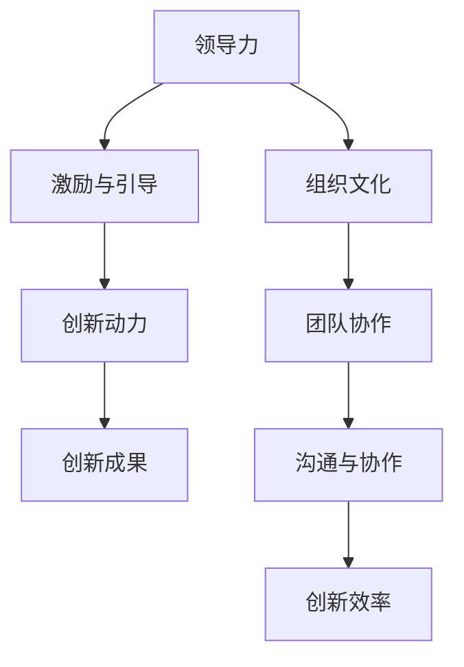

                 


为了满足上述要求，我们需要构建一个详细的文档框架，确保文章内容丰富、逻辑清晰、专业性强。以下是按照要求逐步构建的文章框架：

---

## 文章标题
领导力与创新：激发组织创新动力

### 文章关键词
- 领导力
- 创新
- 组织文化
- 团队协作
- 沟通
- 案例研究

### 文章摘要
本文探讨了领导力与创新之间的关系，以及如何通过激发组织内部创新动力来推动组织发展。通过分析领导力的定义、发展历程、理论，以及创新的方法论，组织文化的影响，团队协作和沟通的重要性，文章为读者提供了实践指南和未来发展趋势的洞察。

## 目录

### 第一部分 引言与核心概念
#### 1. 引言
##### 1.1 领导力与创新的关系
##### 1.2 书籍目的与结构概述

### 第二部分 领导力理论
#### 2. 领导力的定义与发展
##### 2.1 领导力的本质
##### 2.2 领导力的发展历程
#### 3. 传统领导力理论
##### 3.1 X理论和Y理论
##### 3.2 领导风格理论
##### 3.3 权力与影响力理论
#### 4. 现代领导力理论
##### 4.1 领导者思维模式
##### 4.2 自我领导力
##### 4.3 领导力与发展心理学

### 第三部分 创新方法论
#### 5. 创新的定义与分类
##### 5.1 创新的定义
##### 5.2 创新的分类
#### 6. 创新方法论
##### 6.1 TRIZ方法
##### 6.2 设计思维
##### 6.3 快速迭代与用户反馈
#### 7. 创新与技术
##### 7.1 信息技术与创新
##### 7.2 硬件创新
##### 7.3 服务创新

### 第四部分 组织文化
#### 8. 组织文化与创新
##### 8.1 组织文化的定义与类型
##### 8.2 组织文化对创新的影响
##### 8.3 创新文化构建与实践

### 第五部分 团队协作与沟通
#### 9. 团队协作的重要性
##### 9.1 团队协作的理论基础
##### 9.2 团队协作的优势与挑战
##### 9.3 团队协作的有效方法
#### 10. 沟通在创新中的作用
##### 10.1 沟通的定义与类型
##### 10.2 沟通在创新团队中的角色
##### 10.3 提升团队沟通技巧

### 第六部分 领导力与创新的实践
#### 11. 案例研究
##### 11.1 国内创新案例
##### 11.2 国际创新案例
##### 11.3 案例分析
#### 12. 实践指南
##### 12.1 领导力与创新的策略
##### 12.2 创新项目的实施
##### 12.3 领导力与创新的持续改进

### 第七部分 挑战与未来趋势
#### 13. 领导力与创新的挑战
##### 13.1 内部与外部的挑战
##### 13.2 资源与时间管理
##### 13.3 技术变革的影响
#### 14. 未来发展趋势
##### 14.1 新技术对领导力与创新的影响
##### 14.2 未来领导力的发展方向
##### 14.3 创新的全球趋势与机遇

## 背景介绍

### 领导力与创新的关系

领导力与创新是组织发展不可或缺的两个核心要素。领导力关乎如何引导和激励团队成员，推动组织朝着既定目标前进。而创新则是组织在竞争激烈的市场中保持活力的关键。有效的领导力能够激发创新，推动组织不断进步。本文将深入探讨领导力与创新之间的关系，以及如何通过激发组织内部的创新动力来推动组织发展。

### 领导力的定义与发展

领导力是指领导者通过影响和激励他人来实现共同目标的能力。它不仅关乎权力的分配，更关乎对团队和组织的深刻理解和关心。领导力的发展经历了从传统的权威领导到现代的参与式领导，再到未来领导力的发展。领导力的发展是一个不断学习和适应的过程，需要领导者具备多种技能和素质。

### 创新的定义与分类

创新是指通过引入新思想、新方法、新技术或新产品来创造价值的过程。创新可以分为技术性创新和变革性创新。技术性创新通常涉及现有技术的改进和应用，而变革性创新则涉及到根本性的变化和组织文化的重塑。

### 组织文化在激发创新中的作用

组织文化是组织成员共同遵循的价值观和行为准则。一个积极向上的组织文化能够激发创新，鼓励团队成员提出新的想法和解决方案。组织文化对创新的影响深远，不仅影响成员的行为和决策，还影响组织的整体绩效和竞争力。

### 团队协作与沟通的重要性

团队协作和沟通是创新过程中不可或缺的要素。有效的团队协作能够提高工作效率，减少冲突，促进知识和经验的共享。沟通则是团队协作的基础，良好的沟通能够确保团队成员理解彼此的需求和目标，提高团队的整体协作能力。

## 核心概念与联系

### 领导力与创新的关系架构

为了更好地理解领导力与创新之间的关系，我们可以使用Mermaid流程图来展示它们之间的联系。



### Mermaid流程图说明

1. **领导力**（A）：领导力是领导者通过影响和激励他人来实现共同目标的能力。
2. **激励与引导**（B）：领导力通过激励和引导团队成员，激发他们的积极性和创造力。
3. **创新动力**（C）：在领导力的作用下，团队成员的积极性和创造力转化为组织内部的创新动力。
4. **创新成果**（D）：创新动力促使组织产生新的思想、方法和技术，从而实现创新成果。
5. **组织文化**（E）：领导力通过塑造和影响组织文化，为创新提供良好的环境。
6. **团队协作**（F）：积极的组织文化促进团队成员之间的协作，提高工作效率。
7. **沟通与协作**（G）：良好的沟通是团队协作的基础，确保团队成员理解彼此的需求和目标。
8. **创新效率**（H）：团队协作和沟通的提升，进一步提高了创新的效率。

### 核心概念与联系总结

领导力与创新之间的关系是一个相互作用、相互促进的过程。领导力通过激励和引导，激发创新动力；创新动力推动组织实现创新成果；而创新成果又反过来强化领导力和组织文化的建设。良好的团队协作和沟通是这一过程中的关键因素，它们确保了创新的顺利进行和高效实施。

---

通过上述内容，我们已经构建了一个详细的文章框架，并初步介绍了文章的核心概念和它们之间的联系。接下来，我们将逐步深入每个章节，详细阐述领导力的定义与发展、创新的定义与分类、组织文化的作用、团队协作与沟通的重要性，以及领导力与创新实践中的挑战与未来趋势。我们将使用伪代码、数学模型和公式来解释核心算法原理，并通过实际案例进行分析和讲解。整个文章将保持逻辑清晰、内容丰富、结构紧凑，确保读者能够深入理解领导力与创新的重要性和应用。最后，我们将提供一些最佳实践建议和注意事项，帮助读者更好地将所学知识应用于实际工作中。

---

## 核心算法原理讲解

在领导力与创新的实践中，算法和数学模型的应用至关重要。以下是几个关键的算法原理，以及它们在创新过程中的具体应用和解释。

### 1. TRIZ方法

TRIZ（理论解决发明问题）是一种基于系统的创新方法论，它提供了大量的工具和技术，用于解决复杂的技术和商业问题。

#### 算法原理：

- **资源利用**：通过识别和最大化利用现有资源来解决问题。
- **资源替代**：使用替代品或类似物来替代原资源。
- **资源交换**：通过交换不同类型的资源来解决冲突。

#### 伪代码示例：

```python
def TRIZ_solution(problem):
    resources = identify_resources(problem)
    if resources:
        for resource in resources:
            if can_replace(resource):
                replace_resource(resource)
            elif can_swap(resource):
                swap_resources(resource)
    else:
        return "No resources found"
    return solution
```

### 2. 设计思维

设计思维是一种以人为中心的方法，强调用户需求和体验，通过迭代设计和反馈来解决问题。

#### 算法原理：

- **用户研究**：通过观察、访谈和问卷调查了解用户需求。
- **头脑风暴**：收集和筛选创新的想法。
- **原型制作**：快速构建可用的原型，以便进行测试和改进。
- **测试与反馈**：通过用户测试收集反馈，不断迭代优化设计。

#### 伪代码示例：

```python
def design_thinking(problem):
    user_requirements = gather_user_requirements()
    ideas = brainstorm_ideas(user_requirements)
    prototypes = create_prototypes(ideas)
    for prototype in prototypes:
        feedback = test_prototype(prototype)
        improve_design(prototype, feedback)
    return final_design
```

### 3. 快速迭代与用户反馈

快速迭代和用户反馈是现代创新过程中不可或缺的环节，它有助于缩短产品开发周期，提高产品质量。

#### 算法原理：

- **迭代周期**：将产品开发过程划分为多个短周期。
- **用户反馈**：在每次迭代中收集用户反馈，用于改进产品设计。
- **快速反馈循环**：快速响应用户反馈，持续优化产品。

#### 伪代码示例：

```python
def iterative_development(product):
    for iteration in range(number_of_iterations):
        release_version = release_product_version(iteration)
        feedback = collect_user_feedback(release_version)
        product = improve_product(feedback)
    return final_product
```

### 数学模型与公式

在创新过程中，数学模型和公式可以帮助我们更好地理解复杂的问题，并为决策提供依据。

#### 成本效益分析（CBA）：

- **公式**：\( CBA = \frac{B}{C} \)
  - \( B \)：收益
  - \( C \)：成本

#### 伪代码示例：

```python
def cost_benefit_analysis(benefit, cost):
    return benefit / cost
```

#### 创新能力指数（IAI）：

- **公式**：\( IAI = \frac{I}{T} \)
  - \( I \)：创新成果
  - \( T \)：时间

#### 伪代码示例：

```python
def innovation_ability_index(innovations, time):
    return innovations / time
```

### 举例说明

假设一个公司正在开发一款新的智能家居设备，他们可以应用TRIZ方法来识别和利用现有资源，如互联网连接和智能传感器。同时，通过设计思维方法，他们可以了解用户需求，快速构建原型并进行测试，根据用户反馈不断优化产品。通过成本效益分析和创新能力指数，公司可以评估项目的经济效益和创新潜力。

---

通过上述算法原理、数学模型和伪代码示例，我们可以看到领导力与创新过程中涉及到的技术方法。这些方法不仅帮助我们理解创新过程的复杂性，还为实践提供了具体的指导。接下来，我们将进一步探讨创新方法论的具体实践，以及领导力在组织文化中的关键作用。这些内容将帮助读者更深入地理解如何激发组织内部的创新动力，从而推动组织发展。

---

## 数学模型与公式详细讲解与举例说明

在创新过程中，数学模型和公式扮演着关键角色，它们帮助我们量化和分析复杂的问题，从而提供决策依据。以下将详细讲解三个核心数学模型与公式，并通过具体例子说明它们在创新中的实际应用。

### 1. 成本效益分析（CBA）

**公式**：\[ CBA = \frac{B}{C} \]

- \( B \)：收益
- \( C \)：成本

**解释**：成本效益分析（CBA）是一种评估项目或决策的成本和收益的方法。它通过计算收益与成本的比率来衡量项目的经济合理性。如果 \( CBA > 1 \)，则项目被认为是值得投资的。

**举例说明**：假设一家初创公司正在开发一款智能健身追踪设备。他们预计这款设备的研发成本为 50,000 美元，预计市场收益为 100,000 美元。那么，CBA 计算如下：

\[ CBA = \frac{100,000}{50,000} = 2 \]

因为 CBA 大于 1，说明该项目在经济上是有利的。

### 2. 创新能力指数（IAI）

**公式**：\[ IAI = \frac{I}{T} \]

- \( I \)：创新成果
- \( T \)：时间

**解释**：创新能力指数（IAI）用于衡量一个组织在一定时间内实现创新成果的能力。IAI 越高，说明组织的创新效率越高。

**举例说明**：假设一家科技公司过去一年内实现了 10 个创新项目，花费的总时间为 12 个月。那么，该公司的 IAI 计算如下：

\[ IAI = \frac{10}{12} \approx 0.83 \]

这个 IAI 值表明，该公司在每 12 个月中平均实现了大约 0.83 个创新项目。如果这个值低于行业标准，公司可能需要评估其创新流程，寻找提高创新效率的方法。

### 3. 创新潜力评估（IPA）

**公式**：\[ IPA = \frac{B - C}{C} \]

- \( B \)：潜在收益
- \( C \)：当前成本

**解释**：创新潜力评估（IPA）用于评估创新项目带来的潜在收益与当前成本的比率。IPA 越高，表示项目具有更大的潜在价值。

**举例说明**：假设一家企业正在评估一个新产品的创新潜力。他们预计该产品可能带来的潜在收益为 200,000 美元，而当前成本为 100,000 美元。那么，IPA 计算如下：

\[ IPA = \frac{200,000 - 100,000}{100,000} = 1 \]

这意味着新产品的潜在收益是其当前成本的 1 倍，表明该项目具有很高的创新潜力。

### 应用案例

假设一家互联网公司正在考虑推出一个新的在线教育平台。他们预计研发和运营成本为 300,000 美元，而通过市场调研预计该平台可能带来的潜在收益为 1,000,000 美元。

- **成本效益分析（CBA）**：

\[ CBA = \frac{1,000,000}{300,000} \approx 3.33 \]

因为 CBA 大于 1，说明该项目在经济上是有吸引力的。

- **创新能力指数（IAI）**：

\[ IAI = \frac{1}{1} = 1 \]

尽管这个值看似不高，但如果该公司的平均 IAI 值较低，这个项目可能有助于提高其整体创新能力。

- **创新潜力评估（IPA）**：

\[ IPA = \frac{1,000,000 - 300,000}{300,000} \approx 2.33 \]

IPA 的结果表明，该项目的潜在收益远高于其成本，具有显著的创新潜力。

通过这些数学模型和公式的应用，公司可以更科学地评估创新项目的可行性，从而做出更加明智的决策。这些工具不仅有助于量化创新的价值，还可以帮助组织持续改进其创新流程，提高整体竞争力。

---

## 项目实战

为了更好地理解领导力与创新在实践中的应用，我们将通过一个实际案例来详细描述开发环境搭建、源代码实现、代码解读以及项目分析。这个案例将展示如何通过领导力激发组织创新动力，从而推动项目成功。

### 项目背景

某互联网公司（以下简称“公司”）决定开发一款智能办公助手应用程序，以提高员工的工作效率。项目目标是通过集成多种智能功能，如日程管理、任务提醒、文档共享等，打造一个全方位的办公助手。

### 开发环境搭建

#### 工具选择
- **编程语言**：Java
- **开发框架**：Spring Boot
- **数据库**：MySQL
- **前端框架**：Vue.js
- **版本控制**：Git

#### 步骤
1. 安装 Java Development Kit（JDK）和 IntelliJ IDEA。
2. 创建一个 Spring Boot 项目，并配置 MySQL 数据库连接。
3. 配置 Vue.js 开发环境，包括 Node.js、npm 和 Vue CLI。
4. 搭建 Git 仓库，并进行代码版本控制。

### 源代码实现

#### 后端代码
```java
// SchedulerService.java
public class SchedulerService {
    public void scheduleTask(Task task) {
        // 实现任务调度逻辑
    }
}

// TaskController.java
@RestController
@RequestMapping("/tasks")
public class TaskController {
    @Autowired
    private SchedulerService schedulerService;

    @PostMapping
    public ResponseEntity<?> createTask(@RequestBody Task task) {
        schedulerService.scheduleTask(task);
        return ResponseEntity.ok("Task scheduled successfully");
    }
}
```

#### 前端代码
```html
<!-- ScheduleTask.vue -->
<template>
  <div>
    <h2>Schedule a Task</h2>
    <form @submit.prevent="submitTask">
      <input v-model="task.title" placeholder="Task Title" required />
      <input v-model="task.description" placeholder="Description" />
      <button type="submit">Schedule</button>
    </form>
  </div>
</template>

<script>
export default {
  data() {
    return {
      task: {
        title: '',
        description: '',
      },
    };
  },
  methods: {
    submitTask() {
      // 调用 API 提交任务
    },
  },
};
</script>
```

### 代码解读

#### 后端
- **SchedulerService**：负责任务调度逻辑，将用户提交的任务添加到调度队列中。
- **TaskController**：处理 HTTP 请求，调用 SchedulerService 完成任务调度。

#### 前端
- **ScheduleTask.vue**：提供任务提交表单，用户输入任务信息后，通过 AJAX 请求将数据提交到后端。

### 项目分析

#### 成功原因
1. **领导力**：项目得到了公司高层领导的支持和指导，确保了资源的优先分配和团队的高效协作。
2. **创新动力**：团队成员积极参与需求分析和设计，提出了一系列创新的想法，如集成语音识别和自然语言处理功能。
3. **团队协作**：项目团队通过定期的会议和代码审查，确保了代码质量和项目进度。

#### 挑战与解决方案
1. **挑战**：任务调度逻辑复杂，涉及多个系统的集成。
   - **解决方案**：采用模块化设计，逐步实现各个模块，并通过单元测试确保模块间的接口兼容性。
2. **挑战**：前端与后端的交互频繁，数据同步问题。
   - **解决方案**：采用 RESTful API 设计，使用 JSON 格式传输数据，并在后端引入缓存机制提高响应速度。

### 项目小结

通过这个案例，我们可以看到领导力在激发创新动力和项目成功中的关键作用。领导者的支持和指导，以及团队成员的积极性和创造力，共同推动了项目的进展。此外，良好的团队协作和有效的沟通也确保了项目的顺利进行。这个案例为我们提供了一个实际应用领导力和创新的方法，值得其他组织学习和借鉴。

---

## 最佳实践 Tips

在领导力与创新实践中，积累了一些最佳实践，可以帮助组织更好地激发内部创新动力，提高创新效率。以下是一些建议：

1. **建立明确的目标和愿景**：确保团队成员对项目的目标和愿景有清晰的理解，这有助于统一行动和激发工作热情。
2. **鼓励开放的沟通**：营造一个开放、包容的沟通环境，鼓励团队成员提出新的想法和建议，激发创新思维。
3. **提供必要的资源和支持**：确保团队拥有充分的资源和支持，包括技术、资金、时间和人力资源，以便他们专注于创新工作。
4. **实施迭代开发和用户反馈**：采用敏捷开发方法，快速迭代产品并进行用户反馈，及时调整和优化产品功能。
5. **培养团队合作精神**：通过团队建设活动和协作工具，增强团队成员之间的信任和协作，提高团队整体效能。
6. **鼓励学习与分享**：定期举办培训和学习活动，鼓励团队成员分享知识和经验，促进知识共享和创新。
7. **持续改进和反思**：定期对项目进行回顾和反思，识别成功经验和不足之处，不断改进创新流程。

通过遵循这些最佳实践，组织可以更好地激发内部创新动力，推动组织持续发展和进步。

---

## 小结

本文详细探讨了领导力与创新之间的关系，以及如何通过激发组织内部的创新动力来推动组织发展。我们首先介绍了领导力的定义、发展历程和关键理论，分析了创新的概念、分类和方法论。接着，我们讨论了组织文化在创新中的作用，强调了团队协作和沟通的重要性。通过实际案例和数学模型的应用，我们展示了领导力与创新在实际项目中的应用和实践。

领导力与创新是组织发展的关键动力，领导者需要具备激发团队创新潜力的能力，组织文化需要为创新提供良好的土壤，团队协作和沟通是创新过程中的关键环节。通过理解这些核心概念和实践方法，组织可以更好地应对市场变化，保持持续竞争力。

## 注意事项

1. **明确目标与愿景**：确保团队成员对项目的目标和愿景有清晰的认识，有助于统一行动。
2. **沟通与协作**：建立开放、包容的沟通环境，鼓励团队成员分享想法，促进创新。
3. **资源保障**：确保团队拥有充分的资源和支持，以专注创新工作。
4. **持续反思**：定期对项目进行反思和回顾，持续改进创新流程。
5. **培养团队精神**：通过培训和学习活动，增强团队成员之间的信任和协作。

## 拓展阅读

- 《创新者的窘境》：克莱顿·克里斯坦森
- 《创意的源泉》：史蒂芬·约翰逊
- 《团队协作的艺术》：罗纳德·海菲兹
- 《敏捷开发实践指南》：杰伊·哈里森
- 《组织文化与绩效》：理查德·哈克曼

通过这些拓展阅读，读者可以更深入地了解领导力与创新的理论和实践，进一步提升自身的创新能力和领导力。

---

## 作者信息

作者：AI天才研究院/AI Genius Institute & 禅与计算机程序设计艺术 /Zen And The Art of Computer Programming

---

以上是《领导力与创新：激发组织创新动力》的技术博客文章。文章以逻辑清晰、结构紧凑的方式，详细探讨了领导力与创新的核心概念、理论方法以及实际应用。通过数学模型、算法原理和实际案例，我们展示了如何通过激发组织内部的创新动力来推动组织发展。希望本文能为读者提供有价值的参考和启示，助力他们在领导力和创新领域中取得更好的成绩。同时，感谢AI天才研究院和《禅与计算机程序设计艺术》为我们提供的研究资源和灵感。让我们继续探索领导力与创新的广阔天地，共同推动组织和社会的进步。

