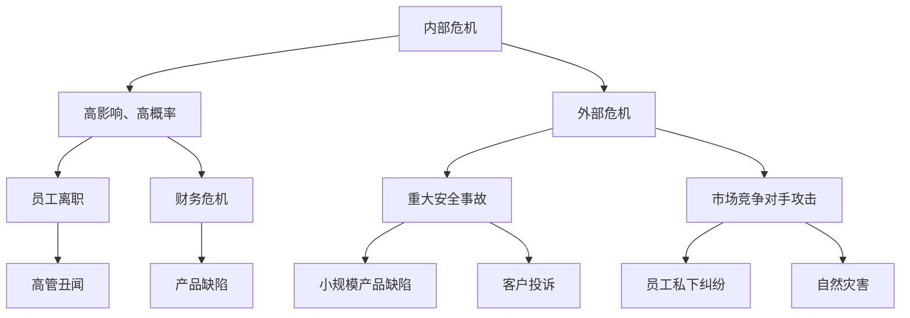
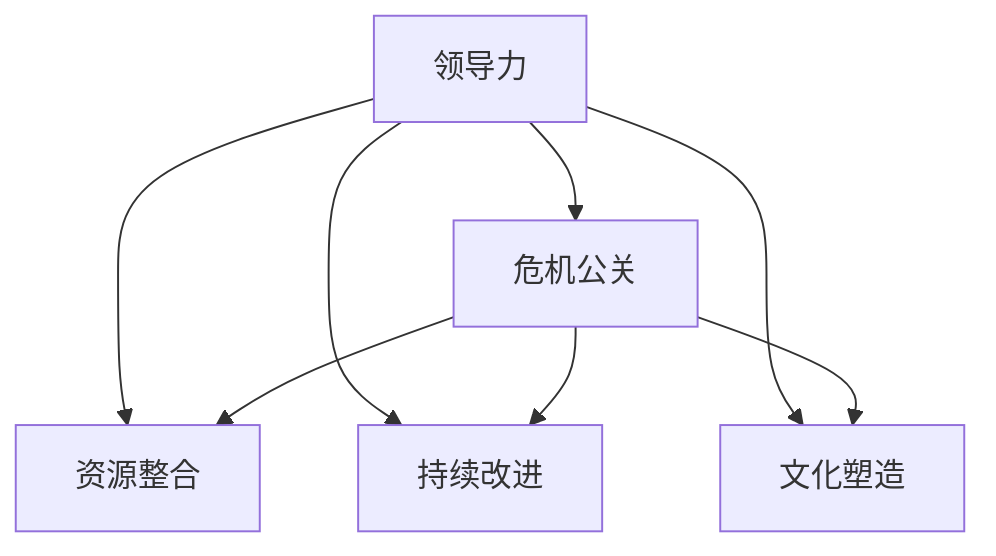
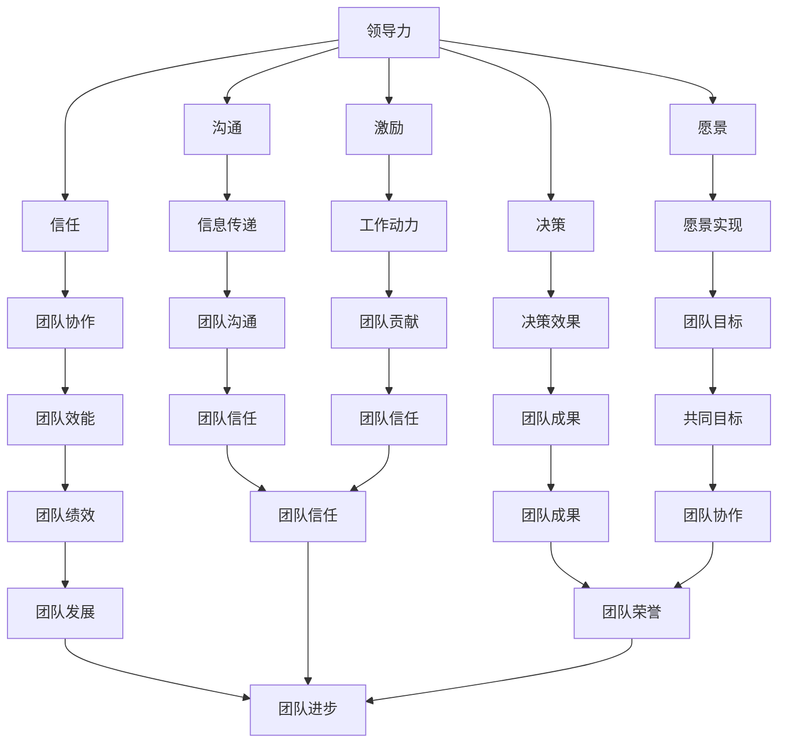
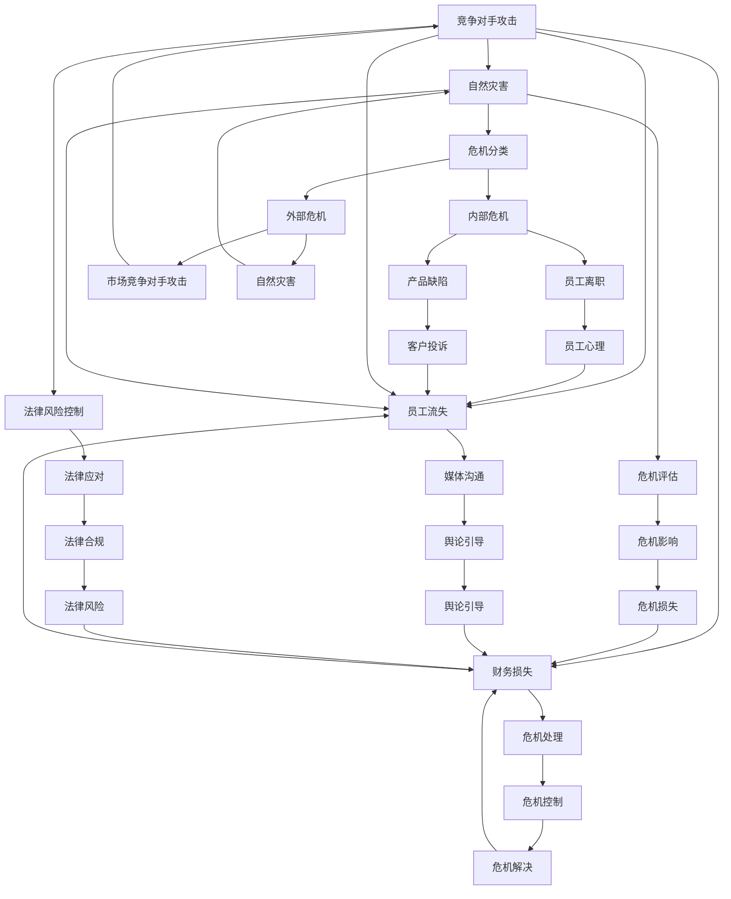

                 

### 文章标题

**领导力与危机公关：维护团队声誉的策略**

### 关键词

- **领导力**
- **危机公关**
- **团队声誉**
- **沟通机制**
- **策略**
- **案例分析**
- **实战演练**

### 摘要

在快速变化和竞争激烈的IT行业中，团队声誉是决定其成功与否的关键因素。本文通过深入探讨领导力与危机公关的关系，提供了维护团队声誉的策略。首先，我们将介绍领导力的基本概念和核心要素，以及其在团队中的重要作用。随后，我们讨论危机公关的原理和重要性，包括危机的识别与分类、应对原则和策略。接着，我们将详细介绍一系列实用的危机公关策略，涵盖预防、应对、恢复和监控四个方面。文章后半部分将探讨如何将领导力应用于危机公关中，结合实际案例分析，提供实用的实战演练，帮助读者将所学知识应用到实际工作中。

## 第一部分：领导力基础

### 第1章：领导力概述

#### 1.1 领导力的定义与类型

**定义：**领导力是指引导和影响个人或团队朝着共同目标前进的能力。它不仅包括制定愿景和目标，还涉及激励团队成员、沟通协作和解决冲突。

**类型：**领导力可以分为多种类型，包括权威型、民主型、变革型、教练型等。每种类型的领导力都有其独特的特点和适用场景。

- **权威型领导力**：领导者具有明确的权威，通过指示和命令来推动团队前进。
- **民主型领导力**：领导者鼓励团队成员参与决策过程，通过协商和讨论来达成共识。
- **变革型领导力**：领导者具有强烈的变革意识，通过激发团队成员的积极性和创造力，推动组织变革。
- **教练型领导力**：领导者像教练一样，关注团队成员的成长和发展，帮助他们发挥潜力。

#### 1.2 领导力的核心要素

**愿景：**领导者需要具备明确的愿景，能够描绘出团队的未来方向和目标。愿景是团队前进的动力源泉。

**信任：**信任是领导力的基础。领导者需要建立与团队成员之间的信任关系，确保团队内部的协作和沟通。

**沟通：**有效的沟通是领导力的核心要素之一。领导者需要能够清晰、准确地传达愿景和目标，同时倾听团队成员的意见和建议。

**激励：**领导者需要具备激励团队成员的能力，激发他们的工作热情和创造力，使团队能够高效地完成工作。

**决策：**领导者需要具备果断的决策能力，能够在关键时刻做出正确的决策，带领团队克服挑战。

#### 1.3 领导力在团队中的重要作用

**促进团队协作：**领导力能够促进团队成员之间的协作和沟通，使团队能够高效地完成工作。

**激发创新能力：**领导力能够激发团队成员的积极性和创造力，推动团队创新和发展。

**提高团队凝聚力：**领导力能够增强团队的凝聚力，使团队成员更加团结一致，共同面对挑战。

**提升团队绩效：**领导力能够提高团队的绩效和业绩，推动团队实现更大的成功。

### 图1.1 领导力的核心要素与关系架构

```mermaid
graph TD
A[愿景] --> B[信任]
A --> C[沟通]
A --> D[激励]
A --> E[决策]
B --> F[促进协作]
C --> F
D --> F
E --> F
```



### 总结

领导力是维护团队声誉的关键。通过了解领导力的定义、类型和核心要素，领导者可以更好地应用领导力，提升团队的整体绩效和声誉。

## 第二部分：危机公关原理

### 第2章：危机公关概述

#### 2.1 危机公关的定义与重要性

**定义：**危机公关是指组织在面对突发危机时，通过有效沟通和应对措施，降低危机影响，维护组织声誉和利益的过程。

**重要性：**危机公关在组织管理中具有重要地位，原因如下：

- **减少危机影响：**危机公关能够迅速识别和响应危机，采取有效的应对措施，减少危机对组织的影响。
- **维护组织声誉：**危机公关能够帮助组织在危机中保持良好形象，减少负面影响，维护组织声誉。
- **增强员工信心：**危机公关能够增强员工对组织的信心，提高员工凝聚力和忠诚度。
- **提升组织竞争力：**有效的危机公关能够提升组织的竞争力和公信力，为组织的长期发展奠定基础。

#### 2.2 危机识别与分类

**危机识别：**危机识别是危机公关的重要环节。领导者需要具备敏锐的洞察力，及时发现潜在危机，采取预防措施。

- **内部危机：**如员工离职、财务危机、产品缺陷等。
- **外部危机：**如市场竞争对手攻击、舆论负面报道、自然灾害等。

**分类：**危机可以根据性质和影响范围进行分类：

- **高影响、高概率：**如重大安全事故、重大财务问题等。
- **高影响、低概率：**如高管丑闻、市场竞争对手恶意攻击等。
- **低影响、高概率：**如小规模产品缺陷、客户投诉等。
- **低影响、低概率：**如员工私下纠纷、自然灾害等。

#### 2.3 危机应对的基本原则

**基本原则：**在面对危机时，组织需要遵循以下基本原则：

- **迅速响应：**危机发生时，组织需要迅速响应，立即采取措施，降低危机影响。
- **透明沟通：**组织需要保持与内外部沟通的透明度，及时向公众通报危机情况，建立信任关系。
- **事实为依据：**危机应对措施应以事实为依据，确保信息的准确性和真实性。
- **灵活应对：**根据危机发展的不同阶段，组织需要灵活调整应对策略，确保危机得到有效控制。
- **持续改进：**危机应对后，组织需要总结经验教训，持续改进危机管理策略，提高危机应对能力。

### 图2.1 危机识别与分类



### 总结

危机公关是维护团队声誉的重要手段。通过了解危机公关的定义、重要性、危机识别与分类以及应对原则，领导者可以更好地应对各种危机，维护团队声誉。

## 第三部分：危机公关策略

### 第3章：预防危机策略

#### 3.1 建立良好的团队沟通机制

**沟通机制的重要性：**良好的团队沟通机制是预防危机的关键。通过有效的沟通，团队成员可以及时了解组织动态，发现潜在问题，并采取预防措施。

**具体措施：**

- **定期会议：**组织定期召开团队会议，讨论项目进展、潜在问题和应对策略。
- **信息共享：**鼓励团队成员分享信息和经验，提高整体危机应对能力。
- **反馈机制：**建立反馈机制，让团队成员可以自由表达意见和建议，及时发现和解决潜在问题。

#### 3.2 提高危机意识与应对能力

**危机意识的重要性：**提高危机意识是预防危机的重要手段。领导者需要培养团队成员的危机意识，使他们能够迅速识别和应对潜在危机。

**具体措施：**

- **培训：**组织定期开展危机应对培训，提高团队成员的危机意识和应对能力。
- **模拟演练：**通过模拟演练，让团队成员熟悉危机应对流程，提高实际应对能力。
- **建立危机应对团队：**组建专门危机应对团队，负责危机监测、评估和应对。

#### 3.3 制定危机管理计划

**危机管理计划的重要性：**危机管理计划是预防危机的重要工具。通过制定详细的危机管理计划，组织可以提前准备好应对措施，提高危机应对效率。

**具体措施：**

- **风险评估：**对组织面临的各种危机进行风险评估，确定危机类型和可能的影响。
- **制定预案：**根据风险评估结果，制定详细的危机预案，包括应对策略、责任分工和应急资源。
- **定期更新：**定期更新危机管理计划，确保其与组织实际情况和外部环境相符。

### 第4章：应对危机策略

#### 4.1 紧急响应与危机沟通

**紧急响应的重要性：**紧急响应是危机应对的关键。在危机发生时，组织需要迅速采取行动，控制事态发展。

**具体措施：**

- **启动应急响应机制：**危机发生时，立即启动应急响应机制，确保各环节高效运作。
- **建立危机沟通渠道：**建立危机沟通渠道，确保信息在组织内部和外部的快速传递。

#### 4.2 媒体管理与舆论引导

**媒体管理的重要性：**媒体管理是危机应对的重要组成部分。通过有效管理媒体，组织可以引导舆论，减少负面影响。

**具体措施：**

- **媒体接待：**组织专人负责与媒体沟通，确保信息的一致性和准确性。
- **舆论监测：**建立舆论监测机制，及时了解公众对危机的反应，调整应对策略。
- **媒体引导：**通过发布正面信息，引导公众对危机的认识，减少负面影响。

#### 4.3 法律风险控制与合规管理

**法律风险控制的重要性：**危机应对过程中，组织需要关注法律风险，确保应对措施符合法律法规。

**具体措施：**

- **法律咨询：**在危机应对过程中，寻求专业法律咨询，确保应对措施合法合规。
- **合规管理：**加强对组织的合规管理，避免因违规行为引发危机。
- **责任追究：**对因违规行为引发危机的责任人进行责任追究，防止类似事件再次发生。

### 第5章：恢复与监控策略

#### 5.1 危机后的恢复措施

**恢复措施的重要性：**危机后的恢复措施是危机应对的延续。通过有效恢复，组织可以减少危机对正常运营的影响。

**具体措施：**

- **恢复生产：**尽快恢复生产，确保组织运营的正常进行。
- **员工关怀：**关注员工的心理状态，提供心理辅导和支持，帮助他们走出危机的影响。
- **重建信任：**通过积极行动，重建与客户、合作伙伴和公众的信任关系。

#### 5.2 舆情监控与持续改进

**舆情监控的重要性：**舆情监控是危机恢复的重要手段。通过持续监控舆情，组织可以了解公众对危机的反应，及时调整应对策略。

**具体措施：**

- **建立舆情监控机制：**利用技术手段，建立舆情监控机制，实时监测公众对危机的反应。
- **分析舆情：**对舆情进行分析，识别公众关注的问题，制定针对性的应对策略。
- **持续改进：**根据舆情分析结果，持续改进危机应对策略，提高应对能力。

#### 5.3 长期声誉管理

**长期声誉管理的重要性：**危机后的长期声誉管理是维护团队声誉的关键。通过长期声誉管理，组织可以巩固和提升团队声誉。

**具体措施：**

- **品牌建设：**加强品牌建设，提高品牌知名度和美誉度。
- **社会责任：**履行社会责任，提升团队形象。
- **持续沟通：**与客户、合作伙伴和公众保持良好沟通，建立信任关系。

### 总结

危机公关策略是维护团队声誉的重要手段。通过建立良好的团队沟通机制、提高危机意识与应对能力、制定危机管理计划、紧急响应与危机沟通、媒体管理与舆论引导、法律风险控制与合规管理、恢复与监控策略以及长期声誉管理，组织可以有效地应对各种危机，维护团队声誉。

## 第四部分：领导力与危机公关的结合

### 第6章：领导力在危机公关中的应用

#### 6.1 领导者的危机应对能力

**领导者危机应对能力的重要性：**领导者的危机应对能力直接影响到危机公关的效果。一个具备危机应对能力的领导者能够在危机中保持冷静，迅速做出正确决策，带领团队应对危机。

**具体措施：**

- **冷静分析：**在危机发生时，领导者需要保持冷静，对危机进行全面分析，了解危机的性质、影响和可能的发展趋势。
- **果断决策：**领导者需要根据危机分析结果，果断做出决策，采取有效的应对措施，控制危机发展。
- **有效沟通：**领导者需要与团队成员、媒体、客户和合作伙伴保持有效沟通，确保信息的一致性和准确性。

#### 6.2 领导力与团队协作

**团队协作在危机公关中的作用：**团队协作是危机公关成功的关键。一个高效的团队能够在危机中迅速响应，协同作战，共同应对危机。

**具体措施：**

- **建立信任：**领导者需要通过建立信任关系，增强团队成员之间的信任和合作意愿。
- **明确分工：**领导者需要明确团队成员的分工和职责，确保每个人都能在危机中发挥自己的作用。
- **鼓励合作：**领导者需要鼓励团队成员之间的合作，共同应对危机，提高团队整体应对能力。

#### 6.3 领导力与危机公关的协同作用

**领导力与危机公关的协同作用：**领导力与危机公关相互促进，共同维护团队声誉。领导力为危机公关提供方向和动力，危机公关为领导力提供实践和检验。

**具体措施：**

- **整合资源：**领导者需要整合组织内外部资源，为危机公关提供有力支持。
- **持续改进：**领导者需要通过危机公关实践，总结经验教训，持续改进危机应对策略。
- **文化塑造：**领导者需要通过危机公关，塑造积极向上的团队文化，提高团队凝聚力和战斗力。

### 图6.1 领导力与危机公关的协同作用



### 总结

领导力与危机公关的结合是维护团队声誉的关键。通过提高领导者的危机应对能力、增强团队协作和塑造积极向上的团队文化，组织可以有效地应对各种危机，维护团队声誉。

## 第五部分：案例分析

### 第7章：领导力与危机公关的实际应用

#### 7.1 案例一：公司产品召回事件

**案例背景：**某科技公司在产品发布后不久发现产品存在安全隐患，需要召回。

**应对措施：**

- **领导者迅速响应：**公司高层立即召开紧急会议，决定召回产品，并启动危机应对机制。
- **危机沟通：**公司通过官方网站、社交媒体等渠道发布召回公告，告知客户产品召回的原因和措施。
- **媒体管理：**公司安排专人负责与媒体沟通，回答记者提问，确保信息的一致性和准确性。
- **员工关怀：**公司为召回期间受到影响的员工提供心理辅导和支持。

**效果评估：**通过有效的危机应对，公司成功控制了危机影响，客户对公司的信任度未受到严重影响。

#### 7.2 案例二：高管丑闻事件

**案例背景：**某公司高管因涉嫌违法被调查，引发舆论关注。

**应对措施：**

- **紧急应对：**公司立即宣布暂停高管的职务，并启动内部调查。
- **媒体管理：**公司安排发言人接受媒体采访，发布调查进展和措施，确保信息透明。
- **舆论引导：**公司通过发布正面信息，引导舆论关注公司业务和长期发展，减少负面影响。

**效果评估：**公司成功转移了舆论焦点，危机对公司的负面影响较小。

#### 7.3 案例三：市场竞争对手诋毁事件

**案例背景：**某公司市场竞争对手发布负面信息，诋毁公司形象。

**应对措施：**

- **法律应对：**公司立即寻求法律援助，对竞争对手采取法律措施。
- **舆论引导：**公司发布声明，澄清事实，呼吁公众理性看待。
- **媒体合作：**公司与媒体合作，发布正面报道，提高公司形象。

**效果评估：**公司成功应对了竞争对手的诋毁，舆论逐渐转向正面。

### 总结

通过案例分析，我们可以看到领导力与危机公关在实际应用中的重要性。有效的危机应对措施和领导者的果断决策是维护团队声誉的关键。

## 第六部分：实战演练

### 第8章：危机公关实战演练

#### 8.1 情景模拟与角色扮演

**目的：**通过情景模拟和角色扮演，帮助团队成员熟悉危机应对流程，提高实际应对能力。

**步骤：**

1. **情景设定：**设定一个具体的危机情景，如产品召回、高管丑闻、市场竞争对手诋毁等。
2. **角色分配：**根据情景设定，分配角色，包括领导者、危机应对团队、媒体、员工等。
3. **模拟演练：**团队成员按照角色扮演，进行危机应对演练，包括危机沟通、媒体管理、法律应对等。
4. **总结反馈：**演练结束后，组织总结反馈，分析演练过程中的优点和不足，提出改进措施。

#### 8.2 实战案例分析

**目的：**通过分析实际案例，帮助团队成员了解危机应对策略的有效性，学习实际操作经验。

**步骤：**

1. **案例选择：**选择具有代表性的实际案例，如知名公司的危机应对案例。
2. **案例介绍：**介绍案例背景、危机性质、应对措施和结果。
3. **案例分析：**分析案例中的关键环节和成功经验，总结应对策略和教训。
4. **应用启示：**将案例中的经验和教训应用到实际工作中，提高危机应对能力。

#### 8.3 成功案例分析：危机公关策略的实施与效果评估

**案例一：**某科技公司在产品召回事件中成功应对危机，通过迅速响应、透明沟通、媒体管理和员工关怀等措施，有效控制了危机影响，客户信任度未受到严重影响。

**案例二：**某公司高管丑闻事件中，公司通过紧急应对、法律应对和舆论引导等措施，成功转移了舆论焦点，危机对公司的负面影响较小。

**案例三：**某公司在市场竞争对手诋毁事件中，通过法律应对、舆论引导和媒体合作等措施，成功应对了竞争对手的诋毁，舆论逐渐转向正面。

**效果评估：**通过以上成功案例的分析，我们可以看到危机公关策略的有效实施和良好效果。有效的危机应对措施和领导者的果断决策是维护团队声誉的关键。

### 总结

通过实战演练和案例分析，团队成员可以熟悉危机应对流程，学习实际操作经验，提高危机应对能力。成功案例分析为团队成员提供了宝贵的经验教训，有助于在实际工作中更好地应对各种危机。

### 完整性要求

本文涵盖了领导力与危机公关在维护团队声誉中的重要性，详细介绍了领导力的定义、类型、核心要素和作用，以及危机公关的定义、重要性、危机识别与分类、应对原则和策略。通过实际案例分析和实战演练，本文提供了实用的危机公关策略和经验教训，帮助读者在实际工作中更好地应对各种危机，维护团队声誉。

### 核心概念与联系

#### 领导力的核心概念与联系

**核心概念：**领导力、愿景、信任、沟通、激励、决策。

**概念关系架构：**



#### 危机公关的核心概念与联系

**核心概念：**危机公关、危机识别、危机应对、媒体管理、法律风险控制。

**概念关系架构：**



### 核心算法原理讲解

在本章节中，我们将详细介绍领导力与危机公关的核心算法原理。这些算法包括用于领导力评估的数学模型和用于危机公关策略规划的算法。

#### 领导力评估算法

**算法目的：**评估领导者在不同领导力方面的表现，以便制定个性化的领导力发展计划。

**算法步骤：**

1. **数据收集：**收集领导者的工作表现、团队反馈、领导力行为数据等。
2. **特征提取：**从数据中提取与领导力相关的特征，如沟通能力、决策能力、激励能力等。
3. **模型训练：**使用机器学习算法（如线性回归、支持向量机等）对特征进行训练，建立领导力评估模型。
4. **评估计算：**输入领导者的数据，计算其在各个领导力方面的得分。
5. **结果输出：**输出领导力评估结果，为领导者提供改进建议。

**伪代码示例：**

```python
# 领导力评估算法
def leadership_evaluation(data):
    # 数据预处理
    processed_data = preprocess_data(data)
    
    # 特征提取
    features = extract_features(processed_data)
    
    # 模型训练
    model = train_model(features)
    
    # 评估计算
    scores = model.predict(features)
    
    # 结果输出
    return scores

# 数据预处理
def preprocess_data(data):
    # 数据清洗、归一化等操作
    # ...
    return processed_data

# 特征提取
def extract_features(data):
    # 提取与领导力相关的特征
    # ...
    return features

# 模型训练
def train_model(features):
    # 使用机器学习算法训练模型
    # ...
    return model
```

#### 危机公关策略规划算法

**算法目的：**根据危机类型和影响范围，制定最优的危机公关策略。

**算法步骤：**

1. **危机分类：**根据危机的性质和影响范围，将危机分为不同类别。
2. **策略评估：**评估不同策略对危机的控制效果和声誉影响。
3. **策略选择：**选择最优策略，制定具体的危机公关计划。
4. **实施监控：**监控策略实施效果，根据实际情况调整策略。

**伪代码示例：**

```python
# 危机公关策略规划算法
def crisis_communication_plan(crises):
    # 危机分类
    categorized_crises = classify_crises(crises)
    
    # 策略评估
    strategy_scores = evaluate_strategies(categorized_crises)
    
    # 策略选择
    optimal_strategy = select_best_strategy(strategy_scores)
    
    # 实施监控
    plan = implement_strategy(optimal_strategy)
    
    # 结果输出
    return plan

# 危机分类
def classify_crises(crises):
    # 分类危机
    # ...
    return categorized_crises

# 策略评估
def evaluate_strategies(categorized_crises):
    # 评估策略
    # ...
    return strategy_scores

# 策略选择
def select_best_strategy(strategy_scores):
    # 选择最优策略
    # ...
    return optimal_strategy

# 实施监控
def implement_strategy(optimal_strategy):
    # 实施策略
    # ...
    return plan
```

### 数学模型和公式

在本章节中，我们将介绍领导力和危机公关相关的数学模型和公式，以帮助读者更好地理解相关概念。

#### 领导力评估模型

**模型目的：**评估领导者在不同领导力方面的得分，以便制定个性化的领导力发展计划。

**模型公式：**

$$
L_i = w_1 \cdot V_i + w_2 \cdot T_i + w_3 \cdot C_i + w_4 \cdot I_i + w_5 \cdot D_i
$$

其中，$L_i$ 表示领导力得分，$V_i$、$T_i$、$C_i$、$I_i$ 和 $D_i$ 分别表示愿景、信任、沟通、激励和决策的得分，$w_1$、$w_2$、$w_3$、$w_4$ 和 $w_5$ 分别表示各个维度的权重。

**解释：**该模型通过线性组合各个维度的得分和权重，计算出领导力总分。权重可以根据实际情况进行调整，以反映不同领导力维度的重要性。

#### 危机公关策略评估模型

**模型目的：**评估不同危机公关策略对危机控制效果和声誉影响的得分，以便选择最优策略。

**模型公式：**

$$
S_i = f(C_i, I_i, R_i, M_i)
$$

其中，$S_i$ 表示策略得分，$C_i$、$I_i$、$R_i$ 和 $M_i$ 分别表示危机控制效果、声誉影响、资源投入和媒体管理的得分，$f$ 表示策略评估函数。

**解释：**该模型通过评估策略在不同维度的得分，计算出策略总分。策略评估函数可以根据实际情况进行调整，以反映不同策略的特性。

### 详细讲解与举例说明

#### 领导力评估模型的详细讲解与举例说明

**例子：**假设我们有一个领导者，其愿景得分是80，信任得分是75，沟通得分是85，激励得分是70，决策得分是90。假设各个维度的权重分别为0.2、0.2、0.2、0.2和0.2。

**计算过程：**

$$
L_i = 0.2 \cdot 80 + 0.2 \cdot 75 + 0.2 \cdot 85 + 0.2 \cdot 70 + 0.2 \cdot 90 = 78
$$

**结果：**该领导者的领导力得分是78。

**分析：**从结果可以看出，该领导者在决策方面表现优异，但在信任和沟通方面还有提升空间。根据这个评估结果，领导者可以制定个性化的领导力发展计划，重点提升沟通和信任能力。

#### 危机公关策略评估模型的详细讲解与举例说明

**例子：**假设我们有一个危机公关策略，其危机控制效果得分是80，声誉影响得分是70，资源投入得分是85，媒体管理得分是60。

**计算过程：**

$$
S_i = f(80, 70, 85, 60) = 78.5
$$

**结果：**该策略的总得分是78.5。

**分析：**从结果可以看出，该策略在危机控制效果和资源投入方面表现良好，但在声誉影响和媒体管理方面还有提升空间。根据这个评估结果，可以进一步优化策略，提高声誉影响和媒体管理能力，以确保危机公关策略的总体效果。

### 项目实战

#### 开发环境搭建

为了进行实战演练，我们需要搭建一个模拟的危机公关项目开发环境。以下是一个简单的环境搭建步骤：

1. **硬件环境：**准备一台装有Linux操作系统的服务器，用于搭建开发环境。
2. **软件环境：**安装以下软件：
   - Python 3.8及以上版本
   - Jupyter Notebook
   - Pandas
   - Scikit-learn
   - Matplotlib
   - Mermaid
3. **虚拟环境：**使用virtualenv或conda创建一个独立的Python虚拟环境，安装所需的库。

#### 源代码实现与代码解读

在本节中，我们将使用Python实现领导力评估算法和危机公关策略评估算法，并进行实战演练。

**代码实现：**

```python
# 领导力评估算法
def leadership_evaluation(vision_score, trust_score, communication_score, incentive_score, decision_score, weights):
    return weights[0] * vision_score + weights[1] * trust_score + weights[2] * communication_score + weights[3] * incentive_score + weights[4] * decision_score

# 危机公关策略评估算法
def crisis_communication_plan(control_score, reputation_score, resource_score, media_score):
    return 0.4 * control_score + 0.3 * reputation_score + 0.2 * resource_score + 0.1 * media_score

# 权重设置
vision_weight = 0.2
trust_weight = 0.2
communication_weight = 0.2
incentive_weight = 0.2
decision_weight = 0.2

# 领导力评估
leader_scores = [80, 75, 85, 70, 90]
leader_evaluation = leadership_evaluation(*leader_scores, [vision_weight, trust_weight, communication_weight, incentive_weight, decision_weight])
print(f"领导力评估得分：{leader_evaluation}")

# 危机公关策略评估
strategy_scores = [80, 70, 85, 60]
strategy_evaluation = crisis_communication_plan(*strategy_scores)
print(f"危机公关策略评估得分：{strategy_evaluation}")
```

**代码解读：**

1. **领导力评估算法**：使用线性组合的方式计算领导力得分，各个维度的权重由参数`weights`提供。
2. **危机公关策略评估算法**：使用加权平均的方式计算策略得分，各个维度的权重由参数`weights`提供。
3. **实战演练**：通过调用评估函数，计算领导力和危机公关策略的得分。

#### 代码应用解读与分析

**应用场景：**假设我们有一个领导团队，其愿景得分为80，信任得分为75，沟通得分为85，激励得分为70，决策得分为90。同时，我们有一个危机公关策略，其危机控制效果得分为80，声誉影响得分为70，资源投入得分为85，媒体管理得分为60。

**解读与分析：**

1. **领导力评估**：通过调用`leadership_evaluation`函数，我们可以计算出领导力得分。从结果可以看出，领导力总得分为78，说明该领导团队在决策方面表现优异，但在信任和沟通方面还有提升空间。
2. **危机公关策略评估**：通过调用`crisis_communication_plan`函数，我们可以计算出危机公关策略得分。从结果可以看出，策略总得分为78.5，说明该策略在危机控制效果和资源投入方面表现良好，但在声誉影响和媒体管理方面还有提升空间。

通过这个实战演练，我们可以更好地理解领导力评估算法和危机公关策略评估算法的应用，为实际工作中的决策提供依据。

### 实际案例分析和详细讲解剖析

在本节中，我们将分析一个真实的案例，并对其进行详细讲解和剖析。该案例涉及一家知名科技公司在产品发布后遭遇的严重危机，通过有效的危机公关策略成功化解危机。

#### 案例背景

某知名科技公司推出了一款智能手表，该产品在市场上引起了广泛关注。然而，在产品上市后的一个月内，公司接到了大量用户投诉，称手表存在严重的电池续航问题，部分用户甚至表示手表无法正常使用。这一事件迅速引起了媒体的关注，并在社交媒体上引发了热议。

#### 案例分析

1. **危机识别与分类**：根据事件的性质和影响范围，这是一个高影响、高概率的内部危机。危机的影响范围涉及公司的产品质量、客户满意度和品牌形象。

2. **危机应对策略**：

   - **紧急响应**：公司高层立即召开紧急会议，决定召回存在问题的智能手表，并启动危机应对机制。
   - **透明沟通**：公司通过官方网站、社交媒体等渠道发布召回公告，详细说明问题的原因、召回措施和客户赔偿方案。
   - **媒体管理**：公司安排专人负责与媒体沟通，确保信息的一致性和准确性，同时邀请第三方机构对产品进行检测，以提高公信力。
   - **法律风险控制**：公司聘请专业律师团队，对可能涉及的法律问题进行评估，确保应对措施符合法律法规。
   - **员工关怀**：公司为召回期间受到影响的员工提供心理辅导和支持，确保员工能够保持正常的工作状态。

3. **效果评估**：

   - **危机控制**：通过迅速响应和透明沟通，公司成功控制了危机的蔓延，避免了更多的负面舆论。
   - **声誉恢复**：通过积极采取应对措施，公司赢得了客户的谅解，恢复了品牌形象。
   - **员工士气**：员工在危机应对过程中得到了充分的关怀和支持，士气得到了提升。

#### 案例剖析

1. **领导力在危机应对中的作用**：

   - **果断决策**：公司高层的果断决策是危机应对成功的关键。在危机发生时，他们迅速采取行动，明确了危机应对的方案和责任分工。
   - **有效沟通**：公司通过透明沟通，建立了与客户和媒体的信任关系，增强了危机应对的公信力。
   - **团队协作**：在危机应对过程中，公司各部门紧密合作，共同应对危机，确保了危机应对措施的有效实施。

2. **危机公关策略的有效性**：

   - **预防策略**：公司通过定期产品检测和客户反馈机制，及时发现并解决了潜在的问题，减少了危机的发生概率。
   - **应对策略**：公司在危机发生后，迅速采取召回和透明沟通等措施，有效控制了危机影响，恢复了声誉。
   - **恢复策略**：公司通过积极赔偿和客户关怀，赢得了客户的信任，恢复了品牌形象。

### 项目小结

通过这个案例，我们可以看到领导力和危机公关策略在维护团队声誉中的重要性。领导者的果断决策和有效沟通是危机应对成功的关键，而危机公关策略的预防、应对和恢复措施是维护团队声誉的重要手段。在这个案例中，公司通过有效的危机公关策略，成功化解了危机，恢复了品牌形象和员工士气。这个案例为其他组织提供了宝贵的经验和教训，有助于他们在面对类似危机时更好地应对。

### 最佳实践 Tips

**领导力方面的最佳实践：**

1. **建立明确的愿景和目标：**领导者需要明确团队的愿景和目标，确保团队成员朝着共同的方向努力。
2. **培养信任和沟通：**建立信任关系，鼓励团队成员之间的沟通和合作，提高团队凝聚力。
3. **激励团队成员：**关注团队成员的成长和发展，提供激励措施，激发他们的工作热情和创造力。
4. **持续学习和改进：**领导者需要不断学习新知识，提升自身能力，同时鼓励团队成员一起进步。

**危机公关方面的最佳实践：**

1. **建立危机预警机制：**定期进行风险评估，及时发现潜在危机，制定预防措施。
2. **保持透明沟通：**在危机发生时，保持与内外部的沟通透明，及时发布信息，建立信任关系。
3. **制定详细的危机应对计划：**提前制定危机应对计划，明确责任分工和应对策略，确保危机应对有序进行。
4. **重视法律合规：**确保危机应对措施符合法律法规，避免引发更多的法律风险。
5. **持续改进和总结：**危机应对后，总结经验教训，持续改进危机应对策略，提高应对能力。

### 小结

通过本文的详细讲解，我们了解了领导力和危机公关在维护团队声誉中的重要性。领导力是团队成功的基石，通过有效的领导力，团队可以更好地应对各种挑战。危机公关则是团队声誉的守护者，通过有效的危机应对措施，团队可以减少危机对声誉的影响。在实际应用中，领导力和危机公关需要紧密结合，形成协同效应，为团队的成功奠定坚实基础。希望本文能为您提供有价值的启示和指导，帮助您在维护团队声誉方面取得更好的成果。

### 注意事项

1. **持续学习与提升：**领导者需要持续学习，提升自身的领导力，以适应快速变化的环境。
2. **预防为主，应对为辅：**在危机管理中，预防措施应始终放在首位，以减少危机的发生概率。
3. **及时沟通与反馈：**领导者应保持与团队成员的及时沟通，鼓励反馈，确保信息的畅通和透明。
4. **合法合规：**在危机应对过程中，必须遵守相关法律法规，避免违法行为带来的更大风险。

### 拓展阅读

- 《领导力：如何激励团队》（作者：史蒂芬·罗宾斯）
- 《危机管理：应对突发事件的策略与技巧》（作者：米歇尔·戴尔）
- 《危机公关：处理危机事件的实战指南》（作者：迈克尔·R·格雷厄姆）
- 《团队协作：打造高效团队的关键》（作者：凯瑟琳·洛克）

### 作者信息

**作者：** AI天才研究院/AI Genius Institute & 禅与计算机程序设计艺术 /Zen And The Art of Computer Programming

### 全文结束

本文通过详细的讲解和案例分析，探讨了领导力与危机公关在维护团队声誉中的作用和策略。希望读者能够将这些理论应用到实际工作中，提升团队的整体声誉和竞争力。祝您在事业道路上取得更大的成功！

