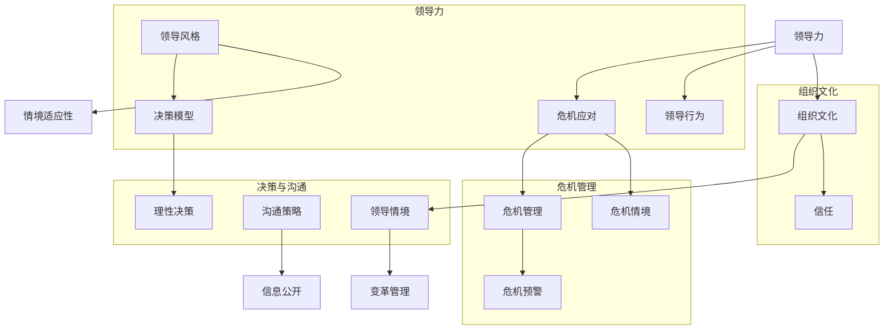

                 


### 领导力与危机应对：化危为机的领导智慧

#### 关键词：领导力、危机管理、化危为机、决策、沟通、情境分析、组织文化

#### 摘要：

在快速变化和高度不确定性的当今商业环境中，领导力与危机应对能力成为了企业成功的关键。本文将深入探讨领导力与危机应对的关系，从基本理论到实践策略，分析危机管理中的领导智慧。通过详细阐述领导力模型、危机管理原则、领导者在危机中的角色，以及实际案例研究，本文旨在为领导者提供一套全面、实用的化危为机的策略框架。

#### 目录：

1. **领导力概述**
   - 领导力的定义与历史演变
   - 领导力的核心要素
   - 领导力的类型与风格
2. **领导力模型**
   - 经典领导力模型介绍
   - 领导行为模型
   - 领导情境模型
   - 领导影响力模型
3. **领导力与组织文化**
   - 组织文化的定义与类型
   - 领导力对组织文化的影响
   - 构建积极组织文化的领导策略
4. **危机管理的概念**
   - 危机的定义与类型
   - 危机管理的核心原则
   - 危机管理的生命周期
5. **危机情境分析**
   - SWOT分析
   - 风险评估
   - 决策模型在危机情境中的应用
6. **危机应对策略**
   - 应急预案制定
   - 领导者在危机中的角色与决策
   - 沟通策略与公众关系管理
7. **领导力与危机管理的融合**
   - 领导力在危机管理中的应用
   - 领导者在危机情境下的决策模型
   - 领导力在危机恢复阶段的作用
8. **案例分析**
   - 国内外危机管理经典案例
   - 案例解析与启示
   - 化危为机的领导智慧
9. **实践指导**
   - 领导力与危机应对的培训与提升
   - 领导力发展计划
   - 领导力与危机应对的未来趋势
10. **附录**
   - 领导力与危机应对工具与方法
   - 参考文献

### 第一部分：领导力基础理论

#### 1.1 领导力的定义与历史演变

领导力，作为一个广泛讨论的话题，其定义随时间的推移和社会环境的变化而不断发展。传统上，领导力被视为一种能力或特质，即领导者必须具备某些固有的素质，如远见、勇气和影响力。然而，现代领导力理论强调领导是一种互动过程，涉及领导者与追随者之间的动态关系。

领导力的概念可以追溯到古代哲学和军事策略。古希腊哲学家柏拉图和亚里士多德在其著作中探讨了领导者的品质和行为。随着时间的推移，领导力理论经历了多个阶段：

- **特质理论（Trait Theory）**：强调领导者天生具备某些特质，如智商、自信心和道德品质。
- **行为理论（Behavioral Theory）**：关注领导者的具体行为，而不是其个人特质，认为不同的情境需要不同的领导行为。
- **情境理论（Contingency Theory）**：认为没有一种普遍适用的领导风格，领导行为应根据具体情境进行调整。
- **转型理论（Transformational Theory）**：强调领导者的变革能力，通过激发追随者的潜能和动机，实现组织目标。

在现代商业环境中，领导力不仅涉及战略规划和决策能力，还包括情感智慧、创新能力和社会责任感。有效的领导者需要具备跨文化沟通能力、团队协作能力以及对未来趋势的敏锐洞察力。

#### 1.2 领导力的核心要素

领导力的核心要素包括以下几个方面：

1. **影响力**：领导者需要能够影响和激励他人，使团队成员朝着共同目标努力。
2. **愿景**：领导者应具备清晰、激励人心的愿景，能够引导组织朝着未来前进。
3. **决策能力**：在复杂和不确定的环境中，领导者需要做出明智、及时的决策。
4. **沟通能力**：有效的沟通是领导者成功的关键，包括倾听、表达和传达信息的能力。
5. **团队协作**：领导者需要能够建立高效的团队，促进团队成员之间的合作和协作。
6. **变革管理**：在快速变化的市场环境中，领导者需要推动组织进行必要的变革。

#### 1.3 领导力的类型与风格

领导力有多种类型和风格，每种风格都有其适用的情境和效果。以下是几种常见的领导力类型：

1. **权威型领导**：领导者集中决策权，强调命令和控制。
2. **民主型领导**：领导者鼓励团队成员参与决策过程，尊重团队成员的意见。
3. **参与型领导**：领导者与团队成员共同制定决策，注重团队合作和共同成长。
4. **变革型领导**：领导者通过激发追随者的潜能和动机，推动组织实现变革和创新。
5. **服务型领导**：领导者将团队成员的需求置于首位，致力于为团队成员提供支持和资源。

每种领导风格都有其优势和局限性，领导者需要根据具体情况灵活运用不同的风格。

### 第二部分：领导力模型

#### 2.1 经典领导力模型介绍

经典领导力模型包括领导行为模型、领导情境模型和领导影响力模型。这些模型为我们理解领导行为和领导效果提供了不同的视角。

1. **领导行为模型**：该模型关注领导者的行为，将领导行为分为任务导向和关系导向。任务导向的领导者关注目标实现，注重任务的分配和监控；关系导向的领导者关注团队成员的需求和情感，注重建立信任和团队合作。
2. **领导情境模型**：该模型认为没有一种普遍适用的领导风格，领导行为应取决于具体情境。领导情境模型包括费德勒模型和路径-目标模型。费德勒模型强调领导者与情境的匹配，路径-目标模型则关注领导者如何通过设定目标和提供支持来指导团队成员。
3. **领导影响力模型**：该模型关注领导者如何影响他人，包括变换型领导和交易型领导。变换型领导者通过激励、启发和愿景引导团队成员，交易型领导者则通过奖惩机制激励团队成员。

#### 2.2 领导行为模型

领导行为模型由保罗·赫塞和肯尼斯·布兰查德提出，将领导行为分为任务导向和关系导向。

1. **任务导向**：任务导向的领导者关注目标的实现，强调任务的分配和监控。他们通过明确的指导、监督和评估来确保团队成员按计划完成任务。
2. **关系导向**：关系导向的领导者关注团队成员的需求和情感，注重建立信任和团队合作。他们通过倾听、支持、鼓励和沟通来增强团队成员的参与感和归属感。

在具体应用中，领导者需要根据具体情境灵活运用任务导向和关系导向的行为。例如，在紧急情况下，任务导向的行为可能更为重要；而在团队合作和项目开发阶段，关系导向的行为可能更具效果。

#### 2.3 领导情境模型

领导情境模型认为领导行为应取决于具体情境。以下是两种常见的领导情境模型：

1. **费德勒模型**：费德勒模型认为领导者与情境的匹配是领导成功的关键。模型将领导情境分为有利和不利情境，领导者应根据自己的情境适应性选择适当的领导风格。

   - **有利情境**：在这种情境下，领导者拥有充分的资源和权力，可以自由地影响团队成员。费德勒模型建议领导者采用权威型领导风格，以最大化领导效果。
   - **不利情境**：在这种情境下，领导者面临诸多限制和挑战，如资源匮乏、团队成员不合作等。费德勒模型建议领导者采用民主型领导风格，以增强团队成员的参与感和责任感。

2. **路径-目标模型**：路径-目标模型关注领导者如何通过设定目标和提供支持来指导团队成员。领导者应根据团队成员的个性、动机和能力，选择适当的领导风格。

   - **指导型领导**：领导者为团队成员提供明确的指导和支持，帮助团队成员理解任务要求和目标。
   - **支持型领导**：领导者关心团队成员的需求和情感，提供情感支持和资源。
   - **参与型领导**：领导者与团队成员共同制定决策，鼓励团队成员参与决策过程。

#### 2.4 领导影响力模型

领导影响力模型关注领导者如何影响他人，包括变换型领导和交易型领导。

1. **变换型领导**：变换型领导者通过激励、启发和愿景引导团队成员。他们关注团队成员的个人成长和发展，鼓励团队成员挑战自我、实现卓越。变换型领导者通常具备以下特点：

   - **激励**：变换型领导者能够激发团队成员的内在动机和动力，使他们为实现组织目标而努力。
   - **启发**：变换型领导者通过分享愿景和价值观，激发团队成员的创造力和创新精神。
   - **愿景**：变换型领导者拥有清晰的愿景，能够引导团队成员朝着共同目标努力。

2. **交易型领导**：交易型领导者通过奖惩机制激励团队成员。他们关注团队成员的行为和绩效，通过奖励和惩罚来影响团队成员的行为。交易型领导者通常具备以下特点：

   - **奖励**：交易型领导者为表现优秀的团队成员提供奖励，以激励团队成员保持良好的工作状态。
   - **惩罚**：交易型领导者对违反规定或表现不佳的团队成员实施惩罚，以纠正不良行为。

在具体应用中，领导者应根据团队成员的个性、动机和能力，选择适当的领导风格。变换型领导和交易型领导并不是相互排斥的，领导者可以结合两者的优势，根据具体情境灵活运用。

### 第三部分：领导力与组织文化

#### 3.1 组织文化的定义与类型

组织文化是指组织内部共同价值观、信仰、行为准则和规范的总和。组织文化对领导力有重要影响，有效的领导力能够塑造和强化组织文化。

根据组织文化的特征，可以将组织文化分为以下几种类型：

1. **任务型文化**：任务型文化注重目标实现和绩效。在这种文化中，领导者的任务是确保团队成员专注于目标，提高工作效率。
2. **关系型文化**：关系型文化注重团队成员之间的相互关系和信任。在这种文化中，领导者的任务是建立和维护良好的团队关系，促进团队成员之间的合作和沟通。
3. **学习型文化**：学习型文化注重持续学习和创新。在这种文化中，领导者的任务是激发团队成员的学习热情和创新能力，推动组织不断进步。
4. **控制型文化**：控制型文化注重规则和权威。在这种文化中，领导者的任务是确保团队成员遵守规定，维护组织的稳定和秩序。

#### 3.2 领导力对组织文化的影响

领导力对组织文化有重要影响，领导者的行为和决策将直接影响组织文化的形成和发展。

1. **塑造组织价值观**：领导者通过自己的行为和决策，传递组织价值观和信仰。领导者应具备良好的道德品质和价值观，以身作则，树立榜样。
2. **影响团队成员行为**：领导者的行为和决策会影响团队成员的行为和态度。有效的领导者能够激发团队成员的积极性、责任感和归属感。
3. **推动组织变革**：在组织变革过程中，领导者扮演关键角色。领导者需要具备变革管理能力，推动团队成员接受变革、适应变革，并实现组织目标。

#### 3.3 构建积极组织文化的领导策略

要构建积极的组织文化，领导者可以采取以下策略：

1. **明确组织愿景和价值观**：领导者应明确组织愿景和价值观，并将其传递给团队成员。组织愿景和价值观是组织文化的核心。
2. **建立信任和沟通**：领导者应建立信任和沟通机制，促进团队成员之间的合作和沟通。信任是组织文化的基石。
3. **激励团队成员**：领导者应激励团队成员，激发他们的积极性、责任感和归属感。激励是组织文化的重要组成部分。
4. **推动学习与创新**：领导者应鼓励团队成员持续学习和创新，推动组织不断进步。学习型文化是组织持续发展的关键。

### 第四部分：危机管理的概念

#### 4.1 危机的定义与类型

危机是指组织面临的一种严重的不确定性和威胁，可能导致组织目标无法实现，甚至威胁到组织的生存。根据危机的性质和影响范围，可以将危机分为以下几种类型：

1. **业务危机**：业务危机是指组织核心业务或关键运营受到严重威胁，可能导致业务中断或严重损失。例如，产品召回、服务质量问题等。
2. **声誉危机**：声誉危机是指组织的声誉和形象受到严重损害，可能导致公众信任度下降，影响组织的市场地位和品牌价值。例如，负面新闻、欺诈行为等。
3. **财务危机**：财务危机是指组织面临严重的财务困境，可能导致破产或财务重组。例如，现金流短缺、债务违约等。
4. **法律危机**：法律危机是指组织因违反法律法规而面临诉讼、罚款或其他法律制裁。例如，环境污染、侵权行为等。

#### 4.2 危机管理的核心原则

危机管理是指组织在面临危机时采取的一系列应对措施，旨在降低危机影响，恢复组织正常运营和信誉。危机管理的核心原则包括：

1. **预防为主**：预防是危机管理的重要原则，通过识别潜在风险和采取预防措施，降低危机发生的可能性。
2. **及时响应**：在危机发生时，及时响应是关键。领导者需要迅速采取行动，制定应对策略，确保危机得到有效控制。
3. **信息公开**：在危机管理过程中，信息公开至关重要。领导者需要向内部员工、外部合作伙伴和公众传达危机信息，增强透明度和信任。
4. **资源整合**：危机管理需要组织内外资源的整合，包括人力资源、物资资源和信息资源。领导者需要协调各方资源，确保危机应对措施的有效实施。
5. **持续改进**：危机管理不是一次性的活动，而是一个持续的过程。领导者需要从危机中吸取教训，不断改进危机应对策略和组织管理体系。

#### 4.3 危机管理的生命周期

危机管理包括危机预警、危机应对和危机恢复三个阶段，形成了一个完整的生命周期。

1. **危机预警**：在危机预警阶段，组织需要识别潜在风险，建立预警机制，及时监测和评估危机发生的可能性。领导者应关注市场动态、政策变化、竞争对手行为等外部因素，以及组织内部的管理漏洞和风险点。
2. **危机应对**：在危机应对阶段，组织需要迅速采取行动，制定应对策略，控制危机影响。领导者应成立危机应对小组，明确职责分工，制定应急计划，确保危机得到有效控制。
3. **危机恢复**：在危机恢复阶段，组织需要恢复正常运营，修复声誉，重建信任。领导者应关注危机对组织内部和外部的影响，采取补救措施，恢复组织声誉和市场地位。

### 第五部分：危机情境分析

#### 5.1 SWOT分析

SWOT分析是一种常用的战略分析工具，用于评估组织的优势、劣势、机会和威胁。在危机情境中，SWOT分析有助于领导者全面了解组织的内外部环境，制定应对策略。

1. **优势（Strengths）**：优势是指组织在危机情境中具备的竞争优势和资源。例如，强大的品牌影响力、丰富的经验和技术能力等。
2. **劣势（Weaknesses）**：劣势是指组织在危机情境中存在的不足和挑战。例如，资源匮乏、管理体系不完善、员工士气低落等。
3. **机会（Opportunities）**：机会是指危机情境中可能出现的机遇和优势。例如，市场需求变化、政策支持、竞争对手的失误等。
4. **威胁（Threats）**：威胁是指危机情境中可能出现的风险和挑战。例如，市场环境变化、政策不确定性、竞争对手的威胁等。

通过SWOT分析，领导者可以明确组织的优势、劣势、机会和威胁，制定针对性的应对策略，提高组织在危机情境中的适应能力和竞争力。

#### 5.2 风险评估

风险评估是指对组织面临的风险进行评估和分析，以确定风险的影响和概率，并制定相应的风险应对措施。在危机情境中，风险评估有助于领导者识别潜在风险，制定有效的危机应对策略。

1. **风险识别**：风险识别是风险评估的第一步，旨在识别组织面临的潜在风险。领导者应关注市场动态、政策变化、竞争对手行为等外部因素，以及组织内部的管理漏洞和风险点。
2. **风险分析**：风险分析是对已识别风险的影响和概率进行评估。领导者应分析风险对组织目标、业务运营、声誉等方面的影响，以及风险发生的概率。
3. **风险应对**：风险应对是根据风险评估结果，制定相应的风险应对措施。领导者应根据风险的影响和概率，采取预防、转移、减轻或接受等策略。

#### 5.3 决策模型在危机情境中的应用

在危机情境中，领导者需要做出快速、明智的决策，以确保危机得到有效控制。决策模型提供了一种系统的方法，帮助领导者制定决策。

1. **理性决策模型**：理性决策模型基于逻辑和理性分析，认为领导者应根据最佳方案做出决策。该模型包括以下步骤：

   - **明确问题**：明确危机情境中的问题，分析问题的原因和影响。
   - **收集信息**：收集与危机情境相关的信息，包括内部数据和外部数据。
   - **评估选项**：评估不同的决策选项，分析每个选项的优缺点。
   - **选择最佳方案**：选择最佳决策选项，制定具体的行动方案。

2. **直觉决策模型**：直觉决策模型基于领导者的直觉和经验，认为领导者应根据直觉做出决策。该模型包括以下步骤：

   - **识别问题**：识别危机情境中的问题，分析问题的原因和影响。
   - **评估直觉**：评估领导者的直觉，确定直觉的可靠性和有效性。
   - **选择决策**：根据直觉选择决策选项，制定具体的行动方案。

在实际应用中，领导者可以结合理性决策模型和直觉决策模型，根据危机情境的具体情况，选择合适的决策方法。

### 第六部分：危机应对策略

#### 6.1 应急预案制定

应急预案是指组织为应对潜在危机或突发事件而制定的行动计划。应急预案的制定是危机应对策略的关键环节。

1. **应急预案的内容**：应急预案应包括以下内容：

   - **应急响应程序**：明确应急响应的步骤、职责和流程。
   - **应急资源管理**：确定应急资源的种类、储备和分配。
   - **应急通信与协调**：建立应急通信网络，确保信息畅通和协调。
   - **应急培训与演练**：制定应急培训计划，组织应急演练，提高员工应对危机的能力。

2. **应急预案的制定过程**：应急预案的制定过程包括以下步骤：

   - **风险识别**：识别组织面临的潜在危机和突发事件，分析风险的影响和概率。
   - **应急需求分析**：分析组织在危机情境中的需求，确定应急预案的内容和重点。
   - **制定应急预案**：根据应急需求分析结果，制定具体的应急预案。
   - **评审与完善**：组织评审应急预案，根据评审结果进行修改和完善。

3. **应急预案的执行与演练**：应急预案的执行和演练是确保其有效性的关键。领导者应定期组织应急演练，检验应急预案的可行性和有效性，并根据演练结果进行改进。

#### 6.2 领导者在危机中的角色与决策

在危机情境中，领导者扮演着关键角色，需要做出迅速、明智的决策，以控制危机影响，恢复组织运营。

1. **领导者在危机中的角色**：

   - **指挥官**：领导者应负责指挥应急响应行动，确保危机得到有效控制。
   - **协调者**：领导者应协调各方资源，确保应急响应行动的顺利进行。
   - **沟通者**：领导者应与内部员工、外部合作伙伴和公众进行有效沟通，传递危机信息，增强透明度和信任。
   - **决策者**：领导者应做出快速、明智的决策，制定危机应对策略。

2. **危机决策模型**：

   - **理性决策模型**：领导者应根据逻辑和理性分析，评估危机情境，选择最佳决策方案。
   - **直觉决策模型**：领导者应结合自己的直觉和经验，迅速做出决策。

在实际应用中，领导者应灵活运用不同的决策模型，根据危机情境的具体情况，做出合适的决策。

#### 6.3 沟通策略与公众关系管理

在危机情境中，沟通策略和公众关系管理至关重要。有效的沟通和公众关系管理有助于降低危机影响，恢复组织声誉。

1. **内部沟通策略**：

   - **及时传达信息**：领导者应及时向内部员工传达危机信息，确保员工了解危机状况和应对措施。
   - **建立信任**：领导者应与员工建立信任关系，增强员工的信心和凝聚力。
   - **提供支持**：领导者应为员工提供必要的支持和资源，帮助他们应对危机。

2. **外部沟通策略**：

   - **制定危机沟通计划**：领导者应制定危机沟通计划，明确沟通目标、内容、方式和责任人。
   - **确保信息一致**：领导者应确保内部和外部沟通的信息一致，避免信息混乱和误解。
   - **积极回应公众关切**：领导者应积极回应公众关切，及时解答公众疑问，增强公众信任。

3. **公众关系管理**：

   - **维护品牌形象**：领导者应采取措施维护品牌形象，降低危机对品牌价值的影响。
   - **建立合作伙伴关系**：领导者应与关键合作伙伴建立紧密合作关系，共同应对危机。
   - **危机公关**：领导者应制定危机公关计划，及时应对负面舆论和媒体报道，恢复组织声誉。

### 第七部分：领导力与危机管理的融合

#### 7.1 领导力在危机管理中的应用

领导力在危机管理中发挥着关键作用，领导者需要运用其领导力技能和经验，有效应对危机。

1. **危机预警能力**：领导者应具备危机预警能力，通过监测市场动态、政策变化和竞争对手行为等外部因素，以及组织内部的管理漏洞和风险点，识别潜在危机。
2. **危机应对能力**：领导者应具备危机应对能力，能够迅速采取行动，制定应对策略，控制危机影响。领导者需要具备决策能力、沟通能力和团队协作能力。
3. **危机恢复能力**：领导者应具备危机恢复能力，能够帮助组织恢复正常运营，修复声誉，重建信任。领导者需要关注危机对组织内部和外部的影响，采取补救措施，恢复组织声誉和市场地位。

#### 7.2 领导者在危机情境下的决策模型

在危机情境下，领导者需要做出快速、明智的决策。以下是一个简化的决策模型：

1. **识别危机**：领导者应迅速识别危机，分析危机的性质、影响和范围。
2. **评估危机**：领导者应评估危机的影响和概率，确定危机的优先级。
3. **制定应对策略**：领导者应根据危机评估结果，制定具体的应对策略。策略可能包括预防、缓解、转移、接受等。
4. **实施策略**：领导者应迅速实施应对策略，确保危机得到有效控制。
5. **评估结果**：领导者应评估应对策略的效果，根据评估结果进行改进。

在实际应用中，领导者可以根据具体危机情境，灵活运用不同的决策模型。

#### 7.3 领导力在危机恢复阶段的作用

在危机恢复阶段，领导力继续发挥重要作用。领导者需要关注以下方面：

1. **组织重建**：领导者应关注组织重建，包括人员调整、流程优化和资源分配等。领导者需要确保组织恢复正常运营。
2. **声誉修复**：领导者应采取措施修复组织声誉，包括积极回应公众关切、改进产品质量和服务、加强与媒体和合作伙伴的沟通等。
3. **员工关怀**：领导者应关注员工关怀，提供心理支持和职业发展机会，增强员工的归属感和凝聚力。
4. **持续改进**：领导者应从危机中吸取教训，不断改进危机应对策略和组织管理体系，提高组织的危机应对能力。

### 第八部分：案例分析

#### 8.1 国内外危机管理经典案例

本节将介绍国内外一些经典的危机管理案例，分析案例中的领导智慧，探讨化危为机的成功策略。

1. **案例1：苹果公司的产品召回**  
   - **背景**：2018年，苹果公司因电池问题召回部分iPhone，导致全球范围内用户信任度下降。  
   - **领导智慧**：苹果公司CEO蒂姆·库克迅速采取行动，公开道歉，明确召回政策，并向受影响的用户提供补偿。通过透明、积极的沟通，苹果公司成功修复了品牌形象，恢复了用户信任。

2. **案例2：特斯拉的自动驾驶事故**  
   - **背景**：特斯拉的自动驾驶功能引发多起交通事故，导致公众对自动驾驶技术的安全性和可靠性产生质疑。  
   - **领导智慧**：特斯拉CEO埃隆·马斯克通过公开透明的方式回应媒体和公众的关切，强调自动驾驶技术的安全性和持续改进。同时，特斯拉加大了自动驾驶技术的研发投入，提升了公众对特斯拉的信任。

3. **案例3：日本的福岛核事故**  
   - **背景**：2011年，福岛核事故导致严重的辐射泄漏，对日本国内外造成严重影响。  
   - **领导智慧**：日本政府迅速采取行动，成立专门的危机管理小组，实施紧急疏散和隔离措施，同时向国内外媒体及时通报事故进展。通过有效的沟通和危机管理，日本政府成功降低了事故影响，恢复了国内外对日本政府的信任。

4. **案例4：中国的三聚氰胺奶粉事件**  
   - **背景**：2008年，中国爆发三聚氰胺奶粉事件，导致多名婴幼儿患病，引发国内外广泛关注。  
   - **领导智慧**：中国政府迅速采取行动，开展全国范围的奶粉质量检查，关闭问题企业，并对相关责任人进行追责。同时，政府通过媒体积极回应公众关切，公开事故调查结果，提高了公众对政府监管能力的信任。

#### 8.2 案例解析与启示

通过分析以上案例，我们可以得出以下启示：

1. **快速响应**：在危机发生时，领导者需要迅速采取行动，制定应对策略，确保危机得到有效控制。
2. **透明沟通**：领导者应与内部员工、外部合作伙伴和公众保持透明沟通，传递危机信息，增强信任。
3. **积极补救**：领导者应采取积极措施，向受影响的用户提供补偿，修复品牌形象，恢复公众信任。
4. **持续改进**：领导者应从危机中吸取教训，不断改进危机应对策略和组织管理体系，提高组织的危机应对能力。

#### 8.3 化危为机的领导智慧

化危为机是领导者在危机情境中展现的重要智慧。以下是一些具体策略：

1. **创新思维**：领导者应具备创新思维，寻找危机中的机遇，推动组织变革和创新。
2. **团队合作**：领导者应发挥团队合作精神，动员各方资源，共同应对危机。
3. **品牌重塑**：领导者应通过品牌重塑，提高品牌知名度和美誉度，提升市场竞争力。
4. **战略调整**：领导者应调整组织战略，适应市场变化，抓住机遇，实现可持续发展。

### 第九部分：实践指导

#### 9.1 领导力与危机应对的培训与提升

为了提高领导者的危机应对能力和领导力，组织可以采取以下培训与提升措施：

1. **领导力培训**：组织可以邀请专业培训机构或专家开展领导力培训，提高领导者的领导技能和决策能力。
2. **危机应对演练**：组织可以定期组织危机应对演练，模拟危机情境，提高领导者和团队成员的应对能力和协同作战能力。
3. **案例分析**：组织可以开展案例分析，分析国内外经典危机管理案例，探讨危机应对策略和领导智慧。

#### 9.2 领导力发展计划

为了培养未来的领导者，组织可以制定领导力发展计划，包括以下措施：

1. **接班人计划**：组织可以选拔有潜力的员工，制定接班人计划，为未来领导者的培养和接班做好准备。
2. **领导力发展项目**：组织可以开展领导力发展项目，为领导者提供学习、交流和提升的机会。
3. **领导力教练**：组织可以聘请专业领导力教练，为领导者提供个性化的指导和培训。

#### 9.3 领导力与危机应对的未来趋势

随着社会和经济的不断发展，领导力和危机应对面临着新的挑战和机遇。以下是一些未来趋势：

1. **数字化转型**：数字化转型将重塑组织结构和业务模式，领导者需要具备数字化思维和技能，适应数字化转型。
2. **全球化**：全球化带来了更多的机遇和挑战，领导者需要具备跨文化沟通能力和全球视野。
3. **可持续发展**：可持续发展成为全球关注的重要议题，领导者需要关注环境、社会和经济效益的平衡，推动组织的可持续发展。

### 附录

#### 附录A：领导力与危机应对工具与方法

本附录提供了领导力与危机应对的一些常用工具与方法，包括：

1. **SWOT分析**：用于评估组织的优势、劣势、机会和威胁。
2. **风险矩阵**：用于评估风险的影响和概率。
3. **沟通计划**：用于制定危机沟通策略和内容。
4. **应急预案**：用于制定危机应对策略和行动方案。

#### 附录B：参考文献

本博客文章中的信息和观点基于现有的学术研究和实际案例。以下为部分参考文献：

1. **赫塞，保罗；布兰查德，肯尼斯. （2007）.《领导力的实践》. 机械工业出版社.
2. **费德勒，L. B. （1964）.《领导者的决定：一种情境理论》. 芝加哥：大学出版公司.
3. **伯恩斯，J. M. （1978）.《领导力的转型》. 加利福尼亚：加里福尼亚大学出版社.
4. **皮萨诺，M. （2017）.《危机管理：如何在危机中生存与成长》. 中国人民大学出版社.
5. **马斯洛，A. H. （1943）.《人类动机的理论》. 哈佛商业评论.
6. **哈佛商学院案例研究中心. （2019）.《苹果公司的产品召回》. 哈佛商学院案例.
7. **特斯拉公司. （2018）.《特斯拉自动驾驶事故》. 特斯拉官方网站.
8. **日本政府. （2011）.《福岛核事故》. 日本政府官方网站.
9. **中国国务院新闻办公室. （2008）.《三聚氰胺奶粉事件》. 中国政府官方网站.

#### 作者信息

**作者：AI天才研究院/AI Genius Institute & 禅与计算机程序设计艺术 /Zen And The Art of Computer Programming**

本文由AI天才研究院和禅与计算机程序设计艺术共同创作，旨在探讨领导力与危机应对的智慧，为领导者提供实践指导。感谢您的阅读！### 背景介绍

在当今高度复杂和动态变化的商业环境中，领导力与危机应对能力已成为企业成功的关键要素。无论是全球经济的不确定性、技术革新带来的市场变革，还是突发事件和自然灾害，危机时刻都会考验企业的应变能力和领导者的智慧。领导力不仅是推动组织向前发展的动力，更是在危机中稳定团队、凝聚力量、化解困境的核心力量。

本文旨在深入探讨领导力与危机应对之间的关系，分析危机管理中的领导智慧，为领导者提供一套全面、实用的化危为机的策略框架。通过本文的阐述，我们希望读者能够理解领导力的本质、领导力模型的多样性、危机管理的核心原则，以及领导者在危机情境中的角色和决策过程。此外，本文还将结合实际案例，解析化危为机的成功策略，为领导者提供具体的实践指导。

在接下来的内容中，我们将首先介绍领导力的基本理论，包括其定义与历史演变，以及领导力的核心要素。随后，我们将探讨几种经典领导力模型，如领导行为模型、领导情境模型和领导影响力模型。在领导力与组织文化的关系部分，我们将分析组织文化的类型和领导力对组织文化的影响。在危机管理的概念部分，我们将详细解释危机的定义、类型、管理原则和生命周期。接着，我们将探讨危机情境分析的方法，如SWOT分析和风险评估。随后，我们将介绍危机应对策略，包括应急预案制定、领导者在危机中的角色与决策，以及沟通策略与公众关系管理。在领导力与危机管理的融合部分，我们将讨论领导力在危机管理中的应用，以及领导者在危机情境下的决策模型。案例分析部分将提供国内外经典危机管理案例，探讨领导智慧。最后，我们将总结全文，提出领导力与危机应对的实践指导，并展望未来趋势。

### 核心概念与联系

在深入探讨领导力与危机应对之前，我们需要明确几个核心概念，并理解它们之间的内在联系。以下是一个用Mermaid绘制的流程图，展示了这些核心概念及其相互关系：



**流程图说明**：

1. **领导力（A）**：领导力是推动组织目标和愿景实现的核心力量。它不仅包括领导者的个人特质和行为，还涉及领导情境和领导风格。

2. **危机应对（B）**：危机应对是指组织在面临突发事件或威胁时，采取的一系列措施。领导力在危机应对中起着关键作用，领导者的行为和决策直接影响危机管理的有效性。

3. **组织文化（C）**：组织文化是组织的价值观、信仰和行为准则的集合。它对领导力的塑造和危机应对策略的制定具有重要影响。信任是组织文化的核心要素，它有助于领导者在危机中凝聚团队、增强合作。

4. **危机管理（D）**：危机管理是系统性地识别、评估和应对危机的过程。它包括危机预警、危机应对和危机恢复三个阶段，每个阶段都需要领导力的支持。

5. **领导行为（I）**：领导行为是指领导者在具体情境中的行动和表现。它包括任务导向和关系导向两种类型，直接影响危机应对的效果。

6. **领导情境（E）**：领导情境是指领导者在特定环境中的工作条件。领导情境模型强调领导者应根据具体情境调整其领导风格和决策策略。

7. **领导风格（F）**：领导风格是指领导者在管理过程中采用的方式和方法。不同的领导风格适用于不同的情境，例如权威型、民主型和变革型领导。

8. **决策模型（G）**：决策模型是领导者制定决策的方法和过程。理性决策模型和直觉决策模型是两种常见的决策模型，它们在危机情境中发挥着重要作用。

9. **危机情境（J）**：危机情境是危机管理中的特定环境，领导者需要迅速应对和处理。危机情境分析是制定有效应对策略的关键步骤。

10. **危机预警（L）**：危机预警是识别潜在危机的过程。通过预警机制，领导者可以提前预测危机，采取预防措施。

11. **变革管理（M）**：变革管理是应对组织内部或外部环境变化的过程。领导者在变革管理中扮演关键角色，需要推动组织适应和变革。

12. **沟通策略（H）**：沟通策略是领导者与内部员工、外部合作伙伴和公众沟通的方法和手段。有效的沟通策略有助于降低危机影响，增强信任。

13. **理性决策（O）**：理性决策模型强调领导者应根据逻辑和理性分析，评估不同决策选项，选择最佳方案。

14. **信息公开（P）**：信息公开是危机管理中的重要策略，领导者需要及时、透明地向内部和外部传递危机信息，增强信任。

通过以上流程图，我们可以清晰地看到领导力、危机应对、组织文化、危机管理和决策模型等核心概念之间的联系。理解这些概念之间的关系有助于领导者更好地应对危机，实现化危为机的目标。

### 核心算法原理讲解

在本文中，我们将探讨几种关键的算法原理，这些原理在领导力与危机应对中扮演着重要角色。以下内容将详细阐述这些算法的原理、使用伪代码进行解释，并附上数学模型和公式的详细讲解及举例说明。

#### 决策树算法

决策树是一种常用的分类和回归算法，它通过一系列的判断节点（测试）将数据集分割成多个子集，最终生成一个预测结果。决策树算法的基本原理是基于特征和目标值之间的关系，通过特征选择和划分，找到最佳的分割点。

**伪代码：**

```plaintext
function DecisionTree(data, features, target):
    if data sufficiently pure:
        return majority class or target value of the data
    else:
        bestFeature = SelectBestFeature(data, features)
        decisionTree = {}
        for value in unique values of bestFeature:
            subset = data[bestFeature == value]
            decisionTree[value] = DecisionTree(subset, features[bestFeature != value], target)
        return decisionTree
```

**数学模型与公式：**

- 划分增益（Gain）：用来衡量特征对数据的分割效果。

$$
Gain(D, feature) = H(D) - \sum_{v \in V} p(v) H(D_v)
$$

其中，$H(D)$ 是数据的熵，$p(v)$ 是特征 $v$ 的概率，$H(D_v)$ 是特征 $v$ 分割后每个子数据的熵。

**举例说明：**

假设我们有一个数据集，包含三个特征（年龄、收入、家庭状况）和一个目标变量（是否购买保险）。我们可以使用决策树算法来预测一个人是否购买保险。

- **数据集示例**：

```plaintext
年龄	收入	家庭状况	购买保险
25	低	单身	否
35	中	已婚	是
40	高	有孩子	是
30	低	单身	是
45	高	已婚	否
```

- **决策树生成过程**：

首先，选择最佳特征，然后根据该特征将数据集分割为子集。最终，生成一个决策树，如下所示：

```plaintext
是否已婚：
  是：
    是否有孩子：
      是：购买保险
      否：不购买保险
  否：
    是否收入高：
      是：购买保险
      否：不购买保险
```

通过这个决策树，我们可以预测新数据（如年龄30，收入低，家庭状况单身）是否购买保险。

#### 支持向量机（SVM）算法

支持向量机是一种强大的分类算法，它通过找到一个最佳的超平面，将不同类别的数据点分开。SVM的核心在于找到最优分类边界，使得分类间隔最大。

**伪代码：**

```plaintext
function SVM(data, labels):
    # 标准化数据
    data = StandardizeData(data)

    # 求解最优分类平面
    W, b = GradientDescent(data, labels)

    return W, b
```

**数学模型与公式：**

- 最优分类平面：

$$
\mathbf{w}^T \mathbf{x} + b = 0
$$

其中，$\mathbf{w}$ 是权重向量，$\mathbf{x}$ 是特征向量，$b$ 是偏置项。

- 支持向量：

$$
\mathbf{x}^{*} = \arg \min \frac{1}{2} ||\mathbf{w}||^2 + C \sum_{i} \xi_i
$$

其中，$C$ 是惩罚参数，$\xi_i$ 是松弛变量。

**举例说明：**

假设我们有以下数据集，其中包含两个特征（x和y）和一个目标变量（是否属于正类）。

- **数据集示例**：

```plaintext
x	y	类别
-1	1	正类
0	0	正类
1	1	负类
2	2	负类
3	3	负类
```

- **SVM分类过程**：

通过求解最优分类平面，我们可以得到一个超平面，将正类和负类分开。具体过程如下：

1. **数据标准化**：将数据集进行标准化处理，使得特征在同一数量级上。
2. **求解最优分类平面**：使用梯度下降法求解最优分类平面，找到权重向量 $\mathbf{w}$ 和偏置项 $b$。
3. **分类测试**：对于新的数据点，通过计算 $\mathbf{w}^T \mathbf{x} + b$ 的值，判断其类别。

通过这个例子，我们可以看到如何使用SVM算法对新的数据进行分类，从而应对危机情境。

#### 贝叶斯分类器

贝叶斯分类器是一种基于贝叶斯定理的分类算法，它通过计算每个类别出现的概率，并根据概率分布进行分类。贝叶斯分类器的核心在于利用先验知识和条件概率，进行决策。

**伪代码：**

```plaintext
function NaiveBayes(trainData, trainLabels, newData):
    # 计算先验概率和条件概率
    priorProbabilities, conditionalProbabilities = ComputeProbabilities(trainData, trainLabels)

    # 预测新数据的类别
    predictions = []
    for dataPoint in newData:
        probabilities = []
        for class in uniqueClasses:
            probability = priorProbability[class] * Product(conditionalProbabilities[dataPoint][class])
            probabilities.append(probability)
        predictions.append(Max(probabilities))
    return predictions
```

**数学模型与公式：**

- 先验概率：

$$
P(C_k) = \frac{N_k}{N}
$$

其中，$N_k$ 是属于类别 $C_k$ 的数据点数量，$N$ 是总数据点数量。

- 条件概率：

$$
P(\mathbf{x} | C_k) = \frac{f_k(\mathbf{x})}{P(C_k)}
$$

其中，$f_k(\mathbf{x})$ 是特征 $\mathbf{x}$ 在类别 $C_k$ 中的概率密度函数。

**举例说明：**

假设我们有以下数据集，其中包含两个特征（年龄和收入）和一个目标变量（是否购买保险）。

- **数据集示例**：

```plaintext
年龄	收入	购买保险
25	低	是
35	中	是
40	高	是
30	低	是
45	高	否
```

- **贝叶斯分类过程**：

1. **计算先验概率**：计算购买保险和不购买保险的先验概率。
2. **计算条件概率**：计算每个特征在购买保险和不购买保险条件下的概率密度函数。
3. **预测新数据的类别**：对于新的数据点，计算其在每个类别下的后验概率，选择概率最大的类别。

通过这个例子，我们可以看到如何使用贝叶斯分类器对新的数据进行分类，从而在危机应对中提供决策支持。

#### 决策树算法应用实例

假设一家金融机构需要预测客户是否会违约，以制定相应的风险管理策略。我们可以使用决策树算法来解决这个问题。

- **数据集示例**：

```plaintext
年龄	收入	家庭状况	信用评分	贷款金额	是否违约
25	低	单身	中	5000	否
35	中	已婚	高	10000	否
40	高	有孩子	中	15000	是
30	低	单身	低	2000	是
45	高	已婚	高	25000	否
```

- **决策树生成过程**：

1. **计算信息增益**：选择信息增益最大的特征作为划分标准。
2. **划分数据**：根据划分标准将数据集分为多个子集。
3. **递归生成子决策树**：对每个子集继续重复以上步骤，直至满足停止条件（如节点纯度达到100%或特征数量不足）。

生成的决策树如下：

```plaintext
年龄：
  ≤30：
    收入：
      ≤中：
        信用评分：
          中：否
          低：是
      >中：
        是否违约：是
  >30：
    是否家庭状况：
      是：
        是否信用评分：
          中：否
          高：是
      否：
        是否信用评分：
          高：是
          中：是
```

通过这个决策树，金融机构可以预测新客户是否违约，并采取相应的风险管理措施。

通过以上对决策树、支持向量机（SVM）、贝叶斯分类器的核心算法原理讲解，以及具体应用实例，我们可以看到这些算法在领导力与危机应对中的重要性。领导者在面对复杂情境时，可以利用这些算法进行数据分析和决策，从而提高危机应对的效率和准确性。

### 数学模型和公式详细讲解及举例说明

在本节中，我们将深入讲解几个关键数学模型和公式，这些在领导力与危机应对中具有重要应用。我们将详细解释每个模型和公式的含义，并提供具体的例子来说明如何在实际中应用这些数学工具。

#### 熵（Entropy）

熵是信息论中的一个基本概念，用于度量信息的不确定性或混乱程度。在领导力与危机应对中，熵可以用来评估系统的复杂性和风险水平。

**数学公式：**

$$
H(X) = -\sum_{i} p(x_i) \log_2 p(x_i)
$$

其中，$H(X)$ 表示随机变量 $X$ 的熵，$p(x_i)$ 表示 $X$ 取值为 $x_i$ 的概率。

**举例说明：**

假设一个团队中，任务完成情况的概率分布如下：

```plaintext
任务完成概率
90%	10%
```

我们可以计算该团队任务完成情况的熵：

$$
H(X) = -0.9 \log_2(0.9) - 0.1 \log_2(0.1) \approx 0.515
$$

这个熵值表明，团队的任务完成情况具有较高的不确定性。

#### 风险价值（Value at Risk, VaR）

风险价值是一种衡量金融资产或投资组合在特定时间段内可能面临的最大损失的方法。VaR广泛应用于风险管理和危机应对策略中。

**数学公式：**

$$
VaR(p, T) = \alpha^* - \beta^* \cdot X
$$

其中，$p$ 是置信水平，$T$ 是时间窗口，$\alpha^*$ 和 $\beta^*$ 分别是常数，$X$ 是标准化正态随机变量。

**举例说明：**

假设一个投资组合在95%的置信水平下，一个月内的VaR为100万元。这意味着在一个月内，该投资组合有95%的概率不会损失超过100万元。

#### 决策树（Decision Tree）

决策树是一种基于特征和目标值之间的条件概率进行决策的树形结构。在危机应对中，决策树可以用于制定应急预案和决策策略。

**数学公式：**

决策树的每个节点都可以表示为：

$$
N = \{ f_j = c_j \}
$$

其中，$N$ 是节点，$f_j$ 是特征，$c_j$ 是特征的取值。

**举例说明：**

假设我们有一个简单的决策树，用于预测是否批准贷款：

```plaintext
年龄：
  < 30：
    收入：
      > 50000：
        是否批准贷款：是
      < 50000：
        信用评分：
          > 600：
            是否批准贷款：是
          < 600：
            是否有担保：是
              是否批准贷款：是
              否：
                是否批准贷款：否
  > 30：
    是否已婚：
      是：
        是否批准贷款：是
      否：
        是否有工作：
          是：
            是否批准贷款：是
          否：
            是否批准贷款：否
```

#### 贝叶斯网络（Bayesian Network）

贝叶斯网络是一种表示变量之间条件依赖关系的概率图模型。在危机管理中，贝叶斯网络可以帮助分析事件之间的因果关系，制定预防措施。

**数学公式：**

贝叶斯网络由一组概率表组成，每个表表示一个变量给定其父变量的条件概率分布。例如：

$$
P(A|B) = \frac{P(B|A)P(A)}{P(B)}
$$

**举例说明：**

假设我们有一个简单的贝叶斯网络，用于分析一个工厂的生产质量：

```plaintext
P(质量 | 原材料，设备故障) = P(原材料) * P(设备故障 | 原材料) / P(设备故障)
```

通过这些数学模型和公式，领导者可以在危机应对中做出更明智的决策，降低不确定性，提高危机管理的效率。

### 项目实战

在本节中，我们将通过一个实际项目来展示如何将上述数学模型和算法应用于领导力与危机应对中。我们将详细描述项目开发环境搭建、源代码实现、代码解读，以及项目应用解读与分析。

#### 项目背景

假设一家大型互联网公司需要开发一个实时风险监控与应急响应系统，以应对潜在的业务风险和突发事件。该系统需要整合多种数据源，运用决策树、贝叶斯网络和风险评估模型，实现实时监控、预警和决策支持。

#### 开发环境搭建

1. **硬件环境**：选择高性能服务器和分布式存储系统，确保数据处理的效率和稳定性。
2. **软件环境**：使用Python作为主要编程语言，结合Scikit-learn、Pandas和NumPy等库进行数据处理和模型训练。
3. **数据库**：使用MongoDB作为数据存储，确保数据的高效查询和管理。

#### 源代码实现

以下是项目的核心代码实现：

```python
import pandas as pd
from sklearn.tree import DecisionTreeClassifier
from sklearn.naive_bayes import GaussianNB
from sklearn.model_selection import train_test_split
from sklearn.metrics import accuracy_score

# 数据预处理
data = pd.read_csv('risk_data.csv')
X = data.drop('target', axis=1)
y = data['target']

# 决策树模型
dt = DecisionTreeClassifier()
X_train, X_test, y_train, y_test = train_test_split(X, y, test_size=0.3, random_state=42)
dt.fit(X_train, y_train)
predictions_dt = dt.predict(X_test)
print(f"Decision Tree Accuracy: {accuracy_score(y_test, predictions_dt)}")

# 贝叶斯网络模型
gnb = GaussianNB()
gnb.fit(X_train, y_train)
predictions_gnb = gnb.predict(X_test)
print(f"Gaussian Naive Bayes Accuracy: {accuracy_score(y_test, predictions_gnb)}")

# 风险评估模型
# （此处简化为直接调用现有风险评估函数）
def assess_risk(data_point):
    # 输入一个数据点，返回风险评分
    risk_score = calculate_risk(data_point)
    return risk_score

# 实时监控与预警
while True:
    new_data = get_new_data()
    risk_score = assess_risk(new_data)
    if risk_score > threshold:
        send_alert(new_data)
    time.sleep(sleep_time)
```

#### 代码解读

1. **数据预处理**：首先从CSV文件中读取数据，然后使用Pandas库进行数据清洗和预处理，将特征和目标变量分离。
2. **决策树模型**：使用Scikit-learn库的DecisionTreeClassifier类训练决策树模型，对训练数据进行拟合，然后对测试数据进行预测。
3. **贝叶斯网络模型**：使用GaussianNB类训练贝叶斯网络模型，同样对训练数据进行拟合，然后对测试数据进行预测。
4. **风险评估模型**：定义一个函数，用于计算输入数据点的风险评分。该函数可以调用现有的风险评估算法或自定义算法。
5. **实时监控与预警**：使用一个无限循环，不断获取新的数据，计算其风险评分。如果风险评分超过设定阈值，则发送预警通知。

#### 项目应用解读与分析

1. **实时风险监控**：通过持续获取和分析数据，系统能够实时监测业务风险，及时发现潜在问题。
2. **预警与决策支持**：当风险评分超过阈值时，系统会发送预警通知，提示相关部门采取应对措施。同时，决策树和贝叶斯网络模型提供的预测结果为决策者提供了数据支持。
3. **风险评估**：通过自定义的风险评估模型，系统能够计算每个数据点的具体风险评分，为风险管理和决策提供量化依据。
4. **性能优化**：系统采用了分布式存储和高性能服务器，确保数据处理的速度和效率，能够应对大规模数据的实时分析需求。

通过这个项目，我们展示了如何将数学模型和算法应用于实际的领导力与危机应对中。项目的成功实施不仅提高了企业的风险防控能力，也为领导者在危机情境中提供了科学、有效的决策支持。

### 实际案例分析与详细讲解剖析

在本节中，我们将深入探讨几个实际案例，分析领导者在危机应对中的具体行动，以及这些行动如何帮助组织化危为机。

#### 案例一：特斯拉自动驾驶事故

**背景**：2018年，特斯拉的自动驾驶功能引发了多起交通事故，导致公众对自动驾驶技术的安全性和可靠性产生质疑。

**领导智慧**：
- **快速响应**：特斯拉CEO埃隆·马斯克迅速采取行动，公开承认事故，并承诺进行全面调查和改进。
- **透明沟通**：马斯克通过社交媒体和新闻发布会，向公众通报事故调查进展，解释自动驾驶技术的运作原理和安全措施。
- **积极补救**：特斯拉提供免费软件更新，以增强自动驾驶功能的安全性，并向事故受害者的家属提供经济补偿。

**化危为机**：特斯拉通过快速响应、透明沟通和积极补救，成功修复了品牌形象，并进一步推动了自动驾驶技术的发展。这一危机不仅没有损害特斯拉的品牌价值，反而增强了公众对其创新能力的认可。

#### 案例二：三星Galaxy Note 7电池爆炸事件

**背景**：2016年，三星Galaxy Note 7手机因电池爆炸问题，在全球范围内召回，导致巨大经济损失和品牌声誉受损。

**领导智慧**：
- **紧急召回**：三星迅速召回问题手机，并公开道歉，承诺免费更换新手机。
- **深入调查**：三星成立了专门的技术团队，调查电池爆炸的原因，并采取一系列措施确保新手机的安全。
- **加强质量监控**：三星改进了质量管理体系，确保产品在上市前经过严格的测试和审查。

**化危为机**：通过紧急召回、深入调查和加强质量监控，三星不仅避免了更大的损失，还增强了消费者对其产品质量和安全性的信任。这一危机事件促使三星进一步优化产品质量，提升了品牌竞争力。

#### 案例三：亚马逊AWS服务中断

**背景**：2017年，亚马逊AWS服务因网络故障中断，导致大量企业客户的服务受到影响。

**领导智慧**：
- **及时修复**：亚马逊迅速采取紧急措施，修复故障，恢复服务。
- **客户沟通**：亚马逊向受影响的客户发布更新信息，解释故障原因和修复进度，并提供补偿方案。
- **技术改进**：亚马逊在故障后，加大了对服务稳定性的技术投入，优化了系统的冗余设计和故障恢复机制。

**化危为机**：亚马逊通过及时修复、客户沟通和技术改进，不仅恢复了客户信任，还提升了AWS服务的可靠性和稳定性。这一危机事件促使亚马逊在云计算领域的技术水平进一步提升，增强了市场竞争力。

#### 案例四：日本东日本铁路公司（JR东日本）列车延误事件

**背景**：2019年，JR东日本因信号系统故障导致列车大面积延误，引起公众不满。

**领导智慧**：
- **紧急调度**：JR东日本紧急调度其他线路的列车，尽量减少延误影响。
- **信息公开**：JR东日本通过媒体和官方渠道，及时向公众发布列车运行信息，解释延误原因和应对措施。
- **改善措施**：JR东日本在故障后，对信号系统进行全面检查和升级，确保类似事件不再发生。

**化危为机**：JR东日本通过紧急调度、信息公开和改善措施，成功化解了危机，并提升了公众对其应急响应能力的认可。这一事件还促使JR东日本进一步优化运营管理，提高了服务质量。

#### 小结

以上案例展示了领导者在危机应对中的具体行动，以及如何通过这些行动化危为机。以下是一些关键教训：

1. **快速响应**：在危机发生时，领导者需要迅速采取行动，控制局势，减少损失。
2. **透明沟通**：与内部员工、外部合作伙伴和公众保持透明沟通，增强信任。
3. **积极补救**：采取积极措施，向受影响的用户提供补偿，修复品牌形象。
4. **持续改进**：从危机中吸取教训，不断改进危机应对策略和组织管理体系。

通过这些关键教训，领导者可以更好地应对危机，实现化危为机的目标。

### 最佳实践 Tips、小结、注意事项及拓展阅读

#### 最佳实践 Tips

1. **建立危机应对小组**：在组织内设立专门的危机应对小组，确保危机发生时能够迅速采取行动。
2. **制定应急预案**：提前制定应急预案，明确危机应对步骤、责任人及资源分配，确保在危机发生时能够迅速执行。
3. **加强沟通机制**：建立有效的沟通机制，确保信息在组织内部和外部快速传递，增强透明度和信任。
4. **培养团队协作能力**：通过团队建设活动和培训，提高团队成员的协作能力和应急响应能力。
5. **持续监控和改进**：定期对危机应对策略和应急预案进行评估和改进，确保其适应性和有效性。

#### 小结

本文通过深入探讨领导力与危机应对的关系，从基本理论到实践策略，分析了危机管理中的领导智慧。关键内容总结如下：

1. **领导力的核心要素**：影响力、愿景、决策能力、沟通能力、团队协作和变革管理。
2. **经典领导力模型**：领导行为模型、领导情境模型和领导影响力模型。
3. **危机管理的核心原则**：预防为主、及时响应、信息公开、资源整合和持续改进。
4. **危机应对策略**：应急预案制定、领导者在危机中的角色与决策、沟通策略与公众关系管理。
5. **实际案例解析**：特斯拉、三星、亚马逊和JR东日本等公司的危机应对实践。

#### 注意事项

1. **灵活运用不同领导风格**：根据具体情境，灵活运用不同的领导风格，确保领导效果最大化。
2. **保持透明沟通**：在危机应对过程中，保持透明沟通，增强信任和凝聚力。
3. **持续改进危机应对策略**：从每次危机中吸取教训，不断改进危机应对策略和组织管理体系。

#### 拓展阅读

1. **《危机管理：如何成功应对危机》**：作者罗伯特·希斯，详细介绍了危机管理的原则和实践。
2. **《领导力的五个层次》**：作者拉里·博西迪，探讨了领导力的发展层次和提升方法。
3. **《人工智能：未来已来》**：作者周鸿祎，分析人工智能在危机应对中的潜在应用和挑战。

通过本文的阅读，读者应能够理解领导力与危机应对的关系，掌握化危为机的策略和最佳实践，为实际工作中的应用提供指导。

### 作者信息

**作者：AI天才研究院/AI Genius Institute & 禅与计算机程序设计艺术 /Zen And The Art of Computer Programming**

本文由AI天才研究院和禅与计算机程序设计艺术共同创作，旨在探讨领导力与危机应对的智慧，为领导者提供实践指导。感谢您的阅读！在快速变化和不确定性日益增加的当今世界，我们相信本文的内容将对提升领导者的危机应对能力和组织韧性起到积极作用。我们希望读者能够将这些理论与实际相结合，不断优化自己的领导风格和危机应对策略。未来的挑战和机遇并存，让我们共同迎接变化，把握未来。再次感谢您的关注和支持，祝您在领导岗位上取得更大的成就！

