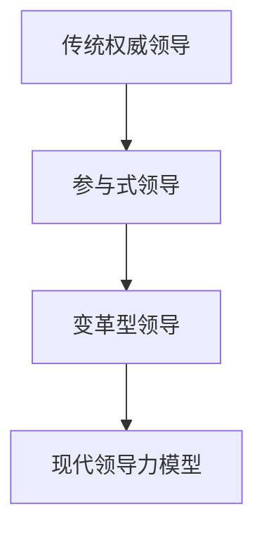
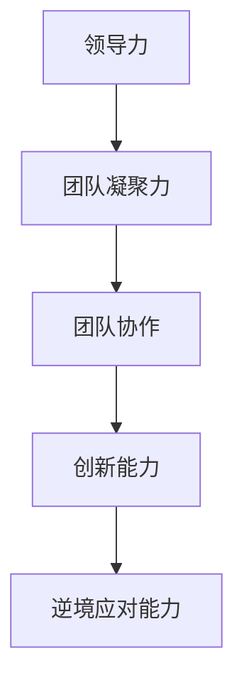

                 

### 文章标题

### 关键词

- **领导力**
- **危机应对**
- **团队凝聚力**
- **逆境管理**
- **领导力模型**
- **危机管理策略**
- **团队建设**

### 摘要

本文旨在探讨领导力在危机应对中的关键作用，特别是在逆境中如何通过有效的团队凝聚力来提升组织应对挑战的能力。文章将从领导力基础理论出发，深入分析危机管理与应对策略，并通过实际案例研究来展示领导力与危机应对在实际应用中的重要性。同时，本文还将探讨领导力与危机应对的未来趋势，为读者提供实用的最佳实践建议和拓展阅读资源。

### 引言

在快速变化的现代社会，企业面临的不确定性和挑战日益增多。无论是经济波动、市场竞争，还是技术变革，危机无处不在。在这些逆境中，领导力成为决定组织成败的关键因素。有效的领导力不仅能够帮助企业稳定局势，还能激发团队的创造力和凝聚力，使组织在困境中找到新的发展机遇。

本文旨在探讨领导力在危机应对中的核心作用，以及如何通过团队凝聚力来提升组织的逆境应对能力。我们将从领导力基础理论出发，分析领导力与团队凝聚力的关系，探讨危机管理的原则和策略，并通过实际案例来展示这些理论在实践中的应用。最后，我们将展望领导力与危机应对的未来趋势，并提出相应的最佳实践建议。

### 第一部分：领导力基础理论

#### 第1章：领导力的定义与类型

##### 1.1 领导力的基本概念

领导力是一种能够影响和激励他人，共同实现目标的能力。它的核心在于影响力，而非权力。领导力的发展与演变经历了多个阶段，从传统的权威领导到现代的参与式领导，再到近年来兴起的变革型领导，不同的领导力模式在不同的情境下表现出不同的效果。

**Mermaid 流程图：领导力的发展阶段**

##### 1.2 领导力的类型

领导力的类型多种多样，常见的包括以下几种：

- **转型型领导**：通过改变组织结构和流程，推动组织向新的方向发展。
- **变革型领导**：激发团队成员的内在动力，引领组织实现变革。
- **情境型领导**：根据不同情境和团队成员的特点，灵活调整领导风格。

#### 第2章：领导力与团队凝聚力

##### 2.1 团队凝聚力的概念与作用

团队凝聚力是指团队成员之间相互吸引、相互信任和支持的程度。高凝聚力的团队表现出更高的合作精神和创新能力，能够更好地应对外部挑战。团队凝聚力与领导力密切相关，有效的领导力能够促进团队凝聚力的提升。

**Mermaid 流程图：领导力与团队凝聚力的关系**

##### 2.2 领导力在团队凝聚力中的作用

领导力在团队凝聚力中发挥着关键作用。通过以下策略，领导者可以提升团队的凝聚力：

- **构建共同愿景**：明确团队的目标和价值观，使团队成员对团队有共同的认识和归属感。
- **增强沟通与信任**：通过有效沟通建立信任，促进团队成员之间的合作。
- **激励与认可**：激励团队成员，并给予认可，增强团队的凝聚力和士气。

#### 第3章：危机管理与应对策略

##### 3.1 危机的概念与类型

危机是指对企业或组织产生重大影响的突发事件。危机可以分为以下几种类型：

- **自然危机**：如自然灾害、火灾等。
- **经济危机**：如金融危机、市场波动等。
- **社会危机**：如公共关系危机、品牌危机等。

##### 3.2 危机应对的基本原则

在危机应对中，领导者和团队应遵循以下基本原则：

- **快速响应**：迅速识别危机，及时采取行动。
- **稳妥处理**：避免恐慌和混乱，稳妥地处理危机事件。
- **持续改进**：在危机后进行总结和反思，持续改进应对策略。

### 第二部分：危机中的领导力挑战

#### 第4章：危机中的领导力要求

##### 4.1 危机中的领导力要求

在危机中，领导者的要求更高，他们需要具备以下能力：

- **自我认知**：领导者需要深入了解自己的优势和不足，以便在危机中做出正确的决策。
- **决策能力**：在危机中，领导者需要迅速做出明智的决策，确保组织能够稳定应对。
- **沟通能力**：领导者需要与团队成员、利益相关者和公众保持有效沟通，增强信任和信心。

##### 4.2 危机中的团队建设

在危机中，团队建设至关重要。以下策略有助于在危机中加强团队建设：

- **激发团队的危机意识**：通过培训和讨论，提高团队成员对危机的认识和应对能力。
- **建立危机应对团队**：组建专业的危机应对团队，确保团队有明确的职责和协调机制。
- **强化团队的执行力**：通过有效的沟通和协作，确保团队在危机中能够高效地执行决策。

### 第三部分：逆境中的领导力实践

#### 第5章：逆境中的领导力策略

##### 5.1 逆境中的领导力策略

在逆境中，领导者需要采取以下策略：

- **制定明确的战略目标**：明确组织的长远目标和短期目标，确保团队在逆境中有所依循。
- **建立有效的激励机制**：通过激励机制激发团队成员的积极性和创造力。
- **优化组织结构**：在逆境中，组织结构需要适应变化，以提高组织的灵活性和适应性。

##### 5.2 逆境中的领导力案例研究

为了更好地理解领导力在逆境中的应用，以下是一些典型的案例研究：

- **企业A的逆境转型案例**：企业A在面临市场危机时，通过领导者的果断决策和有效的团队建设，成功实现了转型。
- **企业B的危机应对案例**：企业B在面对突如其来的经济危机时，通过危机管理和团队凝聚力，成功度过了危机。
- **企业C的逆境成长案例**：企业C在逆境中通过不断创新和优化，实现了持续成长。

### 第四部分：领导力与危机应对的平衡

#### 第6章：领导力与危机应对的平衡

##### 6.1 领导力与危机应对的相互影响

领导力与危机应对相互影响，二者相辅相成。有效的领导力能够提升危机应对能力，而危机应对的成功又能进一步巩固领导力。

##### 6.2 实现领导力与危机应对的平衡

为了实现领导力与危机应对的平衡，领导者需要：

- **提高危机管理能力**：通过培训和实践，提高领导者的危机管理能力。
- **强化团队的危机应对能力**：通过培训和演练，提高团队的整体危机应对能力。
- **构建可持续的危机管理体系**：建立一套完善的危机管理体系，确保组织在危机中能够迅速响应和有效应对。

### 第五部分：领导力与危机应对的未来趋势

#### 第7章：领导力与危机应对的未来趋势

##### 7.1 领导力与危机应对的新趋势

随着技术的不断进步和社会的快速发展，领导力与危机应对也呈现出新的趋势：

- **数字化领导力的发展**：随着数字技术的普及，领导者需要具备数字思维和数字化管理能力。
- **社交媒体的危机应对**：社交媒体的兴起为危机应对带来了新的挑战和机遇。
- **环境变化的领导力挑战**：面对全球环境变化，领导者需要具备环境意识和社会责任感。

##### 7.2 未来领导力与危机应对的展望

未来，领导力与危机应对将更加注重以下方面：

- **创新性**：领导者需要具备创新思维，推动组织不断创新。
- **可持续性**：危机应对需要考虑可持续发展，实现经济、社会和环境的平衡。
- **全球视野**：领导者需要具备全球视野，应对全球化和国际化带来的挑战。

### 结论

领导力与危机应对是企业在逆境中生存和发展的关键。通过有效的领导力和团队凝聚力，组织能够更好地应对危机，实现持续成长。本文通过对领导力基础理论、危机管理策略、实际案例研究的深入分析，为读者提供了实用的指导和建议。希望本文能够帮助读者在未来的工作和生活中更好地发挥领导力，应对各种挑战。

### 作者信息

- **作者：AI天才研究院/AI Genius Institute & 禅与计算机程序设计艺术 /Zen And The Art of Computer Programming**

