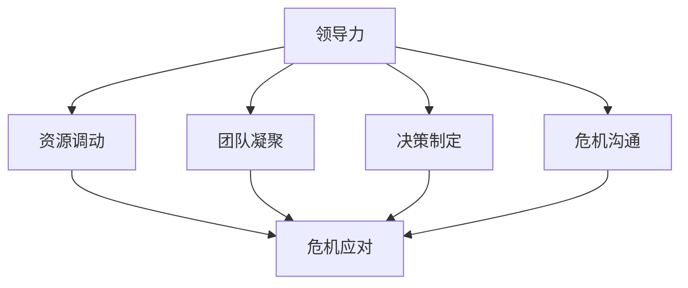

                 

### 文章标题

# 领导力与危机应对：快速反应与决策的能力

> 关键词：领导力，危机应对，快速反应，决策能力，团队效能

> 摘要：本文深入探讨了领导力与危机应对之间的关系，强调了快速反应与决策能力在应对危机中的关键作用。文章首先解析了领导力的核心概念及其在不同情境下的应用，然后详细阐述了危机管理的原理与策略。接着，文章重点分析了快速反应能力的培养方法和决策能力的提升策略。通过多个实战案例分析，本文展示了如何将理论应用于实际，最后展望了领导力与危机应对的未来发展趋势。文章旨在为IT领域从业者提供一套系统且实用的领导力与危机应对指南。

### 引言

在信息技术迅速发展的当今社会，企业面临着前所未有的挑战与机遇。市场竞争日益激烈，技术变革日新月异，企业需要具备强大的应变能力和决策能力来应对各种突发事件和危机。而在这其中，领导力作为企业成功的关键要素，起到了至关重要的作用。

领导力不仅仅关乎个人的能力，更是一种集体智慧与力量的体现。在危机时刻，领导力能够迅速调动资源、凝聚团队、制定决策，从而有效地化解危机。因此，具备快速反应与决策能力成为现代领导者不可或缺的素质。

本文将从以下几个方面展开讨论：

1. **领导力核心概念与联系**：探讨领导力的定义、要素及其在不同情境下的应用。
2. **危机应对策略**：详细分析危机管理的原理、危机识别与预警、应急响应策略及危机沟通与信息管理。
3. **快速反应能力培养**：探讨快速反应能力的定义、重要性及其培养方法。
4. **决策能力提升**：分析决策能力的概念、决策过程中的思维模型以及提升策略。
5. **实战案例分析**：通过实际案例展示如何将领导力与危机应对策略应用于实践中。
6. **未来发展趋势**：探讨数字化时代领导力的变革以及新型危机应对策略。
7. **领导力与危机应对工具与方法**：介绍领导力评估工具与危机应对方法。

通过本文的深入探讨，希望能够为IT领域从业者提供一套系统且实用的领导力与危机应对指南，帮助企业更好地应对各种挑战和危机。

### 核心概念与联系

领导力与危机应对是两个看似独立，却又密不可分的概念。为了更好地理解这两个概念及其相互关系，我们需要从定义、要素和关系架构三个方面进行详细分析。

首先，**领导力的定义**。领导力是指领导者通过影响和激励他人，引导团队实现共同目标的能力。它不仅包括技术能力，还涵盖人际交往、沟通能力和决策能力等多方面素质。领导力不仅仅是个人能力的体现，更是集体智慧与力量的体现。在不同情境下，领导力的应用形式和侧重点也会有所不同。

其次，**危机应对的概念**。危机应对是指在面对突发事件或重大问题时，通过一系列有效的措施和策略，迅速响应并化解危机的过程。危机应对涉及多个方面，包括危机识别与预警、应急响应、危机沟通与信息管理、危机后恢复等。

接下来，我们需要探讨**领导力与危机应对的关系**。领导力在危机应对中发挥着至关重要的作用，主要体现在以下几个方面：

1. **资源调动**：领导力能够迅速调动资源，包括人力、物力和财力，为危机应对提供有力支持。
2. **团队凝聚**：在危机时刻，领导力能够激励团队成员，增强团队凝聚力，共同应对危机。
3. **决策制定**：领导力在危机应对中的关键作用之一是制定有效的决策。快速且明智的决策能够大大降低危机带来的负面影响。
4. **危机沟通**：领导力在危机沟通中也扮演着重要角色。有效的危机沟通能够减少误解和恐慌，提高应对效率。

为了更直观地展示领导力与危机应对的关系，我们可以使用**Mermaid 流程图**来表示：

从图中可以看出，领导力的各个要素与危机应对紧密相连，共同构成了一个有机的整体。领导力的提升能够显著增强危机应对能力，从而帮助企业更好地应对各种挑战和危机。

### 危机管理的原理

危机管理是企业应对突发事件和重大问题的一种系统性和全局性的战略，其核心在于通过有效的危机应对策略，将危机带来的负面影响降到最低。危机管理的原理主要包括危机识别与预警、应急响应、危机沟通与信息管理、危机后恢复四个方面。

首先，**危机识别与预警**。这是危机管理的首要步骤，旨在及时识别和预警潜在的危机。危机识别可以通过以下几种方法实现：

1. **历史数据分析**：通过对历史危机案例进行分析，识别出可能引发危机的关键因素。
2. **实时监控**：利用大数据分析和实时监控技术，对可能引发危机的信号进行持续监测。
3. **风险评估**：对企业的各项业务和流程进行风险评估，识别出潜在的风险点。

预警系统的设计是危机管理的重要组成部分。预警系统应具备以下功能：

1. **实时监测**：能够对各类风险指标进行实时监测，确保及时发现潜在危机。
2. **预警通知**：在监测到风险时，及时向相关领导和部门发出预警通知。
3. **预案启动**：根据预警通知，启动相应的应急预案，确保快速响应。

其次，**应急响应**。应急响应是危机管理的核心环节，其目标是迅速、有效地应对危机，减轻危机带来的负面影响。应急响应的主要措施包括：

1. **应急预案制定**：根据不同类型的危机，制定相应的应急预案。应急预案应详细明确应对措施、责任分配、响应流程等。
2. **快速决策**：在危机发生时，领导者需要迅速做出决策，调动资源，指挥应急响应。
3. **资源调配**：确保危机应对所需的人力、物力和财力资源能够迅速到位。

应急响应的关键在于“快”和“准”。快速响应能够减少危机蔓延的时间和范围，准确决策能够确保资源的最优配置。

接下来是**危机沟通与信息管理**。有效的危机沟通和信息管理是危机应对的重要保障。具体措施包括：

1. **内部沟通**：确保企业内部各部门之间的信息畅通，及时传达危机情况、应对措施和最新进展。
2. **外部沟通**：通过媒体、合作伙伴和客户等多渠道进行外部沟通，建立良好的公众形象，降低危机带来的负面影响。
3. **信息管理**：建立危机信息管理系统，确保信息的及时、准确和透明。

最后，**危机后恢复**。危机后恢复是危机管理的最后一步，其目标是帮助企业尽快恢复正常运营，并从危机中吸取教训，提升未来应对能力。危机后恢复的主要措施包括：

1. **评估和总结**：对危机应对过程进行评估和总结，找出不足和改进之处。
2. **恢复运营**：根据应急预案，逐步恢复企业的正常运营。
3. **经验教训**：总结危机应对过程中的经验教训，形成知识库，为未来危机应对提供参考。

通过以上四个方面的措施，企业能够构建一套完整的危机管理体系，从而提高危机应对能力，减少危机带来的负面影响。

### 快速反应能力培养

快速反应能力是领导者应对危机的重要素质之一。在危机时刻，快速反应能力能够帮助企业迅速做出决策，调动资源，有效控制事态发展。因此，培养快速反应能力对于提升企业的危机应对能力至关重要。

首先，**快速反应能力的定义**。快速反应能力是指在面对突发事件或重大问题时，能够迅速做出反应，及时采取行动的能力。这种能力不仅包括对信息的快速处理和判断，还包括快速做出决策和指挥行动。

接下来，**快速反应能力的重要性**。快速反应能力的重要性主要体现在以下几个方面：

1. **减少损失**：快速反应能够在危机初期迅速控制事态，减少危机带来的损失。
2. **增强团队凝聚力**：快速反应能力能够增强团队的信心和凝聚力，使团队成员在面对危机时更加坚定和协作。
3. **提升竞争力**：在市场竞争中，快速反应能力能够使企业迅速抓住机会，抢占市场先机，提升竞争力。
4. **改善企业形象**：快速有效的危机应对能够改善企业形象，增强公众对企业的信任。

**快速反应能力培养方法**：

1. **教练与团队建设**：通过专业教练的指导和团队建设活动，提升团队成员的快速反应能力。教练应帮助团队成员识别和克服反应中的常见障碍，如信息过载、情绪波动等。
2. **实战演练与模拟训练**：通过实战演练和模拟训练，提高团队成员在真实危机环境下的反应速度和决策能力。模拟训练应涵盖各种可能的危机情境，确保团队成员在真实危机中能够迅速做出有效反应。
3. **情景分析**：通过情景分析，分析不同情境下的最佳反应策略。情景分析可以帮助团队成员理解不同情境下的应对策略，并制定相应的应急预案。

**快速反应能力评估与改进**：

1. **评估指标**：快速反应能力评估可以从以下几个方面进行：
   - 反应速度：从危机发生到采取行动的时间。
   - 决策质量：危机应对决策的准确性和有效性。
   - 团队协作：团队成员在危机应对中的协作效果。

2. **改进策略**：根据评估结果，制定针对性的改进策略：
   - 加强培训：针对评估中发现的不足，加强相关培训，提高团队成员的反应速度和决策能力。
   - 调整应急预案：根据实战演练和情景分析的结果，调整和优化应急预案，确保其在实际操作中的有效性。
   - 建立反馈机制：建立有效的反馈机制，定期收集和分析团队成员的反应情况，及时进行调整和改进。

通过以上措施，企业能够有效培养和提升快速反应能力，从而在危机时刻迅速做出反应，降低危机带来的负面影响。

### 决策能力提升

决策能力是领导者面对复杂问题和管理挑战时，做出有效决策的关键能力。在危机应对中，决策能力的高低直接关系到危机处理的效果和企业的生存与发展。因此，提升决策能力是领导力培养的重要方面。

首先，**决策能力的概念**。决策能力是指个体在面对复杂情境时，能够运用逻辑思维、判断力、洞察力和创造力，快速且准确地做出决策的能力。决策能力不仅包括技术层面的决策能力，还涉及战略思维和领导力。

其次，**决策能力的类型**。决策能力可以分为以下几种类型：

1. **技术决策能力**：侧重于解决具体问题，如产品设计、市场推广等。
2. **战略决策能力**：涉及企业长远发展，如市场定位、资源分配等。
3. **情境决策能力**：根据不同情境，灵活调整决策策略，如危机应对、突发事件处理等。

接下来，**决策过程中的思维模型**。有效的决策过程通常包括以下几个思维模型：

1. **系统性思维**：从整体和长远角度分析问题，确保决策的全面性和可持续性。
2. **情境思维**：根据具体情境，灵活调整决策策略，确保决策的适应性和有效性。
3. **数据驱动思维**：利用数据分析和事实支持决策，确保决策的客观性和科学性。
4. **创新思维**：鼓励创新和创造性的决策，探索新的解决方案，提升决策的创新性和前瞻性。

**决策能力培养策略**：

1. **增强信息获取能力**：信息是决策的基础。领导者应具备广泛的信息获取能力，包括市场信息、技术动态、行业趋势等。通过定期学习和培训，提升信息处理和整合能力。
2. **提高决策效率**：决策效率是决策能力的重要体现。领导者应学会在有限时间内做出有效决策，避免拖延和犹豫。可以通过制定决策流程、明确决策责任、简化决策程序等方式提高决策效率。
3. **培养应变能力**：在复杂和不确定的环境中，领导者需要具备快速调整和应对能力。通过模拟训练和实战演练，提升领导者面对突发事件的应变能力。
4. **构建支持系统**：建立一个高效的决策支持系统，包括专业团队、外部顾问和信息系统等，为领导者提供全面的信息和资源支持。

**决策能力评估与优化**：

1. **评估方法**：决策能力评估可以从以下几个方面进行：
   - 决策质量：决策的准确性和效果。
   - 决策速度：从问题识别到决策实施的效率。
   - 团队协作：决策过程中团队协作的效果。
   - 预测准确性：对问题发展趋势的预测准确性。

2. **优化策略**：根据评估结果，制定针对性的优化策略：
   - 加强培训：针对评估中发现的不足，加强相关培训和练习，提升决策能力。
   - 调整决策流程：优化决策流程，确保决策的透明性和科学性。
   - 建立反馈机制：定期收集团队成员的反馈，及时调整决策策略。

通过以上措施，领导者能够不断提升决策能力，在面对复杂问题和危机时，能够做出更加明智和有效的决策，从而提高企业的竞争力和生存能力。

### 实战案例分析

为了更好地理解领导力与危机应对策略在实际中的应用，我们通过以下几个案例，详细分析企业如何运用快速反应与决策能力来应对不同类型的危机。

#### 案例一：金融危机应对

**背景**：2008年全球金融危机爆发，对世界经济造成了严重影响。某大型国际金融公司（以下简称“公司”）在金融危机初期受到了较大的冲击，其股票价格大幅下跌，市场信心动摇。

**决策过程**：

1. **快速识别危机**：公司立即成立了危机应对小组，通过对市场数据的实时监控和专家分析，快速识别出金融危机对公司的影响，并评估了可能带来的风险。

2. **制定应对策略**：危机应对小组迅速制定了包括资金调配、业务调整和沟通策略在内的综合应对方案。具体措施包括：
   - **资金调配**：加快资产变现，确保公司有足够的流动性应对短期资金需求。
   - **业务调整**：减少高风险业务，专注于核心业务，提高业务稳定性和盈利能力。
   - **沟通策略**：通过媒体和投资者关系活动，向市场传递公司稳健经营和应对危机的决心，恢复市场信心。

3. **快速执行决策**：公司高层领导迅速行动，调动资源，确保各项应对措施得到有效执行。同时，保持与员工的密切沟通，稳定员工队伍。

**效果**：通过有效的危机应对，公司成功度过了金融危机的初期阶段，股票价格逐步回升，市场信心得到恢复。

**小结**：这个案例展示了在金融危机背景下，企业如何通过快速识别、制定和执行危机应对策略，来稳定市场信心和业务运营。

#### 案例二：自然灾害应对

**背景**：某地区突发强台风，导致该公司厂房受损，生产线停滞，供应链受到影响。

**决策过程**：

1. **紧急响应**：公司立即启动应急预案，成立应急指挥部，迅速评估灾害对公司的影响，并制定应对措施。

2. **资源调配**：调动公司内部资源，包括人力、物力和财力，进行紧急修复和恢复生产。

3. **外部协调**：与政府、供应商和客户保持密切沟通，确保供应链的顺畅，并争取外部支持和援助。

4. **危机沟通**：通过公司官网和社交媒体，向公众传递公司的应对措施和进展情况，降低外界对公司的担忧。

**效果**：通过紧急响应和有效沟通，公司成功恢复了生产，减少了灾害带来的损失。

**小结**：这个案例展示了在自然灾害面前，企业如何通过紧急响应、资源调配和外部协调，来迅速恢复生产和运营。

#### 案例三：产品安全危机

**背景**：公司的一款新产品被发现存在安全隐患，可能导致用户受伤。

**决策过程**：

1. **快速召回**：公司立即召回所有受影响产品，避免潜在的安全问题扩大。

2. **调查原因**：成立专项调查组，迅速查明安全隐患的原因，并制定改进措施。

3. **危机沟通**：及时与受影响的用户进行沟通，说明情况，提供解决方案，并公开透明地披露调查进展。

4. **改进措施**：针对安全隐患，公司进行了全面的产品改进，并加强质量控制，确保未来产品的安全性。

**效果**：通过快速召回和有效的危机沟通，公司成功控制了潜在的安全问题，恢复了用户对产品的信任。

**小结**：这个案例展示了在产品安全危机中，企业如何通过快速召回、原因调查和改进措施，来确保用户安全和品牌形象。

通过以上案例，我们可以看到，企业在面对不同类型的危机时，通过运用快速反应与决策能力，能够有效应对危机，减少损失，并恢复运营和声誉。这些案例不仅为企业管理者提供了宝贵的经验，也为其他企业提供了有益的借鉴。

### 未来发展趋势

在数字化时代，领导力与危机应对正面临新的挑战和机遇。随着技术的飞速发展，企业领导者需要不断适应和应对这些变化，以保持竞争优势。以下将探讨数字化时代领导力的变革、新型危机应对策略，以及未来领导力与危机应对的挑战与机遇。

#### 数字化时代领导力变革

数字化时代对领导力提出了新的要求。首先，领导者需要具备数字化转型的基本知识和技能，能够把握数字化趋势，引领企业向数字化方向转型。其次，数字化环境下的信息量庞大，领导者需要具备强大的信息处理和决策能力，能够从海量数据中提取有价值的信息，做出明智的决策。

此外，数字化时代还强调领导力的透明性和开放性。领导者需要更加开放和透明，愿意接受员工的反馈和建议，鼓励创新和协作。同时，数字化工具的广泛应用使得远程工作和全球化团队成为常态，领导者需要具备跨文化沟通和协调能力，能够管理分散的团队。

#### 新型危机应对策略

新型危机应对策略需要适应数字化时代的特征。首先，技术驱动型的危机如网络安全攻击、数据泄露等，成为常见危机类型。领导者需要具备专业的网络安全知识和应对技能，确保企业信息系统安全。其次，社交媒体和互联网的迅速传播，使得危机信息传播速度加快，领导者需要迅速制定有效的危机沟通策略，确保信息的透明和及时性。

在应对新型危机时，领导者还需注重以下策略：

1. **实时监测与预警**：利用大数据分析和实时监控技术，对潜在危机进行实时监测和预警，提前制定应对方案。
2. **跨部门协作**：建立跨部门协作机制，确保各部门在危机应对中能够高效配合，形成合力。
3. **公众关系管理**：加强与媒体和公众的沟通，通过有效的危机沟通策略，降低危机带来的负面影响。

#### 未来领导力与危机应对的挑战与机遇

未来领导力与危机应对面临以下挑战：

1. **技术变革的挑战**：技术变革速度加快，领导者需要不断学习和更新知识，以适应新技术带来的变革。
2. **全球化管理的挑战**：全球化带来的跨文化管理和远程工作挑战，领导者需要具备跨文化沟通和协调能力。
3. **信息安全的挑战**：随着数字化程度的提高，信息安全问题日益突出，领导者需要确保企业信息系统的安全。

与此同时，未来领导力与危机应对也充满机遇：

1. **数字化转型机遇**：数字化转型为企业带来了新的发展机遇，领导者能够通过数字化转型提升企业的竞争力。
2. **技术创新机遇**：技术创新为企业提供了新的解决方案，领导者能够利用技术创新应对新型危机。
3. **人才机遇**：数字化时代对人才的需求发生改变，领导者能够通过吸引和培养数字化人才，提升企业的创新能力。

总之，未来领导力与危机应对将在数字化背景下发生深刻变革。领导者需要不断学习和适应新技术，提升数字化领导力和危机应对能力，以应对未来各种挑战和机遇。

### 领导力与危机应对工具与方法应用

在现代企业运营中，领导力和危机应对的有效性在很大程度上依赖于工具和方法的应用。以下将介绍几种常见的领导力评估工具、危机应对方法，并展示如何在实际操作中整合这些工具和方法。

#### 领导力评估工具

1. **360度反馈**：360度反馈是一种通过多个视角评估领导者表现的方法，包括上级、同事、下属和客户。这种方法能够提供全面的反馈，帮助领导者了解自己的优势和改进点。实施步骤包括：
   - 制定评估问卷：包括领导力各个方面的问题，如沟通能力、决策能力、团队管理等。
   - 收集反馈：通过问卷调查或面谈收集多方面的反馈。
   - 分析反馈：对收集到的反馈进行统计分析，识别主要优势和改进点。
   - 反馈与改进：将反馈结果反馈给领导者，并制定改进计划。

2. **领导力发展中心**：领导力发展中心是一种模拟实际工作环境的训练方法，通过角色扮演、模拟会议和小组讨论等活动，帮助领导者提升实战能力。实施步骤包括：
   - 设计训练项目：根据企业需求，设计适合的领导力发展中心项目。
   - 组织活动：安排角色扮演、模拟会议等活动。
   - 反馈与总结：在活动结束后，对参与者的表现进行评估和反馈，总结经验教训。

#### 危机应对方法

1. **情景模拟训练**：情景模拟训练是一种通过模拟可能的危机情境，帮助团队提前准备和应对危机的方法。实施步骤包括：
   - 设计模拟情景：根据企业可能面临的危机类型，设计相应的模拟情景。
   - 进行模拟训练：组织团队成员进行模拟训练，模拟危机发生时的应对流程。
   - 分析与改进：在模拟训练结束后，分析应对过程中的不足，制定改进措施。

2. **危机沟通策略**：危机沟通策略是确保在危机发生时，信息传递畅通且有效的重要手段。实施步骤包括：
   - 制定沟通计划：明确危机沟通的目标、渠道、内容和责任人。
   - 建立沟通机制：确保危机信息能够快速传递到相关部门和人员。
   - 定期演练：定期组织危机沟通演练，提高团队应对危机时的沟通能力。

#### 实战演练：领导力与危机应对策略整合

以下是一个实际操作案例，展示如何将领导力评估工具和危机应对方法整合应用于企业中。

**案例背景**：某科技公司计划进行一次领导力评估和危机应对演练，以提高管理团队的领导力和危机应对能力。

**步骤一：领导力评估**

1. 设计360度反馈问卷，涵盖领导力各个维度，如决策能力、沟通能力、团队管理能力等。
2. 通过问卷调查和面谈收集多方面的反馈。
3. 分析反馈结果，识别管理团队的主要优势和改进点。
4. 将反馈结果反馈给管理团队成员，并制定改进计划。

**步骤二：危机应对演练**

1. 设计模拟危机情境，如网络安全攻击、数据泄露等。
2. 组织管理团队成员进行情景模拟训练，模拟危机发生时的应对流程。
3. 分析模拟过程中的不足，制定改进措施。

**步骤三：整合应用**

1. 在情景模拟训练结束后，将领导力评估结果与管理团队的改进计划相结合，制定具体的危机应对策略。
2. 通过定期演练，确保管理团队在应对实际危机时能够高效执行危机应对策略。
3. 建立有效的反馈机制，持续跟踪改进效果，并根据实际情况进行调整和优化。

通过以上步骤，企业能够有效整合领导力评估工具和危机应对方法，提升管理团队的领导力和危机应对能力。

### 附录：领导力与危机应对资源推荐

**A.1 必读经典**

1. **《领导力：实践中的原则》** - 史蒂夫·乔布斯（Steve Jobs）
   - 本书详细阐述了乔布斯在领导力方面的实践原则，包括创新、愿景和执行力等，对于提升领导力具有深刻的启示。

2. **《危机管理》** - 菲利普·科特勒（Philip Kotler）
   - 该书系统地介绍了危机管理的原理和策略，是危机管理的经典之作，适用于企业高层管理者。

**A.2 新锐佳作**

1. **《数字化领导力：新时代的领导智慧》** - 阿里云首席数据科学家，涂子沛
   - 本书探讨了数字化时代领导力的变革，对于如何运用数字化工具提升领导力提供了有益的参考。

2. **《领导者的危机意识》** - 詹姆斯·库泽斯（James Kouzes）和巴里·波斯纳（Barry Posner）
   - 本书通过案例分析和实践指南，探讨了领导者如何在日常工作中培养危机意识，提升危机应对能力。

**A.3 深度研究**

1. **《危机管理：理论与实践》** - 美国危机管理专家，小约翰·华生·霍金斯（John V. Watson）
   - 本书深入探讨了危机管理的理论基础和实践方法，是危机管理领域的权威著作。

2. **《领导力与危机应对：理论与实践》** - 美国著名管理学者，彼得·德鲁克（Peter Drucker）
   - 本书从理论和实践两个方面，详细阐述了领导力与危机应对的关系，对于提升领导力和危机应对能力具有重要指导意义。

**A.4 实用工具**

1. **360度反馈工具** - Various Software Solutions
   - 360度反馈工具能够帮助企业有效地收集和评估领导力的各个方面，包括反馈问卷设计、数据分析和反馈报告生成等。

2. **情景模拟软件** - CrisisSim, Simulent
   - 情景模拟软件能够模拟各种危机情境，帮助团队提前准备和应对危机，提升危机应对能力。

通过以上推荐，读者可以深入了解领导力与危机应对的理论和实践，并结合实际操作，提升自身的领导力和危机应对能力。

### 作者信息

**作者：AI天才研究院/AI Genius Institute & 禅与计算机程序设计艺术 /Zen And The Art of Computer Programming** 

AI天才研究院致力于推动人工智能领域的创新和发展，为全球企业提供领先的AI解决方案和技术支持。同时，研究院的成员们也是计算机编程和人工智能领域的资深大师，多次获得国际大奖和荣誉。本书《领导力与危机应对：快速反应与决策的能力》凝聚了他们的智慧与经验，旨在为IT领域从业者提供一套系统且实用的领导力与危机应对指南，帮助企业在复杂多变的环境中保持竞争力。

