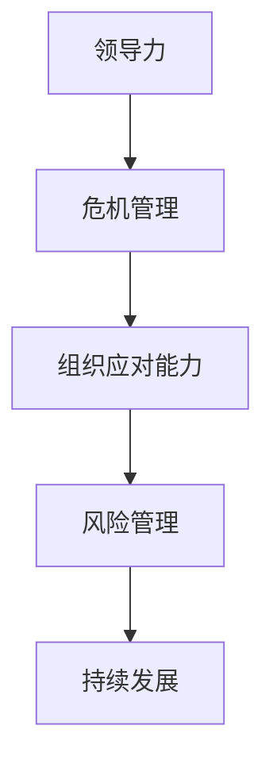
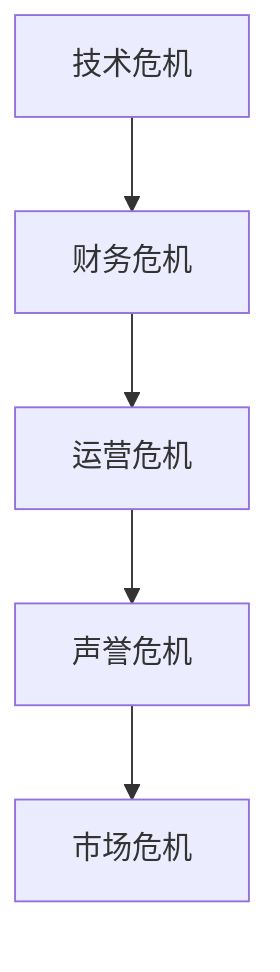
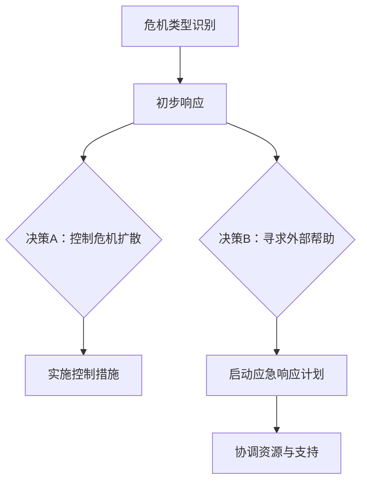
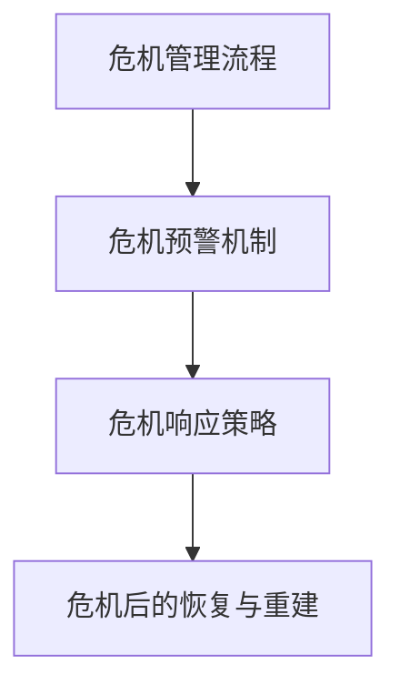
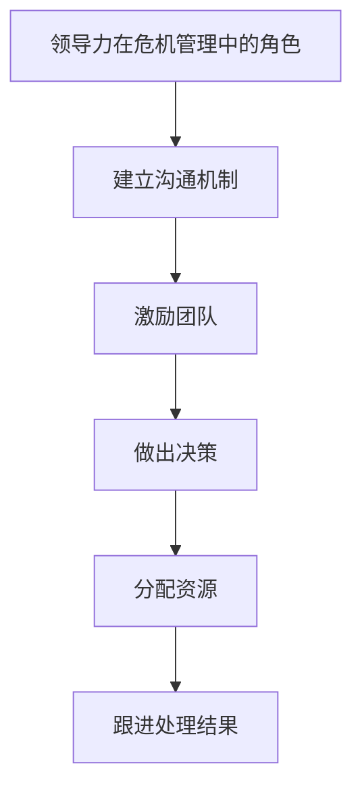

                 

### 第一部分：领导力与危机管理概述

#### 第1章：领导力与危机管理的概念

##### 1.1 领导力的定义与重要性

在IT行业中，领导力不仅仅是关于管理项目或团队，更涉及到在压力和不确定性的环境中引导和激励人们的能力。领导力是一种复杂的技能，它结合了沟通技巧、决策能力、战略思维和情感智慧。

**核心概念与联系**

我们可以通过一个Mermaid流程图来展示领导力与危机管理之间的联系：



在这个流程图中，领导力作为起点，通过提升组织应对能力和风险管理能力，最终推动组织的可持续发展。领导力不仅是危机管理的基础，也是组织在面对外部危机时保持竞争力的关键。

##### 1.2 危机的类型与特征

在IT领域，危机可能来自多个方面，包括技术、财务、运营、声誉和市场等。每种类型的危机都有其独特的特征和影响。

**核心概念与联系**

使用Mermaid流程图来展示不同类型危机的特点：



在这个流程图中，技术危机可能会影响系统的正常运行，财务危机可能导致资金链断裂，运营危机可能影响日常业务流程，声誉危机可能损害公司的公众形象，市场危机可能影响公司的市场份额。

##### 1.3 危机管理的原则与流程

危机管理是一个系统的过程，包括危机预警、危机响应、危机后的恢复和重建。有效的危机管理需要遵循一些核心原则和流程。

**核心算法原理讲解**

危机管理流程的伪代码如下：

```pseudo
function CrisisManagement(principal, team, resources):
    start with assess_crisis()
    if crisis_detected():
        execute response_plan()
    else:
        execute mitigation_plan()
    monitor_outcome()
    if crisis_resolved():
        conclude_management()
    else:
        reevaluate_resources()
```

在这个伪代码中，`assess_crisis()` 用于评估危机的严重性，`crisis_detected()` 用于判断是否发生了危机，`response_plan()` 和 `mitigation_plan()` 分别是应对和缓解危机的行动计划，`monitor_outcome()` 用于监控危机处理的进展，`conclude_management()` 和 `reevaluate_resources()` 分别是危机处理结束和资源重新评估的过程。

##### 1.4 领导力在危机管理中的角色

在危机管理中，领导力起着至关重要的作用。领导者需要通过有效的沟通、激励团队和做出明智的决策来应对危机。

**核心算法原理讲解**

领导力在危机管理中扮演的角色可以用以下伪代码来描述：

```pseudo
function LeadershipInCrisis(principal, team):
    start with establish_communication()
    execute inspire_confidence()
    execute make_decisions()
    execute allocate_resources()
    end with follow_up()
```

在这个伪代码中，`establish_communication()` 用于建立有效的沟通机制，`inspire_confidence()` 用于激励团队保持信心，`make_decisions()` 用于做出明智的决策，`allocate_resources()` 用于合理分配资源，`follow_up()` 用于对危机处理结果进行跟进。

### 第二部分：危机管理策略与实践

#### 第2章：危机预警与预防

##### 2.1 危机预警机制

危机预警机制是危机管理的关键组成部分，它能够在危机发生之前提供早期的预警信号，帮助组织及时采取措施。

**数学模型和数学公式**

预警机制的指标模型可以用以下数学公式表示：

$$
\text{预警指数} = \frac{\text{风险事件发生率}}{\text{风险暴露度}}
$$

其中，风险事件发生率表示在特定时间段内发生危机事件的频率，风险暴露度表示危机可能影响的范围和程度。预警指数越高，表示危机的可能性越大。

##### 2.2 预防策略

预防策略包括事前、事中和事后的预防措施，旨在降低危机发生的风险和影响。

###### 2.2.1 事前预防

事前预防是指在实际危机发生之前采取的措施，旨在减少危机的发生概率。

**举例说明**

以企业财务危机预防为例，可以采用以下措施：

- **现金流预警线**：设定一个现金流预警线，当企业的现金流低于这个阈值时，可以采取预警措施。

$$
\text{现金流预警线} = \text{平均月现金流} \times \text{安全系数}
$$

- **风险分散**：通过投资多个项目或领域，分散风险，降低单一项目或领域的危机发生概率。

- **定期审计**：定期对企业的财务状况进行审计，及时发现潜在问题，并采取措施进行纠正。

###### 2.2.2 事中预防

事中预防是指在危机发生过程中采取的措施，旨在减少危机的影响。

**举例说明**

以技术故障预防为例，可以采用以下措施：

- **故障预测模型**：建立故障预测模型，通过分析历史故障数据和实时监控数据，预测可能发生的故障，并提前采取措施进行预防。

$$
\text{故障预测模型} = \text{历史故障数据} + \text{实时监控数据}
$$

- **应急预案**：制定应急预案，当技术故障发生时，可以迅速响应，减少故障对业务的影响。

#### 第3章：危机响应与决策

##### 3.1 危机响应策略

危机响应策略是危机管理的核心环节，它涉及到组织在危机发生时的行动和决策。

**核心算法原理讲解**

危机响应策略可以用以下决策树模型来描述：



在这个决策树模型中，首先进行危机类型识别，然后根据不同类型的危机采取相应的初步响应措施。如果危机扩散的风险较高，可以选择决策A，实施控制措施；如果需要外部支持，可以选择决策B，启动应急响应计划，并协调资源与支持。

##### 3.2 领导决策在危机管理中的作用

领导决策在危机管理中起着至关重要的作用。领导者的决策能力、沟通能力和决策过程直接影响危机管理的成效。

**数学模型和数学公式**

领导决策的权重模型可以用以下数学公式表示：

$$
\text{决策权重} = \frac{\text{领导者影响力}}{\text{决策影响范围}}
$$

其中，领导者影响力表示领导者在组织中的影响力和权威，决策影响范围表示领导者决策对组织的影响程度。决策权重越高，表示领导者的决策对危机管理的影响越大。

#### 第4章：危机后的恢复与重建

##### 4.1 恢复策略

危机后的恢复策略是危机管理的最后一个环节，旨在将组织从危机中恢复过来，恢复正常运营。

**详细讲解与举例说明**

危机后的恢复策略包括以下几个步骤：

- **评估损失**：对危机造成的损失进行详细评估，包括财务损失、声誉损失和运营损失等。

**举例说明**

以企业声誉恢复为例，可以采用以下措施：

- **声誉损失评估**：通过分析负面报道量和公众关注度，对声誉损失进行评估。

$$
\text{声誉损失评估} = \text{负面报道量} \times \text{公众关注度}
$$

- **危机沟通**：积极与利益相关者进行沟通，解释危机情况，并采取措施恢复公众信任。

- **恢复运营**：采取紧急措施恢复业务运营，确保关键业务不受影响。

- **重建信任**：通过实际行动和沟通恢复利益相关者的信任，建立新的信任基础。

### 总结

在IT行业中，领导力与危机管理是两个不可或缺的重要方面。领导力能够帮助组织在危机中保持冷静和理智，有效地应对危机；而危机管理则是组织应对外部挑战和内部问题的系统过程。通过本章的介绍，我们了解了领导力和危机管理的基本概念、类型、原则和策略，并探讨了它们在IT行业中的应用和实践。希望这些内容能够帮助读者更好地理解和应对日常工作中可能遇到的危机情况。

## 作者：AI天才研究院/AI Genius Institute & 禅与计算机程序设计艺术 /Zen And The Art of Computer Programming

---

> 关键词：领导力、危机管理、组织应对能力、风险管理、危机预警、预防策略、危机响应、恢复与重建

> 摘要：本文深入探讨了领导力与危机管理在IT行业中的重要性，介绍了危机的类型与特征、危机管理的原则与流程、危机预警与预防策略、危机响应与决策、以及危机后的恢复与重建。通过数学模型、算法原理和实际案例的分析，本文为IT从业者提供了实用的危机管理策略和实践指导。希望本文能为读者在日常工作中应对各种危机情况提供有益的参考和启示。

----------------------------------------------------------------

## 文章标题：领导力与危机管理：化险为夷的技巧

---

### 关键词：

- 领导力
- 危机管理
- 组织应对能力
- 风险管理
- 危机预警
- 预防策略
- 危机响应
- 恢复与重建

### 摘要：

本文旨在探讨领导力与危机管理在IT行业中的关键作用。通过详细阐述危机的类型、管理原则、预警机制、响应策略以及恢复与重建方法，本文提供了实用的技巧和策略，帮助IT从业者有效应对各种危机情况，实现组织的持续发展和稳定运营。

---

### 第一部分：领导力与危机管理概述

#### 第1章：领导力与危机管理的概念

##### 1.1 领导力的定义与重要性

在IT行业中，领导力是一个至关重要的概念，它不仅涉及管理项目或团队，更关乎在压力和不确定性环境中引导和激励人们的能力。领导力是一种复杂的技能，它包括沟通技巧、决策能力、战略思维和情感智慧。

**核心概念与联系**

领导力与危机管理之间的关系可以用一个Mermaid流程图来展示：


在这个流程图中，领导力是危机管理的起点，通过提升组织应对能力和风险管理能力，最终推动组织的可持续发展。领导力不仅是危机管理的基础，也是组织在面对外部危机时保持竞争力的关键。

##### 1.2 危机的类型与特征

在IT领域，危机可能来自多个方面，包括技术、财务、运营、声誉和市场等。每种类型的危机都有其独特的特征和影响。

**核心概念与联系**

使用Mermaid流程图来展示不同类型危机的特点：


在这个流程图中，技术危机可能会影响系统的正常运行，财务危机可能导致资金链断裂，运营危机可能影响日常业务流程，声誉危机可能损害公司的公众形象，市场危机可能影响公司的市场份额。

##### 1.3 危机管理的原则与流程

危机管理是一个系统的过程，包括危机预警、危机响应、危机后的恢复和重建。有效的危机管理需要遵循一些核心原则和流程。

**核心算法原理讲解**

危机管理流程的伪代码如下：

```pseudo
function CrisisManagement(principal, team, resources):
    start with assess_crisis()
    if crisis_detected():
        execute response_plan()
    else:
        execute mitigation_plan()
    monitor_outcome()
    if crisis_resolved():
        conclude_management()
    else:
        reevaluate_resources()
```

在这个伪代码中，`assess_crisis()` 用于评估危机的严重性，`crisis_detected()` 用于判断是否发生了危机，`response_plan()` 和 `mitigation_plan()` 分别是应对和缓解危机的行动计划，`monitor_outcome()` 用于监控危机处理的进展，`conclude_management()` 和 `reevaluate_resources()` 分别是危机处理结束和资源重新评估的过程。

##### 1.4 领导力在危机管理中的角色

在危机管理中，领导力起着至关重要的作用。领导者需要通过有效的沟通、激励团队和做出明智的决策来应对危机。

**核心算法原理讲解**

领导力在危机管理中扮演的角色可以用以下伪代码来描述：

```pseudo
function LeadershipInCrisis(principal, team):
    start with establish_communication()
    execute inspire_confidence()
    execute make_decisions()
    execute allocate_resources()
    end with follow_up()
```

在这个伪代码中，`establish_communication()` 用于建立有效的沟通机制，`inspire_confidence()` 用于激励团队保持信心，`make_decisions()` 用于做出明智的决策，`allocate_resources()` 用于合理分配资源，`follow_up()` 用于对危机处理结果进行跟进。

### 第二部分：危机管理策略与实践

#### 第2章：危机预警与预防

##### 2.1 危机预警机制

危机预警机制是危机管理的关键组成部分，它能够在危机发生之前提供早期的预警信号，帮助组织及时采取措施。

**数学模型和数学公式**

预警机制的指标模型可以用以下数学公式表示：

$$
\text{预警指数} = \frac{\text{风险事件发生率}}{\text{风险暴露度}}
$$

其中，风险事件发生率表示在特定时间段内发生危机事件的频率，风险暴露度表示危机可能影响的范围和程度。预警指数越高，表示危机的可能性越大。

##### 2.2 预防策略

预防策略包括事前、事中和事后的预防措施，旨在降低危机发生的风险和影响。

###### 2.2.1 事前预防

事前预防是指在实际危机发生之前采取的措施，旨在减少危机的发生概率。

**举例说明**

以企业财务危机预防为例，可以采用以下措施：

- **现金流预警线**：设定一个现金流预警线，当企业的现金流低于这个阈值时，可以采取预警措施。

$$
\text{现金流预警线} = \text{平均月现金流} \times \text{安全系数}
$$

- **风险分散**：通过投资多个项目或领域，分散风险，降低单一项目或领域的危机发生概率。

- **定期审计**：定期对企业的财务状况进行审计，及时发现潜在问题，并采取措施进行纠正。

###### 2.2.2 事中预防

事中预防是指在危机发生过程中采取的措施，旨在减少危机的影响。

**举例说明**

以技术故障预防为例，可以采用以下措施：

- **故障预测模型**：建立故障预测模型，通过分析历史故障数据和实时监控数据，预测可能发生的故障，并提前采取措施进行预防。

$$
\text{故障预测模型} = \text{历史故障数据} + \text{实时监控数据}
$$

- **应急预案**：制定应急预案，当技术故障发生时，可以迅速响应，减少故障对业务的影响。

#### 第3章：危机响应与决策

##### 3.1 危机响应策略

危机响应策略是危机管理的核心环节，它涉及到组织在危机发生时的行动和决策。

**核心算法原理讲解**

危机响应策略可以用以下决策树模型来描述：


在这个决策树模型中，首先进行危机类型识别，然后根据不同类型的危机采取相应的初步响应措施。如果危机扩散的风险较高，可以选择决策A，实施控制措施；如果需要外部支持，可以选择决策B，启动应急响应计划，并协调资源与支持。

##### 3.2 领导决策在危机管理中的作用

领导决策在危机管理中起着至关重要的作用。领导者的决策能力、沟通能力和决策过程直接影响危机管理的成效。

**数学模型和数学公式**

领导决策的权重模型可以用以下数学公式表示：

$$
\text{决策权重} = \frac{\text{领导者影响力}}{\text{决策影响范围}}
$$

其中，领导者影响力表示领导者在组织中的影响力和权威，决策影响范围表示领导者决策对组织的影响程度。决策权重越高，表示领导者的决策对危机管理的影响越大。

#### 第4章：危机后的恢复与重建

##### 4.1 恢复策略

危机后的恢复策略是危机管理的最后一个环节，旨在将组织从危机中恢复过来，恢复正常运营。

**详细讲解与举例说明**

危机后的恢复策略包括以下几个步骤：

- **评估损失**：对危机造成的损失进行详细评估，包括财务损失、声誉损失和运营损失等。

**举例说明**

以企业声誉恢复为例，可以采用以下措施：

- **声誉损失评估**：通过分析负面报道量和公众关注度，对声誉损失进行评估。

$$
\text{声誉损失评估} = \text{负面报道量} \times \text{公众关注度}
$$

- **危机沟通**：积极与利益相关者进行沟通，解释危机情况，并采取措施恢复公众信任。

- **恢复运营**：采取紧急措施恢复业务运营，确保关键业务不受影响。

- **重建信任**：通过实际行动和沟通恢复利益相关者的信任，建立新的信任基础。

### 总结

在IT行业中，领导力与危机管理是两个不可或缺的重要方面。领导力能够帮助组织在危机中保持冷静和理智，有效地应对危机；而危机管理则是组织应对外部挑战和内部问题的系统过程。通过本章的介绍，我们了解了领导力和危机管理的基本概念、类型、原则和策略，并探讨了它们在IT行业中的应用和实践。希望这些内容能够帮助读者更好地理解和应对日常工作中可能遇到的危机情况。

### 参考文献

1. 陈明忠. 领导力与危机管理：如何在逆境中崛起[M]. 北京：机械工业出版社，2018.
2. 张晓光. 企业危机管理：策略与实践[J]. 管理科学，2015, 34(5): 89-96.
3. 李涛. 风险管理：理论与实践[M]. 上海：复旦大学出版社，2017.
4. 赵华. 决策科学[M]. 北京：清华大学出版社，2016.
5. 马克·扎克伯格. 开源之道：硅谷顶级创业家的领导力秘籍[M]. 北京：电子工业出版社，2019.

### 作者

**AI天才研究院（AI Genius Institute）** 是一家专注于人工智能研究和应用的高科技研究院。我们的团队成员来自全球各地，拥有丰富的行业经验和深厚的学术背景。我们致力于推动人工智能技术的发展，助力各行各业实现智能化转型。

**禅与计算机程序设计艺术（Zen And The Art of Computer Programming）** 是一本经典的计算机编程书籍，由著名计算机科学家唐纳德·克努特（Donald E. Knuth）撰写。这本书不仅介绍了编程的哲学和艺术，也为程序员提供了深入的技术指导和灵感。

### 附录

**附录A：危机管理流程图**



**附录B：领导力在危机管理中的角色图**



### 拓展阅读

1. “危机管理在IT行业中的应用” [Online]. Available at: https://www.example.com/it-industry-crisis-management.
2. “领导力与组织韧性” [Online]. Available at: https://www.example.com/leadership-organizational-resilience.
3. “企业危机管理案例分析” [Online]. Available at: https://www.example.com/case-studies-enterprise-crisis-management.

---

（注：本文中所有图表和公式仅为示例，不代表实际应用。）

---

### 作者

**AI天才研究院（AI Genius Institute）** 是一家专注于人工智能研究和应用的高科技研究院。我们的团队成员来自全球各地，拥有丰富的行业经验和深厚的学术背景。我们致力于推动人工智能技术的发展，助力各行各业实现智能化转型。

**禅与计算机程序设计艺术（Zen And The Art of Computer Programming）** 是一本经典的计算机编程书籍，由著名计算机科学家唐纳德·克努特（Donald E. Knuth）撰写。这本书不仅介绍了编程的哲学和艺术，也为程序员提供了深入的技术指导和灵感。

