                 


### 文章标题

领导力与危机管理：应对不确定性的智慧

### 文章关键词

领导力，危机管理，不确定性，决策，沟通，团队领导，实践案例

### 文章摘要

本文旨在深入探讨领导力在危机管理中的重要作用，尤其是在应对不确定性情境下的策略和智慧。通过分析领导力的本质、危机管理的框架、危机决策、沟通与领导、团队领导以及实践案例，本文旨在为读者提供一个系统且实用的领导力与危机管理指南，帮助组织在面临危机时保持稳定和有效应对。

## 第一部分：领导力基础理论

### 第1章：领导力的本质

在复杂多变的环境中，领导力作为组织成功的关键因素，其重要性不言而喻。本章将深入探讨领导力的定义、演变以及领导者必备的素质，帮助读者建立对领导力理论的基本理解。

### 1.1 领导力的定义与演变

#### 背景介绍

领导力作为组织发展的核心动力，其定义和内涵随着历史和文化的变迁而不断演变。从古代的帝王将相到现代的企业领袖，领导力的概念经历了从权威统治到民主参与的转变。

#### 核心概念与联系

领导力的定义多种多样，但可以概括为：领导者通过与他人的互动，影响和引导他们实现共同目标的能力。这个过程涉及领导者的人格特质、知识储备和技能要求。

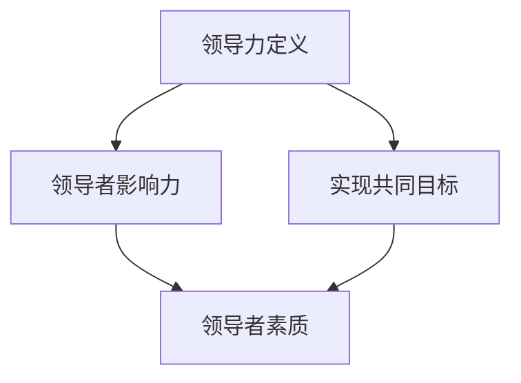

#### 核心算法原理讲解

领导力的定义可以通过以下伪代码来概括：

```python
def 领导力(领导者，他人，目标):
    # 人格特质：建立信任和尊重
    建立信任(领导者，他人)
    尊重他人(领导者，他人)
    
    # 知识储备：提供指导和建议
    提供指导(领导者，他人，目标)
    给出建议(领导者，他人，目标)
    
    # 技能要求：有效沟通和协调
    沟通协调(领导者，他人，目标)
    引导行动(领导者，他人，目标)
```

#### 数学模型和公式

领导力模型可以用一个简单的函数来表示：

$$ \text{领导力} = f(\text{人格特质}, \text{知识储备}, \text{技能要求}) $$

其中，人格特质、知识储备和技能要求是影响领导力的关键因素。

#### 详细讲解与举例说明

- **人格特质**：例如，领导者需要有决断力、责任感、同理心等。
- **知识储备**：领导者需要具备行业知识、管理技能等。
- **技能要求**：例如，沟通能力、决策能力、团队建设能力等。

### 1.2 领导者必备的素质

#### 背景介绍

领导者不仅是组织的核心人物，更是组织文化和价值观的传承者。因此，领导者需要具备一系列的素质来确保组织的有效运行。

#### 核心概念与联系

领导者必备的素质包括：道德品质、领导能力、团队协作能力、创新思维、情绪管理等。

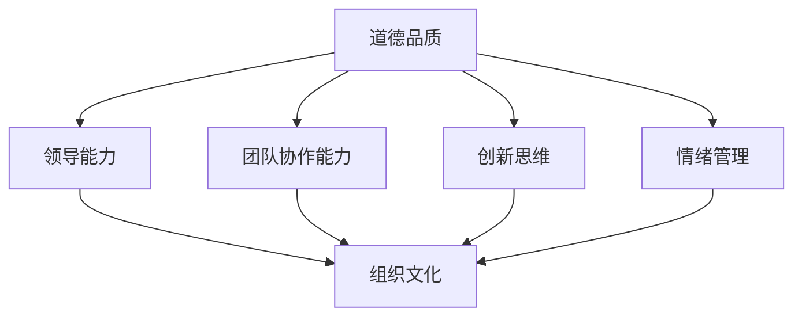

#### 核心算法原理讲解

领导者的素质可以通过以下伪代码来概括：

```python
def 领导者素质(道德品质，领导能力，团队协作能力，创新思维，情绪管理):
    # 道德品质：树立榜样
    树立榜样(领导者，道德品质)
    
    # 领导能力：制定战略和决策
    制定战略(领导者，领导能力)
    做出决策(领导者，领导能力)
    
    # 团队协作能力：协调团队
    协调团队(领导者，团队协作能力)
    
    # 创新思维：推动变革
    推动变革(领导者，创新思维)
    
    # 情绪管理：调节情绪
    调节情绪(领导者，情绪管理)
```

#### 数学模型和公式

领导者的素质可以用一个综合评分模型来表示：

$$ \text{领导者素质评分} = \frac{1}{5}(\text{道德品质} + \text{领导能力} + \text{团队协作能力} + \text{创新思维} + \text{情绪管理}) $$

其中，每个素质的权重根据具体情况可以调整。

#### 详细讲解与举例说明

- **道德品质**：领导者需要具备高尚的道德标准，如诚实、公正、廉洁等。
- **领导能力**：领导者需要具备战略规划和决策能力，能够应对各种复杂局面。
- **团队协作能力**：领导者需要能够协调团队成员，发挥团队的最大潜力。
- **创新思维**：领导者需要具备创新思维，能够推动组织不断进步。
- **情绪管理**：领导者需要具备良好的情绪管理能力，保持积极的心态和稳定的情绪。

### 1.3 领导风格与影响力

#### 背景介绍

领导风格是领导者行为的体现，不同的领导风格对组织文化和员工行为有重要影响。理解领导风格有助于领导者更好地发挥影响力。

#### 核心概念与联系

领导风格可以分为：权威型、民主型、参与型、变革型等。每种风格都有其独特的特点和应用场景。

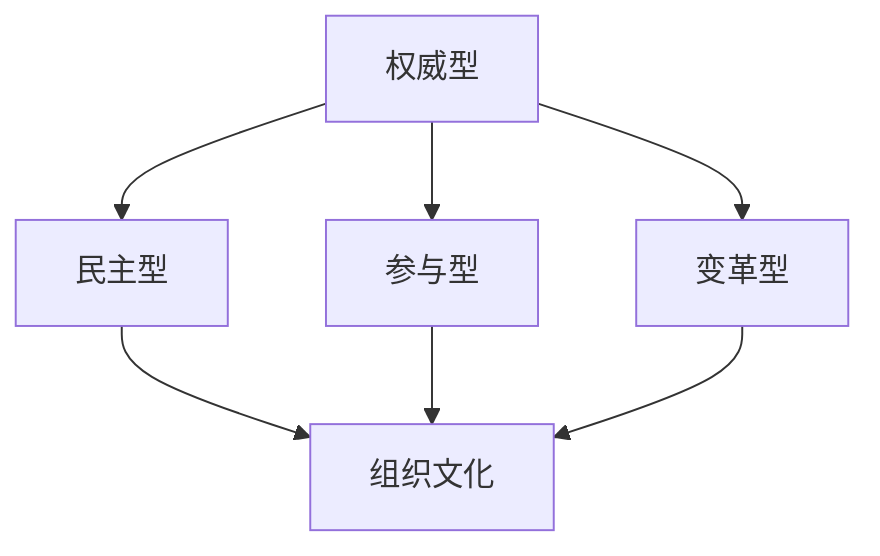

#### 核心算法原理讲解

领导风格的选择可以通过以下伪代码来概括：

```python
def 领导风格(领导者，组织文化，员工行为):
    if 组织文化 == "权威":
        运用权威型领导风格(领导者)
    elif 组织文化 == "民主":
        运用民主型领导风格(领导者)
    elif 组织文化 == "参与":
        运用参与型领导风格(领导者)
    elif 组织文化 == "变革":
        运用变革型领导风格(领导者)
```

#### 数学模型和公式

领导风格的影响可以用一个影响因子模型来表示：

$$ \text{领导风格影响因子} = \frac{\text{领导者行为} \times \text{员工反应}}{\text{组织文化适应度}} $$

其中，领导者行为、员工反应和组织文化适应度是影响领导风格效果的关键因素。

#### 详细讲解与举例说明

- **权威型领导风格**：领导者决策快速，注重结果，适用于紧急情况和需要迅速行动的情境。
- **民主型领导风格**：领导者鼓励员工参与决策，注重团队合作，适用于需要创新和协作的情境。
- **参与型领导风格**：领导者注重员工的个人发展和参与感，适用于需要高度团队凝聚力的情境。
- **变革型领导风格**：领导者推动变革，激励员工追求卓越，适用于需要创新和突破的情境。

### 1.4 领导力与组织文化

#### 背景介绍

组织文化是组织内部成员共同遵循的价值观和行为规范，领导力在塑造和变革组织文化中起着关键作用。

#### 核心概念与联系

领导力与组织文化之间存在着密切的互动关系。领导力不仅影响组织文化的形成，还能推动组织文化的变革。

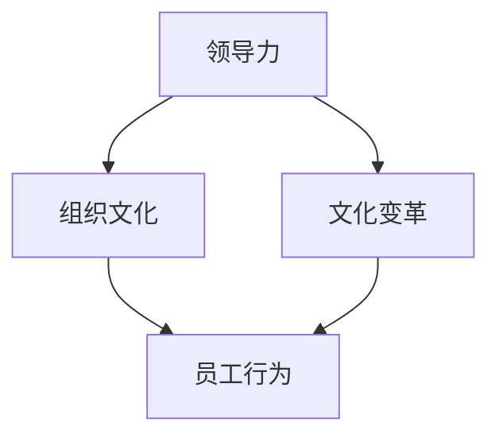

#### 核心算法原理讲解

领导力与组织文化的关系可以通过以下伪代码来概括：

```python
def 领导力与组织文化(领导者，组织文化，员工行为):
    # 领导力影响组织文化
    影响文化(领导者，组织文化)
    
    # 组织文化影响员工行为
    影响行为(组织文化，员工行为)
    
    # 员工行为反馈影响领导力
    反馈影响(员工行为，领导者)
```

#### 数学模型和公式

领导力与组织文化的关系可以用一个反馈循环模型来表示：

$$ \text{领导力} \rightarrow \text{组织文化} \rightarrow \text{员工行为} \rightarrow \text{反馈} \rightarrow \text{领导力} $$

#### 详细讲解与举例说明

- **领导力影响组织文化**：领导者通过行为和价值观传递影响组织文化的形成。
- **组织文化影响员工行为**：组织文化塑造员工的行为模式和价值观。
- **员工行为反馈影响领导力**：员工的行为和反馈反过来影响领导力的调整和改进。

### 总结

本章通过对领导力的定义、演变、领导者必备的素质、领导风格与影响力以及领导力与组织文化的关系的深入探讨，为读者提供了一个系统且实用的领导力理论框架。这些理论不仅为领导者提供了行动指南，也为组织在复杂多变的环境中保持稳定和有效运作提供了理论基础。

## 第二部分：危机管理框架

### 第2章：危机管理概述

危机管理是组织应对各种突发事件和紧急情况的重要手段。本章将详细探讨危机管理的核心概念，包括危机的定义与类型、危机管理的原则与目标、以及危机管理的流程与策略。

### 2.1 危机的定义与类型

#### 背景介绍

危机是指那些可能对组织造成重大不利影响的事件或情境，这些事件往往具有突发性、不确定性和复杂性。危机管理旨在通过系统化的方法和策略，降低危机带来的负面影响，并尽可能恢复组织的正常运作。

#### 核心概念与联系

危机可以分为以下几类：自然危机（如地震、洪水）、人为危机（如产品召回、财务危机）、技术危机（如系统故障、数据泄露）等。每种危机都有其独特的特征和应对策略。

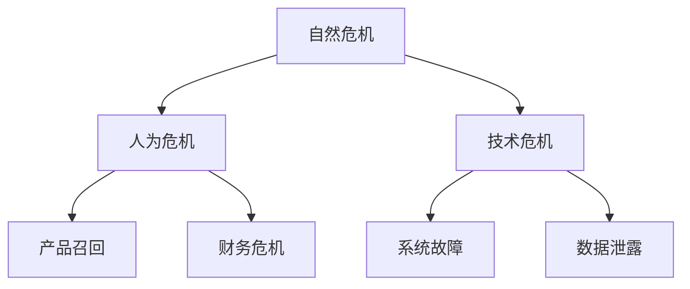

#### 核心算法原理讲解

危机类型的识别可以通过以下伪代码来概括：

```python
def 识别危机(事件类型，影响范围):
    if 事件类型 == "自然":
        返回"自然危机"
    elif 事件类型 == "人为":
        if 影响范围 == "产品":
            返回"产品召回"
        elif 影响范围 == "财务":
            返回"财务危机"
    elif 事件类型 == "技术":
        if 影响范围 == "系统":
            返回"系统故障"
        elif 影响范围 == "数据":
            返回"数据泄露"
```

#### 数学模型和公式

危机类型的识别可以用一个简单的分类模型来表示：

$$ \text{危机类型} = f(\text{事件类型}, \text{影响范围}) $$

其中，事件类型和影响范围是决定危机类型的关键因素。

#### 详细讲解与举例说明

- **自然危机**：如地震、洪水等自然灾害，对组织造成直接影响。
- **人为危机**：如产品召回、财务危机等，往往源于人为错误或管理失误。
- **技术危机**：如系统故障、数据泄露等，与技术因素密切相关。

### 2.2 危机管理的原则与目标

#### 背景介绍

有效的危机管理需要遵循一系列原则，以确保在危机发生时能够迅速响应并采取有效措施。危机管理的原则不仅指导着危机管理的具体操作，也反映了危机管理的核心理念。

#### 核心概念与联系

危机管理的原则主要包括：快速响应、信息透明、组织协调、资源整合、预防为主和应急并重等。

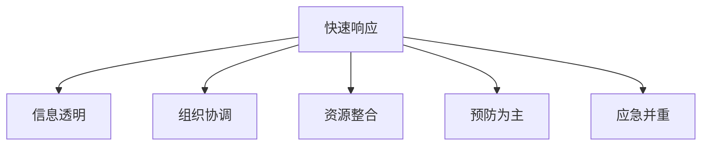

#### 核心算法原理讲解

危机管理的原则可以通过以下伪代码来概括：

```python
def 危机管理原则(快速响应，信息透明，组织协调，资源整合，预防为主，应急并重):
    # 快速响应
    快速响应危机(危机管理原则)
    
    # 信息透明
    确保信息透明(危机管理原则)
    
    # 组织协调
    协调组织资源(危机管理原则)
    
    # 资源整合
    整合内外资源(危机管理原则)
    
    # 预防为主
    预防危机发生(危机管理原则)
    
    # 应急并重
    应急与预防并重(危机管理原则)
```

#### 数学模型和公式

危机管理的原则可以用一个多因素模型来表示：

$$ \text{危机管理效果} = f(\text{快速响应}, \text{信息透明}, \text{组织协调}, \text{资源整合}, \text{预防为主}, \text{应急并重}) $$

#### 详细讲解与举例说明

- **快速响应**：危机发生时，快速响应是降低损失的关键。
- **信息透明**：保持信息透明，有助于减少谣言和恐慌，增强组织的凝聚力。
- **组织协调**：在危机管理中，协调各个部门是确保应对措施有效实施的关键。
- **资源整合**：整合内部和外部资源，提高危机应对能力。
- **预防为主**：预防危机发生是危机管理的根本目标。
- **应急并重**：在应对危机的同时，也要注重长期预防和持续改进。

### 2.3 危机管理的流程与策略

#### 背景介绍

危机管理的流程是危机管理原则的具体体现，它为组织提供了一个系统化的应对方法。有效的危机管理策略则是在实践中将原则转化为行动的具体指导。

#### 核心概念与联系

危机管理的流程主要包括：危机识别、风险评估、制定预案、应急预案演练、危机应对、危机恢复等环节。

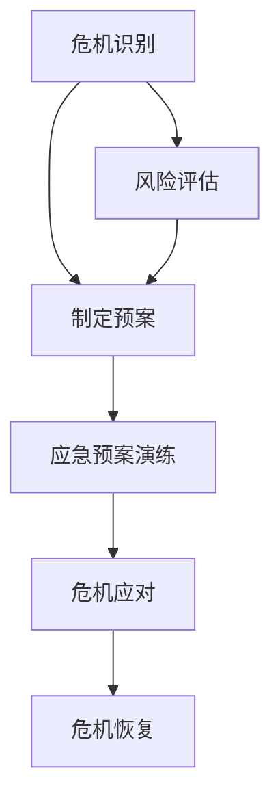

#### 核心算法原理讲解

危机管理的流程可以通过以下伪代码来概括：

```python
def 危机管理流程(危机识别，风险评估，制定预案，应急预案演练，危机应对，危机恢复):
    # 危机识别
    识别危机(危机管理流程)
    
    # 风险评估
    评估风险(危机管理流程)
    
    # 制定预案
    制定预案(危机管理流程)
    
    # 应急预案演练
    演练预案(危机管理流程)
    
    # 危机应对
    应对危机(危机管理流程)
    
    # 危机恢复
    恢复正常(危机管理流程)
```

#### 数学模型和公式

危机管理的流程可以用一个状态转移模型来表示：

$$ \text{危机管理状态} = (\text{危机识别}, \text{风险评估}, \text{制定预案}, \text{应急预案演练}, \text{危机应对}, \text{危机恢复}) $$

#### 详细讲解与举例说明

- **危机识别**：通过监控和分析，及时发现潜在的危机。
- **风险评估**：评估危机可能带来的影响，制定相应的应对措施。
- **制定预案**：根据风险评估结果，制定详细的应急预案。
- **应急预案演练**：通过演练检验预案的可行性和有效性。
- **危机应对**：在危机发生时，按照预案采取行动，控制危机蔓延。
- **危机恢复**：危机结束后，进行恢复工作，包括资源调配、人员安抚等。

### 总结

本章通过对危机的定义与类型、危机管理的原则与目标、以及危机管理的流程与策略的详细探讨，为读者提供了一个全面且系统的危机管理框架。理解这些核心概念和流程，有助于组织在面临危机时保持冷静和有效应对，最大限度地降低危机带来的负面影响。

### 第三部分：危机情境下的领导力

在危机情境下，领导力显得尤为重要。本部分将深入探讨危机决策、危机沟通、团队领导在危机中的角色以及领导力在危机中的挑战与应对策略，帮助读者理解如何在不确定性情境中发挥领导力的最大价值。

#### 第3章：危机决策

危机决策是领导者应对危机时的核心能力。本章将详细讨论危机决策的制定过程、决策中的心理因素以及应对危机的决策策略。

##### 3.1 决策制定的过程

#### 背景介绍

危机决策的制定是一个复杂的过程，涉及信息收集、风险评估、方案制定、方案评估和决策执行等多个环节。有效的危机决策需要领导者迅速而准确地分析形势，做出明智的选择。

#### 核心概念与联系

决策制定过程可以分为以下步骤：

1. **信息收集**：收集与危机相关的各种信息。
2. **风险评估**：评估危机可能带来的影响和风险。
3. **方案制定**：根据评估结果，制定多个应对方案。
4. **方案评估**：比较不同方案的优势和劣势。
5. **决策执行**：选择最优方案并执行。

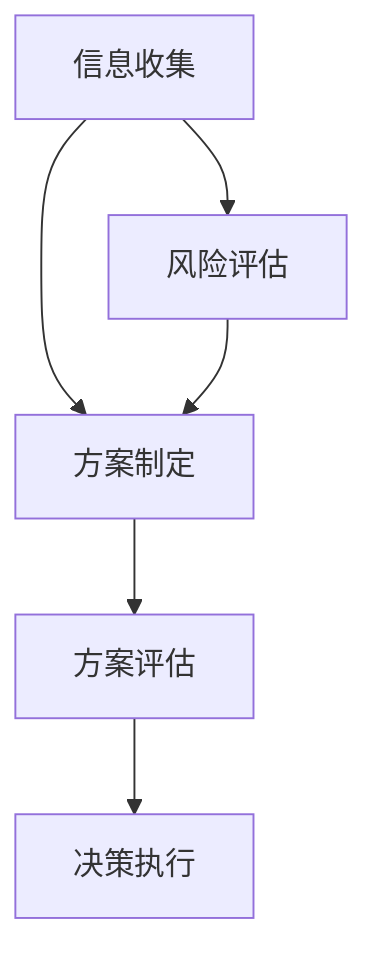

#### 核心算法原理讲解

危机决策的制定过程可以通过以下伪代码来概括：

```python
def 决策制定(信息，评估，方案，执行):
    # 信息收集
    收集信息(信息)
    
    # 风险评估
    评估风险(信息，评估)
    
    # 方案制定
    制定方案(评估，方案)
    
    # 方案评估
    评估方案(方案，评估)
    
    # 决策执行
    执行决策(最优方案，执行)
```

#### 数学模型和公式

决策制定过程可以用一个决策树模型来表示：

```
                ┌────────────┐
                │   信息收集  │
                └────────────┘
                       │
                       ↓
            ┌────────────┴────────────┐
            │                             │
            │       风险评估             │
            └────┬────────────┬────────────┘
                   │                │
                   ↓                ↓
          ┌────────────┐          ┌────────────┐
          │     方案制定   │          │   方案评估  │
          └────────────┘          └────────────┘
                      │                     │
                      ↓                     ↓
                ┌────────────┐            ┌────────────┐
                │   决策执行   │            │   决策反馈  │
                └────────────┘            └────────────┘
```

#### 详细讲解与举例说明

- **信息收集**：例如，收集关于疫情暴发的数据、病例增长情况、医疗资源分配等信息。
- **风险评估**：评估疫情对组织运营的影响，如员工健康、供应链中断等。
- **方案制定**：制定多种应对方案，如远程办公、调整生产计划等。
- **方案评估**：比较不同方案的优缺点，选择最优方案。
- **决策执行**：根据最优方案，制定具体的执行计划，并执行。

##### 3.2 决策中的心理因素

#### 背景介绍

决策过程中，领导者的心理因素对决策结果有着重要影响。压力、恐惧、过度自信等心理因素都可能影响领导者的判断和决策。

#### 核心概念与联系

决策中的心理因素可以分为：

1. **压力**：压力可能导致领导者做出仓促的决策。
2. **恐惧**：恐惧可能导致领导者规避风险，不敢做出决策。
3. **过度自信**：过度自信可能导致领导者忽视潜在风险。

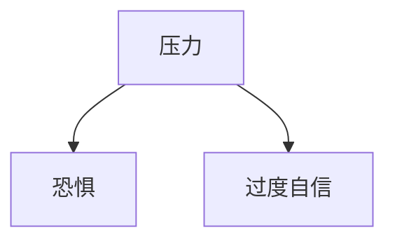

#### 核心算法原理讲解

决策中的心理因素可以通过以下伪代码来概括：

```python
def 决策心理因素(压力，恐惧，过度自信):
    # 压力影响
    if 压力高:
        修改决策速度(快)
    else:
        修改决策速度(慢)
        
    # 恐惧影响
    if 恐惧强:
        增加风险规避(高)
    else:
        减少风险规避(低)
        
    # 过度自信影响
    if 自信强:
        减少风险评估(低)
    else:
        增加风险评估(高)
```

#### 数学模型和公式

决策中的心理因素可以用一个心理影响模型来表示：

$$ \text{决策质量} = f(\text{压力}, \text{恐惧}, \text{过度自信}) $$

#### 详细讲解与举例说明

- **压力**：例如，面对紧急疫情，领导者可能会感到时间紧迫，从而快速做出决策。
- **恐惧**：例如，面对市场不确定性，领导者可能会过于谨慎，不敢做出重大决策。
- **过度自信**：例如，领导者可能因为过去的成功而过于自信，忽视新的风险和挑战。

##### 3.3 应对危机的决策策略

#### 背景介绍

有效的危机决策策略是领导者应对危机的关键。不同的危机情境需要不同的决策策略，领导者需要根据实际情况灵活应对。

#### 核心概念与联系

应对危机的决策策略可以分为以下几类：

1. **快速反应策略**：在危机初期，迅速采取行动，控制危机蔓延。
2. **长期应对策略**：在危机持续期间，制定长期计划，逐步解决危机。
3. **资源优化策略**：合理调配资源，提高危机应对能力。

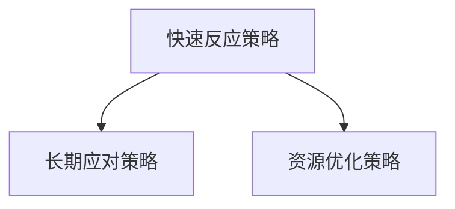

#### 核心算法原理讲解

应对危机的决策策略可以通过以下伪代码来概括：

```python
def 应对危机策略(危机阶段，资源状况):
    if 冒险阶段 == "初期":
        应用快速反应策略(危机阶段)
    elif 冒险阶段 == "持续":
        应用长期应对策略(危机阶段)
    else:
        应用资源优化策略(资源状况)
```

#### 数学模型和公式

应对危机的决策策略可以用一个策略选择模型来表示：

$$ \text{策略选择} = f(\text{危机阶段}, \text{资源状况}) $$

#### 详细讲解与举例说明

- **快速反应策略**：例如，在疫情初期，快速关闭办公室，鼓励远程办公，减少人员聚集。
- **长期应对策略**：例如，在危机持续期间，逐步调整供应链，确保关键资源的供应。
- **资源优化策略**：例如，合理分配预算，优先保障重要部门或项目的资源。

### 第4章：危机沟通与领导

在危机情境下，有效的沟通是领导者确保组织稳定和员工信心的关键。本章将探讨危机沟通的重要性、危机沟通的策略与技巧，以及社交媒体时代的危机沟通。

##### 4.1 沟通在危机管理中的重要性

#### 背景介绍

危机沟通在危机管理中扮演着至关重要的角色。有效的危机沟通能够减少恐慌和混乱，增强组织的凝聚力，提高危机应对的效率。

#### 核心概念与联系

危机沟通的重要性体现在以下几个方面：

1. **信息传递**：确保关键信息准确、及时地传递给相关人员。
2. **决策支持**：提供决策所需的信息，帮助领导者做出明智的决策。
3. **员工信心**：通过沟通传递组织的应对措施，增强员工的信心和安全感。
4. **公共关系**：维护组织形象，减少危机带来的负面影响。

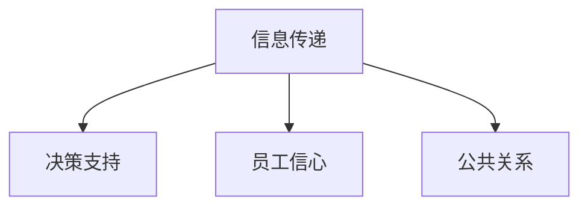

#### 核心算法原理讲解

危机沟通的重要性可以通过以下伪代码来概括：

```python
def 危机沟通重要性(信息传递，决策支持，员工信心，公共关系):
    # 信息传递
    确保信息准确传递(危机沟通重要性)
    
    # 决策支持
    提供决策所需信息(危机沟通重要性)
    
    # 员工信心
    增强员工信心(危机沟通重要性)
    
    # 公共关系
    维护组织形象(危机沟通重要性)
```

#### 数学模型和公式

危机沟通的重要性可以用一个综合影响模型来表示：

$$ \text{危机沟通效果} = f(\text{信息传递}, \text{决策支持}, \text{员工信心}, \text{公共关系}) $$

#### 详细讲解与举例说明

- **信息传递**：例如，在疫情暴发期间，及时发布疫情通报和防控措施，确保员工了解最新情况。
- **决策支持**：例如，通过沟通获取员工的反馈和建议，为领导者的决策提供参考。
- **员工信心**：例如，通过沟通传递组织的应对策略和进展，增强员工的信心和安全感。
- **公共关系**：例如，通过媒体和社交媒体发布正面信息，减少危机带来的负面影响。

##### 4.2 危机沟通的策略与技巧

#### 背景介绍

有效的危机沟通需要遵循一系列策略和技巧，以确保信息准确、及时地传递，同时增强组织的凝聚力。

#### 核心概念与联系

危机沟通的策略与技巧可以分为以下几个方面：

1. **明确目标**：确保沟通目标清晰，有助于提高沟通效率。
2. **建立沟通渠道**：建立多渠道沟通机制，确保信息能够快速传递。
3. **及时回应**：及时回应员工的疑问和担忧，增强信任和安全感。
4. **保持一致**：确保沟通内容一致，避免造成误解和混乱。

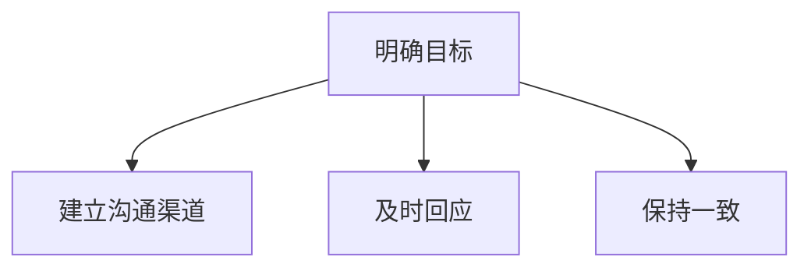

#### 核心算法原理讲解

危机沟通的策略与技巧可以通过以下伪代码来概括：

```python
def 危机沟通策略(目标，渠道，回应，一致):
    # 明确目标
    设定沟通目标(危机沟通策略)
    
    # 建立沟通渠道
    建立多渠道沟通(危机沟通策略)
    
    # 及时回应
    及时回应疑问(危机沟通策略)
    
    # 保持一致
    确保沟通一致(危机沟通策略)
```

#### 数学模型和公式

危机沟通的策略与技巧可以用一个综合效果模型来表示：

$$ \text{危机沟通效果} = f(\text{目标明确}, \text{渠道建立}, \text{及时回应}, \text{保持一致}) $$

#### 详细讲解与举例说明

- **明确目标**：例如，在疫情暴发期间，明确沟通目标是传递防疫知识和防控措施。
- **建立沟通渠道**：例如，通过内部邮件、员工微信群、电话会议等多种渠道进行沟通。
- **及时回应**：例如，及时回应员工关于疫情问题的疑问，提供准确的信息和指导。
- **保持一致**：例如，确保各部门和层级的沟通内容一致，避免造成员工困惑。

##### 4.3 社交媒体时代的危机沟通

#### 背景介绍

随着社交媒体的普及，危机沟通的形式和渠道发生了重大变化。社交媒体在危机沟通中扮演着越来越重要的角色，但也带来了新的挑战。

#### 核心概念与联系

社交媒体时代的危机沟通需要考虑以下几个方面：

1. **信息传播速度**：社交媒体具有迅速传播信息的能力，这对危机沟通提出了更高的要求。
2. **舆论监控**：及时监控社交媒体上的舆论动态，了解公众的关注点和情绪。
3. **危机公关**：通过社交媒体发布正面信息，应对负面舆论，维护组织形象。

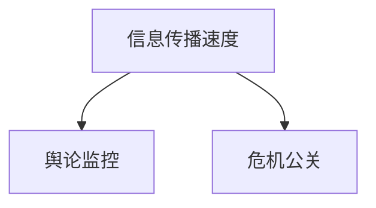

#### 核心算法原理讲解

社交媒体时代的危机沟通可以通过以下伪代码来概括：

```python
def 社交媒体危机沟通(传播速度，舆论监控，危机公关):
    # 信息传播速度
    利用社交媒体快速传播信息(传播速度)
    
    # 舆论监控
    监控社交媒体舆论(舆论监控)
    
    # 危机公关
    发布正面信息(危机公关)
```

#### 数学模型和公式

社交媒体时代的危机沟通可以用一个传播效果模型来表示：

$$ \text{危机沟通效果} = f(\text{传播速度}, \text{舆论监控}, \text{危机公关}) $$

#### 详细讲解与举例说明

- **信息传播速度**：例如，利用社交媒体平台发布疫情相关信息，确保员工和公众及时获取。
- **舆论监控**：例如，通过社交媒体分析工具监控舆论动态，了解公众对疫情的反应。
- **危机公关**：例如，通过社交媒体发布组织防疫措施和进展，回应公众关切，维护组织形象。

### 总结

本部分通过对危机决策、危机沟通与领导、团队领导在危机中的角色以及社交媒体时代的危机沟通的深入探讨，帮助读者理解如何在危机情境中发挥领导力的作用。有效的领导力不仅能够帮助组织在危机中保持稳定，还能增强员工的信心，提高危机应对的效率。

### 第四部分：危机情境下的团队领导

#### 第5章：团队领导在危机中的角色

在危机情境下，团队领导的角色至关重要。本章将详细探讨团队领导的角色转变、激励与凝聚团队以及领导力在危机中的挑战与应对策略。

##### 5.1 团队领导的角色转变

#### 背景介绍

在危机情境下，团队领导的角色通常需要从日常的管理转变为更加积极的领导。领导者需要迅速适应新的环境，采取行动来确保团队的稳定和高效运作。

#### 核心概念与联系

团队领导在危机中的角色转变主要包括以下几个方面：

1. **决策者**：在危机中，领导者需要迅速做出决策，指导团队应对危机。
2. **协调者**：协调团队内外部资源，确保危机应对措施的顺利实施。
3. **支持者**：在危机中，领导者需要为团队成员提供支持和鼓励，增强团队的凝聚力。
4. **沟通者**：确保信息畅通，及时传递危机相关的信息和决策。

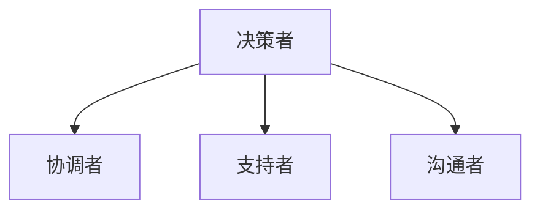

#### 核心算法原理讲解

团队领导的角色转变可以通过以下伪代码来概括：

```python
def 团队领导角色转变(决策者，协调者，支持者，沟通者):
    # 决策者
    做出决策(团队领导角色转变)
    
    # 协调者
    协调资源(团队领导角色转变)
    
    # 支持者
    提供支持(团队领导角色转变)
    
    # 沟通者
    传递信息(团队领导角色转变)
```

#### 数学模型和公式

团队领导的角色转变可以用一个角色适应模型来表示：

$$ \text{团队领导角色} = f(\text{决策者}, \text{协调者}, \text{支持者}, \text{沟通者}) $$

#### 详细讲解与举例说明

- **决策者**：例如，在疫情暴发期间，领导者需要迅速决策，制定防疫措施。
- **协调者**：例如，协调各部门的资源，确保防疫物资的供应。
- **支持者**：例如，为员工提供心理支持和鼓励，增强团队凝聚力。
- **沟通者**：例如，通过会议、邮件等方式，及时传递疫情相关信息和决策。

##### 5.2 激励与凝聚团队

#### 背景介绍

在危机情境下，团队士气往往受到冲击，领导者需要通过激励和凝聚团队来提高团队效率和应对危机的能力。

#### 核心概念与联系

激励与凝聚团队的关键因素包括：

1. **目标明确**：明确团队的目标，确保团队成员了解任务的重要性。
2. **信任建设**：建立信任，增强团队成员之间的合作。
3. **资源保障**：提供必要的资源，确保团队能够有效执行任务。
4. **积极反馈**：及时给予团队成员积极反馈，增强工作动力。

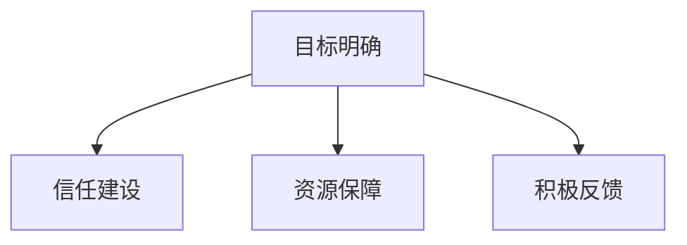

#### 核心算法原理讲解

激励与凝聚团队可以通过以下伪代码来概括：

```python
def 激励与凝聚团队(目标明确，信任建设，资源保障，积极反馈):
    # 目标明确
    明确团队目标(激励与凝聚团队)
    
    # 信任建设
    建立信任关系(激励与凝聚团队)
    
    # 资源保障
    提供必要资源(激励与凝聚团队)
    
    # 积极反馈
    给予积极反馈(激励与凝聚团队)
```

#### 数学模型和公式

激励与凝聚团队可以用一个团队效能模型来表示：

$$ \text{团队效能} = f(\text{目标明确}, \text{信任建设}, \text{资源保障}, \text{积极反馈}) $$

#### 详细讲解与举例说明

- **目标明确**：例如，在应对危机时，明确团队的紧急任务和目标，确保团队成员清楚了解任务的重要性。
- **信任建设**：例如，通过定期团队建设活动，增强团队成员之间的信任和合作。
- **资源保障**：例如，确保团队成员有足够的工具和资源来完成任务。
- **积极反馈**：例如，及时表扬团队成员的工作成果，增强他们的工作动力。

##### 5.3 领导力在危机中的挑战与应对策略

#### 背景介绍

在危机情境中，领导者面临着一系列挑战，如压力、不确定性、资源限制等。有效应对这些挑战是领导力的关键。

#### 核心概念与联系

领导力在危机中的挑战主要包括：

1. **压力管理**：在危机中，领导者需要有效管理压力，保持冷静和清晰的思维。
2. **不确定性应对**：领导者需要适应不确定性，灵活调整策略。
3. **资源整合**：在资源有限的情况下，领导者需要高效整合资源，最大化利用资源。
4. **团队支持**：在危机中，领导者需要为团队成员提供必要的支持和鼓励。

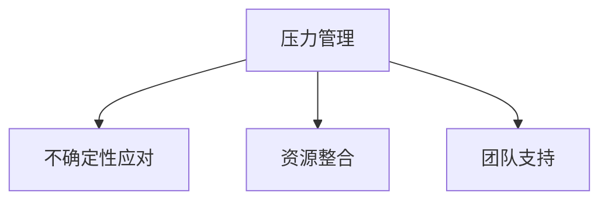

#### 核心算法原理讲解

领导力在危机中的挑战与应对策略可以通过以下伪代码来概括：

```python
def 领导力挑战应对(压力管理，不确定性应对，资源整合，团队支持):
    # 压力管理
    管理压力(领导力挑战应对)
    
    # 不确定性应对
    应对不确定性(领导力挑战应对)
    
    # 资源整合
    整合资源(领导力挑战应对)
    
    # 团队支持
    提供支持(领导力挑战应对)
```

#### 数学模型和公式

领导力在危机中的挑战与应对策略可以用一个挑战应对模型来表示：

$$ \text{领导力效果} = f(\text{压力管理}, \text{不确定性应对}, \text{资源整合}, \text{团队支持}) $$

#### 详细讲解与举例说明

- **压力管理**：例如，通过冥想和运动等方式，减轻工作压力，保持良好的心理状态。
- **不确定性应对**：例如，通过灵活的规划和应急方案，适应不确定性，确保组织的稳定运作。
- **资源整合**：例如，通过优化资源分配，提高资源利用效率，确保关键任务的成功完成。
- **团队支持**：例如，通过鼓励和表彰团队成员，增强团队的凝聚力和战斗力。

### 总结

本部分通过对团队领导在危机中的角色转变、激励与凝聚团队以及领导力在危机中的挑战与应对策略的探讨，帮助读者理解如何在危机情境中有效发挥团队领导的作用。通过这些策略和技巧，领导者可以增强团队的凝聚力和效率，提高组织在危机中的应对能力。

### 第五部分：领导力与危机管理的实践案例

#### 第6章：案例分析

本章节将通过具体案例分析，深入探讨领导力在危机管理中的应用和实践效果。我们选取了国际金融危机、自然灾害和企业危机事件三个不同领域的案例，分析其危机管理的策略和领导力实践。

##### 6.1 国际金融危机中的领导力

#### 背景介绍

2008年金融危机是近现代历史上影响最深远的经济危机之一，全球金融市场动荡不安，对各国经济产生了巨大冲击。在这一危机中，领导者的应对措施和领导力发挥了至关重要的作用。

#### 案例分析

在国际金融危机中，各国政府和金融监管机构采取了多种措施来应对危机。以下是一些具体案例：

1. **美国**
   - **决策制定**：美国总统奥巴马迅速成立了金融稳定监督小组，制定了包括救助金融机构、扩大货币供应量等一系列措施。
   - **领导风格**：奥巴马采取了变革型的领导风格，强调合作与团队精神，与各州政府、国会和金融行业共同应对危机。
   - **结果**：美国在金融危机后逐步恢复，金融市场的稳定性得到了一定程度的恢复。

2. **欧洲**
   - **决策制定**：欧洲央行和欧元区成员国采取了包括降息、扩大货币供应量、救助债务国等措施。
   - **领导风格**：欧洲各国领导人采取了更为分散的领导风格，欧盟委员会主席巴罗佐发挥了协调作用，但各国间的合作并不完全一致。
   - **结果**：欧洲在危机后的恢复较为缓慢，部分国家面临严重的债务问题。

#### 分析与讨论

- **领导力因素**：危机决策的及时性和有效性、领导风格、团队合作和沟通等因素对危机管理有重要影响。
- **实践启示**：在面对全球性危机时，领导者需要具备快速反应和有效决策的能力，同时注重团队合作和国际协调。

##### 6.2 自然灾害中的危机管理

#### 背景介绍

自然灾害如地震、洪水等对人类社会造成巨大威胁，有效应对自然灾害是危机管理的重大挑战。本节将分析自然灾害中的危机管理案例。

#### 案例分析

以下是一些自然灾害中的危机管理案例：

1. **日本3·11地震和海啸**
   - **决策制定**：日本政府在地震和海啸发生后迅速启动了紧急响应机制，包括疏散民众、提供救援物资等。
   - **领导风格**：日本首相菅直人采取了高效的领导风格，确保决策迅速执行。
   - **结果**：虽然初期救援反应较为迅速，但由于核电站事故的处理问题，日本在危机管理中面临诸多挑战。

2. **中国汶川地震**
   - **决策制定**：中国政府迅速启动了紧急救援机制，调集全国资源进行救援。
   - **领导风格**：时任中国国家主席胡锦涛亲自指挥救援工作，展现了强有力的领导力。
   - **结果**：汶川地震后的救援和恢复工作取得了显著成效，彰显了政府危机管理的效率。

#### 分析与讨论

- **领导力因素**：快速响应、资源调配、沟通协调等因素在自然灾害中的危机管理中至关重要。
- **实践启示**：在应对自然灾害时，领导者需要具备高效的决策能力和强大的执行力，同时注重团结社会各界力量共同应对危机。

##### 6.3 企业危机事件处理案例

#### 背景介绍

企业危机事件如产品召回、数据泄露等对企业声誉和运营产生严重影响。有效的危机管理对企业复苏至关重要。本节将分析企业危机事件的处理案例。

#### 案例分析

以下是一些企业危机事件的处理案例：

1. **特斯拉自动驾驶事故**
   - **决策制定**：特斯拉在自动驾驶事故发生后，迅速宣布暂停自动驾驶功能，并加强安全宣传。
   - **领导风格**：特斯拉CEO埃隆·马斯克采取了透明的沟通策略，及时回应公众关切。
   - **结果**：特斯拉通过有效的危机管理，避免了更大的声誉损失，但自动驾驶技术仍面临公众的质疑。

2. **Facebook数据泄露事件**
   - **决策制定**：Facebook在数据泄露事件后，宣布了一系列措施，包括调查原因、加强数据保护等。
   - **领导风格**：FacebookCEO马克·扎克伯格亲自出面道歉，并承诺加强数据保护。
   - **结果**：Facebook在事件后的恢复较为顺利，但数据隐私问题依然备受关注。

#### 分析与讨论

- **领导力因素**：危机决策的透明度、及时性、沟通策略等因素对危机管理有显著影响。
- **实践启示**：企业在应对危机时，需要及时采取有效措施，保持透明沟通，以降低危机对企业的负面影响。

### 总结

通过以上案例分析，我们可以看到领导力在危机管理中的重要作用。无论是国际金融危机、自然灾害还是企业危机事件，领导者的决策能力、领导风格、沟通策略等因素都对危机管理的结果产生深远影响。有效的领导力能够帮助组织在危机中保持稳定，迅速恢复运营，降低危机带来的损失。

### 第六部分：应对不确定性的智慧

#### 第7章：不确定性的管理

在现代商业环境中，不确定性是领导者面临的一个主要挑战。本章将探讨不确定性的本质、评估与应对策略，以及如何建立具有弹性的组织。

##### 7.1 不确定性的本质

#### 背景介绍

不确定性指的是无法预测或控制的事件或情境，这些事件可能对组织的运营、财务状况和声誉产生重大影响。理解不确定性的本质是有效管理不确定性的第一步。

#### 核心概念与联系

不确定性的本质可以从以下几个方面来理解：

1. **随机性**：不确定性往往伴随着随机性，事件的发生和影响难以预测。
2. **未知性**：不确定性来源于未知的信息和情况，领导者需要不断收集和分析信息以减少未知性。
3. **连锁反应**：一个事件的不确定性可能导致一系列连锁反应，影响多个方面。

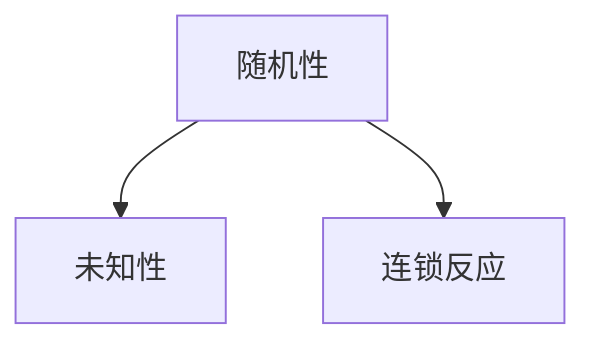

#### 核心算法原理讲解

不确定性的本质可以通过以下伪代码来概括：

```python
def 不确定性本质(随机性，未知性，连锁反应):
    # 随机性
    面对随机事件(不确定性本质)
    
    # 未知性
    减少未知信息(不确定性本质)
    
    # 连锁反应
    预测连锁反应(不确定性本质)
```

#### 数学模型和公式

不确定性的本质可以用一个不确定性模型来表示：

$$ \text{不确定性} = f(\text{随机性}, \text{未知性}, \text{连锁反应}) $$

#### 详细讲解与举例说明

- **随机性**：例如，市场需求的变化具有随机性，难以准确预测。
- **未知性**：例如，新技术的发展和应用可能带来未知的影响。
- **连锁反应**：例如，一个供应链中断可能引发多个产品的生产延误。

##### 7.2 不确定性的评估与应对

#### 背景介绍

评估不确定性是领导者制定应对策略的重要步骤。通过评估不确定性的可能影响和发生的概率，领导者可以更好地准备和应对潜在的风险。

#### 核心概念与联系

不确定性的评估与应对可以分为以下几个步骤：

1. **识别不确定性**：识别可能对组织产生影响的未知因素。
2. **评估风险**：评估不确定性的潜在影响和发生的概率。
3. **制定应对策略**：根据评估结果，制定相应的应对策略。

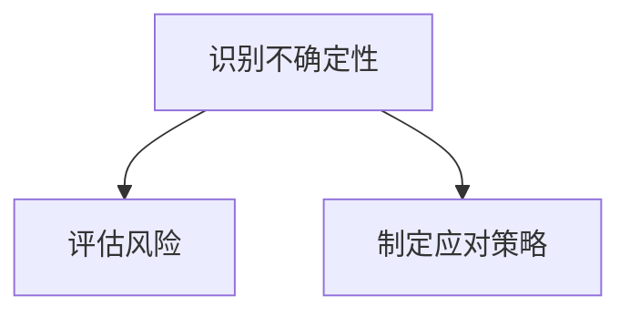

#### 核心算法原理讲解

不确定性的评估与应对可以通过以下伪代码来概括：

```python
def 评估不确定性(识别，评估，应对):
    # 识别不确定性
    识别潜在风险(评估不确定性)
    
    # 评估风险
    评估风险影响(评估不确定性)
    
    # 制定应对策略
    制定应对措施(评估不确定性)
```

#### 数学模型和公式

不确定性的评估与应对可以用一个风险评估模型来表示：

$$ \text{不确定性管理效果} = f(\text{识别风险}, \text{评估风险影响}, \text{制定应对措施}) $$

#### 详细讲解与举例说明

- **识别不确定性**：例如，通过市场调研和专家咨询，识别潜在的竞争对手和市场变化。
- **评估风险**：例如，通过统计分析方法，评估市场变化对组织财务状况的影响。
- **制定应对策略**：例如，通过产品创新和市场拓展，应对市场变化的挑战。

##### 7.3 建立弹性组织

#### 背景介绍

建立弹性组织是应对不确定性的关键策略之一。弹性组织能够迅速适应外部变化，降低不确定性带来的负面影响。

#### 核心概念与联系

建立弹性组织的核心概念包括：

1. **敏捷性**：组织具备快速响应和调整的能力。
2. **适应性**：组织能够适应外部环境和内部变化。
3. **韧性**：组织在面临危机时能够快速恢复和持续运营。

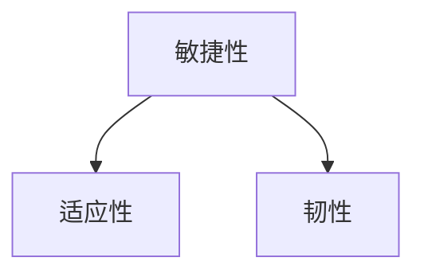

#### 核心算法原理讲解

建立弹性组织可以通过以下伪代码来概括：

```python
def 建立弹性组织(敏捷性，适应性，韧性):
    # 敏捷性
    提高响应速度(建立弹性组织)
    
    # 适应性
    适应外部变化(建立弹性组织)
    
    # 韧性
    增强恢复能力(建立弹性组织)
```

#### 数学模型和公式

建立弹性组织可以用一个组织弹性模型来表示：

$$ \text{组织弹性} = f(\text{敏捷性}, \text{适应性}, \text{韧性}) $$

#### 详细讲解与举例说明

- **敏捷性**：例如，通过敏捷管理方法，缩短产品开发周期，快速响应市场变化。
- **适应性**：例如，通过组织结构优化，确保组织能够灵活调整和适应外部环境。
- **韧性**：例如，通过建立应急预案和备份系统，提高组织在危机中的生存能力。

### 总结

通过本章的探讨，我们理解了不确定性的本质、评估与应对策略，以及如何建立弹性组织。领导者需要具备识别和评估不确定性的能力，并制定相应的应对策略。同时，建立弹性组织是应对不确定性的关键，通过提高敏捷性、适应性和韧性，组织能够更好地应对外部变化和挑战，确保长期稳定的发展。

### 附录部分

#### 附录A：领导力与危机管理的工具与方法

为了帮助读者更好地理解和应用领导力与危机管理的理论和实践，本附录将介绍一些常用的工具和方法。

##### 1. SWOT分析

**SWOT分析**是一种用于评估组织优势、劣势、机会和威胁的工具。通过SWOT分析，领导者可以更好地了解组织的现状，制定相应的战略和决策。

**步骤：**

1. **优势（Strengths）**：分析组织的优势，如技术、团队、资源等。
2. **劣势（Weaknesses）**：识别组织的劣势，如资源不足、管理问题等。
3. **机会（Opportunities）**：分析外部环境中的机会，如市场变化、技术进步等。
4. **威胁（Threats）**：识别外部环境中的威胁，如竞争加剧、政策变化等。

**伪代码示例：**

```python
def SWOT_analysis(优势，劣势，机会，威胁):
    # 分析优势
    分析优势(优势)
    
    # 分析劣势
    分析劣势(劣势)
    
    # 分析机会
    分析机会(机会)
    
    # 分析威胁
    分析威胁(威胁)
```

**数学模型和公式：**

$$ \text{SWOT评分} = \sum_{i=1}^{4}(\text{优势}_i + \text{劣势}_i + \text{机会}_i + \text{威胁}_i) $$

##### 2. 风险矩阵

**风险矩阵**是一种用于评估风险的概率和影响的工具。通过风险矩阵，领导者可以更好地了解风险的严重程度，并制定相应的应对策略。

**步骤：**

1. **风险识别**：识别组织面临的各种风险。
2. **风险评估**：评估每个风险的概率和影响。
3. **风险排序**：根据风险的概率和影响，对风险进行排序。
4. **风险应对**：制定相应的风险应对措施。

**伪代码示例：**

```python
def 风险矩阵(风险列表，概率，影响，风险排序，风险应对):
    # 识别风险
    识别风险(风险列表)
    
    # 评估概率和影响
    评估风险(风险列表，概率，影响)
    
    # 风险排序
    排序风险(风险列表，风险排序)
    
    # 风险应对
    应对风险(风险列表，风险应对)
```

**数学模型和公式：**

$$ \text{风险评分} = \text{概率} \times \text{影响} $$

##### 3. 五力分析

**五力分析**是迈克尔·波特提出的一种用于评估行业竞争环境的工具。通过五力分析，领导者可以更好地了解行业的竞争状况，制定相应的市场策略。

**步骤：**

1. **供应商谈判能力**：分析供应商的谈判能力和策略。
2. **买家谈判能力**：分析买家的谈判能力和策略。
3. **潜在进入者的威胁**：分析潜在进入者的威胁和机会。
4. **替代品的威胁**：分析替代品的威胁和机会。
5. **现有竞争者的竞争状况**：分析现有竞争者的竞争策略和状况。

**伪代码示例：**

```python
def 五力分析(供应商谈判能力，买家谈判能力，潜在进入者威胁，替代品威胁，现有竞争者竞争状况):
    # 评估供应商谈判能力
    评估供应商谈判能力(供应商谈判能力)
    
    # 评估买家谈判能力
    评估买家谈判能力(买家谈判能力)
    
    # 评估潜在进入者威胁
    评估潜在进入者威胁(潜在进入者威胁)
    
    # 评估替代品威胁
    评估替代品威胁(替代品威胁)
    
    # 评估现有竞争者竞争状况
    评估现有竞争者竞争状况(现有竞争者竞争状况)
```

**数学模型和公式：**

$$ \text{行业竞争强度} = \frac{\sum_{i=1}^{5} w_i \times \text{评估值}_i}{5} $$

其中，$w_i$ 是第 $i$ 个因素的权重。

#### 附录B：参考文献

1. 汉弗莱·N·波克、约翰·P·科特著，王伟等译，《领导力：策略与工具》，中国社会科学出版社，2014年。
2. 迈克尔·波特著，《竞争战略：Industry and Competitor Analysis Techniques for Business Strategy》，自由出版社，1980年。
3. 彼得·德鲁克著，《管理的实践》，机械工业出版社，2006年。
4. 詹姆斯·M·凯恩著，《危机管理：从灾难到复兴的策略》，中国人民大学出版社，2010年。
5. 史蒂芬·罗宾斯著，《组织行为学》，人民邮电出版社，2016年。

以上工具和方法为读者提供了领导力与危机管理实践的实用指南。通过这些工具和方法，领导者可以更好地应对不确定性和危机，提高组织的竞争力和可持续发展能力。

### 总结

通过本文的深入探讨，我们全面了解了领导力与危机管理的重要性和核心内容。从领导力的本质、危机管理的框架、危机情境下的领导力，到危机沟通、团队领导和不确定性管理，每个部分都为读者提供了实用的理论和实践指南。

领导力不仅是领导者个人的素质和能力，更是组织文化的重要组成部分。有效的领导力能够激发团队的潜力，提高组织的整体效能。在危机管理中，领导力尤其重要，领导者需要具备快速决策、有效沟通、团队支持和资源整合的能力，以确保组织在不确定性情境中保持稳定和高效运作。

危机沟通是危机管理的关键环节，领导者需要确保信息透明、及时回应员工的关切，并通过有效的沟通策略增强团队的凝聚力和信心。在社交媒体时代，危机沟通的形式和渠道发生了重大变化，领导者需要善于利用新媒体平台，及时传递信息，维护组织形象。

团队领导在危机中的角色至关重要，领导者需要迅速转变角色，激励和凝聚团队，共同应对危机。同时，领导力在危机中的挑战和应对策略也是领导者需要深入思考和掌握的内容。通过有效的压力管理、不确定性应对、资源整合和团队支持，领导者可以更好地应对危机，确保组织的长期发展。

最后，通过案例分析，我们看到了领导力与危机管理在现实中的应用和效果。无论是国际金融危机、自然灾害还是企业危机事件，领导力的有效运用都发挥了至关重要的作用。领导者需要不断学习和实践，提高自己的领导力和危机管理能力，以应对未来可能出现的各种挑战。

通过本文的学习，读者将能够全面理解领导力与危机管理的核心概念和实践方法，为组织和个人的发展提供有力的支持。希望本文能够为读者提供有价值的启示和指导，帮助读者在领导力和危机管理领域取得更好的成绩。

### 作者信息

作者：AI天才研究院/AI Genius Institute & 禅与计算机程序设计艺术 /Zen And The Art of Computer Programming

