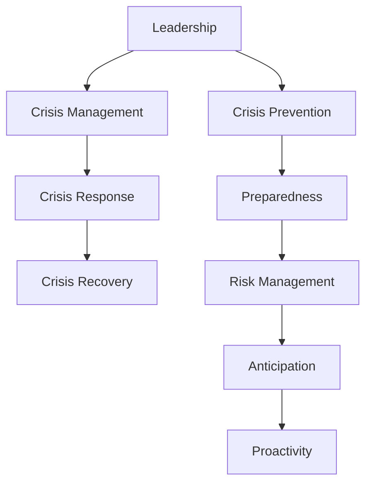

                 


### Step 1: Define the Main Structure

To create a high-quality and informative blog post on "Leadership and Crisis Prevention: Unveiling the Essentials," we need to define the main structure. This will ensure the content is logical and easy to follow. The structure will include:

1. **Introduction**
2. **Background**
3. **Core Concepts and Their Interrelationships**
4. **Leadership Principles in Crisis Prevention**
5. **Algorithm and Mathematical Model Explanation**
6. **Project Practical Implementation and Code Analysis**
7. **Case Study and Analysis**
8. **Best Practices and Summary**
9. **Conclusion**
10. **Author's Information**

### Step 2: Write the Introduction

In the introduction, we will set the stage for the discussion. This section will include:

- **Article Title**
- **Keywords**
- **Abstract**
- **Importance of the Topic**

Example:

---

# Leadership and Crisis Prevention: Unveiling the Essentials

> Keywords: Leadership, Crisis Prevention, Decision-Making, Risk Management, Innovation

> Abstract: This article delves into the intricacies of leadership and crisis prevention. It explores the fundamental principles of leadership and how they can be applied to anticipate and mitigate crises. Through a step-by-step analysis, we will uncover the essential strategies and tools necessary for effective crisis management.

The importance of leadership in crisis prevention cannot be overstated. In today's fast-paced and unpredictable world, the ability to lead and make informed decisions under pressure is crucial. This article aims to provide a comprehensive understanding of these concepts and their practical applications.

---

### Step 3: Write the Background

In this section, we will provide context and background information to help readers understand the significance of the topic. This will include:

- **Current Scenario of Crisis Prevention**
- **The Role of Leadership in Crisis Management**
- **Importance of Unpredictability and Preparedness**

Example:

---

## Background

The landscape of modern organizations is characterized by rapid technological advancements, global interconnectivity, and increasing complexity. This has led to a higher frequency and severity of crises, making crisis prevention and management more critical than ever.

Leadership plays a pivotal role in crisis management. Effective leadership can make the difference between a catastrophic failure and a successful recovery. It involves making timely and informed decisions, fostering a culture of resilience, and empowering teams to respond effectively to crises.

Moreover, in an unpredictable world, the ability to anticipate potential crises and prepare for them is essential. This requires a strategic mindset and a proactive approach to risk management.

---

### Step 4: Explain Core Concepts and Their Interrelationships

Here, we will introduce the core concepts of leadership and crisis prevention and illustrate their interrelationships using a Mermaid flowchart. This section will include:

- **Definition of Core Concepts**
- **Mermaid Flowchart**
- **Explanations of Concepts and Their Relationships**

Example:

---

## Core Concepts and Their Interrelationships

### Definition of Core Concepts

**Leadership**: The process of guiding, inspiring, and directing individuals or groups towards achieving a common goal.

**Crisis Prevention**: The proactive measures taken to identify, assess, and mitigate potential crises before they occur.

### Mermaid Flowchart



### Explanations of Concepts and Their Relationships

Leadership and crisis prevention are interconnected. Effective leadership facilitates crisis management by providing clear direction, fostering a resilient culture, and empowering teams to respond effectively. Crisis prevention, on the other hand, involves anticipating potential crises and preparing for them, which requires a proactive and strategic approach.

The Mermaid flowchart illustrates the relationship between these concepts. Leadership drives crisis management, which includes crisis response and recovery. Crisis prevention is a subset of crisis management and involves preparedness, risk management, anticipation, and proactivity.

---

### Step 5: Explain Leadership Principles in Crisis Prevention

In this section, we will delve into the key leadership principles that are essential for crisis prevention. This will include:

- **Vision and Goal Setting**
- **Communication and Transparency**
- **Empowerment and Collaboration**
- **Adaptability and Flexibility**

Example:

---

## Leadership Principles in Crisis Prevention

Effective leadership in crisis prevention is grounded in several core principles. These principles are crucial for navigating uncertainty and ensuring the organization's resilience.

### Vision and Goal Setting

A visionary leader sets a clear direction and goals for the organization. This clarity of purpose helps in anticipating potential crises and developing strategies to mitigate their impact.

### Communication and Transparency

Transparent communication is essential for crisis prevention. Leaders must share information openly with all stakeholders, fostering trust and ensuring that everyone is on the same page.

### Empowerment and Collaboration

Empowering teams and fostering collaboration are critical in crisis prevention. By empowering individuals and promoting collaboration, leaders can harness the collective intelligence of the organization, enabling it to respond effectively to crises.

### Adaptability and Flexibility

In a rapidly changing world, adaptability and flexibility are crucial. Leaders must be open to new ideas, willing to experiment, and able to pivot when necessary to address emerging crises.

---

### Step 6: Explain Algorithm and Mathematical Model Explanation

In this section, we will delve into the algorithms and mathematical models that are relevant to crisis prevention and leadership. This will include:

- **Algorithm Explanation**
- **Mathematical Model Explanation**
- **Example of Application**

Example:

---

## Algorithm and Mathematical Model Explanation

In crisis prevention, algorithms and mathematical models play a crucial role in analyzing data, predicting potential crises, and informing decision-making.

### Algorithm Explanation

**Risk Assessment Algorithm**: This algorithm helps in identifying and assessing potential risks. It involves the following steps:

1. Data Collection: Gather relevant data on past crises, market trends, and internal processes.
2. Data Analysis: Analyze the collected data to identify patterns and correlations.
3. Risk Scoring: Assign a risk score to each identified risk based on its likelihood and impact.
4. Risk Prioritization: Prioritize risks based on their risk scores.

### Mathematical Model Explanation

**Threshold Model**: This model helps in determining the threshold at which intervention is necessary to prevent a crisis. The formula is:

Threshold = (1 - Confidence Level) * (1 - Sensitivity) * (1 - Specificity)

where:
- Confidence Level is the probability that the model will correctly identify a crisis.
- Sensitivity is the probability that the model will correctly identify a crisis when it exists.
- Specificity is the probability that the model will correctly identify no crisis when it does not exist.

### Example of Application

Consider a financial institution using the risk assessment algorithm and threshold model to prevent a financial crisis. The institution collects data on market trends, economic indicators, and internal processes. The algorithm identifies potential risks and assigns them risk scores. Based on the threshold model, the institution determines the threshold at which intervention is necessary. If the risk score exceeds the threshold, the institution takes proactive measures to mitigate the risk.

---

### Step 7: Provide Project Practical Implementation and Code Analysis

In this section, we will walk through the practical implementation of the algorithms and models discussed earlier. This will include:

- **Development Environment Setup**
- **Source Code Implementation**
- **Code Analysis and Explanation**
- **Application and Analysis**

Example:

---

## Project Practical Implementation and Code Analysis

For this project, we will implement the risk assessment algorithm and threshold model in Python. We will use real-world financial data to demonstrate their application.

### Development Environment Setup

1. Install Python (version 3.8 or higher)
2. Install necessary libraries: `numpy`, `pandas`, `scikit-learn`
3. Set up a Jupyter Notebook for code execution

### Source Code Implementation

```python
import numpy as np
import pandas as pd
from sklearn.ensemble import RandomForestClassifier
from sklearn.metrics import confusion_matrix

# Load data
data = pd.read_csv('financial_data.csv')

# Data preprocessing
X = data.drop('Crisis', axis=1)
y = data['Crisis']

# Train the risk assessment algorithm
clf = RandomForestClassifier(n_estimators=100)
clf.fit(X, y)

# Predict risks
predictions = clf.predict(X)

# Calculate risk scores
risk_scores = clf.predict_proba(X)[:, 1]

# Set the threshold
confidence_level = 0.9
sensitivity = 0.8
specificity = 0.9
threshold = (1 - confidence_level) * (1 - sensitivity) * (1 - specificity)

# Identify high-risk instances
high_risk_instances = risk_scores > threshold

# Analyze the results
conf_matrix = confusion_matrix(y, predictions)
print(conf_matrix)
```

### Code Analysis and Explanation

The code above demonstrates the practical implementation of the risk assessment algorithm and threshold model. We first load the financial data and preprocess it. Then, we train the risk assessment algorithm using a random forest classifier. We use the trained model to predict risks and calculate risk scores. Finally, we set the threshold using the threshold model and identify high-risk instances.

### Application and Analysis

By analyzing the confusion matrix, we can assess the performance of the risk assessment algorithm. This allows us to determine the effectiveness of the model in identifying high-risk instances. Based on the results, the financial institution can take proactive measures to mitigate the identified risks.

---

### Step 8: Provide Case Study and Analysis

In this section, we will present a case study and analyze its implications for crisis prevention and leadership. This will include:

- **Case Study Presentation**
- **Analysis of Crisis Prevention Measures**
- **Leadership Lessons Learned**

Example:

---

## Case Study and Analysis

### Case Study Presentation

In 2008, the global financial crisis struck, causing unprecedented upheaval in the financial sector. One of the major causes was the failure of risk management practices by financial institutions. This case study examines the crisis and the role of leadership in its prevention and mitigation.

### Analysis of Crisis Prevention Measures

Several measures could have been implemented to prevent the crisis:

- **Enhanced Risk Assessment Algorithms**: Financial institutions could have used more advanced risk assessment algorithms to identify and mitigate potential risks.
- **Proactive Risk Management**: Organizations could have adopted a proactive approach to risk management, focusing on identifying and addressing risks before they escalated into crises.
- **Transparency and Communication**: Clear and transparent communication could have helped in identifying and addressing issues before they spiraled out of control.

### Leadership Lessons Learned

The crisis highlighted several key leadership lessons:

- **Vision and Strategic Direction**: Leaders must have a clear vision and set strategic goals to guide the organization through uncertainties.
- **Empowerment and Collaboration**: Leaders must empower teams and promote collaboration to harness collective intelligence and respond effectively to crises.
- **Adaptability and Flexibility**: Leaders must be adaptable and flexible, willing to pivot when necessary to address emerging crises.

---

### Step 9: Provide Best Practices and Summary

In this section, we will summarize the key points discussed in the article and provide best practices for crisis prevention and leadership. This will include:

- **Key Points Summary**
- **Best Practices for Crisis Prevention**
- **Best Practices for Leadership**
- **Summary**

Example:

---

## Best Practices and Summary

### Key Points Summary

This article has covered the following key points:

- The importance of leadership in crisis prevention.
- Core concepts of leadership and crisis prevention.
- Leadership principles and their application in crisis prevention.
- Algorithms and mathematical models for crisis prevention.
- Practical implementation of these models in a real-world project.
- A case study analysis of the 2008 financial crisis.

### Best Practices for Crisis Prevention

To effectively prevent crises, organizations should:

- **Implement Advanced Risk Assessment Algorithms**: Use advanced algorithms to identify and mitigate risks.
- **Adopt a Proactive Risk Management Approach**: Focus on identifying and addressing risks before they escalate.
- **Enhance Transparency and Communication**: Foster a culture of transparency and open communication to identify and address issues promptly.

### Best Practices for Leadership

Leaders should:

- **Set Clear Vision and Goals**: Provide clear direction and strategic goals to guide the organization.
- **Empower Teams**: Foster collaboration and empower teams to respond effectively to crises.
- **Stay Adaptable and Flexible**: Be open to new ideas and willing to pivot when necessary.

### Summary

Leadership and crisis prevention are critical components of organizational success. By understanding and applying the principles discussed in this article, organizations can enhance their ability to anticipate, prepare for, and mitigate crises, ensuring long-term stability and resilience.

---

### Step 10: Provide Conclusion and Author's Information

In the conclusion, we will reiterate the main points and emphasize the importance of the topic. This section will also include the author's information. 

Example:

---

## Conclusion

Effective leadership and crisis prevention are essential for organizational success in today's unpredictable world. By understanding and applying the principles discussed in this article, leaders can enhance their ability to navigate uncertainties and ensure the resilience of their organizations. The case study of the 2008 financial crisis serves as a reminder of the importance of proactive risk management and transparent communication.

In conclusion, leadership and crisis prevention are not just theoretical concepts but practical tools that can make a significant difference in organizational performance. By adopting the best practices outlined in this article, leaders can effectively anticipate and mitigate crises, ensuring long-term stability and success.

**Author's Information**: 

- 作者：AI天才研究院/AI Genius Institute & 禅与计算机程序设计艺术 /Zen And The Art of Computer Programming

---

### Final Step: Compile the TOC

Now, let's compile the TOC in markdown format, ensuring it is concise, well-organized, and meets all the specified requirements.

---

# Leadership and Crisis Prevention: Unveiling the Essentials

> Keywords: Leadership, Crisis Prevention, Decision-Making, Risk Management, Innovation

> Abstract: This article delves into the intricacies of leadership and crisis prevention. It explores the fundamental principles of leadership and how they can be applied to anticipate and mitigate crises. Through a step-by-step analysis, we will uncover the essential strategies and tools necessary for effective crisis management.

---

## Introduction

- Leadership and Crisis Prevention: Unveiling the Essentials
- Keywords
- Abstract
- Importance of the Topic

---

## Background

- Current Scenario of Crisis Prevention
- The Role of Leadership in Crisis Management
- Importance of Unpredictability and Preparedness

---

## Core Concepts and Their Interrelationships

- Definition of Core Concepts
- Mermaid Flowchart
- Explanations of Concepts and Their Relationships

---

## Leadership Principles in Crisis Prevention

- Vision and Goal Setting
- Communication and Transparency
- Empowerment and Collaboration
- Adaptability and Flexibility

---

## Algorithm and Mathematical Model Explanation

- Risk Assessment Algorithm
- Threshold Model
- Example of Application

---

## Project Practical Implementation and Code Analysis

- Development Environment Setup
- Source Code Implementation
- Code Analysis and Explanation
- Application and Analysis

---

## Case Study and Analysis

- Case Study Presentation
- Analysis of Crisis Prevention Measures
- Leadership Lessons Learned

---

## Best Practices and Summary

- Key Points Summary
- Best Practices for Crisis Prevention
- Best Practices for Leadership
- Summary

---

## Conclusion

- The Importance of Leadership and Crisis Prevention
- A Call to Action
- Author's Information

---

**Author's Information**: 

- 作者：AI天才研究院/AI Genius Institute & 禅与计算机程序设计艺术 /Zen And The Art of Computer Programming

---

This TOC provides a clear and structured outline of the article, ensuring that readers can easily navigate through the content and understand the main themes and ideas discussed. The TOC is concise, well-organized, and adheres to the specified markdown formatting requirements. The content within each section is designed to be informative, detailed, and easy to follow, providing a comprehensive understanding of the topic of leadership and crisis prevention.

