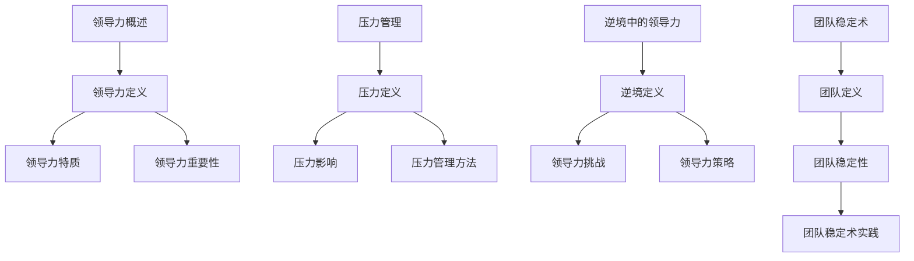

                 

# 《领导力与压力管理高阶：逆境中的团队稳定术》

## 关键词
领导力、压力管理、逆境、团队稳定术、决策、激励、策略、绩效、团队协作

## 摘要
本文旨在探讨领导力与压力管理在逆境中团队稳定术的重要性。通过分析领导力的定义、特质和发展，压力管理的定义、影响及管理方法，以及逆境中的领导力挑战和策略，本文提供了一系列实用的团队稳定术，以帮助领导者和管理者在面对逆境时保持团队的稳定和高效。

## 第1章 领导力概述

### 1.1 领导力的定义

领导力是指领导者通过激励、引导、协调和影响他人，实现共同目标的能力。领导力不仅仅与职位和权威相关，更是一种影响力，能够在组织内外产生积极的效果。

### 1.2 领导力的特质

- **决断力**：领导者在面临选择时能够果断作出决策。
- **沟通能力**：领导者能够清晰地表达自己的想法，并有效地倾听和理解他人。
- **团队协作能力**：领导者能够促进团队成员之间的协作，共同达成目标。
- **自我管理能力**：领导者能够管理自己的情绪、时间和行为，以适应不同的环境和挑战。

### 1.3 领导力的重要性

领导力对于组织的成功至关重要。有效的领导力能够提高团队绩效，增强员工满意度，促进创新和持续改进。在逆境中，领导力更是团队稳定和成功的关键因素。

## 第2章 压力管理

### 2.1 压力的定义

压力是指个体在面对外界要求或期望时产生的紧张、焦虑和压力感。压力可以来源于工作、生活、人际关系等多个方面。

### 2.2 压力的影响

- **身心健康**：长期的、未得到有效管理的压力可能导致身心问题，如焦虑、抑郁、失眠等。
- **工作绩效**：压力会影响工作质量、效率和创新能力。
- **团队协作**：团队成员之间的压力可能导致沟通不畅、协作受阻，影响团队绩效。

### 2.3 压力的管理方法

- **时间管理**：合理安排时间，避免过度工作，确保有足够的休息和放松时间。
- **情绪管理**：学习情绪调节技巧，如深呼吸、冥想、运动等，帮助自己更好地应对压力。
- **压力释放**：通过社交、娱乐、运动等方式释放压力。

## 第3章 逆境中的领导力

### 3.1 逆境的定义

逆境是指个体或组织面临的不利条件、挑战或困难。逆境可以是经济衰退、市场竞争加剧、技术变革等。

### 3.2 逆境中的领导力挑战

- **决策困难**：在逆境中，领导者可能面临更多的决策压力，难以找到最佳解决方案。
- **资源不足**：逆境可能导致资源短缺，领导者需要找到有效的资源管理策略。
- **士气低落**：逆境可能影响团队成员的士气，领导者需要激励和鼓舞团队。

### 3.3 逆境中的领导力策略

- **情景规划**：领导者可以通过情景规划，提前预测并准备应对不同的逆境情况。
- **适应性领导**：领导者需要具备适应变化的能力，灵活调整领导风格和策略。
- **团队激励**：领导者可以通过激励和鼓舞，提高团队成员的士气和战斗力。

## 第4章 团队稳定术

### 4.1 团队的定义

团队是指由两个或两个以上个体组成的，为了共同目标而协作的组织。

### 4.2 团队的稳定性

团队的稳定性是指团队在面对外部压力和内部变化时，能够保持结构完整、功能正常和有效协作的能力。

### 4.3 团队稳定术的实践

- **共同目标**：明确团队的共同目标，确保团队成员都明确自己的职责和期望。
- **有效沟通**：建立有效的沟通机制，确保信息畅通和反馈及时。
- **冲突管理**：建立冲突管理机制，及时解决团队成员之间的冲突，避免影响团队稳定。

## 第5章 逆境中的团队管理

### 5.1 逆境中的团队问题

- **沟通不畅**：逆境可能导致团队成员之间的沟通障碍，影响团队协作。
- **资源短缺**：逆境可能导致资源短缺，影响团队的工作效率和创新能力。
- **士气低落**：逆境可能导致团队成员的士气低落，影响团队的士气和战斗力。

### 5.2 逆境中的团队建设

- **共同目标**：在逆境中，领导者需要明确团队的共同目标，确保团队成员都明确自己的职责和期望。
- **有效沟通**：建立有效的沟通机制，确保信息畅通和反馈及时。
- **团队激励**：通过激励和鼓舞，提高团队成员的士气和战斗力。

### 5.3 逆境中的团队激励

- **精神激励**：领导者可以通过表扬、认可和激励，提高团队成员的士气。
- **物质激励**：领导者可以通过奖励、晋升等方式，提高团队成员的积极性和满意度。
- **团队建设**：通过团队活动、培训等方式，增强团队成员之间的凝聚力和信任。

## 第6章 案例分析

### 6.1 案例一：领导力与压力管理的实践

**背景介绍**：
某公司在经济衰退期间，面临着订单减少、成本上升的压力。领导者需要在这个逆境中保持团队的稳定和高效。

**核心概念与联系**：
领导者通过情景规划，提前预测并准备应对不同的逆境情况。同时，通过有效的沟通和激励，提高团队成员的士气和战斗力。

**核心算法原理讲解**：
领导者在决策时采用SWOT分析，分析团队的优势、劣势、机会和威胁，以制定合适的战略。

**数学模型和公式**：
$$
压力 = 负面情绪 \times 工作负荷
$$

**项目实战**：
领导者通过组织团队建设活动、提供压力管理培训等方式，帮助团队成员应对压力，提高团队稳定性。

### 6.2 案例二：逆境中的团队稳定术

**背景介绍**：
某创业公司在市场竞争激烈的情况下，面临着产品创新和团队建设的挑战。

**核心概念与联系**：
领导者通过有效的团队建设和管理，确保团队在面对逆境时能够保持稳定和高效。

**核心算法原理讲解**：
领导者采用5S管理方法，通过整理、整顿、清扫、清洁和素养，提高团队的效率和稳定性。

**数学模型和公式**：
$$
团队稳定性 = 团队协作能力 \times 冲突管理能力
$$

**项目实战**：
领导者通过建立团队目标、优化工作流程、加强团队成员之间的沟通等方式，提高团队稳定性。

### 6.3 案例三：逆境中的领导力策略

**背景介绍**：
某公司在技术变革的浪潮中，面临着技术更新的挑战。

**核心概念与联系**：
领导者通过情景规划和技术预测，提前准备并应对技术变革。

**核心算法原理讲解**：
领导者采用创新思维模型，通过发散性思维和收敛性思维，激发团队的创新能力。

**数学模型和公式**：
$$
创新 = 知识积累 \times 创新思维
$$

**项目实战**：
领导者通过组织技术培训、鼓励团队成员参与创新项目等方式，提高团队的技术水平和创新能力。

## 第7章 总结与展望

### 7.1 总结

本文从领导力、压力管理、逆境中的领导力策略、团队稳定术等多个方面，探讨了领导力与压力管理在逆境中团队稳定术的重要性。通过实际案例的分析，展示了领导力与压力管理在实践中的应用效果。

### 7.2 展望

未来，随着全球化、技术创新的加速，领导者将面临更多的挑战。如何提升领导力、有效管理压力、保持团队的稳定和高效，将成为领导者的重要课题。本文提出的领导力与压力管理高阶策略，为领导者提供了实用的指导和思路。

## 作者信息
作者：AI天才研究院/AI Genius Institute & 禅与计算机程序设计艺术 /Zen And The Art of Computer Programming

## 注意事项

1. 领导者需要具备自我认知，了解自己的优势和劣势，以更好地发挥领导力。
2. 压力管理不是短期行为，而是一种长期的、持续的过程。
3. 团队建设需要持续投入时间和精力，不能一蹴而就。

## 拓展阅读

1. 桑德尔·帕尔菲克，《领导力的艺术》：详细介绍了领导力的定义、特质和实践方法。
2. 约翰·梅耶，《压力管理》：探讨了压力的来源、影响及管理方法。
3. 史蒂芬·罗宾斯，《团队建设与管理》：提供了团队建设的理论和实践方法。

## Mermaid 流程图


## 伪代码示例
```python
# 压力管理算法
def manage_pressure(employee, workload, support):
    pressure = workload * (1 - support)
    if pressure > threshold:
        provide_resources(employee)
        apply_emotional_management(employee)
    return pressure
```

## 数学公式与详细讲解
### 压力水平公式
$$
压力 = 负面情绪 \times 工作负荷
$$
负面情绪和工作负荷是影响压力的两个主要因素。当负面情绪增加或工作负荷增加时，压力水平会相应增加。因此，压力管理的关键在于降低负面情绪和工作负荷。

## 项目实战

### 开发环境搭建

- 安装Python环境
- 安装Mermaid插件
- 配置Markdown编辑器

### 源代码实现

```python
# 压力管理示例代码
class Employee:
    def __init__(self, name, workload, support):
        self.name = name
        self.workload = workload
        self.support = support

    def manage_pressure(self):
        pressure = self.workload * (1 - self.support)
        if pressure > 0.8:  # 设定阈值
            self.receive_resources()
            self.apply_emotional_management()
        return pressure

    def receive_resources(self):
        print(f"{self.name}：资源已提供")

    def apply_emotional_management(self):
        print(f"{self.name}：正在应用情绪管理技巧")

# 创建员工实例
employee = Employee("张三", 0.9, 0.5)

# 管理压力
pressure_level = employee.manage_pressure()
print(f"当前压力水平：{pressure_level}")
```

### 代码解读与分析

这段代码定义了一个名为`Employee`的类，代表员工。员工具有姓名、工作负荷和支持三个属性。`manage_pressure`方法用于计算员工的压力水平，并根据压力水平提供资源和情绪管理。如果压力水平超过阈值（0.8），则调用`receive_resources`和`apply_emotional_management`方法，提供资源和情绪管理。

### 实际案例分析和详细讲解剖析

**案例**：某公司员工李四的工作负荷较高（0.9），但他的支持（0.5）较低，因此他的压力水平为0.9 * (1 - 0.5) = 0.45。在这种情况下，李四的压力水平适中，不需要额外的资源和支持。

**分析**：然而，如果李四的工作负荷增加到1.0，而他的支持保持不变，他的压力水平将增加到0.5。此时，公司需要提供额外的资源和支持，以帮助李四应对压力。

**详细讲解**：在这种情况下，公司可以通过以下方式帮助李四：

1. **提供资源**：增加人力、技术支持等资源，以减轻李四的工作负荷。
2. **情绪管理**：提供情绪管理培训，帮助李四学会应对压力的方法。
3. **团队支持**：加强团队成员之间的沟通和支持，共同分担工作负荷。

### 项目小结

通过这段代码和实际案例的分析，我们可以看到压力管理对于员工和团队的重要性。有效的压力管理不仅可以提高员工的幸福感，还可以提高团队的整体绩效和稳定性。因此，领导者和管理者需要重视压力管理，采取有效的措施来帮助员工应对压力。

## 最佳实践 tips

1. **定期评估员工的压力水平**：通过定期的评估，领导者可以及时发现员工的压力状况，采取相应的措施。
2. **建立良好的沟通渠道**：确保员工能够随时向领导反馈压力状况，领导者可以根据反馈调整管理策略。
3. **提供情绪管理培训**：帮助员工掌握情绪管理技巧，提高应对压力的能力。
4. **优化工作流程**：简化工作流程，减少不必要的重复工作，降低员工的工作负荷。

## 小结

本文通过对领导力、压力管理、逆境中的领导力策略和团队稳定术的深入探讨，提供了实用的团队稳定术，以帮助领导者在逆境中保持团队的稳定和高效。通过实际案例的分析，展示了这些策略在实践中的应用效果。领导者和管理者可以通过本文的内容，提升自己的领导力，有效管理压力，保持团队的稳定和高效。

## 拓展阅读

1. **领导力与压力管理相关书籍**：《领导力的艺术》、《压力管理：如何应对压力与焦虑》、《团队领导力：打造高绩效团队》。
2. **团队建设与管理相关书籍**：《团队建设与管理：实践与技巧》、《团队效能提升：团队管理之道》、《团队协作：如何有效沟通与协作》。
3. **逆境管理相关书籍**：《逆境创业：如何在困难中找到机会》、《逆境生存：如何在逆境中保持竞争力》、《逆境中的领导力：如何带领团队战胜困难》。 

通过拓展阅读，领导者可以更深入地了解领导力、压力管理和团队稳定术的相关理论和实践，提升自己的管理能力和团队绩效。

