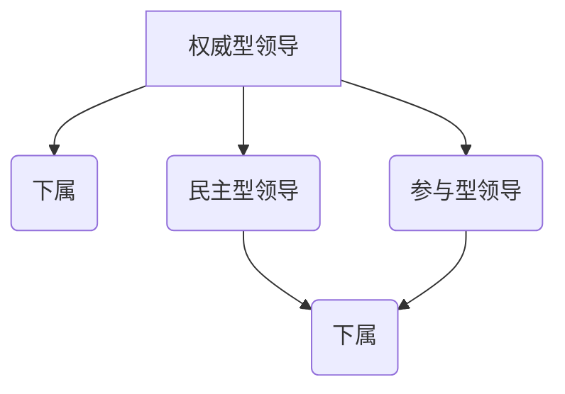

                 


为了确保文章的完整性和专业性，我们将采用以下步骤来构建《领导力与压力管理：保持冷静的艺术》的目录大纲：

### 第一步：分析核心内容
根据用户要求，我们需要涵盖以下核心内容：
1. 领导力基础理论
2. 压力管理与心理学原理
3. 领导力与压力管理实践
4. 团队建设与沟通
5. 领导力与个人成长
6. 领导力与组织文化
7. 领导力与可持续发展
8. 领导力与全球视野

### 第二步：构建1级目录
根据核心内容，构建1级目录：

```
# 《领导力与压力管理：保持冷静的艺术》

## 第1章：领导力基础理论
## 第2章：压力管理与心理学原理
## 第3章：领导力与压力管理实践
## 第4章：团队建设与沟通
## 第5章：领导力与个人成长
## 第6章：领导力与组织文化
## 第7章：领导力与可持续发展
## 第8章：领导力与全球视野
## 附录：领导力与压力管理资源与工具
```

### 第三步：细化2级目录
针对每个1级目录，细化2级目录：

```
## 第1章：领导力基础理论
### 1.1 领导力概念与类型
### 1.2 领导风格与行为理论
### 1.3 领导力的发展与实践

## 第2章：压力管理与心理学原理
### 2.1 压力的定义与来源
### 2.2 压力的生理与心理影响
### 2.3 压力管理的心理学理论

## 第3章：领导力与压力管理实践
### 3.1 领导者在压力环境下的角色
### 3.2 压力管理策略与技巧
### 3.3 领导力与压力管理的实践案例

## 第4章：团队建设与沟通
### 4.1 团队建设的原则与方法
### 4.2 沟通技巧与压力管理
### 4.3 团队合作与领导力提升

## 第5章：领导力与个人成长
### 5.1 领导力与自我认知
### 5.2 情绪管理与领导力
### 5.3 领导力与心理韧性

## 第6章：领导力与组织文化
### 6.1 组织文化的定义与作用
### 6.2 领导力与组织文化塑造
### 6.3 组织文化对压力管理的影响

## 第7章：领导力与可持续发展
### 7.1 领导力与可持续发展目标
### 7.2 压力管理与企业社会责任
### 7.3 领导力与可持续发展实践

## 第8章：领导力与全球视野
### 8.1 全球化背景下的领导力挑战
### 8.2 文化差异与领导力
### 8.3 领导力与全球合作

## 附录：领导力与压力管理资源与工具
### A.1 领导力相关书籍与文章推荐
### A.2 压力管理工具与应用
### A.3 领导力发展在线资源
```

### 第四步：细化3级目录
针对每个2级目录，细化3级目录：

```
## 第1章：领导力基础理论
### 1.1 领导力概念与类型
#### 1.1.1 领导力的定义
#### 1.1.2 领导力的类型
#### 1.1.3 领导力在不同文化中的表现

### 1.2 领导风格与行为理论
#### 1.2.1 领导风格的定义
#### 1.2.2 领导风格的理论模型
#### 1.2.3 领导风格对团队的影响

### 1.3 领导力的发展与实践
#### 1.3.1 领导力的培养与提升
#### 1.3.2 领导力在实践中面临的挑战
#### 1.3.3 领导力发展的案例分析

## 第2章：压力管理与心理学原理
### 2.1 压力的定义与来源
#### 2.1.1 压力的定义
#### 2.1.2 压力的来源
#### 2.1.3 压力的分类

### 2.2 压力的生理与心理影响
#### 2.2.1 压力的生理影响
#### 2.2.2 压力的心理影响
#### 2.2.3 压力对行为的影响

### 2.3 压力管理的心理学理论
#### 2.3.1 压力管理的概念
#### 2.3.2 压力管理的方法
#### 2.3.3 心理学理论在压力管理中的应用

## ...（后续章节的3级目录构建同理）
```

### 第五步：插入相关内容
在每个3级目录中，我们将插入相关的Mermaid流程图、伪代码和数学公式，以确保内容的丰富性和专业性。以下是一个示例：

```
## 第1章：领导力基础理论
### 1.1 领导力概念与类型
#### 1.1.1 领导力的定义
领导力是指一个人在组织中通过影响、激励和引导他人来实现共同目标的能力。

#### 1.1.2 领导力的类型


#### 1.1.3 领导力在不同文化中的表现
在不同文化背景下，领导力的表现形式和接受程度可能会有所不同。

## 第2章：压力管理与心理学原理
### 2.1 压力的定义与来源
#### 2.1.1 压力的定义
压力是指个体在面临挑战或需求时所感受到的心理和生理负担。

#### 2.1.2 压力的来源
压力的来源可以包括工作、家庭、社会等多个方面。

### 2.2 压力的生理与心理影响
#### 2.2.1 压力的生理影响
$$
压力水平与心率、血压、免疫力等生理指标之间存在显著相关性。
$$

#### 2.2.2 压力的心理影响
压力会导致情绪波动、焦虑、抑郁等心理问题。
```

### 第六步：检查完整性和字数限制
完成所有目录大纲的构建后，我们将检查其完整性和字数限制，并进行必要的调整。

### 第七步：格式化目录大纲
使用markdown格式对目录大纲进行格式化，确保格式规范，易于阅读。

至此，《领导力与压力管理：保持冷静的艺术》的目录大纲构建完成。接下来，我们将根据该大纲撰写详细的文章内容，以满足用户的要求。

