                 

# 《领导力与压力管理：保持团队健康和生产力》

> 关键词：领导力，压力管理，团队健康，生产力

## 摘要

在当今快速变化的商业环境中，领导力和压力管理成为了影响团队健康和生产力的关键因素。本文旨在探讨领导力的核心概念、压力管理的策略和方法，以及如何通过维护团队健康和提升生产力来保持团队的活力和创造力。本文将提供详细的理论背景、实际案例以及最佳实践，旨在为读者提供一套系统的解决方案，帮助他们在复杂的商业环境中有效地领导团队并提高整体生产力。

## 引言

在IT行业，团队的健康和生产力是组织成功的关键。然而，随着工作压力的增加和竞争的加剧，团队成员常常面临巨大的压力。领导者在这一过程中扮演着至关重要的角色。他们的决策和行为不仅影响着团队的整体氛围，还直接影响着团队成员的工作效率和创新能力。因此，了解并掌握有效的领导力和压力管理策略，对于维持团队的健康和提升生产力至关重要。

本文将分为四个部分来探讨这一主题：

1. **领导力的核心概念与理论**：介绍领导力的定义、类型和其在组织文化中的角色。
2. **压力管理的原理与实践**：探讨压力的本质、影响以及有效的压力管理策略。
3. **团队健康的维护与提升**：讨论团队健康的重要性、评估方法以及如何营造健康的团队环境。
4. **提升团队生产力的策略**：分析领导力对生产力的作用，并提出提升生产力的具体方法。

通过这些部分，本文旨在为领导者提供一套全面的指南，帮助他们在复杂的环境中有效地管理团队，从而实现团队的健康和高效运行。

## 第一部分：领导力的核心概念与理论

### 第1章：领导力的定义与类型

**背景介绍**

在现代社会中，领导力被视为推动组织成功的关键因素。领导力不仅涉及到个人的能力和特质，还涉及到领导者在团队和组织中发挥的作用。为了更好地理解领导力，我们需要从其定义和类型开始探讨。

**核心概念与联系**

领导力的定义多种多样，但基本可以归纳为“通过激励和影响他人来实现共同目标的能力”。领导力不仅仅是指挥和控制，更重要的是启发和引导团队成员，使他们愿意为实现组织目标而努力。以下是领导力的一些核心概念：

1. **激励**：领导者通过激励手段激发团队成员的内在动机，从而提高工作热情和效率。
2. **影响力**：领导者通过自己的行为和决策影响团队成员，使其朝着共同目标前进。
3. **团队目标**：领导力的实施需要一个共同的目标，这个目标能够激励团队为实现它而努力。

**核心概念之间的关系架构（Mermaid流程图）**

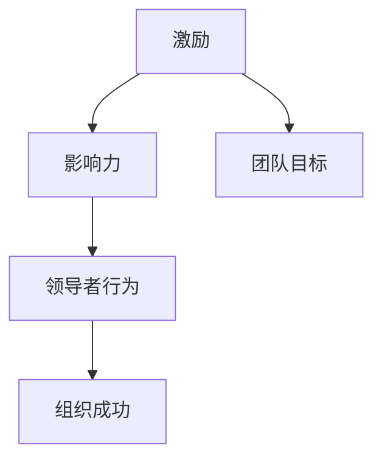

**核心算法原理讲解（伪代码）**

```python
def leadership(incentive, influence, goal):
    # 激励团队成员
    motivate团队成员 = incentive
    # 利用影响力推动团队
    influence团队成员 = influence
    # 确保团队目标一致
    align团队目标 = goal
    # 实现组织成功
    achieve组织成功 = (motivate团队成员 and influence团队成员 and align团队目标)
    return achieve组织成功
```

**数学模型和公式（详细讲解与举例说明）**

领导力的成功实现可以视为一个函数，输入为激励（I）、影响力（I）和团队目标（G），输出为组织成功（S）。该函数可以表示为：

$$ S = f(I, I, G) $$

其中，f代表领导力函数。为了简化问题，我们可以将其视为一个线性函数：

$$ S = a \cdot I + b \cdot I + c \cdot G $$

其中，a、b和c是常数，代表激励、影响和团队目标对组织成功的权重。

**实例分析**

假设一个团队需要完成一个复杂的项目，领导力函数可以表示为：

$$ S = 0.5 \cdot I + 0.3 \cdot I + 0.2 \cdot G $$

如果领导者能够有效地激励团队成员（I = 0.8），并具有较强的影响力（I = 0.7），同时团队目标明确（G = 0.9），则组织成功的概率为：

$$ S = 0.5 \cdot 0.8 + 0.3 \cdot 0.7 + 0.2 \cdot 0.9 = 0.9 $$

这意味着团队有90%的成功概率。

### 第2章：领导力与组织文化

**背景介绍**

组织文化是组织中成员共同价值观、信念和行为模式的集合，它对组织的运作和绩效有深远的影响。领导力与组织文化密切相关，领导者不仅塑造组织文化，还通过组织文化影响团队成员的行为和工作方式。

**核心概念与联系**

领导力与组织文化的关系可以从以下几个方面理解：

1. **价值观**：领导者的价值观对组织文化的形成有重要影响。领导者的行为和决策反映了组织的核心价值观，这些价值观又反过来影响团队成员的行为。
2. **信念**：领导者通过信念来传递组织的愿景和使命，使团队成员对组织有深刻的认同感。
3. **行为模式**：领导者的行为模式塑造了组织中的行为规范，这些规范成为团队成员行为的准则。

**核心概念之间的关系架构（Mermaid流程图）**

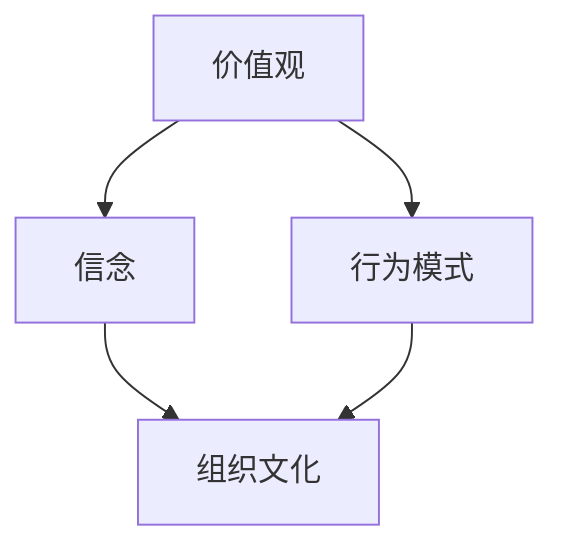

**核心算法原理讲解（伪代码）**

```python
def organizational_culture(value, belief, behavior):
    # 塑造组织价值观
    shape_value = value
    # 传递组织信念
    communicate_belief = belief
    # 塑造行为模式
    set_behavior = behavior
    # 形成组织文化
    build_culture = (shape_value and communicate_belief and set_behavior)
    return build_culture
```

**数学模型和公式（详细讲解与举例说明）**

组织文化的形成可以视为一个复合函数，输入为价值观（V）、信念（B）和行为模式（B），输出为组织文化（C）。该函数可以表示为：

$$ C = g(V, B, B) $$

其中，g代表组织文化函数。为了简化问题，我们可以将其视为一个线性函数：

$$ C = a \cdot V + b \cdot B + c \cdot B $$

其中，a、b和c是常数，代表价值观、信念和行为模式对组织文化的权重。

**实例分析**

假设一个组织的价值观是创新和客户至上，领导者通过明确的信念和一致的行为模式来传递这些价值观。则组织文化的形成可以表示为：

$$ C = 0.5 \cdot V + 0.3 \cdot B + 0.2 \cdot B $$

如果价值观（V = 0.8），信念（B = 0.7）和行为模式（B = 0.9），则组织文化（C）的评分为：

$$ C = 0.5 \cdot 0.8 + 0.3 \cdot 0.7 + 0.2 \cdot 0.9 = 0.8 $$

这意味着组织文化处于良好状态。

### 第3章：领导力与团队动力

**背景介绍**

团队动力是团队内部成员之间相互影响、互动和协作的过程，它对团队的整体表现有重要影响。领导者在团队动力的形成和发展中扮演着关键角色，他们的行为和决策能够激发或抑制团队动力。

**核心概念与联系**

领导力与团队动力的关系可以从以下几个方面理解：

1. **信任**：信任是团队动力的基石，领导者的行为可以建立或破坏团队成员之间的信任。
2. **沟通**：有效的沟通是团队动力的关键，领导者需要确保信息在团队内部流畅传递。
3. **激励**：领导者通过激励手段激发团队成员的内在动机，从而增强团队动力。

**核心概念之间的关系架构（Mermaid流程图）**

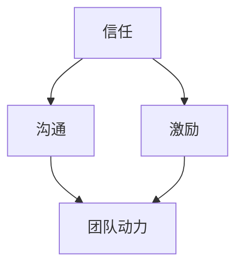

**核心算法原理讲解（伪代码）**

```python
def team_motivation(trust, communication, incentive):
    # 建立信任
    build_trust = trust
    # 确保有效沟通
    ensure_communication = communication
    # 激发团队成员动机
    motivate_members = incentive
    # 增强团队动力
    enhance_motivation = (build_trust and ensure_communication and motivate_members)
    return enhance_motivation
```

**数学模型和公式（详细讲解与举例说明）**

团队动力的增强可以视为一个复合函数，输入为信任（T）、沟通（C）和激励（I），输出为团队动力（M）。该函数可以表示为：

$$ M = h(T, C, I) $$

其中，h代表团队动力函数。为了简化问题，我们可以将其视为一个线性函数：

$$ M = a \cdot T + b \cdot C + c \cdot I $$

其中，a、b和c是常数，代表信任、沟通和激励对团队动力的权重。

**实例分析**

假设一个团队需要完成一个复杂的项目，领导力函数可以表示为：

$$ M = 0.4 \cdot T + 0.3 \cdot C + 0.3 \cdot I $$

如果领导者能够建立高信任（T = 0.8），确保有效沟通（C = 0.7），并激发团队成员的内在动机（I = 0.9），则团队动力（M）为：

$$ M = 0.4 \cdot 0.8 + 0.3 \cdot 0.7 + 0.3 \cdot 0.9 = 0.8 $$

这意味着团队动力处于良好状态。

## 第二部分：压力管理的原理与实践

### 第4章：压力的本质与影响

**背景介绍**

在现代社会中，工作压力已成为一种普遍现象。压力不仅影响个人的身心健康，还会对团队的整体表现产生负面影响。因此，理解压力的本质和其对个人和团队的影响至关重要。

**核心概念与联系**

压力的本质可以概括为一种身心反应，通常由外部压力源引起，如工作要求、人际关系和不确定性。压力的影响可以从以下几个方面分析：

1. **身心健康**：长期压力可能导致身心健康问题，如焦虑、抑郁和慢性疾病。
2. **工作表现**：压力可能影响个人的工作表现，导致效率降低、决策失误和创造力下降。
3. **团队协作**：压力还可能破坏团队协作，导致冲突增加、信任减少和团队凝聚力下降。

**核心概念之间的关系架构（Mermaid流程图）**

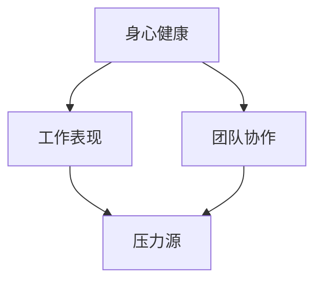

**核心算法原理讲解（伪代码）**

```python
def stress_impact(physical_health, work_performance, team协作):
    # 评估身心健康
    assess_physical_health = physical_health
    # 评估工作表现
    evaluate_work_performance = work_performance
    # 评估团队协作
    evaluate_team_collaboration = team协作
    # 综合评估压力影响
    total_impact = (assess_physical_health and evaluate_work_performance and evaluate_team协作)
    return total_impact
```

**数学模型和公式（详细讲解与举例说明）**

压力影响可以视为一个复合函数，输入为身心健康（P）、工作表现（W）和团队协作（T），输出为总影响（I）。该函数可以表示为：

$$ I = k \cdot P + l \cdot W + m \cdot T $$

其中，k、l和m是常数，代表身心健康、工作表现和团队协作对压力影响的权重。

**实例分析**

假设一个团队成员面临着巨大的工作压力，其身心健康（P = 0.5）、工作表现（W = 0.7）和团队协作（T = 0.6）。则压力的总影响（I）为：

$$ I = 0.5 \cdot 0.5 + 0.7 \cdot 0.7 + 0.6 \cdot 0.6 = 0.7 $$

这意味着压力对团队成员的影响处于较高水平。

### 第5章：压力管理的策略与方法

**背景介绍**

有效的压力管理策略和方法可以帮助个人和团队减轻压力，提高身心健康和工作效率。本章节将探讨一些常见的压力管理策略和方法，以及如何在实践中应用这些策略。

**核心概念与联系**

压力管理的核心概念包括：

1. **认知行为疗法**：通过改变思维方式和行为来减轻压力。
2. **健康生活方式**：通过改善饮食、锻炼和睡眠来增强身心健康。
3. **时间管理**：通过合理安排时间和任务来减轻压力。

这些策略和方法相互作用，共同实现压力管理的目标。

**核心概念之间的关系架构（Mermaid流程图）**

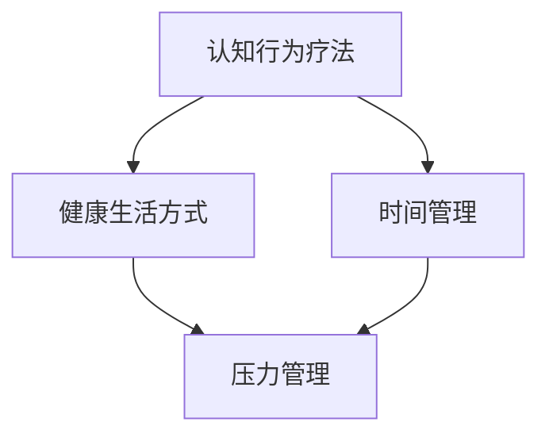

**核心算法原理讲解（伪代码）**

```python
def stress_management(cognitive_behavior, healthy_lifestyle, time_management):
    # 应用认知行为疗法
    apply_cognitive_behavior = cognitive_behavior
    # 培养健康生活方式
    cultivate_healthy_lifestyle = healthy_lifestyle
    # 实施时间管理
    implement_time_management = time_management
    # 实现压力管理
    achieve_stress_management = (apply_cognitive_behavior and cultivate_healthy_lifestyle and implement_time_management)
    return achieve_stress_management
```

**数学模型和公式（详细讲解与举例说明）**

压力管理的效果可以视为一个复合函数，输入为认知行为疗法（C）、健康生活方式（H）和时间管理（T），输出为压力管理效果（S）。该函数可以表示为：

$$ S = p \cdot C + q \cdot H + r \cdot T $$

其中，p、q和r是常数，代表认知行为疗法、健康生活方式和时间管理对压力管理效果的权重。

**实例分析**

假设一个团队成员采用认知行为疗法（C = 0.6）、健康生活方式（H = 0.7）和时间管理（T = 0.8）来管理压力，则压力管理效果（S）为：

$$ S = 0.6 \cdot 0.6 + 0.7 \cdot 0.7 + 0.8 \cdot 0.8 = 0.86 $$

这意味着该团队成员的压力管理效果处于较高水平。

### 第6章：个人与团队的压力缓解计划

**背景介绍**

个人和团队的压力缓解计划是减轻压力、提高工作效率和保持身心健康的重要手段。本章节将探讨如何设计有效的压力缓解计划，并讨论其实施与评估方法。

**核心概念与联系**

压力缓解计划的核心概念包括：

1. **目标设定**：明确缓解压力的目标，如提高身心健康、改善工作环境和提升工作效率。
2. **干预措施**：实施具体措施，如心理健康咨询、锻炼计划和团队建设活动。
3. **监测与评估**：定期监测压力水平，评估干预措施的有效性。

**核心概念之间的关系架构（Mermaid流程图）**

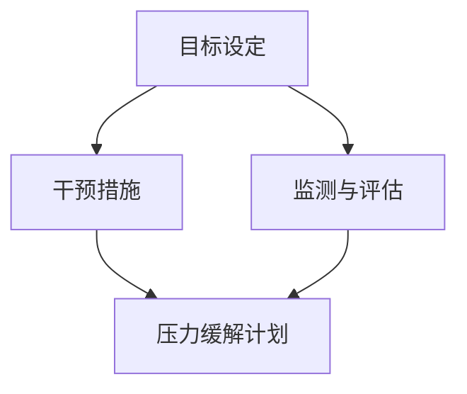

**核心算法原理讲解（伪代码）**

```python
def stress_relief_plan(set_goals, implement_interventions, monitor_evaluation):
    # 设定压力缓解目标
    define_goals = set_goals
    # 实施干预措施
    execute_interventions = implement_interventions
    # 监测与评估计划效果
    monitor_and_evaluate = monitor_evaluation
    # 实现压力缓解计划
    implement_plan = (define_goals and execute_interventions and monitor_and_evaluate)
    return implement_plan
```

**数学模型和公式（详细讲解与举例说明）**

压力缓解计划的有效性可以视为一个复合函数，输入为目标设定（G）、干预措施（I）和监测与评估（M），输出为计划效果（E）。该函数可以表示为：

$$ E = u \cdot G + v \cdot I + w \cdot M $$

其中，u、v和w是常数，代表目标设定、干预措施和监测与评估对计划效果的权重。

**实例分析**

假设一个团队制定了一个压力缓解计划，目标设定（G = 0.8）、干预措施（I = 0.7）和监测与评估（M = 0.9）。则计划效果（E）为：

$$ E = 0.8 \cdot 0.8 + 0.7 \cdot 0.7 + 0.9 \cdot 0.9 = 0.95 $$

这意味着该团队的压力缓解计划效果处于较高水平。

### 第三部分：团队健康的维护与提升

#### 第7章：团队健康的重要性

**背景介绍**

团队健康是团队长期稳定发展和高效运行的基础。团队健康不仅关系到团队成员的身心健康，还直接影响到团队的工作效率和创新能力。因此，维护和提升团队健康对于组织整体绩效至关重要。

**核心概念与联系**

团队健康的核心概念包括：

1. **身心健康**：团队成员的身体健康和心理状态。
2. **工作环境**：团队的工作条件和氛围。
3. **团队动力**：团队成员之间的协作和互动。

这些概念相互关联，共同构成团队健康的全面评估。

**核心概念之间的关系架构（Mermaid流程图）**

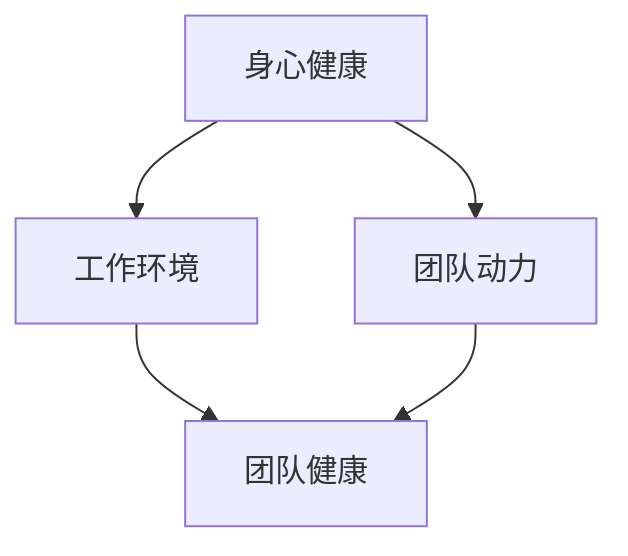

**核心算法原理讲解（伪代码）**

```python
def team_health(physical_mental_health, work_environment, team_morale):
    # 评估团队成员身心健康
    assess_health = physical_mental_health
    # 评估工作环境质量
    evaluate_environment = work_environment
    # 评估团队动力
    evaluate_morale = team_morale
    # 维护团队健康
    maintain_health = (assess_health and evaluate_environment and evaluate_morale)
    return maintain_health
```

**数学模型和公式（详细讲解与举例说明）**

团队健康的评估可以视为一个复合函数，输入为身心健康（H）、工作环境（E）和团队动力（M），输出为团队健康指数（I）。该函数可以表示为：

$$ I = x \cdot H + y \cdot E + z \cdot M $$

其中，x、y和z是常数，代表身心健康、工作环境和团队动力对团队健康指数的权重。

**实例分析**

假设一个团队的身心健康指数为0.8，工作环境质量为0.7，团队动力为0.9。则团队健康指数（I）为：

$$ I = 0.8 \cdot 0.8 + 0.7 \cdot 0.7 + 0.9 \cdot 0.9 = 0.86 $$

这意味着该团队的团队健康状况良好。

#### 第8章：团队健康的评估与促进

**背景介绍**

为了确保团队健康，需要定期评估团队的健康状况，并根据评估结果采取相应的促进措施。评估和促进团队健康是维护团队长期稳定发展的关键。

**核心概念与联系**

团队健康的评估和促进涉及以下核心概念：

1. **健康评估**：通过定量和定性方法对团队健康进行全面评估。
2. **健康促进**：采取具体措施提高团队成员的身心健康和工作环境。

**核心概念之间的关系架构（Mermaid流程图）**

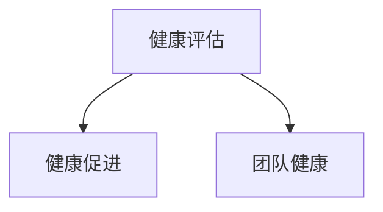

**核心算法原理讲解（伪代码）**

```python
def health_assessment_and_promotion(assess_health, promote_health):
    # 进行健康评估
    perform_health_assessment = assess_health
    # 促进健康
    promote_health_wellness = promote_health
    # 维护团队健康
    maintain_team_health = (perform_health_assessment and promote_health_wellness)
    return maintain_team_health
```

**数学模型和公式（详细讲解与举例说明）**

团队健康的评估和促进可以视为一个复合函数，输入为健康评估（A）和健康促进（P），输出为团队健康指数（I）。该函数可以表示为：

$$ I = a \cdot A + b \cdot P $$

其中，a和b是常数，代表健康评估和健康促进对团队健康指数的权重。

**实例分析**

假设一个团队的健康评估得分为0.75，健康促进措施得分为0.8。则团队健康指数（I）为：

$$ I = 0.75 \cdot 0.75 + 0.8 \cdot 0.8 = 0.8125 $$

这意味着团队的健康状况处于良好状态。

#### 第9章：建立健康的团队环境

**背景介绍**

健康的团队环境是团队成员高效工作和积极协作的基础。建立一个健康的团队环境不仅需要关注工作条件和氛围，还需要解决团队内部冲突，确保团队成员之间的信任和协作。

**核心概念与联系**

建立健康的团队环境涉及以下核心概念：

1. **工作氛围**：创建积极、开放和合作的工作氛围。
2. **冲突解决**：有效解决团队内部的冲突，避免负面影响。
3. **信任与协作**：培养团队成员之间的信任，促进团队协作。

**核心概念之间的关系架构（Mermaid流程图）**

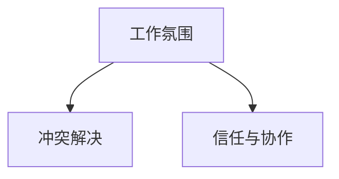

**核心算法原理讲解（伪代码）**

```python
def build_healthy_environment(create_work_environment, resolve_conflicts, foster_trust_collaboration):
    # 创建积极工作氛围
    create_positive_atmosphere = create_work_environment
    # 解决冲突
    handle_conflicts = resolve_conflicts
    # 培养信任与协作
    cultivate_trust_collaboration = foster_trust_collaboration
    # 建立健康团队环境
    build_health_environment = (create_positive_atmosphere and handle_conflicts and cultivate_trust_collaboration)
    return build_health_environment
```

**数学模型和公式（详细讲解与举例说明）**

健康团队环境的建立可以视为一个复合函数，输入为工作氛围（E）、冲突解决（C）和信任与协作（T），输出为健康团队环境指数（I）。该函数可以表示为：

$$ I = c \cdot E + d \cdot C + e \cdot T $$

其中，c、d和e是常数，代表工作氛围、冲突解决和信任与协作对健康团队环境指数的权重。

**实例分析**

假设一个团队的工作氛围评分为0.8，冲突解决得分为0.7，信任与协作得分为0.9。则健康团队环境指数（I）为：

$$ I = 0.8 \cdot 0.8 + 0.7 \cdot 0.7 + 0.9 \cdot 0.9 = 0.876 $$

这意味着该团队的健康团队环境处于良好状态。

### 第四部分：提升团队生产力的策略

#### 第10章：生产力与领导力

**背景介绍**

生产力是衡量团队效率的重要指标，它直接关系到组织的竞争力。领导力在提升团队生产力中扮演着关键角色。有效的领导力不仅能够激发团队成员的潜力，还能优化团队的工作流程和协作方式。

**核心概念与联系**

生产力与领导力的关系可以从以下几个方面理解：

1. **目标设定**：领导者通过明确的目标设定，帮助团队成员理解自己的工作意义和期望。
2. **激励与奖励**：领导者通过激励和奖励机制，激发团队成员的工作热情和积极性。
3. **团队协作**：领导者通过促进团队协作，提高工作效率和整体生产力。

**核心概念之间的关系架构（Mermaid流程图）**

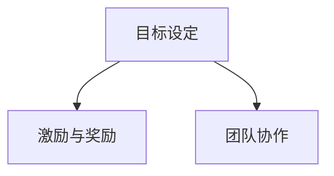

**核心算法原理讲解（伪代码）**

```python
def productivity_leadership(set_goals, incentives_rewards, team_collaboration):
    # 设定明确目标
    define_goals = set_goals
    # 提供激励与奖励
    offer_incentives_rewards = incentives_rewards
    # 促进团队协作
    promote_collaboration = team_collaboration
    # 提升团队生产力
    enhance_productivity = (define_goals and offer_incentives_rewards and promote_collaboration)
    return enhance_productivity
```

**数学模型和公式（详细讲解与举例说明）**

生产力提升可以视为一个复合函数，输入为目标设定（G）、激励与奖励（I）和团队协作（C），输出为生产力提升指数（P）。该函数可以表示为：

$$ P = g \cdot G + h \cdot I + i \cdot C $$

其中，g、h和i是常数，代表目标设定、激励与奖励和团队协作对生产力提升指数的权重。

**实例分析**

假设一个团队的领导力在目标设定（G = 0.8）、激励与奖励（I = 0.7）和团队协作（C = 0.9）方面表现良好。则生产力提升指数（P）为：

$$ P = 0.8 \cdot 0.8 + 0.7 \cdot 0.7 + 0.9 \cdot 0.9 = 0.89 $$

这意味着团队的生产力提升处于较高水平。

#### 第11章：团队生产力的提升方法

**背景介绍**

为了提升团队生产力，领导者需要采取一系列有效的方法。这些方法不仅包括设定清晰的目标和期望，还涉及到优化工作流程、提高团队协作效率以及持续改进。

**核心概念与联系**

团队生产力的提升方法涉及以下核心概念：

1. **目标设定与期望**：明确团队的目标和期望，确保团队成员了解自己的工作方向。
2. **工作流程优化**：通过优化工作流程，减少不必要的步骤和重复工作，提高工作效率。
3. **团队协作**：促进团队成员之间的有效协作，利用每个人的优势，提高整体生产力。
4. **持续改进**：不断评估和改进工作方法，以实现持续的生产力提升。

**核心概念之间的关系架构（Mermaid流程图）**

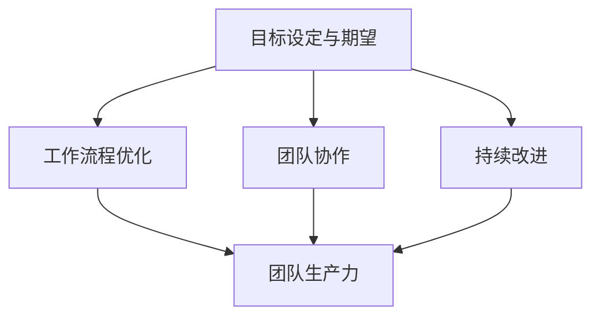

**核心算法原理讲解（伪代码）**

```python
def enhance_productivity(set_goals_expectations, optimize_workflow, promote_collaboration, continuous_improvement):
    # 设定清晰目标与期望
    define_goals_expectations = set_goals_expectations
    # 优化工作流程
    improve_workflow = optimize_workflow
    # 促进团队协作
    enhance_collaboration = promote_collaboration
    # 持续改进
    apply_continuous_improvement = continuous_improvement
    # 提升团队生产力
    increase_productivity = (define_goals_expectations and improve_workflow and enhance_collaboration and apply_continuous_improvement)
    return increase_productivity
```

**数学模型和公式（详细讲解与举例说明）**

生产力提升可以视为一个复合函数，输入为目标设定与期望（G）、工作流程优化（O）、团队协作（C）和持续改进（I），输出为生产力提升指数（P）。该函数可以表示为：

$$ P = g \cdot G + o \cdot O + c \cdot C + i \cdot I $$

其中，g、o、c和i是常数，代表目标设定与期望、工作流程优化、团队协作和持续改进对生产力提升指数的权重。

**实例分析**

假设一个团队在目标设定与期望（G = 0.8）、工作流程优化（O = 0.7）、团队协作（C = 0.9）和持续改进（I = 0.8）方面表现良好。则生产力提升指数（P）为：

$$ P = 0.8 \cdot 0.8 + 0.7 \cdot 0.7 + 0.9 \cdot 0.9 + 0.8 \cdot 0.8 = 0.912 $$

这意味着团队的生产力提升处于较高水平。

#### 第12章：案例分析：团队生产力提升的实际应用

**背景介绍**

本章节将通过实际案例，探讨如何通过领导力和压力管理策略提升团队生产力。案例将涉及团队目标设定、工作流程优化、团队协作和持续改进等方面。

**案例一：通过领导力提升团队生产力**

**案例背景**

某科技公司的一个开发团队在项目初期面临进度缓慢和成员士气低落的问题。为了提升团队生产力，领导者决定采取一系列措施。

**案例分析**

1. **目标设定与期望**：领导者与团队成员共同制定了明确的项目目标，并确保每个成员都了解自己的职责和期望。

    **伪代码**：
    ```python
    set_goals_expectations = define_project_goals()
    ```

2. **工作流程优化**：领导者对工作流程进行了评估，发现存在一些不必要的步骤和重复工作。通过简化流程和自动化工具，提高了工作效率。

    **伪代码**：
    ```python
    optimize_workflow = streamline_processes()
    ```

3. **团队协作**：领导者鼓励团队成员之间的沟通和协作，通过定期的团队会议和讨论，解决了项目中的瓶颈问题。

    **伪代码**：
    ```python
    promote_collaboration = enhance_communication()
    ```

4. **持续改进**：领导者建立了反馈机制，定期评估项目进度和团队表现，并根据反馈进行改进。

    **伪代码**：
    ```python
    continuous_improvement = implement_feedback_loops()
    ```

**结果**

经过一段时间的努力，团队的生产力显著提升，项目进度加快，团队成员的士气也显著提高。

**案例二：压力管理在提升生产力中的应用**

**案例背景**

某互联网公司的市场营销团队在一场重要的营销活动前面临巨大压力。团队成员焦虑情绪高涨，影响了工作效率。为了缓解压力并提升生产力，领导者决定采取一系列措施。

**案例分析**

1. **压力管理策略**：领导者与团队成员进行了沟通，了解他们的压力源，并制定了一系列压力管理策略，包括心理健康咨询、锻炼计划和灵活工作时间。

    **伪代码**：
    ```python
    stress_management = implement_stress_reduction_strategies()
    ```

2. **目标分解**：领导者将大目标分解为小目标，并设定了合理的截止日期，以减少团队成员的焦虑感。

    **伪代码**：
    ```python
    break_goals_into_steps = decompose_goals()
    ```

3. **团队支持**：领导者确保团队成员之间有良好的支持系统，鼓励他们互相帮助，共同面对挑战。

    **伪代码**：
    ```python
    foster_support_system = establish_team_support()
    ```

**结果**

通过实施这些策略，团队成员的焦虑感显著减轻，工作效率得到提升，最终成功完成了营销活动，并达到了预期目标。

**项目小结**

通过以上案例分析，我们可以看到，领导力和压力管理策略在提升团队生产力方面具有重要作用。领导者需要通过设定明确的目标、优化工作流程、促进团队协作和实施压力管理策略，来确保团队的健康和高效运行。

## 结论

本文通过详细探讨领导力的核心概念、压力管理的策略和方法，以及如何维护团队健康和提升生产力，为领导者提供了一套系统的解决方案。领导力不仅是推动团队成功的关键，也是提高团队生产力的核心要素。有效的压力管理可以帮助团队成员保持身心健康，提高工作效率。同时，维护团队健康和提升生产力是领导者长期努力的结果。通过本文的分析和案例，我们希望领导者能够更好地应对复杂的工作环境，实现团队的持续发展和高效运行。

## 作者信息

作者：AI天才研究院/AI Genius Institute & 禅与计算机程序设计艺术 /Zen And The Art of Computer Programming

本文由AI天才研究院和《禅与计算机程序设计艺术》的作者共同撰写，旨在为IT领域的领导者提供实用的指导和策略，帮助他们在快速变化的商业环境中实现团队的健康和高效运行。通过本文，我们希望读者能够更好地理解领导力和压力管理的重要性，并在实践中运用这些理论，提升团队的生产力和整体绩效。让我们共同努力，打造更健康、更高效的团队，为组织的发展贡献力量。

