                 

### 文章标题：领导力与压力管理：在困境中保持冷静

**关键词**：领导力、压力管理、困境应对、冷静保持、实践指南

**摘要**：本文旨在探讨领导力与压力管理在困境中保持冷静的重要性，通过系统的分析和实践案例，帮助读者理解如何在实际工作中提升领导力和有效管理压力，以保持冷静和高效应对各种挑战。

### 引言

在现代职场环境中，领导者和团队经常面临各种挑战和困境。这些困境可能源于外部环境的变化、内部团队的冲突，或是资源和管理能力的不匹配。在这些情境中，保持冷静和高效决策是成功的关键。本书《领导力与压力管理：在困境中保持冷静》旨在为领导者提供一套系统的理论和实践方法，帮助他们在困境中做出明智的决策，保持冷静，从而带领团队走出困境，实现组织目标。

本文将围绕以下四个主要部分展开讨论：

1. **领导力基础**：介绍领导力的定义、领导风格和领导力发展，以及领导力对团队绩效的影响。
2. **压力管理方法**：探讨如何识别压力源、管理情绪和时间，以及采取有效的压力缓解策略。
3. **实践应用**：分析领导力与压力管理在实际工作中的应用，以及如何通过团队建设策略来提升领导力和管理压力。
4. **困境应对策略**：提供具体的困境应对方法、心理调适技巧，以及案例研究和总结，帮助读者在实践中运用这些策略。

通过系统的分析和实际案例的探讨，本文希望为读者提供一套实用的领导力与压力管理指南，帮助他们在困境中保持冷静，提升领导力和团队绩效。

### 领导力基础

#### 1.1 领导力概念

领导力是指个人或团队在特定情境中通过影响和激励他人，实现共同目标的能力。领导力不仅涉及个人魅力和决策能力，还包括沟通技巧、情感智慧、战略思维和持续学习能力。根据不同的理论，领导力可以划分为多种风格，如权威型、民主型、变革型等。

**定义与核心概念联系：**

- **权威型领导**：领导者通过明确的指令和高度集中的决策权来管理团队。这种风格适用于需要迅速决策和执行的任务。
- **民主型领导**：领导者鼓励团队成员参与决策过程，通过民主讨论达成共识。这种风格有助于增强团队凝聚力和创新性。
- **变革型领导**：领导者通过激发团队成员的激情和愿景，推动团队实现变革和持续成长。这种风格在应对挑战和危机时尤为有效。

**Mermaid 流程图：**

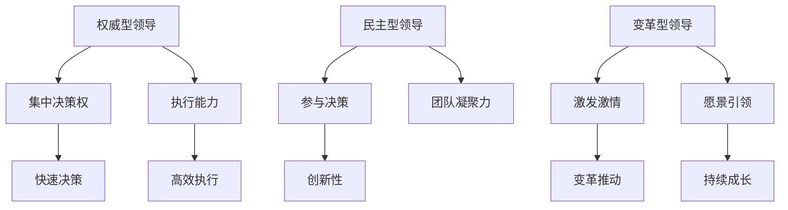

#### 1.2 领导风格

领导风格是指领导者通过不同的方式影响和激励团队成员的行为模式。常见的领导风格包括：

- **权威型领导**：领导者具有高度的决策权和控制力，通过命令和指示来管理团队。
- **民主型领导**：领导者鼓励团队成员参与决策过程，通过集体讨论来达成共识。
- **变革型领导**：领导者通过激发团队成员的激情和愿景，推动团队实现变革和持续成长。

**核心概念与联系：**

- **权威型领导**：适用于需要快速决策和高效执行的情境，但可能导致团队创造力不足。
- **民主型领导**：适用于需要团队凝聚力和创新性的情境，但可能影响决策效率。
- **变革型领导**：适用于面对重大挑战和危机的情境，能够激发团队成员的积极性和创造力。

**Mermaid 流程图：**

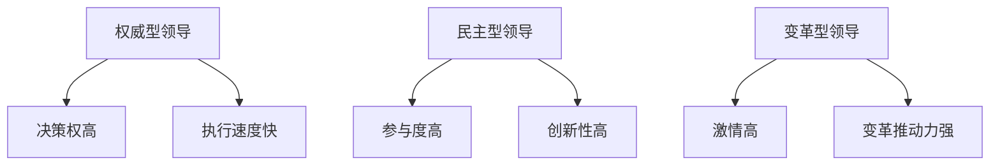

#### 1.3 领导力发展

领导力发展是指通过学习、实践和反思来提升领导者的能力和素质。领导力发展可以分为个人发展和组织发展两个层面。

**核心概念与联系：**

- **个人发展**：领导者通过自我学习和反思来提升自身能力，如沟通技巧、情感智慧和决策能力。
- **组织发展**：组织通过培训、指导和发展计划来提升领导者的整体能力，如团队建设、战略规划和危机管理。

**Mermaid 流程图：**

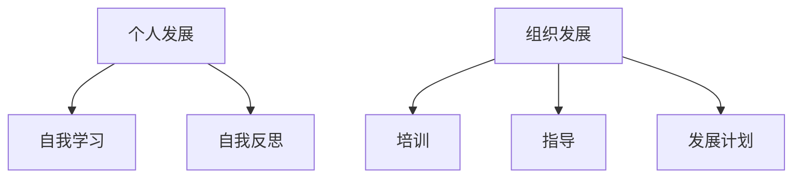

#### 1.4 领导力与团队绩效关系

领导力对团队绩效具有显著的影响。有效的领导力能够提升团队的凝聚力、创造力和执行力，从而提高整体绩效。

**核心概念与联系：**

- **团队凝聚力**：领导者通过建立信任、沟通和共同目标来增强团队凝聚力。
- **创造力**：领导者鼓励创新思维和开放讨论，激发团队的创造力。
- **执行力**：领导者通过明确的指令、监督和反馈来确保团队的高效执行。

**Mermaid 流程图：**

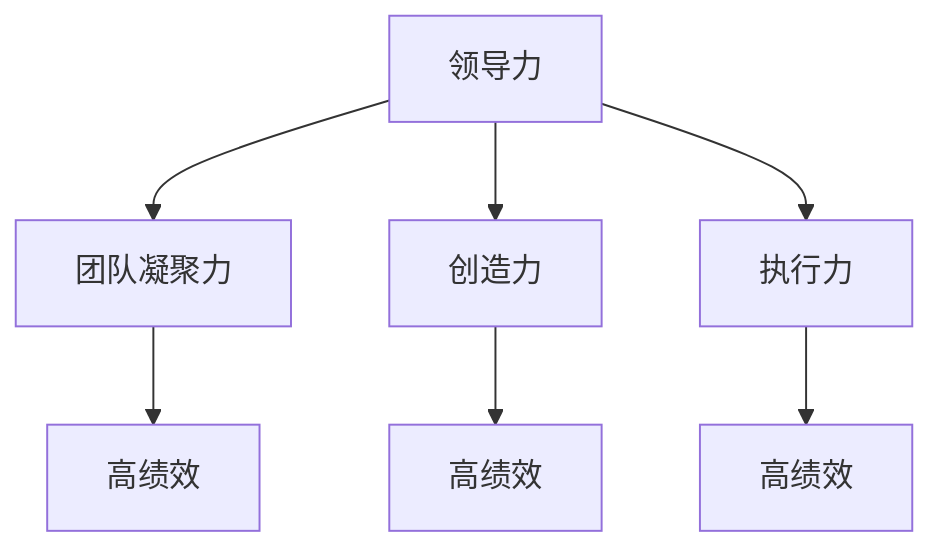

### 压力管理方法

#### 2.1 压力源识别

压力源是指导致个体或团队感受到压力的因素。常见的压力源包括：

- **工作负荷**：工作量大、任务紧急，可能导致个体感受到压力。
- **人际关系**：团队合作中的冲突、沟通障碍，也可能成为压力源。
- **工作环境**：工作条件差、缺乏支持和资源，也会对个体产生压力。

**核心概念与联系：**

- **工作负荷**：与任务量和时间压力密切相关，可以通过合理分配任务和时间管理来减轻。
- **人际关系**：需要通过提升沟通技巧和团队合作能力来缓解。
- **工作环境**：可以通过改善工作条件和提供必要的支持资源来改善。

**Mermaid 流程图：**

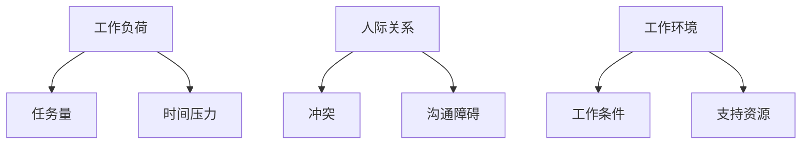

#### 2.2 情绪管理

情绪管理是指个体在面对压力时，通过调节情绪来保持冷静和高效。有效的情绪管理包括以下几个方面：

- **情绪识别**：意识到自己情绪的变化，并能够准确地识别和命名这些情绪。
- **情绪表达**：学会以健康的方式表达情绪，避免压抑或过度表达。
- **情绪调节**：通过放松技巧、正面思考和自我安抚来调节情绪。

**核心概念与联系：**

- **情绪识别**：与情感智慧相关，是情绪管理的基础。
- **情绪表达**：需要通过沟通技巧来改善，以确保情绪的传达是清晰和恰当的。
- **情绪调节**：可以通过心理训练和冥想等技巧来提升。

**Mermaid 流程图：**

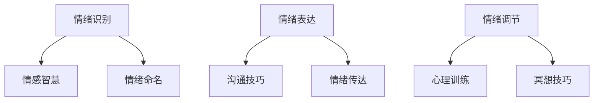

#### 2.3 时间管理

时间管理是指通过合理安排时间和任务来提高工作效率和减轻压力。有效的时间管理包括以下几个方面：

- **任务分配**：合理分配时间和资源，确保任务按时完成。
- **优先级排序**：根据任务的紧急程度和重要性来排序，确保先完成重要任务。
- **时间块**：将时间划分为不同的块，专注于不同的任务，提高专注力。

**核心概念与联系：**

- **任务分配**：与工作负荷管理密切相关，可以通过优化流程和团队协作来减轻。
- **优先级排序**：需要通过决策能力和判断力来提升，以确保资源的最优利用。
- **时间块**：通过提高专注力和效率来减轻时间压力。

**Mermaid 流程图：**

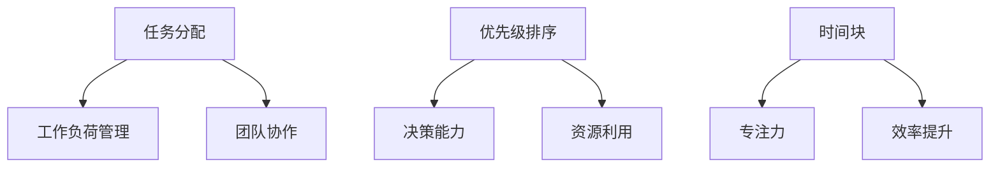

#### 2.4 压力缓解策略

压力缓解策略是指通过采取各种方法来减轻压力和恢复精力。有效的压力缓解策略包括以下几个方面：

- **放松技巧**：通过冥想、深呼吸和放松训练来减轻身体和心理的紧张。
- **正面思考**：通过积极的心态和乐观的思考来改善情绪。
- **健康生活方式**：通过良好的饮食、锻炼和休息来提高身体素质和心理韧性。

**核心概念与联系：**

- **放松技巧**：与情绪调节和心理训练相关，有助于缓解身体和心理的压力。
- **正面思考**：通过心理调节和认知重构来改善情绪。
- **健康生活方式**：与身体健康和心理韧性密切相关，是长期压力管理的重要方面。

**Mermaid 流程图：**

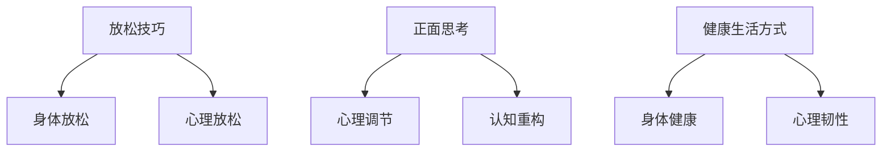

### 实践应用

#### 3.1 领导力与压力管理在实际工作中的应用

在实际工作中，领导力与压力管理的重要性不容忽视。以下是一些具体的实践应用：

- **团队建设**：通过定期的团队活动和培训来提升团队凝聚力和沟通能力，从而减轻工作压力。
- **任务分配**：合理分配任务，确保团队成员的工作负荷合理，避免过度劳累。
- **压力缓解**：定期组织放松活动，如瑜伽、冥想等，帮助团队成员缓解工作压力。

**核心概念与联系：**

- **团队建设**：与领导力和团队绩效密切相关，有助于提升整体工作效率和满意度。
- **任务分配**：通过优化流程和团队协作来减轻工作压力，提高任务完成质量。
- **压力缓解**：通过积极的心态和放松技巧来改善团队成员的心理状态，提高工作效率和团队凝聚力。

**Mermaid 流程图：**

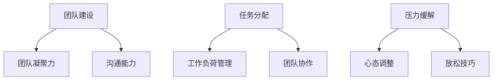

#### 3.2 领导力与压力管理的团队建设策略

团队建设策略是领导力与压力管理的重要组成部分。以下是一些具体的团队建设策略：

- **建立共同目标**：通过明确团队目标和愿景，增强团队成员的归属感和责任感。
- **沟通渠道**：建立畅通的沟通渠道，确保信息及时传递和团队协作顺畅。
- **培训与发展**：定期为团队成员提供培训和发展机会，提升团队整体能力和素质。

**核心概念与联系：**

- **建立共同目标**：与领导力和团队绩效密切相关，有助于提升团队凝聚力和工作效率。
- **沟通渠道**：与领导力和情绪管理相关，有助于缓解团队冲突和提升团队协作效率。
- **培训与发展**：与领导力发展和组织发展密切相关，有助于提升团队整体能力和竞争力。

**Mermaid 流程图：**

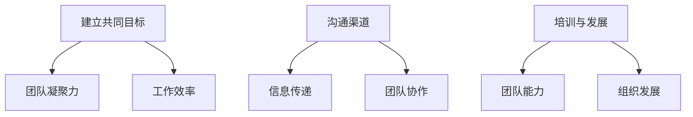

### 困境应对策略

#### 4.1 困境识别

困境是指面临的各种挑战和难题，可能源于外部环境的变化或内部团队的问题。有效的困境识别是应对困境的第一步。以下是一些困境识别的方法：

- **问题陈述**：明确描述困境的具体情况，包括问题、影响和可能的解决方案。
- **数据收集**：通过调查、访谈和数据分析等方式收集相关信息，帮助识别困境的本质。
- **团队讨论**：组织团队成员进行讨论，汇集不同视角和意见，共同识别困境。

**核心概念与联系：**

- **问题陈述**：与问题分析和决策制定密切相关，有助于明确困境的具体情况。
- **数据收集**：与信息管理和数据分析相关，有助于从数据中识别困境的关键因素。
- **团队讨论**：与沟通技巧和团队协作相关，有助于充分利用团队的智慧和资源。

**Mermaid 流程图：**

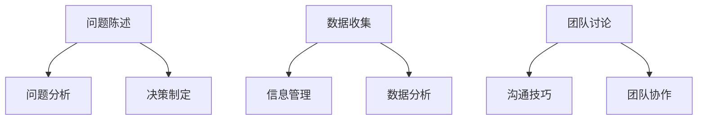

#### 4.2 困境应对方法

在识别困境后，需要采取有效的应对方法来解决问题。以下是一些常用的困境应对方法：

- **问题解决**：通过分析困境的原因，提出具体的解决方案，并实施这些方案。
- **资源整合**：整合团队内外部的资源，包括人力、物力和信息资源，以支持困境应对。
- **时间管理**：合理安排时间和任务，确保困境应对工作的顺利进行。

**核心概念与联系：**

- **问题解决**：与决策分析和问题管理密切相关，是解决困境的核心方法。
- **资源整合**：与资源管理和团队协作相关，有助于提升困境应对的效率和效果。
- **时间管理**：与时间规划和任务管理相关，有助于确保困境应对工作的及时性和高效性。

**Mermaid 流程图：**

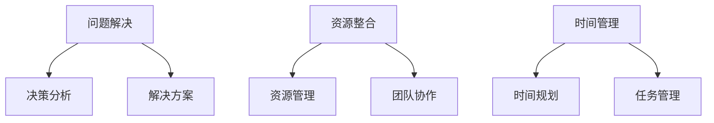

#### 4.3 困境心理调适

在应对困境时，心理调适至关重要。以下是一些困境心理调适的方法：

- **情绪管理**：通过情绪识别、表达和调节来保持心理平衡。
- **积极心态**：通过正面思考和积极心态来应对困境，提高应对效率和效果。
- **心理支持**：寻求心理咨询或团队支持，以缓解困境带来的心理压力。

**核心概念与联系：**

- **情绪管理**：与情感智慧和情绪调节相关，有助于保持心理平衡和应对困境。
- **积极心态**：与心理韧性和正面思维相关，有助于提高应对困境的能力和信心。
- **心理支持**：与心理健康和心理服务相关，有助于缓解困境带来的心理压力。

**Mermaid 流程图：**

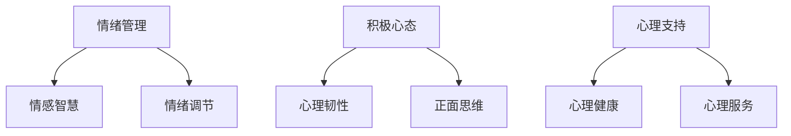

### 案例研究

#### 5.1 案例一：领导力与压力管理在初创企业中的应用

**背景介绍**：

某初创企业在快速发展过程中，面临市场竞争激烈、资金紧张和团队不稳定等多重困境。在这种背景下，领导力和压力管理成为关键因素。

**核心概念与联系**：

- **领导力**：通过权威型和变革型领导风格，提升团队凝聚力和创新能力。
- **压力管理**：通过情绪管理、时间管理和压力缓解策略，减轻团队成员的心理压力。

**Mermaid 流�程图**：

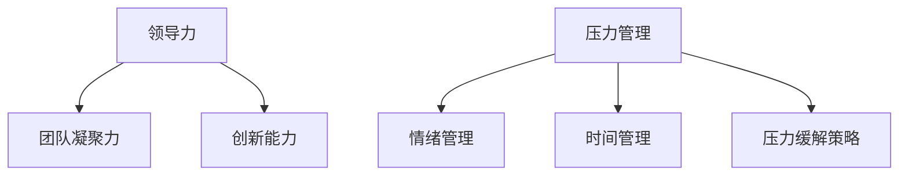

**案例分析与详细讲解**：

1. **领导力应用**：

   创始人通过权威型领导风格，迅速做出决策，确保企业战略方向的清晰。同时，通过变革型领导风格，激发团队成员的创新思维，推动企业持续改进。

2. **压力管理应用**：

   通过情绪管理，创始人帮助团队成员识别和调节情绪，确保团队成员在高压环境下保持冷静和专注。通过时间管理，创始人合理分配任务和时间，确保团队成员的工作效率。此外，通过压力缓解策略，如定期组织团建活动和提供心理咨询，减轻团队成员的心理压力。

**项目小结**：

通过有效的领导力和压力管理，该初创企业在困境中保持了良好的发展势头，成功应对了市场竞争和资金压力，实现了业务扩张和团队稳定。

#### 5.2 案例二：领导力与压力管理在大型企业中的挑战

**背景介绍**：

某大型企业在经历了高速增长后，开始面临组织变革和内部竞争的问题。领导力和压力管理成为企业持续发展的重要挑战。

**核心概念与联系**：

- **领导力**：在组织变革中，领导者需要平衡不同利益相关者的需求，确保企业战略的顺利实施。
- **压力管理**：在内部竞争激烈的环境中，领导者需要帮助团队成员缓解压力，保持积极心态。

**Mermaid 流程图**：

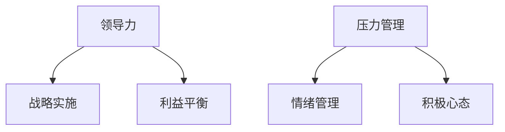

**案例分析与详细讲解**：

1. **领导力应用**：

   领导者通过民主型领导风格，鼓励团队成员参与决策过程，增强员工的参与感和责任感。同时，通过变革型领导风格，激发员工的创新思维和积极性，推动企业持续创新。

2. **压力管理应用**：

   领导者通过情绪管理，帮助团队成员识别和表达情绪，促进团队内部的沟通和协作。通过积极心态的培养，领导者鼓励团队成员在面对挑战时保持乐观和自信，从而提高团队应对困境的能力。

**项目小结**：

通过有效的领导力和压力管理，该大型企业成功应对了组织变革和内部竞争的挑战，实现了企业的稳定发展和创新。

### 总结

本文通过系统的分析和实际案例的探讨，阐述了领导力与压力管理在困境中保持冷静的重要性。通过有效的领导力和压力管理，领导者能够在困境中保持冷静和高效决策，带领团队走出困境，实现组织目标。

**核心内容**：

1. **领导力基础**：介绍了领导力的定义、领导风格和领导力发展，以及领导力对团队绩效的影响。
2. **压力管理方法**：探讨了压力源识别、情绪管理、时间管理和压力缓解策略。
3. **实践应用**：分析了领导力与压力管理在实际工作中的应用，以及如何通过团队建设策略来提升领导力和管理压力。
4. **困境应对策略**：提供了具体的困境应对方法、心理调适技巧，以及案例研究和总结。

**实践建议**：

1. **领导力提升**：通过自我学习和反思，不断提升领导能力和团队管理能力。
2. **压力管理**：学会识别压力源，采取有效的情绪管理和时间管理策略，以减轻压力。
3. **困境应对**：在面对困境时，采取积极的应对策略，保持冷静和高效决策。

**拓展阅读**：

- **《禅与计算机程序设计艺术》**：探讨编程中的禅意和冥想技巧，有助于提升领导力和压力管理能力。
- **《高效能人士的七个习惯》**：介绍时间管理和个人成长的方法，有助于提升领导力和团队管理能力。

### 附录

**A. 相关资源与工具推荐**

- **领导力书籍**：《领导力五大规律》、《成为卓越的领导者》等。
- **压力管理工具**： mindfulness-app、 Headspace 等。
- **团队建设工具**：Slack、Trello 等。

**B. 参考文献**

1. Bossidy, L., & Charan, R. (2002). Execution: The Discipline of Getting Things Done. Crown Business.
2. Kotter, J. P. (1990). Leadership: The Challenge of a Lifetime. Free Press.
3. Sheehan, T. J. (2002). Emotional Intelligence at Work: The Ultimate Guide to Developing Your Emotional and Social Competence at Work. AMACOM.

**C. 领导力与压力管理 Mermaid 流程图**

- 领导力基础流程图
- 压力管理方法流程图
- 困境应对策略流程图

**D. 领导力与压力管理核心算法伪代码**

```python
# 领导力评估算法
def leadership_evaluation(leader_data):
    # 数据预处理
    preprocess_data(leader_data)
    
    # 模型训练
    model = train_model(leader_data)
    
    # 评估模型
    evaluation_results = evaluate_model(model, leader_data)
    
    return evaluation_results

# 压力管理算法
def stress_management(stress_data):
    # 数据预处理
    preprocess_data(stress_data)
    
    # 情绪管理
    emotion_management(stress_data)
    
    # 时间管理
    time_management(stress_data)
    
    # 压力缓解策略
    stress_relief(stress_data)
    
    return stress_data
```

**E. 困境应对策略实施指南**

- **困境识别**：通过问题陈述、数据收集和团队讨论来识别困境。
- **问题解决**：通过问题解决、资源整合和时间管理来应对困境。
- **心理调适**：通过情绪管理、积极心态和心理支持来缓解困境带来的心理压力。

### 作者信息

**作者**：AI天才研究院/AI Genius Institute & 禅与计算机程序设计艺术/Zen And The Art of Computer Programming

