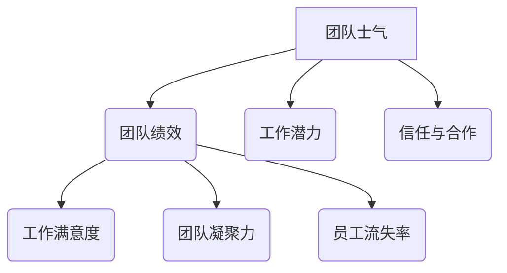
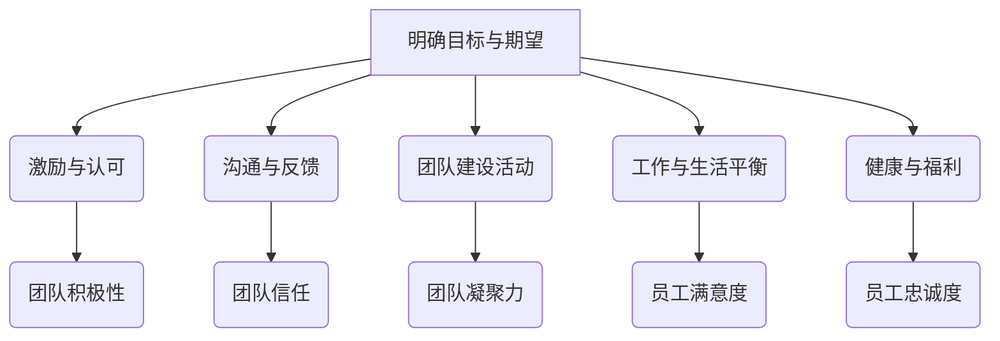
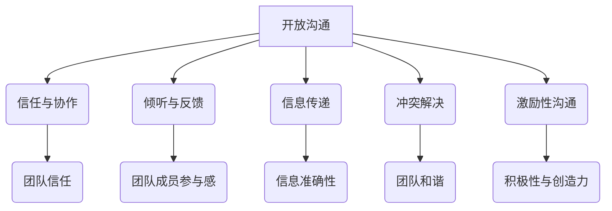
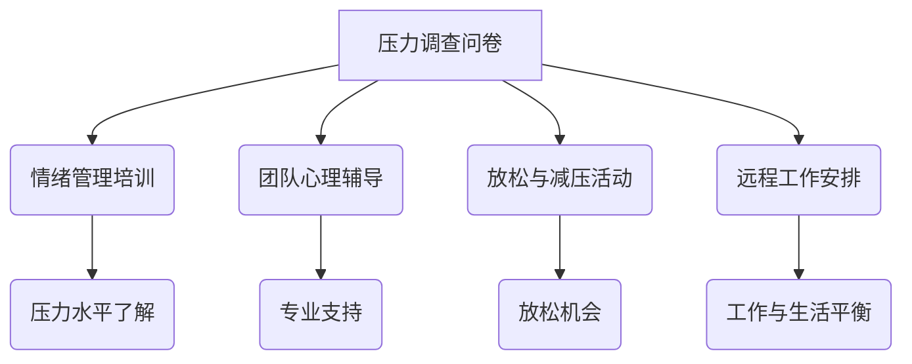
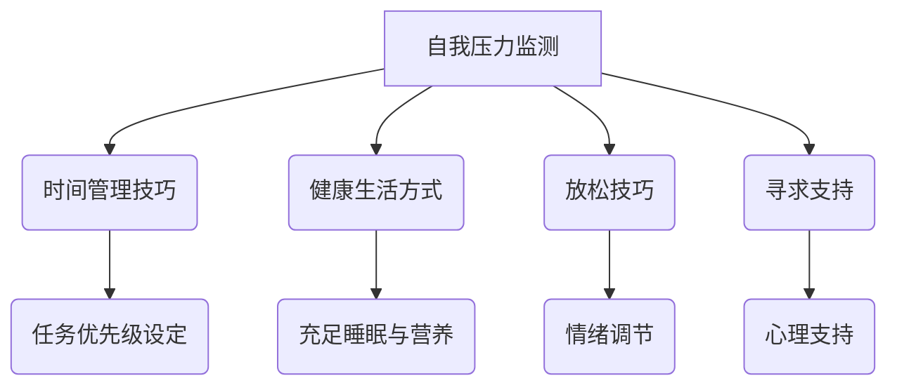
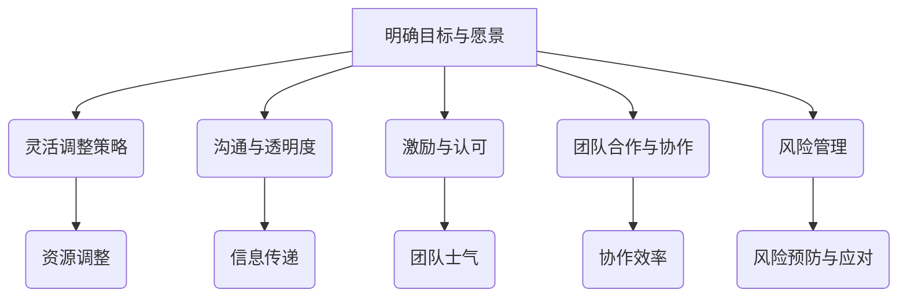
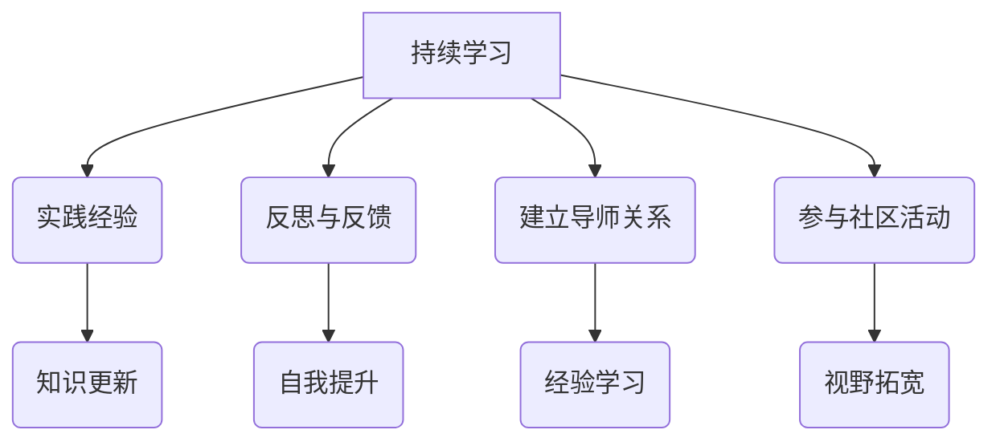
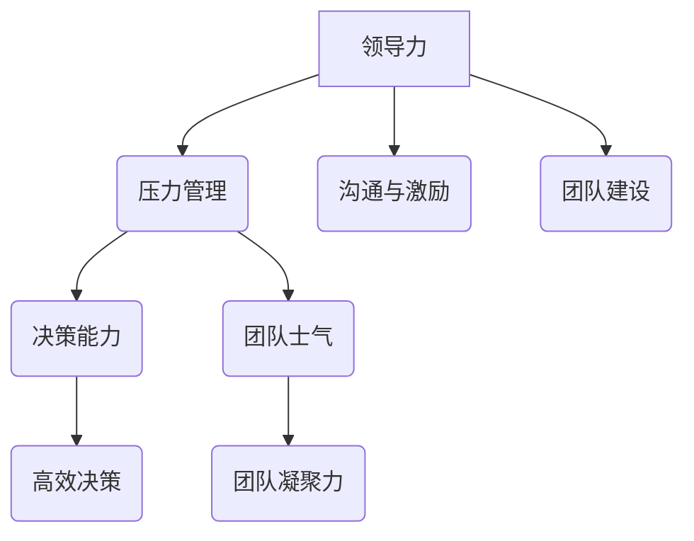
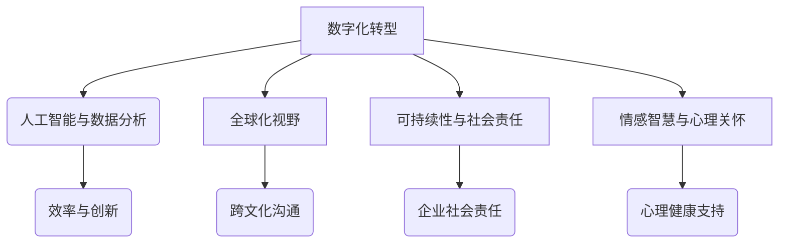

                 

### 文章标题：领导力与压力管理：在困境中保持团队士气

#### 关键词：
- 领导力
- 压力管理
- 团队士气
- 困境应对

#### 摘要：
本文旨在探讨在困境中保持团队士气的重要性和领导力与压力管理的策略。通过分析领导力的基本原理、压力管理的核心策略以及在困境中领导者的挑战，本文提供了实用的实践方法和技巧，以帮助领导者维持团队的高效和积极状态。

---

## 第1章：领导力基础

### 1.1 领导力的定义与作用

领导力是一种在组织内部影响和激励他人达成共同目标的能力。它不仅仅是权威的象征，更是通过激发团队成员的潜力，实现团队目标的关键因素。领导力在团队中扮演着至关重要的角色，它不仅影响着团队的工作效率，还直接关系到团队成员的士气和满意度。

领导力不仅仅是管理，更是一种影响力和引领他人的艺术。一个优秀的领导者不仅能够有效地管理团队，还能够激励团队成员，使其在面临挑战时保持积极的态度和高效的工作状态。在团队中，领导力的作用主要体现在以下几个方面：

1. **目标设定**：领导者需要明确团队的目标，并将这些目标传达给团队成员，确保每个成员都清楚自己的职责和任务。
2. **沟通协调**：领导力需要良好的沟通能力，领导者需要确保信息流畅地传递，解决团队成员之间的矛盾和冲突。
3. **激励与认可**：领导者需要通过激励和认可来提高团队成员的积极性和满意度，使其在困难面前保持高昂的士气。
4. **团队建设**：领导者需要关注团队的内部建设，通过建立信任和合作，提升团队的凝聚力和战斗力。

### 1.2 领导力模型

在理解领导力时，了解不同的领导力模型是非常有帮助的。以下是一些经典的领导力模型：

- ** Transformational Leadership Model**：这种模型强调领导者的变革能力，通过激励和启发团队成员，实现团队的目标。
- ** Situational Leadership Model**：这种模型认为领导者的行为应该根据不同的情况和环境进行调整。
- **Servant Leadership Model**：这种模型强调领导者应该以服务团队成员为宗旨，通过无私奉献和关怀，提升团队的整体效能。

这些模型为我们理解领导力提供了不同的视角，但无论哪种模型，领导力都离不开以下几个核心要素：

1. **Vision**：领导者需要有清晰的目标和愿景，这可以帮助团队明确方向和目标。
2. **Empowerment**：领导者需要信任和授权团队成员，使其有更多的自主权和责任感。
3. **Inspiration**：领导者需要通过激励和启发，使团队成员充满激情和动力。
4. **Connection**：领导者需要建立和维护与团队成员之间的信任和联系，这有助于提升团队的凝聚力。

### 1.3 领导力的核心技能

领导力的实现不仅仅依赖于理论模型，还需要具备一系列核心技能。以下是一些关键的领导力技能：

- **Communication Skills**：良好的沟通能力是领导力的基础，领导者需要能够清晰地表达自己的想法，并倾听团队成员的意见。
- **Decision-making Skills**：领导者需要具备良好的决策能力，能够在复杂和不确定的情况下做出明智的决策。
- **Motivation Skills**：领导者需要能够激励团队成员，使其在面临挑战时保持积极的态度和高效的工作状态。
- **Team Building Skills**：领导者需要关注团队的内部建设，通过建立信任和合作，提升团队的凝聚力和战斗力。

总结来说，领导力是一种综合性的能力，它不仅包括理论知识和模型，还需要具备实际操作中的核心技能。一个优秀的领导者需要不断学习和提升自己的能力，以应对各种复杂和不确定的情况。

## 第2章：压力管理原理

### 2.1 压力的来源与影响

压力是现代社会中无法避免的一部分。它源自工作、家庭、社交等多个方面，对个人的心理健康和生活质量有着深远的影响。理解压力的来源和影响是进行有效压力管理的第一步。

首先，压力的来源可以归纳为以下几个方面：

1. **工作压力**：高强度的任务、紧迫的截止日期、工作负荷过重等都会导致工作压力。
2. **家庭压力**：家庭关系的紧张、抚养子女的责任、经济压力等都会带来家庭压力。
3. **社交压力**：社交关系的处理、公共演讲、社交活动等都会产生社交压力。
4. **健康压力**：身体疾病、健康问题等都会对个人产生压力。

压力对个人和团队的影响是多方面的。对于个人而言，压力可能导致以下问题：

- **心理健康问题**：如焦虑、抑郁、睡眠障碍等。
- **身体问题**：如头痛、背痛、消化问题等。
- **工作效率下降**：压力会影响个人的注意力和决策能力，从而降低工作效率。
- **生活质量下降**：长期的压力可能导致生活质量的下降，影响个人的幸福感和满足感。

对于团队而言，压力的影响同样不容忽视：

- **士气和凝聚力下降**：团队成员在压力下可能变得消极和疲惫，影响团队的士气和凝聚力。
- **错误和失误增加**：压力可能导致团队成员在执行任务时出现错误和失误。
- **离职率上升**：长期的压力可能导致员工离职，影响团队的稳定和绩效。

### 2.2 压力管理策略

为了有效应对压力，领导者需要掌握一系列的压力管理策略。以下是一些常用的方法：

1. **认知重构**：这种方法通过改变对压力事件的认知和解释，来减轻压力感。例如，将“必须完成这个任务”转换为“我可以在这个截止日期前完成这个任务”。

2. **时间管理**：合理安排时间，避免过度工作和加班，可以有效减轻工作压力。领导者可以通过制定明确的任务优先级和截止日期，帮助团队成员更好地管理时间。

3. **放松技巧**：如深呼吸、冥想、瑜伽等放松技巧可以帮助个人在压力下保持冷静和集中。领导者可以鼓励团队成员在工作之余进行这些放松活动。

4. **健康生活方式**：保持健康的生活方式，如规律的饮食、充足的睡眠、适度的运动等，可以提升个人的抗压能力。

5. **寻求支持**：领导者可以鼓励团队成员在面临压力时寻求支持，无论是来自同事、家人还是专业人士的帮助。这有助于减轻个人的心理负担。

### 2.3 心理健康与压力管理

心理健康是压力管理的核心要素。一个健康的心理状态可以帮助个人更好地应对压力，保持高效的工作状态。

首先，领导者需要关注团队成员的心理健康，通过定期沟通和关注，了解团队成员的心理状态。以下是一些有助于维护心理健康的方法：

1. **建立信任和开放沟通**：领导者需要创造一个开放和信任的沟通环境，使团队成员能够自由地表达自己的感受和困惑。

2. **提供心理支持**：领导者可以通过提供心理支持，如倾听、鼓励和建议，帮助团队成员应对压力和挑战。

3. **培训和心理辅导**：领导者可以组织心理健康培训和心理辅导，提升团队成员的心理素质和应对压力的能力。

4. **工作与生活平衡**：鼓励团队成员在工作与生活之间找到平衡，避免过度工作和疲劳。

总结来说，压力管理不仅仅是应对压力，更是一个全面的心理健康维护过程。领导者需要通过一系列的策略和方法，帮助团队成员保持健康的心理状态，从而提升团队的整体效能和士气。

## 第3章：困境中的领导力

### 3.1 困境的定义与特征

在领导者的职业生涯中，困境是无法避免的一部分。困境通常指的是领导者面临的复杂、不确定和充满挑战的情况，这些情况可能会对组织的运作和成员的心理产生负面影响。困境的特征包括：

1. **不确定性**：困境往往伴随着信息不足或信息不明确，导致领导者无法准确预测结果。
2. **复杂性**：困境可能涉及多个变量和利益相关者，领导者需要综合考虑各种因素做出决策。
3. **紧急性**：困境往往需要迅速应对，留给领导者的决策时间有限。
4. **冲突性**：困境中可能存在不同意见和利益冲突，领导者需要平衡各方利益。

### 3.2 困境中的决策与应对

在困境中，领导者的决策和应对策略至关重要。以下是一些关键的决策和应对策略：

1. **快速反应**：领导者需要迅速识别困境的征兆，并采取行动。这包括与团队成员沟通，了解问题的实质，并制定初步的应对方案。

2. **全面分析**：在快速反应的同时，领导者需要进行全面的分析，了解问题的根本原因和可能的解决方案。这可以通过召开会议、收集数据和信息来实现。

3. **灵活调整**：在应对困境时，领导者需要保持灵活性，随时根据情况变化调整策略。这包括重新评估资源、调整优先级和灵活运用团队的能力。

4. **团队合作**：困境中的领导力强调团队合作，领导者需要鼓励团队成员共同面对挑战。通过集体智慧和共同努力，可以提高解决问题的效率。

### 3.3 困境中的领导力挑战

困境中的领导力面临着一系列独特的挑战。以下是一些主要的挑战：

1. **压力与情绪管理**：困境往往伴随着巨大的压力和情绪波动，领导者需要保持冷静和客观，以便做出明智的决策。

2. **团队士气**：困境可能导致团队士气低落，领导者需要采取措施提振士气，如激励和认可团队成员的成绩。

3. **资源有限**：困境中资源可能有限，领导者需要合理分配资源，确保关键任务得到优先处理。

4. **信息不对称**：困境中的信息可能不完整或不准确，领导者需要通过多种渠道收集信息，以便做出更全面的决策。

总结来说，困境中的领导力需要领导者具备快速反应、全面分析、灵活调整和团队合作的能力。通过有效的决策和应对策略，领导者可以带领团队克服困境，实现组织的目标。

## 第4章：团队士气管理

### 4.1 团队士气的概念

团队士气是指团队成员在工作中的精神状态和积极性。它不仅反映了团队成员对工作的态度和感受，还直接影响着团队的绩效和凝聚力。高团队士气通常表现为团队成员之间的积极互动、对工作的热情以及对团队目标的认同。

团队士气对团队绩效的影响是多方面的。首先，高团队士气可以激发团队成员的潜力，使其在面临挑战时保持高昂的斗志和效率。其次，良好的团队士气有助于增强团队成员之间的信任和合作，从而提高团队的凝聚力和协作能力。此外，高团队士气还可以降低员工流失率，提升组织的整体稳定性。

为了理解团队士气的重要性，我们可以通过一个简单的Mermaid流程图来展示其与团队绩效的关系：

在这个流程图中，团队士气作为核心变量，直接影响团队绩效的其他方面。良好的团队士气有助于提升工作满意度、增强团队凝聚力，并降低员工流失率，从而提高团队的总体绩效。

### 4.2 士气提升策略

为了提升团队士气，领导者可以采取一系列策略。以下是一些实用的提升士气的方法：

1. **明确目标与期望**：领导者需要明确团队的目标，并确保每个成员都了解自己的职责和期望。这有助于团队成员集中精力，为实现共同目标而努力。

2. **激励与认可**：领导者可以通过激励和认可来提升团队成员的积极性。例如，定期举行表彰会议，奖励表现出色的成员，或提供晋升机会。

3. **沟通与反馈**：良好的沟通是提升团队士气的关键。领导者需要定期与团队成员进行沟通，了解他们的想法和需求，并提供及时的反馈。

4. **团队建设活动**：组织一些团队建设活动，如户外拓展、团队聚餐等，可以增强团队成员之间的联系，提升团队的凝聚力。

5. **工作与生活平衡**：领导者可以鼓励团队成员在工作与生活之间找到平衡，避免过度工作和疲劳。例如，提供灵活的工作时间和远程工作的机会。

6. **健康与福利**：关注团队成员的健康和福利，如提供健身设施、定期健康检查等，可以提升团队成员的幸福感和忠诚度。

以下是一个Mermaid流程图，展示了如何通过多种策略提升团队士气：

在这个流程图中，多种策略相互作用，共同提升团队士气。通过明确目标与期望、激励与认可、沟通与反馈、团队建设活动、工作与生活平衡以及健康与福利等措施，领导者可以有效地提升团队士气，从而提高团队的绩效和凝聚力。

### 4.3 团队沟通与士气

团队沟通在提升团队士气中起着至关重要的作用。有效的沟通不仅能够消除误解和冲突，还能够增强团队成员之间的信任和协作。以下是一些关键点，说明如何通过团队沟通提升士气：

1. **开放沟通**：领导者需要创造一个开放和诚实的沟通环境，使团队成员能够自由地表达自己的想法和感受。这有助于增强团队成员之间的信任和合作。

2. **倾听与反馈**：领导者需要积极倾听团队成员的意见和反馈，并及时给予回应。这不仅可以提升团队成员的参与感，还可以帮助他们感受到自己的价值。

3. **明确信息传递**：确保信息在团队内部准确和一致地传递，避免误解和误传。领导者可以通过定期会议、邮件和即时通讯工具等方式，确保信息流通顺畅。

4. **冲突解决**：有效的沟通可以帮助解决团队内部的冲突。领导者需要具备冲突解决的技能，通过中立和公正的方式处理冲突，以维护团队的和谐和士气。

5. **激励性沟通**：领导者可以在沟通中融入激励性的语言，如表扬和鼓励，以激发团队成员的积极性和创造力。

以下是一个Mermaid流程图，展示了如何通过有效的团队沟通提升士气：

在这个流程图中，开放沟通、倾听与反馈、明确信息传递、冲突解决和激励性沟通等多种沟通策略共同作用，提升团队士气，增强团队的凝聚力和协作能力。

## 第5章：压力管理的实践

### 5.1 压力管理的实际案例

为了更好地理解压力管理的实际应用，我们可以通过一些真实的案例来分析。以下是一个关于压力管理的实际案例：

#### 案例背景：
某科技公司正面临一个重要项目的截止日期，团队成员的工作压力骤增。由于项目涉及多个部门和复杂的开发任务，团队成员感到焦虑和压力。

#### 压力管理策略：
1. **认知重构**：领导层首先组织了一次团队会议，引导团队成员重新评估压力来源。他们鼓励团队成员认识到项目的重要性，同时强调每个人在项目中的贡献和重要性。
   
2. **时间管理**：领导层制定了详细的项目计划，并分配了明确的任务和截止日期。通过这种方式，团队成员可以更好地管理时间，避免因过度工作而产生的压力。

3. **放松技巧**：领导层提供了一些放松技巧的培训，如深呼吸、冥想和瑜伽。这些技巧帮助团队成员在高压环境中保持冷静和专注。

4. **健康生活方式**：公司为员工提供了一些福利，如健身房会员卡和健康检查。这有助于提升团队成员的身体和心理状态。

5. **团队支持**：领导层鼓励团队成员在遇到困难时寻求同事和领导的支持。这种支持机制帮助团队成员感到被关心和重视。

#### 案例结果：
通过上述策略，团队成员的压力显著减轻，团队士气有所提升。项目最终按时完成，并得到了客户的高度评价。这个案例展示了如何通过有效的压力管理策略，提高团队的工作效率和士气。

### 5.2 团队压力管理工具

为了更有效地管理团队压力，领导者可以利用一些工具和方法。以下是一些常用的团队压力管理工具：

1. **压力调查问卷**：通过定期的压力调查问卷，领导者可以了解团队成员的压力水平和具体来源。这有助于制定针对性的压力管理策略。

2. **情绪管理培训**：提供情绪管理培训，帮助团队成员学会识别和应对自己的情绪。这种培训可以包括压力应对策略、情绪调节技巧和自我关怀方法。

3. **团队心理辅导**：定期组织团队心理辅导，帮助团队成员在面临压力时获得专业支持。这可以包括一对一辅导和团队辅导两种形式。

4. **放松与减压活动**：组织一些放松和减压活动，如瑜伽课、健身活动、团队聚餐等，帮助团队成员在紧张的工作中找到放松的机会。

5. **远程工作安排**：提供灵活的远程工作安排，帮助团队成员在工作与生活之间找到更好的平衡。这可以减少通勤压力，提高工作效率。

以下是一个Mermaid流程图，展示了如何使用这些工具进行团队压力管理：

在这个流程图中，多种工具和方法共同作用，帮助团队有效管理压力，提升整体绩效和士气。

### 5.3 压力管理的个人实践

除了团队层面的压力管理，个人层面的实践同样重要。以下是一些个人压力管理的策略：

1. **自我压力监测**：定期评估自己的压力水平，通过日记或压力监测工具记录自己的情绪和压力变化。这有助于及时发现压力源并采取相应措施。

2. **时间管理技巧**：合理安排时间，设定明确的任务优先级和截止日期。避免过度工作和拖延，以确保有足够的休息和恢复时间。

3. **健康生活方式**：保持规律的作息时间，确保充足的睡眠和营养。定期进行体育锻炼，如散步、跑步或瑜伽，有助于缓解压力。

4. **放松技巧**：学习一些放松技巧，如深呼吸、冥想、瑜伽等。这些技巧可以帮助在高压环境中保持冷静和专注。

5. **寻求支持**：在面临压力时，及时寻求家人、朋友或专业人士的支持和帮助。这可以减轻个人的心理负担，提供不同的视角和建议。

以下是一个Mermaid流程图，展示了个人压力管理的策略：

在这个流程图中，个人层面的压力管理策略通过自我监测、时间管理、健康生活方式、放松技巧和寻求支持等多种方式，帮助个人更好地应对压力，保持良好的心理和生理状态。

## 第6章：困境中的团队领导力

### 6.1 困境中的领导力要求

在困境中，领导者面临着前所未有的挑战。要成功地带领团队走出困境，领导者需要具备一系列特定的能力和素质。以下是一些关键的领导力要求：

1. **冷静与果断**：困境中常常伴随着情绪波动和不确定性，领导者需要保持冷静和客观，以便做出明智的决策。同时，领导者需要果断行动，迅速应对困境。

2. **情感智慧**：领导者需要具备良好的情感智慧，能够理解和管理自己的情绪，同时敏感地察觉团队成员的情绪变化。这有助于建立信任和有效的沟通。

3. **问题解决能力**：领导者需要具备强大的问题解决能力，能够迅速识别困境的根源，并制定有效的解决方案。这包括分析问题、评估风险和制定行动计划。

4. **团队合作能力**：困境中的领导力强调团队合作，领导者需要能够激发团队成员的潜力，建立有效的协作机制，共同面对挑战。

5. **适应性**：领导者需要具备高度的适应性，能够灵活调整策略，应对不断变化的情况和环境。

6. **持久性**：困境往往需要长期的坚持和努力，领导者需要具备持久性，不断激励团队，保持对目标的信心和决心。

### 6.2 困境中的领导策略

在困境中，领导者需要采取一系列策略来确保团队的有效运作和目标的实现。以下是一些关键的领导策略：

1. **明确目标与愿景**：领导者需要清晰地传达团队的目标和愿景，使团队成员明白困境中的方向和意义。这有助于增强团队的凝聚力和动力。

2. **灵活调整策略**：在困境中，领导者需要根据实际情况灵活调整策略，确保团队能够适应不断变化的环境。这包括重新评估资源、调整任务优先级和灵活运用团队的能力。

3. **沟通与透明度**：领导者需要保持开放的沟通渠道，确保信息在团队内部准确和一致地传递。同时，领导者需要保持透明度，让团队成员了解困境的实际情况和领导层的决策过程。

4. **激励与认可**：领导者需要通过激励和认可来提升团队成员的积极性和士气。这可以包括表扬、奖励和提供成长机会。

5. **团队合作与协作**：领导者需要鼓励团队成员之间的合作和协作，通过集体智慧和共同努力，提高解决问题的效率。

6. **风险管理**：领导者需要识别和评估困境中的风险，并制定相应的风险应对策略。这包括预防措施、应急预案和风险转移。

以下是一个Mermaid流程图，展示了困境中的领导策略：

在这个流程图中，多种策略相互作用，帮助领导者有效地应对困境，维持团队的高效运作和士气。

### 6.3 困境中的领导力提升

为了在困境中更好地发挥领导力，领导者需要不断学习和提升自己的能力。以下是一些有效的领导力提升方法：

1. **持续学习**：领导者需要保持学习的态度，通过阅读、参加培训和研讨会等方式，不断更新自己的知识和技能。

2. **实践经验**：通过实际工作经验，领导者可以更好地理解困境中的挑战，并积累应对困境的策略和技巧。

3. **反思与反馈**：领导者需要定期反思自己的领导行为，并寻求团队成员的反馈。这有助于识别自己的优点和不足，并进行改进。

4. **建立导师关系**：与经验丰富的导师建立关系，可以帮助领导者从他人的经验中学习，提升自己的领导力。

5. **参与社区活动**：参与行业会议、研讨会和社区活动，可以拓宽领导者的视野，了解行业趋势和最佳实践。

以下是一个Mermaid流程图，展示了领导力提升的方法：

在这个流程图中，多种方法共同作用，帮助领导者不断提升自己的领导力，以更好地应对困境中的挑战。

## 第7章：总结与展望

### 7.1 领导力与压力管理的关系

领导力与压力管理在团队管理中密不可分，它们相互作用，共同影响团队的整体效能和士气。首先，领导力在压力管理中起着核心作用。一个优秀的领导者能够通过有效的沟通、激励和团队建设，帮助团队成员应对压力，提高抗压能力。同时，有效的压力管理也有助于提升领导力。通过掌握压力管理的策略，领导者可以更好地应对复杂和不确定的环境，提高决策能力和团队士气。

领导力与压力管理的相互关系可以用以下Mermaid流程图来表示：

在这个流程图中，领导力通过沟通与激励、团队建设等手段影响压力管理，而有效的压力管理又通过提高决策能力和团队士气，进一步强化领导力。

### 7.2 未来领导力的趋势

未来领导力的趋势将受到科技、社会和文化等多方面因素的影响。以下是一些未来领导力的主要趋势：

1. **数字化转型**：随着技术的飞速发展，领导者需要具备数字化转型的能力，能够引领团队适应和利用新技术，提高工作效率和创新能力。

2. **人工智能与数据分析**：人工智能和数据分析将成为未来领导力的重要组成部分。领导者需要了解如何利用这些工具来提高决策效率和团队绩效。

3. **全球化视野**：全球化趋势要求领导者具备跨文化的沟通能力和全球视野，能够有效地管理多元文化团队。

4. **可持续性与社会责任**：企业社会责任和可持续发展成为企业成功的核心要素，领导者需要关注这些议题，并将其融入企业的战略和运营中。

5. **情感智慧与心理关怀**：随着人们对心理健康重视程度的提高，领导者需要具备更高的情感智慧，能够关注团队成员的心理健康，提供必要的心理支持和关怀。

以下是一个Mermaid流程图，展示了未来领导力的趋势：

在这个流程图中，多种趋势相互作用，共同塑造未来领导力的方向和特征。

## 附录：资源与工具

### 附录 A：领导力与压力管理相关资源

为了帮助读者进一步了解和掌握领导力与压力管理的相关知识，我们推荐以下资源：

- **在线课程**：Coursera、edX和Udemy等平台提供了丰富的领导力和压力管理在线课程，包括《领导力基础》、《压力管理技巧》等。
- **书籍推荐**：《领导力的五个层次》、《压力管理的艺术》和《非暴力沟通》等。
- **专业组织**：如国际领导力协会（ILA）和美国压力管理协会（ASMA），提供专业的培训、研讨会和资源。

### 附录 B：领导力与压力管理常用公式与模型

以下是一些领导力与压力管理中常用的公式和模型，帮助读者更好地理解和应用相关知识：

1. **领导力模型（ Transformational Leadership Model）**：
   - 变革领导力 = 激励因素 + 情感联系 + 个人化关怀
   - $$ \text{变革领导力} = \text{激励因素} + \text{情感联系} + \text{个人化关怀} $$

2. **压力管理模型（ Stress Management Model）**：
   - 压力应对 = 应对策略 + 心理弹性
   - $$ \text{压力应对} = \text{应对策略} + \text{心理弹性} $$

3. **情绪智力（ Emotional Intelligence）**：
   - 情绪智力 = 自我认知 + 自我调节 + 社会技能 + 情绪识别
   - $$ \text{情绪智力} = \text{自我认知} + \text{自我调节} + \text{社会技能} + \text{情绪识别} $$

附录中的这些公式和模型为读者提供了理论和实践上的指导，帮助其在实际工作中更好地运用领导力和压力管理的方法。

### 作者信息

- 作者：AI天才研究院/AI Genius Institute & 禅与计算机程序设计艺术 /Zen And The Art of Computer Programming

---

本文全面探讨了领导力与压力管理在困境中保持团队士气的重要性。通过分析领导力的定义、模型、核心技能，以及压力管理的原理、策略和实践，我们提供了实用的方法和技巧，以帮助领导者有效地应对困境，提升团队士气。同时，本文展望了未来领导力的趋势，为读者提供了进一步学习和提升的方向。希望本文能够为读者在领导力与压力管理领域提供有价值的参考和启示。

---

**结语：**

领导力与压力管理是团队成功的关键要素。在困境中，领导者需要运用有效的策略和方法，保持团队士气，确保团队的稳定和高效运作。通过本文的探讨，我们希望读者能够更好地理解这些概念，并将其应用于实际工作中。未来，领导者需要不断学习和适应新的趋势，以应对不断变化的挑战。让我们共同努力，成为更加卓越的领导者。

