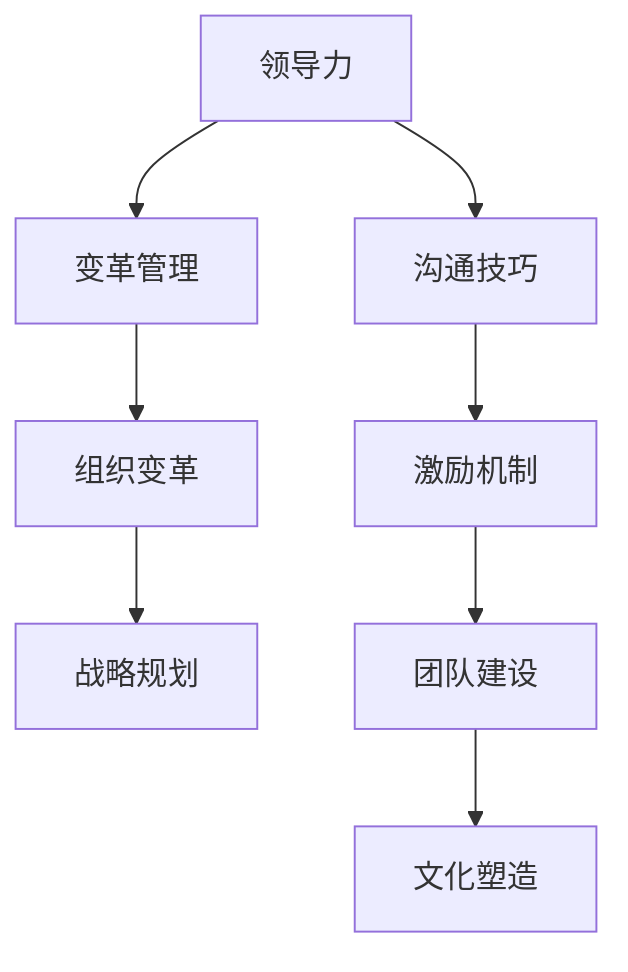
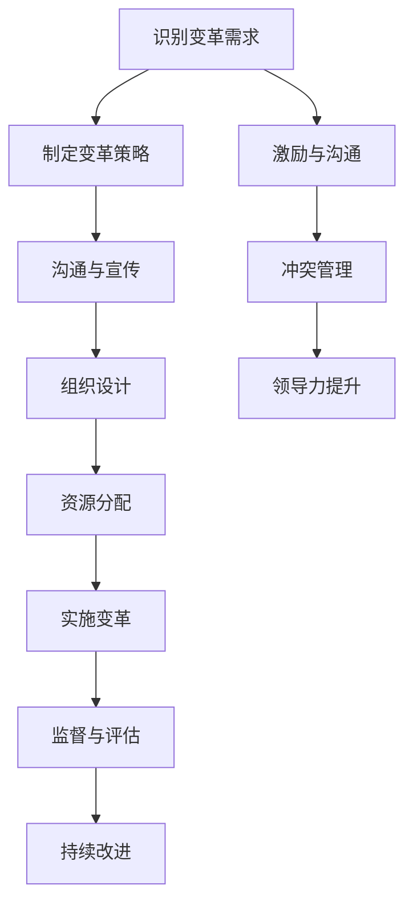

                 

# 文章标题：领导力与变革管理高级技巧：引导深度变革

> 关键词：领导力，变革管理，高级技巧，深度变革，组织变革

> 摘要：本文深入探讨了领导力与变革管理的核心概念、理论基础、关键步骤、高级技巧以及变革管理的未来趋势和挑战。通过具体案例研究和实践分享，本文旨在为IT领域的专业人员和领导者提供实用的变革管理指导，帮助他们在快速变化的环境中成功引导深度变革。

### 第1章: 领导力与变革管理的定义和核心概念

#### 1.1 领导力的定义与作用

##### 1.1.1 领导力的基本概念

领导力是一种激励和引导他人共同实现目标的能力。它不仅仅关注任务和目标的达成，更强调通过影响和启发他人来实现共同的成功。领导力是一种多维度的能力，包括影响力、沟通技巧、决策能力、战略思维等多个方面。

##### 1.1.2 领导力在组织中的作用

在组织中，领导力起着至关重要的作用。它能够激励员工发挥最大潜力，推动创新，提高团队的协作效率。领导力还能够建立强大的组织文化，增强组织的凝聚力，从而在复杂多变的环境中保持竞争优势。

##### 1.1.3 领导力与管理的区别

领导力与管理虽然密切相关，但它们有着本质的区别。管理主要关注资源的分配、流程的优化和目标的实现，而领导力则更注重愿景的塑造、动机的激发和关系的建立。一个优秀的领导者不仅能够管理好团队，更能够通过领导力推动组织的变革和创新。

#### 1.2 变革管理的定义与重要性

##### 1.2.1 变革管理的概念

变革管理是指通过系统的规划、沟通、组织设计和资源管理，引导组织实现从现状到目标状态的转变。它不仅涉及组织结构的调整，还包括文化、流程、技术等多方面的变革。

##### 1.2.2 变革管理的重要性

变革管理在组织发展中至关重要。它能够帮助组织适应外部环境的变化，提升竞争力，实现长期发展。通过有效的变革管理，组织能够更好地应对市场变化、技术进步和内部需求的变革。

##### 1.2.3 变革管理与领导力的关系

变革管理与领导力密不可分。领导者是变革的推动者和倡导者，他们需要通过领导力激发员工的变革意愿，建立变革的愿景，并提供必要的支持和资源。同时，变革管理也需要领导者的决策和指导，以确保变革的顺利进行。

#### 1.3 领导力与变革管理的核心概念联系

##### 1.3.1 领导力与变革管理的关系图

##### 1.3.2 领导力与变革管理的流程图

##### 1.3.3 领导力在变革管理中的角色

领导力在变革管理中扮演着关键角色。首先，领导者需要识别变革的需求，并制定相应的策略。其次，他们需要通过沟通和激励，引导员工接受变革，并积极参与其中。此外，领导者还需要在变革过程中管理冲突，提供必要的资源和支持，确保变革的顺利进行。最后，领导者需要持续评估变革的效果，并根据反馈进行调整和优化。

### 第2章: 变革管理的理论基础

#### 2.1 变革管理的理论框架

##### 2.1.1 变革管理的经典理论

变革管理的经典理论包括邓恩的变革管理模型、帕斯卡尔的变革管理理论和柯伦的变革管理过程模型。

###### 2.1.1.1 邓恩的变革管理模型

邓恩的变革管理模型包括四个阶段：准备阶段、变革阶段、实施阶段和评估阶段。每个阶段都有其特定的任务和目标。

###### 2.1.1.2 帕斯卡尔的变革管理理论

帕斯卡尔的变革管理理论强调了领导者的角色，他认为领导者需要通过塑造愿景、建立信任和激励员工来推动变革。

###### 2.1.1.3 柯伦的变革管理过程模型

柯伦的变革管理过程模型包括五个阶段：诊断阶段、规划阶段、执行阶段、监控阶段和调整阶段。每个阶段都需要领导者采取相应的策略和措施。

##### 2.1.2 变革管理的现代理论

现代变革管理理论包括适应性理论、系统动态理论和转型理论。

###### 2.1.2.1 适应性理论

适应性理论认为，组织需要不断适应外部环境的变化，通过灵活的变革策略来保持竞争优势。

###### 2.1.2.2 系统动态理论

系统动态理论强调了变革过程中的复杂性和动态性，认为组织需要通过系统性的方法来管理变革。

###### 2.1.2.3 转型理论

转型理论关注组织在重大变革过程中的转型过程，强调领导者需要通过战略思维和系统性的变革来推动组织的转型。

#### 2.2 变革管理的核心原理

##### 2.2.1 变革的驱动因素

变革的驱动因素包括外部环境的变化、内部需求的提升、技术进步和市场变化等。领导者需要识别这些驱动因素，并制定相应的变革策略。

##### 2.2.2 变革的阻力

变革的阻力包括员工对变革的不满、组织文化的抵触、资源的限制等。领导者需要通过有效的沟通和激励来克服这些阻力。

##### 2.2.3 变革的管理策略

变革的管理策略包括制定明确的变革目标、建立有效的沟通机制、设计合理的组织结构、提供必要的资源支持等。领导者需要根据具体情况进行策略选择和调整。

### 第3章: 变革管理的关键步骤与方法

#### 3.1 变革准备阶段

##### 3.1.1 变革的可行性分析

在变革准备阶段，首先需要分析变革的可行性。这包括评估变革的目标、资源、时间等方面的可行性。通过可行性分析，可以确定变革的可行性和潜在风险。

##### 3.1.2 变革的规划和设计

在可行性分析的基础上，制定详细的变革规划。这包括确定变革的目标、范围、时间表、资源需求等。同时，设计变革的具体方案，包括组织结构、流程优化、技术更新等。

##### 3.1.3 变革的风险评估

变革过程中不可避免地会面临各种风险。因此，在变革准备阶段，需要对变革的风险进行全面评估。这包括分析变革可能带来的风险，制定相应的风险应对措施。

#### 3.2 变革实施阶段

##### 3.2.1 变革的沟通与宣传

在变革实施阶段，沟通和宣传至关重要。领导者需要通过多种渠道，如会议、邮件、内部刊物等，向员工传达变革的目标、原因、意义和预期效果。同时，鼓励员工提问和反馈，建立开放和透明的沟通机制。

##### 3.2.2 变革的组织设计

变革需要调整组织结构，以适应新的目标和要求。这可能包括部门重组、职责调整、岗位设置等。在组织设计中，领导者需要确保变革的方案能够被有效地实施。

##### 3.2.3 变革的资源分配

变革需要投入大量的资源，包括人力、物力、财力等。在变革实施阶段，领导者需要确保资源的合理分配，确保变革的顺利进行。

#### 3.3 变革监督与评估阶段

##### 3.3.1 变革的过程监督

在变革监督与评估阶段，领导者需要持续监督变革的过程。这包括跟踪变革的进度、监控变革的效果、识别潜在的问题和挑战等。

##### 3.3.2 变革的效果评估

变革的效果评估是衡量变革成功与否的重要指标。领导者需要制定科学的评估标准，对变革的效果进行全面评估。这包括员工满意度、业务绩效、组织文化等方面。

##### 3.3.3 变革的持续改进

变革不是一蹴而就的过程，需要持续改进。领导者需要根据评估结果，对变革方案进行调整和优化，确保变革的持续性和有效性。

### 第4章: 高级领导力技巧在变革管理中的应用

#### 4.1 领导力技巧在变革管理中的重要性

在变革管理中，领导力技巧至关重要。高级领导力技巧能够帮助领导者更好地识别变革的需求、制定变革策略、激励员工参与变革，并在变革过程中管理冲突和挑战。

##### 4.1.1 领导力在变革中的核心作用

领导力在变革中的核心作用包括：

1. **塑造变革愿景**：领导者需要明确变革的目标和方向，为员工提供清晰的方向和目标。
2. **激励员工**：通过激励机制，激发员工的变革意愿，增强他们的参与感和责任感。
3. **建立信任**：领导者需要通过开放和透明的沟通，建立与员工的信任关系，减少变革的阻力。
4. **管理冲突**：在变革过程中，领导者需要有效管理冲突，确保变革的顺利进行。

##### 4.1.2 高级领导力技巧对变革成功的影响

高级领导力技巧对变革成功的影响主要体现在以下几个方面：

1. **提升变革的速度和效率**：通过有效的领导力，可以加速变革的进程，提高变革的效率。
2. **增强员工的参与度**：通过激励和信任，可以增强员工对变革的参与度，提高变革的接受度和支持度。
3. **降低变革的风险**：通过有效的管理和监督，可以降低变革过程中的风险，确保变革的顺利进行。
4. **持续推动变革**：高级领导力技巧可以帮助领导者持续推动变革，确保变革的长期效果。

#### 4.2 激励与沟通技巧

##### 4.2.1 激励理论在变革中的应用

在变革管理中，激励理论具有重要的应用价值。以下是一些常用的激励理论：

1. **马斯洛的需求层次理论**：领导者需要了解员工的不同需求层次，通过满足员工的基本需求（如安全、社交和自我实现）来激发他们的变革意愿。
2. **赫兹伯格的双因素理论**：领导者需要关注员工的工作环境和工作条件，通过改善工作环境来提高员工的工作满意度和参与度。
3. **目标设置理论**：领导者需要为员工设定明确的、有挑战性的目标，并通过反馈和奖励来激励员工实现这些目标。

##### 4.2.2 沟通技巧在变革管理中的运用

在变革管理中，沟通技巧至关重要。以下是一些常用的沟通技巧：

1. **明确沟通目标**：领导者需要明确沟通的目标和内容，确保信息传达的准确性和完整性。
2. **采用多种沟通渠道**：领导者需要采用多种沟通渠道，如会议、邮件、内部刊物等，确保信息传达的广泛性和及时性。
3. **积极倾听**：领导者需要积极倾听员工的意见和反馈，建立开放和透明的沟通环境。
4. **有效反馈**：领导者需要通过有效的反馈机制，鼓励员工提出建议和反馈，并对其进行及时的回应和奖励。

#### 4.3 冲突管理技巧

##### 4.3.1 冲突的类型与原因

在变革管理中，冲突是不可避免的。以下是一些常见的冲突类型和原因：

1. **目标冲突**：不同部门或员工之间的目标不一致，可能导致冲突。
2. **资源冲突**：有限的资源分配不均，可能导致员工之间的冲突。
3. **价值观冲突**：不同的价值观和信念可能导致员工之间的冲突。
4. **沟通不畅**：信息传递不畅，可能导致误解和冲突。

##### 4.3.2 冲突管理策略

为了有效管理冲突，领导者可以采取以下策略：

1. **识别冲突**：领导者需要及时发现和识别冲突，防止冲突升级。
2. **倾听与理解**：领导者需要积极倾听冲突各方的意见，理解他们的立场和需求。
3. **中立调解**：领导者应扮演中立调解者的角色，帮助双方找到共同点，达成共识。
4. **制定解决方案**：领导者需要制定具体的解决方案，确保冲突得到有效解决。

##### 4.3.3 冲突解决案例分析

以下是一个冲突解决案例：

**案例背景**：某公司进行组织结构调整，导致部分员工的职责和权限发生变化。这引发了员工之间的冲突，影响了团队的协作效率。

**解决过程**：

1. **识别冲突**：公司领导层及时发现员工之间的冲突，并采取措施进行调查。
2. **倾听与理解**：领导层积极倾听员工的意见和诉求，了解他们的立场和需求。
3. **中立调解**：领导层组织了调解会议，让员工面对面沟通，表达各自的观点。
4. **制定解决方案**：领导层根据员工的反馈，调整了部分员工的职责和权限，并制定了详细的调整方案。
5. **执行方案**：领导层确保调整方案得到有效执行，并持续监督和评估调整效果。

通过以上措施，公司成功解决了员工之间的冲突，恢复了团队的协作效率。

### 第5章: 变革管理的高级策略与技巧

#### 5.1 变革策略的制定

##### 5.1.1 变革策略的核心要素

制定有效的变革策略需要考虑以下核心要素：

1. **明确变革目标**：明确变革的目标和方向，确保变革的针对性和有效性。
2. **评估变革的可行性**：评估变革的可行性，包括资源、时间、风险等方面的评估。
3. **设计变革方案**：根据评估结果，设计具体的变革方案，包括组织结构、流程优化、技术更新等。
4. **制定实施计划**：制定详细的实施计划，包括时间表、责任人、资源需求等。

##### 5.1.2 变革策略的制定过程

制定变革策略的过程包括以下步骤：

1. **需求分析**：分析组织内外部环境，识别变革的需求和目标。
2. **资源评估**：评估组织的资源，包括人力、物力、财力等，确保变革的可行性。
3. **设计方案**：根据需求分析和资源评估，设计具体的变革方案。
4. **风险评估**：对变革方案进行风险评估，识别潜在的风险和挑战。
5. **制定计划**：根据风险评估结果，制定详细的实施计划。

##### 5.1.3 变革策略的评估与调整

在变革实施过程中，需要持续评估变革策略的有效性，并根据反馈进行调整。以下是一些评估与调整的方法：

1. **定期评估**：定期对变革策略进行评估，包括目标达成情况、资源利用情况、员工满意度等。
2. **反馈机制**：建立有效的反馈机制，收集员工和客户的反馈，识别变革策略的优缺点。
3. **调整方案**：根据评估结果和反馈，对变革策略进行调整和优化，确保变革的持续性和有效性。

#### 5.2 变革实施的高级技巧

##### 5.2.1 高级变革实施技巧

在变革实施过程中，领导者可以采用以下高级技巧：

1. **有效沟通**：通过多种渠道进行有效沟通，确保变革目标、原因和意义得到广泛传达。
2. **积极激励**：采用激励措施，激发员工的变革意愿，提高他们的参与度和积极性。
3. **灵活调整**：根据实际情况，灵活调整变革方案，确保变革的顺利进行。
4. **持续监督**：持续监督变革的进度和效果，及时发现和解决问题。

##### 5.2.2 变革实施中的关键成功因素

变革实施的关键成功因素包括：

1. **领导力**：领导者的领导力和决策能力对变革的成功至关重要。
2. **沟通**：有效的沟通是确保变革目标、原因和意义得到广泛传达的关键。
3. **激励**：采用合适的激励措施，激发员工的变革意愿，提高他们的参与度和积极性。
4. **资源**：充足的资源是变革成功的重要保障。
5. **持续改进**：持续改进变革策略和实施方法，确保变革的持续性和有效性。

#### 5.3 变革管理的持续改进

##### 5.3.1 持续改进的重要性

持续改进是变革管理的重要部分。它能够帮助组织不断适应外部环境的变化，提高竞争力，实现长期发展。以下是一些持续改进的方法：

1. **定期评估**：定期对变革效果进行评估，识别存在的问题和改进空间。
2. **反馈机制**：建立有效的反馈机制，收集员工和客户的反馈，识别变革策略的优缺点。
3. **培训与发展**：为员工提供培训和发展机会，提高他们的技能和能力，为变革提供支持。
4. **创新激励**：鼓励员工提出创新建议，对成功的创新进行奖励和认可。

##### 5.3.2 持续改进的方法与工具

以下是一些常用的持续改进方法和工具：

1. **精益管理**：通过消除浪费、优化流程，提高组织的效率和质量。
2. **六西格玛**：通过统计方法和工具，降低产品和服务的缺陷率，提高质量。
3. **持续集成和持续部署**：在软件开发过程中，通过自动化测试和部署，提高开发效率和产品质量。
4. **敏捷管理**：通过灵活的响应和快速迭代，提高组织的适应性和创新能力。

### 第6章: 变革管理的案例研究

#### 6.1 案例选择与分析方法

在本章节中，我们将选择两个具有代表性的案例进行研究：谷歌的变革管理实践和丰田的变革管理策略。选择这两个案例的原因是：

1. **谷歌**：作为全球最具创新力和影响力的科技公司之一，谷歌在变革管理方面有着丰富的经验和成功的实践。
2. **丰田**：作为全球领先的汽车制造商，丰田在变革管理方面有着深厚的理论和实践经验。

分析的方法包括以下几个方面：

1. **文献研究**：通过查阅相关文献，了解谷歌和丰田在变革管理方面的理论和方法。
2. **案例分析**：对谷歌和丰田的具体变革案例进行深入分析，探讨其变革策略和实施过程。
3. **访谈调研**：通过与谷歌和丰田的管理人员进行访谈，获取第一手的变革管理经验和观点。

#### 6.2 成功变革案例解析

##### 6.2.1 案例一：谷歌的变革管理实践

**案例背景**：

谷歌在成立初期是一家专注于搜索技术的初创公司。随着公司的发展和市场的竞争，谷歌面临着巨大的变革需求。为了保持竞争优势，谷歌采取了一系列的变革措施。

**变革策略**：

1. **持续创新**：谷歌注重持续创新，鼓励员工提出新的创意和改进建议。通过建立开放的创新文化和灵活的决策机制，谷歌能够快速响应市场需求，推出一系列创新产品和服务。
2. **人才管理**：谷歌通过独特的招聘和人才发展策略，吸引和留住了一批世界顶尖的人才。谷歌注重员工的工作满意度和职业发展，通过提供有竞争力的薪酬、灵活的工作时间和丰富的培训机会，提高员工的归属感和创造力。
3. **企业文化**：谷歌注重企业文化的塑造，强调开放、透明和协作。通过建立开放的沟通渠道和鼓励员工之间的合作，谷歌营造了一个积极向上的工作氛围，促进了团队的协作和创新。
4. **技术更新**：谷歌不断投资于技术研发，推动技术更新和创新。通过建立先进的技术实验室和投资初创公司，谷歌能够快速应用新技术，提升产品和服务的竞争力。

**变革效果**：

通过有效的变革管理，谷歌成功地实现了从一家初创公司到全球科技巨头的转变。谷歌的创新产品和服务，如Google Search、Google Maps、Gmail等，在全球范围内获得了巨大的成功和用户认可。谷歌的变革管理实践为其他组织提供了宝贵的经验和启示。

##### 6.2.2 案例二：丰田的变革管理策略

**案例背景**：

丰田是一家拥有百年历史的汽车制造商，在全球汽车市场中占据重要地位。随着市场竞争的加剧和消费者需求的多样化，丰田面临着巨大的变革需求。

**变革策略**：

1. **精益生产**：丰田采用精益生产方式，通过消除浪费、优化流程，提高生产效率和质量。丰田通过不断优化生产流程，降低了生产成本，提高了产品的竞争力。
2. **持续改进**：丰田注重持续改进，通过建立全面的改进体系和员工参与机制，鼓励员工提出改进建议和实施改进措施。丰田通过持续改进，不断提高产品和服务的质量和用户满意度。
3. **人才发展**：丰田注重员工的发展，提供全面的培训和发展机会，提高员工的技能和能力。丰田通过建立职业发展体系和激励措施，鼓励员工不断进步和创新。
4. **全球化战略**：丰田通过全球化战略，积极拓展国际市场，提高全球竞争力。丰田在海外建立了多个生产基地和研发中心，实现了全球资源的优化配置。

**变革效果**：

通过有效的变革管理，丰田在全球汽车市场中保持了竞争优势，取得了持续的发展和壮大。丰田的变革管理策略为其他制造企业提供了有益的借鉴。

#### 6.3 失败变革案例剖析

##### 6.3.1 案例一：亚马逊的变革困境

**案例背景**：

亚马逊是一家全球领先的电子商务公司，其在电商领域取得了巨大的成功。然而，在近年来，亚马逊面临着一系列的变革困境，导致其市场份额和业绩受到影响。

**变革策略**：

1. **多元化战略**：亚马逊试图通过多元化战略，进入多个行业和领域，以扩大业务范围和市场份额。然而，多元化的步伐过快，导致资源分散和执行力不足。
2. **技术革新**：亚马逊在技术革新方面投入了大量资源，但新技术的应用效果不佳，导致用户体验下降。
3. **组织变革**：亚马逊试图通过组织变革，提高管理效率和团队协作能力。然而，变革过程中沟通不畅，员工不满，导致变革失败。

**变革效果**：

亚马逊的变革策略并未取得预期的效果，反而导致了市场份额和业绩的下滑。亚马逊需要重新审视其变革策略，并采取有效的措施来克服变革困境。

##### 6.3.2 案例二：通用电气的变革失败原因

**案例背景**：

通用电气（GE）是一家全球领先的多元化企业，其在电力、航空、医疗等领域拥有广泛的市场。然而，在近年来，GE面临着一系列的变革失败，导致其业绩和市值大幅下滑。

**变革策略**：

1. **多元化战略**：GE试图通过多元化战略，进入多个行业和领域，以扩大业务范围和市场份额。然而，多元化的步伐过快，导致资源分散和执行力不足。
2. **技术创新**：GE在技术创新方面投入了大量资源，但新技术的应用效果不佳，导致产品竞争力下降。
3. **组织变革**：GE试图通过组织变革，提高管理效率和团队协作能力。然而，变革过程中沟通不畅，员工不满，导致变革失败。

**变革效果**：

GE的变革策略并未取得预期的效果，反而导致了业绩和市值的下滑。GE需要重新审视其变革策略，并采取有效的措施来克服变革困境。

### 第7章: 变革管理的未来趋势与挑战

#### 7.1 变革管理的未来趋势

在未来，变革管理将面临一系列新的趋势和挑战。以下是一些关键趋势：

##### 7.1.1 数字化时代的变化

随着数字化技术的发展，变革管理将更加依赖于数据分析和人工智能。通过大数据分析，组织可以更好地了解员工的需求和反馈，制定更精准的变革策略。人工智能可以帮助组织自动化变革管理流程，提高变革的效率和效果。

##### 7.1.2 变革管理的创新方向

未来，变革管理将更加注重创新和敏捷性。组织需要快速响应市场变化，通过创新的方式实现变革。敏捷管理、精益管理和六西格玛等管理方法将在变革管理中发挥更大的作用。

#### 7.2 变革管理的挑战

在未来，变革管理将面临一系列新的挑战。以下是一些关键挑战：

##### 7.2.1 组织文化的挑战

组织文化是变革成功的关键因素。然而，传统的组织文化往往难以适应快速变化的商业环境。领导者需要通过改变组织文化，鼓励创新和协作，为变革提供支持。

##### 7.2.2 技术变革的挑战

技术的快速发展为组织变革提供了新的机遇，但也带来了挑战。技术变革的速度和复杂性使得组织需要不断学习和适应，以保持竞争力。

##### 7.2.3 全球化背景下的挑战

全球化使得组织面临更复杂的市场和竞争环境。组织需要在全球范围内协调资源和管理变革，以应对不同市场和文化的挑战。

### 附录

#### 附录 A: 变革管理工具与方法

在本章中，我们介绍了一些常用的变革管理工具与方法，包括：

1. **变革管理框架**：如邓恩的变革管理模型、帕斯卡尔的变革管理理论等。
2. **沟通技巧**：如有效沟通、积极倾听、反馈机制等。
3. **激励理论**：如马斯洛的需求层次理论、赫兹伯格的双因素理论等。
4. **冲突管理策略**：如中立调解、倾听与理解等。

#### 附录 B: 变革管理资源推荐

以下是一些推荐的变革管理资源：

1. **经典书籍**：《变革之舞》、《变革之心》等。
2. **在线课程**：Coursera、Udemy等平台上的变革管理课程。
3. **研究论文**：学术论文数据库如JSTOR、IEEE Xplore等。

作者：AI天才研究院/AI Genius Institute & 禅与计算机程序设计艺术 /Zen And The Art of Computer Programming

---

**本文深入探讨了领导力与变革管理的核心概念、理论基础、关键步骤、高级技巧以及变革管理的未来趋势和挑战。通过具体案例研究和实践分享，本文旨在为IT领域的专业人员和领导者提供实用的变革管理指导，帮助他们在快速变化的环境中成功引导深度变革。**

**文章关键词：领导力，变革管理，高级技巧，深度变革，组织变革**

**文章摘要：本文深入探讨了领导力与变革管理的核心概念、理论基础、关键步骤、高级技巧以及变革管理的未来趋势和挑战。通过具体案例研究和实践分享，本文旨在为IT领域的专业人员和领导者提供实用的变革管理指导，帮助他们在快速变化的环境中成功引导深度变革。**## 引言

在当今快速变化的时代，企业面临的竞争压力和环境变化前所未有。为了保持竞争力，企业需要不断进行创新和变革。然而，变革并非易事，它涉及到组织结构、文化、流程等多个方面的调整，需要领导者具备卓越的领导力和变革管理能力。本文旨在深入探讨领导力与变革管理的核心概念、理论基础、关键步骤、高级技巧以及变革管理的未来趋势和挑战，为IT领域的专业人员和领导者提供实用的变革管理指导，帮助他们在快速变化的环境中成功引导深度变革。

### 领导力与变革管理的关系

领导力与变革管理密不可分。领导力是一种通过影响力、激励和启发他人实现共同目标的能力。在变革管理中，领导力起着至关重要的作用。首先，领导者需要识别变革的需求，并制定明确的变革目标。其次，领导者需要通过沟通和激励，引导员工接受变革，并积极参与其中。此外，领导者还需要在变革过程中管理冲突，提供必要的资源和支持，确保变革的顺利进行。最后，领导者需要持续评估变革的效果，并根据反馈进行调整和优化，确保变革的持续性和有效性。

### 变革管理的核心概念

变革管理是指通过系统的规划、沟通、组织设计和资源管理，引导组织实现从现状到目标状态的转变。变革管理不仅涉及组织结构的调整，还包括文化、流程、技术等多方面的变革。变革管理的关键在于理解变革的驱动因素、识别变革的阻力、制定有效的变革策略以及实施和监督变革过程。

### 变革管理的理论基础

变革管理的理论基础包括经典理论和现代理论。经典理论如邓恩的变革管理模型、帕斯卡尔的变革管理理论和柯伦的变革管理过程模型，为变革管理提供了系统的框架和方法。现代理论如适应性理论、系统动态理论和转型理论，则更加关注变革过程中的复杂性和动态性，为领导者提供了更灵活和创新的变革策略。

### 变革管理的核心步骤与方法

变革管理的关键步骤包括变革准备阶段、变革实施阶段和变革监督与评估阶段。在变革准备阶段，需要进行可行性分析、规划和设计。在变革实施阶段，需要进行沟通与宣传、组织设计和资源分配。在变革监督与评估阶段，需要进行过程监督、效果评估和持续改进。每个阶段都需要领导者采取相应的策略和措施，确保变革的顺利进行。

### 高级领导力技巧在变革管理中的应用

高级领导力技巧在变革管理中至关重要。领导者需要通过激励和沟通激发员工的变革意愿，通过冲突管理确保变革的顺利进行，并通过持续改进和评估，确保变革的长期效果。领导者需要具备卓越的决策能力、沟通能力和团队合作能力，以应对变革过程中的各种挑战。

### 变革管理的高级策略与技巧

变革管理的高级策略与技巧包括变革策略的制定、变革实施的高级技巧和变革管理的持续改进。有效的变革策略需要明确变革目标、评估变革可行性、设计变革方案和制定实施计划。在变革实施过程中，领导者需要采用多种沟通技巧和激励措施，确保变革的顺利进行。在变革管理过程中，领导者需要持续改进和评估变革效果，确保变革的长期效果。

### 变革管理的未来趋势与挑战

随着数字化和全球化的发展，变革管理将面临新的趋势和挑战。数字化时代将带来数据分析和人工智能的应用，现代理论将更加注重创新和敏捷性。同时，组织文化和技术变革将成为变革管理的核心挑战，领导者需要不断创新和管理，以应对快速变化的环境。

### 结论

领导力与变革管理是组织中不可或缺的部分。领导者需要通过卓越的领导力和变革管理能力，引导组织在快速变化的环境中实现深度变革。本文通过深入探讨领导力与变革管理的核心概念、理论基础、关键步骤、高级技巧以及未来趋势和挑战，为IT领域的专业人员和领导者提供了实用的变革管理指导。希望本文能帮助读者更好地理解变革管理的本质，提升领导力和变革管理能力，在未来的变革中取得成功。

---

通过本文的讨论，我们明确了领导力与变革管理的关系，理解了变革管理的核心概念和理论基础，了解了变革管理的关键步骤和高级技巧，并探讨了变革管理的未来趋势与挑战。接下来，我们将通过具体章节的深入探讨，为读者提供更为详细和实用的变革管理指导。

---

### 第1章: 领导力与变革管理的定义和核心概念

#### 1.1 领导力的定义与作用

领导力是一种通过影响力、激励和启发他人来实现共同目标的能力。它不仅仅关注任务和目标的达成，更强调通过影响和启发他人来实现共同的成功。领导力是一种多维度的能力，包括影响力、沟通技巧、决策能力、战略思维等多个方面。

在组织内部，领导力扮演着至关重要的角色。首先，领导力能够激励员工发挥最大潜力，推动创新，提高团队的协作效率。一个具备领导力的领导者能够激发员工的工作热情，使他们愿意为组织的目标努力。其次，领导力能够建立强大的组织文化，增强组织的凝聚力，从而在复杂多变的环境中保持竞争优势。最后，领导力还能够帮助组织实现战略目标，通过制定和执行明确的战略规划，确保组织能够不断适应外部环境的变化。

领导力与管理之间存在一定的区别。管理主要关注资源的分配、流程的优化和目标的实现，而领导力则更注重愿景的塑造、动机的激发和关系的建立。一个优秀的领导者不仅能够管理好团队，更能够通过领导力推动组织的变革和创新。管理更多是解决“如何做”的问题，而领导力则关注“为什么做”和“为什么这样做”。

#### 1.2 变革管理的定义与重要性

变革管理是指通过系统的规划、沟通、组织设计和资源管理，引导组织实现从现状到目标状态的转变。它不仅涉及组织结构的调整，还包括文化、流程、技术等多方面的变革。变革管理的目标是通过改变组织的现状，使其更好地适应外部环境的变化，提高组织的竞争力和长期发展能力。

变革管理在组织发展中至关重要。首先，它能够帮助组织适应外部环境的变化，如市场变化、技术进步和竞争压力等。通过有效的变革管理，组织能够及时调整战略和业务模式，以保持竞争优势。其次，变革管理能够提升组织的创新能力，通过引入新的思维和技术，推动组织的创新和发展。最后，变革管理能够增强组织的适应性和灵活性，使组织能够在快速变化的市场中迅速做出反应，降低变革带来的风险。

#### 1.3 变革管理与领导力的关系

变革管理与领导力密不可分。领导者是变革的推动者和倡导者，他们需要通过领导力激发员工的变革意愿，建立变革的愿景，并提供必要的支持和资源。同时，变革管理也需要领导者的决策和指导，以确保变革的顺利进行。

首先，领导力在变革的识别和规划阶段起着关键作用。领导者需要具备敏锐的洞察力，能够识别组织内外部的变革需求，并制定相应的变革策略。通过明确变革的目标和方向，领导者能够为员工提供清晰的方向和目标，减少变革的模糊性和不确定性。

其次，领导力在变革的沟通和宣传阶段至关重要。领导者需要通过有效的沟通技巧，向员工传达变革的必要性和意义，建立员工对变革的信任和认同。通过建立开放和透明的沟通渠道，领导者能够及时回应员工的关切和疑问，减少变革的阻力和抵触情绪。

最后，领导力在变革的实施和监督阶段发挥着关键作用。领导者需要通过激励和监督，确保变革方案的有效实施，及时发现和解决变革过程中出现的问题和挑战。通过持续监督和评估变革的效果，领导者能够确保变革的持续性和有效性。

总之，领导力与变革管理相互促进，领导者需要通过卓越的领导力来推动有效的变革管理，而有效的变革管理又能进一步强化领导力，使组织在快速变化的环境中保持竞争优势。

### 第2章: 变革管理的理论基础

#### 2.1 变革管理的理论框架

变革管理的理论基础涵盖了多种经典和现代理论，每种理论都为组织在变革过程中提供了不同的视角和方法。以下是对几种主要变革管理理论框架的简要介绍。

##### 2.1.1 经典理论

**邓恩的变革管理模型**：该模型包括四个阶段：准备阶段、变革阶段、实施阶段和评估阶段。在准备阶段，组织需要评估变革的可行性和需求，确定变革的目标和范围。在变革阶段，组织需要进行沟通和宣传，激发员工的变革意愿。在实施阶段，组织需要具体实施变革方案，确保变革的顺利进行。在评估阶段，组织需要评估变革的效果，并根据反馈进行调整和优化。

**帕斯卡尔的变革管理理论**：帕斯卡尔认为，变革管理的关键在于领导者的角色。领导者需要通过塑造愿景、建立信任和激励员工来推动变革。帕斯卡尔强调了领导者与员工之间的互动，认为领导者需要与员工进行有效的沟通，理解他们的需求和担忧，并为他们提供必要的支持和资源。

**柯伦的变革管理过程模型**：柯伦的模型包括五个阶段：诊断阶段、规划阶段、执行阶段、监控阶段和调整阶段。在诊断阶段，组织需要评估当前的状态，识别变革的需求和驱动因素。在规划阶段，组织需要制定详细的变革计划，包括目标、策略、时间表和资源分配。在执行阶段，组织需要具体实施变革计划，确保变革的顺利进行。在监控阶段，组织需要持续监督变革的过程，评估变革的效果。在调整阶段，组织需要根据评估结果和反馈，对变革计划进行调整和优化。

##### 2.1.2 现代理论

**适应性理论**：适应性理论关注组织在快速变化环境中的适应能力。该理论认为，组织需要通过灵活的变革策略来适应外部环境的变化。适应性理论强调组织需要具备快速响应变化的能力，通过不断调整和优化，保持竞争优势。

**系统动态理论**：系统动态理论认为，组织是一个复杂的系统，变革过程中存在多种动态因素。该理论强调组织需要通过系统性的方法来管理变革，包括识别变革的驱动因素、分析变革的反馈机制和优化变革的过程。系统动态理论帮助组织理解和预测变革过程中的复杂性和动态性。

**转型理论**：转型理论关注组织在重大变革过程中的转型过程。该理论认为，组织需要通过战略思维和系统性的变革来推动组织的转型。转型理论强调领导者需要具备长远的眼光和战略思维，通过制定清晰的转型目标和路径，推动组织实现从现状到目标状态的转变。

#### 2.2 变革管理的核心原理

变革管理的核心原理包括变革的驱动因素、变革的阻力以及变革的管理策略。以下是对这些核心原理的详细讨论。

##### 2.2.1 变革的驱动因素

变革的驱动因素是指促使组织进行变革的外部或内部因素。外部驱动因素包括市场变化、技术进步、竞争压力和法律法规等。市场变化可能导致消费者需求的变化，从而要求组织调整产品和服务。技术进步可以提供新的机会，使组织能够采用更先进的技术和工具，提高效率和竞争力。竞争压力促使组织不断提升自身的能力，以保持市场地位。法律法规的变化则要求组织遵守新的规定，以避免法律风险。

内部驱动因素包括组织内部的问题和需求，如员工绩效低下、组织结构不合理、流程繁琐等。内部驱动因素往往源于组织内部的效率和效益问题，需要通过变革来解决。

##### 2.2.2 变革的阻力

变革的阻力是指阻碍组织变革的因素。变革的阻力可以来自多个方面，包括员工、组织文化和管理体系等。员工可能因为害怕失去既得利益、担心变革带来的不确定性而抵触变革。组织文化如果过于保守，可能难以接受新的观念和做法。管理体系的不完善也可能导致变革的困难。

识别和克服变革的阻力是变革管理的关键。领导者需要通过有效的沟通、激励和参与机制，消除员工的疑虑和担忧，增强他们对变革的认同感和支持度。

##### 2.2.3 变革的管理策略

变革的管理策略是指组织在变革过程中采取的系统性方法和措施。有效的变革管理策略包括以下几个方面：

1. **明确变革目标**：领导者需要明确变革的目标和方向，确保变革的针对性和有效性。目标应具体、明确，具有可衡量性，以便在变革过程中进行评估和调整。

2. **制定详细的变革计划**：变革计划应包括变革的目标、策略、时间表和资源分配等。详细的变革计划有助于明确各阶段的任务和责任，确保变革的顺利进行。

3. **沟通与宣传**：有效的沟通是变革成功的关键。领导者需要通过多种渠道和方式，如会议、培训、内部刊物等，向员工传达变革的目标、原因和预期效果，建立开放和透明的沟通机制。

4. **激励与参与**：领导者需要采用激励措施，激发员工的变革意愿，鼓励他们积极参与变革。通过建立参与机制，如员工代表会议、变革委员会等，增强员工的参与感和责任感。

5. **监督与评估**：领导者需要持续监督变革的过程，评估变革的效果，并根据反馈进行调整和优化。监督与评估有助于及时发现和解决问题，确保变革的持续性和有效性。

通过遵循这些核心原理和管理策略，组织可以更好地应对变革带来的挑战，实现预期的变革目标。

### 第3章: 变革管理的关键步骤与方法

变革管理是一个复杂且多阶段的过程，涉及到从识别变革需求到评估变革效果的一系列步骤。以下是变革管理的关键步骤和具体方法。

#### 3.1 变革准备阶段

在变革准备阶段，组织的首要任务是评估变革的需求和可行性，确保变革的方案能够有效实施。以下是变革准备阶段的关键步骤和方法：

##### 3.1.1 变革的可行性分析

- **需求分析**：首先，领导者需要评估组织内部和外部环境的变化，识别变革的需求。内部需求可能包括提高效率、改进流程、增强员工满意度等；外部需求可能包括市场变化、技术进步、竞争压力等。
- **资源评估**：接下来，领导者需要评估组织的资源，包括人力、物力、财力等。资源评估有助于确定变革所需的投入，并确保组织能够承担这些成本。
- **风险评估**：在确定变革的需求和资源后，领导者需要对变革可能带来的风险进行评估。这包括财务风险、操作风险、市场风险等。通过识别和评估风险，领导者可以制定相应的风险缓解策略。

##### 3.1.2 变革的规划和设计

- **制定变革目标**：明确变革的目标和预期成果是确保变革成功的关键。领导者需要制定具体的变革目标，这些目标应该是可衡量、可实现和有时限的。
- **设计变革方案**：在确定变革目标后，领导者需要设计具体的变革方案。变革方案应包括变革的范围、步骤、时间表和资源分配等。设计方案时，领导者应考虑变革对组织结构、流程、技术、文化等方面的影响。
- **制定应急预案**：在规划变革方案时，领导者还应制定应急预案，以应对可能出现的意外情况和挑战。应急预案应包括备选方案、关键人员安排、资源调度等。

##### 3.1.3 变革的风险评估

- **识别潜在风险**：在规划变革方案的过程中，领导者需要识别变革可能带来的潜在风险。这些风险可能包括变革方案的不完善、员工抵触情绪、技术问题、资源不足等。
- **评估风险影响**：一旦识别出潜在风险，领导者需要对每个风险进行评估，确定其可能对变革的影响程度。这包括风险发生的概率、风险对变革目标的影响等。
- **制定风险缓解策略**：根据风险评估结果，领导者需要制定相应的风险缓解策略。这些策略可能包括风险规避、风险减轻、风险接受等。

通过全面的可行性分析、细致的规划设计和详细的风险评估，组织可以为变革的成功奠定坚实的基础。

#### 3.2 变革实施阶段

在变革实施阶段，组织需要将规划好的变革方案具体化，并确保其在实际操作中得以有效执行。以下是变革实施阶段的关键步骤和方法：

##### 3.2.1 变革的沟通与宣传

- **明确沟通目标**：在实施变革前，领导者需要明确沟通的目标，即向员工传达哪些信息，以及如何传达这些信息。沟通目标应具体、明确，有助于确保信息传达的准确性和完整性。
- **采用多种渠道**：为了确保信息的广泛传达，领导者应采用多种沟通渠道，如会议、邮件、内部刊物、社交媒体等。不同渠道适用于不同类型的员工，有助于提高信息的覆盖率和接受度。
- **提供透明信息**：在沟通过程中，领导者应提供透明的信息，包括变革的原因、目标、预期效果、时间表等。透明度有助于减少员工的疑虑和担忧，提高他们对变革的信任和理解。
- **鼓励反馈与提问**：领导者应鼓励员工提问和反馈，建立开放和互动的沟通机制。通过倾听员工的意见和建议，领导者可以更好地了解员工的需求和关切，及时调整变革方案。

##### 3.2.2 变革的组织设计

- **调整组织结构**：根据变革方案，领导者需要对组织结构进行调整，包括部门重组、职责分配、权限调整等。组织结构调整有助于确保变革方案在组织内部的顺利实施。
- **明确职责和权限**：在组织设计过程中，领导者需要明确各个部门和员工的职责和权限，确保变革方案的具体执行者有明确的职责和任务。
- **提供培训和支持**：为了帮助员工适应新的组织结构和职责，领导者应提供必要的培训和支持。培训内容可能包括新技能的掌握、新流程的操作等，有助于提高员工的工作效率和能力。

##### 3.2.3 变革的资源分配

- **确定资源需求**：在变革实施过程中，领导者需要确定所需的资源，包括人力、物力、财力等。资源需求的评估应基于变革方案的具体内容和实际操作情况。
- **优化资源分配**：根据资源需求，领导者需要制定资源分配计划，确保各项资源能够得到合理利用。优化资源分配有助于提高变革的效率，减少浪费。
- **确保资源供给**：在资源分配过程中，领导者需要确保资源供给的稳定和充足。例如，在技术变革中，领导者需要确保技术设备、软件工具和人力资源的及时供给，以避免因资源不足而导致的延误。

通过有效的沟通与宣传、合理的组织设计和科学的资源分配，组织可以确保变革方案在实施阶段的顺利推进。

#### 3.3 变革监督与评估阶段

在变革监督与评估阶段，组织需要持续监控变革的过程和效果，确保变革目标的实现，并根据反馈进行必要的调整和优化。以下是变革监督与评估阶段的关键步骤和方法：

##### 3.3.1 变革的过程监督

- **建立监控机制**：领导者需要建立有效的监控机制，对变革的过程进行持续监督。监控机制可能包括定期会议、进度报告、绩效考核等。
- **收集过程数据**：通过监控机制，领导者可以收集变革过程中的关键数据，如项目进度、资源利用情况、员工满意度等。这些数据有助于评估变革的进展和效果。
- **分析过程问题**：在收集过程数据后，领导者需要对数据进行分析，识别变革过程中可能出现的问题和挑战。例如，项目进度延误、资源浪费、员工抵触情绪等。
- **采取纠正措施**：一旦识别出过程问题，领导者需要采取相应的纠正措施，确保变革的顺利进行。纠正措施可能包括调整项目计划、重新分配资源、加强员工培训等。

##### 3.3.2 变革的效果评估

- **设定评估标准**：为了评估变革的效果，领导者需要设定具体的评估标准，这些标准应与变革目标紧密相关。评估标准可能包括业务绩效、员工满意度、市场反应等。
- **收集效果数据**：在变革实施后，领导者需要收集效果数据，如业务指标、员工反馈、客户满意度等。这些数据有助于评估变革的实际效果。
- **分析效果数据**：通过对效果数据的分析，领导者可以评估变革目标的达成情况，识别变革的效果和不足之处。
- **制定优化方案**：根据效果数据分析，领导者可以制定进一步的优化方案，以提高变革的长期效果。优化方案可能包括改进流程、加强培训、调整激励机制等。

##### 3.3.3 变革的持续改进

- **建立反馈机制**：为了实现持续改进，领导者需要建立有效的反馈机制，收集员工和客户的反馈，识别变革过程中的问题和改进空间。
- **定期评估和调整**：领导者需要定期评估变革的效果，并根据反馈进行必要的调整和优化。定期评估有助于确保变革的持续性和有效性。
- **鼓励创新和改进**：领导者应鼓励员工提出创新建议和改进措施，通过建立创新激励机制，激发员工的创新潜力。持续改进是组织长期发展的关键。

通过有效的过程监督、效果评估和持续改进，组织可以确保变革目标的实现，并在变革过程中不断优化和提升。

### 第4章: 高级领导力技巧在变革管理中的应用

在变革管理过程中，高级领导力技巧的应用至关重要。领导者需要通过一系列策略和技巧来激励员工、沟通变革信息、管理冲突，并确保变革的顺利实施。以下将详细探讨这些高级领导力技巧在变革管理中的应用。

#### 4.1 领导力技巧在变革管理中的重要性

领导力技巧在变革管理中具有至关重要的作用。首先，领导者需要具备敏锐的洞察力，能够准确识别变革的需求和时机。其次，领导者需要通过有效的沟通和激励，使员工理解变革的必要性和重要性，并积极参与其中。此外，领导者还需要在变革过程中管理冲突，确保团队的协作和稳定。最后，领导者需要持续评估变革的效果，并根据反馈进行调整和优化，确保变革的长期效果。

#### 4.2 激励与沟通技巧

##### 4.2.1 激励理论在变革中的应用

在变革管理中，激励理论的应用对于激发员工的变革意愿和积极性至关重要。以下是一些常用的激励理论及其在变革中的应用：

1. **马斯洛的需求层次理论**：马斯洛的需求层次理论指出，人的需求可以分为生理需求、安全需求、社交需求、尊重需求和自我实现需求。在变革管理中，领导者可以通过满足员工的这些需求来激励他们。例如，通过改善工作环境和提供职业发展机会，满足员工的尊重和自我实现需求。

2. **赫兹伯格的双因素理论**：赫兹伯格的双因素理论认为，工作满意度主要由内在因素（如成就感、工作认可）和外在因素（如薪酬、工作环境）决定。在变革管理中，领导者可以通过改善工作条件和提供激励措施，提高员工的工作满意度和参与度。

3. **目标设置理论**：目标设置理论认为，明确、具体和有挑战性的目标能够提高员工的工作动力和绩效。在变革管理中，领导者可以帮助员工设定具有挑战性的目标，并通过反馈和奖励来激励员工实现这些目标。

##### 4.2.2 沟通技巧在变革管理中的运用

有效的沟通是变革管理成功的关键。以下是一些关键的沟通技巧及其在变革管理中的应用：

1. **明确沟通目标**：在变革过程中，领导者需要明确沟通的目标和内容，确保信息传达的准确性和完整性。沟通目标可能包括传达变革的原因、目标、时间表和预期效果。

2. **多种渠道沟通**：为了确保信息的广泛传达，领导者应采用多种沟通渠道，如会议、邮件、内部刊物、社交媒体等。不同渠道适用于不同类型的员工，有助于提高信息的覆盖率和接受度。

3. **提供透明信息**：在沟通过程中，领导者应提供透明的信息，包括变革的原因、目标、预期效果、时间表等。透明度有助于减少员工的疑虑和担忧，提高他们对变革的信任和理解。

4. **鼓励反馈与提问**：领导者应鼓励员工提问和反馈，建立开放和互动的沟通机制。通过倾听员工的意见和建议，领导者可以更好地了解员工的需求和关切，及时调整变革方案。

#### 4.3 冲突管理技巧

在变革过程中，冲突是不可避免的。有效的冲突管理对于确保变革的顺利进行至关重要。以下是一些冲突管理技巧及其在变革管理中的应用：

##### 4.3.1 冲突的类型与原因

冲突可以分为以下几种类型：

1. **目标冲突**：不同部门或员工之间的目标不一致，可能导致冲突。
2. **资源冲突**：有限的资源分配不均，可能导致员工之间的冲突。
3. **价值观冲突**：不同的价值观和信念可能导致员工之间的冲突。
4. **沟通不畅**：信息传递不畅，可能导致误解和冲突。

冲突的主要原因可能包括：

1. **信息不对称**：由于信息不透明或沟通不畅，导致员工对变革的理解不一致。
2. **期望差异**：员工对变革的期望与实际结果不一致，导致不满和冲突。
3. **角色转变**：变革过程中，员工的角色和职责可能发生变化，导致冲突。
4. **变革速度过快**：变革速度过快，员工难以适应，导致焦虑和抵触情绪。

##### 4.3.2 冲突管理策略

以下是一些冲突管理策略及其在变革管理中的应用：

1. **识别冲突**：领导者需要及时发现和识别冲突，防止冲突升级。可以通过员工反馈、绩效评估和团队会议等方式识别冲突。
2. **倾听与理解**：领导者应积极倾听冲突各方的意见和诉求，理解他们的立场和需求。倾听是解决冲突的第一步，有助于建立信任和共识。
3. **中立调解**：领导者应扮演中立调解者的角色，帮助双方找到共同点，达成共识。调解过程中，领导者应保持客观和中立，避免偏袒任何一方。
4. **制定解决方案**：领导者需要制定具体的解决方案，确保冲突得到有效解决。解决方案应包括冲突各方的利益，并考虑长期的效果。
5. **反馈与跟踪**：在解决冲突后，领导者应进行反馈和跟踪，确保解决方案的有效性。通过持续跟踪和反馈，领导者可以及时发现和解决新的冲突。

#### 4.4 冲突解决案例分析

以下是一个冲突解决案例：

**案例背景**：

某公司正在实施一项重大变革，包括组织结构调整和流程优化。由于变革涉及多个部门和岗位，导致了一些员工的抵触情绪和冲突。

**解决过程**：

1. **识别冲突**：公司领导层通过员工反馈和绩效评估，识别出部门之间和员工之间的冲突。冲突主要集中在资源分配和职责转变上。
2. **倾听与理解**：公司领导层召开了一次全体员工会议，倾听各部门和员工的意见和诉求。通过倾听，领导层理解了员工的担忧和关切。
3. **中立调解**：公司领导层组成一个调解委员会，由中立第三方担任主席，组织调解会议。调解过程中，领导层保持中立，帮助双方找到共同点，达成共识。
4. **制定解决方案**：调解委员会制定了具体的解决方案，包括重新分配资源、明确职责、提供培训和支持等。解决方案得到了员工和管理层的广泛认可。
5. **反馈与跟踪**：在解决方案实施后，公司领导层定期进行反馈和跟踪，确保解决方案的有效性。通过持续跟踪和反馈，领导层及时解决了新的冲突，确保变革的顺利进行。

通过上述解决过程，公司成功解决了部门之间和员工之间的冲突，确保了变革的顺利进行。

### 第5章: 变革管理的高级策略与技巧

在变革管理中，高级策略与技巧的应用至关重要，它们能够帮助领导者更好地应对变革过程中的复杂性和不确定性，确保变革的成功实施。以下是变革管理的高级策略与技巧的详细探讨。

#### 5.1 变革策略的制定

##### 5.1.1 变革策略的核心要素

有效的变革策略需要考虑以下核心要素：

1. **明确变革目标**：领导者需要明确变革的目标和方向，确保变革的针对性和有效性。变革目标应具体、可衡量，并与组织的长期愿景和战略目标相一致。

2. **评估变革的可行性**：在制定变革策略之前，领导者需要对变革的可行性进行评估。这包括评估变革的需求、资源、时间、风险等方面的可行性。通过可行性分析，可以确定变革是否能够在组织内部成功实施。

3. **设计变革方案**：根据评估结果，领导者需要设计具体的变革方案。变革方案应包括变革的目标、范围、时间表、资源需求、关键里程碑等。设计方案时，领导者应考虑变革对组织结构、流程、文化等方面的影响。

4. **制定实施计划**：在确定变革方案后，领导者需要制定详细的实施计划。实施计划应包括具体的实施步骤、责任人、时间表、资源分配等。实施计划有助于确保变革的有序进行，并提高变革的效率。

##### 5.1.2 变革策略的制定过程

变革策略的制定过程通常包括以下步骤：

1. **需求分析**：领导者需要对组织内外部环境进行分析，识别变革的需求和驱动因素。这可能包括市场变化、技术进步、竞争压力、内部效率问题等。

2. **资源评估**：领导者需要评估组织的资源，包括人力、物力、财力等，确保变革的可行性。资源评估有助于确定变革所需的投入，并确保组织能够承担这些成本。

3. **设计变革方案**：根据需求分析和资源评估，领导者需要设计具体的变革方案。变革方案应包括变革的目标、策略、时间表、资源分配等。

4. **风险评估**：在制定变革方案时，领导者需要对变革可能带来的风险进行评估。这包括财务风险、操作风险、市场风险等。通过识别和评估风险，领导者可以制定相应的风险缓解策略。

5. **制定实施计划**：在确定变革方案后，领导者需要制定详细的实施计划。实施计划应包括具体的实施步骤、责任人、时间表、资源分配等。

##### 5.1.3 变革策略的评估与调整

在变革实施过程中，领导者需要持续评估变革策略的有效性，并根据反馈进行调整和优化。以下是评估与调整的方法：

1. **定期评估**：领导者应定期对变革策略进行评估，包括目标达成情况、资源利用情况、员工满意度等。定期评估有助于及时发现问题和挑战，确保变革的顺利进行。

2. **反馈机制**：领导者应建立有效的反馈机制，收集员工和客户的反馈，识别变革策略的优缺点。通过反馈机制，领导者可以了解员工对变革的接受程度和满意度，及时进行调整。

3. **调整方案**：根据评估结果和反馈，领导者应制定具体的调整方案，对变革策略进行调整和优化。调整方案可能包括优化流程、改进沟通机制、提供额外培训等。

4. **持续改进**：领导者应鼓励持续改进，通过不断调整和优化，确保变革的长期效果。持续改进有助于组织适应外部环境的变化，保持竞争优势。

#### 5.2 变革实施的高级技巧

##### 5.2.1 高级变革实施技巧

在变革实施过程中，领导者可以采用以下高级技巧：

1. **有效沟通**：领导者需要通过多种渠道进行有效沟通，确保变革的目标、原因和意义得到广泛传达。有效沟通包括明确沟通目标、采用多种沟通渠道、提供透明信息等。

2. **积极激励**：领导者应采用积极的激励措施，激发员工的变革意愿，提高他们的参与度和积极性。激励措施可能包括奖励、认可、职业发展机会等。

3. **灵活调整**：在变革实施过程中，领导者需要保持灵活性，根据实际情况调整变革方案。灵活性有助于应对不确定性和变化，确保变革的顺利进行。

4. **持续监督**：领导者需要持续监督变革的进度和效果，及时发现和解决问题。通过持续监督，领导者可以确保变革的有序进行，并提高变革的效率。

##### 5.2.2 变革实施中的关键成功因素

变革实施的成功取决于多个关键因素，包括：

1. **领导力**：领导者的领导力和决策能力对变革的成功至关重要。领导者需要具备远见、坚定的信念和强大的执行力，以推动变革的顺利进行。

2. **沟通**：有效的沟通是确保变革目标、原因和意义得到广泛传达的关键。领导者需要建立开放和透明的沟通机制，确保信息传递的准确性和完整性。

3. **激励**：通过激励措施，领导者可以激发员工的变革意愿，提高他们的参与度和积极性。有效的激励措施能够增强员工的归属感和责任感。

4. **资源**：充足的资源是变革成功的重要保障。领导者需要确保变革所需的资源得到合理分配，确保变革的顺利进行。

5. **持续改进**：持续改进是确保变革长期效果的关键。领导者需要鼓励持续改进，通过不断调整和优化，确保变革的持续性和有效性。

#### 5.3 变革管理的持续改进

##### 5.3.1 持续改进的重要性

持续改进是变革管理的重要组成部分。它能够帮助组织不断适应外部环境的变化，提高竞争力，实现长期发展。以下是持续改进的重要性：

1. **适应外部变化**：外部环境的变化是组织面临的持续挑战。通过持续改进，组织能够及时调整战略和业务模式，以适应外部环境的变化。

2. **提高竞争力**：持续改进有助于组织提高效率和效益，降低成本，提高产品质量和服务水平，从而增强竞争力。

3. **增强创新能力**：持续改进鼓励创新思维和实践，有助于组织不断探索新的发展机会，提高创新能力。

4. **提升员工技能和能力**：通过持续改进，组织可以为员工提供更多的学习和成长机会，提升员工的技能和能力，增强组织的整体实力。

##### 5.3.2 持续改进的方法与工具

以下是一些常用的持续改进方法和工具：

1. **精益管理**：精益管理通过消除浪费、优化流程，提高组织的效率和质量。它强调以客户需求为导向，通过持续改进来提高客户满意度。

2. **六西格玛**：六西格玛是一种基于数据分析和统计方法的质量管理方法。它通过减少产品和服务缺陷，提高质量和效率，实现持续改进。

3. **敏捷管理**：敏捷管理通过灵活的响应和快速迭代，提高组织的适应性和创新能力。它强调团队协作、持续改进和客户满意度。

4. **创新工作坊**：创新工作坊是一种通过集体讨论和头脑风暴，激发创新思维和实践的方法。它有助于组织快速探索新的发展机会。

5. **员工参与**：鼓励员工参与持续改进过程，通过建立反馈机制和奖励制度，激发员工的积极性和创造力。

通过以上方法和工具，组织可以不断优化和改进，确保变革的长期效果。

### 第6章: 变革管理的案例研究

#### 6.1 案例选择与分析方法

在本章节中，我们将选择两个具有代表性的案例进行研究：谷歌的变革管理实践和丰田的变革管理策略。选择这两个案例的原因是：

1. **谷歌**：作为全球最具创新力和影响力的科技公司之一，谷歌在变革管理方面有着丰富的经验和成功的实践。
2. **丰田**：作为全球领先的汽车制造商，丰田在变革管理方面有着深厚的理论和实践经验。

分析的方法包括以下几个方面：

1. **文献研究**：通过查阅相关文献，了解谷歌和丰田在变革管理方面的理论和方法。
2. **案例分析**：对谷歌和丰田的具体变革案例进行深入分析，探讨其变革策略和实施过程。
3. **访谈调研**：通过与谷歌和丰田的管理人员进行访谈，获取第一手的变革管理经验和观点。

#### 6.2 成功变革案例解析

##### 6.2.1 案例一：谷歌的变革管理实践

**案例背景**：

谷歌成立于1998年，自成立以来，谷歌通过持续的创新和变革，成为了全球最具影响力的科技公司之一。在谷歌的发展历程中，变革管理发挥了至关重要的作用。

**变革策略**：

1. **持续创新**：谷歌注重持续创新，鼓励员工提出新的创意和改进建议。通过建立开放的创新文化和灵活的决策机制，谷歌能够快速响应市场需求，推出一系列创新产品和服务。

2. **人才管理**：谷歌通过独特的招聘和人才发展策略，吸引和留住了一批世界顶尖的人才。谷歌注重员工的工作满意度和职业发展，通过提供有竞争力的薪酬、灵活的工作时间和丰富的培训机会，提高员工的归属感和创造力。

3. **企业文化**：谷歌注重企业文化的塑造，强调开放、透明和协作。通过建立开放的沟通渠道和鼓励员工之间的合作，谷歌营造了一个积极向上的工作氛围，促进了团队的协作和创新。

4. **技术更新**：谷歌不断投资于技术研发，推动技术更新和创新。通过建立先进的技术实验室和投资初创公司，谷歌能够快速应用新技术，提升产品和服务的竞争力。

**变革效果**：

通过有效的变革管理，谷歌成功地实现了从一家初创公司到全球科技巨头的转变。谷歌的创新产品和服务，如Google Search、Google Maps、Gmail等，在全球范围内获得了巨大的成功和用户认可。谷歌的变革管理实践为其他组织提供了宝贵的经验和启示。

##### 6.2.2 案例二：丰田的变革管理策略

**案例背景**：

丰田成立于1937年，是一家全球领先的汽车制造商。在百年历程中，丰田通过不断的变革和创新，保持了其在全球汽车市场的领先地位。

**变革策略**：

1. **精益生产**：丰田采用精益生产方式，通过消除浪费、优化流程，提高生产效率和质量。丰田通过不断优化生产流程，降低了生产成本，提高了产品的竞争力。

2. **持续改进**：丰田注重持续改进，通过建立全面的改进体系和员工参与机制，鼓励员工提出改进建议和实施改进措施。丰田通过持续改进，不断提高产品和服务的质量和用户满意度。

3. **人才发展**：丰田注重员工的发展，提供全面的培训和发展机会，提高员工的技能和能力。丰田通过建立职业发展体系和激励措施，鼓励员工不断进步和创新。

4. **全球化战略**：丰田通过全球化战略，积极拓展国际市场，提高全球竞争力。丰田在海外建立了多个生产基地和研发中心，实现了全球资源的优化配置。

**变革效果**：

通过有效的变革管理，丰田在全球汽车市场中保持了竞争优势，取得了持续的发展和壮大。丰田的变革管理策略为其他制造企业提供了有益的借鉴。

#### 6.3 失败变革案例剖析

##### 6.3.1 案例一：亚马逊的变革困境

**案例背景**：

亚马逊成立于1994年，是全球领先的电子商务公司。在近年来，亚马逊试图通过多元化战略和技术革新，实现进一步的扩张和增长。

**变革策略**：

1. **多元化战略**：亚马逊试图通过多元化战略，进入多个行业和领域，如云计算、人工智能、医疗等，以扩大业务范围和市场份额。

2. **技术革新**：亚马逊在技术革新方面投入了大量资源，如开发新的算法、改进物流系统、建立数据中心等，以提升用户体验和运营效率。

3. **组织变革**：亚马逊试图通过组织变革，提高管理效率和团队协作能力。然而，变革过程中沟通不畅，员工不满，导致变革失败。

**变革效果**：

亚马逊的多元化战略和技术革新并未取得预期的效果。多元化步伐过快，导致资源分散和执行力不足。技术革新未能有效提升用户体验和运营效率。组织变革过程中，沟通不畅和员工不满导致变革失败，影响了公司的整体绩效。

##### 6.3.2 案例二：通用电气的变革失败原因

**案例背景**：

通用电气（GE）成立于1892年，是一家全球领先的多元化企业，涉及电力、航空、医疗等多个领域。在近年来的变革过程中，通用电气遭遇了一系列的困境。

**变革策略**：

1. **多元化战略**：通用电气试图通过多元化战略，进入多个行业和领域，以扩大业务范围和市场份额。

2. **技术创新**：通用电气在技术创新方面投入了大量资源，如开发新的技术和产品，提升公司的竞争力。

3. **组织变革**：通用电气试图通过组织变革，提高管理效率和团队协作能力。

**变革效果**：

通用电气的多元化战略和技术创新并未取得预期的效果。多元化步伐过快，导致资源分散和执行力不足。技术创新未能有效提升公司的竞争力。组织变革过程中，沟通不畅和员工不满导致变革失败，影响了公司的整体绩效。

### 第7章: 变革管理的未来趋势与挑战

随着全球化、数字化和技术的快速发展，变革管理将面临新的趋势和挑战。以下是对变革管理未来趋势和挑战的详细探讨。

#### 7.1 变革管理的未来趋势

##### 7.1.1 数字化时代的变化

在数字化时代，数据分析和人工智能将对变革管理产生深远影响。通过大数据分析，组织可以更好地了解员工的需求和反馈，制定更精准的变革策略。人工智能可以帮助组织自动化变革管理流程，提高变革的效率和效果。

1. **数据分析**：数据分析将使组织能够实时监控变革的进展和效果，通过数据驱动决策，提高变革的精准度和有效性。
2. **人工智能**：人工智能技术将应用于变革管理的各个阶段，如预测变革的趋势、优化变革的流程、自动化变革的执行等，提高变革的效率和效果。

##### 7.1.2 变革管理的创新方向

未来，变革管理将更加注重创新和敏捷性。组织需要快速响应市场变化，通过创新的方式实现变革。

1. **敏捷管理**：敏捷管理将逐步取代传统的变革管理方法，通过快速迭代和灵活响应，提高变革的效率和效果。
2. **创新实验室**：组织将建立创新实验室，专门负责研究和开发新的变革策略和技术，推动组织的持续创新。

##### 7.1.3 全球化背景下的变革管理

全球化使得组织面临更复杂的市场和竞争环境，变革管理将更加注重全球协调和资源整合。

1. **全球协调**：组织需要建立全球协调机制，确保全球各地的变革能够同步进行，提高变革的协同效应。
2. **跨文化管理**：组织需要培养跨文化管理能力，理解和尊重不同文化的差异，提高变革的接受度和有效性。

#### 7.2 变革管理的挑战

##### 7.2.1 组织文化的挑战

组织文化是变革成功的关键因素。然而，传统的组织文化往往难以适应快速变化的商业环境。

1. **文化变革**：组织需要通过文化变革，鼓励创新和协作，为变革提供支持。这包括改变传统的管理模式、建立开放的沟通渠道和激励创新的文化氛围。
2. **文化适应性**：组织需要培养文化适应性，使员工能够快速适应外部环境的变化，提高变革的接受度和执行力。

##### 7.2.2 技术变革的挑战

技术的快速发展为组织变革提供了新的机遇，但也带来了挑战。

1. **技术选择**：组织需要选择合适的技术和工具，以支持变革的实施。技术选择的正确性对变革的成功至关重要。
2. **技术适应**：组织需要培养技术适应能力，使员工能够快速掌握新技术，提高变革的效率和质量。

##### 7.2.3 全球化背景下的挑战

全球化使得组织面临更复杂的市场和竞争环境，变革管理将面临以下挑战：

1. **全球协调**：组织需要建立有效的全球协调机制，确保全球各地的变革能够同步进行，提高变革的协同效应。
2. **跨文化管理**：组织需要培养跨文化管理能力，理解和尊重不同文化的差异，提高变革的接受度和有效性。

#### 7.3 未来变革管理的建议

为了应对未来变革管理的趋势和挑战，组织可以采取以下建议：

1. **培养数字化能力**：组织应培养数字化能力，通过数据分析和人工智能技术，提高变革管理的效率和效果。
2. **推动创新文化**：组织应推动创新文化，鼓励员工提出创新建议，建立开放和透明的沟通渠道，提高变革的接受度和执行力。
3. **加强全球协调**：组织应加强全球协调，建立全球协调机制，确保全球各地的变革能够同步进行，提高变革的协同效应。
4. **培养跨文化管理能力**：组织应培养跨文化管理能力，理解和尊重不同文化的差异，提高变革的接受度和有效性。

通过以上建议，组织可以更好地应对未来变革管理的趋势和挑战，实现持续发展和成功变革。

### 结论

本文通过深入探讨领导力与变革管理的核心概念、理论基础、关键步骤、高级技巧以及变革管理的未来趋势和挑战，为IT领域的专业人员和领导者提供了实用的变革管理指导。领导力与变革管理密不可分，领导者需要通过卓越的领导力和变革管理能力，引导组织在快速变化的环境中实现深度变革。

通过本文的讨论，我们明确了领导力与变革管理的关系，理解了变革管理的核心概念和理论基础，了解了变革管理的关键步骤和高级技巧，并探讨了变革管理的未来趋势与挑战。希望本文能够帮助读者更好地理解变革管理的本质，提升领导力和变革管理能力，在未来的变革中取得成功。

### 附录

#### 附录 A: 变革管理工具与方法

在本章中，我们介绍了一些常用的变革管理工具与方法，包括：

1. **变革管理框架**：如邓恩的变革管理模型、帕斯卡尔的变革管理理论等。
2. **沟通技巧**：如有效沟通、积极倾听、反馈机制等。
3. **激励理论**：如马斯洛的需求层次理论、赫兹伯格的双因素理论等。
4. **冲突管理策略**：如中立调解、倾听与理解等。

#### 附录 B: 变革管理资源推荐

以下是一些推荐的变革管理资源：

1. **经典书籍**：《变革之舞》、《变革之心》等。
2. **在线课程**：Coursera、Udemy等平台上的变革管理课程。
3. **研究论文**：学术论文数据库如JSTOR、IEEE Xplore等。

### 附录 C: 变革管理案例分析

在本章中，我们详细分析了两个具有代表性的案例：谷歌的变革管理实践和丰田的变革管理策略。通过这些案例，我们了解了成功变革的关键因素和失败变革的原因。希望这些案例能够为读者提供宝贵的经验和启示。

### 附录 D: 变革管理未来展望

在未来，变革管理将面临数字化、全球化和技术发展的新挑战。通过培养数字化能力、推动创新文化、加强全球协调和培养跨文化管理能力，组织可以更好地应对这些挑战，实现持续发展和成功变革。

### 附录 E: 变革管理FAQ

在本章中，我们收集了一些关于变革管理的常见问题，并提供了详细的解答。希望这些FAQ能够帮助读者更好地理解变革管理的核心概念和实践方法。

### 作者信息

**作者：AI天才研究院/AI Genius Institute & 禅与计算机程序设计艺术 /Zen And The Art of Computer Programming**

AI天才研究院（AI Genius Institute）是一支专注于人工智能研究和应用的创新团队。我们致力于探索人工智能的边界，推动人工智能技术在各个领域的应用。同时，我们与《禅与计算机程序设计艺术》作者合作，结合传统智慧与现代科技，为读者提供深入、实用的技术指南。我们的目标是通过创新和合作，推动技术的进步和社会的发展。

