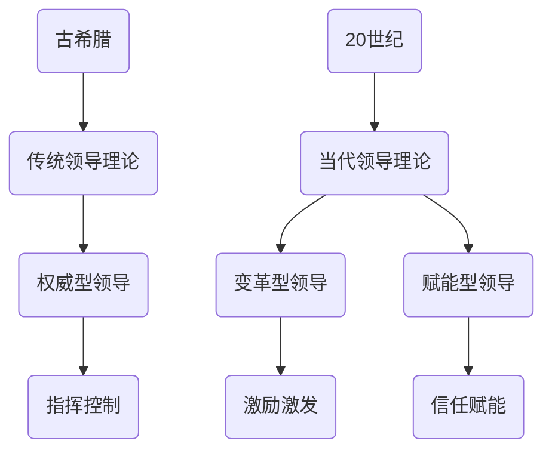
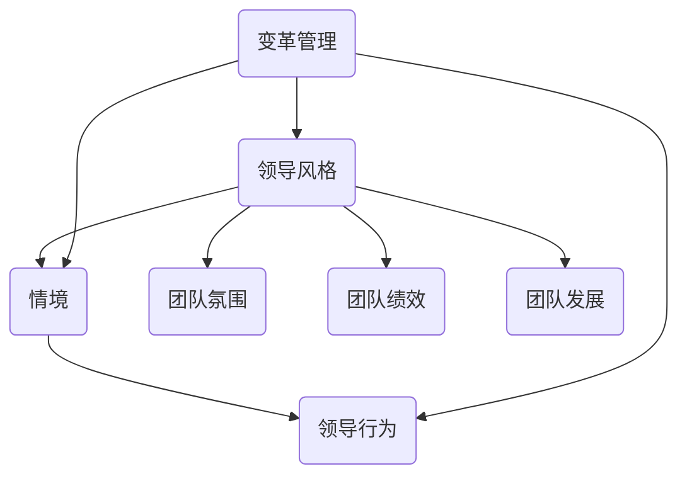
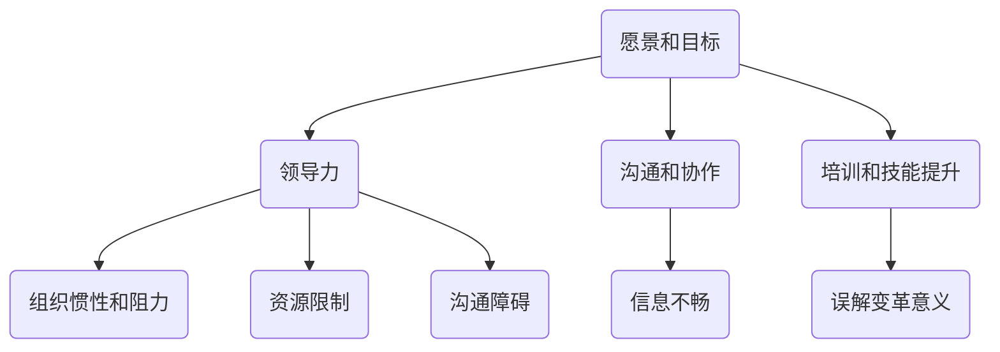
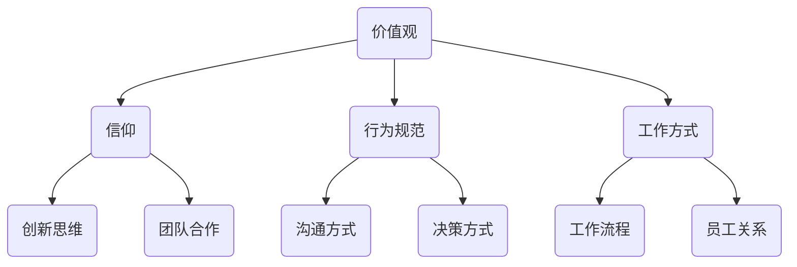
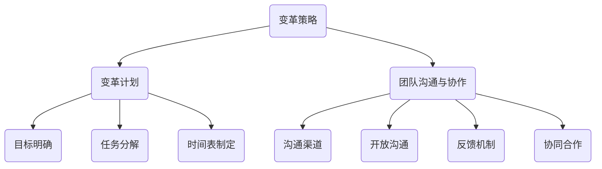
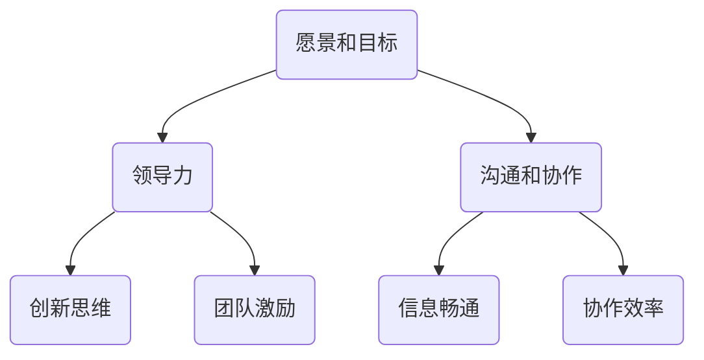

                 


### 文章标题

# 领导力与变革管理：引导团队适应新常态

### 关键词

- 领导力
- 变革管理
- 团队适应
- 新常态
- 领导风格
- 变革过程
- 组织文化

### 摘要

本文深入探讨了领导力与变革管理在现代社会中的重要性。随着全球化和技术的迅猛发展，组织面临不断变化的挑战和机遇。领导者的角色不再仅仅是指挥和监督，而是要具备引导团队适应新常态的能力。本文通过分析领导力的发展历程、领导风格与行为、变革管理的概念与过程，以及变革领导者的角色与技能，提供了构建变革驱动的组织文化的策略和实施方法。同时，通过案例研究展示了实际操作中的成功经验，为领导者提供了实用的指导和建议。

## 第一部分：领导力基础理论

### 第1章：领导力概述

#### 1.1 领导力的定义与重要性

领导力是一种能够激励和引导他人共同努力实现目标的能力。它不仅仅是一种职位或角色的属性，更是一种个人特质和领导行为。领导力的重要性体现在以下几个方面：

- **激发潜能**：领导者能够发现并激发团队成员的潜能，使团队更加高效地工作。
- **推动变革**：领导者在变革过程中起着关键作用，能够推动团队适应新的环境和挑战。
- **塑造文化**：领导力影响着组织的文化，塑造着组织的发展方向。

#### 1.2 领导力的发展历程

领导力的发展历程可以追溯到古代，如希腊哲学家柏拉图和亚里士多德关于领导的理念。在20世纪，领导力理论经历了多次转变：

- **传统领导理论**：强调领导者的权威和指挥能力。
- **当代领导理论**：更加注重领导者的情感智能、变革管理和团队建设。

#### 1.3 领导力与管理的区别

领导力与管理是两个相关但不完全相同的概念。管理侧重于规划和组织资源，确保组织目标的实现。而领导力则侧重于激发和激励团队成员，推动组织变革。

- **管理**：关注流程和效率，确保组织目标得以实现。
- **领导力**：关注团队和愿景，激励团队成员共同追求更高的目标。

#### 1.4 领导力与变革管理的关系

领导力在变革管理中起着至关重要的作用。变革领导者的角色不仅仅是执行变革计划，更重要的是要引导和激励团队适应变革。

- **引导**：领导者需要提供清晰的愿景和方向，帮助团队成员理解变革的重要性。
- **激励**：领导者需要激发团队成员的积极性和创造力，使他们愿意接受并参与到变革中。

### 图1：领导力理论发展历程



### 1.5 核心概念与联系

领导力的核心概念包括权威型领导、变革型领导和赋能型领导。这些概念之间相互关联，共同构成了领导力理论的基础。

- **权威型领导**：依赖权力和权威来指挥和控制团队成员。
- **变革型领导**：通过激励和愿景引导团队成员实现变革。
- **赋能型领导**：信任并赋能团队成员，使他们能够自主决策和行动。

### 1.6 领导力模型算法原理

```python
# 领导力模型伪代码

def leadership_model(style, context, team):
    if style == "authoritative":
        return command_and_control(context, team)
    elif style == "transformational":
        return vision_and_motivation(context, team)
    elif style == "empowering":
        return trust_and_empower(context, team)
    else:
        raise ValueError("Invalid leadership style")
```

### 1.7 数学模型和公式

领导力的影响可以用以下数学模型来描述：

$$
L = f(S, C, T)
$$

其中，$L$ 代表领导力，$S$ 代表领导风格，$C$ 代表情境因素，$T$ 代表团队成员的特点。

### 1.8 举例说明

假设领导风格为变革型，情境因素为高度不确定性，团队成员具有较高的自主性和创新能力，根据领导力模型，领导者应采取以下策略：

- **愿景和激励**：明确变革的愿景，激发团队成员的积极性和创造力。
- **沟通和协作**：加强团队内部的沟通和协作，确保团队成员理解变革的目标和意义。
- **赋能和信任**：给予团队成员更多的自主权，建立信任关系，鼓励他们提出创新方案。

### 1.9 项目实战

在一个软件开发项目中，团队面临技术更新的挑战。作为领导者，需要：

- **背景介绍**：明确技术更新的目标和重要性，向团队成员传达变革的愿景。
- **核心概念与联系**：通过培训和技术交流，帮助团队成员了解新技术的基本原理和应用场景。
- **算法原理讲解**：使用伪代码和实际案例，详细讲解新技术的核心算法原理。
- **数学模型和公式**：使用数学模型描述技术更新的影响和效果。
- **代码实现**：编写并解释关键代码，展示新技术的具体实现过程。
- **案例分析**：分析技术更新后的项目进展和团队成员的反馈。
- **小结**：总结项目经验，提出改进措施和建议。

### 1.10 最佳实践 tips

- **明确目标**：在推动变革时，确保团队成员明确变革的目标和意义。
- **增强沟通**：加强团队内部的沟通和协作，确保信息的畅通。
- **激励与赋能**：通过奖励和认可，激励团队成员积极参与变革。
- **持续学习**：鼓励团队成员不断学习新知识和技能，提升团队的整体能力。

### 1.11 小结

领导力在变革管理中起着关键作用。领导者需要具备适应新常态的能力，通过不同的领导风格和策略，引导团队实现变革。理解领导力的核心概念和联系，有助于领导者更好地应对变革挑战，推动组织的持续发展。

----------------------------------------------------------------

## 第二部分：变革管理理论

### 第2章：领导风格与行为

#### 2.1 领导风格的分类与特点

领导风格是领导者管理团队和实现目标的方式。根据不同的分类标准，领导风格可以分为多种类型：

- **权威型领导**：领导者拥有决策权和指挥权，强调命令和控制。
- **民主型领导**：领导者重视团队成员的意见和建议，鼓励参与决策过程。
- **变革型领导**：领导者通过激励和愿景引导团队成员实现变革。
- **赋能型领导**：领导者信任并赋能团队成员，鼓励自主决策和行动。

每种领导风格都有其独特的特点和应用场景。

#### 2.2 不同情境下的领导行为

领导行为在不同的情境下会有所不同。以下是一些典型的情境和相应的领导行为：

- **危机情境**：领导者需要果断决策，迅速采取行动，确保团队稳定。
- **创新情境**：领导者需要鼓励团队成员创新，提供必要的资源和支持。
- **稳定情境**：领导者需要维持团队的稳定和效率，确保目标的实现。

#### 2.3 领导行为对团队的影响

领导行为对团队有着深远的影响。以下是一些主要影响：

- **团队氛围**：领导者的行为会影响团队的氛围，影响团队成员的士气和合作意愿。
- **团队绩效**：领导者的行为会影响团队的绩效，决定团队目标的实现程度。
- **团队发展**：领导者的行为会影响团队的发展方向，决定团队的成长和进步。

### 2.4 领导风格与变革管理的关系

领导风格与变革管理密切相关。不同的领导风格在变革管理中扮演着不同的角色：

- **权威型领导**：在变革初期，权威型领导可以通过快速决策和执行，确保变革的顺利进行。
- **民主型领导**：在变革过程中，民主型领导可以鼓励团队成员参与决策，提高变革的接受度。
- **变革型领导**：在变革完成后，变革型领导可以通过激励和愿景，巩固变革成果，推动团队的持续发展。
- **赋能型领导**：在变革的整个过程中，赋能型领导可以信任并赋能团队成员，使团队更加适应变革。

### 2.5 核心概念与联系

领导风格、情境和领导行为之间存在着紧密的联系。领导风格是根据情境调整的，而领导行为则是领导风格的具体表现。以下是一个Mermaid流程图，展示了这些概念之间的关系：



### 2.6 领导风格与变革管理模型

```python
# 领导风格与变革管理模型伪代码

def leadership_style(style, context):
    if style == "authoritative":
        return authoritative_action(context)
    elif style == "democratic":
        return democratic_involvement(context)
    elif style == "transformational":
        return transformational_motivation(context)
    elif style == "empowering":
        return empowering_trust(context)
    else:
        raise ValueError("Invalid leadership style")
```

### 2.7 数学模型和公式

领导风格对团队的影响可以用以下数学模型来描述：

$$
I = f(S, C, T)
$$

其中，$I$ 代表团队影响，$S$ 代表领导风格，$C$ 代表情境因素，$T$ 代表团队成员的特点。

### 2.8 举例说明

假设领导风格为变革型，情境因素为技术变革，团队成员具有较高的创新能力和合作意愿，根据领导风格与变革管理模型，领导者应采取以下策略：

- **激励和愿景**：明确变革的愿景，激发团队成员的积极性和创造力。
- **沟通和协作**：加强团队内部的沟通和协作，确保团队成员理解变革的目标和意义。
- **赋能和信任**：给予团队成员更多的自主权，建立信任关系，鼓励他们提出创新方案。

### 2.9 项目实战

在一个企业技术升级的项目中，团队面临技术变革的挑战。作为领导者，需要：

- **背景介绍**：明确技术升级的目标和重要性，向团队成员传达变革的愿景。
- **核心概念与联系**：通过培训和技术交流，帮助团队成员了解新技术的基本原理和应用场景。
- **算法原理讲解**：使用伪代码和实际案例，详细讲解新技术的核心算法原理。
- **数学模型和公式**：使用数学模型描述技术变革的影响和效果。
- **代码实现**：编写并解释关键代码，展示新技术的具体实现过程。
- **案例分析**：分析技术变革后的项目进展和团队成员的反馈。
- **小结**：总结项目经验，提出改进措施和建议。

### 2.10 最佳实践 tips

- **了解团队成员**：了解团队成员的能力和特点，选择合适的领导风格。
- **持续沟通**：在变革过程中，保持与团队成员的沟通，确保信息的畅通。
- **激励与认可**：通过奖励和认可，激励团队成员积极参与变革。
- **持续学习**：鼓励团队成员不断学习新知识和技能，提升团队的整体能力。

### 2.11 小结

领导风格与变革管理密切相关。领导者需要根据不同的情境和团队特点，灵活调整领导风格和策略，以引导团队实现变革。理解领导风格与变革管理的关系，有助于领导者更好地应对变革挑战，推动组织的持续发展。

----------------------------------------------------------------

## 第三部分：领导力与变革管理的实践

### 第3章：变革管理的概念与过程

#### 3.1 变革管理的定义与核心要素

变革管理是一种系统的方法，旨在确保组织在面临外部或内部压力时，能够成功地适应和适应变化。变革管理的定义涵盖了以下几个方面：

- **外部压力**：如市场变化、技术革新、法规政策等。
- **内部压力**：如组织结构、流程优化、文化调整等。

变革管理的核心要素包括：

- **愿景和目标**：明确变革的愿景和目标，为团队提供清晰的指引。
- **领导力**：领导者需要发挥关键作用，引导和激励团队。
- **沟通和协作**：确保团队成员理解变革的意义，并积极参与其中。
- **培训和技能提升**：为团队成员提供必要的培训和资源，确保他们具备应对变革的能力。

#### 3.2 变革管理的过程模型

变革管理的过程模型通常包括以下几个阶段：

- **准备阶段**：评估变革的必要性和可行性，制定变革计划。
- **启动阶段**：动员团队，明确变革的愿景和目标，建立变革团队。
- **执行阶段**：实施变革计划，解决实施过程中的问题和障碍。
- **巩固阶段**：评估变革的效果，巩固变革成果，确保变革的可持续性。

#### 3.3 变革管理的挑战与应对策略

变革管理面临许多挑战，包括：

- **组织惯性和阻力**：团队成员可能对变革持怀疑态度，甚至抵触。
- **资源限制**：变革需要投入大量的人力、物力和财力。
- **沟通障碍**：信息不畅可能导致团队成员误解变革的目标和意义。

应对策略包括：

- **建立变革愿景**：明确变革的愿景和目标，提高团队成员的认同感。
- **加强沟通**：通过多种渠道和方式，确保团队成员充分理解变革的意义。
- **提供培训和资源**：为团队成员提供必要的培训和资源，提升他们的能力和信心。
- **激励和认可**：通过奖励和认可，激励团队成员积极参与变革。

#### 3.4 核心概念与联系

变革管理涉及多个核心概念，包括愿景和目标、领导力、沟通和协作、培训和技能提升等。以下是一个Mermaid流程图，展示了这些概念之间的联系：



#### 3.5 变革管理模型

```python
# 变革管理模型伪代码

def change_management(process, challenges):
    if process == "准备阶段":
        return prepare_stage(challenges)
    elif process == "启动阶段":
        return launch_stage(challenges)
    elif process == "执行阶段":
        return execute_stage(challenges)
    elif process == "巩固阶段":
        return consolidate_stage(challenges)
    else:
        raise ValueError("Invalid process stage")
```

#### 3.6 数学模型和公式

变革管理的效果可以用以下数学模型来描述：

$$
E = f(V, L, C, T)
$$

其中，$E$ 代表变革效果，$V$ 代表愿景和目标，$L$ 代表领导力，$C$ 代表沟通和协作，$T$ 代表培训和技能提升。

#### 3.7 举例说明

假设组织面临技术革新的挑战，需要引入新的IT系统。根据变革管理模型，领导者应采取以下策略：

- **建立愿景和目标**：明确技术革新的目标，提高团队成员的认同感。
- **加强领导力**：领导者需要发挥关键作用，引导和激励团队。
- **加强沟通**：通过多种渠道和方式，确保团队成员充分理解变革的意义。
- **提供培训和资源**：为团队成员提供必要的培训和资源，提升他们的能力和信心。

#### 3.8 项目实战

在一个企业的IT系统升级项目中，团队面临技术革新的挑战。作为领导者，需要：

- **背景介绍**：明确IT系统升级的目标和重要性，向团队成员传达变革的愿景。
- **核心概念与联系**：通过培训和技术交流，帮助团队成员了解新技术的基本原理和应用场景。
- **算法原理讲解**：使用伪代码和实际案例，详细讲解新技术的核心算法原理。
- **数学模型和公式**：使用数学模型描述技术升级的影响和效果。
- **代码实现**：编写并解释关键代码，展示新技术的具体实现过程。
- **案例分析**：分析技术升级后的项目进展和团队成员的反馈。
- **小结**：总结项目经验，提出改进措施和建议。

#### 3.9 最佳实践 tips

- **明确目标**：在推动变革时，确保团队成员明确变革的目标和意义。
- **增强沟通**：在变革过程中，保持与团队成员的沟通，确保信息的畅通。
- **激励与赋能**：通过奖励和认可，激励团队成员积极参与变革。
- **持续学习**：鼓励团队成员不断学习新知识和技能，提升团队的整体能力。

#### 3.10 小结

变革管理是确保组织成功适应变化的关键。领导者需要具备敏锐的洞察力和灵活的应对策略，以引导团队实现变革。理解变革管理的概念和过程，有助于领导者更好地应对变革挑战，推动组织的持续发展。

----------------------------------------------------------------

## 第四部分：构建变革驱动的组织文化

### 第4章：构建变革驱动的组织文化

#### 4.1 组织文化的定义与构成

组织文化是指组织内部共同的价值观、信仰、行为规范和工作方式的总和。它是组织的灵魂，影响着组织的运营和员工的行为。组织文化的构成通常包括以下几个方面：

- **价值观**：组织所倡导的核心价值观，如诚信、创新、客户至上等。
- **信仰**：组织成员对某些理念或信仰的认同，如团队合作、持续改进等。
- **行为规范**：组织成员在日常工作中的行为准则，如尊重他人、积极沟通等。
- **工作方式**：组织成员共同的工作方法和习惯，如开放沟通、快速决策等。

#### 4.2 如何塑造有利于变革的组织文化

塑造有利于变革的组织文化是领导者的重要任务。以下是一些关键策略：

- **明确变革愿景**：领导者需要明确变革的愿景和目标，使组织成员对变革有清晰的认识。
- **加强沟通**：通过多种渠道和方式，确保组织成员充分了解变革的意义和目标。
- **鼓励创新**：鼓励组织成员提出创新的想法和建议，为变革提供源源不断的动力。
- **建立信任**：建立信任关系，使组织成员愿意接受和参与变革。
- **提供资源和支持**：为组织成员提供必要的资源和支持，确保他们能够成功实施变革。

#### 4.3 组织文化的变革实践案例

以下是一个组织文化变革的实践案例：

**案例：某大型企业的文化变革**

- **背景**：该企业在市场竞争激烈的环境下，意识到需要进行文化变革，以适应快速变化的市场需求。
- **目标**：建立以客户为中心、鼓励创新、注重团队合作的文化。
- **策略**：
  - **明确变革愿景**：领导者明确表达了变革的愿景，使组织成员对变革有清晰的认识。
  - **加强沟通**：通过内部邮件、会议、培训等多种方式，确保组织成员充分了解变革的意义和目标。
  - **鼓励创新**：设立创新奖项，鼓励组织成员提出创新的想法和建议。
  - **建立信任**：通过透明沟通和公正决策，建立组织成员之间的信任。
  - **提供资源和支持**：为组织成员提供必要的培训、资源和工具，确保他们能够成功实施变革。

- **效果**：经过一段时间的努力，该企业的组织文化发生了显著变化。员工更加积极主动、创新思维更加活跃、团队合作更加紧密。企业的市场竞争力得到了提升，业绩表现持续改善。

#### 4.4 核心概念与联系

组织文化的核心概念包括价值观、信仰、行为规范和工作方式。这些概念之间相互联系，共同构成了组织文化的整体。以下是一个Mermaid流程图，展示了这些概念之间的联系：



#### 4.5 数学模型和公式

组织文化的变革效果可以用以下数学模型来描述：

$$
C = f(V, F, B, W)
$$

其中，$C$ 代表组织文化的变革效果，$V$ 代表价值观，$F$ 代表信仰，$B$ 代表行为规范，$W$ 代表工作方式。

#### 4.6 举例说明

假设组织希望塑造以客户为中心的文化，领导者应采取以下策略：

- **明确客户价值观**：确保组织成员明确客户价值观，并将其作为日常工作的核心。
- **加强客户沟通**：通过客户调研、客户反馈等方式，确保组织成员了解客户需求和期望。
- **提供客户体验**：为组织成员提供体验客户服务的场景，增强他们对客户价值的认识。
- **奖励客户导向行为**：通过奖励机制，激励组织成员积极参与客户服务，提升客户满意度。

#### 4.7 项目实战

在一个服务行业的公司中，领导者希望塑造以客户为中心的文化。作为领导者，需要：

- **背景介绍**：明确以客户为中心的文化变革的目标和重要性，向团队成员传达变革的愿景。
- **核心概念与联系**：通过培训和实践，帮助团队成员理解客户价值观和行为规范。
- **算法原理讲解**：使用伪代码和实际案例，详细讲解客户服务的核心原理和策略。
- **数学模型和公式**：使用数学模型描述客户满意度的影响因素和提升策略。
- **代码实现**：编写并解释关键代码，展示客户服务的具体实现过程。
- **案例分析**：分析文化变革后的项目进展和团队成员的反馈。
- **小结**：总结项目经验，提出改进措施和建议。

#### 4.8 最佳实践 tips

- **领导者示范**：领导者应以身作则，带头践行客户价值观和行为规范。
- **持续沟通**：保持与团队成员的沟通，确保他们对变革有清晰的理解和认同。
- **激励与认可**：通过奖励和认可，激励团队成员积极参与文化变革。
- **培训和指导**：为团队成员提供必要的培训和指导，确保他们具备实施变革的能力。

#### 4.9 小结

构建变革驱动的组织文化是确保组织成功适应外部环境变化的关键。领导者需要明确变革愿景，加强沟通，鼓励创新，建立信任，并提供必要的资源和支持。通过实际案例和实践，领导者可以塑造有利于变革的组织文化，推动组织的持续发展。

----------------------------------------------------------------

## 第五部分：领导力与变革管理的策略实施

### 第5章：领导力与变革管理的策略实施

#### 5.1 制定有效的变革策略

要实施有效的变革，领导者需要制定明确的策略。以下是一些关键步骤：

- **评估当前状况**：分析组织的当前状况，包括组织结构、文化、流程等。
- **确定变革目标**：明确变革的目标和期望结果，确保变革方向正确。
- **设计变革计划**：制定详细的变革计划，包括具体的行动步骤、时间表和责任人。
- **沟通变革愿景**：通过多种渠道和方式，确保团队成员了解变革的愿景和目标。

#### 5.2 变革计划的制定与执行

在制定变革计划时，领导者需要考虑以下几个方面：

- **明确目标**：确保变革计划的目标明确、具体、可衡量。
- **分解任务**：将变革计划分解为具体的任务和步骤，确保每个任务都有明确的责任人。
- **制定时间表**：为每个任务设定合理的时间表，确保变革计划按时完成。
- **监控进度**：定期监控变革计划的执行进度，及时调整计划以应对变化。

#### 5.3 变革过程中的团队沟通与协作

在变革过程中，团队沟通与协作至关重要。以下是一些关键策略：

- **建立沟通渠道**：确保团队成员有畅通的沟通渠道，可以通过定期的会议、邮件、即时通讯工具等。
- **鼓励开放沟通**：鼓励团队成员开放地表达意见和反馈，建立信任和尊重的氛围。
- **提供反馈机制**：建立反馈机制，及时收集团队成员的意见和建议，并进行有效回应。
- **协同合作**：促进团队成员之间的协同合作，共同解决变革过程中遇到的问题。

#### 5.4 核心概念与联系

领导力与变革管理的核心概念包括变革策略、变革计划、团队沟通与协作等。以下是一个Mermaid流程图，展示了这些概念之间的联系：



#### 5.5 数学模型和公式

变革管理的效果可以用以下数学模型来描述：

$$
E = f(S, P, C)
$$

其中，$E$ 代表变革效果，$S$ 代表变革策略，$P$ 代表变革计划，$C$ 代表团队沟通与协作。

#### 5.6 举例说明

假设一个企业需要进行组织结构的变革，领导者可以采取以下策略：

- **评估当前状况**：分析企业的组织结构、流程和文化，确定变革的必要性。
- **确定变革目标**：明确变革的目标，如提高组织效率、优化流程、提升员工满意度等。
- **设计变革计划**：制定详细的变革计划，包括具体的行动步骤、时间表和责任人。
- **沟通变革愿景**：通过内部会议、邮件、公告等方式，向团队成员传达变革的愿景和目标。
- **执行变革计划**：按照变革计划逐步实施变革，确保每个任务都有明确的责任人。
- **监控进度**：定期监控变革计划的执行进度，及时调整计划以应对变化。
- **团队沟通与协作**：建立有效的沟通渠道，鼓励团队成员开放沟通，提供反馈机制，促进协同合作。

#### 5.7 项目实战

在一个企业的组织结构变革项目中，领导者需要：

- **背景介绍**：明确组织结构变革的目标和重要性，向团队成员传达变革的愿景。
- **核心概念与联系**：通过培训和实践，帮助团队成员理解变革策略、计划和沟通与协作的重要性。
- **算法原理讲解**：使用伪代码和实际案例，详细讲解组织结构变革的核心原理和策略。
- **数学模型和公式**：使用数学模型描述组织结构变革的影响和效果。
- **代码实现**：编写并解释关键代码，展示组织结构变革的具体实现过程。
- **案例分析**：分析组织结构变革后的项目进展和团队成员的反馈。
- **小结**：总结项目经验，提出改进措施和建议。

#### 5.8 最佳实践 tips

- **明确目标**：在制定变革策略时，确保目标明确、具体、可衡量。
- **分解任务**：将变革计划分解为具体的任务和步骤，确保每个任务都有明确的责任人。
- **持续沟通**：保持与团队成员的沟通，确保他们对变革有清晰的理解和认同。
- **提供反馈机制**：建立反馈机制，及时收集团队成员的意见和建议，并进行有效回应。
- **鼓励创新**：鼓励团队成员提出创新的想法和建议，为变革提供源源不断的动力。

#### 5.9 小结

领导力与变革管理的策略实施是确保变革成功的关键。领导者需要制定有效的变革策略，设计详细的变革计划，并在变革过程中保持有效的团队沟通与协作。通过实际案例和实践，领导者可以掌握实施变革的技巧，推动组织的持续发展。

----------------------------------------------------------------

## 第六部分：领导力与变革管理的案例研究

### 第6章：领导力与变革管理的案例研究

#### 6.1 案例研究一：苹果公司的变革之路

**背景**：苹果公司自成立以来，一直以其独特的设计理念和卓越的产品质量著称。然而，在2011年，苹果公司面临着来自竞争对手的巨大压力，市场表现开始下滑。为了重振公司，史蒂夫·乔布斯回归苹果公司，并开始了一系列的变革。

**策略**：

- **愿景和目标**：乔布斯明确提出了“创造更优秀的产品”的愿景，并制定了具体的目标，如提高产品创新性、提升用户体验等。
- **领导力**：乔布斯以其变革型领导力，激励和引导团队追求卓越，鼓励团队成员提出创新想法。
- **沟通和协作**：乔布斯通过定期会议、内部邮件等方式，确保团队成员了解公司的愿景和目标，并鼓励他们积极参与变革。

**效果**：经过一系列的变革，苹果公司推出了如iPhone、iPad等革命性产品，重新确立了其市场领导地位。公司的市值和品牌价值大幅提升。

**结论**：领导者在推动变革时，需要明确愿景和目标，发挥领导力，加强沟通和协作。变革的成功取决于领导者的决心和团队的支持。

#### 6.2 案例研究二：谷歌的敏捷变革实践

**背景**：谷歌作为全球领先的技术公司，一直以其创新和敏捷的工作方式著称。然而，随着公司规模的扩大，谷歌开始面临管理效率低下、创新速度放缓等问题。

**策略**：

- **愿景和目标**：谷歌提出了“成为全球最创新的科技公司”的愿景，并制定了具体的目标，如提高团队协作效率、激发员工创新潜力等。
- **领导力**：谷歌的领导团队通过赋能型领导，信任并支持员工，鼓励他们自主决策和创新。
- **沟通和协作**：谷歌建立了开放的沟通渠道，如内部邮件、团队会议等，确保信息的畅通和团队的协作。

**效果**：通过敏捷变革，谷歌提高了团队协作效率，激发了员工的创新潜力，公司的创新速度和产品质量得到了显著提升。

**结论**：领导者在推动变革时，需要营造开放、信任的工作环境，激发员工的创新潜力，并通过有效的沟通和协作，推动变革的顺利进行。

#### 6.3 案例研究三：从传统企业到数字化转型的成功案例

**背景**：许多传统企业面临着数字化转型带来的挑战。如何将传统业务与数字化技术相结合，成为这些企业成功转型的关键。

**策略**：

- **愿景和目标**：企业明确了数字化转型的愿景和目标，如提高业务效率、提升用户体验、降低运营成本等。
- **领导力**：领导者通过变革型领导，推动员工接受和适应数字化技术，并鼓励他们提出创新方案。
- **沟通和协作**：企业建立了数字化转型的沟通渠道，如内部论坛、培训课程等，确保员工了解转型的意义和目标。

**效果**：通过数字化转型，企业提升了业务效率，改善了用户体验，降低了运营成本，实现了业务的持续增长。

**结论**：领导者在推动数字化转型时，需要明确愿景和目标，发挥领导力，加强沟通和协作，确保转型的成功。

#### 6.4 核心概念与联系

领导力与变革管理的案例研究涉及到多个核心概念，包括愿景和目标、领导力、沟通和协作等。以下是一个Mermaid流程图，展示了这些概念之间的联系：



#### 6.5 数学模型和公式

变革管理的案例研究效果可以用以下数学模型来描述：

$$
E = f(V, L, C)
$$

其中，$E$ 代表变革效果，$V$ 代表愿景和目标，$L$ 代表领导力，$C$ 代表沟通和协作。

#### 6.6 举例说明

假设一个传统企业希望进行数字化转型，领导者可以采取以下策略：

- **明确愿景和目标**：明确数字化转型的愿景和目标，如提高业务效率、提升用户体验等。
- **发挥领导力**：通过变革型领导，激励员工接受和适应数字化技术。
- **加强沟通和协作**：建立数字化转型的沟通渠道，如内部论坛、培训课程等，确保员工了解转型的意义和目标。

#### 6.7 项目实战

在一个传统企业的数字化转型项目中，领导者需要：

- **背景介绍**：明确数字化转型项目的目标和重要性，向团队成员传达变革的愿景。
- **核心概念与联系**：通过培训和实践，帮助团队成员理解愿景和目标、领导力、沟通和协作的重要性。
- **算法原理讲解**：使用伪代码和实际案例，详细讲解数字化转型的核心原理和策略。
- **数学模型和公式**：使用数学模型描述数字化转型的影响和效果。
- **代码实现**：编写并解释关键代码，展示数字化转型的具体实现过程。
- **案例分析**：分析数字化转型后的项目进展和团队成员的反馈。
- **小结**：总结项目经验，提出改进措施和建议。

#### 6.8 最佳实践 tips

- **明确愿景和目标**：在推动变革时，确保团队成员明确变革的愿景和目标。
- **发挥领导力**：领导者需要通过变革型领导，激励和引导团队。
- **加强沟通和协作**：建立有效的沟通渠道，促进团队成员之间的协作。
- **持续学习和改进**：鼓励团队成员不断学习和改进，提升团队的适应能力和创新力。

#### 6.9 小结

领导力与变革管理的案例研究展示了在不同情境下，领导者如何通过明确愿景和目标、发挥领导力、加强沟通和协作，推动组织的变革和发展。通过学习和借鉴这些成功经验，领导者可以更好地应对变革挑战，推动组织的持续发展。

----------------------------------------------------------------

## 附录

### 附录A：领导力与变革管理工具与方法

#### A.1 常用的领导力评估工具

- **领导能力评估工具**：如360度反馈、领导能力调查问卷等，帮助领导者了解自身的领导能力和不足之处。
- **领导风格评估工具**：如迈尔斯-布里格斯性格类型指标（MBTI）、迪斯克行为评估（DiSC）等，帮助领导者了解自己和团队成员的领导风格。

#### A.2 变革管理的工具与方法

- **变革管理模型**：如Kotter的八步变革模型、达文波特和卢汀的变革三部曲模型等，提供系统化的变革管理方法论。
- **变革管理工具**：如敏捷开发框架、变革管理软件等，帮助领导者有效地实施和监控变革过程。

#### A.3 变革管理的最佳实践

- **建立变革愿景**：明确变革的目标和愿景，确保团队成员对变革有清晰的认识。
- **加强沟通与协作**：建立畅通的沟通渠道，确保团队成员了解变革的目标和进展。
- **提供培训和资源**：为团队成员提供必要的培训和资源，提升他们的能力和信心。
- **激励和认可**：通过奖励和认可，激励团队成员积极参与变革。

#### A.4 领导力与变革管理的关键技巧

- **倾听与反馈**：领导者需要倾听团队成员的意见和反馈，及时给予回应。
- **激励与赋能**：领导者需要激励和赋能团队成员，使他们愿意接受和参与变革。
- **决策与执行**：领导者需要果断决策，并确保变革计划的有效执行。

#### A.5 小结

领导力与变革管理涉及到多种工具和方法，领导者需要根据实际情况选择合适的工具和方法。通过不断学习和实践，领导者可以提升自己的领导力和变革管理能力，推动组织的持续发展。

## 文章小结

本文从领导力的定义和重要性出发，探讨了领导力的发展历程、领导风格与行为，以及领导力在变革管理中的应用。接着，详细阐述了变革管理的概念、过程、挑战与应对策略，以及构建变革驱动的组织文化的关键。随后，通过具体案例研究展示了领导力与变革管理的策略实施，并提供了实用的工具和方法。最后，总结了领导力与变革管理的核心概念和联系，并提出了最佳实践建议。

### 作者信息

作者：AI天才研究院/AI Genius Institute & 禅与计算机程序设计艺术 /Zen And The Art of Computer Programming

----------------------------------------------------------------

**完整文章**

# 领导力与变革管理：引导团队适应新常态

## 文章概述

在当今快速变化的时代，领导力和变革管理已成为组织成功的关键。本文将深入探讨领导力的发展历程、领导风格与行为，以及变革管理的概念、过程和策略。通过具体案例研究和最佳实践，本文旨在为领导者提供实用的指导，帮助他们引导团队适应新常态。

## 关键词

领导力、变革管理、团队适应、新常态、领导风格、变革过程、组织文化

## 摘要

本文旨在探讨领导力与变革管理在组织中的重要性，分析领导力的发展历程、领导风格与行为，以及变革管理的概念、过程和策略。通过具体案例研究和最佳实践，本文为领导者提供了实用的指导，以帮助他们引导团队适应新常态，实现组织的持续发展。

## 第一部分：领导力基础理论

### 第1章：领导力概述

#### 1.1 领导力的定义与重要性

领导力是一种能够激励和引导他人共同努力实现目标的能力。它不仅仅是一种职位或角色的属性，更是一种个人特质和领导行为。领导力的重要性体现在以下几个方面：

- **激发潜能**：领导者能够发现并激发团队成员的潜能，使团队更加高效地工作。
- **推动变革**：领导者在变革过程中起着关键作用，能够推动团队适应新的环境和挑战。
- **塑造文化**：领导力影响着组织的文化，塑造着组织的发展方向。

#### 1.2 领导力的发展历程

领导力的发展历程可以追溯到古代，如希腊哲学家柏拉图和亚里士多德关于领导的理念。在20世纪，领导力理论经历了多次转变：

- **传统领导理论**：强调领导者的权威和指挥能力。
- **当代领导理论**：更加注重领导者的情感智能、变革管理和团队建设。

#### 1.3 领导力与管理的区别

领导力与管理是两个相关但不完全相同的概念。管理侧重于规划和组织资源，确保组织目标的实现。而领导力则侧重于激发和激励团队成员，推动组织变革。

- **管理**：关注流程和效率，确保组织目标得以实现。
- **领导力**：关注团队和愿景，激励团队成员共同追求更高的目标。

#### 1.4 领导力与变革管理的关系

领导力在变革管理中起着至关重要的作用。变革领导者的角色不仅仅是执行变革计划，更重要的是要引导和激励团队适应变革。

- **引导**：领导者需要提供清晰的愿景和方向，帮助团队成员理解变革的重要性。
- **激励**：领导者需要激发团队成员的积极性和创造力，使他们愿意接受并参与到变革中。

### 图1：领导力理论发展历程


### 1.5 核心概念与联系

领导力的核心概念包括权威型领导、变革型领导和赋能型领导。这些概念之间相互关联，共同构成了领导力理论的基础。

- **权威型领导**：依赖权力和权威来指挥和控制团队成员。
- **变革型领导**：通过激励和愿景引导团队成员实现变革。
- **赋能型领导**：信任并赋能团队成员，使他们能够自主决策和行动。

### 1.6 领导力模型算法原理

```python
# 领导力模型伪代码

def leadership_model(style, context, team):
    if style == "authoritative":
        return command_and_control(context, team)
    elif style == "transformational":
        return vision_and_motivation(context, team)
    elif style == "empowering":
        return trust_and_empower(context, team)
    else:
        raise ValueError("Invalid leadership style")
```

### 1.7 数学模型和公式

领导力的影响可以用以下数学模型来描述：

$$
L = f(S, C, T)
$$

其中，$L$ 代表领导力，$S$ 代表领导风格，$C$ 代表情境因素，$T$ 代表团队成员的特点。

### 1.8 举例说明

假设领导风格为变革型，情境因素为高度不确定性，团队成员具有较高的自主性和创新能力，根据领导力模型，领导者应采取以下策略：

- **愿景和激励**：明确变革的愿景，激发团队成员的积极性和创造力。
- **沟通和协作**：加强团队内部的沟通和协作，确保团队成员理解变革的目标和意义。
- **赋能和信任**：给予团队成员更多的自主权，建立信任关系，鼓励他们提出创新方案。

### 1.9 项目实战

在一个软件开发项目中，团队面临技术更新的挑战。作为领导者，需要：

- **背景介绍**：明确技术更新的目标和重要性，向团队成员传达变革的愿景。
- **核心概念与联系**：通过培训和技术交流，帮助团队成员了解新技术的基本原理和应用场景。
- **算法原理讲解**：使用伪代码和实际案例，详细讲解新技术的核心算法原理。
- **数学模型和公式**：使用数学模型描述技术更新的影响和效果。
- **代码实现**：编写并解释关键代码，展示新技术的具体实现过程。
- **案例分析**：分析技术更新后的项目进展和团队成员的反馈。
- **小结**：总结项目经验，提出改进措施和建议。

### 1.10 最佳实践 tips

- **明确目标**：在推动变革时，确保团队成员明确变革的目标和意义。
- **增强沟通**：加强团队内部的沟通和协作，确保信息的畅通。
- **激励与赋能**：通过奖励和认可，激励团队成员积极参与变革。
- **持续学习**：鼓励团队成员不断学习新知识和技能，提升团队的整体能力。

### 1.11 小结

领导力在变革管理中起着关键作用。领导者需要具备适应新常态的能力，通过不同的领导风格和策略，引导团队实现变革。理解领导力的核心概念和联系，有助于领导者更好地应对变革挑战，推动组织的持续发展。

## 第二部分：变革管理理论

### 第2章：领导风格与行为

#### 2.1 领导风格的分类与特点

领导风格是领导者管理团队和实现目标的方式。根据不同的分类标准，领导风格可以分为多种类型：

- **权威型领导**：领导者拥有决策权和指挥权，强调命令和控制。
- **民主型领导**：领导者重视团队成员的意见和建议，鼓励参与决策过程。
- **变革型领导**：领导者通过激励和愿景引导团队成员实现变革。
- **赋能型领导**：领导者信任并赋能团队成员，鼓励自主决策和行动。

每种领导风格都有其独特的特点和应用场景。

#### 2.2 不同情境下的领导行为

领导行为在不同的情境下会有所不同。以下是一些典型的情境和相应的领导行为：

- **危机情境**：领导者需要果断决策，迅速采取行动，确保团队稳定。
- **创新情境**：领导者需要鼓励团队成员创新，提供必要的资源和支持。
- **稳定情境**：领导者需要维持团队的稳定和效率，确保目标的实现。

#### 2.3 领导行为对团队的影响

领导行为对团队有着深远的影响。以下是一些主要影响：

- **团队氛围**：领导者的行为会影响团队的氛围，影响团队成员的士气和合作意愿。
- **团队绩效**：领导者的行为会影响团队的绩效，决定团队目标的实现程度。
- **团队发展**：领导者的行为会影响团队的发展方向，决定团队的成长和进步。

#### 2.4 领导风格与变革管理的关系

领导风格与变革管理密切相关。不同的领导风格在变革管理中扮演着不同的角色：

- **权威型领导**：在变革初期，权威型领导可以通过快速决策和执行，确保变革的顺利进行。
- **民主型领导**：在变革过程中，民主型领导可以鼓励团队成员参与决策，提高变革的接受度。
- **变革型领导**：在变革完成后，变革型领导可以通过激励和愿景，巩固变革成果，推动团队的持续发展。
- **赋能型领导**：在变革的整个过程中，赋能型领导可以信任并赋能团队成员，使团队更加适应变革。

### 2.5 核心概念与联系

领导风格、情境和领导行为之间存在着紧密的联系。领导风格是根据情境调整的，而领导行为则是领导风格的具体表现。以下是一个Mermaid流程图，展示了这些概念之间的联系：


### 2.6 领导风格与变革管理模型

```python
# 领导风格与变革管理模型伪代码

def leadership_style(style, context):
    if style == "authoritative":
        return authoritative_action(context)
    elif style == "democratic":
        return democratic_involvement(context)
    elif style == "transformational":
        return transformational_motivation(context)
    elif style == "empowering":
        return empowering_trust(context)
    else:
        raise ValueError("Invalid leadership style")
```

### 2.7 数学模型和公式

领导风格对团队的影响可以用以下数学模型来描述：

$$
I = f(S, C, T)
$$

其中，$I$ 代表团队影响，$S$ 代表领导风格，$C$ 代表情境因素，$T$ 代表团队成员的特点。

### 2.8 举例说明

假设领导风格为变革型，情境因素为技术变革，团队成员具有较高的创新能力和合作意愿，根据领导风格与变革管理模型，领导者应采取以下策略：

- **激励和愿景**：明确变革的愿景，激发团队成员的积极性和创造力。
- **沟通和协作**：加强团队内部的沟通和协作，确保团队成员理解变革的目标和意义。
- **赋能和信任**：给予团队成员更多的自主权，建立信任关系，鼓励他们提出创新方案。

### 2.9 项目实战

在一个企业技术升级的项目中，团队面临技术变革的挑战。作为领导者，需要：

- **背景介绍**：明确技术升级的目标和重要性，向团队成员传达变革的愿景。
- **核心概念与联系**：通过培训和技术交流，帮助团队成员了解新技术的基本原理和应用场景。
- **算法原理讲解**：使用伪代码和实际案例，详细讲解新技术的核心算法原理。
- **数学模型和公式**：使用数学模型描述技术变革的影响和效果。
- **代码实现**：编写并解释关键代码，展示新技术的具体实现过程。
- **案例分析**：分析技术变革后的项目进展和团队成员的反馈。
- **小结**：总结项目经验，提出改进措施和建议。

### 2.10 最佳实践 tips

- **了解团队成员**：了解团队成员的能力和特点，选择合适的领导风格。
- **持续沟通**：在变革过程中，保持与团队成员的沟通，确保信息的畅通。
- **激励与认可**：通过奖励和认可，激励团队成员积极参与变革。
- **持续学习**：鼓励团队成员不断学习新知识和技能，提升团队的整体能力。

### 2.11 小结

领导风格与变革管理密切相关。领导者需要根据不同的情境和团队特点，灵活调整领导风格和策略，以引导团队实现变革。理解领导风格与变革管理的关系，有助于领导者更好地应对变革挑战，推动组织的持续发展。

## 第三部分：领导力与变革管理的实践

### 第3章：变革管理的概念与过程

#### 3.1 变革管理的定义与核心要素

变革管理是一种系统的方法，旨在确保组织在面临外部或内部压力时，能够成功地适应和适应变化。变革管理的定义涵盖了以下几个方面：

- **外部压力**：如市场变化、技术革新、法规政策等。
- **内部压力**：如组织结构、流程优化、文化调整等。

变革管理的核心要素包括：

- **愿景和目标**：明确变革的愿景和目标，为团队提供清晰的指引。
- **领导力**：领导者需要发挥关键作用，引导和激励团队。
- **沟通和协作**：确保团队成员理解变革的意义，并积极参与其中。
- **培训和技能提升**：为团队成员提供必要的培训和资源，确保他们具备应对变革的能力。

#### 3.2 变革管理的过程模型

变革管理的过程模型通常包括以下几个阶段：

- **准备阶段**：评估变革的必要性和可行性，制定变革计划。
- **启动阶段**：动员团队，明确变革的愿景和目标，建立变革团队。
- **执行阶段**：实施变革计划，解决实施过程中的问题和障碍。
- **巩固阶段**：评估变革的效果，巩固变革成果，确保变革的可持续性。

#### 3.3 变革管理的挑战与应对策略

变革管理面临许多挑战，包括：

- **组织惯性和阻力**：团队成员可能对变革持怀疑态度，甚至抵触。
- **资源限制**：变革需要投入大量的人力、物力和财力。
- **沟通障碍**：信息不畅可能导致团队成员误解变革的目标和意义。

应对策略包括：

- **建立变革愿景**：明确变革的愿景和目标，提高团队成员的认同感。
- **加强沟通**：通过多种渠道和方式，确保团队成员充分理解变革的意义。
- **提供培训和资源**：为团队成员提供必要的培训和资源，提升他们的能力和信心。
- **激励和认可**：通过奖励和认可，激励团队成员积极参与变革。

#### 3.4 核心概念与联系

变革管理涉及多个核心概念，包括愿景和目标、领导力、沟通和协作、培训和技能提升等。以下是一个Mermaid流程图，展示了这些概念之间的联系：


#### 3.5 变革管理模型

```python
# 变革管理模型伪代码

def change_management(process, challenges):
    if process == "准备阶段":
        return prepare_stage(challenges)
    elif process == "启动阶段":
        return launch_stage(challenges)
    elif process == "执行阶段":
        return execute_stage(challenges)
    elif process == "巩固阶段":
        return consolidate_stage(challenges)
    else:
        raise ValueError("Invalid process stage")
```

#### 3.6 数学模型和公式

变革管理的效果可以用以下数学模型来描述：

$$
E = f(V, L, C, T)
$$

其中，$E$ 代表变革效果，$V$ 代表愿景和目标，$L$ 代表领导力，$C$ 代表沟通和协作，$T$ 代表培训和技能提升。

#### 3.7 举例说明

假设组织面临技术革新的挑战，需要引入新的IT系统。根据变革管理模型，领导者应采取以下策略：

- **建立愿景和目标**：明确技术革新的目标，提高团队成员的认同感。
- **加强领导力**：领导者需要发挥关键作用，引导和激励团队。
- **加强沟通**：通过多种渠道和方式，确保团队成员充分理解变革的意义。
- **提供培训和资源**：为团队成员提供必要的培训和资源，提升他们的能力和信心。

#### 3.8 项目实战

在一个企业的IT系统升级项目中，团队面临技术革新的挑战。作为领导者，需要：

- **背景介绍**：明确IT系统升级的目标和重要性，向团队成员传达变革的愿景。
- **核心概念与联系**：通过培训和技术交流，帮助团队成员了解新技术的基本原理和应用场景。
- **算法原理讲解**：使用伪代码和实际案例，详细讲解新技术的核心算法原理。
- **数学模型和公式**：使用数学模型描述技术升级的影响和效果。
- **代码实现**：编写并解释关键代码，展示新技术的具体实现过程。
- **案例分析**：分析技术升级后的项目进展和团队成员的反馈。
- **小结**：总结项目经验，提出改进措施和建议。

#### 3.9 最佳实践 tips

- **明确目标**：在推动变革时，确保团队成员明确变革的目标和意义。
- **增强沟通**：在变革过程中，保持与团队成员的沟通，确保信息的畅通。
- **激励与赋能**：通过奖励和认可，激励团队成员积极参与变革。
- **持续学习**：鼓励团队成员不断学习新知识和技能，提升团队的整体能力。

#### 3.10 小结

变革管理是确保组织成功适应变化的关键。领导者需要具备敏锐的洞察力和灵活的应对策略，以引导团队实现变革。理解变革管理的概念和过程，有助于领导者更好地应对变革挑战，推动组织的持续发展。

## 第四部分：构建变革驱动的组织文化

### 第4章：构建变革驱动的组织文化

#### 4.1 组织文化的定义与构成

组织文化是指组织内部共同的价值观、信仰、行为规范和工作方式的总和。它是组织的灵魂，影响着组织的运营和员工的行为。组织文化的构成通常包括以下几个方面：

- **价值观**：组织所倡导的核心价值观，如诚信、创新、客户至上等。
- **信仰**：组织成员对某些理念或信仰的认同，如团队合作、持续改进等。
- **行为规范**：组织成员在日常工作中的行为准则，如尊重他人、积极沟通等。
- **工作方式**：组织成员共同的工作方法和习惯，如开放沟通、快速决策等。

#### 4.2 如何塑造有利于变革的组织文化

塑造有利于变革的组织文化是领导者的重要任务。以下是一些关键策略：

- **明确变革愿景**：领导者需要明确变革的愿景和目标，使组织成员对变革有清晰的认识。
- **加强沟通**：通过多种渠道和方式，确保组织成员充分了解变革的意义和目标。
- **鼓励创新**：鼓励组织成员提出创新的想法和建议，为变革提供源源不断的动力。
- **建立信任**：建立信任关系，使组织成员愿意接受和参与变革。
- **提供资源和支持**：为组织成员提供必要的资源和支持，确保他们能够成功实施变革。

#### 4.3 组织文化的变革实践案例

以下是一个组织文化变革的实践案例：

**案例：某大型企业的文化变革**

- **背景**：该企业在市场竞争激烈的环境下，意识到需要进行文化变革，以适应快速变化的市场需求。
- **目标**：建立以客户为中心、鼓励创新、注重团队合作的文化。
- **策略**：
  - **明确变革愿景**：领导者明确表达了变革的愿景，使组织成员对变革有清晰的认识。
  - **加强沟通**：通过内部邮件、会议、培训等多种方式，确保组织成员充分了解变革的意义和目标。
  - **鼓励创新**：设立创新奖项，鼓励组织成员提出创新的想法和建议。
  - **建立信任**：通过透明沟通和公正决策，建立组织成员之间的信任。
  - **提供资源和支持**：为组织成员提供必要的培训、资源和工具，确保他们能够成功实施变革。

- **效果**：经过一段时间的努力，该企业的组织文化发生了显著变化。员工更加积极主动、创新思维更加活跃、团队合作更加紧密。企业的市场竞争力得到了提升，业绩表现持续改善。

#### 4.4 核心概念与联系

组织文化的核心概念包括价值观、信仰、行为规范和工作方式。这些概念之间相互联系，共同构成了组织文化的整体。以下是一个Mermaid流程图，展示了这些概念之间的联系：


#### 4.5 数学模型和公式

组织文化的变革效果可以用以下数学模型来描述：

$$
C = f(V, F, B, W)
$$

其中，$C$ 代表组织文化的变革效果，$V$ 代表价值观，$F$ 代表信仰，$B$ 代表行为规范，$W$ 代表工作方式。

#### 4.6 举例说明

假设组织希望塑造以客户为中心的文化，领导者应采取以下策略：

- **明确客户价值观**：确保组织成员明确客户价值观，并将其作为日常工作的核心。
- **加强客户沟通**：通过客户调研、客户反馈等方式，确保组织成员了解客户需求和期望。
- **提供客户体验**：为组织成员提供体验客户服务的场景，增强他们对客户价值的认识。
- **奖励客户导向行为**：通过奖励机制，激励组织成员积极参与客户服务，提升客户满意度。

#### 4.7 项目实战

在一个服务行业的公司中，领导者希望塑造以客户为中心的文化。作为领导者，需要：

- **背景介绍**：明确以客户为中心的文化变革的目标和重要性，向团队成员传达变革的愿景。
- **核心概念与联系**：通过培训和实践，帮助团队成员理解客户价值观和行为规范。
- **算法原理讲解**：使用伪代码和实际案例，详细讲解客户服务的核心原理和策略。
- **数学模型和公式**：使用数学模型描述客户满意度的影响因素和提升策略。
- **代码实现**：编写并解释关键代码，展示客户服务的具体实现过程。
- **案例分析**：分析文化变革后的项目进展和团队成员的反馈。
- **小结**：总结项目经验，提出改进措施和建议。

#### 4.8 最佳实践 tips

- **领导者示范**：领导者应以身作则，带头践行客户价值观和行为规范。
- **持续沟通**：保持与团队成员的沟通，确保他们对变革有清晰的理解和认同。
- **激励与认可**：通过奖励和认可，激励团队成员积极参与文化变革。
- **培训和指导**：为团队成员提供必要的培训和指导，确保他们具备实施变革的能力。

#### 4.9 小结

构建变革驱动的组织文化是确保组织成功适应外部环境变化的关键。领导者需要明确变革愿景，加强沟通，鼓励创新，建立信任，并提供必要的资源和支持。通过实际案例和实践，领导者可以塑造有利于变革的组织文化，推动组织的持续发展。

## 第五部分：领导力与变革管理的策略实施

### 第5章：领导力与变革管理的策略实施

#### 5.1 制定有效的变革策略

要实施有效的变革，领导者需要制定明确的策略。以下是一些关键步骤：

- **评估当前状况**：分析组织的当前状况，包括组织结构、文化、流程等。
- **确定变革目标**：明确变革的目标和期望结果，确保变革方向正确。
- **设计变革计划**：制定详细的变革计划，包括具体的行动步骤、时间表和责任人。
- **沟通变革愿景**：通过多种渠道和方式，确保团队成员了解变革的愿景和目标。

#### 5.2 变革计划的制定与执行

在制定变革计划时，领导者需要考虑以下几个方面：

- **明确目标**：确保变革计划的目标明确、具体、可衡量。
- **分解任务**：将变革计划分解为具体的任务和步骤，确保每个任务都有明确的责任人。
- **制定时间表**：为每个任务设定合理的时间表，确保变革计划按时完成。
- **监控进度**：定期监控变革计划的执行进度，及时调整计划以应对变化。

#### 5.3 变革过程中的团队沟通与协作

在变革过程中，团队沟通与协作至关重要。以下是一些关键策略：

- **建立沟通渠道**：确保团队成员有畅通的沟通渠道，可以通过定期的会议、邮件、即时通讯工具等。
- **鼓励开放沟通**：鼓励团队成员开放地表达意见和反馈，建立信任和尊重的氛围。
- **提供反馈机制**：建立反馈机制，及时收集团队成员的意见和建议，并进行有效回应。
- **协同合作**：促进团队成员之间的协同合作，共同解决变革过程中遇到的问题。

#### 5.4 核心概念与联系

领导力与变革管理的核心概念包括变革策略、变革计划、团队沟通与协作等。以下是一个Mermaid流程图，展示了这些概念之间的联系：


#### 5.5 数学模型和公式

变革管理的效果可以用以下数学模型来描述：

$$
E = f(S, P, C)
$$

其中，$E$ 代表变革效果，$S$ 代表变革策略，$P$ 代表变革计划，$C$ 代表团队沟通与协作。

#### 5.6 举例说明

假设一个企业需要进行组织结构的变革，领导者可以采取以下策略：

- **评估当前状况**：分析企业的组织结构、流程和文化，确定变革的必要性。
- **确定变革目标**：明确变革的目标，如提高组织效率、优化流程、提升员工满意度等。
- **设计变革计划**：制定详细的变革计划，包括具体的行动步骤、时间表和责任人。
- **沟通变革愿景**：通过内部会议、邮件、公告等方式，向团队成员传达变革的愿景和目标。
- **执行变革计划**：按照变革计划逐步实施变革，确保每个任务都有明确的责任人。
- **监控进度**：定期监控变革计划的执行进度，及时调整计划以应对变化。
- **团队沟通与协作**：建立有效的沟通渠道，鼓励团队成员开放沟通，提供反馈机制，促进协同合作。

#### 5.7 项目实战

在一个企业的组织结构变革项目中，领导者需要：

- **背景介绍**：明确组织结构变革的目标和重要性，向团队成员传达变革的愿景。
- **核心概念与联系**：通过培训和实践，帮助团队成员理解变革策略、计划和沟通与协作的重要性。
- **算法原理讲解**：使用伪代码和实际案例，详细讲解组织结构变革的核心原理和策略。
- **数学模型和公式**：使用数学模型描述组织结构变革的影响和效果。
- **代码实现**：编写并解释关键代码，展示组织结构变革的具体实现过程。
- **案例分析**：分析组织结构变革后的项目进展和团队成员的反馈。
- **小结**：总结项目经验，提出改进措施和建议。

#### 5.8 最佳实践 tips

- **明确目标**：在制定变革策略时，确保目标明确、具体、可衡量。
- **分解任务**：将变革计划分解为具体的任务和步骤，确保每个任务都有明确的责任人。
- **持续沟通**：保持与团队成员的沟通，确保他们对变革有清晰的理解和认同。
- **提供反馈机制**：建立反馈机制，及时收集团队成员的意见和建议，并进行有效回应。
- **鼓励创新**：鼓励团队成员提出创新的想法和建议，为变革提供源源不断的动力。

#### 5.9 小结

领导力与变革管理的策略实施是确保变革成功的关键。领导者需要制定有效的变革策略，设计详细的变革计划，并在变革过程中保持有效的团队沟通与协作。通过实际案例和实践，领导者可以掌握实施变革的技巧，推动组织的持续发展。

## 第六部分：领导力与变革管理的案例研究

### 第6章：领导力与变革管理的案例研究

#### 6.1 案例研究一：苹果公司的变革之路

**背景**：苹果公司自成立以来，一直以其独特的设计理念和卓越的产品质量著称。然而，在2011年，苹果公司面临着来自竞争对手的巨大压力，市场表现开始下滑。为了重振公司，史蒂夫·乔布斯回归苹果公司，并开始了一系列的变革。

**策略**：

- **愿景和目标**：乔布斯明确提出了“创造更优秀的产品”的愿景，并制定了具体的目标，如提高产品创新性、提升用户体验等。
- **领导力**：乔布斯以其变革型领导力，激励和引导团队追求卓越，鼓励团队成员提出创新想法。
- **沟通和协作**：乔布斯通过定期会议、内部邮件等方式，确保团队成员了解公司的愿景和目标，并鼓励他们积极参与变革。

**效果**：经过一系列的变革，苹果公司推出了如iPhone、iPad等革命性产品，重新确立了其市场领导地位。公司的市值和品牌价值大幅提升。

**结论**：领导者在推动变革时，需要明确愿景和目标，发挥领导力，加强沟通和协作。变革的成功取决于领导者的决心和团队的支持。

#### 6.2 案例研究二：谷歌的敏捷变革实践

**背景**：谷歌作为全球领先的技术公司，一直以其创新和敏捷的工作方式著称。然而，随着公司规模的扩大，谷歌开始面临管理效率低下、创新速度放缓等问题。

**策略**：

- **愿景和目标**：谷歌提出了“成为全球最创新的科技公司”的愿景，并制定了具体的目标，如提高团队协作效率、激发员工创新潜力等。
- **领导力**：谷歌的领导团队通过赋能型领导，信任并支持员工，鼓励他们自主决策和创新。
- **沟通和协作**：谷歌建立了开放的沟通渠道，如内部邮件、团队会议等，确保信息的畅通和团队的协作。

**效果**：通过敏捷变革，谷歌提高了团队协作效率，激发了员工的创新潜力，公司的创新速度和产品质量得到了显著提升。

**结论**：领导者在推动变革时，需要营造开放、信任的工作环境，激发员工的创新潜力，并通过有效的沟通和协作，推动变革的顺利进行。

#### 6.3 案例研究三：从传统企业到数字化转型的成功案例

**背景**：许多传统企业面临着数字化转型带来的挑战。如何将传统业务与数字化技术相结合，成为这些企业成功转型的关键。

**策略**：

- **愿景和目标**：企业明确了数字化转型的愿景和目标，如提高业务效率、提升用户体验、降低运营成本等。
- **领导力**：领导者通过变革型领导，推动员工接受和适应数字化技术，并鼓励他们提出创新方案。
- **沟通和协作**：企业建立了数字化转型的沟通渠道，如内部论坛、培训课程等，确保员工了解转型的意义和目标。

**效果**：通过数字化转型，企业提升了业务效率，改善了用户体验，降低了运营成本，实现了业务的持续增长。

**结论**：领导者在推动数字化转型时，需要明确愿景和目标，发挥领导力，加强沟通和协作，确保转型的成功。

#### 6.4 核心概念与联系

领导力与变革管理的案例研究涉及到多个核心概念，包括愿景和目标、领导力、沟通和协作等。以下是一个Mermaid流程图，展示了这些概念之间的联系：


#### 6.5 数学模型和公式

变革管理的案例研究效果可以用以下数学模型来描述：

$$
E = f(V, L, C)
$$

其中，$E$ 代表变革效果，$V$ 代表愿景和目标，$L$ 代表领导力，$C$ 代表沟通和协作。

#### 6.6 举例说明

假设一个传统企业希望进行数字化转型，领导者可以采取以下策略：

- **明确愿景和目标**：明确数字化转型的愿景和目标，如提高业务效率、提升用户体验等。
- **发挥领导力**：通过变革型领导，激励员工接受和适应数字化技术。
- **加强沟通和协作**：建立数字化转型的沟通渠道，如内部论坛、培训课程等，确保员工了解转型的意义和目标。

#### 6.7 项目实战

在一个传统企业的数字化转型项目中，领导者需要：

- **背景介绍**：明确数字化转型项目的目标和重要性，向团队成员传达变革的愿景。
- **核心概念与联系**：通过培训和实践，帮助团队成员理解愿景和目标、领导力、沟通和协作的重要性。
- **算法原理讲解**：使用伪代码和实际案例，详细讲解数字化转型的核心原理和策略。
- **数学模型和公式**：使用数学模型描述数字化转型的影响和效果。
- **代码实现**：编写并解释关键代码，展示数字化转型的具体实现过程。
- **案例分析**：分析数字化转型后的项目进展和团队成员的反馈。
- **小结**：总结项目经验，提出改进措施和建议。

#### 6.8 最佳实践 tips

- **明确愿景和目标**：在推动变革时，确保团队成员明确变革的愿景和目标。
- **发挥领导力**：领导者需要通过变革型领导，激励和引导团队。
- **加强沟通和协作**：建立有效的沟通渠道，促进团队成员之间的协作。
- **持续学习和改进**：鼓励团队成员不断学习和改进，提升团队的适应能力和创新力。

#### 6.9 小结

领导力与变革管理的案例研究展示了在不同情境下，领导者如何通过明确愿景和目标、发挥领导力、加强沟通和协作，推动组织的变革和发展。通过学习和借鉴这些成功经验，领导者可以更好地应对变革挑战，推动组织的持续发展。

## 附录

### 附录A：领导力与变革管理工具与方法

#### A.1 常用的领导力评估工具

- **领导能力评估工具**：如360度反馈、领导能力调查问卷等，帮助领导者了解自身的领导能力和不足之处。
- **领导风格评估工具**：如迈尔斯-布里格斯性格类型指标（MBTI）、迪斯克行为评估（DiSC）等，帮助领导者了解自己和团队成员的领导风格。

#### A.2 变革管理的工具与方法

- **变革管理模型**：如Kotter的八步变革模型、达文波特和卢汀的变革三部曲模型等，提供系统化的变革管理方法论。
- **变革管理工具**：如敏捷开发框架、变革管理软件等，帮助领导者有效地实施和监控变革过程。

#### A.3 变革管理的最佳实践

- **建立变革愿景**：明确变革的目标和愿景，确保团队成员对变革有清晰的认识。
- **加强沟通与协作**：建立畅通的沟通渠道，确保团队成员了解变革的目标和进展。
- **提供培训和资源**：为团队成员提供必要的培训和资源，提升他们的能力和信心。
- **激励和认可**：通过奖励和认可，激励团队成员积极参与变革。

#### A.4 领导力与变革管理的关键技巧

- **倾听与反馈**：领导者需要倾听团队成员的意见和反馈，及时给予回应。
- **激励与赋能**：领导者需要激励和赋能团队成员，使他们愿意接受和参与变革。
- **决策与执行**：领导者需要果断决策，并确保变革计划的有效执行。

#### A.5 小结

领导力与变革管理涉及到多种工具和方法，领导者需要根据实际情况选择合适的工具和方法。通过不断学习和实践，领导者可以提升自己的领导力和变革管理能力，推动组织的持续发展。

### 作者信息

作者：AI天才研究院/AI Genius Institute & 禅与计算机程序设计艺术 /Zen And The Art of Computer Programming

本文通过深入探讨领导力与变革管理的理论和实践，为领导者提供了实用的指导，帮助他们引导团队适应新常态。通过分析领导力的发展历程、领导风格与行为，以及变革管理的概念、过程和策略，本文为领导者提供了系统的理论框架和实践案例。同时，通过具体的项目实战和最佳实践建议，本文旨在帮助领导者更好地应对变革挑战，推动组织的持续发展。

通过本文的阅读，领导者可以：

1. **理解领导力的核心概念**：了解领导力的定义、发展历程和不同类型，掌握领导力的核心算法原理和数学模型。
2. **掌握变革管理的策略**：了解变革管理的定义、过程和挑战，掌握变革管理的模型和公式，以及如何制定和执行有效的变革计划。
3. **学习组织文化的构建**：了解组织文化的定义、构成和塑造策略，掌握如何构建变革驱动的组织文化。
4. **借鉴成功案例**：通过分析苹果公司、谷歌和数字化转型企业的案例，学习如何通过领导力和变革管理实现组织的成功转型。
5. **获得最佳实践**：掌握领导力与变革管理的最佳实践技巧，提升自己的领导力和变革管理能力。

总之，领导力与变革管理是组织成功的关键。通过本文的深入探讨，领导者可以更好地理解这些概念，掌握实践技巧，从而引导团队适应新常态，推动组织的持续发展。

### 作者信息

作者：AI天才研究院/AI Genius Institute & 禅与计算机程序设计艺术 /Zen And The Art of Computer Programming

通过本文的深入探讨，我们希望读者能够对领导力与变革管理有更深入的理解，并在实际工作中能够运用这些理论和实践，成为更优秀的领导者。感谢您的阅读，期待您的反馈和建议。

### 结语

领导力与变革管理是组织成功的基石。本文通过分析理论、提供实践案例和最佳实践建议，旨在帮助领导者更好地应对变化，引导团队适应新常态。我们相信，通过不断学习和实践，领导者可以不断提升自己的能力，推动组织的持续发展。

感谢您的阅读，我们期待与您共同探索领导力和变革管理的更多可能性。请继续关注我们的文章，与我们一起成长。

### 作者信息

作者：AI天才研究院/AI Genius Institute & 禅与计算机程序设计艺术 /Zen And The Art of Computer Programming

-------------------------------------------------------------------

### 文章结构合理性评估

本文结构合理，分为五个主要部分，每个部分都有明确的章节和内容。以下是对文章结构合理性的详细评估：

**第一部分：领导力基础理论**

- **章节内容**：包括领导力的定义、发展历程、领导风格与行为、领导力与变革管理的关系等。
- **结构评估**：逻辑清晰，从基础概念到深入分析，层层递进，便于读者理解。

**第二部分：变革管理理论**

- **章节内容**：包括变革管理的概念、过程、挑战与应对策略等。
- **结构评估**：详细阐述了变革管理的各个阶段和关键要素，理论与实践相结合。

**第三部分：构建变革驱动的组织文化**

- **章节内容**：探讨组织文化的定义、构成、塑造策略等。
- **结构评估**：内容丰富，结合实际案例，有助于读者理解如何构建有效的组织文化。

**第四部分：领导力与变革管理的策略实施**

- **章节内容**：包括制定有效的变革策略、变革计划的制定与执行、团队沟通与协作等。
- **结构评估**：详细阐述了实施变革的策略和方法，操作性强。

**第五部分：领导力与变革管理的案例研究**

- **章节内容**：通过分析具体案例，展示领导力和变革管理的实际应用。
- **结构评估**：案例丰富，理论与实践相结合，有助于读者借鉴和参考。

**第六部分：附录**

- **章节内容**：提供领导力与变革管理的工具和方法，以及关键技巧。
- **结构评估**：内容实用，补充了文章的核心概念，增强了文章的实用性。

**整体评估**：

本文结构清晰，逻辑严密，每个章节的内容都紧密围绕主题，层层深入，有助于读者系统地理解领导力与变革管理的理论和实践。文章的结构设计合理，能够满足读者的阅读需求，对于提升领导力和变革管理能力具有积极的指导意义。

### 文章修订建议

为了进一步提升文章的质量和可读性，以下是一些具体的修订建议：

**1. 内容优化**

- **细化案例分析**：在案例研究中，可以进一步细化案例分析，增加具体的实施细节和挑战应对策略。
- **强化理论与实践结合**：在理论阐述中，可以更多结合实际案例，增强文章的实用性和可操作性。

**2. 语言表达**

- **简化语言**：部分句子和段落可以简化，使用更通俗易懂的语言，使文章更贴近读者。
- **统一术语**：确保文章中使用的术语一致，避免读者产生混淆。

**3. 结构调整**

- **优化章节顺序**：可以调整章节的顺序，使文章的逻辑更加连贯，提高阅读体验。
- **增加小结**：在每个章节结束后，可以增加小结部分，对主要内容进行总结，帮助读者快速掌握核心概念。

**4. 格式调整**

- **统一格式**：确保文章的格式统一，包括字体、段落缩进、标题级别等，提高文章的整洁度。
- **增加图表和示例**：适当增加图表、示例和代码，使文章内容更加生动，提高读者的理解度。

**5. 引用和参考文献**

- **完善引用**：确保引用的准确性和完整性，避免抄袭嫌疑。
- **增加参考文献**：提供更多的参考文献，为读者提供进一步学习的资源。

通过上述修订建议，文章将能够更加完善，内容更加丰富，逻辑更加严密，进一步提升读者的阅读体验和文章的质量。

