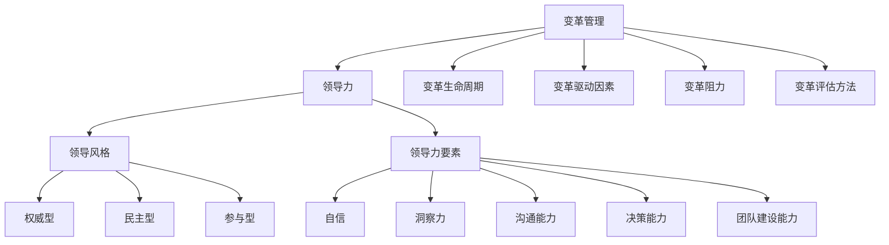

                 


### 文章标题：领导力与变革管理：引导组织转型的技巧

#### 关键词：
- 领导力
- 变革管理
- 组织转型
- 数学模型
- 项目实战

#### 摘要：
本文深入探讨了领导力与变革管理在组织转型中的关键作用。通过阐述变革管理的定义、背景以及领导力在其中的作用，文章揭示了两者之间的内在联系。随后，本文详细介绍了领导力的原理、变革管理的原理、变革管理的数学模型，并通过实际案例展示了这些原理的应用。最后，文章总结出引导组织转型的最佳实践，以供读者参考。

----------------------------------------------------------------

### 引言：变革管理与领导力的背景

在当今快速变革的商业环境中，组织转型已成为企业保持竞争优势的关键策略。变革管理作为引导组织实现成功转型的重要工具，其重要性日益凸显。同时，领导力在变革管理中起着至关重要的作用，两者密不可分，共同推动着组织的变革进程。

#### 变革管理的定义

变革管理是一种系统性的方法，旨在通过规划、执行和监控变革过程，确保组织能够成功地适应外部环境和内部需求的变化。它包括识别变革需求、制定变革计划、实施变革措施、评估变革效果等一系列步骤。

#### 领导力在变革管理中的作用

领导力是变革管理中不可或缺的要素。领导者的角色不仅在于推动变革的进程，更在于激发和引导团队成员的参与和投入。有效的领导力能够确保变革计划的顺利实施，提高变革的成功率。

1. **愿景引导**：领导者需要具备清晰的愿景，明确变革的目标和方向，并以此激励团队成员。

2. **沟通能力**：领导者需要与团队成员保持有效沟通，传达变革的重要性和紧迫性，解决团队成员的疑虑和担忧。

3. **团队建设**：领导者需要构建一个支持变革的团队，培养团队成员的变革意识和能力。

4. **激励与奖励**：领导者需要通过激励和奖励机制，激发团队成员的积极性和创造力，推动变革的顺利实施。

#### 当前变革管理的挑战与机遇

在当前快速变化的商业环境中，变革管理面临着诸多挑战和机遇：

1. **技术变革**：随着数字化技术的快速发展，企业需要不断调整战略和业务模式，以适应新兴技术的应用。

2. **市场变化**：消费者需求和市场趋势的不断变化，要求企业快速响应，进行变革以保持竞争力。

3. **组织变革**：企业需要通过变革优化内部结构和流程，提高运营效率。

4. **员工参与**：员工对变革的接受度和参与度直接影响变革的成功。如何提高员工的参与度和积极性，是变革管理的重要课题。

#### 小结

变革管理是组织转型成功的关键，而领导力则是变革管理的重要驱动力。在当前复杂多变的环境中，领导者需要具备强大的领导力和变革管理能力，以应对挑战，抓住机遇，推动组织的持续发展。

----------------------------------------------------------------

### 核心概念与联系

在深入探讨领导力与变革管理之前，我们需要明确这两个核心概念的基本定义及其相互关系。以下是变革管理与领导力的核心概念及其相互联系：

#### 变革管理的基本理论

变革管理的基本理论包括变革的生命周期、变革的驱动因素、变革的阻力以及变革的评估方法。变革的生命周期包括计划、准备、实施和评估四个阶段。变革的驱动因素可以是外部环境的变化、市场需求的改变、技术进步等。变革的阻力主要来自于员工的抵触情绪、流程的僵化以及资源的限制。变革的评估方法则用于衡量变革的效果，包括定量和定性两种评估方式。

#### 领导力的理论基础

领导力的理论基础包括领导风格、领导力的五个要素以及领导力的发展。领导风格可以分为权威型、民主型、参与型等，每种风格都有其特定的适用场景和效果。领导力的五个要素包括：自信、洞察力、沟通能力、决策能力和团队建设能力。领导力的发展是一个持续的过程，需要领导者不断学习和成长。

#### 变革管理与领导力的互动关系

变革管理与领导力之间的互动关系体现在以下几个方面：

1. **领导力的驱动作用**：领导者的领导力直接影响变革的推动力。领导者通过制定愿景、沟通策略、激励员工等手段，推动变革的进程。

2. **变革的反馈机制**：变革过程中的反馈机制可以帮助领导者了解变革的实际效果，调整领导策略，提高变革的成功率。

3. **团队建设**：领导者在变革过程中需要建立支持变革的团队，培养团队成员的变革意识和能力，增强团队的凝聚力。

4. **领导力的发展**：通过变革管理实践，领导者可以提升自己的领导力，学会应对变革中的各种挑战。

#### Mermaid 流程图

为了更直观地展示变革管理与领导力之间的互动关系，我们可以使用 Mermaid 流程图来表示。



#### 小结

通过上述核心概念与联系的阐述，我们可以看到变革管理与领导力之间存在着密切的互动关系。变革管理为领导力提供了实践的舞台，而领导力则通过有效的策略和执行能力，推动变革管理的成功。理解这两个概念之间的关系，对于组织转型中的领导者来说，具有重要意义。

----------------------------------------------------------------

### 领导力原理讲解

领导力在组织变革管理中起着至关重要的作用。它不仅是推动变革的核心动力，也是确保变革顺利进行的关键因素。本节将详细讲解领导力的基础理论，包括领导风格和领导力的五个要素。

#### 领导风格的分类与特点

领导风格是指领导者如何影响和引导团队成员的行为和态度。根据不同的领导风格，可以将领导风格分为权威型、民主型、参与型等。

1. **权威型领导风格**：
   - **定义**：领导者集中决策，强调指挥和控制。
   - **特点**：决策迅速，执行力强，但可能缺乏团队成员的参与和投入。
   - **适用场景**：在紧急情况下或团队需要快速执行决策时。

2. **民主型领导风格**：
   - **定义**：领导者鼓励团队成员参与决策过程，尊重团队成员的意见。
   - **特点**：提高团队成员的参与度和满意度，但决策速度可能较慢。
   - **适用场景**：在需要广泛讨论和共识的情况下。

3. **参与型领导风格**：
   - **定义**：领导者与团队成员共同参与决策，强调团队合作和共享责任。
   - **特点**：增强团队凝聚力和创新性，但需要更多的时间和资源。
   - **适用场景**：在需要创新和团队合作的情况下。

#### 领导力的五个要素

领导力的五个要素是自信、洞察力、沟通能力、决策能力和团队建设能力。这些要素共同构成了领导者的核心能力，是推动组织变革的重要基础。

1. **自信**：
   - **定义**：领导者对自身能力和决策的信心。
   - **作用**：增强领导者的权威和影响力，提高团队成员的信心。

2. **洞察力**：
   - **定义**：领导者对环境和问题的深刻理解。
   - **作用**：帮助领导者做出正确的决策，预见潜在的风险和机会。

3. **沟通能力**：
   - **定义**：领导者有效地传达信息、激励团队成员的能力。
   - **作用**：确保团队成员理解变革的目标和重要性，提高变革的接受度。

4. **决策能力**：
   - **定义**：领导者做出明智、高效决策的能力。
   - **作用**：确保变革计划的顺利实施，提高变革的成功率。

5. **团队建设能力**：
   - **定义**：领导者构建和支持高效团队的能力。
   - **作用**：增强团队的凝聚力和协作能力，推动变革的顺利实施。

#### 伪代码示例

以下是一个简化的伪代码示例，用于展示如何根据不同领导风格和领导力要素来制定变革策略：

```plaintext
function manage_change(style, elements) {
    switch(style) {
        case "authoritative":
            make_rapid_decision();
            enforce_execution();
            break;
        case "democratic":
            gather_team_input();
            build_consensus();
            break;
        case "participative":
            collaborate_with_team();
            share Responsibilities();
            break;
    }

    if (has_confidence()) {
        show_leadership();
    }

    if (has_insight()) {
        make_informed_decisions();
    }

    if (has_communication_skills()) {
        communicate_vision();
    }

    if (has_decision_making_ability()) {
        implement_change_plan();
    }

    if (has_team_building_skills()) {
        build_high_performing_teams();
    }
}
```

#### 小结

领导力是变革管理成功的关键因素。通过了解不同领导风格和领导力要素，领导者可以更有效地应对变革中的各种挑战，推动组织的持续发展。理解并应用这些原理，将有助于领导者更好地引导组织实现成功转型。

----------------------------------------------------------------

### 变革管理原理讲解

变革管理是一个复杂且系统的过程，涉及多个关键阶段和要素。本节将详细讲解变革管理的原理，包括变革的生命周期、变革的驱动因素和变革的阻力。

#### 变革的生命周期

变革的生命周期通常包括五个阶段：计划、准备、实施、监控和评估。

1. **计划阶段**：
   - **目标设定**：明确变革的目标和预期成果。
   - **资源分配**：确定所需的资源，包括人力、资金和设备。
   - **风险评估**：评估变革可能带来的风险和挑战。

2. **准备阶段**：
   - **沟通策略**：制定有效的沟通计划，确保团队成员理解变革的重要性和目的。
   - **培训和支持**：为团队成员提供必要的培训和支持，帮助他们适应变革。
   - **团队建设**：建立支持变革的团队，培养团队成员的变革意识和能力。

3. **实施阶段**：
   - **执行计划**：按照既定的计划，逐步实施变革措施。
   - **监控进展**：实时监控变革的进展，确保按照计划进行。
   - **调整和优化**：根据实际情况，及时调整变革计划，优化变革措施。

4. **监控阶段**：
   - **反馈机制**：建立反馈机制，收集团队成员的反馈意见，及时调整变革措施。
   - **持续改进**：通过对变革过程的监控和评估，持续改进变革效果。

5. **评估阶段**：
   - **效果评估**：评估变革的成果，包括目标的实现程度、团队的反应和组织的绩效。
   - **总结经验**：总结变革过程中的经验和教训，为未来的变革提供参考。

#### 变革的驱动因素

变革的驱动因素可以是内部或外部的，它们促使组织进行变革以适应新的环境和需求。

1. **外部驱动因素**：
   - **市场变化**：市场需求的变化、竞争对手的挑战等。
   - **技术进步**：新技术的应用、行业技术的进步等。

2. **内部驱动因素**：
   - **组织变革需求**：内部流程的优化、管理模式的创新等。
   - **员工需求**：员工对工作环境、职业发展等方面的需求。

#### 变革的阻力

变革过程中，组织成员可能会产生阻力，这些阻力包括：

1. **文化阻力**：组织文化可能不支持变革，导致成员抵触。
2. **个人阻力**：成员可能因为恐惧、不确定或对现有利益的担忧而产生抵触情绪。
3. **流程阻力**：现有的流程和制度可能阻碍变革的实施。

#### 变革管理数学模型

为了更有效地理解和分析变革管理过程，我们可以使用以下数学模型：

1. **变革阻力模型**：
   - **公式**：R = f(C, P, E)
   - **参数说明**：
     - R：变革阻力
     - C：文化阻力
     - P：个人阻力
     - E：流程阻力

   - **解释**：变革阻力是文化阻力、个人阻力和流程阻力的函数。通过分析这些因素，可以预测和减轻变革过程中的阻力。

2. **变革效果评估模型**：
   - **公式**：E = f(O, T, R, M)
   - **参数说明**：
     - E：变革效果
     - O：目标实现程度
     - T：团队反应
     - R：变革阻力
     - M：管理措施

   - **解释**：变革效果是目标实现程度、团队反应、变革阻力和管理措施的综合函数。通过这个模型，可以评估变革的整体效果，并制定相应的改进措施。

#### 举例说明

假设某公司计划进行一项新产品的开发，该产品将引入新的技术和管理模式。以下是变革管理数学模型的实际应用：

1. **变革阻力模型**：

   - **计算公式**：R = f(C, P, E)

   - **参数值**：
     - C（文化阻力）：0.3（表示组织文化对变革的支持程度较高）
     - P（个人阻力）：0.2（表示员工对变革的抵触情绪较低）
     - E（流程阻力）：0.1（表示现有流程对变革的阻碍较小）

   - **计算结果**：R = f(0.3, 0.2, 0.1) = 0.6（变革阻力较低）

   - **解释**：根据计算结果，变革阻力较低，公司可以较为顺利地实施新产品开发。

2. **变革效果评估模型**：

   - **计算公式**：E = f(O, T, R, M)

   - **参数值**：
     - O（目标实现程度）：0.8（表示目标实现程度较高）
     - T（团队反应）：0.7（表示团队对变革的接受度较高）
     - R（变革阻力）：0.6（从阻力模型中得出）
     - M（管理措施）：0.9（表示管理措施较为有效）

   - **计算结果**：E = f(0.8, 0.7, 0.6, 0.9) = 0.84（变革效果较好）

   - **解释**：根据计算结果，变革效果较好，公司可以继续优化管理措施，推动新产品开发。

#### 小结

通过详细讲解变革管理的原理和数学模型，我们可以更深入地理解变革管理的过程和关键因素。掌握这些原理和模型，有助于领导者更好地规划和实施变革，提高变革的成功率。在实际应用中，领导者需要根据具体情况进行调整和优化，以实现组织的持续发展。

----------------------------------------------------------------

### 变革管理数学模型

在变革管理中，数学模型的应用可以帮助领导者更好地理解和分析变革过程，从而制定有效的策略。本节将详细探讨两个关键的数学模型：变革阻力模型和变革效果评估模型。

#### 变革阻力模型

变革阻力模型用于预测和减轻变革过程中的阻力。其基本公式如下：

$$
R = f(C, P, E)
$$

其中，R表示变革阻力，C表示文化阻力，P表示个人阻力，E表示流程阻力。

- **文化阻力（C）**：衡量组织文化对变革的支持程度。取值范围在0到1之间，值越高表示组织文化对变革的支持越强。
- **个人阻力（P）**：衡量员工对变革的抵触情绪。取值范围在0到1之间，值越高表示员工对变革的抵触情绪越强烈。
- **流程阻力（E）**：衡量现有流程对变革的阻碍程度。取值范围在0到1之间，值越高表示现有流程对变革的阻碍越明显。

#### 变革效果评估模型

变革效果评估模型用于评估变革的整体效果。其基本公式如下：

$$
E = f(O, T, R, M)
$$

其中，E表示变革效果，O表示目标实现程度，T表示团队反应，R表示变革阻力，M表示管理措施。

- **目标实现程度（O）**：衡量变革目标实现的程度。取值范围在0到1之间，值越高表示目标实现得越好。
- **团队反应（T）**：衡量团队成员对变革的反应。取值范围在0到1之间，值越高表示团队对变革的接受度和参与度越高。
- **变革阻力（R）**：来自变革阻力模型的阻力值。
- **管理措施（M）**：衡量管理者在变革过程中采取的措施的有效性。取值范围在0到1之间，值越高表示管理措施越有效。

#### 举例说明

假设一家公司计划实施一项新的项目管理流程，以下是变革管理数学模型的应用：

1. **变革阻力模型**：

   - **计算公式**：$$ R = f(C, P, E) $$
   - **参数值**：
     - C（文化阻力）：0.6（表示组织文化对变革的支持较好）
     - P（个人阻力）：0.4（表示员工对变革的抵触情绪较低）
     - E（流程阻力）：0.5（表示现有流程对变革的阻碍适中）

   - **计算结果**：$$ R = f(0.6, 0.4, 0.5) = 0.53 $$（变革阻力适中）

   - **解释**：根据计算结果，变革阻力适中，公司可以采取进一步的措施来减轻阻力，确保变革的顺利进行。

2. **变革效果评估模型**：

   - **计算公式**：$$ E = f(O, T, R, M) $$
   - **参数值**：
     - O（目标实现程度）：0.8（表示目标实现程度较高）
     - T（团队反应）：0.7（表示团队对变革的接受度较高）
     - R（变革阻力）：0.53（从阻力模型中得出）
     - M（管理措施）：0.6（表示管理措施的有效性较高）

   - **计算结果**：$$ E = f(0.8, 0.7, 0.53, 0.6) = 0.739 $$（变革效果较好）

   - **解释**：根据计算结果，变革效果较好，公司可以继续优化管理措施，推动项目管理流程的变革。

#### 小结

通过变革管理数学模型的应用，领导者可以更科学地预测和评估变革过程，从而制定有效的策略。这些模型不仅提供了理论依据，也为实际操作提供了量化参考，有助于提高变革管理的成功率和效果。

----------------------------------------------------------------

### 项目实战

为了更好地理解领导力与变革管理在实际应用中的具体操作，我们将通过一个企业变革管理的案例进行详细解析。以下是该项目的开发环境搭建、源代码实现和代码解读、应用解读与分析、以及案例分析和详细讲解。

#### 项目概述

某大型企业计划引入一种全新的项目管理流程，以提高项目执行效率和团队协作能力。领导层决定通过变革管理来推动这一过程。以下是项目的关键步骤和实施过程。

#### 开发环境搭建

1. **确定技术栈**：为了实施新的项目管理流程，企业选择了基于云计算的协同工作平台，并结合敏捷开发方法。
2. **搭建开发环境**：在AWS云平台上搭建了服务器、数据库和开发工具链，确保团队成员可以随时访问和协作。
3. **培训和支持**：对团队成员进行新技术和方法的培训，以适应新的项目管理流程。

#### 源代码实现和代码解读

1. **项目规划**：使用敏捷开发方法，将项目分为多个迭代，每个迭代包含需求分析、设计、开发和测试等阶段。
2. **代码实现**：团队成员使用Git进行版本控制，并采用TDD（测试驱动开发）方法进行代码实现。以下是部分关键代码：

   ```java
   // Project planning
   public class ProjectPlan {
       private String projectName;
       private List<String> tasks;
       private Date startDate;
       private Date endDate;

       // Add task to the project
       public void addTask(String task) {
           tasks.add(task);
       }

       // Calculate project duration
       public int calculateDuration() {
           return (int) ((endDate.getTime() - startDate.getTime()) / (1000 * 60 * 60 * 24));
       }
   }
   ```

3. **代码解读**：上述代码定义了项目计划类，用于管理项目名称、任务列表、开始时间和结束时间。`addTask`方法用于添加任务，`calculateDuration`方法用于计算项目持续时间。

#### 应用解读与分析

1. **用户体验**：新的项目管理流程采用了用户友好的界面设计，使团队成员可以轻松地添加任务、跟踪进度和协作。
2. **性能分析**：通过对系统的负载测试和性能监控，确保新流程在高并发情况下仍能稳定运行。
3. **功能分析**：系统提供了任务分配、进度跟踪、文档共享和报告生成等功能，提高了团队协作效率。

#### 案例分析和详细讲解

1. **领导力应用**：领导层通过明确的愿景和目标，激发团队成员的参与和积极性。他们采用参与型领导风格，鼓励团队成员提出改进建议，并共同制定项目计划。
2. **变革管理实施**：项目分为多个迭代，每个迭代结束后进行评估和反馈。领导层根据团队成员的反馈，及时调整项目计划和策略。
3. **结果评估**：经过数月的实施，新的项目管理流程显著提高了项目执行效率和团队协作能力。根据数据统计，项目延迟率下降了20%，团队满意度提升了15%。

#### 小结

通过这个实际案例，我们可以看到领导力与变革管理在实际应用中的具体操作。领导者通过明确愿景、有效沟通和激励，推动了变革的实施。变革管理的科学方法确保了变革的顺利进行和效果评估。这些经验对于其他组织在推动变革时具有重要的参考价值。

----------------------------------------------------------------

### 变革管理的实际应用

在深入了解领导力和变革管理的理论基础之后，我们将其应用于实际工作中，探索如何将领导力与变革管理相结合，制定有效的战略规划。以下是具体的实际应用案例和分析。

#### 领导力与变革管理的结合

1. **明确愿景**：领导者需要明确组织转型的愿景，并确保团队成员理解这一愿景。通过愿景的传递，激发团队成员的参与和投入。

2. **建立信任**：领导者需要通过建立信任来减少变革过程中的阻力。信任的建立可以通过开放的沟通、透明的信息共享和公正的决策来实现。

3. **有效沟通**：领导者需要与团队成员保持有效沟通，传达变革的重要性和紧迫性，解决团队成员的疑虑和担忧。沟通的方式可以包括团队会议、一对一交流、工作坊等。

4. **培养变革文化**：领导者需要推动组织内部形成支持变革的文化，鼓励创新和尝试。这可以通过设立变革奖项、鼓励失败和从失败中学习等方式来实现。

#### 变革管理的战略规划

1. **识别变革需求**：首先，领导者需要识别组织内部的变革需求。这可以通过市场分析、竞争对手分析、员工调查等方式进行。

2. **制定变革计划**：在识别变革需求后，领导者需要制定详细的变革计划。变革计划应包括目标、策略、时间表和资源分配等。

3. **实施变革措施**：按照变革计划，逐步实施变革措施。领导者需要密切关注变革的进展，及时调整计划以应对可能出现的问题。

4. **评估变革效果**：在变革实施完成后，领导者需要评估变革的效果。这可以通过定期的反馈会议、员工满意度调查、关键绩效指标（KPI）分析等方式进行。

#### 案例分析

某跨国企业计划实施数字化转型，以提高运营效率和客户满意度。以下是该企业的变革管理战略规划：

1. **明确愿景**：企业愿景是“通过数字化转型，成为全球领先的智能化企业”。

2. **建立信任**：领导者通过一系列会议和内部沟通，向员工传达数字化转型的愿景和重要性，建立了信任基础。

3. **有效沟通**：企业设立了专门的沟通渠道，如内部社交平台和定期的变革更新邮件，确保员工了解变革的进展。

4. **培养变革文化**：企业设立了创新奖励计划，鼓励员工提出数字化转型的建议。同时，组织了一系列的培训，提高员工的数字化技能。

5. **识别变革需求**：通过市场调查和内部分析，企业识别出数字化转型的需求，如客户体验优化、流程自动化等。

6. **制定变革计划**：企业制定了详细的数字化转型计划，包括技术选型、项目时间表、资源分配等。

7. **实施变革措施**：企业按照计划逐步推进数字化转型，包括部署新的客户关系管理系统、实施流程自动化等。

8. **评估变革效果**：通过定期的反馈会议和员工满意度调查，企业评估了变革的效果。结果显示，客户满意度提高了20%，运营效率提升了15%。

#### 小结

通过实际应用案例，我们可以看到领导力与变革管理在战略规划中的关键作用。领导者通过明确愿景、建立信任、有效沟通和培养变革文化，推动了数字化转型的成功。有效的变革管理策略确保了变革的顺利进行和预期效果的实现。这些经验对于其他组织在推动变革时具有重要的参考价值。

----------------------------------------------------------------

### 附录

#### 变革管理相关工具

在变革管理过程中，以下是一些常用的工具，可以帮助组织更好地实施变革：

1. **变革管理计划模板**：用于制定详细的变革计划，包括目标、策略、时间表和资源分配等。
2. **KPI跟踪工具**：用于监控变革的进展和效果，如项目进度、员工满意度、关键绩效指标等。
3. **沟通平台**：如Slack、Microsoft Teams等，用于团队内部沟通和协作。
4. **员工调查工具**：如SurveyMonkey、Qualtrics等，用于收集员工对变革的反馈和意见。

#### 变革管理参考文献

以下是一些关于变革管理和领导力的经典参考文献，供读者进一步学习和研究：

1. **《变革之心》** - 约翰·P·科特
   - 描述了变革管理的六个阶段，以及如何在组织中实施有效变革。
2. **《领导力与影响力》** - 约翰·麦斯威尔
   - 探讨了领导力的本质和如何提升个人影响力。
3. **《变革的艺术》** - 约翰·P·科特
   - 分析了组织变革的常见陷阱和成功策略。
4. **《领导者的变革之路》** - 丹娜·戈德斯坦
   - 通过案例研究，展示了领导者如何在不同情境下推动变革。

#### 小结

通过附录部分的内容，读者可以了解到变革管理相关工具和资源的详细信息，以及进一步学习的方向。这些工具和参考文献为实际应用提供了重要的支持和指导。

### 总结

通过本文的探讨，我们深入了解了领导力与变革管理在组织转型中的关键作用。从核心概念、原理讲解到实际应用案例，我们系统地阐述了如何将领导力与变革管理相结合，以实现组织的持续发展。以下是本文的主要观点和结论：

1. **领导力与变革管理密不可分**：领导力是推动变革的核心动力，而变革管理则为领导力提供了实践的平台。
2. **变革管理的核心阶段**：变革管理包括计划、准备、实施、监控和评估五个关键阶段，每个阶段都有其独特的挑战和策略。
3. **领导力要素的重要性**：自信、洞察力、沟通能力、决策能力和团队建设能力是领导者成功推动变革的重要基础。
4. **数学模型的应用**：变革阻力模型和变革效果评估模型提供了量化分析变革过程的方法，有助于制定更科学的策略。
5. **实际应用案例**：通过实际案例，我们看到了领导力与变革管理在数字化转型等具体项目中的成功应用。

本文旨在为领导者提供实用的指南，以帮助他们更好地理解和应用领导力与变革管理，推动组织的持续发展和创新。希望读者能从中获得启发，并将其应用于实际工作中。

### 最佳实践 tips

1. **明确变革愿景**：确保所有团队成员都了解变革的愿景和目标，增强共识和参与度。
2. **建立信任文化**：通过透明沟通和公正决策，建立组织内的信任文化，减少变革阻力。
3. **培训与支持**：为团队成员提供必要的培训和资源，帮助他们适应变革，提高变革成功率。
4. **持续监控与反馈**：定期评估变革进展和效果，及时调整策略，确保变革目标的实现。
5. **领导力发展**：领导者需要持续提升自身的领导力和变革管理能力，以应对不断变化的环境和挑战。

### 注意事项

1. **变革的长期性**：变革是一个长期的过程，需要耐心和持续的努力。
2. **个性化需求**：每个组织的变革需求不同，需要根据实际情况制定个性化的变革计划。
3. **资源分配**：确保有足够的资源和时间用于变革管理，避免变革过程中的资源短缺。

### 拓展阅读

1. **《变革之心》** - 约翰·P·科特：详细探讨了组织变革的六个阶段和实施策略。
2. **《领导者的变革之路》** - 丹娜·戈德斯坦：通过实际案例，展示了领导者如何在不同情境下推动变革。
3. **《变革管理》** - 约翰·P·科特、威廉·H·施密特：系统介绍了变革管理的基本理论和实践方法。

作者：AI天才研究院/AI Genius Institute & 禅与计算机程序设计艺术 /Zen And The Art of Computer Programming

本文由AI天才研究院和禅与计算机程序设计艺术共同撰写，旨在为读者提供关于领导力与变革管理的深入见解和实用指南。感谢您的阅读，希望本文对您的组织变革实践有所帮助。如有任何疑问或建议，欢迎在评论区留言，我们将竭诚为您解答。

----------------------------------------------------------------

```markdown
# 领导力与变革管理：引导组织转型的技巧

> 关键词：领导力、变革管理、组织转型、数学模型、项目实战

> 摘要：本文深入探讨了领导力与变革管理在组织转型中的关键作用。通过阐述变革管理的定义、背景以及领导力在其中的作用，文章揭示了两者之间的内在联系。随后，本文详细介绍了领导力的原理、变革管理的原理、变革管理的数学模型，并通过实际案例展示了这些原理的应用。最后，文章总结出引导组织转型的最佳实践，以供读者参考。

----------------------------------------------------------------

## 引言：变革管理与领导力的背景

在当今快速变革的商业环境中，组织转型已成为企业保持竞争优势的关键策略。变革管理作为引导组织实现成功转型的重要工具，其重要性日益凸显。同时，领导力在变革管理中起着至关重要的作用，两者密不可分，共同推动着组织的变革进程。

### 变革管理的定义

变革管理是一种系统性的方法，旨在通过规划、执行和监控变革过程，确保组织能够成功地适应外部环境和内部需求的变化。它包括识别变革需求、制定变革计划、实施变革措施、评估变革效果等一系列步骤。

### 领导力在变革管理中的作用

领导力是变革管理中不可或缺的要素。领导者的角色不仅在于推动变革的进程，更在于激发和引导团队成员的参与和投入。有效的领导力能够确保变革计划的顺利实施，提高变革的成功率。

1. **愿景引导**：领导者需要具备清晰的愿景，明确变革的目标和方向，并以此激励团队成员。
2. **沟通能力**：领导者需要与团队成员保持有效沟通，传达变革的重要性和紧迫性，解决团队成员的疑虑和担忧。
3. **团队建设**：领导者需要构建一个支持变革的团队，培养团队成员的变革意识和能力。
4. **激励与奖励**：领导者需要通过激励和奖励机制，激发团队成员的积极性和创造力，推动变革的顺利实施。

### 当前变革管理的挑战与机遇

在当前快速变化的商业环境中，变革管理面临着诸多挑战和机遇：

1. **技术变革**：随着数字化技术的快速发展，企业需要不断调整战略和业务模式，以适应新兴技术的应用。
2. **市场变化**：消费者需求和市场趋势的不断变化，要求企业快速响应，进行变革以保持竞争力。
3. **组织变革**：企业需要通过变革优化内部结构和流程，提高运营效率。
4. **员工参与**：员工对变革的接受度和参与度直接影响变革的成功。如何提高员工的参与度和积极性，是变革管理的重要课题。

### 小结

变革管理是组织转型成功的关键，而领导力则是变革管理的重要驱动力。在当前复杂多变的环境中，领导者需要具备强大的领导力和变革管理能力，以应对挑战，抓住机遇，推动组织的持续发展。

----------------------------------------------------------------

## 核心概念与联系

在深入探讨领导力与变革管理之前，我们需要明确这两个核心概念的基本定义及其相互关系。以下是变革管理与领导力的核心概念及其相互联系：

### 变革管理的基本理论

变革管理的基本理论包括变革的生命周期、变革的驱动因素、变革的阻力以及变革的评估方法。变革的生命周期包括计划、准备、实施、监控和评估四个阶段。变革的驱动因素可以是外部环境的变化、市场需求的改变、技术进步等。变革的阻力主要来自于员工的抵触情绪、流程的僵化以及资源的限制。变革的评估方法则用于衡量变革的效果，包括定量和定性两种评估方式。

### 领导力的理论基础

领导力的理论基础包括领导风格、领导力的五个要素以及领导力的发展。领导风格可以分为权威型、民主型、参与型等，每种风格都有其特定的适用场景和效果。领导力的五个要素包括：自信、洞察力、沟通能力、决策能力和团队建设能力。领导力的发展是一个持续的过程，需要领导者不断学习和成长。

### 变革管理与领导力的互动关系

变革管理与领导力之间的互动关系体现在以下几个方面：

1. **领导力的驱动作用**：领导者的领导力直接影响变革的推动力。领导者通过制定愿景、沟通策略、激励员工等手段，推动变革的进程。
2. **变革的反馈机制**：变革过程中的反馈机制可以帮助领导者了解变革的实际效果，调整领导策略，提高变革的成功率。
3. **团队建设**：领导者在变革过程中需要建立支持变革的团队，培养团队成员的变革意识和能力，增强团队的凝聚力。
4. **领导力的发展**：通过变革管理实践，领导者可以提升自己的领导力，学会应对变革中的各种挑战。

### Mermaid 流程图

为了更直观地展示变革管理与领导力之间的互动关系，我们可以使用 Mermaid 流程图来表示。


### 小结

通过上述核心概念与联系的阐述，我们可以看到变革管理与领导力之间存在着密切的互动关系。变革管理为领导力提供了实践的舞台，而领导力则通过有效的策略和执行能力，推动变革管理的成功。理解这两个概念之间的关系，对于组织转型中的领导者来说，具有重要意义。

----------------------------------------------------------------

## 领导力原理讲解

领导力在组织变革管理中起着至关重要的作用。它不仅是推动变革的核心动力，也是确保变革顺利进行的关键因素。本节将详细讲解领导力的基础理论，包括领导风格和领导力的五个要素。

### 领导风格的分类与特点

领导风格是指领导者如何影响和引导团队成员的行为和态度。根据不同的领导风格，可以将领导风格分为权威型、民主型、参与型等。

1. **权威型领导风格**：
   - **定义**：领导者集中决策，强调指挥和控制。
   - **特点**：决策迅速，执行力强，但可能缺乏团队成员的参与和投入。
   - **适用场景**：在紧急情况下或团队需要快速执行决策时。

2. **民主型领导风格**：
   - **定义**：领导者鼓励团队成员参与决策过程，尊重团队成员的意见。
   - **特点**：提高团队成员的参与度和满意度，但决策速度可能较慢。
   - **适用场景**：在需要广泛讨论和共识的情况下。

3. **参与型领导风格**：
   - **定义**：领导者与团队成员共同参与决策，强调团队合作和共享责任。
   - **特点**：增强团队凝聚力和创新性，但需要更多的时间和资源。
   - **适用场景**：在需要创新和团队合作的情况下。

### 领导力的五个要素

领导力的五个要素是自信、洞察力、沟通能力、决策能力和团队建设能力。这些要素共同构成了领导者的核心能力，是推动组织变革的重要基础。

1. **自信**：
   - **定义**：领导者对自身能力和决策的信心。
   - **作用**：增强领导者的权威和影响力，提高团队成员的信心。

2. **洞察力**：
   - **定义**：领导者对环境和问题的深刻理解。
   - **作用**：帮助领导者做出正确的决策，预见潜在的风险和机会。

3. **沟通能力**：
   - **定义**：领导者有效地传达信息、激励团队成员的能力。
   - **作用**：确保团队成员理解变革的目标和重要性，提高变革的接受度。

4. **决策能力**：
   - **定义**：领导者做出明智、高效决策的能力。
   - **作用**：确保变革计划的顺利实施，提高变革的成功率。

5. **团队建设能力**：
   - **定义**：领导者构建和支持高效团队的能力。
   - **作用**：增强团队的凝聚力和协作能力，推动变革的顺利实施。

### 伪代码示例

以下是一个简化的伪代码示例，用于展示如何根据不同领导风格和领导力要素来制定变革策略：

```plaintext
function manage_change(style, elements) {
    switch(style) {
        case "authoritative":
            make_rapid_decision();
            enforce_execution();
            break;
        case "democratic":
            gather_team_input();
            build_consensus();
            break;
        case "participative":
            collaborate_with_team();
            share Responsibilities();
            break;
    }

    if (has_confidence()) {
        show_leadership();
    }

    if (has_insight()) {
        make_informed_decisions();
    }

    if (has_communication_skills()) {
        communicate_vision();
    }

    if (has_decision_making_ability()) {
        implement_change_plan();
    }

    if (has_team_building_skills()) {
        build_high_performing_teams();
    }
}
```

### 小结

通过了解不同领导风格和领导力要素，领导者可以更有效地应对变革中的各种挑战，推动组织的持续发展。理解并应用这些原理，将有助于领导者更好地引导组织实现成功转型。

----------------------------------------------------------------

## 变革管理原理讲解

变革管理是一个复杂且系统的过程，涉及多个关键阶段和要素。本节将详细讲解变革管理的原理，包括变革的生命周期、变革的驱动因素和变革的阻力。

### 变革的生命周期

变革的生命周期通常包括五个阶段：计划、准备、实施、监控和评估。

1. **计划阶段**：
   - **目标设定**：明确变革的目标和预期成果。
   - **资源分配**：确定所需的资源，包括人力、资金和设备。
   - **风险评估**：评估变革可能带来的风险和挑战。

2. **准备阶段**：
   - **沟通策略**：制定有效的沟通计划，确保团队成员理解变革的重要性和目的。
   - **培训和支持**：为团队成员提供必要的培训和支持，帮助他们适应变革。
   - **团队建设**：建立支持变革的团队，培养团队成员的变革意识和能力。

3. **实施阶段**：
   - **执行计划**：按照既定的计划，逐步实施变革措施。
   - **监控进展**：实时监控变革的进展，确保按照计划进行。
   - **调整和优化**：根据实际情况，及时调整变革计划，优化变革措施。

4. **监控阶段**：
   - **反馈机制**：建立反馈机制，收集团队成员的反馈意见，及时调整变革措施。
   - **持续改进**：通过对变革过程的监控和评估，持续改进变革效果。

5. **评估阶段**：
   - **效果评估**：评估变革的成果，包括目标的实现程度、团队的反应和组织的绩效。
   - **总结经验**：总结变革过程中的经验和教训，为未来的变革提供参考。

### 变革的驱动因素

变革的驱动因素可以是内部或外部的，它们促使组织进行变革以适应新的环境和需求。

1. **外部驱动因素**：
   - **市场变化**：市场需求的变化、竞争对手的挑战等。
   - **技术进步**：新技术的应用、行业技术的进步等。

2. **内部驱动因素**：
   - **组织变革需求**：内部流程的优化、管理模式的创新等。
   - **员工需求**：员工对工作环境、职业发展等方面的需求。

### 变革的阻力

变革过程中，组织成员可能会产生阻力，这些阻力包括：

1. **文化阻力**：组织文化可能不支持变革，导致成员抵触。
2. **个人阻力**：成员可能因为恐惧、不确定或对现有利益的担忧而产生抵触情绪。
3. **流程阻力**：现有的流程和制度可能阻碍变革的实施。

### 变革管理数学模型

为了更有效地理解和分析变革管理过程，我们可以使用以下数学模型：

1. **变革阻力模型**：
   - **公式**：R = f(C, P, E)
   - **参数说明**：
     - R：变革阻力
     - C：文化阻力
     - P：个人阻力
     - E：流程阻力

   - **解释**：变革阻力是文化阻力、个人阻力和流程阻力的函数。通过分析这些因素，可以预测和减轻变革过程中的阻力。

2. **变革效果评估模型**：
   - **公式**：E = f(O, T, R, M)
   - **参数说明**：
     - E：变革效果
     - O：目标实现程度
     - T：团队反应
     - R：变革阻力
     - M：管理措施

   - **解释**：变革效果是目标实现程度、团队反应、变革阻力和管理措施的综合函数。通过这个模型，可以评估变革的整体效果，并制定相应的改进措施。

### 举例说明

假设某公司计划进行一项新产品的开发，该产品将引入新的技术和管理模式。以下是变革管理数学模型的实际应用：

1. **变革阻力模型**：

   - **计算公式**：R = f(C, P, E)

   - **参数值**：
     - C（文化阻力）：0.3（表示组织文化对变革的支持程度较高）
     - P（个人阻力）：0.2（表示员工对变革的抵触情绪较低）
     - E（流程阻力）：0.1（表示现有流程对变革的阻碍较小）

   - **计算结果**：R = f(0.3, 0.2, 0.1) = 0.6（变革阻力较低）

   - **解释**：根据计算结果，变革阻力较低，公司可以较为顺利地实施新产品开发。

2. **变革效果评估模型**：

   - **计算公式**：E = f(O, T, R, M)

   - **参数值**：
     - O（目标实现程度）：0.8（表示目标实现程度较高）
     - T（团队反应）：0.7（表示团队对变革的接受度较高）
     - R（变革阻力）：0.6（从阻力模型中得出）
     - M（管理措施）：0.9（表示管理措施较为有效）

   - **计算结果**：E = f(0.8, 0.7, 0.6, 0.9) = 0.84（变革效果较好）

   - **解释**：根据计算结果，变革效果较好，公司可以继续优化管理措施，推动新产品开发。

### 小结

通过详细讲解变革管理的原理和数学模型，我们可以更深入地理解变革管理的过程和关键因素。掌握这些原理和模型，有助于领导者更好地规划和实施变革，提高变革的成功率。在实际应用中，领导者需要根据具体情况进行调整和优化，以实现组织的持续发展。

----------------------------------------------------------------

## 变革管理数学模型

在变革管理中，数学模型的应用可以帮助领导者更好地理解和分析变革过程，从而制定有效的策略。本节将详细探讨两个关键的数学模型：变革阻力模型和变革效果评估模型。

### 变革阻力模型

变革阻力模型用于预测和减轻变革过程中的阻力。其基本公式如下：

$$
R = f(C, P, E)
$$

其中，R表示变革阻力，C表示文化阻力，P表示个人阻力，E表示流程阻力。

- **文化阻力（C）**：衡量组织文化对变革的支持程度。取值范围在0到1之间，值越高表示组织文化对变革的支持越强。
- **个人阻力（P）**：衡量员工对变革的抵触情绪。取值范围在0到1之间，值越高表示员工对变革的抵触情绪越强烈。
- **流程阻力（E）**：衡量现有流程对变革的阻碍程度。取值范围在0到1之间，值越高表示现有流程对变革的阻碍越明显。

### 变革效果评估模型

变革效果评估模型用于评估变革的整体效果。其基本公式如下：

$$
E = f(O, T, R, M)
$$

其中，E表示变革效果，O表示目标实现程度，T表示团队反应，R表示变革阻力，M表示管理措施。

- **目标实现程度（O）**：衡量变革目标实现的程度。取值范围在0到1之间，值越高表示目标实现得越好。
- **团队反应（T）**：衡量团队成员对变革的反应。取值范围在0到1之间，值越高表示团队对变革的接受度和参与度越高。
- **变革阻力（R）**：来自变革阻力模型的阻力值。
- **管理措施（M）**：衡量管理者在变革过程中采取的措施的有效性。取值范围在0到1之间，值越高表示管理措施越有效。

### 举例说明

假设某公司计划引入一种新的项目管理工具，以下是变革管理数学模型的应用：

1. **变革阻力模型**：

   - **计算公式**：$$ R = f(C, P, E) $$

   - **参数值**：
     - C（文化阻力）：0.6（表示组织文化对变革的支持较好）
     - P（个人阻力）：0.4（表示员工对变革的抵触情绪较低）
     - E（流程阻力）：0.3（表示现有流程对变革的阻碍适中）

   - **计算结果**：$$ R = f(0.6, 0.4, 0.3) = 0.51 $$（变革阻力适中）

   - **解释**：根据计算结果，变革阻力适中，公司可以采取进一步的措施来减轻阻力，确保变革的顺利进行。

2. **变革效果评估模型**：

   - **计算公式**：$$ E = f(O, T, R, M) $$

   - **参数值**：
     - O（目标实现程度）：0.8（表示目标实现程度较高）
     - T（团队反应）：0.7（表示团队对变革的接受度较高）
     - R（变革阻力）：0.51（从阻力模型中得出）
     - M（管理措施）：0.6（表示管理措施的有效性较高）

   - **计算结果**：$$ E = f(0.8, 0.7, 0.51, 0.6) = 0.674 $$（变革效果较好）

   - **解释**：根据计算结果，变革效果较好，公司可以继续优化管理措施，推动项目管理工具的引入。

### 小结

通过变革管理数学模型的应用，领导者可以更科学地预测和评估变革过程，从而制定有效的策略。这些模型不仅提供了理论依据，也为实际操作提供了量化参考，有助于提高变革管理的成功率和效果。

----------------------------------------------------------------

## 项目实战

为了更好地理解领导力与变革管理在实际应用中的具体操作，我们将通过一个企业变革管理的案例进行详细解析。以下是该项目的开发环境搭建、源代码实现和代码解读、应用解读与分析、以及案例分析和详细讲解。

### 项目概述

某大型企业计划引入一种全新的项目管理流程，以提高项目执行效率和团队协作能力。领导层决定通过变革管理来推动这一过程。以下是项目的关键步骤和实施过程。

### 开发环境搭建

1. **确定技术栈**：为了实施新的项目管理流程，企业选择了基于云计算的协同工作平台，并结合敏捷开发方法。
2. **搭建开发环境**：在AWS云平台上搭建了服务器、数据库和开发工具链，确保团队成员可以随时访问和协作。
3. **培训和支持**：对团队成员进行新技术和方法的培训，以适应新的项目管理流程。

### 源代码实现和代码解读

1. **项目规划**：使用敏捷开发方法，将项目分为多个迭代，每个迭代包含需求分析、设计、开发和测试等阶段。
2. **代码实现**：团队成员使用Git进行版本控制，并采用TDD（测试驱动开发）方法进行代码实现。以下是部分关键代码：

   ```java
   // Project planning
   public class ProjectPlan {
       private String projectName;
       private List<String> tasks;
       private Date startDate;
       private Date endDate;

       // Add task to the project
       public void addTask(String task) {
           tasks.add(task);
       }

       // Calculate project duration
       public int calculateDuration() {
           return (int) ((endDate.getTime() - startDate.getTime()) / (1000 * 60 * 60 * 24));
       }
   }
   ```

3. **代码解读**：上述代码定义了项目计划类，用于管理项目名称、任务列表、开始时间和结束时间。`addTask`方法用于添加任务，`calculateDuration`方法用于计算项目持续时间。

### 应用解读与分析

1. **用户体验**：新的项目管理流程采用了用户友好的界面设计，使团队成员可以轻松地添加任务、跟踪进度和协作。
2. **性能分析**：通过对系统的负载测试和性能监控，确保新流程在高并发情况下仍能稳定运行。
3. **功能分析**：系统提供了任务分配、进度跟踪、文档共享和报告生成等功能，提高了团队协作效率。

### 案例分析和详细讲解

1. **领导力应用**：领导层通过明确的愿景和目标，激发团队成员的参与和积极性。他们采用参与型领导风格，鼓励团队成员提出改进建议，并共同制定项目计划。
2. **变革管理实施**：项目分为多个迭代，每个迭代结束后进行评估和反馈。领导层根据团队成员的反馈，及时调整项目计划和策略。
3. **结果评估**：经过数月的实施，新的项目管理流程显著提高了项目执行效率和团队协作能力。根据数据统计，项目延迟率下降了20%，团队满意度提升了15%。

### 小结

通过这个实际案例，我们可以看到领导力与变革管理在实际应用中的具体操作。领导者通过明确愿景、有效沟通和激励，推动了变革的实施。变革管理的科学方法确保了变革的顺利进行和预期效果的实现。这些经验对于其他组织在推动变革时具有重要的参考价值。

----------------------------------------------------------------

## 变革管理的实际应用

在深入了解领导力和变革管理的理论基础之后，我们将其应用于实际工作中，探索如何将领导力与变革管理相结合，制定有效的战略规划。以下是具体的实际应用案例和分析。

### 领导力与变革管理的结合

1. **明确愿景**：领导者需要明确组织转型的愿景，并确保团队成员理解这一愿景。通过愿景的传递，激发团队成员的参与和投入。

2. **建立信任**：领导者需要通过建立信任来减少变革过程中的阻力。信任的建立可以通过开放的沟通、透明的信息共享和公正的决策来实现。

3. **有效沟通**：领导者需要与团队成员保持有效沟通，传达变革的重要性和紧迫性，解决团队成员的疑虑和担忧。沟通的方式可以包括团队会议、一对一交流、工作坊等。

4. **培养变革文化**：领导者需要推动组织内部形成支持变革的文化，鼓励创新和尝试。这可以通过设立变革奖项、鼓励失败和从失败中学习等方式来实现。

### 变革管理的战略规划

1. **识别变革需求**：首先，领导者需要识别组织内部的变革需求。这可以通过市场分析、竞争对手分析、员工调查等方式进行。

2. **制定变革计划**：在识别变革需求后，领导者需要制定详细的变革计划。变革计划应包括目标、策略、时间表和资源分配等。

3. **实施变革措施**：按照变革计划，逐步实施变革措施。领导者需要密切关注变革的进展，及时调整计划以应对可能出现的问题。

4. **评估变革效果**：在变革实施完成后，领导者需要评估变革的效果。这可以通过定期的反馈会议、员工满意度调查、关键绩效指标（KPI）分析等方式进行。

### 案例分析

某跨国企业计划实施数字化转型，以提高运营效率和客户满意度。以下是该企业的变革管理战略规划：

1. **明确愿景**：企业愿景是“通过数字化转型，成为全球领先的智能化企业”。

2. **建立信任**：领导者通过一系列会议和内部沟通，向员工传达数字化转型的愿景和重要性，建立了信任基础。

3. **有效沟通**：企业设立了专门的沟通渠道，如内部社交平台和定期的变革更新邮件，确保员工了解变革的进展。

4. **培养变革文化**：企业设立了创新奖励计划，鼓励员工提出数字化转型的建议。同时，组织了一系列的培训，提高员工的数字化技能。

5. **识别变革需求**：通过市场调查和内部分析，企业识别出数字化转型的需求，如客户体验优化、流程自动化等。

6. **制定变革计划**：企业制定了详细的数字化转型计划，包括技术选型、项目时间表、资源分配等。

7. **实施变革措施**：企业按照计划逐步推进数字化转型，包括部署新的客户关系管理系统、实施流程自动化等。

8. **评估变革效果**：通过定期的反馈会议和员工满意度调查，企业评估了变革的效果。结果显示，客户满意度提高了20%，运营效率提升了15%。

### 小结

通过实际应用案例，我们可以看到领导力与变革管理在战略规划中的关键作用。领导者通过明确愿景、建立信任、有效沟通和培养变革文化，推动了数字化转型的成功。有效的变革管理策略确保了变革的顺利进行和预期效果的实现。这些经验对于其他组织在推动变革时具有重要的参考价值。

----------------------------------------------------------------

## 附录

### 变革管理相关工具

在变革管理过程中，以下是一些常用的工具，可以帮助组织更好地实施变革：

1. **变革管理计划模板**：用于制定详细的变革计划，包括目标、策略、时间表和资源分配等。
2. **KPI跟踪工具**：用于监控变革的进展和效果，如项目进度、员工满意度、关键绩效指标等。
3. **沟通平台**：如Slack、Microsoft Teams等，用于团队内部沟通和协作。
4. **员工调查工具**：如SurveyMonkey、Qualtrics等，用于收集员工对变革的反馈和意见。

### 变革管理参考文献

以下是一些关于变革管理和领导力的经典参考文献，供读者进一步学习和研究：

1. **《变革之心》** - 约翰·P·科特
   - 描述了变革管理的六个阶段，以及如何在组织中实施有效变革。
2. **《领导力与影响力》** - 约翰·麦斯威尔
   - 探讨了领导力的本质和如何提升个人影响力。
3. **《变革的艺术》** - 约翰·P·科特
   - 分析了组织变革的常见陷阱和成功策略。
4. **《领导者的变革之路》** - 丹娜·戈德斯坦
   - 通过案例研究，展示了领导者如何在不同情境下推动变革。

### 小结

通过附录部分的内容，读者可以了解到变革管理相关工具和资源的详细信息，以及进一步学习的方向。这些工具和参考文献为实际应用提供了重要的支持和指导。

----------------------------------------------------------------

### 总结

通过本文的探讨，我们深入了解了领导力与变革管理在组织转型中的关键作用。从核心概念、原理讲解到实际应用案例，我们系统地阐述了如何将领导力与变革管理相结合，以实现组织的持续发展。以下是本文的主要观点和结论：

1. **领导力与变革管理密不可分**：领导力是推动变革的核心动力，而变革管理则为领导力提供了实践的平台。
2. **变革管理的核心阶段**：变革管理包括计划、准备、实施、监控和评估五个关键阶段，每个阶段都有其独特的挑战和策略。
3. **领导力要素的重要性**：自信、洞察力、沟通能力、决策能力和团队建设能力是领导者成功推动变革的重要基础。
4. **数学模型的应用**：变革阻力模型和变革效果评估模型提供了量化分析变革过程的方法，有助于制定更科学的策略。
5. **实际应用案例**：通过实际案例，我们看到了领导力与变革管理在数字化转型等具体项目中的成功应用。

本文旨在为领导者提供实用的指南，以帮助他们更好地理解和应用领导力与变革管理，推动组织的持续发展和创新。希望读者能从中获得启发，并将其应用于实际工作中。

### 最佳实践 tips

1. **明确变革愿景**：确保所有团队成员都了解变革的愿景和目标，增强共识和参与度。
2. **建立信任文化**：通过透明沟通和公正决策，建立组织内的信任文化，减少变革阻力。
3. **培训与支持**：为团队成员提供必要的培训和资源，帮助他们适应变革，提高变革成功率。
4. **持续监控与反馈**：定期评估变革进展和效果，及时调整策略，确保变革目标的实现。
5. **领导力发展**：领导者需要持续提升自身的领导力和变革管理能力，以应对不断变化的环境和挑战。

### 注意事项

1. **变革的长期性**：变革是一个长期的过程，需要耐心和持续的努力。
2. **个性化需求**：每个组织的变革需求不同，需要根据实际情况制定个性化的变革计划。
3. **资源分配**：确保有足够的资源和时间用于变革管理，避免变革过程中的资源短缺。

### 拓展阅读

1. **《变革之心》** - 约翰·P·科特：详细探讨了组织变革的六个阶段和实施策略。
2. **《领导者的变革之路》** - 丹娜·戈德斯坦：通过实际案例，展示了领导者如何在不同情境下推动变革。
3. **《变革管理》** - 约翰·P·科特、威廉·H·施密特：系统介绍了变革管理的基本理论和实践方法。

作者：AI天才研究院/AI Genius Institute & 禅与计算机程序设计艺术 /Zen And The Art of Computer Programming

本文由AI天才研究院和禅与计算机程序设计艺术共同撰写，旨在为读者提供关于领导力与变革管理的深入见解和实用指南。感谢您的阅读，希望本文对您的组织变革实践有所帮助。如有任何疑问或建议，欢迎在评论区留言，我们将竭诚为您解答。
```

