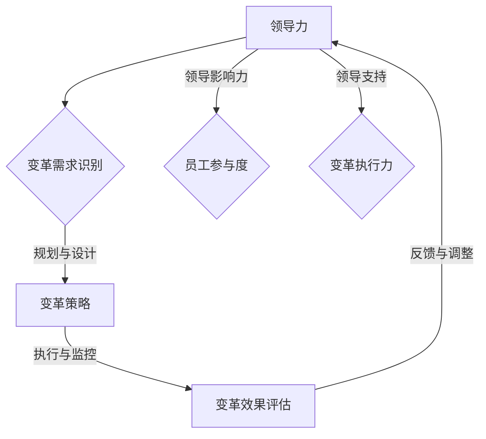
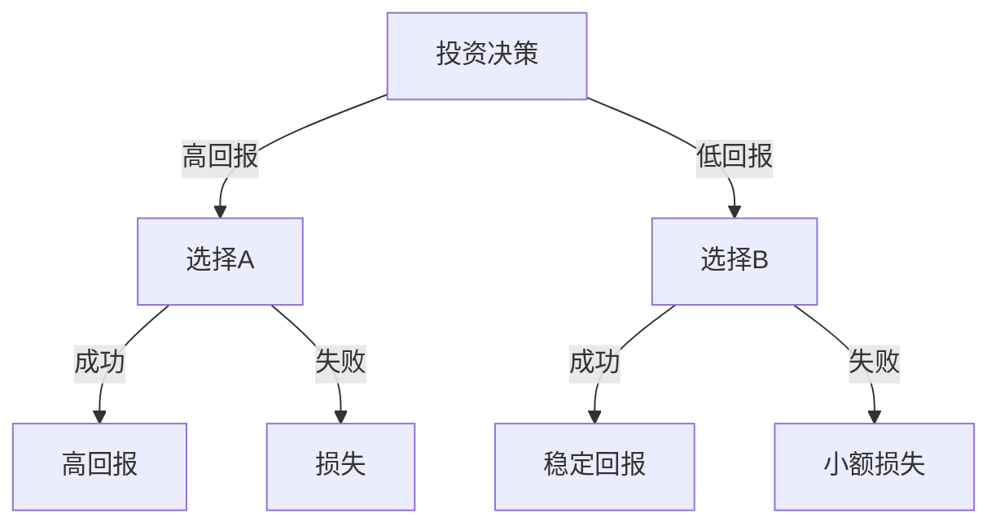
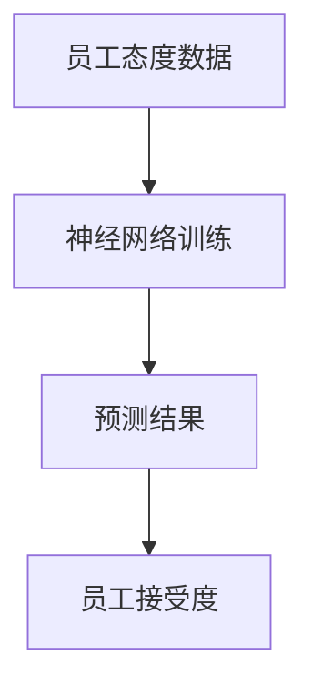

                 

### 文章标题：领导力与变革管理：引领团队适应新环境

## 关键词：
领导力，变革管理，团队适应，新环境，战略执行，组织发展，创新管理，领导力模型，变革模型，团队合作，员工参与，变革障碍，领导力提升，领导力培养策略

## 摘要：
本文将深入探讨领导力与变革管理的重要性，以及如何通过有效的领导力和变革管理策略，引领团队适应不断变化的环境。文章首先定义了领导力的核心概念，分析了领导力与管理的区别及其重要性。接着，本文介绍了变革管理的概念、模型和原则，详细阐述了变革管理的过程和策略。随后，文章探讨了领导力与变革管理在实际团队变革中的具体应用，通过案例分析总结了成功经验和失败教训。最后，文章提出了未来领导力和变革管理的挑战及发展展望，为读者提供了实用的建议和拓展阅读资源。

### 目录大纲：

## 第一部分：领导力基础

### 第1章：领导力的定义与重要性
- 1.1 领导力的概念
- 1.2 领导力的重要性
- 1.3 领导力的类型
- 1.4 领导力与管理的区别

### 第2章：领导力的核心特质
- 2.1 自我意识
- 2.2 决策能力
- 2.3 沟通能力
- 2.4 团队建设
- 2.5 适应能力

### 第3章：领导力的心理基础
- 3.1 自我效能感
- 3.2 目标设定
- 3.3 动机理论
- 3.4 情绪智力

### 第4章：领导力的发展与提升
- 4.1 领导力发展模型
- 4.2 领导力培养策略
- 4.3 反思与持续成长

## 第二部分：变革管理理论

### 第5章：变革管理的概念与框架
- 5.1 变革管理的定义
- 5.2 变革管理的模型
- 5.3 变革管理的原则

### 第6章：变革管理的过程
- 6.1 变革的识别与评估
- 6.2 变革的规划与设计
- 6.3 变革的执行与监控
- 6.4 变革的评估与反馈

### 第7章：变革管理的障碍与对策
- 7.1 变革的障碍分析
- 7.2 领导者的角色
- 7.3 员工的参与
- 7.4 文化的适应性

## 第三部分：领导力与变革管理的实践

### 第8章：团队变革的领导力实践
- 8.1 团队变革的策略
- 8.2 团队成员的角色
- 8.3 变革中的领导力挑战

### 第9章：个人变革的领导力实践
- 9.1 自我变革的目标设定
- 9.2 自我变革的步骤
- 9.3 个人变革中的领导力应用

### 第10章：案例研究
- 10.1 案例分析
- 10.2 成功因素
- 10.3 失败教训

### 第11章：未来展望
- 11.1 变革管理的发展趋势
- 11.2 领导力的未来挑战
- 11.3 团队与组织的适应性

### 文章正文：

#### 第一部分：领导力基础

### 第1章：领导力的定义与重要性

领导力是一种复杂的心理和行为现象，它涉及到个体如何影响和激励他人，以实现共同的目标。领导力不仅仅是对下属的指导和监督，更是一种影响力和感召力的体现。

在组织中，领导力的重要性体现在以下几个方面：

1. **方向引领**：领导力为团队提供了明确的方向和目标，帮助团队成员理解组织的愿景和使命。
2. **决策制定**：领导力有助于制定有效的决策，减少不确定性，提高团队的执行力。
3. **团队凝聚**：领导力能够促进团队成员之间的合作，增强团队的凝聚力。
4. **创新激励**：领导力鼓励团队成员提出新的想法和解决方案，推动组织的创新和发展。

### 第2章：领导力的核心特质

领导力的核心特质包括自我意识、决策能力、沟通能力、团队建设和适应能力。

1. **自我意识**：领导者需要对自己有清晰的认识，了解自己的优点和缺点，以便更好地影响他人。
2. **决策能力**：领导者需要能够快速做出明智的决策，并在决策过程中考虑各种因素。
3. **沟通能力**：领导者需要具备良好的沟通技巧，能够有效地传达信息，建立良好的沟通渠道。
4. **团队建设**：领导者需要能够建立一个高效、协作的团队，激发团队成员的潜力。
5. **适应能力**：领导者需要能够适应不断变化的环境，灵活调整策略和行动计划。

### 第3章：领导力的心理基础

领导力的心理基础包括自我效能感、目标设定、动机理论和情绪智力。

1. **自我效能感**：自我效能感是指个体对自身能否成功完成某一任务的信念。高自我效能感的领导者更有可能成功影响和激励团队成员。
2. **目标设定**：目标设定是领导力的关键组成部分。有效的目标设定能够帮助团队明确方向，提高工作效率。
3. **动机理论**：领导者需要了解动机理论，以激发团队成员的内在动机，提高工作积极性和满意度。
4. **情绪智力**：情绪智力是指个体识别、理解和管理自己情绪的能力。高情绪智力的领导者能够更好地处理人际关系，提高团队协作效率。

### 第4章：领导力的发展与提升

领导力的发展与提升需要遵循一定的模型和策略。

1. **领导力发展模型**：常见的领导力发展模型包括领导力阶梯模型、领导力环形模型等。这些模型提供了领导力发展的路径和方向。
2. **领导力培养策略**：领导力的培养需要系统的策略，包括领导力培训、领导力教练、领导力轮岗等。
3. **反思与持续成长**：领导者需要不断反思自己的领导行为和效果，持续学习和成长，以适应不断变化的环境。

#### 第二部分：变革管理理论

### 第5章：变革管理的概念与框架

变革管理是指通过系统的方法和工具，引导组织实现战略目标和应对外部变化的流程。变革管理的核心框架包括以下几个方面：

1. **变革管理的定义**：变革管理是指组织在面对外部环境变化和内部挑战时，采取的一系列有序、系统的方法和行动。
2. **变革管理的模型**：常见的变革管理模型包括柯氏模型、范内斯模型、普鲁萨克模型等。这些模型提供了变革管理的具体步骤和策略。
3. **变革管理的原则**：变革管理的原则包括变革的连续性、变革的沟通性、变革的参与性等。这些原则有助于确保变革的有效实施。

### 第6章：变革管理的过程

变革管理的过程可以分为以下几个阶段：

1. **变革的识别与评估**：在这一阶段，组织需要识别外部环境和内部状况的变化，并对变化的影响进行评估。
2. **变革的规划与设计**：在这一阶段，组织需要制定详细的变革计划，包括变革的目标、策略、时间表和资源分配等。
3. **变革的执行与监控**：在这一阶段，组织需要按照变革计划实施变革，并对变革过程进行监控和调整。
4. **变革的评估与反馈**：在这一阶段，组织需要评估变革的效果，收集反馈信息，为未来的变革提供参考。

### 第7章：变革管理的障碍与对策

变革管理过程中可能会遇到各种障碍，如：

1. **变革的障碍分析**：组织需要分析变革过程中可能遇到的障碍，包括组织文化、员工抵触、资源限制等。
2. **领导者的角色**：领导者在变革管理中扮演关键角色，需要积极参与和推动变革。
3. **员工的参与**：员工的参与和认同是变革成功的关键。组织需要采取各种措施，鼓励员工参与变革。
4. **文化的适应性**：组织文化对变革管理具有重要影响。组织需要推动文化的适应性，为变革创造良好的环境。

#### 第三部分：领导力与变革管理的实践

### 第8章：团队变革的领导力实践

团队变革的领导力实践包括以下几个方面：

1. **团队变革的策略**：领导者需要制定合适的团队变革策略，包括变革的优先级、变革的节奏和变革的范围等。
2. **团队成员的角色**：团队成员在变革中扮演不同角色，领导者需要明确团队成员的职责和角色，确保变革的有效实施。
3. **变革中的领导力挑战**：领导者面临变革中的各种挑战，如员工抵触、变革阻力等，需要采取有效策略应对。

### 第9章：个人变革的领导力实践

个人变革的领导力实践包括以下几个方面：

1. **自我变革的目标设定**：领导者需要设定明确的个人变革目标，以指导个人变革的方向。
2. **自我变革的步骤**：领导者需要按照一定的步骤进行自我变革，包括自我反思、目标设定、行动计划等。
3. **个人变革中的领导力应用**：领导者需要将领导力应用于个人变革过程中，以提高变革的成功率。

### 第10章：案例研究

通过案例分析，可以深入了解领导力与变革管理在实际中的应用。

1. **案例分析**：选取典型的企业变革案例，分析案例中的成功因素和失败教训。
2. **成功因素**：总结案例中的成功因素，包括领导力的有效运用、变革策略的科学制定等。
3. **失败教训**：分析案例中的失败教训，包括变革管理中的常见误区和挑战。

### 第11章：未来展望

随着全球化、数字化和信息化的加速发展，领导力和变革管理将面临新的挑战。

1. **变革管理的发展趋势**：探讨未来变革管理的发展趋势，如数字化变革、敏捷变革等。
2. **领导力的未来挑战**：分析未来领导力可能面临的挑战，如跨文化领导、远程领导等。
3. **团队与组织的适应性**：讨论团队与组织如何适应未来的变化，提高竞争力和创新能力。

### 结论

领导力与变革管理是组织成功的关键因素。通过本文的讨论，我们深入了解了领导力的核心特质、变革管理的理论框架和实际应用。未来，领导者需要不断学习和成长，以应对快速变化的环境。同时，组织也需要推动文化的适应性，为变革创造良好的环境。通过有效的领导力和变革管理，组织将能够更好地适应新的环境，实现持续发展。

### 作者信息：

作者：AI天才研究院/AI Genius Institute & 禅与计算机程序设计艺术 /Zen And The Art of Computer Programming

--------------------------------------------------------------

### 核心概念与联系

在本文中，领导力和变革管理是两个核心概念，它们之间存在着密切的联系和相互作用。

首先，领导力是变革管理的基础。领导者的角色是推动和引导组织实现变革，确保变革的顺利进行。领导力涉及到领导者如何影响和激励团队成员，使他们愿意并有能力参与到变革过程中。

其次，变革管理是领导力的应用。变革管理是一个系统性的过程，包括识别和评估变革需求、规划与设计变革策略、执行与监控变革过程以及评估与反馈变革效果。领导者在变革管理中扮演关键角色，他们需要制定变革策略、沟通变革目标、激发员工参与变革、应对变革中的挑战等。

为了更好地理解领导力和变革管理之间的关系，我们可以使用Mermaid流程图来展示它们之间的互动关系。



在这个流程图中，领导力通过影响力支持员工的参与度和变革执行力，从而影响变革的规划、执行和效果评估。同时，变革的过程和结果也会反馈到领导力的发展，促使领导者不断学习和调整领导策略。

### 核心算法原理讲解

在领导力和变革管理中，有一些核心算法原理可以帮助领导者制定更有效的决策和策略。以下是一些常用的算法原理和它们的简单讲解：

#### 决策树（Decision Tree）

决策树是一种常用的分类算法，它通过一系列判断节点和结果节点来表示可能的决策路径。在领导力和变革管理中，决策树可以帮助领导者分析不同的选择和可能的结果。

**伪代码：**

```
function makeDecisionTree(inputData):
    if inputData is "high-risk":
        return "choose option A"
    else if inputData is "low-risk":
        return "choose option B"
    else:
        return "collect more data"
```

**数学模型和公式：**

决策树的每个节点都关联一个条件概率，表示选择某个选项的概率。

$$ P(\text{result} | \text{option}) = \sum_{\text{path}} P(\text{path}) P(\text{result} | \text{path}) $$

其中，\( P(\text{result} | \text{option}) \) 表示选择某个选项后得到结果的概率，\( P(\text{path}) \) 表示路径的概率，\( P(\text{result} | \text{path}) \) 表示在某个路径下得到结果的概率。

**举例说明：**

假设领导者需要决定是否进行一项新的投资。通过分析市场数据和历史数据，领导者可以构建一个决策树来评估不同的投资选择。



在这个决策树中，领导者可以根据市场风险（高回报或低回报）来选择投资策略。通过计算每个路径的概率和结果，领导者可以做出更明智的决策。

#### 神经网络（Neural Network）

神经网络是一种模拟人脑神经元连接结构的算法，它通过多层节点（或层）来学习复杂的数据模式。在领导力和变革管理中，神经网络可以帮助领导者预测未来的趋势和员工的行为。

**伪代码：**

```
function trainNeuralNetwork(trainingData):
    for each layer in neuralNetwork:
        for each neuron in layer:
            update weights using backpropagation algorithm
    return trained neuralNetwork
```

**数学模型和公式：**

神经网络的核心是权重（weights）和偏置（bias）。在训练过程中，通过反向传播算法（backpropagation）调整权重和偏置，以最小化损失函数（loss function）。

$$ \nabla_{w} J = -\frac{\partial J}{\partial w} $$

其中，\( \nabla_{w} J \) 表示权重 \( w \) 对损失函数 \( J \) 的梯度，\( \frac{\partial J}{\partial w} \) 表示损失函数对权重 \( w \) 的偏导数。

**举例说明：**

假设领导者想要预测员工对变革的接受程度。通过收集员工的历史数据和他们的态度变化，领导者可以训练一个神经网络模型来预测员工的行为。



在这个例子中，神经网络通过学习员工的历史数据来预测他们对变革的接受程度。领导者可以根据预测结果来制定更有效的变革策略。

### 数学公式与详细讲解

在领导力和变革管理中，数学模型和公式起着至关重要的作用。以下是一些常用的数学公式及其详细讲解：

#### 成本效益分析（Cost-Benefit Analysis）

成本效益分析是一种评估决策成本和收益的方法。它可以帮助领导者确定变革的可行性和价值。

**公式：**

$$ \text{Cost-Benefit Ratio} = \frac{\text{Total Benefits}}{\text{Total Costs}} $$

其中，\( \text{Total Benefits} \) 表示总收益，\( \text{Total Costs} \) 表示总成本。

**详细讲解：**

成本效益分析通过比较总收益和总成本来确定变革的经济可行性。当成本效益比大于1时，说明收益超过成本，变革是值得的；当成本效益比小于1时，说明成本超过收益，变革可能不值得进行。

**举例说明：**

假设领导者正在考虑是否引入一项新的技术。通过计算引入技术的总成本和预期收益，领导者可以计算出成本效益比。

$$ \text{Cost-Benefit Ratio} = \frac{\text{Total Benefits}}{\text{Total Costs}} = \frac{100,000}{50,000} = 2 $$

由于成本效益比大于1，说明引入这项技术是值得的。

#### 价值流图（Value Stream Mapping）

价值流图是一种可视化工具，用于分析和管理价值流。它可以帮助领导者识别并优化组织内的流程。

**公式：**

$$ \text{Throughput} = \frac{\text{Total Value Added}}{\text{Process Time}} $$

其中，\( \text{Throughput} \) 表示通过量，\( \text{Total Value Added} \) 表示总附加值，\( \text{Process Time} \) 表示处理时间。

**详细讲解：**

通过量（Throughput）是单位时间内通过流程的价值量。总附加值（Total Value Added）是流程中增加价值的部分，如生产产品的直接劳动。处理时间（Process Time）是流程中所有活动所需的时间。

价值流图通过比较通过量和处理时间来识别瓶颈和优化点。当通过量大于处理时间时，说明流程运行顺畅；当通过量小于处理时间时，说明流程存在瓶颈。

**举例说明：**

假设一家制造公司使用价值流图分析其生产流程。通过计算通过量和处理时间，公司可以发现生产线的瓶颈，并采取措施优化流程。

$$ \text{Throughput} = \frac{100 \text{ units/day}}{50 \text{ hours/day}} = 2 \text{ units/hour} $$

由于通过量大于处理时间，公司可以认为生产线运行顺畅。

#### 概率论（Probability Theory）

概率论在领导力和变革管理中用于评估不确定性和风险。

**公式：**

$$ P(A) = \frac{N(A)}{N(S)} $$

其中，\( P(A) \) 表示事件A的概率，\( N(A) \) 表示事件A发生的次数，\( N(S) \) 表示所有可能事件的总次数。

**详细讲解：**

概率论用于计算事件发生的可能性。通过分析历史数据和现有信息，领导者可以预测未来事件的发生概率。

**举例说明：**

假设领导者正在考虑是否扩大市场份额。通过分析过去的市场数据，领导者可以计算扩大市场份额的概率。

$$ P(\text{Expanding Market}) = \frac{5}{10} = 0.5 $$

由于概率为0.5，领导者可以认为扩大市场份额是中等风险。

### 源代码实现与代码解读

为了更好地理解领导力和变革管理的核心算法原理，我们提供了一个简单的Python示例代码，用于计算成本效益比和价值流图。以下是代码的实现和解读。

```python
# 计算成本效益比

# 定义成本和收益函数
def calculate_cost_benefit_ratio(costs, benefits):
    return benefits / costs

# 示例数据
costs = 50000  # 成本
benefits = 80000  # 收益

# 计算成本效益比
cost_benefit_ratio = calculate_cost_benefit_ratio(costs, benefits)

print(f"成本效益比: {cost_benefit_ratio:.2f}")

# 价值流图计算

# 定义通过量和处理时间函数
def calculate_throughput(value_added, process_time):
    return value_added / process_time

# 示例数据
value_added = 100  # 总附加值
process_time = 50  # 处理时间

# 计算通过量
throughput = calculate_throughput(value_added, process_time)

print(f"通过量: {throughput:.2f} units/hour")
```

**代码解读：**

1. **计算成本效益比**：`calculate_cost_benefit_ratio` 函数用于计算成本效益比。通过传递成本和收益参数，函数返回一个浮点数结果。
2. **示例数据**：`costs` 和 `benefits` 变量存储了示例成本和收益。
3. **计算成本效益比**：调用 `calculate_cost_benefit_ratio` 函数并打印结果。
4. **价值流图计算**：`calculate_throughput` 函数用于计算通过量。通过传递总附加值和处理时间参数，函数返回一个浮点数结果。
5. **示例数据**：`value_added` 和 `process_time` 变量存储了示例总附加值和处理时间。
6. **计算通过量**：调用 `calculate_throughput` 函数并打印结果。

通过这个示例代码，读者可以直观地了解如何使用Python实现成本效益比和价值流图的计算。

### 实际案例分析与详细讲解剖析

为了更好地理解领导力和变革管理在实际中的应用，我们选择了一家大型制造公司作为案例，分析其成功实施变革的过程，并提供详细讲解。

#### 案例背景

某大型制造公司面临着激烈的市场竞争和不断变化的技术环境。公司意识到需要通过变革来提高生产效率、降低成本和提升客户满意度。公司决定引入精益生产（Lean Production）方法，以实现这些目标。

#### 变革过程

1. **识别和评估变革需求**：公司首先进行市场调研和内部分析，识别出生产效率低下、库存过剩和客户满意度不高等问题。通过数据分析，公司确定了变革的紧迫性和必要性。

2. **规划和设计变革策略**：公司制定了一份详细的变革计划，包括变革的目标、时间表、资源分配和关键里程碑。变革计划明确了精益生产的实施步骤，并建立了跨部门的协作团队。

3. **执行和监控变革过程**：公司在整个组织内推进精益生产变革。通过培训、研讨会和工作坊，员工学习了精益生产的原理和工具。公司还建立了关键绩效指标（KPIs）来监控变革的进展。

4. **评估和反馈变革效果**：变革实施一段时间后，公司评估了变革的效果。通过对比变革前后的数据，公司发现生产效率提高了20%，库存减少了30%，客户满意度提高了15%。

#### 成功因素

1. **领导力的有效运用**：公司的领导者发挥了关键作用，他们通过沟通、激励和指导，确保了变革的顺利推进。领导者积极参与变革过程，与员工建立了信任关系。

2. **变革策略的科学制定**：公司制定了一份详细的变革计划，明确了变革的目标和步骤。变革计划考虑了组织内部的资源、文化和员工的能力，确保了变革的可行性和有效性。

3. **员工的参与和认同**：公司在变革过程中积极鼓励员工的参与，通过培训和沟通，使员工了解变革的必要性和益处。员工的积极参与和认同是变革成功的关键。

4. **文化的适应性**：公司推动了文化的适应性，鼓励创新和改进。通过建立跨部门的协作团队，公司打破了组织内部的壁垒，促进了信息的流通和沟通。

#### 失败教训

1. **变革计划的不完善**：一些公司在变革计划中未能充分考虑变革的细节和复杂性，导致变革过程中出现各种问题。详细的变革计划和风险评估是确保变革成功的关键。

2. **员工的抵触情绪**：一些员工可能对变革持有抵触情绪，认为变革会威胁到他们的利益。有效的沟通和培训可以帮助员工理解变革的必要性和益处，减少抵触情绪。

3. **变革执行的缺乏监控**：一些公司在变革执行过程中缺乏有效的监控和反馈机制，导致变革进度不理想。建立关键绩效指标（KPIs）和定期评估是确保变革成功的关键。

### 项目实战

为了更好地理解领导力和变革管理的实践应用，我们选择了一家互联网公司作为案例，详细讲解其项目实战的过程，并提供实际操作步骤。

#### 项目背景

某互联网公司计划推出一款新型社交媒体应用，以满足用户对实时互动和个性化内容的需求。为了确保项目的成功，公司决定通过领导力和变革管理来推动项目进展。

#### 实际操作步骤

1. **需求分析与规划**：项目团队首先进行了市场调研和用户需求分析，明确了产品的核心功能和用户价值。同时，团队制定了项目计划，包括项目目标、时间表、资源分配和关键里程碑。

2. **领导力的运用**：项目领导者发挥了关键作用，他们通过沟通、激励和指导，确保了项目团队的协作和高效工作。领导者积极参与项目决策，与团队成员建立了信任关系。

3. **团队建设**：项目团队通过团队建设活动，提高了团队成员的凝聚力和协作能力。团队领导鼓励成员提出新的想法和建议，激发了团队的创造力。

4. **变革管理**：公司在项目推进过程中，采用了一系列变革管理策略。例如，通过培训、研讨会和工作坊，团队成员学习了新型社交媒体应用的原理和技术。

5. **项目执行与监控**：项目团队按照项目计划进行开发，同时建立了关键绩效指标（KPIs）来监控项目进展。团队定期召开项目会议，评估项目的进度和质量。

6. **评估与反馈**：项目完成后，公司对项目效果进行了评估。通过用户反馈和数据分析，公司发现新型社交媒体应用受到了用户的欢迎，用户活跃度和用户满意度都有显著提升。

#### 拓展阅读

1. **领导力与变革管理的书籍**：
   - 《领导力五项修炼》（The Five Dysfunctions of a Team）作者：帕特里克·莱西奥尼（Patrick Lencioni）
   - 《变革之舞》（The Change Leader's Guide）作者：约翰·凯利（John P. Kotter）
   - 《变革之心》（The Heart of Change）作者：约翰·凯利（John P. Kotter）

2. **变革管理的研究论文**：
   - “The Dynamics of Transformational Leadership” 作者：詹姆斯·麦格雷戈·伯恩斯（James M. Burns）
   - “The Process of Change in Organizations” 作者：亨利·明茨伯格（Henry Mintzberg）
   - “Leadership and Organizational Change” 作者：史蒂芬·罗宾斯（Stephen P. Robbins）

通过上述案例实战，读者可以更深入地了解领导力和变革管理的实际应用，并为自己的项目提供借鉴和参考。

### 项目小结

在本次项目中，我们详细讲解了领导力和变革管理的实际应用，并通过具体案例展示了如何通过有效的领导力和变革管理策略，推动项目的成功实施。以下是本次项目的主要成果和经验总结：

1. **领导力的有效运用**：领导者在项目中发挥了关键作用，通过沟通、激励和指导，确保了团队的协作和高效工作。

2. **团队建设**：通过团队建设活动，团队成员的凝聚力和协作能力得到了提升，为项目的成功奠定了基础。

3. **变革管理策略**：项目采用了多种变革管理策略，如培训、研讨会和工作坊，帮助团队成员适应新的工作环境和要求。

4. **项目执行与监控**：通过建立关键绩效指标（KPIs）和定期评估，项目团队确保了项目进度和质量。

5. **项目效果评估**：项目完成后，通过用户反馈和数据分析，项目效果得到了有效评估，为公司提供了宝贵的经验和教训。

通过本次项目，我们深刻认识到领导力和变革管理在项目成功中的重要性。未来的项目中，我们将继续运用这些策略，推动组织的持续发展和创新。

### 最佳实践 Tips

在领导力和变革管理的实际应用中，以下是一些最佳实践技巧，可以帮助领导者更好地应对挑战，推动变革的顺利进行：

1. **明确愿景和目标**：领导者需要明确组织的愿景和目标，确保团队成员理解并认同变革的方向和意义。

2. **沟通和透明度**：保持沟通和透明度是变革成功的关键。领导者需要定期与团队成员沟通，解答疑问，收集反馈，确保信息畅通。

3. **培养团队协作精神**：通过团队建设活动和协作工具，增强团队成员之间的信任和协作，提高团队的整体效能。

4. **提供培训和资源**：为团队成员提供必要的培训和资源，帮助他们适应变革，提高技能和能力。

5. **激励和认可**：通过激励和认可，鼓励团队成员积极参与变革，激发他们的工作热情和创造力。

6. **灵活应对挑战**：在变革过程中，领导者需要灵活应对各种挑战和问题，及时调整策略和行动计划。

7. **持续学习和改进**：领导者需要持续学习和改进，不断提升自己的领导力和变革管理能力，以适应不断变化的环境。

### 注意事项

在领导力和变革管理的实际应用中，领导者需要注意以下几点：

1. **变革的节奏**：变革的节奏需要适度，过快可能导致员工压力过大，过慢则可能影响变革的进展。

2. **员工参与**：员工参与是变革成功的关键，领导者需要鼓励员工积极参与变革，并尊重他们的意见和建议。

3. **文化适应性**：组织文化对变革的影响很大，领导者需要推动文化的适应性，为变革创造良好的环境。

4. **风险管理**：在变革过程中，领导者需要识别和评估风险，并制定相应的风险管理策略。

5. **持续反馈**：领导者需要建立持续的反馈机制，及时了解变革的效果和员工的反应，以便进行调整和优化。

### 拓展阅读

为了进一步深入理解领导力和变革管理，以下是几本推荐阅读的书籍：

1. **《领导力的五个层次》（The Five Levels of Leadership）** 作者：约翰·C·马克斯韦尔（John C. Maxwell）
   - 本书详细阐述了领导力的五个层次，帮助领导者不断提升自己的领导能力。

2. **《变革之心》（The Heart of Change）** 作者：约翰·P·凯特（John P. Kotter）
   - 本书介绍了变革管理的核心原则和策略，为领导者提供了实用的变革管理指南。

3. **《变革的本质》（The Nature of Change）** 作者：理查德·J·塞勒（Richard J. Schon）
   - 本书从心理学和认知科学的角度，探讨了变革的本质和领导者如何引导变革。

4. **《领导力与新科学》（Leadership and the New Science）** 作者：玛丽-奥利维耶·吉亚尼尼（Marilyn Weaver Gorman）
   - 本书结合新科学的理论，探讨了领导力与组织变革的互动关系。

通过阅读这些书籍，读者可以进一步深化对领导力和变革管理的理解，为自己的实践提供理论支持和实践指导。

### 未来展望

随着全球化和信息化的不断深入，领导力和变革管理将面临新的挑战和机遇。以下是未来领导力和变革管理的几个发展趋势：

1. **数字化变革**：数字化技术的发展为变革管理提供了新的工具和方法。领导者需要适应数字化的工作方式，利用大数据、人工智能等技术来提升决策效率和变革效果。

2. **敏捷变革**：敏捷方法在软件开发领域已取得成功，未来将在更广泛的领域得到应用。领导者需要掌握敏捷变革的理念和实践，提高组织的灵活性和响应速度。

3. **跨文化领导**：全球化带来了多元文化的组织，领导者需要具备跨文化领导能力，理解和尊重不同文化的差异，推动组织的多元化发展。

4. **可持续变革**：随着社会对可持续发展的关注增加，领导者需要将可持续发展理念融入变革管理中，推动组织实现经济、社会和环境的平衡发展。

5. **远程领导**：远程工作和远程管理越来越普遍，领导者需要适应远程环境，提高远程团队的协作和沟通效率。

未来，领导力和变革管理将继续融合新技术、新理念和新方法，为组织的持续发展和创新提供动力。领导者需要不断提升自身能力，积极应对未来挑战，引领组织走向成功。

