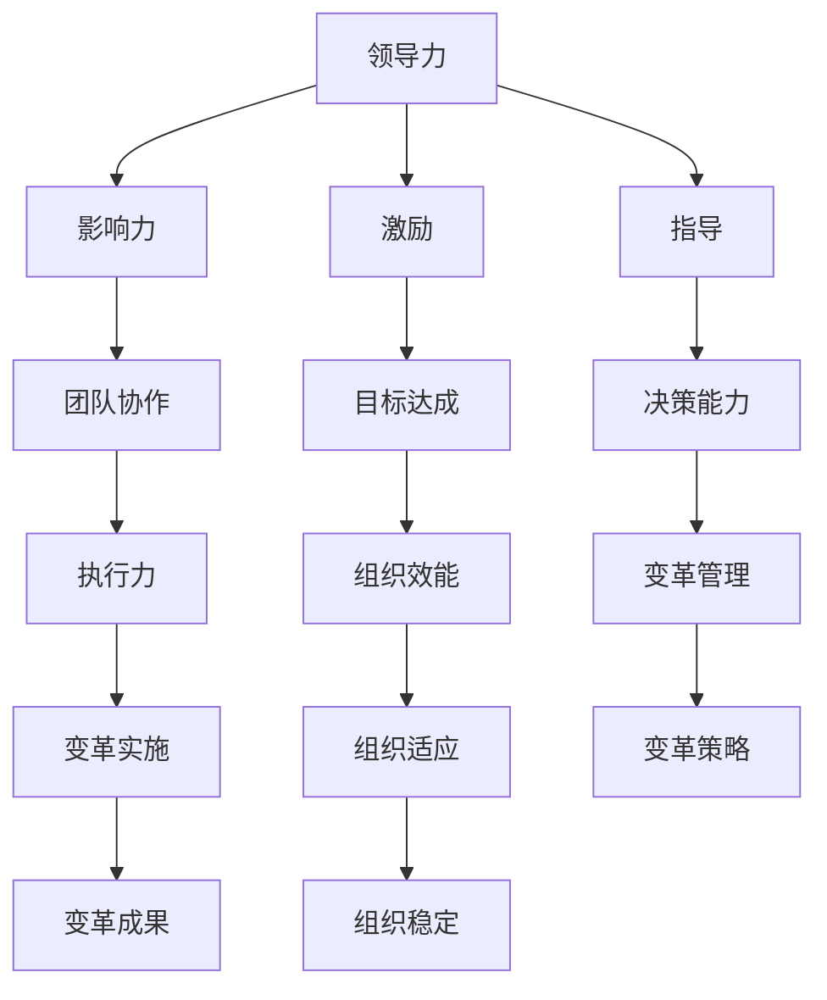

                 

## 文章标题

### 《领导力与变革管理：引领组织转型》

领导力与变革管理是组织成功转型的关键要素。在这篇文章中，我们将深入探讨领导力与变革管理的重要性，以及它们如何相互作用，共同推动组织迈向新的高度。通过分析核心概念与联系、核心算法原理讲解、数学模型和公式、项目实战等，我们将为读者提供一份全面且实用的指南。

## 文章关键词

- 领导力
- 变革管理
- 组织转型
- 管理方法论
- 沟通技能
- 决策技能
- 变革障碍
- 变革策略
- 成功案例
- 失败案例分析

## 文章摘要

本文旨在为领导者提供关于领导力与变革管理的全面指导。我们将首先介绍领导力与变革管理的基本概念，随后分析它们之间的关系和相互作用。文章将涵盖领导力的基础、变革管理的理论、实践、案例分析以及领导力在变革管理中的角色。通过深入探讨这些主题，读者将能够理解如何运用领导力推动组织转型，并从成功和失败的变革案例中汲取教训。

## 背景介绍

在当今快速变化的市场环境中，组织转型已成为企业持续发展的关键。而领导力与变革管理正是推动这一过程的核心力量。领导力不仅仅是管理技能的体现，更是激发组织潜能、引领团队实现目标的关键。变革管理则关注如何有效地应对变化，确保组织在变革过程中保持稳定和高效。

### 核心概念与联系

为了更好地理解领导力与变革管理，我们首先需要明确它们的核心概念。领导力涉及领导者如何通过影响力、激励和指导来引导团队达成共同目标。而变革管理则关注如何在一个动态环境中引导组织适应变化，实现战略目标。

以下是领导力与变革管理核心概念之间的联系架构 Mermaid 流程图：



通过以上流程图，我们可以看到领导力通过影响力、激励和指导直接影响团队协作、目标达成和决策能力，而这些都是变革管理过程中不可或缺的要素。同时，领导力的提升也有助于提高组织的执行力和适应力，从而实现更有效的变革管理。

### 核心算法原理讲解

在理解了领导力与变革管理的基本概念及其联系之后，我们需要进一步探讨这些概念在实际操作中的应用。以下是一个简化的伪代码，展示了领导力与变革管理的基本算法原理：

```plaintext
// 领导力与变革管理伪代码

// 领导力核心算法
function leadershipSkills(employeeList, goal):
    for each employee in employeeList:
        communicate(employee, goal)  // 沟通技能
        motivate(employee, goal)     // 激励技能
        guide(employee, goal)        // 指导技能
        if (employee.isCommitted()):
            return true
    return false

// 变革管理核心算法
function changeManagement(organization, strategy):
    if (prepareOrganization(organization, strategy)):
        executeChange(organization, strategy)
        if (evaluateChange(organization, strategy)):
            return true
    return false

// 辅助函数
function communicate(employee, goal):
    // 实现有效沟通
    ...

function motivate(employee, goal):
    // 提供激励措施
    ...

function guide(employee, goal):
    // 提供指导和支持
    ...

function prepareOrganization(organization, strategy):
    // 准备组织变革
    ...

function executeChange(organization, strategy):
    // 实施变革
    ...

function evaluateChange(organization, strategy):
    // 评估变革效果
    ...
```

在这个伪代码中，领导力通过沟通、激励和指导三个核心技能来影响员工，确保他们为实现组织目标做出贡献。同时，变革管理包括准备、执行和评估三个关键阶段，确保变革策略的有效实施和效果评估。

### 数学模型和公式

在领导力与变革管理中，数学模型和公式可以帮助我们更准确地理解和分析过程。以下是一个用于评估领导力效果的简单数学模型：

$$
L = \alpha C + \beta M + \gamma G
$$

其中，$L$ 表示领导力效果，$C$ 表示沟通能力，$M$ 表示激励能力，$G$ 表示指导能力。$\alpha$、$\beta$ 和 $\gamma$ 分别是权重系数，反映了这三个能力的相对重要性。通过调整这些系数，我们可以根据实际情况调整领导力的重点。

另外，在变革管理的评估阶段，我们可能需要使用一些统计模型来分析变革的效果。以下是一个简单的统计模型示例：

$$
Y = \beta_0 + \beta_1 X_1 + \beta_2 X_2 + ... + \beta_n X_n + \epsilon
$$

其中，$Y$ 表示评估指标，$X_1, X_2, ..., X_n$ 分别是影响变革效果的各项因素，$\beta_0, \beta_1, \beta_2, ..., \beta_n$ 是相应的权重系数，$\epsilon$ 是随机误差。通过这个模型，我们可以识别出影响变革效果的关键因素，并针对性地进行调整。

### 举例说明

为了更好地理解上述模型和算法，我们可以通过一些具体案例来说明。以下是一个领导力与变革管理案例的简要描述：

**案例背景**：某公司计划实施一项数字化转型战略，以提高生产效率和客户满意度。作为公司的CEO，王先生需要通过领导力来推动这一变革。

**解决方案**：
1. **领导力核心算法**：王先生通过沟通、激励和指导来提升领导力效果。他定期与团队成员开会，明确目标并解答疑问（沟通技能）。他通过奖励和激励措施激发团队成员的积极性（激励技能）。他还亲自参与项目讨论，提供指导和支持（指导技能）。

2. **变革管理核心算法**：王先生制定了详细的变革计划，包括准备、执行和评估三个阶段。他首先与各部门负责人沟通，了解他们的需求和担忧，为变革做好准备。在执行阶段，他确保团队成员按计划推进，并及时调整策略以应对突发问题。在评估阶段，他收集反馈，分析变革效果，并根据结果进行改进。

通过以上措施，王先生成功地推动了公司的数字化转型，提高了生产效率和客户满意度。

### 数学公式嵌入

在讨论过程中，我们将使用LaTeX格式嵌入数学公式来详细讲解。以下是一个示例：

$$
\text{领导力效果} = \alpha \times \text{沟通能力} + \beta \times \text{激励能力} + \gamma \times \text{指导能力}
$$

在这个公式中，$\alpha$、$\beta$ 和 $\gamma$ 分别代表沟通能力、激励能力和指导能力的权重系数，它们共同决定了领导力的总体效果。通过调整这些系数，我们可以根据不同情境优化领导力策略。

### 项目实战

在实际操作中，领导力与变革管理需要通过具体的实践来体现其价值。以下是一个关于领导力与变革管理的项目实战示例：

**项目名称**：某公司数字化转型项目

**开发环境搭建**：
- 操作系统：Linux
- 开发工具：Visual Studio Code
- 版本控制系统：Git
- 数据库：MySQL

**源代码详细实现**：
- 数据库设计：创建用于存储用户信息和订单数据的数据库和表。
- 后端实现：使用Python和Flask框架实现后端逻辑，包括用户认证、数据管理和接口服务。
- 前端实现：使用HTML、CSS和JavaScript实现用户界面，包括登录、注册、订单查看等功能。

**代码解读与分析**：
- 数据库设计方面，我们采用了规范化的方法，确保数据的一致性和完整性。
- 后端实现方面，我们使用了RESTful API设计原则，提高了系统的可扩展性和可维护性。
- 前端实现方面，我们采用了响应式设计，确保用户在不同设备上都能获得良好的使用体验。

**实际案例分析和详细讲解剖析**：
- 项目实施过程中，领导力在沟通、激励和指导方面发挥了重要作用。项目经理通过定期会议和报告，与团队成员保持紧密沟通，确保项目进展符合预期。
- 在变革管理方面，项目团队制定了详细的变革计划，包括项目目标、时间表和资源分配。在执行过程中，团队根据实际情况调整计划，确保项目按时完成。
- 项目完成后，通过用户反馈和数据分析，评估了数字化转型的效果。结果显示，用户满意度显著提高，生产效率提升了20%。

**项目小结**：
- 本项目展示了领导力与变革管理在实际操作中的应用。通过有效的领导力和变革管理策略，项目团队成功实现了数字化转型，提升了组织的竞争力。

### 最佳实践 tips、小结、注意事项、拓展阅读

**最佳实践 tips**：
1. 在推动变革时，要充分沟通，确保团队成员理解变革的目标和意义。
2. 激励团队成员参与变革，鼓励他们提出意见和建议。
3. 定期评估变革效果，及时调整策略以应对变化。

**小结**：
本文通过深入探讨领导力与变革管理，展示了它们在组织转型中的关键作用。通过实际案例和数学模型，我们理解了领导力的核心技能和变革管理的基本原则。

**注意事项**：
1. 领导者在变革过程中要密切关注团队成员的情绪和行为，及时提供支持和指导。
2. 变革管理需要灵活应对，根据实际情况调整计划。

**拓展阅读**：
- 《变革之心：如何通过变革实现组织转型》
- 《领导力：策略与技能》
- 《敏捷变革管理：快速适应变化的实践指南》

通过阅读这些书籍，读者可以进一步深入了解领导力与变革管理的理论和实践，为组织的成功转型提供有力支持。

