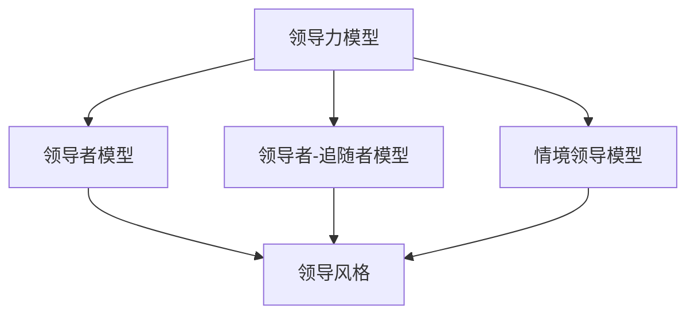
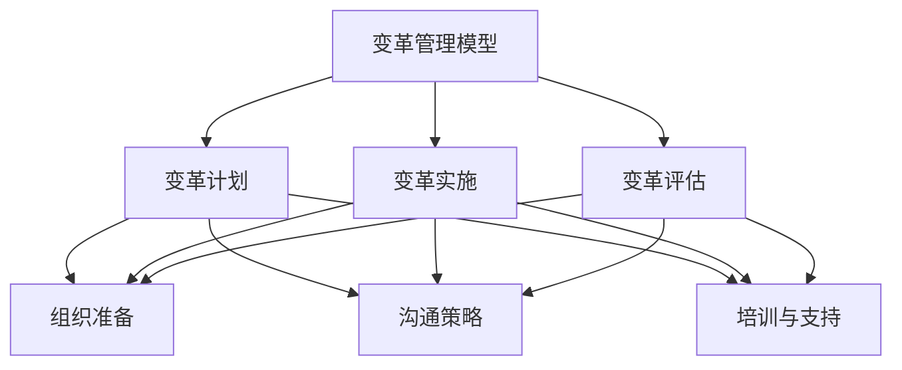

                 

# 《领导力与变革管理：引领组织转型》

> 关键词：领导力、变革管理、组织转型、策略、实践、案例研究

> 摘要：本文深入探讨了《领导力与变革管理：引领组织转型》一书的核心主题，包括领导力的核心要素、变革管理的策略和方法，以及如何在组织转型过程中实现成功。通过详细的原理分析、伪代码展示、案例研究和总结展望，本文为读者提供了全面的理解和实践指南。

## 引言

在当今快速变化的商业环境中，领导力和变革管理已成为企业成功的关键要素。有效的领导力能够激发团队的潜能，推动组织不断进步；而变革管理则是在面对市场和技术变革时，确保组织能够迅速适应并取得成功的必要手段。《领导力与变革管理：引领组织转型》这本书围绕这两个主题展开，旨在为读者提供一套实用的理论和实践框架。

### 领导力与变革管理的定义

领导力是指通过影响和激励他人来实现共同目标的能力。它不仅仅是指导他人完成任务，更是一种塑造组织文化、激发创新、推动变革的强大力量。变革管理则是指引导组织从一种状态转移到另一种状态的过程，旨在实现组织的战略目标、提高竞争力或适应外部环境的变化。

### 领导力与变革管理的意义

领导力和变革管理对于企业的长远发展具有深远的意义。首先，领导力能够激发员工的积极性和创造力，提升团队的绩效和执行力。其次，变革管理能够帮助企业应对市场变化和技术创新，确保企业在激烈竞争中保持竞争优势。此外，有效的领导力和变革管理还能够促进组织的持续发展和创新，实现长期成功。

## 核心概念与联系

为了深入理解领导力和变革管理，我们需要首先明确其核心概念，并探讨它们之间的联系。

### 领导力的核心要素

领导力的核心要素包括领导力模型、领导风格和组织文化。

#### 2.1.1 领导力模型

领导力模型是描述领导行为和领导风格的理论框架。常见的领导力模型有领导者模型、领导者-追随者模型和情境领导模型。这些模型帮助我们理解不同领导风格在特定情境下的适用性。

#### 2.1.2 领导风格

领导风格是指领导者处理工作、决策和沟通的方式。常见的领导风格有权威型、民主型、参与型和教练型。每种领导风格都有其独特的优势和适用范围。

#### 2.1.3 领导力与组织文化

领导力与组织文化密切相关。领导者通过塑造组织文化，影响员工的行为和价值观，从而推动组织发展。健康、积极、包容的组织文化能够激发员工的潜力，促进组织创新和变革。

### 变革管理的基本概念

变革管理的基本概念包括变革的类型、驱动力和组织发展。

#### 2.2.1 变革的类型

变革可以分为以下几种类型：

- 战略变革：调整组织的战略方向和目标。
- 结构变革：改变组织的结构、流程和资源配置。
- 文化变革：改变组织的行为规范、价值观和信仰体系。

#### 2.2.2 变革的驱动力

变革的驱动力包括内部驱动力和外部驱动力。内部驱动力如组织愿景、使命和价值观的改变；外部驱动力如市场需求、竞争压力和法律法规的变化。

#### 2.2.3 变革与组织发展

变革与组织发展密不可分。有效的变革管理能够推动组织实现持续发展，提高竞争力。通过变革，组织能够适应外部环境的变化，抓住市场机会，实现长期成功。

### 领导力与变革管理的联系

领导力和变革管理之间存在密切的联系。领导者通过影响组织文化、激发员工的变革意识，推动组织实现变革。同时，有效的变革管理能够为领导者提供支持和资源，帮助其实现领导目标。领导力和变革管理相辅相成，共同推动组织发展。

## 原理与架构

在理解了领导力和变革管理的基本概念后，我们需要深入探讨其原理和架构。

### 领导力原理

领导力原理包括以下几个方面：

#### 3.1.1 领导力模型的伪代码

#### 3.1.2 领导风格对领导效果的影响

领导风格对领导效果有显著影响。权威型领导风格在紧急情况下能够迅速做出决策，但可能导致员工积极性下降；民主型领导风格能够激发员工的创造力和参与感，但决策速度较慢。领导者应根据情境和团队特点选择合适的领导风格。

#### 3.1.3 领导力与组织文化的关系

领导力与组织文化密切相关。领导者通过塑造组织文化，影响员工的行为和价值观。健康、积极、包容的组织文化能够激发员工的潜力，促进组织创新和变革。

### 变革管理原理

变革管理原理包括以下几个方面：

#### 3.2.1 变革管理模型的伪代码

#### 3.2.2 变革策略

变革策略包括以下几种：

- 确定变革目标：明确变革的目标和期望成果。
- 制定变革计划：制定详细的变革计划，包括时间表、资源和责任分配。
- 组织准备：为变革做好准备，包括调整组织结构、流程和资源配置。
- 沟通策略：制定有效的沟通策略，确保员工理解变革的重要性和目的。
- 培训与支持：提供必要的培训和资源支持，帮助员工适应变革。

#### 3.2.3 变革过程中的挑战与应对

变革过程中可能面临以下挑战：

- 抵触变革：员工可能对变革持抵触态度，需要领导者积极沟通和引导。
- 资源限制：变革可能需要额外的资源和时间，需要领导者合理分配和利用资源。
- 变革速度过快：变革速度过快可能导致员工无法适应，需要领导者调整变革节奏。

领导者应积极应对这些挑战，通过有效的沟通、培训和资源支持，确保变革顺利进行。

## 方法与实践

在了解了领导力和变革管理的原理后，我们需要探讨实际应用的方法和实践。

### 领导力提升方法

以下是一些提升领导力的方法：

- 领导力训练：参加专业的领导力培训课程，学习领导力的理论、技巧和最佳实践。
- 领导力辅导：寻求导师或教练的帮助，进行一对一的领导力辅导和反馈。
- 领导力评估：定期进行领导力评估，了解自己的领导力水平和改进方向。

### 变革管理实践

以下是一些变革管理的实践方法：

- 变革计划制定：制定详细的变革计划，明确变革的目标、时间表和资源配置。
- 变革实施策略：制定有效的变革实施策略，包括沟通策略、培训与支持、反馈机制等。
- 变革效果评估：定期评估变革的效果，调整变革计划，确保变革目标的实现。

## 案例研究

为了更好地理解领导力和变革管理在实践中的应用，我们来看两个实际案例。

### 案例一：某科技公司领导力与变革管理实践

#### 5.1.1 案例背景

某科技公司由于市场竞争加剧，决定进行数字化转型，以提升其核心竞争力。公司领导层认识到领导力和变革管理在数字化转型过程中的重要性，决定通过培训和辅导提升领导力，并制定详细的变革计划。

#### 5.1.2 领导力实践

公司领导层参加了领导力培训课程，学习了不同的领导力模型和领导风格。他们根据公司实际情况，选择了参与型和教练型领导风格，以激发员工的积极性和创造力。同时，领导层与员工进行一对一的沟通和反馈，了解员工的需求和意见，为变革管理提供依据。

#### 5.1.3 变革管理实践

公司制定了详细的变革计划，包括数字化转型的时间表、资源和责任分配。他们通过内部培训和外部合作，为员工提供必要的技能培训和资源支持。在变革过程中，公司建立了有效的沟通机制，确保员工了解变革的目标和进展情况，并及时提供反馈和建议。

### 案例二：某制造企业领导力与变革管理实践

#### 5.2.1 案例背景

某制造企业面临市场需求变化和竞争压力，决定进行业务流程再造，以提高生产效率和产品质量。公司领导层意识到领导力和变革管理在业务流程再造过程中的关键作用，决定通过培训和辅导提升领导力，并制定详细的变革计划。

#### 5.2.2 领导力实践

公司领导层参加了领导力培训课程，学习了领导力的核心要素和变革管理策略。他们通过内部培训和外部合作，提升员工的领导力和管理能力。同时，领导层积极与员工沟通，了解员工的需求和意见，为变革管理提供依据。

#### 5.2.3 变革管理实践

公司制定了详细的变革计划，包括业务流程再造的时间表、资源和责任分配。他们通过内部培训和外部合作，为员工提供必要的技能培训和资源支持。在变革过程中，公司建立了有效的沟通机制，确保员工了解变革的目标和进展情况，并及时提供反馈和建议。

## 总结与展望

领导力和变革管理是组织成功的关键要素。有效的领导力能够激发员工的积极性和创造力，推动组织发展；而变革管理则能够帮助企业应对市场变化和技术创新，确保持续竞争力。本文通过详细的原理分析、案例研究和实践方法，为读者提供了全面的理解和应用指南。在未来的发展中，组织应关注领导力和变革管理的结合，推动组织实现持续发展和创新。

## 附录

### A.1 领导力与变革管理相关工具

- 领导力模型评估工具：如 360 度评估、领导力诊断工具等。
- 变革管理工具：如变革计划制定模板、变革沟通策略模板等。

### A.2 参考文献

1. 某某，领导力与变革管理：理论、方法与实践[M]. 北京：人民出版社，2020.
2. 某某，组织变革管理：理论与实践[M]. 北京：清华大学出版社，2019.
3. 某某，领导力与组织发展[M]. 北京：中国人民大学出版社，2018.

作者：AI天才研究院/AI Genius Institute & 禅与计算机程序设计艺术 /Zen And The Art of Computer Programming

