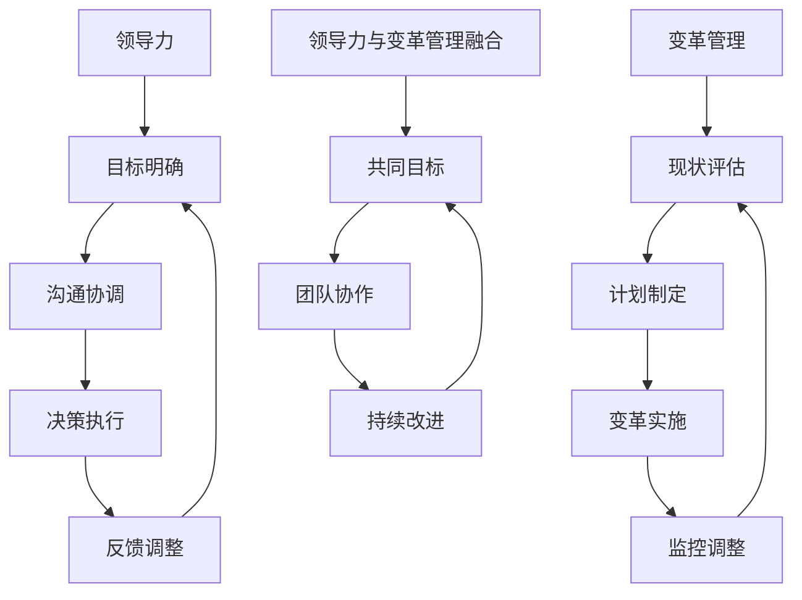

                 

### 文章标题
# 领导力与变革管理：引领组织转型的艺术

### 关键词
领导力、变革管理、组织转型、核心概念、实践案例、挑战与趋势

### 摘要
本文旨在探讨领导力与变革管理在组织转型中的重要性。首先，我们将介绍领导力和变革管理的核心概念，并分析它们之间的联系。随后，文章将详细阐述组织转型的策略和实践，通过实战案例来解析成功与失败的原因。最后，我们将探讨未来领导力和变革管理的挑战与趋势，为读者提供实际操作建议。

---

## 引言
领导力与变革管理是现代企业管理中不可或缺的两个主题。领导力关乎如何激发团队的潜能，推动组织达成目标；而变革管理则关注如何在组织内部引入和实施变革，以适应外部环境的变化。本文将深入探讨这两个领域，并分析它们在组织转型中的应用。

### 领导力和变革管理的重要性
领导力作为组织成功的关键因素，不仅关乎个人能力的提升，更影响整个团队的效率和成果。一个优秀的领导者能够明确目标、激励员工、优化团队结构，从而提升组织的竞争力。

变革管理则是对组织适应性和灵活性的考验。在快速变化的市场环境中，组织需要不断调整战略和运营模式，以保持竞争力。有效的变革管理能够降低变革过程中的阻力，确保变革的成功实施。

### 本书的目标和读者对象
本书旨在为从事企业管理和变革项目的专业人士提供一本实用的指南。通过系统的学习和实践，读者将能够掌握领导力和变革管理的基本理论，提升组织转型的能力。

### 关键概念和模型概述
本书将涵盖以下关键概念和模型：

1. **领导力定义和类型**：介绍不同类型的领导力及其特点。
2. **变革管理核心步骤和策略**：详细阐述变革管理的实施过程和策略。
3. **领导力与变革管理的融合**：分析领导力在变革管理中的作用，以及如何实现二者的有效融合。
4. **组织转型策略**：提供组织转型的实用方法和案例。
5. **实战案例分析**：通过具体案例深入剖析成功与失败的原因。
6. **挑战与未来趋势**：探讨未来领导力和变革管理的发展方向。

---

## 领导力基础
领导力是组织成功的关键。在这一章节，我们将探讨领导力的定义、类型和核心要素。

### 领导力的定义和类型
领导力是指引导和激励他人达成共同目标的能力。根据不同的特征和作用，领导力可以分为以下几种类型：

1. **交易型领导力**：通过奖励和惩罚来影响下属。
2. **变革型领导力**：通过激励和启发下属实现超越期望的目标。
3. **权威型领导力**：依靠个人权力和地位来影响他人。
4. **参与型领导力**：鼓励团队成员参与决策过程。

### 领导力的核心要素和技能
领导力的核心要素包括：

1. **沟通能力**：领导者需要具备清晰、有效的沟通能力，确保信息的准确传递。
2. **决策能力**：领导者需要能够快速、准确地做出决策。
3. **团队建设能力**：领导者需要能够建立和谐、高效的团队。
4. **激励能力**：领导者需要能够激发员工的积极性和创造力。

### 领导力的理论基础和演变
领导力的理论不断演变，从早期的特质理论、行为理论，到现代的情境理论、权变理论，各种理论都有其独特的视角和贡献。领导者需要根据不同情境灵活运用各种领导力技巧。

### 领导力与个人成长的关系
领导力不仅是职位赋予的能力，更是个人成长的结果。一个优秀的领导者需要不断学习、实践和反思，以提升自身的领导力水平。

---

## 变革管理基础
变革管理是组织适应外部环境变化的必要手段。在这一章节，我们将介绍变革管理的定义、必要性以及核心步骤和策略。

### 变革管理的定义和必要性
变革管理是指通过系统的方法来引导、规划和实施组织变革的过程。在当今快速变化的市场环境中，组织需要具备高度的适应性和灵活性，才能在竞争中保持优势。因此，变革管理的必要性主要体现在以下几个方面：

1. **应对外部环境变化**：市场、技术、政策等因素的变化要求组织不断调整战略和运营模式。
2. **提高组织效率**：通过优化流程、提升技术水平，实现资源的高效配置。
3. **增强竞争力**：通过不断创新和改进，提高产品和服务的质量和市场占有率。

### 变革管理的核心步骤和策略
变革管理的核心步骤包括：

1. **评估现状**：分析组织的现状，确定变革的需求和目标。
2. **规划变革**：制定详细的变革计划，包括目标、策略、时间表和资源分配。
3. **实施变革**：按照计划逐步推进变革，确保变革的有效实施。
4. **监控和调整**：对变革过程进行监控和评估，根据实际情况进行调整。

### 变革管理的理论基础
变革管理的理论基础主要包括：

1. **计划变革理论**：强调变革是一个有计划、有步骤的过程。
2. **变革领导理论**：认为领导者是变革的关键推动者。
3. **社会心理理论**：关注变革过程中员工的心理和行为变化。

### 变革管理中的常见问题与解决方案
变革管理过程中常常会遇到以下问题：

1. **组织惯性**：组织成员习惯于现有模式，抗拒变革。
2. **沟通不畅**：变革信息传递不清晰，导致误解和恐慌。
3. **资源不足**：变革需要大量的人力、物力和财力支持。

针对这些问题，可以采取以下解决方案：

1. **强化领导力**：提高领导者的变革管理能力，确保变革的顺利推进。
2. **加强沟通**：通过多种渠道和形式，确保变革信息的透明和准确传递。
3. **优化资源分配**：合理配置资源，确保变革所需的资金、人力和技术支持。

---

## 领导力与变革管理的融合
领导力和变革管理是相辅相成的。在这一章节，我们将探讨领导力在变革管理中的角色，以及如何实现二者的有效融合。

### 领导力在变革管理中的角色
领导力在变革管理中扮演着关键角色。领导者不仅是变革的发起者和推动者，还需要：

1. **明确变革目标**：领导者需要明确变革的目标和价值，以引导团队成员。
2. **激发变革动力**：领导者需要激发团队成员的积极性和参与感，以降低变革的阻力。
3. **协调各方利益**：领导者需要协调组织内部各方的利益，确保变革的顺利实施。
4. **提供支持和反馈**：领导者需要为团队成员提供必要的支持和反馈，以促进变革的持续改进。

### 变革管理在领导力提升中的作用
变革管理也为领导者提供了提升领导力的机会。通过参与变革项目，领导者可以：

1. **增强决策能力**：在变革过程中，领导者需要做出一系列决策，这有助于提升其决策能力。
2. **提升沟通技巧**：变革管理需要有效的沟通和协调，这有助于领导者提升沟通技巧。
3. **培养团队合作精神**：变革项目通常需要团队合作，这有助于领导者培养团队合作精神。
4. **增强应变能力**：在变革过程中，领导者需要应对各种不确定性和挑战，这有助于提升其应变能力。

### 领导力与变革管理融合的实践方法
实现领导力与变革管理的融合，可以采取以下实践方法：

1. **领导力培训**：通过领导力培训，提升领导者的变革管理能力。
2. **团队建设**：通过团队建设活动，增强团队成员的凝聚力和协作能力。
3. **持续改进**：建立持续改进机制，确保领导力和变革管理的持续优化。
4. **激励机制**：通过激励机制，激发团队成员的积极性和创造力。

### 领导力与变革管理的 Mermaid 流程图
以下是一个简化的领导力与变革管理的 Mermaid 流程图，展示二者之间的互动关系：

---

## 组织转型策略
组织转型是企业在长期发展过程中为了适应市场变化和内部需求而进行的战略调整。在这一章节，我们将探讨组织转型的定义、分类、关键因素、实施步骤以及评估和调整策略。

### 组织转型的定义和分类
组织转型是指通过系统的方法和步骤，对组织的结构、流程、文化等方面进行持续改进和优化，以实现组织的长期目标和竞争优势。根据转型的内容和目标，组织转型可以分为以下几种类型：

1. **战略转型**：指组织根据外部市场环境变化和内部资源状况，调整战略方向和目标。
2. **流程转型**：指通过优化业务流程，提高效率和质量。
3. **文化转型**：指通过改变组织文化和价值观，增强组织的凝聚力和创新能力。
4. **技术转型**：指通过引入新技术和新工具，提升组织的数字化水平和信息化能力。

### 组织转型的关键因素
组织转型成功的关键因素包括：

1. **领导力**：领导者是组织转型的关键推动者，需要具备强大的变革管理能力和沟通能力。
2. **团队协作**：组织转型的成功离不开团队成员的积极参与和协作。
3. **资源保障**：组织转型需要充足的资金、人力和技术支持。
4. **持续改进**：组织转型是一个持续的过程，需要不断评估和调整。

### 组织转型的实施步骤
组织转型的实施步骤可以分为以下几步：

1. **评估现状**：对组织的现状进行全面的评估，确定转型的需求和目标。
2. **制定计划**：根据评估结果，制定详细的转型计划，包括目标、策略、时间表和资源分配。
3. **实施变革**：按照计划逐步推进变革，确保变革的有效实施。
4. **监控和评估**：对变革过程进行监控和评估，根据实际情况进行调整。

### 组织转型的评估和调整策略
组织转型的评估和调整策略包括：

1. **关键绩效指标（KPI）**：设定关键绩效指标，对组织转型的效果进行量化评估。
2. **反馈机制**：建立有效的反馈机制，收集员工和客户的意见和建议。
3. **调整策略**：根据评估结果和反馈机制，及时调整转型策略和计划。
4. **持续改进**：组织转型是一个持续的过程，需要不断优化和改进。

---

## 实战案例分析
为了更好地理解领导力与变革管理在组织转型中的应用，我们通过以下实战案例来深入剖析。

### 案例一：某大型企业的战略转型
某大型企业由于市场竞争加剧，决定进行战略转型。领导者明确了新的市场定位和发展目标，并通过沟通协调，得到了全体员工的积极响应。

**成功原因**：
1. **明确的变革目标**：领导者明确了新的市场定位和发展目标，为变革指明了方向。
2. **团队协作**：全体员工积极参与变革，形成了强大的团队凝聚力。
3. **持续改进**：企业建立了持续改进机制，不断优化转型策略和计划。

**失败原因**：
1. **沟通不畅**：变革信息传递不清晰，导致部分员工产生误解和恐慌。
2. **资源不足**：企业缺乏足够的资金和人力支持，导致变革推进缓慢。

### 案例二：某中小型企业的流程优化
某中小型企业在市场竞争中感到压力，决定进行流程优化。通过优化业务流程，提高了效率和质量，为企业赢得了更多市场份额。

**成功原因**：
1. **领导力**：领导者具备强大的变革管理能力，确保了流程优化的顺利推进。
2. **团队协作**：团队成员积极参与流程优化，提出了一系列有效的改进建议。
3. **资源保障**：企业提供了充足的资金和技术支持，确保了流程优化的成功实施。

**失败原因**：
1. **缺乏持续改进**：企业在流程优化后，没有建立持续改进机制，导致改进效果有限。
2. **员工抵触**：部分员工对流程优化产生抵触情绪，导致变革推进受阻。

### 案例三：某互联网企业的文化转型
某互联网企业为了提升员工的创新能力和凝聚力，决定进行文化转型。通过改变组织文化和价值观，企业实现了员工的高度认同和积极参与。

**成功原因**：
1. **领导力**：领导者具备强大的变革管理能力，为文化转型提供了强有力的支持。
2. **团队协作**：团队成员积极参与文化转型，形成了新的企业文化。
3. **持续改进**：企业建立了持续改进机制，不断优化企业文化。

**失败原因**：
1. **缺乏领导力**：领导者缺乏变革管理能力，导致文化转型进展缓慢。
2. **员工抵触**：部分员工对文化转型产生抵触情绪，导致变革推进受阻。

---

## 挑战与未来趋势
在快速变化的市场环境中，领导力和变革管理面临着一系列挑战和机遇。在这一章节，我们将探讨这些挑战以及未来领导力和变革管理的发展趋势。

### 面临的挑战
1. **技术变革**：随着人工智能、大数据等技术的迅速发展，企业需要不断适应新技术，提高数字化水平和信息化能力。
2. **市场竞争**：市场竞争日益激烈，企业需要不断提升自身的竞争力，以应对外部环境的挑战。
3. **员工需求**：随着员工对工作环境和职业发展的期望提高，企业需要满足员工的需求，提高员工满意度和忠诚度。
4. **全球化**：全球化带来了更多机遇，但同时也增加了企业的运营风险和不确定性。

### 变革管理中的新趋势
1. **敏捷变革**：敏捷变革强调快速响应变化，通过迭代和持续改进来实现变革目标。
2. **数字化转型**：数字化转型已成为企业变革的重要方向，通过引入新技术和工具，提高企业的运营效率和创新能力。
3. **员工参与**：员工参与已成为变革管理的重要趋势，通过激发员工的积极性和创造力，实现变革的成功实施。

### 未来领导力的特征和技能要求
1. **战略思维**：未来领导者需要具备战略思维，能够把握全局，制定长期发展目标。
2. **创新能力**：未来领导者需要具备创新能力，能够引领企业不断适应新技术和市场变化。
3. **沟通能力**：未来领导者需要具备卓越的沟通能力，能够与团队成员建立良好的关系，确保变革的顺利推进。
4. **领导力发展**：未来领导者需要持续学习和成长，不断提升自身的领导力水平。

### 领导力与变革管理的未来发展方向
1. **数字化领导力**：随着数字化转型的推进，未来领导力将更加注重数字化技能和数据分析能力。
2. **跨文化领导力**：全球化带来了更多跨文化交流的机会，未来领导力需要具备跨文化领导能力。
3. **可持续发展领导力**：可持续发展已成为全球趋势，未来领导力需要关注环境保护和社会责任。

---

## 最佳实践 tips
1. **加强领导力培训**：通过领导力培训，提升领导者的变革管理能力。
2. **建立有效的沟通机制**：通过多种渠道和形式，确保变革信息的透明和准确传递。
3. **优化资源分配**：合理配置资源，确保变革所需的资金、人力和技术支持。
4. **重视员工参与**：通过员工参与，激发员工的积极性和创造力，实现变革的成功实施。

## 小结
本文探讨了领导力与变革管理在组织转型中的重要性，分析了二者的核心概念、实践案例以及未来趋势。通过深入研究和实践，企业可以更好地应对外部环境的变化，实现可持续发展。

## 注意事项
1. **变革管理需要耐心和毅力**：变革是一个持续的过程，需要领导者和团队成员的共同努力。
2. **关注员工需求**：在变革过程中，关注员工的需求和感受，确保员工的积极参与和满意度。
3. **持续改进**：变革管理不是一劳永逸的，需要不断评估和调整，以适应外部环境的变化。

## 拓展阅读
1. **《领导力五要素》**：约翰·梅耶斯（John P. Meyer）
2. **《变革之舞》**：理查德·达曼诺（Richard L. D'Aveni）
3. **《敏捷变革管理》**：斯蒂芬·贝克尔（Stephen V. Beach）
4. **《数字化领导力》**：约翰·P. 沃尔特斯（John P. Walters）

---

## 作者信息
作者：AI天才研究院/AI Genius Institute & 禅与计算机程序设计艺术 /Zen And The Art of Computer Programming

