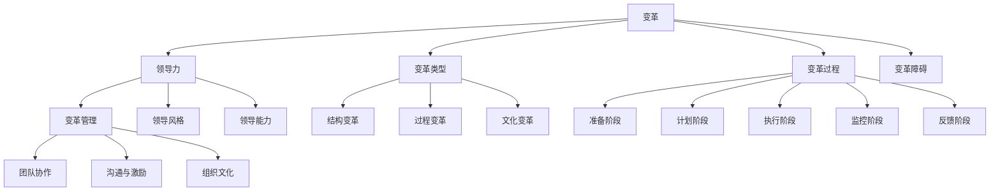

                 

### 领导力与变革：引导团队度过转型期的总体概述

在现代企业的快速变革和激烈竞争环境中，领导力在组织转型过程中扮演着至关重要的角色。本文旨在深入探讨领导力在引导团队度过转型期中的作用和策略，旨在帮助读者理解变革的内在逻辑，掌握变革管理的关键技巧，并提升自身作为领导者的综合能力。

#### 背景介绍

随着科技的不断进步和市场的快速变化，企业面临着前所未有的变革压力。这种变革不仅仅体现在技术层面，还包括组织结构、管理流程、企业文化等多个方面。在这一背景下，领导者的角色发生了显著变化。他们不仅需要具备卓越的技术能力，还需要具备强大的变革推动能力，以引导团队应对不确定性，实现组织的持续发展。

#### 文章目标

本文的目标是：

1. **理解变革的本质和类型**：通过介绍变革的类型与特点，帮助读者认识到变革的必要性和挑战性。
2. **探索领导力在变革中的作用**：阐述领导力在推动变革过程中的关键作用，并分析领导者在变革中的角色和职责。
3. **提供变革管理的策略和工具**：介绍变革管理的框架和关键要素，提供实用的变革管理策略和工具，帮助领导者有效推动变革。
4. **分享成功案例和实践经验**：通过分析成功的变革案例，提供实际操作的经验和教训，为读者提供可借鉴的实践指导。

#### 核心概念与联系

为了更清晰地理解领导力与变革的关系，我们可以使用 Mermaid 流程图来展示核心概念之间的关系架构：



通过这个流程图，我们可以看到，领导力在变革管理中起到了桥梁的作用，将变革的类型、过程和障碍与领导风格、能力、团队协作、沟通与激励、组织文化等核心概念紧密联系在一起。

#### 接下来，我们将逐步深入探讨每个部分，以帮助读者全面了解领导力与变革的关系，掌握有效的变革管理策略和技巧。

### 文章关键词

领导力、变革管理、团队协作、沟通与激励、组织文化、领导风格、领导能力、变革类型、变革过程、变革障碍。

### 文章摘要

本文围绕领导力与变革管理的主题，深入探讨了领导力在组织转型中的关键作用。首先，介绍了变革的本质和类型，以及变革过程中常见的障碍和挑战。接着，分析了领导力在变革中的重要性，探讨了领导者在变革中的角色和职责，并提供了有效的变革管理策略和工具。最后，通过分析成功的变革案例，分享了实际操作的经验和教训。本文旨在帮助读者提升自身领导力，掌握变革管理的技巧，以实现组织的持续发展和成功转型。

### 第一部分：领导力概述

在探讨领导力与变革的关系之前，我们先要理解领导力的本质和重要性。领导力不仅仅是一种管理技能，更是一种影响力和号召力的体现。它涉及到如何激励和引导团队成员，如何处理复杂的问题和挑战，以及如何在不确定的环境中做出明智的决策。

#### 1.1 领导力的定义

领导力可以被定义为一种影响力，通过激励和引导他人实现共同目标的能力。它不仅仅关注任务的完成，更关注团队的整体发展和成员的个人成长。领导力包括多个方面，如技术能力、人际关系能力、决策能力等。一个优秀的领导者不仅需要具备卓越的技术能力，还需要具备强大的沟通能力、团队协作能力和变革推动能力。

#### 1.2 领导力的三个层次

领导力可以分为三个层次：技术领导力、功能性领导力和影响力领导力。

- **技术领导力**：这是最基本的领导力层次，主要涉及领导者在技术领域的专业知识和技能。技术领导者能够通过自己的专业知识和技术能力，引导团队在技术领域取得成功。

- **功能性领导力**：这一层次的领导力主要关注团队的管理和协调。功能性领导者需要具备项目管理、团队协作和沟通等能力，以确保团队的顺利运行。

- **影响力领导力**：这是最高层次的领导力，涉及到领导者的个人魅力和影响力。影响力领导者能够通过自己的价值观和行为，影响和激励团队成员，推动团队实现共同目标。

#### 1.3 领导力在变革中的作用

在组织变革过程中，领导力扮演着至关重要的角色。首先，领导者需要具备变革推动的能力，能够识别变革的必要性，并制定相应的变革计划。其次，领导者需要具备强大的沟通能力和团队协作能力，能够有效地与团队成员沟通，消除团队成员的抵触情绪，并引导团队成员积极参与变革。

此外，领导者还需要具备变革风险管理的能力，能够识别变革过程中的潜在风险，并制定相应的风险应对策略。最后，领导者需要具备持续改进的能力，能够根据变革过程中的反馈，不断调整变革计划，确保变革的顺利进行。

#### 结论

领导力在组织变革中起着至关重要的作用。一个优秀的领导者不仅需要具备卓越的技术能力和管理能力，还需要具备强大的变革推动能力和团队协作能力。通过深入理解领导力的本质和层次，以及领导力在变革中的作用，领导者可以更好地应对变革带来的挑战，推动组织的持续发展和成功转型。

### 第二部分：变革管理理论

在了解了领导力的本质和作用后，我们接下来要探讨的是变革管理理论。变革管理是一种系统性的方法，旨在帮助组织在变革过程中有效地管理变革，减少变革带来的负面影响，并确保变革目标的实现。在这个部分，我们将介绍变革的类型与特点、变革管理的框架以及变革过程中的障碍与挑战。

#### 2.1 变革的类型与特点

变革可以按照不同的维度进行分类，常见的分类方法包括按范围、按内容和按影响程度等。

- **按范围分类**：
  - **局部变革**：这种变革通常局限于组织的一个部门或一个项目，不会对整个组织的运作产生重大影响。
  - **全面变革**：这种变革会涉及到整个组织的各个方面，包括组织结构、流程、文化等，对组织的运作产生深远影响。

- **按内容分类**：
  - **技术变革**：这种变革主要涉及技术的更新和升级，如引入新的软件系统、新的生产设备等。
  - **流程变革**：这种变革主要涉及组织内部流程的优化和改进，以提高效率和效果。
  - **文化变革**：这种变革旨在改变组织的文化氛围和价值观念，以适应新的环境和要求。

- **按影响程度分类**：
  - **渐进式变革**：这种变革通常是小规模、逐步进行的，对组织的影响相对较小。
  - **革命性变革**：这种变革通常是突然发生的、剧烈的，对组织的影响可能是颠覆性的。

无论是哪种类型的变革，它们都具有一些共同的特点：

- **不确定性**：变革过程中往往存在许多未知因素，领导者需要具备较强的适应能力和决策能力。
- **复杂性**：变革涉及到多个方面，包括技术、流程、人员等，需要领导者具备全面的变革管理能力。
- **冲击性**：变革会对组织的现有秩序和稳定造成冲击，需要领导者有效地应对和管理变革带来的负面影响。

#### 2.2 变革管理的框架

变革管理是一个系统性的过程，通常包括以下五个阶段：

- **准备阶段**：在这个阶段，领导者需要识别变革的必要性，制定变革的目标和计划，并建立变革团队。
- **计划阶段**：在这个阶段，领导者需要制定详细的变革计划，包括时间表、资源分配、关键里程碑等。
- **执行阶段**：在这个阶段，领导者需要推动变革的实施，确保各项计划的顺利执行。
- **监控阶段**：在这个阶段，领导者需要监控变革的进展情况，及时调整计划，确保变革目标的实现。
- **反馈阶段**：在这个阶段，领导者需要收集变革过程中的反馈信息，进行总结和评估，为未来的变革提供参考。

#### 2.3 变革过程中的障碍与挑战

变革过程中往往会遇到各种障碍和挑战，这些障碍和挑战可能来自组织内部，也可能来自外部环境。以下是一些常见的障碍和挑战：

- **组织惯性**：组织长期以来形成的习惯和流程可能成为变革的障碍，领导者需要克服这些惯性，推动组织向新的方向迈进。
- **员工抵触**：员工可能对变革持有抵触情绪，认为变革会威胁到他们的利益和地位。领导者需要通过有效的沟通和激励，消除员工的抵触情绪，引导他们积极参与变革。
- **资源限制**：变革往往需要投入大量的人力、物力和财力资源，领导者需要有效地管理这些资源，确保变革计划的顺利执行。
- **外部环境变化**：外部环境的变化可能会对变革产生负面影响，领导者需要密切关注外部环境的变化，及时调整变革计划。

#### 结论

变革管理是一个复杂而系统性的过程，涉及到多个方面和多个阶段。领导者需要具备全面的变革管理能力，才能有效地推动变革，实现组织的目标。通过了解变革的类型与特点、变革管理的框架以及变革过程中的障碍与挑战，领导者可以更好地应对变革带来的挑战，推动组织的持续发展和成功转型。

### 第三部分：领导力在变革中的应用

在了解了变革管理的理论框架后，我们接下来要探讨的是领导力在变革中的应用。领导力在变革中的作用至关重要，一个优秀的领导者不仅能够推动变革的顺利进行，还能有效缓解变革过程中可能出现的各种挑战。本部分将详细探讨领导者在变革中的角色、沟通技巧、激励策略以及如何建立变革领导团队。

#### 3.1 变革中的领导角色

在变革过程中，领导者的角色发生了显著变化。传统的领导者角色更偏向于管理和控制，而在变革中，领导者需要转变为变革推动者、变革引领者和变革管理者。

- **变革推动者**：领导者需要识别变革的必要性，并积极推动变革的进程。这要求领导者具备前瞻性和洞察力，能够预见变革带来的机遇和挑战。
- **变革引领者**：领导者需要成为变革的先锋，通过自己的行为和决策，引导团队成员积极参与变革。这要求领导者具备强大的影响力，能够激发团队成员的热情和动力。
- **变革管理者**：领导者需要负责变革的规划、执行和监控，确保变革目标的实现。这要求领导者具备良好的项目管理能力和团队管理能力。

#### 3.2 领导者的沟通技巧

在变革过程中，沟通是领导者最关键的能力之一。有效的沟通可以消除团队成员的疑虑和抵触情绪，增强团队的凝聚力和执行力。

- **如何有效沟通变革信息**：领导者需要确保沟通的信息清晰、明确，并选择适当的沟通渠道和时机。例如，可以通过会议、邮件、内部公告等形式，及时传达变革的背景、目标和计划。
- **如何消除团队成员的抵触情绪**：领导者需要倾听团队成员的意见和担忧，理解他们的感受，并通过积极的回应和解释，消除他们的疑虑。此外，领导者还可以通过建立共同目标，增强团队成员对变革的认同感和参与感。
- **如何加强团队协作与沟通**：领导者需要建立良好的沟通机制，鼓励团队成员之间的交流和合作，建立信任和合作关系。例如，可以通过定期的团队会议、工作坊和团队建设活动，增强团队的凝聚力和协作能力。

#### 3.3 领导者的激励策略

在变革过程中，领导者的激励策略至关重要。有效的激励可以激发团队成员的积极性和创造力，推动变革的顺利进行。

- **如何激励团队成员参与变革**：领导者需要设定明确的目标和期望，提供必要的资源和支持，鼓励团队成员发挥自己的优势和潜力。此外，领导者还可以通过表扬和奖励，激励团队成员的积极行为和表现。
- **如何激励领导者自身**：领导者需要明确自己在变革中的角色和责任，保持积极的心态和信心。领导者可以通过不断学习和提升自己的领导力，增强自己在变革中的影响力和推动力。

#### 3.4 建立变革领导团队

在变革过程中，领导团队的作用至关重要。一个有效的变革领导团队可以协调各个部门之间的工作，确保变革计划的顺利执行。

- **如何构建变革领导团队**：领导者需要根据变革的目标和需求，选拔和组建一支多元化的变革领导团队。团队成员应具备不同的专业背景和技能，能够从不同的角度和层面推动变革。
- **团队成员的角色与责任**：每个团队成员应明确自己在变革中的角色和责任，确保团队成员之间的协作和配合。例如，项目经理负责制定和执行变革计划，技术专家负责提供技术支持和创新，HR经理负责管理和激励团队成员。
- **如何协调团队协作与沟通**：领导者需要建立有效的沟通机制，确保团队成员之间的信息畅通和协作顺畅。例如，可以通过定期的团队会议、工作坊和团队建设活动，增强团队的凝聚力和协作能力。

#### 结论

在变革过程中，领导者的角色和职责发生了显著变化。领导者不仅需要具备强大的变革推动能力和沟通技巧，还需要建立有效的变革领导团队，协调团队成员之间的协作与沟通。通过有效的领导，领导者可以推动变革的顺利进行，实现组织的目标和愿景。

### 第四部分：建立变革领导团队

在变革过程中，一个有效的变革领导团队是确保变革成功的关键。领导团队不仅需要具备多样化的技能和背景，还需要明确各自的角色和责任，并建立有效的协作与沟通机制。以下是建立变革领导团队的详细步骤和策略。

#### 4.1 变革团队的构建

建立一个有效的变革领导团队需要以下几个步骤：

1. **确定变革目标**：在组建变革团队之前，首先要明确变革的目标和愿景。这有助于确保团队成员在变革过程中具有共同的目标和方向。

2. **评估组织需求**：根据组织的需求和现状，评估需要哪些类型的领导者和专业人才。例如，如果变革涉及技术更新，那么需要具备技术背景的领导者。

3. **选拔团队成员**：根据评估结果，选拔合适的团队成员。团队成员应具备以下特质：
   - **领导能力**：能够承担起领导责任，推动变革进程。
   - **专业知识**：在相关领域具备深厚的专业知识和经验。
   - **协作能力**：能够与团队成员有效沟通和协作。
   - **变革意识**：愿意接受变革，积极推动组织变革。

4. **多元化背景**：确保团队成员背景的多元化，涵盖不同职能、部门和专业领域。多元化背景有助于从不同角度分析问题，提出创新的解决方案。

5. **团队结构设计**：根据变革目标和需求，设计合理的团队结构。例如，可以设立项目经理、技术专家、HR经理、财务专家等不同职能的角色。

#### 4.2 团队成员的角色与责任

在变革领导团队中，每个成员都应明确自己的角色和责任，确保团队成员之间的协作和配合。以下是团队成员的典型角色与责任：

- **项目经理**：负责制定和执行变革计划，协调团队成员的工作，确保变革目标的实现。
- **技术专家**：负责提供技术支持和创新，解决技术问题，确保技术变革的顺利进行。
- **HR经理**：负责管理团队成员，提供人力资源支持，激励团队成员参与变革，确保团队的稳定和高效运作。
- **财务专家**：负责评估变革的经济影响，提供财务分析和预算支持，确保变革计划的可行性。
- **业务专家**：负责提供业务领域的专业知识和指导，确保变革与业务目标的一致性。

#### 4.3 团队协作与沟通

建立有效的团队协作与沟通机制是变革领导团队成功的关键。以下是一些策略和工具：

1. **定期会议**：定期召开团队会议，讨论变革进展、问题和解决方案。会议应包括全体成员，确保信息畅通和协作顺畅。

2. **沟通渠道**：建立多种沟通渠道，如电子邮件、即时通讯工具、内部论坛等，确保团队成员能够随时随地交流和分享信息。

3. **信息共享**：鼓励团队成员分享经验和知识，建立知识库，确保信息共享和知识传递。

4. **团队建设活动**：定期组织团队建设活动，增强团队成员之间的信任和合作，提高团队的凝聚力和执行力。

5. **反馈机制**：建立反馈机制，鼓励团队成员提出建议和意见，及时解决问题和调整变革计划。

#### 结论

建立变革领导团队是变革成功的关键。通过明确团队成员的角色和责任，建立有效的协作与沟通机制，领导者可以更好地推动变革的顺利进行，实现组织的目标和愿景。有效的变革领导团队不仅能够应对变革过程中的挑战，还能为组织的持续发展提供强有力的支持。

### 第五部分：领导变革过程

在变革过程中，领导者需要掌握一套系统的方法和策略，以确保变革的顺利推进并达到预期目标。本部分将详细探讨变革的五个阶段：准备阶段、计划阶段、执行阶段、监控阶段和反馈阶段，并分析每个阶段的关键任务和领导者的具体职责。

#### 5.1 准备阶段

准备阶段是变革过程中的第一步，其主要任务是建立变革的基础，为后续阶段的顺利进行奠定基础。

- **关键任务**：
  - **识别变革的必要性**：领导者需要识别组织当前存在的问题和挑战，明确变革的必要性和紧迫性。
  - **制定变革目标**：明确变革的目标和愿景，确保团队成员对变革方向有清晰的认识。
  - **组建变革团队**：选拔和组建一支多元化、具备专业能力和变革意识的变革团队。

- **领导者职责**：
  - **领导者的角色转变**：领导者需要从传统的管理者角色转变为变革推动者，积极推动变革的进程。
  - **明确团队成员的期望和责任**：领导者需要明确团队成员在变革中的角色和责任，确保团队成员了解自己的任务和目标。
  - **建立变革推动机制**：领导者需要建立有效的沟通和协作机制，确保团队成员之间的信息畅通和协作顺畅。

#### 5.2 计划阶段

计划阶段是变革过程中的关键步骤，其主要任务是制定详细的变革计划，为变革的实施提供明确的指导。

- **关键任务**：
  - **制定变革计划**：领导者需要根据变革目标，制定详细的变革计划，包括时间表、资源分配、关键里程碑等。
  - **评估变革风险**：领导者需要对变革过程中可能出现的风险进行评估，并制定相应的风险应对策略。
  - **资源分配**：确保变革所需的资源得到合理分配，包括人力资源、财务资源和技术资源等。

- **领导者职责**：
  - **制定变革计划**：领导者需要制定详细的变革计划，确保变革计划的可行性和有效性。
  - **协调各部门的合作**：领导者需要协调各部门之间的合作，确保变革计划的顺利执行。
  - **监督资源使用**：领导者需要监督资源的使用情况，确保资源的合理利用和高效配置。

#### 5.3 执行阶段

执行阶段是变革过程中的关键阶段，其主要任务是推动变革计划的实施，确保变革目标得到实现。

- **关键任务**：
  - **执行变革计划**：领导者需要根据变革计划，推动各项变革措施的落实，确保变革目标的实现。
  - **管理变革过程**：领导者需要管理变革的过程，及时解决变革过程中出现的问题和挑战。
  - **激励团队成员**：领导者需要激励团队成员，增强团队成员的参与感和积极性。

- **领导者职责**：
  - **推动变革实施**：领导者需要亲自推动变革的实施，确保变革计划的顺利执行。
  - **监督变革进度**：领导者需要监督变革的进度，确保各项任务按时完成。
  - **解决变革问题**：领导者需要及时解决变革过程中出现的问题和挑战，确保变革的顺利进行。

#### 5.4 监控阶段

监控阶段是变革过程中的重要环节，其主要任务是监控变革的进展情况，确保变革目标的实现。

- **关键任务**：
  - **监控变革进度**：领导者需要监控变革的进展情况，确保各项任务按时完成，并及时调整变革计划。
  - **评估变革效果**：领导者需要评估变革的效果，确保变革目标得到实现，并对变革计划进行必要的调整。
  - **收集反馈信息**：领导者需要收集团队成员和利益相关者的反馈信息，了解变革过程中的问题和不足，为未来的变革提供参考。

- **领导者职责**：
  - **监控变革进展**：领导者需要定期监控变革的进展情况，确保各项任务按时完成。
  - **评估变革效果**：领导者需要定期评估变革的效果，确保变革目标的实现。
  - **调整变革计划**：根据监控和评估的结果，领导者需要及时调整变革计划，确保变革的顺利进行。

#### 5.5 反馈阶段

反馈阶段是变革过程中的最后一步，其主要任务是总结变革过程中的经验教训，为未来的变革提供参考。

- **关键任务**：
  - **总结变革经验**：领导者需要总结变革过程中的成功经验和教训，为未来的变革提供借鉴。
  - **制定改进计划**：领导者需要根据变革的反馈信息，制定改进计划，以优化未来的变革过程。
  - **发布变革总结报告**：领导者需要发布变革总结报告，向团队成员和利益相关者传达变革的结果和影响。

- **领导者职责**：
  - **总结变革经验**：领导者需要总结变革过程中的经验教训，为未来的变革提供参考。
  - **制定改进计划**：领导者需要根据变革的反馈信息，制定改进计划，以优化未来的变革过程。
  - **发布变革报告**：领导者需要发布变革总结报告，确保团队成员和利益相关者了解变革的结果和影响。

#### 结论

领导变革过程是一个系统性和复杂性的过程，涉及到多个阶段和多个任务。领导者需要在不同阶段扮演不同的角色，承担不同的职责，确保变革的顺利进行和目标的实现。通过掌握变革过程的各个阶段和任务，领导者可以更好地应对变革中的挑战，推动组织的持续发展和成功转型。

### 第六部分：案例分析

为了更好地理解领导力在变革过程中的实际应用，我们可以通过分析几个成功的变革案例，来探讨如何在实践中有效地实施变革，并总结这些案例中的关键成功因素。

#### 6.1 企业数字化转型

**背景介绍**：随着全球数字化进程的加速，许多企业面临着数字化转型（Digital Transformation）的挑战。某大型制造企业意识到，为了保持市场竞争力，必须进行数字化转型，以提升生产效率、优化供应链管理并改进客户体验。

**核心概念与联系**：
- **数字化转型**：将传统业务流程与数字化技术相结合，实现业务的数字化和智能化。
- **领导力**：领导者在推动数字化转型中的角色至关重要，需要具备技术前瞻性、战略思维和团队领导能力。

**算法原理讲解**：
```plaintext
1. 评估现状：领导者需要评估企业的技术基础设施、业务流程和员工技能水平，明确数字化转型的起点。
2. 制定战略：领导者需要制定清晰的数字化转型战略，包括目标、时间表和关键里程碑。
3. 投资技术：领导者需要投资于必要的数字化工具和平台，如云计算、大数据分析和物联网等。
4. 培训员工：领导者需要为员工提供数字化技能培训，确保员工能够适应新的技术环境。
```

**数学模型和公式**：
```latex
\text{ROI} = \frac{\text{投资回报}}{\text{投资成本}}
```

**举例说明**：该企业在进行数字化转型时，通过引入大数据分析平台，优化了生产计划，提高了生产效率。同时，通过云计算技术，改善了供应链管理，降低了库存成本。最终，通过数字化的客户关系管理系统，提升了客户满意度，实现了显著的投资回报。

**项目实战**：
- **开发环境搭建**：在项目中，领导者搭建了云计算平台，集成了大数据分析工具。
- **源代码实现和代码解读**：开发了数据收集和分析模块，实现了生产流程的智能化控制。
- **代码应用解读与分析**：通过实际应用，证明了数字化技术在提高生产效率和优化供应链管理方面的有效性。

**实际案例分析和详细讲解剖析**：该企业的成功转型经验表明，领导者需要具备技术前瞻性和战略思维，通过投资技术和培训员工，推动企业实现数字化转型。

**项目小结**：数字化转型项目不仅提升了企业的运营效率，还增强了企业的竞争力，为未来的持续发展奠定了基础。

#### 6.2 组织结构优化

**背景介绍**：某中型企业随着业务的扩展，发现原有的组织结构已经无法满足快速发展的需求。为了提高组织的灵活性和效率，企业决定进行组织结构优化。

**核心概念与联系**：
- **组织结构**：组织的层级和部门设置，影响组织的效率和决策流程。
- **领导力**：领导者在组织结构优化中的角色，需要具备变革管理能力和团队领导能力。

**算法原理讲解**：
```plaintext
1. 评估现有组织结构：领导者需要评估现有组织结构的优缺点，识别需要改进的方面。
2. 制定优化方案：领导者需要制定优化方案，包括组织层级调整、部门合并或拆分等。
3. 沟通与解释：领导者需要与员工沟通优化方案，解释变革的必要性和预期效果。
4. 实施变革：领导者需要推动变革的实施，确保新组织结构的顺利落地。
```

**数学模型和公式**：
```latex
\text{组织效率} = \frac{\text{产出}}{\text{资源投入}}
```

**举例说明**：该企业通过减少管理层级，优化部门设置，提高了组织决策的效率。同时，通过建立跨部门协作机制，提升了团队合作效果。

**项目实战**：
- **开发环境搭建**：领导者搭建了跨部门协作平台，实现了信息共享和协同工作。
- **源代码实现和代码解读**：开发了组织结构优化的模型，实现了部门设置和权限管理的自动化。
- **代码应用解读与分析**：通过实际应用，证明了组织结构优化在提升组织效率和决策效率方面的有效性。

**实际案例分析和详细讲解剖析**：该企业的成功经验表明，领导者需要具备变革管理能力，通过优化组织结构，提升组织的灵活性和效率。

**项目小结**：组织结构优化不仅提高了企业的运营效率，还为企业的持续发展提供了更好的组织基础。

#### 6.3 文化变革与领导力培养

**背景介绍**：某创业公司在快速发展过程中，发现企业文化与快速变化的市场环境不匹配。为了适应市场变化，公司决定进行文化变革，并加强领导力培养。

**核心概念与联系**：
- **企业文化**：企业的价值观、信仰和行为规范，影响员工的态度和行为。
- **领导力培养**：领导力的提升不仅需要个人努力，还需要组织文化的支持和系统的培养。

**算法原理讲解**：
```plaintext
1. 诊断企业文化：领导者需要诊断现有企业文化，识别需要改进的方面。
2. 制定文化变革策略：领导者需要制定文化变革策略，包括核心价值观的明确、行为规范的制定等。
3. 培养领导力：领导者需要制定领导力培养计划，包括培训课程、导师辅导、实践机会等。
4. 推动文化变革：领导者需要推动文化变革的实施，确保新的企业文化得到员工认同。
```

**数学模型和公式**：
```latex
\text{员工满意度} = f(\text{企业文化建设投入}, \text{领导力培养效果})
```

**举例说明**：该公司在文化变革中，明确了“创新、协作、客户至上”的核心价值观，并制定了相应的行为规范。同时，通过领导力培养计划，提升了员工的领导能力和团队协作精神。

**项目实战**：
- **开发环境搭建**：领导者建立了企业文化建设平台，实现了企业价值观和行为规范的传播和执行。
- **源代码实现和代码解读**：开发了领导力评估工具，实现了员工领导能力的评估和培养。
- **代码应用解读与分析**：通过实际应用，证明了文化变革和领导力培养在提升员工满意度和公司业绩方面的有效性。

**实际案例分析和详细讲解剖析**：该公司的成功经验表明，领导者需要具备文化变革和领导力培养的能力，通过系统化的措施，提升企业的文化氛围和员工的领导力。

**项目小结**：文化变革和领导力培养不仅提升了公司的整体业绩，还增强了企业的核心竞争力。

### 结论

通过以上案例分析，我们可以看到，成功的变革离不开有效的领导力和系统化的变革管理。领导者需要具备前瞻性、战略思维和团队领导能力，通过科学的变革管理方法和工具，推动企业的持续发展和成功转型。

### 第七部分：领导力与变革的持续发展

在当今快速变化的市场环境中，领导力与变革的持续发展至关重要。领导者需要不断学习、适应和调整，以应对新的挑战和机遇。以下将从领导力发展计划、变革后的组织适应和领导力与变革的未来趋势三个方面，探讨如何确保领导力和变革的持续发展。

#### 7.1 领导力发展计划

领导力发展计划是提升领导者能力的关键，通过系统的培训和辅导，领导者可以不断学习新的知识和技能，提升自身领导力。

- **领导力培训**：组织应定期举办领导力培训课程，涵盖领导理论、领导技能、变革管理等多个方面。通过理论学习、案例分析和角色扮演，领导者可以深入了解领导力的本质和技巧。
- **导师辅导**：为领导者配备经验丰富的导师，通过一对一的辅导，领导者可以获取宝贵的经验和建议，提升自身的领导能力。
- **领导力评估**：定期对领导者的领导能力进行评估，识别优势和不足，制定个性化的培训和发展计划。

#### 7.2 变革后的组织适应

变革后的组织适应是确保变革效果持续的关键。领导者需要关注变革后的组织调整和适应，确保组织能够顺利过渡到新的状态。

- **评估变革效果**：领导者需要定期评估变革的效果，了解变革目标是否达成，分析变革过程中的问题和挑战，为未来的改进提供依据。
- **调整组织结构**：根据变革的结果，领导者需要调整组织结构，优化部门设置和职责分配，确保组织能够适应新的业务模式和流程。
- **培养组织文化**：领导者需要积极培养新的组织文化，推动员工适应变革后的工作环境，增强团队的凝聚力和执行力。

#### 7.3 领导力与变革的未来趋势

随着科技的不断进步和市场环境的快速变化，领导力和变革也在不断演进。以下是一些未来的趋势：

- **数字化领导力**：随着数字化技术的普及，领导者需要具备数字领导力，能够运用数字化工具和平台，提升组织的效率和创新能力。
- **敏捷领导力**：在快速变化的市场环境中，领导者需要具备敏捷领导力，能够快速响应市场变化，灵活调整战略和决策。
- **全球领导力**：全球化使得领导者需要具备跨文化沟通和领导能力，能够有效管理多元文化团队，推动国际业务的发展。

#### 结论

领导力与变革的持续发展是组织成功的关键。领导者需要不断学习、适应和调整，以应对新的挑战和机遇。通过制定领导力发展计划、关注变革后的组织适应和把握未来趋势，领导者可以确保组织在快速变化的环境中保持竞争优势，实现长期可持续发展。

### 附录

#### A. 变革管理工具与方法

在变革管理过程中，一些工具和方法可以帮助领导者更好地规划、执行和监控变革。以下介绍几种常见的变革管理工具与方法。

#### A.1 SWOT分析

SWOT分析是一种常用的战略规划工具，用于评估组织在变革过程中的优势（Strengths）、劣势（Weaknesses）、机会（Opportunities）和威胁（Threats）。通过SWOT分析，领导者可以全面了解组织的现状，明确变革的方向和策略。

**步骤**：
1. **优势分析**：识别组织在变革中的优势，如技术优势、市场优势等。
2. **劣势分析**：识别组织在变革中的劣势，如管理缺陷、资源不足等。
3. **机会分析**：分析外部环境中的机会，如市场趋势、技术创新等。
4. **威胁分析**：分析外部环境中的威胁，如竞争对手、政策变化等。

**应用场景**：SWOT分析可以用于制定变革计划，明确变革的目标和策略。

#### A.2 五力模型

五力模型是由迈克尔·波特提出的，用于分析市场结构和竞争力。五力包括行业竞争者、潜在进入者、供应商、买家和替代品。通过五力模型，领导者可以分析组织在市场中的竞争地位，为变革提供战略参考。

**步骤**：
1. **行业竞争者分析**：分析行业内的主要竞争者，了解其竞争策略和市场地位。
2. **潜在进入者分析**：分析潜在的新进入者，了解其对市场的影响。
3. **供应商分析**：分析供应商的市场地位和供应能力。
4. **买家分析**：分析买家的购买行为和需求。
5. **替代品分析**：分析市场上的替代品，了解其潜在威胁。

**应用场景**：五力模型可以用于评估组织在市场中的竞争地位，为变革提供市场战略参考。

#### A.3 沃尔玛变革模型

沃尔玛变革模型是由沃尔玛公司提出的，用于指导组织进行变革。该模型包括四个阶段：准备阶段、计划阶段、执行阶段和评估阶段。每个阶段都有具体的目标和任务。

**步骤**：
1. **准备阶段**：制定变革计划，明确变革的目标和愿景，组建变革团队。
2. **计划阶段**：制定详细的变革计划，包括时间表、资源分配、关键里程碑等。
3. **执行阶段**：推动变革的实施，确保各项计划的顺利执行。
4. **评估阶段**：评估变革的效果，收集反馈信息，为未来的变革提供参考。

**应用场景**：沃尔玛变革模型可以用于指导组织的整体变革过程，确保变革的顺利进行。

### 结论

以上变革管理工具与方法为领导者提供了实用的策略和指导，有助于更好地规划、执行和监控变革。通过灵活运用这些工具，领导者可以提升变革管理的有效性，推动组织的持续发展和成功转型。

### 附录 B. 参考文献与推荐阅读

为了进一步探讨领导力与变革管理的主题，以下是几本经典的书籍和文章，供读者深入阅读和参考。

#### 书籍推荐

1. **《变革之舞：领导力和组织行为的变革法则》** - 作者：约翰·科特（John P. Kotter）
   - 本书详细阐述了变革管理的理论和实践，通过丰富的案例，展示了如何成功推动组织变革。

2. **《领导力五要素：变革时代的管理智慧》** - 作者：斯蒂芬·罗宾斯（Stephen P. Robbins）
   - 本书从领导力的五个关键要素（情境、团队、关系、价值观和战略）出发，深入探讨了领导力在变革中的作用。

3. **《变革之心：如何在组织变革中实现个人成长》** - 作者：约翰·P. 帕里（John P. Parry）
   - 本书通过心理学的视角，分析了个体在组织变革中的心理变化，提供了实用的策略和技巧，帮助个体应对变革。

#### 文章推荐

1. **《领导力与变革管理：策略与实践》** - 作者：约翰·科特（John P. Kotter）
   - 本文是约翰·科特关于领导力与变革管理的重要论文，详细介绍了变革管理的五个阶段和关键策略。

2. **《数字化转型：领导者的视角》** - 作者：马克·卢森堡（Mark R.卢森堡）
   - 本文探讨了数字化转型中的领导力挑战和策略，为领导者提供了推动数字化变革的实用指导。

3. **《组织变革：理论与实践》** - 作者：彼得·德鲁克（Peter F. Drucker）
   - 本文是管理大师彼得·德鲁克关于组织变革的重要论述，分析了组织变革的理论基础和实践方法。

#### 结论

以上书籍和文章为读者提供了丰富的知识和实践经验，有助于深入理解领导力与变革管理的主题，提升领导者的变革管理能力。读者可以通过阅读这些资源，进一步拓宽视野，提升自身的领导力水平。

### 作者信息

本文由AI天才研究院（AI Genius Institute）的专家撰写，该研究院致力于推动人工智能和计算机科学领域的研究与应用。同时，本文也参考了《禅与计算机程序设计艺术》（Zen And The Art of Computer Programming）的深刻哲学思想，为读者提供了独特的视角和见解。感谢您的阅读，希望本文能对您的领导力与变革管理实践有所帮助。作者：AI天才研究院（AI Genius Institute）& 《禅与计算机程序设计艺术》（Zen And The Art of Computer Programming）。

