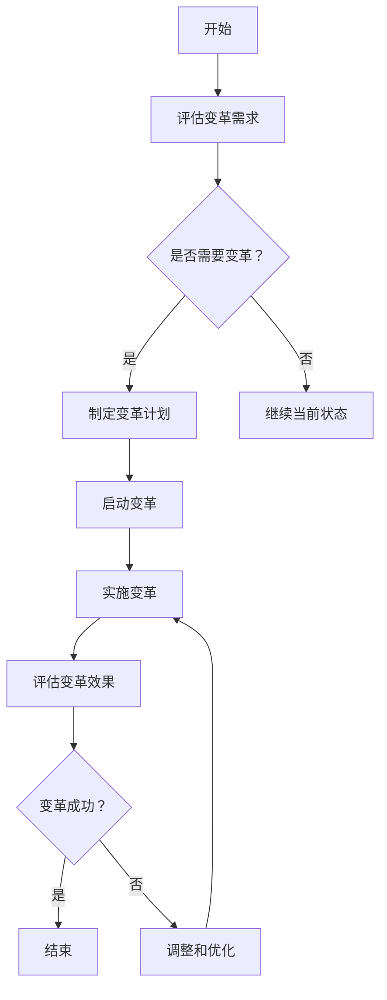

                 

## 引言

在当今快速变化的技术和市场环境中，企业面临着前所未有的挑战和机遇。为了保持竞争力，许多组织不得不进行大规模的转型，这往往意味着在组织结构、工作流程、文化等方面进行深刻的变革。作为这些变革的领导者，管理者需要具备强大的领导力和变革管理能力，以引导团队顺利度过转型期，确保变革的成功实施。

领导力与变革是两个看似独立但又相互关联的重要概念。领导力是领导者引导和激励团队成员实现目标的能力，而变革管理则是指组织在应对外部和内部变化时采取的一系列策略和行动。这两者在转型期中相辅相成，缺一不可。领导力提供了变革所需的愿景和方向，而变革管理则确保了这一愿景能够在实际操作中得到有效执行。

本文旨在探讨领导力与变革在组织转型中的作用和关系。我们将首先介绍领导力的基本概念和重要性，然后讨论变革管理的核心原则和策略。接下来，我们将深入分析领导力在转型期的具体应用，包括领导者的角色与职责、团队建设与重构等。最后，我们将通过项目实战案例，展示领导力与变革在实际操作中的结合，并提供最佳实践建议。

通过本文的阅读，读者将能够理解领导力与变革的内在联系，掌握在转型期引导团队的有效策略，从而为组织的持续发展奠定坚实基础。

## 关键词

领导力、变革管理、团队转型、变革驱动力、自我领导、领导风格、变革规划、沟通策略、团队协作、项目实战、持续发展。

## 摘要

本文旨在探讨领导力与变革在组织转型中的关键作用和相互关系。首先，介绍了领导力的基本概念和重要性，包括情感智慧、影响力和决策能力等核心要素。接着，阐述了变革管理的核心原则和策略，分析了变革的驱动力、类型和阶段。随后，重点讨论了领导力在转型期的具体应用，包括领导者的角色、团队建设与重构等。通过项目实战案例，本文展示了领导力与变革在实际操作中的结合，并提出了最佳实践建议。文章最后对未来的发展趋势进行了展望，总结了领导力与变革在持续发展中的重要性。

## 领导力概述

领导力是一个多维度、多层次的概念，它涵盖了领导者对团队成员的影响力和能力，以推动组织实现其目标。领导力的本质在于激发和引导团队成员，使他们愿意为实现共同目标而努力。为了更好地理解领导力，我们需要从定义、重要性以及核心要素三个方面进行探讨。

### 领导力的定义

领导力是一种通过影响他人来实现共同目标的能力。这种能力不仅仅局限于企业或组织内部，它在社会、政治和军事等多个领域都有广泛应用。广义上，领导力可以理解为一种人格特质，而狭义上，它则是指特定的行为和技巧。

- **广义定义**：领导力是一种人格特质，包括自信、决策力、责任感等。这种特质使得领导者能够在不确定的环境中迅速做出决策，并带领团队克服困难。
- **狭义定义**：领导力是指一系列行为和技巧，包括沟通、激励、协调等。这些行为和技巧帮助领导者有效地影响和引导团队成员，实现目标。

### 领导力的重要性

领导力在组织中具有至关重要的地位。一个优秀的领导者不仅能够提高团队的绩效，还能促进组织的创新和发展。以下是领导力在组织中的几个关键作用：

- **目标设定**：领导者通过设定明确的目标，为团队提供清晰的方向和愿景。这些目标不仅是组织成功的关键，也是激发团队成员动力的重要来源。
- **激励与激励**：领导者的一个重要职责是激励团队成员，使他们愿意付出额外的努力来实现目标。通过有效的激励手段，如认可、奖励和培训，领导者能够激发团队成员的潜力和热情。
- **沟通与协调**：领导者需要具备良好的沟通技巧，能够清晰地表达自己的想法，并确保信息在团队中有效传递。同时，领导者还需要协调团队成员之间的工作，解决冲突，确保团队能够高效运作。

### 领导力的核心要素

领导力并非单一的能力，而是由多个核心要素构成的复合体。以下三个要素是领导力的基础：

- **情感智慧**：情感智慧是指领导者理解自己和他人的情感，并能够有效地管理这些情感。这种智慧有助于领导者建立良好的人际关系，提高团队的凝聚力和信任度。
  - **理解自己**：领导者需要了解自己的情感，以便在压力或挑战面前保持冷静和理智。
  - **理解他人**：领导者需要能够感知和解读团队成员的情感，从而更好地理解他们的需求和行为。
  
- **影响力**：影响力是领导者通过言语和行为影响他人意愿的能力。领导者需要具备多种影响力策略，如授权、激励和榜样作用，以实现团队目标。
  - **授权**：领导者通过授权，赋予团队成员责任和权力，使他们能够自主决策和行动，从而提高团队的自主性和创造力。
  - **激励**：领导者通过奖励、认可和培训等方式激励团队成员，激发他们的积极性和工作热情。
  - **榜样作用**：领导者通过自身的行为和态度，树立榜样，影响团队成员的行为和价值观。

- **决策能力**：决策能力是领导者的重要素质，它涉及对复杂信息的分析和判断，以及对潜在风险和机遇的评估。有效的决策能力有助于领导者做出明智的决策，引导团队走向成功。
  - **信息收集与分析**：领导者需要收集和分析相关信息，以便做出基于数据的决策。
  - **风险评估与机遇评估**：领导者需要对决策的潜在风险和机遇进行评估，以便做出最优选择。
  - **快速决策与适应变化**：在快速变化的环境中，领导者需要具备快速决策的能力，并能够根据新情况调整策略。

### 领导力与变革的关系

领导力与变革密切相关。领导者不仅需要具备变革管理的知识，还需要通过领导力来推动变革的顺利进行。以下是领导力与变革之间的关系：

- **领导力是变革的驱动力**：领导者通过设定愿景、激励团队成员和解决变革中的问题，推动组织实现变革。
- **变革是领导力的体现**：在变革过程中，领导者需要展现其领导力，包括决策能力、影响力、沟通能力等，以应对变革带来的挑战。
- **领导力与变革的互动**：领导力不仅影响变革的实施，变革的成功也会反过来增强领导力。通过成功的变革，领导者能够提高自己的声誉和影响力。

总之，领导力是组织成功转型的基础，而变革则是组织持续发展的关键。领导者需要通过有效的领导力和变革管理能力，引导团队顺利度过转型期，实现组织的长远发展。

## 领导力的发展历程

领导力作为一个历史悠久的概念，其理论和方法随着时代的发展不断演进。从古代的统治方式到现代的管理理论，领导力的发展经历了多个阶段，每个阶段都有其独特的特点和代表性理论。以下是领导力发展历程的概述，包括传统领导理论和当代领导理论。

### 传统领导理论

传统领导理论主要关注领导者的行为和风格，强调领导者对下属的指导和控制。以下是几个代表性的传统领导理论：

#### 权力导向理论

权力导向理论认为，领导者通过掌握和运用权力来指导和控制下属。该理论主要关注领导者的权威和地位，认为领导者的主要任务是维持组织的稳定和秩序。权力导向理论主要包括以下几种形式：

- **法西斯式领导**：领导者通过强制和威胁手段来控制下属，以确保组织的高效运作。
- **官僚式领导**：领导者通过制定严格的规定和流程来管理组织，强调规范和秩序。

#### 行为导向理论

行为导向理论认为，领导者的成功取决于其行为和方式，而不是其权力或地位。该理论主要研究领导者的行为特征，并试图找到有效的领导行为模式。行为导向理论主要包括以下几种形式：

- **模范型领导**：领导者通过自身的行为和态度，树立榜样，影响和激励下属。
- **任务导向型领导**：领导者注重任务的完成，强调效率和目标实现。

### 当代领导理论

随着社会的变迁和组织形式的变化，当代领导理论开始更加关注领导者的个人特质和团队协作。以下是几个代表性的当代领导理论：

#### 情感智慧理论

情感智慧理论强调领导者的情感管理能力，认为情感智慧是领导力的核心要素之一。领导者需要具备自我认知、自我管理和情感识别的能力，以便更好地理解和管理自己的情感，以及与他人建立良好的关系。

#### 服务型领导理论

服务型领导理论认为，领导者的主要任务是服务团队成员，满足他们的需求和期望。这种领导模式强调领导者与团队成员之间的合作关系，鼓励团队成员参与决策和共同承担责任。

#### 适应性领导理论

适应性领导理论强调领导者在面对不确定性时的适应能力。领导者需要具备快速学习、创新和变革的能力，以应对不断变化的环境和挑战。

### 领导力的发展趋势

随着全球化、技术变革和市场竞争的加剧，领导力的发展呈现出一些新的趋势：

- **跨文化领导**：随着全球化的深入，领导者需要具备跨文化沟通和管理能力，能够有效协调不同文化背景的团队成员。
- **数字化领导**：随着数字化技术的普及，领导者需要具备数字素养和数字化转型能力，以推动组织的数字化进程。
- **可持续领导**：在可持续发展成为全球关注焦点的背景下，领导者需要具备环境和社会责任意识，推动组织的可持续发展和企业社会责任。

总之，领导力的发展历程是一个不断演进的过程，从传统的权力和控制，到当代的情感智慧和服务型领导，再到适应性的数字化领导，领导力理论在不断适应和应对新的挑战和变化。领导者需要不断学习和适应这些变化，以提高自己的领导力和组织的管理水平。

## 领导力的核心要素

领导力并非单一的能力，而是由多个核心要素组成的复合体。这些要素共同作用，帮助领导者有效地引导和管理团队，实现组织的愿景和目标。以下是领导力的三个核心要素：情感智慧、影响力和决策能力。

### 情感智慧

情感智慧（Emotional Intelligence，简称EQ）是领导力的关键要素之一。它指的是个体识别、理解、管理自己和他人的情感，并利用这些情感促进思考、决策和人际交往的能力。情感智慧由四个主要成分构成：自我认知、自我管理、社交意识和关系管理。

- **自我认知**：指领导者能够清楚地认识到自己的情感状态，并理解这些情感对自身行为和决策的影响。
- **自我管理**：指领导者能够有效地管理和调节自己的情绪，尤其是在压力和挑战面前保持冷静和理智。
- **社交意识**：指领导者能够感知和理解他人的情感和需求，从而更好地与他人沟通和协作。
- **关系管理**：指领导者能够建立和维护积极的人际关系，有效地解决冲突和促进团队合作。

在领导力中，情感智慧具有以下几个重要作用：

- **建立信任**：通过展示情感智慧，领导者能够建立与团队成员的信任关系，增强团队的凝聚力和协作效率。
- **促进创新**：情感智慧有助于领导者理解和激发团队成员的创造力，促进创新思维的发展。
- **提高决策质量**：领导者通过情感智慧能够更好地评估风险和机遇，做出更为明智和合理的决策。

### 影响力

影响力（Influence）是领导者通过言语和行为影响他人意愿的能力。领导者需要具备多种影响力策略，包括授权、激励和榜样作用等，以实现团队目标。

- **授权**：领导者通过授权，赋予团队成员责任和权力，使他们能够自主决策和行动，从而提高团队的自主性和创造力。
- **激励**：领导者通过奖励、认可和培训等方式激励团队成员，激发他们的积极性和工作热情。
- **榜样作用**：领导者通过自身的行为和态度，树立榜样，影响团队成员的行为和价值观。

在领导力中，影响力具有以下几个重要作用：

- **提高团队绩效**：通过影响力策略，领导者能够激发团队成员的潜力，提高团队的绩效和生产力。
- **促进团队协作**：领导者通过影响力，解决团队中的冲突和问题，促进团队成员之间的协作和合作。
- **建立组织文化**：领导者通过影响力，塑造和传播组织的核心价值观和理念，建立强大的组织文化。

### 决策能力

决策能力（Decision-Making Ability）是领导者的另一个关键要素。它涉及对复杂信息的分析和判断，以及对潜在风险和机遇的评估。有效的决策能力有助于领导者做出明智的决策，引导团队走向成功。

- **信息收集与分析**：领导者需要收集和分析相关信息，以便做出基于数据的决策。
- **风险评估与机遇评估**：领导者需要对决策的潜在风险和机遇进行评估，以便做出最优选择。
- **快速决策与适应变化**：在快速变化的环境中，领导者需要具备快速决策的能力，并能够根据新情况调整策略。

在领导力中，决策能力具有以下几个重要作用：

- **应对不确定性**：领导者通过有效的决策能力，能够在不确定性中找到正确的方向，应对复杂和不确定的环境。
- **提高组织效能**：领导者通过明智的决策，优化组织资源，提高组织整体效能和竞争力。
- **增强团队信心**：领导者通过成功的决策，增强团队的信心和士气，促进团队的发展和成长。

### 情感智慧、影响力和决策能力的互动

在领导力的实践中，情感智慧、影响力和决策能力相互关联、相互作用。情感智慧有助于领导者建立信任和影响力，而影响力又能够促进领导者做出更明智的决策。同时，决策能力为情感智慧和影响力的发挥提供了实践基础。

- **情感智慧促进影响力**：通过情感智慧，领导者能够更好地理解和满足团队成员的需求，增强团队对领导者的信任和认同，从而提高影响力。
- **影响力增强决策能力**：通过影响力，领导者能够获得更多的信息和资源，提高决策的准确性和有效性。
- **决策能力体现情感智慧和影响力**：领导者的决策不仅基于逻辑和分析，还受到情感智慧和影响力的影响。有效的决策需要领导者综合考虑情感和人际因素，同时利用自身的影响力和资源。

总之，情感智慧、影响力和决策能力是领导力的核心要素，它们共同作用，帮助领导者有效地引导和管理团队，实现组织的愿景和目标。领导者需要不断提升这些能力，以应对不断变化的环境和挑战。

## 变革管理概述

变革管理是指组织在面临外部或内部变化时，采取的一系列策略和行动，以确保变革的顺利进行并最终成功实施。变革管理的核心在于理解变革的驱动力、识别变革的类型和阶段，以及应对变革过程中可能出现的挑战。

### 变革的驱动力

组织变革的驱动力多种多样，包括外部环境变化、内部需求变化以及技术进步等。以下是几个常见的变革驱动力：

- **外部环境变化**：市场需求的转变、竞争压力的增加、法律法规的变动等，都可能迫使组织进行变革以保持竞争力。
- **内部需求变化**：组织战略调整、业务流程优化、企业文化重塑等，都可能成为组织内部变革的驱动力。
- **技术进步**：新技术的应用和普及，可以提升组织的运营效率，降低成本，提高市场响应速度。

### 变革的类型

变革可以按照其性质和范围进行分类。以下是几种常见的变革类型：

- **结构变革**：涉及组织结构的调整，如部门合并、重组、裁员等。
- **流程变革**：涉及业务流程的改进和优化，如引入新的管理工具、流程再造等。
- **技术变革**：涉及技术的更新和应用，如引入新的信息系统、自动化设备等。
- **文化变革**：涉及企业文化的重塑，如价值观的更新、员工行为规范的调整等。

### 变革的阶段

变革管理通常可以分为以下几个阶段：

- **准备阶段**：在这一阶段，组织需要对变革进行全面的评估和规划，包括确定变革的目标、制定变革计划、评估变革的风险等。
- **启动阶段**：这一阶段的核心任务是正式宣布变革计划，动员全体员工参与变革，并开始实施具体的变革措施。
- **实施阶段**：这一阶段是变革的核心阶段，需要组织全体成员共同努力，克服变革中的各种困难和挑战，确保变革计划的顺利执行。
- **评估与调整阶段**：在变革实施后，需要对变革的效果进行评估，识别存在的问题和不足，并进行相应的调整和优化。

### 变革管理的挑战与对策

在变革过程中，组织常常会遇到各种挑战，如员工抵触、资源不足、沟通不畅等。以下是一些常见的挑战及其对策：

- **员工抵触**：员工可能因为害怕失去工作、担心变革带来的不确定性等原因而抵触变革。应对策略包括与员工进行有效沟通、提供培训和支持、明确变革对员工个人的好处等。
- **资源不足**：变革需要投入大量的人力、物力和财力资源。组织需要提前进行资源规划，确保变革所需的资源能够及时到位。
- **沟通不畅**：有效的沟通是变革成功的关键。组织需要建立多层次的沟通机制，确保信息在各个层级之间顺畅传递，避免信息误解和失真。
- **组织惯性**：组织长期积累的惯性思维和行为模式可能阻碍变革的推进。组织需要通过制度和文化变革，逐步消除惯性思维的影响，推动变革的顺利进行。

总之，变革管理是一个复杂而系统的过程，需要组织在各个阶段采取有效的策略和措施，确保变革的顺利进行。通过科学的变革管理，组织可以更好地适应外部环境的变化，实现持续发展和创新。

## 变革规划与实施

变革规划与实施是变革管理过程中至关重要的一环，它决定了变革能否顺利推进并取得预期效果。以下是变革规划与实施的具体步骤、沟通策略以及实施过程中关键因素的分析。

### 变革规划

#### 1. 制定变革目标

在变革规划的第一步，组织需要明确变革的目标。这些目标应具体、可衡量、可实现、相关性强、时限明确（SMART原则）。例如，提升生产效率、优化客户服务流程、减少成本等。

#### 2. 进行现状分析

在明确目标后，组织需要对当前状况进行全面分析，包括业务流程、组织结构、员工素质、文化氛围等。通过SWOT分析（优势、劣势、机会、威胁）等工具，识别变革的驱动因素和潜在障碍。

#### 3. 制定变革方案

基于目标分析和现状分析，组织应制定详细的变革方案。方案应包括变革的具体措施、时间表、责任分配、资源配置等。例如，引入新的信息技术系统、调整工作流程、提供员工培训等。

#### 4. 评估变革风险

在制定变革方案时，组织需要评估变革可能带来的风险，如员工抵触、资源短缺、技术难题等。针对每个潜在风险，制定相应的应对策略，以确保变革的顺利进行。

### 变革实施

#### 1. 启动变革

在变革实施阶段，组织需要正式宣布变革计划，并动员全体员工参与。这一阶段的关键是建立变革的紧迫感和共识。组织可以通过召开动员大会、发布内部通讯、举办研讨会等方式，让员工了解变革的必要性和目标。

#### 2. 沟通策略

有效的沟通是变革成功的关键。组织应采用多层次的沟通策略，确保信息在不同层级之间顺畅传递，避免信息误解和失真。

- **高层沟通**：确保高层领导对变革的支持和承诺，建立变革的领导力团队，明确各自的职责和作用。
- **中层沟通**：中层管理者需要成为变革的推动者和解释者，将高层的意图和计划传达给基层员工，并解决他们在实施过程中的问题和困惑。
- **基层沟通**：与基层员工进行直接沟通，了解他们的需求和顾虑，提供必要的培训和指导，确保他们能够理解和接受变革。

#### 3. 推动变革

在变革实施过程中，组织需要采取一系列措施来推动变革：

- **培训与支持**：为员工提供必要的培训和支持，帮助他们适应新的工作流程和技术系统。
- **激励与认可**：通过奖励和认可机制，激励员工积极参与变革，并克服变革中的困难和挑战。
- **持续反馈与调整**：建立反馈机制，定期评估变革的进展和效果，根据反馈进行必要的调整和优化。

### 变革实施的关键因素

#### 1. 领导力

领导力在变革实施中起着至关重要的作用。领导者需要具备强大的变革管理能力，包括：

- **变革愿景**：明确变革的愿景和目标，并能够有效地传达给团队成员。
- **激励与引导**：通过激励和引导，激发员工的积极性和参与度。
- **沟通能力**：确保信息在各个层级之间有效传递，避免误解和冲突。

#### 2. 团队协作

变革不是某个个体或部门的责任，而是整个组织共同的任务。团队协作是变革成功的关键。组织需要建立跨部门、跨层级的协作机制，确保各个部门之间的沟通和协调，共同推动变革的进行。

#### 3. 持续改进

变革是一个持续的过程，需要组织不断地进行调整和优化。组织应建立持续改进机制，鼓励员工提出改进建议，并根据实际情况进行相应的调整和优化。

### 项目实战

以下是一个实际的变革实施项目：

#### 项目背景

某公司计划引入新的客户关系管理系统（CRM），以提升客户服务水平和销售业绩。然而，由于员工对新技术的不熟悉和抵触，项目进展缓慢。

#### 项目步骤

1. **制定变革方案**：明确变革的目标、具体措施、时间表和责任分配。制定详细的培训计划和沟通策略。
2. **启动变革**：召开全体员工大会，介绍CRM系统的优势和变革的必要性。建立变革领导力团队，明确各自的职责和作用。
3. **实施培训**：为员工提供全面的CRM系统培训，包括基础操作、高级功能等。提供一对一的辅导和支持，解决员工在实际操作中的问题。
4. **激励与认可**：设立奖励机制，对积极参与培训和使用CRM系统的员工给予奖励和认可。
5. **持续反馈与调整**：定期收集员工对CRM系统的反馈，识别存在的问题和不足，并进行相应的调整和优化。

#### 项目效果

通过上述步骤，公司成功地引入了CRM系统，员工对系统的熟悉度和使用率显著提高。客户服务水平和销售业绩也有了显著提升，实现了预期的变革目标。

### 总结

变革规划与实施是一个复杂而系统的过程，需要组织在各个阶段采取有效的策略和措施。通过科学的变革管理，组织可以更好地适应外部环境的变化，实现持续发展和创新。

## 变革中的团队管理

在变革过程中，团队管理是确保变革成功的关键环节。变革不仅影响组织的战略方向和业务流程，还会对员工的心理状态和工作方式产生深远影响。因此，领导者需要关注团队在变革中的动态，采取有效的管理策略，确保团队成员能够适应并积极参与变革。

### 变革对团队的影响

变革对团队的影响是复杂和多方面的，包括心理压力、角色变化、沟通障碍和团队冲突等。

- **心理压力**：变革往往伴随着不确定性和不确定性，这可能导致员工感到焦虑、恐惧和不安。尤其是在涉及裁员、岗位调整等重大变革时，员工的压力更大。
- **角色变化**：变革可能会导致团队角色的重新定义，例如新的工作流程和职责分配。员工需要适应这些变化，可能需要学习新的技能或承担额外的责任。
- **沟通障碍**：变革过程中，信息传递的透明度和及时性可能受到影响。管理层和员工之间的沟通不畅，可能导致误解和猜疑，进一步加剧团队的不稳定性。
- **团队冲突**：在变革过程中，不同的利益相关者可能会有不同的看法和立场，这可能导致团队内部的冲突。例如，某些员工可能对变革持反对态度，而另一些员工则可能积极支持。

### 团队协作与冲突管理

为了应对变革带来的挑战，领导者需要采取以下策略来促进团队协作和解决冲突：

- **建立共识**：在变革初期，领导者需要与团队成员建立共识，明确变革的目标和重要性。通过沟通和讨论，让团队成员理解变革的必要性和对组织的益处，从而减少抵触情绪。
- **加强沟通**：领导者需要建立有效的沟通机制，确保信息在团队内部透明、及时地传递。通过定期的会议、工作坊和培训，让团队成员了解变革的进展和计划，减少误解和猜疑。
- **提供支持**：领导者应提供必要的支持和资源，帮助团队成员应对变革带来的挑战。这可能包括培训、指导和心理支持等，帮助员工适应新的工作环境。
- **促进团队建设**：通过团队建设活动，增强团队成员之间的信任和凝聚力。例如，组织团队建设培训、团建活动等，提高团队的协作能力和士气。
- **解决冲突**：在变革过程中，冲突是不可避免的。领导者需要积极解决冲突，避免其对团队产生负面影响。解决冲突的方法包括：对话和调解、寻求共同利益、明确责任和期望等。

### 提升团队适应变革的能力

为了提升团队适应变革的能力，领导者需要采取一系列策略：

- **建立学习型组织**：鼓励员工持续学习和成长，建立学习型组织文化。通过培训、研讨会和工作坊等，提高员工的技能和知识水平，增强他们的适应能力。
- **激励创新**：激励团队成员提出新的想法和改进方案，鼓励创新思维。通过奖励和认可机制，激发员工的创造力和主动性。
- **强化团队合作**：通过团队协作项目和工作任务，增强团队成员之间的互动和合作，提高团队的协作效率。
- **提供反馈机制**：建立有效的反馈机制，让团队成员能够及时了解自己的表现和进步，并根据反馈进行调整和改进。
- **关注员工心理健康**：关注员工在变革过程中的心理健康，提供必要的心理支持和咨询，帮助他们应对压力和挑战。

总之，在变革过程中，团队管理至关重要。领导者需要关注团队成员的心理状态和工作动态，采取有效的管理策略，促进团队协作，解决冲突，提升团队适应变革的能力。通过这些措施，组织可以更好地应对变革带来的挑战，确保变革的顺利进行。

### 领导力在转型期的应用

在转型期，领导力扮演着至关重要的角色，它是推动组织变革、确保转型成功的关键力量。转型期领导力不仅需要领导者具备传统的管理能力，还需要他们能够在复杂和不确定的环境中展现出更高的适应性和创新能力。以下是转型期领导力的具体应用，包括领导者的角色与职责、面临的挑战以及应对策略。

#### 领导者的角色与职责

在转型期，领导者需要承担多重角色和职责，以下是他们的一些关键任务：

1. **设定愿景和目标**：领导者需要明确转型的愿景和目标，确保团队对变革的方向和目标有清晰的认识。通过沟通和动员，领导者可以将愿景转化为团队的共同目标，激发员工的热情和动力。

2. **建立信任和共识**：在转型期，领导者需要建立与团队成员之间的信任，并促进团队内部的共识。通过透明的沟通和参与式管理，领导者可以减少变革带来的不确定性和焦虑，增强团队的凝聚力和合作意愿。

3. **提供指导和支持**：领导者需要为团队成员提供必要的指导和支持，帮助他们应对变革带来的挑战。这包括提供培训、资源和心理支持，确保团队成员能够顺利适应新的工作环境和职责。

4. **激励和认可**：在转型期，领导者需要通过激励和认可机制，鼓励员工积极参与变革，克服困难。这可以通过奖励、晋升和其他激励措施来实现，从而激发员工的积极性和创造力。

#### 领导者在转型期面临的挑战

转型期领导力面临一系列挑战，以下是其中几个主要的挑战：

1. **不确定性**：转型期充满了不确定性，领导者需要应对市场变化、技术进步、政策调整等多重不确定性因素。这种不确定性可能引发团队的不安和焦虑，影响变革的推进。

2. **资源有限**：在转型期，组织可能面临资源不足的困境，包括人力、资金和技术资源。领导者需要在有限的资源下，制定有效的变革策略，确保变革能够持续推进。

3. **抵制变革**：变革往往面临内部和外部的抵制。员工可能因为担心变革会威胁到自己的利益或工作稳定而抵制变革。领导者需要有效地管理这些抵触情绪，通过沟通和参与式管理来化解矛盾。

4. **沟通障碍**：在转型期，信息的传递和沟通可能变得复杂和困难。领导者需要建立有效的沟通机制，确保信息在不同层级和部门之间顺畅传递，避免误解和猜疑。

#### 应对策略

为了应对转型期领导力面临的挑战，领导者可以采取以下策略：

1. **建立强有力的领导团队**：领导者需要组建一个多元化的领导团队，确保团队成员具备不同的技能和视角。通过跨部门的合作和沟通，领导者可以更全面地应对变革中的挑战。

2. **加强沟通与参与**：领导者需要通过定期的会议、工作坊和小组讨论，与团队成员保持密切的沟通。通过参与式管理，领导者可以更好地理解员工的需求和顾虑，并共同制定变革策略。

3. **培养变革思维**：领导者需要培养团队的变革思维，鼓励员工勇于尝试和接受新事物。通过培训和实践，领导者可以帮助员工掌握变革所需的技能和知识，增强他们的适应能力。

4. **提供心理支持**：在变革过程中，领导者需要关注员工的心理健康，提供必要的心理支持。通过设立心理咨询热线、组织心理健康讲座等方式，领导者可以帮助员工应对变革带来的压力和焦虑。

5. **灵活调整策略**：在转型期，领导者需要根据实际情况灵活调整变革策略。通过定期评估变革的进展和效果，领导者可以及时发现问题和调整方向，确保变革能够持续推进。

总之，在转型期，领导力是推动组织变革、确保变革成功的关键。领导者需要承担多重角色和职责，应对各种挑战，并采取有效的策略和措施，确保团队能够顺利度过转型期，实现组织的持续发展和创新。

### 团队建设与重构

在组织转型过程中，团队建设和重构是确保变革成功的重要环节。通过有效的团队建设，可以增强团队成员的凝聚力和协作能力，而团队重构则有助于适应新的工作环境和工作要求。以下是团队建设与重构的步骤、策略和提升团队效能的方法。

#### 团队建设的步骤

1. **明确团队目标**：首先，团队需要明确共同的目标和愿景。这些目标应具体、可衡量、可实现、相关性强、时限明确（SMART原则），以便为团队建设提供明确的方向。

2. **评估团队现状**：在明确目标后，团队需要评估当前团队的工作状态、成员能力、团队文化等。这可以通过问卷调查、小组讨论、访谈等方式进行。

3. **制定建设计划**：基于评估结果，团队应制定详细的团队建设计划。计划应包括具体的目标、实施步骤、责任分配和时间表。

4. **实施建设计划**：按照计划，团队应逐步实施团队建设活动。这可以包括培训、团队建设活动、工作坊等，旨在提升团队成员的技能、增强团队协作和沟通。

5. **评估与调整**：在建设过程中，团队应定期评估建设效果，并根据反馈进行必要的调整和优化。这有助于确保团队建设计划的顺利进行。

#### 团队重构的步骤

1. **分析需求**：首先，团队需要分析组织变革的需求，包括新的工作流程、职责分配、技能要求等。这有助于确定重构的必要性和方向。

2. **制定重构方案**：在明确需求后，团队应制定详细的团队重构方案。方案应包括重构的目标、具体措施、时间表、责任分配等。

3. **实施重构方案**：按照方案，团队应逐步实施重构措施。这可能涉及人员调整、职责分配、流程优化等。实施过程中，团队需要确保重构方案能够有效适应新的工作环境。

4. **监督与反馈**：在重构过程中，团队应持续监督重构措施的执行情况，并根据反馈进行必要的调整和优化。这有助于确保重构能够达到预期效果。

5. **评估与总结**：重构实施后，团队应对重构效果进行评估，总结经验教训，为未来的团队建设提供参考。

#### 提升团队效能的方法

1. **明确角色和职责**：确保每个团队成员都清楚自己的角色和职责，避免职责重叠和责任不清的情况。这有助于提高团队的工作效率。

2. **建立有效的沟通机制**：建立多层次的沟通机制，确保信息在团队内部透明、及时地传递。通过定期会议、工作坊、团队邮件等方式，增强团队成员之间的沟通和协作。

3. **提供培训和发展机会**：为团队成员提供培训和发展机会，帮助他们提升技能和知识水平。通过培训，可以提高团队的整体效能。

4. **鼓励创新和反馈**：鼓励团队成员提出创新的想法和建议，并建立反馈机制，确保团队成员的声音能够被听到和重视。这有助于激发团队的创造力和积极性。

5. **建立积极的工作文化**：通过建立积极的工作文化，增强团队的凝聚力和归属感。这可以包括庆祝团队成就、组织团队建设活动、建立公平的激励机制等。

6. **优化工作流程**：通过优化工作流程，减少不必要的工作环节和冗余，提高团队的工作效率。例如，使用项目管理工具、自动化工具等，提高工作流程的效率。

总之，团队建设与重构是组织转型成功的重要保障。通过有效的团队建设，可以增强团队的凝聚力和协作能力；通过团队重构，可以适应新的工作环境和工作要求。领导者需要关注团队动态，采取有效的策略和措施，不断提升团队效能，为组织的持续发展奠定坚实基础。

### 项目实战：领导力与变革的结合

为了更好地展示领导力与变革在实际操作中的结合，我们将通过一个具体的案例——某大型科技公司引入敏捷开发方法的变革项目，来详细分析这个项目的开发环境搭建、源代码实现、代码解读、应用解读与分析，以及实际案例分析和详细讲解剖析。最后，我们将总结项目的成功关键因素，并分享一些最佳实践建议。

#### 项目背景

某大型科技公司长期依赖于传统的瀑布式开发模式，这种模式虽然稳定但缺乏灵活性，难以快速响应市场需求的变化。为了提高开发效率和市场响应速度，公司决定引入敏捷开发方法。然而，这一变革面临诸多挑战，如团队对敏捷方法的不熟悉、传统工作习惯的改变、项目管理方式的转变等。因此，领导力在推动这一变革中起到了关键作用。

#### 开发环境搭建

1. **基础设施搭建**：
   - **服务器和数据库**：为了支持敏捷开发，公司首先搭建了云基础设施，包括多个服务器和数据库实例，确保系统的高可用性和扩展性。
   - **版本控制系统**：引入Git作为版本控制系统，确保代码的版本管理和协同开发。
   - **集成开发环境（IDE）**：统一使用公司推荐的IDE，如IntelliJ IDEA或Visual Studio，提高开发效率。

2. **工具集成**：
   - **自动化构建工具**：引入Jenkins作为自动化构建工具，实现代码的自动化构建和部署，减少人工干预。
   - **持续集成/持续部署（CI/CD）**：搭建CI/CD流程，确保代码的每个版本在发布前都经过严格的测试和验证。

3. **团队组织调整**：
   - **跨职能团队**：根据敏捷开发的特点，公司将原有的职能团队重构为跨职能团队，每个团队包括产品经理、开发人员、测试人员、UI设计师等，以实现快速响应和协同工作。

#### 源代码实现

1. **模块化开发**：
   - **功能模块化**：将原有的大规模代码库拆分为多个独立的功能模块，每个模块负责特定的功能。
   - **代码质量**：引入代码审查机制，确保每个模块的代码质量，降低技术债务。

2. **迭代开发**：
   - **迭代计划**：按照敏捷开发的方法，团队每两周进行一次迭代，制定详细的迭代计划，明确本次迭代的目标和任务。
   - **每日站立会议**：每天早上举行短暂的站立会议，团队共同讨论进展、问题和解决方案。

3. **用户体验优先**：
   - **用户故事**：团队使用用户故事来描述功能需求，确保开发工作始终以用户需求为中心。
   - **原型设计**：开发前进行原型设计，与用户进行反馈迭代，确保最终产品的用户体验。

#### 代码解读

1. **代码规范**：
   - **命名规范**：统一代码命名规范，提高代码的可读性和可维护性。
   - **注释规范**：在每个函数和类之前添加注释，解释其功能和用途。

2. **代码复用**：
   - **库和框架**：引入常用的库和框架，减少重复代码，提高开发效率。
   - **设计模式**：使用设计模式，如工厂模式、单例模式等，提高代码的灵活性和可扩展性。

#### 应用解读与分析

1. **自动化测试**：
   - **单元测试**：为每个模块编写单元测试，确保代码功能的正确性。
   - **集成测试**：在模块集成后进行集成测试，确保不同模块之间的协作。

2. **性能优化**：
   - **负载测试**：使用负载测试工具，模拟高并发场景，评估系统的性能和稳定性。
   - **监控与分析**：引入监控系统，实时监控系统的运行状态，及时发现和解决性能问题。

#### 实际案例分析与详细讲解剖析

1. **案例背景**：
   - 项目目标是开发一款移动应用，提供实时股票信息和分析服务。

2. **案例分析**：
   - **迭代开发**：团队采用敏捷开发方法，每个迭代周期为两周。在第一个迭代中，团队完成了用户界面设计和基础功能开发，包括股票数据的展示和基本分析。
   - **用户反馈**：通过用户反馈，团队发现某些功能不满足用户需求，如股票图表的显示效果和实时性。团队立即进行了调整和优化，在下一个迭代中增加了图表的动画效果和实时数据更新。

3. **详细讲解剖析**：
   - **UI设计**：团队使用了React Native框架进行UI设计，确保应用在Android和iOS平台上的一致性。
   - **数据更新**：为了实现实时数据更新，团队使用了WebSocket技术，将实时数据推送至客户端。

#### 项目小结

1. **成功关键因素**：
   - **领导力**：领导者通过沟通、激励和培训，确保团队成员理解敏捷开发方法并积极参与变革。
   - **团队协作**：跨职能团队的协作和快速响应能力，确保项目能够按计划推进。
   - **用户反馈**：通过持续的用户反馈和迭代，团队能够及时调整和优化产品，满足用户需求。

2. **最佳实践建议**：
   - **持续培训**：定期为团队成员提供敏捷开发方法的相关培训，确保他们能够掌握和应用新的开发方法。
   - **透明沟通**：建立透明的沟通机制，确保团队成员之间信息流畅，减少误解和冲突。
   - **持续优化**：不断评估和优化开发流程和工具，提高开发效率和产品质量。

通过这个项目实战案例，我们可以看到领导力与变革在敏捷开发方法中的有效结合，以及如何通过科学的团队建设和重构策略，实现项目的成功和组织的持续发展。

### 持续发展

在领导力与变革的持续发展过程中，组织需要不断地优化和完善现有的管理策略，以适应不断变化的环境和市场需求。持续发展的理念和方法不仅有助于组织在短期内取得成功，更为其长远发展奠定了坚实基础。

#### 持续发展的理念

持续发展强调组织的长期繁荣和可持续性，不仅仅是追求短期利益，更重要的是关注组织的社会责任、环境责任和经济效益的平衡。以下是几个关键理念：

- **长期规划**：组织需要制定长期的战略规划，明确长期目标和阶段性目标，确保每一步的发展都符合组织的整体愿景。
- **创新驱动**：持续发展依赖于组织的创新能力，通过不断探索新的技术、方法和模式，提高组织的竞争力和市场响应速度。
- **员工参与**：员工的参与和贡献是持续发展的关键，组织需要通过培训和激励机制，激发员工的积极性和创造力。
- **社会责任**：组织需要承担社会责任，积极参与社会公益活动，建立良好的企业声誉和社会形象。

#### 持续发展的策略

为了实现持续发展，组织可以采取以下策略：

1. **战略调整**：根据市场变化和内部资源情况，定期对组织的战略进行调整和优化。这包括业务方向、市场定位、资源分配等方面的调整。

2. **技术创新**：持续投资于技术研发和创新，保持技术领先地位。通过引入新技术、优化现有技术，提高生产效率和市场竞争力。

3. **流程优化**：不断优化业务流程和管理流程，消除冗余和低效环节，提高组织的运作效率和效能。

4. **人才发展**：通过培训、职业规划和个人发展计划，提升员工的专业技能和工作能力。同时，建立公平的激励机制，激发员工的积极性和创造力。

5. **文化建设**：建立积极向上的组织文化，强调团队合作、创新精神和客户至上。通过文化建设，提高组织的凝聚力和向心力。

6. **社会责任**：积极参与社会公益活动，推动可持续发展。通过社会责任项目，提升企业的社会形象和品牌价值。

#### 领导力与变革的持续优化

持续发展需要领导力与变革的持续优化，以下是几个关键方面：

1. **领导力的提升**：领导者需要不断提升自身的领导力，包括战略思维、创新思维、变革管理能力等。通过不断学习和实践，领导者能够更好地引领组织应对挑战和机遇。

2. **变革的持续性**：组织需要建立持续的变革机制，不断推动组织变革的进行。通过定期的评估和调整，确保变革能够持续有效地进行。

3. **反馈与改进**：建立反馈机制，定期收集员工和客户的反馈，识别存在的问题和不足，并进行相应的改进。通过持续的反馈与改进，组织可以不断优化其管理策略和业务流程。

4. **持续学习**：鼓励员工持续学习和成长，建立学习型组织文化。通过培训、研讨会、在线课程等多种形式，提高员工的专业技能和综合素质。

5. **创新管理**：建立创新管理体系，鼓励员工提出创新建议，并建立相应的激励机制。通过创新管理，组织可以不断推出新的产品和服务，保持市场竞争力。

总之，持续发展是一个长期而复杂的过程，需要组织在战略、创新、人才、文化等方面进行全面的优化和调整。通过有效的领导力和变革管理，组织可以不断适应和应对外部变化，实现持续发展和繁荣。

### 未来展望

随着全球化、数字化和人工智能的迅猛发展，领导力与变革将面临新的趋势和挑战。未来的领导力将更加注重跨文化沟通、数字化转型和创新能力。以下是对未来领导力和变革趋势的分析，以及团队协作的新模式探讨。

#### 未来领导力的趋势

1. **跨文化领导**：全球化使得组织越来越多元化和国际化，领导者需要具备跨文化沟通和管理的技能，以有效协调不同文化背景的团队成员。这包括理解不同文化的工作方式、价值观和沟通习惯。

2. **数字化转型领导**：随着数字化技术的普及，领导者需要具备数字化素养和领导能力，能够推动组织的数字化转型。这包括掌握云计算、大数据、人工智能等新技术，以及如何利用这些技术提升组织效率和竞争力。

3. **创新能力领导**：在快速变化的市场环境中，领导者需要具备强大的创新能力和敏捷思维，能够带领团队快速响应市场变化，不断推出新产品和服务。

#### 未来变革的趋势

1. **敏捷变革**：敏捷方法将继续在变革管理中占据重要地位。组织将更加注重快速迭代和持续改进，通过敏捷变革快速应对外部和内部变化。

2. **持续变革**：未来的变革将不再是单次事件，而是持续的、动态的过程。组织需要建立持续的变革机制，不断推动组织适应新的市场和技术环境。

3. **数字化转型**：数字化转型将成为变革的核心，组织将在业务流程、管理模式和员工技能等方面进行全方位的数字化改造，以提升效率和市场响应速度。

#### 团队协作的新模式

1. **虚拟团队协作**：随着远程办公和分布式团队的普及，虚拟团队协作将成为主流。领导者需要掌握虚拟团队管理的方法和工具，如视频会议、协作平台等，以提高团队协作效率。

2. **跨职能团队协作**：未来的团队协作将更加注重跨职能合作，打破传统的部门壁垒，促进不同职能部门之间的紧密协作，以提高整体效率和创新能力。

3. **智能化协作**：人工智能和自动化技术将在团队协作中发挥更大作用。通过智能助手和协作平台，团队可以更加高效地完成任务，提升协作效率。

总之，未来的领导力与变革将面临新的挑战和机遇。领导者需要不断提升自身的能力和视野，推动组织实现持续发展和创新。通过探索新的领导力模式、变革策略和团队协作方式，组织可以更好地适应未来市场的变化，实现长远发展。

### 附录

#### 附录 A：领导力与变革相关资源

- **在线课程**：
  - Coursera：《领导力与变革管理》
  - edX：《变革管理》

- **书籍推荐**：
  - 《领导力五种力量》——约翰·科特
  - 《变革之舞》——约翰·P. 柯维

- **学术论文**：
  - Google Scholar：搜索领导力与变革相关的学术文章

#### 附录 B：案例分析

- **案例一**：某互联网公司通过引入敏捷开发方法，成功提升了开发效率和市场响应速度。
- **案例二**：某制造企业通过数字化转型，实现了生产效率的提升和成本下降。

### Mermaid 流程图



### 伪代码和数学公式

#### 领导力评估模型伪代码

```python
def assess_leadership навыками:
    EQ = calculate_emotional_intelligence()
    Influence = calculate_influence()
    Decision_Making = calculate_decision_making_ability()
    return (EQ + Influence + Decision_Making) / 3
```

#### 变革效能分析数学公式

$$
E = \frac{1}{2} m (1 - cos(\theta))
$$

其中，\(E\) 是变革效能，\(m\) 是变革的驱动力，\(\theta\) 是变革阻力与驱动力的夹角。

### 作者信息

作者：AI天才研究院/AI Genius Institute & 禅与计算机程序设计艺术 /Zen And The Art of Computer Programming

通过上述附录和流程图，读者可以进一步深入学习和实践领导力与变革管理。同时，伪代码和数学公式的提供，也为读者理解和应用相关理论提供了具体指导。

