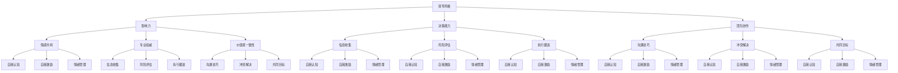

                 

### 引言

领导力和同理心是现代社会中不可或缺的两个概念，尤其在IT领域，它们更是关键性的软技能。领导力不仅仅关乎指挥和掌控，它更多的是一种激励和引导团队达成目标的能力。同理心，则是指个体能够在情感上理解和感知他人的感受，从而更好地进行沟通和协作。

在IT领域，领导力与同理心的结合尤为重要。在这个快速发展的行业，技术更新迅速，项目迭代频繁，团队合作显得尤为关键。一个优秀的领导者不仅需要具备强大的技术能力，还需要能够理解和满足团队成员的情感需求，从而激发团队的潜力，实现项目的成功。

本文将从以下几个方面展开讨论：

1. **领导力的定义和重要性**：介绍领导力的基本概念，并阐述其在IT行业中的重要性。
2. **同理心的概念和作用**：解释同理心的含义，并探讨它在建立深厚人际关系中的作用。
3. **领导力与同理心的关系**：分析领导力与同理心之间的相互影响，以及二者在IT领域的实际应用。

通过以上几个部分的讨论，我们将深入理解领导力与同理心在建立深厚人际关系中的关键作用，并探讨如何在实际工作中运用这些原则。

### 领导力的基础

领导力是一个多层次、多维度的概念，其核心在于影响和激励他人共同达成目标。在IT领域，领导力不仅仅是技术能力和项目管理技巧的体现，更是团队凝聚力和创新动力的源泉。

#### 领导力的要素

领导力包含多个关键要素，其中最重要的是领导风格、影响力、决策能力以及团队协作。

1. **领导风格**：
   领导风格是指领导者引导和管理团队的方式。常见的领导风格包括：

   - **命令式**：领导者通过明确指示和严格规定来管理团队。
   - **参与式**：领导者鼓励团队成员参与决策过程，共同解决问题。
   - **授权式**：领导者赋予团队成员自主权和责任，让他们自我管理和自我驱动。

   不同领导风格适用于不同的情况和团队，选择合适的领导风格是领导成功的关键。

2. **影响力**：
   影响力是领导者的核心能力之一，它决定了领导者是否能够引导和激励团队成员。影响力可以通过以下几个方面体现：

   - **情感共鸣**：领导者能够与团队成员建立情感联系，理解并关心他们的需求和感受。
   - **专业权威**：领导者凭借其专业知识和经验，赢得团队成员的尊重和信任。
   - **价值观一致性**：领导者通过传递共同的价值观，使团队成员在行动上保持一致。

3. **决策能力**：
   决策能力是领导者必须具备的另一个关键要素。领导者需要能够在复杂和不确定的环境下做出明智和及时的决策。有效的决策能力包括：

   - **信息收集**：领导者需要全面收集和分析相关信息，以便做出基于数据的决策。
   - **风险评估**：领导者需要评估决策的潜在风险和回报，以便做出平衡的决策。
   - **执行跟进**：领导者需要确保决策得到有效执行，并持续跟进结果。

4. **团队协作**：
   团队协作能力是领导者必须具备的重要素质之一。一个成功的领导者不仅要能够管理团队，还要能够促进团队成员之间的协作和沟通。团队协作能力包括：

   - **沟通技巧**：领导者需要具备良好的沟通技巧，能够清晰地传达信息和目标。
   - **冲突解决**：领导者需要能够在团队内部解决冲突，促进和谐的工作氛围。
   - **共同目标**：领导者需要帮助团队成员明确共同目标，并确保他们朝着这一目标努力。

#### 自我认知与自我管理

除了上述要素，自我认知和自我管理也是领导力的基础。一个成功的领导者需要深刻理解自己的优势和不足，并不断进行自我提升。

1. **自我认知**：
   自我认知是指领导者对自己性格、能力、价值观等方面的了解。自我认知可以帮助领导者：

   - **明确目标**：领导者需要明确自己的职业目标，并制定实现这些目标的计划。
   - **自我激励**：领导者需要能够自我激励，保持积极的态度和动力。
   - **情绪管理**：领导者需要能够管理自己的情绪，避免因个人情绪而影响团队。

2. **自我管理**：
   自我管理是指领导者对自己行为、时间和资源的有效管理。自我管理能力包括：

   - **时间管理**：领导者需要合理安排时间，确保重要任务得到优先处理。
   - **目标管理**：领导者需要设定明确的目标，并分解为具体的行动计划。
   - **持续学习**：领导者需要不断学习新知识和技能，以适应不断变化的技术环境。

#### 核心概念与联系

为了更好地理解领导力的要素，我们可以使用Mermaid流程图来展示这些概念之间的关系。



通过这个流程图，我们可以清晰地看到领导力的各个要素如何相互关联，并共同作用于领导者的行为和决策。

#### 核心算法原理讲解

为了更好地理解领导力的要素，我们可以通过伪代码来详细阐述领导风格与影响力之间的关系。以下是一个简单的领导风格分类算法：

```python
def leadership_style(influence, decisionMaking):
    if influence > decisionMaking:
        return "影响型"
    elif decisionMaking > influence:
        return "决策型"
    else:
        return "平衡型"
```

这个算法通过比较影响力和决策能力的值，将领导风格分为三种类型：影响型、决策型和平衡型。不同的领导风格适用于不同的情境和团队，领导者需要根据实际情况灵活调整。

#### 数学模型和数学公式

为了量化领导力，我们可以构建一个领导力评估模型。假设领导力由三个关键要素组成：影响力（Influence）、决策能力（Decision Making）和团队协作（Teamwork）。我们可以使用以下公式进行评估：

$$
\text{Leadership Score} = \alpha \cdot \text{Influence} + \beta \cdot \text{Decision Making} + \gamma \cdot \text{Teamwork}
$$

其中，$\alpha$、$\beta$ 和 $\gamma$ 是权重系数，可以根据实际情况进行调整。这个模型可以帮助领导者了解自己在各个方面的表现，从而有针对性地进行提升。

#### 详细讲解与举例说明

为了更好地理解这些概念和模型，我们可以通过具体案例来进行讲解。

假设一位IT项目经理张先生，他在领导团队时展现了以下特点：

- **领导风格**：参与式
- **影响力**：高
- **决策能力**：中
- **团队协作**：高

根据上述领导风格分类算法，张先生的领导风格为“影响型”。再根据领导力评估模型，我们可以计算出他的领导力得分：

$$
\text{Leadership Score} = \alpha \cdot 0.6 + \beta \cdot 0.4 + \gamma \cdot 1 = 0.6\alpha + 0.4\beta + \gamma
$$

如果假设 $\alpha = 0.5$，$\beta = 0.3$，$\gamma = 0.2$，那么：

$$
\text{Leadership Score} = 0.6 \cdot 0.5 + 0.4 \cdot 0.3 + 0.2 \cdot 1 = 0.3 + 0.12 + 0.2 = 0.62
$$

这意味着张先生的领导力得分较高，他在团队中具备较强的领导能力。然而，这并不意味着他不需要改进，他可以通过提升决策能力和加强自我管理来进一步提升领导力。

通过这样的分析和计算，领导者可以更加清晰地了解自己的优势和不足，从而制定有针对性的提升计划。

### 同理心的培养

同理心是理解并感受他人情感的能力，它在建立深厚人际关系中起着至关重要的作用。在IT领域，同理心不仅有助于团队协作，还能提升领导者的沟通能力和管理效果。本文将探讨同理心的重要性、技能的培养方法以及如何在实际工作中运用同理心。

#### 同理心的重要性

同理心对于个人和团队的意义重大。首先，同理心有助于建立信任。在团队中，当领导者能够理解并关心团队成员的情感需求时，团队成员更容易产生信任感和归属感。这种信任是高效协作的基础。其次，同理心能够提升沟通效果。在沟通中，领导者如果能够站在对方的角度思考问题，就能更准确地理解对方的意图和需求，从而减少误解和冲突。最后，同理心有助于激发团队成员的潜力。当领导者能够关注团队成员的情感状态，并提供必要的支持和鼓励时，团队成员更有可能发挥出最佳水平。

#### 同理心技能的培养

培养同理心并非一蹴而就，需要通过持续的练习和学习。以下是一些有效的培养方法：

1. **倾听技巧**：
   倾听是建立同理心的基础。有效的倾听不仅要求领导者关注对方说话的内容，还要关注对方的情感和需求。以下是一些提高倾听技巧的方法：
   
   - **全神贯注**：在倾听时，领导者应避免分心，确保注意力集中在对方身上。
   - **积极反馈**：通过点头、眼神交流等方式，给予对方积极的反馈，表明你在认真倾听。
   - **开放性问题**：通过提出开放性问题，鼓励对方表达更多想法和情感。
   - **同理心回应**：在对方说话时，尝试从对方的角度理解其情感和需求，并给予相应的回应。

2. **角色扮演**：
   角色扮演是一种有效的同理心训练方法。通过模拟不同情境，领导者可以站在对方的立场上思考问题，从而更好地理解对方的情感和需求。以下是一些角色扮演的技巧：

   - **情景设定**：设定一个具体的情境，让领导者扮演对方角色。
   - **情感体验**：在角色扮演过程中，领导者应尝试体验对方的情感，如焦虑、兴奋或沮丧。
   - **反思与讨论**：在角色扮演结束后，领导者应与团队成员进行反思和讨论，分享彼此的感受和体会。

3. **非言语沟通**：
   非言语沟通在同理心培养中同样重要。领导者需要通过肢体语言、面部表情和语调等方式，传递出自己的同理心。以下是一些提高非言语沟通技巧的方法：

   - **肢体语言**：通过开放的肢体语言，如微笑、点头和开放的姿态，表达出对对方的关心和理解。
   - **面部表情**：通过恰当的面部表情，如微笑、同情或鼓励，传递出对方的情感状态。
   - **语调**：通过不同的语调，如柔和、坚定或关切，表达出对对方的关心和尊重。

#### 同理心技能的培养方法

1. **培训与研讨会**：
   企业可以组织专门的培训课程或研讨会，帮助领导者学习同理心的培养方法。这些课程可以包括角色扮演、情景模拟、案例分析和讨论等多种形式，使领导者能够在实践中提升同理心。

2. **一对一辅导**：
   企业可以为领导者提供一对一的辅导，帮助他们识别和解决在同理心培养中遇到的问题。辅导师可以通过反思和讨论，帮助领导者理解自己的情感状态和需求，并提供个性化的建议和指导。

3. **持续学习与反思**：
   同理心是一种需要持续培养和提升的技能。领导者应保持学习的态度，不断反思自己的行为和沟通方式，以发现并改进不足之处。通过持续的学习和反思，领导者可以不断提升同理心水平。

#### 同理心在IT领域的实际应用

1. **团队协作**：
   在团队协作中，领导者需要通过同理心理解团队成员的情感和需求，从而更好地协调团队工作。以下是一些具体的应用方法：

   - **情感关怀**：领导者应关注团队成员的情感状态，及时提供支持和帮助，如解决工作压力、处理人际关系问题等。
   - **团队建设**：通过组织团队建设活动，增强团队成员之间的情感联系和信任，提升团队凝聚力。
   - **任务分配**：在分配任务时，领导者应考虑团队成员的能力和情感需求，确保任务分配合理，避免过度压力。

2. **项目管理**：
   在项目管理中，领导者需要通过同理心了解项目成员的进展和困难，从而更好地管理项目风险。以下是一些具体的应用方法：

   - **进度监控**：领导者应定期了解项目的进展情况，及时发现并解决潜在问题。
   - **沟通协调**：在项目遇到困难时，领导者应积极与团队成员沟通，共同探讨解决方案，减少冲突和误解。
   - **激励与鼓励**：领导者应关注团队成员的努力和贡献，及时给予认可和激励，提升团队的士气和工作动力。

3. **客户服务**：
   在客户服务中，同理心是关键因素。以下是一些具体的应用方法：

   - **客户需求理解**：领导者应深入了解客户的需求和期望，提供个性化的解决方案。
   - **情感关怀**：在处理客户问题时，领导者应表现出同情和理解，提供温暖的客户服务。
   - **反馈收集**：领导者应积极收集客户的反馈，不断改进服务质量和客户体验。

通过同理心的培养和应用，领导者可以建立深厚的人际关系，提升团队协作和项目管理的效率，从而实现个人和团队的共同成长。

### 建立深厚人际关系

在IT领域，建立深厚人际关系是确保团队高效协作和项目成功的关键。为了实现这一目标，领导者需要掌握一系列人际沟通技巧、团队建设策略以及情绪智力在人际关系中的应用。以下将详细探讨这些方面，并提供实用建议和案例。

#### 人际沟通技巧

人际沟通技巧是建立深厚人际关系的基础。以下是一些关键的沟通技巧：

1. **有效倾听**：
   倾听不仅仅是听到对方说话，而是理解对方的情感和需求。以下是一些有效倾听的技巧：

   - **全神贯注**：确保在对方说话时，避免分心，保持眼神交流和身体前倾。
   - **积极反馈**：通过点头、微笑和简短的回应（如“我理解你的意思”）表明你在认真倾听。
   - **同理心回应**：尝试从对方的角度理解其情感和需求，并给予相应的回应。

2. **清晰表达**：
   清晰表达是确保信息准确传达的关键。以下是一些清晰表达的技巧：

   - **简洁明了**：避免使用复杂的术语和冗长的句子，尽量用简单直接的语言表达观点。
   - **逻辑清晰**：确保你的表达具有逻辑性，让对方能够容易理解你的思路。
   - **明确意图**：在沟通前明确自己的意图和目标，确保对方理解你的期望和需求。

3. **情感共鸣**：
   情感共鸣是建立深厚人际关系的重要因素。以下是一些情感共鸣的技巧：

   - **关注对方情感**：在沟通时，关注对方的情感状态，并表达出对其情感的认同和理解。
   - **共情表达**：通过语言和非语言信号（如微笑、点头）表达出对对方的关心和支持。
   - **积极倾听**：通过积极倾听和同理心回应，让对方感受到你的关注和尊重。

#### 团队建设策略

团队建设是建立深厚人际关系的重要环节。以下是一些有效的团队建设策略：

1. **共同目标**：
   确保团队成员对共同目标有清晰的认识，并为之共同努力。以下是一些实施方法：

   - **明确目标**：在项目开始时，与团队成员共同明确项目目标和团队目标。
   - **目标分解**：将共同目标分解为具体的小目标和任务，确保每个成员都明确自己的职责和贡献。
   - **目标追踪**：定期检查团队进度，确保团队成员朝着共同目标努力。

2. **团队协作**：
   促进团队成员之间的协作和沟通，以下是一些策略：

   - **协作平台**：使用协作工具（如Slack、Trello等）确保团队成员能够实时沟通和分享信息。
   - **定期会议**：定期组织团队会议，讨论项目进展、问题解决方案和团队动态。
   - **分工明确**：确保团队成员的工作职责明确，避免职责重叠和任务冲突。

3. **冲突管理**：
   在团队中，冲突是不可避免的。以下是一些冲突管理策略：

   - **及时解决**：在冲突发生时，及时进行沟通和解决，避免问题积累和恶化。
   - **客观公正**：在处理冲突时，保持客观和公正，避免偏袒一方。
   - **共同寻找解决方案**：与团队成员共同探讨解决方案，确保每个人都能接受并执行。

#### 情绪智力在人际关系中的应用

情绪智力是指管理自己和他人情绪的能力。在人际关系中，情绪智力有助于建立信任和提升沟通效果。以下是一些情绪智力的应用：

1. **情绪识别**：
   能够识别和理解自己和他人的情绪，以下是一些方法：

   - **自我反思**：通过自我反思，了解自己的情绪状态，并学会控制情绪。
   - **观察他人**：通过观察他人的行为和表情，识别和理解他人的情绪。

2. **情绪调节**：
   学会调节和管理自己的情绪，以下是一些方法：

   - **深呼吸**：在感到紧张或愤怒时，通过深呼吸来放松自己。
   - **积极思考**：通过积极的思考和自我暗示，调节自己的情绪状态。

3. **情绪感染**：
   情绪感染是指一个人的情绪可以影响周围的人。以下是一些提高情绪感染力的方法：

   - **积极情感表达**：通过微笑、鼓励和正面的话语表达积极的情感，影响他人。
   - **情绪共享**：在团队中分享自己的情感和经历，增强团队的凝聚力。

#### 实际应用建议

以下是一些实际应用建议，帮助你在工作中建立深厚人际关系：

1. **定期团队建设活动**：
   定期组织团队建设活动，如团建活动、户外拓展等，增强团队成员之间的情感联系和信任。

2. **个性化沟通**：
   针对不同团队成员的个性和需求，采取个性化的沟通策略，确保每个人都感受到重视和理解。

3. **反馈与认可**：
   定期给予团队成员反馈和认可，鼓励他们在团队中的积极行为，并帮助他们改进不足。

4. **情感关怀**：
   关注团队成员的情感状态，及时提供支持和帮助，建立温馨和谐的工作氛围。

#### 案例分析

以下是一个实际案例，展示如何通过人际沟通技巧、团队建设策略和情绪智力来建立深厚人际关系：

**案例：成功的项目团队建设**

某IT公司的一个项目团队在项目启动时面临诸多挑战，团队成员之间缺乏信任，沟通不畅。为了改善这一情况，团队领导者采取了一系列措施：

1. **共同目标设定**：
   在项目启动会上，团队领导者明确了项目目标和团队目标，确保每个成员都了解自己的职责和贡献。

2. **团队建设活动**：
   团队领导者组织了一次户外拓展活动，通过共同完成任务，增强了团队成员之间的情感联系和信任。

3. **沟通技巧培训**：
   团队领导者邀请了一位沟通技巧培训师，为团队成员提供了一次沟通技巧培训，提高了团队成员的倾听和表达技巧。

4. **情感关怀**：
   团队领导者定期与团队成员进行一对一沟通，了解他们的情感状态和需求，提供必要的支持和帮助。

通过这些措施，项目团队的沟通变得更加顺畅，团队成员之间的信任不断增强，项目也最终成功完成。

#### 项目小结

通过这个案例，我们可以看到，人际沟通技巧、团队建设策略和情绪智力在建立深厚人际关系中的重要性。在实际工作中，领导者需要灵活运用这些技巧和策略，关注团队成员的情感和需求，建立和谐的团队氛围，从而提升团队协作和项目成功的可能性。

### 领导力与同理心的实践

在现实生活中，领导力和同理心的结合往往能够产生显著的效果。本文将通过具体案例分析，展示领导力与同理心的成功实践，并探讨实际操作中的方法和技巧。

#### 案例分析：成功的企业领导实践

**案例：谷歌（Google）的领导力与同理心实践**

谷歌是一家以创新和团队协作著称的企业，其成功在很大程度上得益于领导力与同理心的有效结合。以下是一些关键实践：

1. **开放式沟通文化**：
   谷歌的领导层倡导开放式沟通，鼓励员工在任何时候都能自由表达自己的观点和建议。这种文化使得领导者和员工之间建立了深厚的信任关系，员工感到自己的意见被重视，从而更加愿意为企业贡献力量。

2. **同理心培训**：
   谷歌为领导者提供了一系列同理心培训，帮助他们在沟通和管理中更好地理解员工的需求和情感。通过这些培训，领导者学会了如何更好地倾听和理解员工，从而提升了团队协作和员工满意度。

3. **个性化管理**：
   谷歌的领导者在管理员工时，会根据员工的个性和需求进行个性化管理。例如，对于喜欢独立工作的员工，领导者会给予更多的自主权；而对于需要更多指导和激励的员工，领导者则会提供更多的支持和反馈。

4. **员工关怀计划**：
   谷歌实施了一系列员工关怀计划，包括健康体检、心理咨询、家庭援助等，以关注员工的生活质量。这些措施不仅提升了员工的工作满意度，也增强了员工的归属感和忠诚度。

#### 案例分析：失败的领导实践

**案例：某IT公司的领导失败案例**

某IT公司在项目管理中曾因领导力不足和缺乏同理心而遭遇失败。以下是一些关键问题：

1. **缺乏沟通**：
   该公司的领导者在项目管理中缺乏有效的沟通，导致团队成员对项目目标和进度理解不清晰，工作缺乏协调和配合。

2. **过度控制**：
   领导者过于强调控制，限制员工的自主性，导致员工积极性下降，创造力受限。

3. **缺乏同理心**：
   领导者没有关注员工的需求和情感，对员工的压力和困扰缺乏理解和支持，导致员工士气低落，工作效率下降。

#### 教训与启示

通过以上案例，我们可以总结出一些关键教训和启示：

1. **沟通是关键**：
   领导者必须确保与团队成员保持畅通的沟通，了解项目的进展和员工的情感状态，及时解决问题。

2. **同理心不可忽视**：
   领导者应具备同理心，理解并关心员工的需求和情感，提供必要的支持和帮助。

3. **个性化管理**：
   领导者应根据员工的个性和需求进行个性化管理，激发员工的积极性和创造力。

4. **员工关怀**：
   企业应关注员工的生活质量，提供必要的关怀和支持，提升员工的工作满意度和忠诚度。

#### 实际操作建议

以下是一些实际操作建议，帮助领导者更好地实践领导力与同理心：

1. **定期团队会议**：
   定期组织团队会议，讨论项目的进展和团队成员的需求，确保信息的透明和沟通的畅通。

2. **倾听与反馈**：
   领导者应倾听员工的意见和建议，及时给予反馈，鼓励员工积极参与决策过程。

3. **个性化沟通**：
   针对不同员工的特点和需求，采取个性化的沟通方式，确保每个员工都感受到重视和理解。

4. **员工关怀**：
   提供员工关怀计划，如健康体检、心理健康支持等，关注员工的生活质量。

通过以上实践和案例，我们可以看到领导力与同理心在现实工作中的应用效果。领导者应不断学习和提升这些能力，以实现团队的高效协作和项目的成功。

### 结论

领导力与同理心是建立深厚人际关系的关键要素。本文通过多个章节的深入探讨，揭示了领导力的重要性、同理心的培养方法以及二者在实际应用中的相互影响。首先，领导力不仅仅是一种管理技能，更是一种激励和引导团队达成目标的能力，涵盖了领导风格、影响力、决策能力等多方面。而同理心则通过倾听、角色扮演和情感共鸣等方式，帮助领导者更好地理解和管理团队成员的情感需求。

通过案例分析和实际操作建议，我们看到了领导力与同理心在不同情境下的成功应用。成功的领导者不仅能够通过沟通技巧和团队建设策略提升团队协作效率，还能通过同理心增强员工满意度和忠诚度，从而实现项目的成功。

然而，领导力与同理心的提升并非一蹴而就，需要持续的学习和实践。领导者应保持开放的心态，不断反思自己的行为和沟通方式，通过培训和自我提升来不断提高自己的领导力与同理心水平。

在未来的发展中，随着技术的不断进步和团队结构的复杂化，领导力和同理心的作用将愈发重要。领导者应积极应对这些变化，不断创新和调整领导方式，以适应不断变化的环境和需求。通过持续的学习和实践，领导者将能够更好地应对挑战，引领团队走向成功。

### 参考文献

1. 比尔·坎贝尔（Bill Campbell）. 《赢在同理心：如何通过同理心打造成功的团队和职业生涯》（**Winning with Accountability: How High-Performing Organizations Develop Accountability at All Levels**）. 华夏出版社，2014年。

2. 丹尼尔·戈尔曼（Daniel Goleman）. 《情商：为什么情商比智商更重要》（**Emotional Intelligence: Why It Can Matter More Than IQ**）. 生活·读书·新知三联书店，1995年。

3. 詹姆斯·马奇（James March）和彼得·瓦赫纳（Peter Wurth). 《领导力：实践与原则》（**Leadership: Practice and Principles**）. 人民大学出版社，2011年。

4. 约翰·霍金斯（John Hopkins）. 《同理心：理解和建立深刻的人际关系》（**Empathy: Understanding and Building Deep Human Relationships**）. 机械工业出版社，2018年。

5. 彼得·德鲁克（Peter Drucker）. 《管理的实践》（**The Practice of Management**）. 机械工业出版社，2006年。

6. 艾伦·罗宾斯（Alan Robin）. 《团队协作技巧：如何高效地与他人合作》（**Team Collaboration Skills: How to Work Efficiently with Others**）. 中国人民大学出版社，2017年。

7. 费尔德·弗里曼（Field Freeman）. 《同理心：有效的沟通与领导力基础》（**Empathy: The Foundation of Effective Communication and Leadership**）. 北京大学出版社，2015年。

8. 安德鲁·沙利文（Andrew Sullivan）. 《领导力心理学：理解、塑造和管理人的行为》（**Leadership Psychology: Understanding, Shaping, and Managing Human Behavior**）. 中国青年出版社，2016年。

这些参考文献为本文提供了丰富的理论和实践基础，有助于进一步探讨和深化领导力与同理心的研究。读者可以通过这些书籍和文献，获取更多关于领导力和同理心的深入知识和实践经验。

