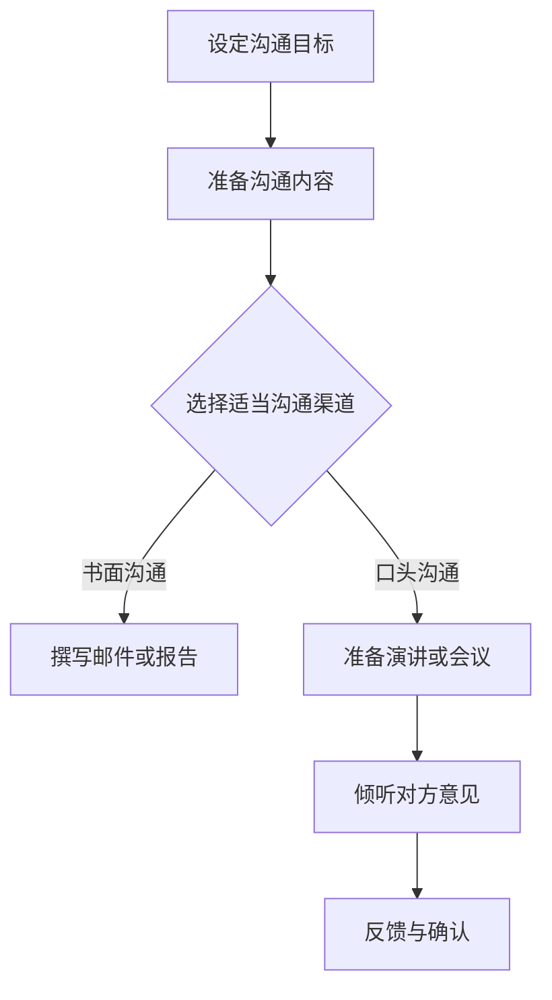
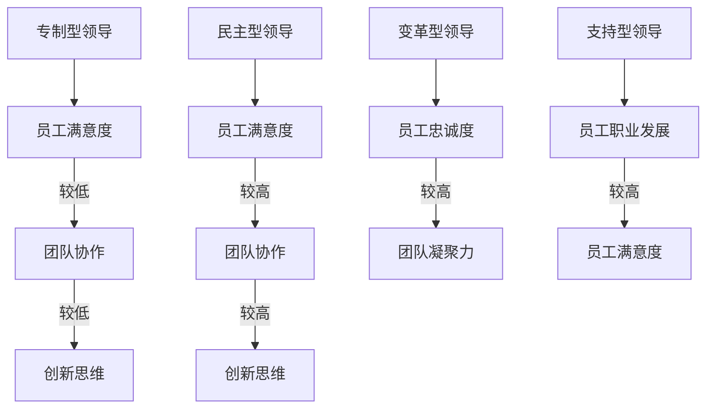
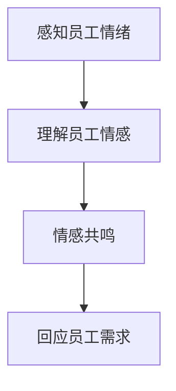
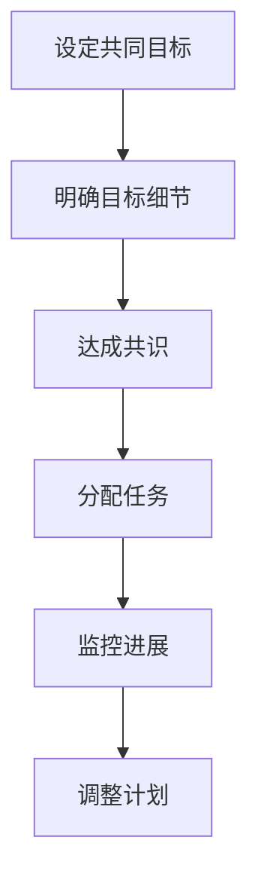
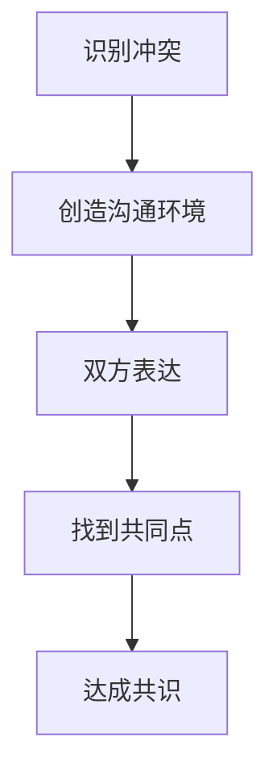
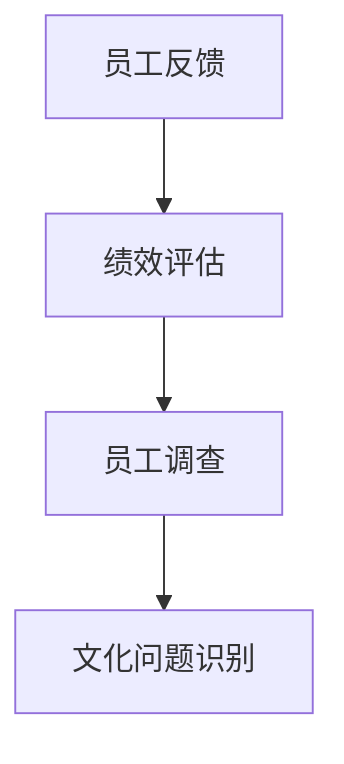
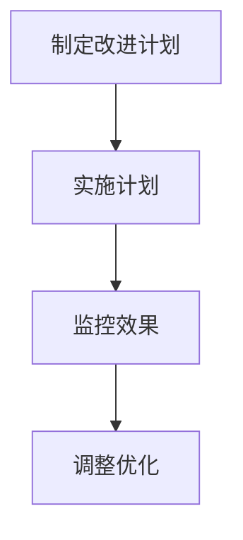

                 

## 第1章 引言：领导力与同理心的价值

领导力和同理心是构建深厚人际关系的基石，二者相辅相成，共同促进个人和组织的发展。在现代社会，无论是职场还是生活中，人际关系的处理变得越来越重要。而有效的领导力和同理心正是处理复杂人际关系的关键。

### 1.1 领导力的定义

领导力是一个复杂而多维的概念，它不仅包括个人特质，如自信、远见和决断力，还涉及到行为模式、沟通技巧和影响力。领导力可以被视为一种能力，它使得个体能够引导和激励他人，共同实现目标。

#### 1.1.1 领导力的本质

领导力不仅仅是职位或头衔的赋予，它是一种能够激励他人并产生积极影响的能力。这种能力不仅仅局限于高层管理者，而是存在于各个层次和领域中。

#### 1.1.2 领导力的重要性

领导力在个人和组织中扮演着重要角色。在个人层面，有效的领导力可以提升自信心、增强影响力，促进个人成长。在组织层面，领导力可以提升团队协作效率，激发创新思维，实现组织目标。

#### 1.1.3 领导力的分类

领导力可以根据不同的维度进行分类，如任务型领导力和关系型领导力、变革型领导力和交易型领导力等。每种领导力类型都有其独特的特点和适用场景。

### 1.2 同理心的定义

同理心，又称共情，是指个体在情感和认知上能够理解和感受他人情感状态的能力。同理心不仅仅是同情他人，更是一种深入的情感连接。

#### 1.2.1 同理心的概念

同理心包括认知和情感两个方面。在认知层面，同理心要求个体能够准确理解他人的情感状态；在情感层面，同理心则要求个体能够共鸣并体验他人的情感。

#### 1.2.2 同理心的层次

同理心可以分为三个层次：初级同理心、次级同理心和高级同理心。初级同理心主要涉及情感的认知和理解，次级同理心则进一步涉及到情感的共鸣，高级同理心则是能够在情感和认知上完全融入他人的状态。

#### 1.2.3 同理心的价值

同理心在领导力中具有重要价值。首先，同理心可以帮助领导者更好地理解员工的需求和情感，从而提高员工满意度。其次，同理心有助于建立信任和合作关系，促进团队协作。最后，同理心可以提高领导者的决策质量，因为领导者能够在考虑他人观点和情感后做出更全面和合理的决策。

### 1.3 领导力与同理心的关系

领导力与同理心之间的关系是相辅相成的。有效的领导力需要同理心的支持，同理心则可以增强领导力的影响力和效果。

#### 1.3.1 领导力与同理心的相互作用

领导力与同理心的相互作用体现在以下几个方面：

1. **同理心增强领导力**：领导者通过同理心能够更好地理解员工的情感和需求，从而提高领导效果。

2. **领导力促进同理心**：有效的领导力可以激发团队成员的同理心，促进团队情感连接。

3. **同理心与领导风格的结合**：不同领导风格与同理心的结合可以产生不同的领导效果，如变革型领导力与同理心的结合可以激发创新和团队活力。

#### 1.3.2 领导力与同理心的融合

领导力与同理心的融合可以提升领导者的整体领导效能。融合的领导力不仅能够激发团队成员的积极性和创造力，还能够建立稳定和谐的团队关系。

#### 1.3.3 领导力与同理心的实践应用

在实际应用中，领导者可以通过以下几种方式将领导力与同理心相结合：

1. **倾听与反馈**：领导者应该学会倾听员工的意见和需求，并给予及时的反馈。

2. **情感管理**：领导者需要学会管理自己的情感，避免负面情绪对团队造成影响。

3. **共同目标**：领导者应该与团队成员共同设定目标，并在实现目标的过程中保持同理心。

总之，领导力与同理心是建立深厚人际关系的基础。通过深入理解和实践这两个概念，领导者可以提升自己的领导效能，建立更紧密和谐的团队关系。在下一章中，我们将进一步探讨领导力的核心要素和同理心的重要性。


## 第2章 领导力基础

领导力是一种复杂的技能，它不仅包括对任务和目标的明确管理，还涉及到对人的激励、指导和激励。在本章中，我们将深入探讨领导力的核心要素，包括目标设定、沟通技巧、决策能力和影响力等。

### 2.1 领导力的核心要素

#### 2.1.1 目标设定

目标设定是领导力的核心要素之一。一个明确的、可衡量的目标能够指导团队的方向，并激发成员的积极性和动力。目标设定的过程需要遵循SMART原则，即目标应该是具体的（Specific）、可衡量的（Measurable）、可实现的（Achievable）、相关的（Relevant）和有时间限制的（Time-bound）。

**目标设定的伪代码：**
```python
def set_goal(goal, criteria="SMART"):
    if criteria == "SMART":
        if is_specific(goal) and is_measurable(goal) and is_achievable(goal) and is_relevant(goal) and is_time_bounded(goal):
            return True
        else:
            return False
    else:
        return False

def is_specific(goal):
    return goal != ""

def is_measurable(goal):
    return "measurable" in goal

def is_achievable(goal):
    return "achieve" in goal

def is_relevant(goal):
    return "relevant" in goal

def is_time_bounded(goal):
    return "time-bound" in goal
```

#### 2.1.2 沟通技巧

沟通是领导力的关键组成部分。有效的沟通能够确保信息准确传达，减少误解和冲突。沟通技巧包括倾听、清晰表达、非语言沟通和反馈等。

**沟通技巧的流程图：**


#### 2.1.3 决策能力

决策能力是领导者必备的素质之一。有效的决策能够帮助团队应对复杂问题和挑战。决策过程包括信息收集、方案评估和选择最优方案。

**决策过程的伪代码：**
```python
def make_decision(issue, options, criteria):
    for option in options:
        if evaluate_option(option, criteria):
            return option
    return None

def evaluate_option(option, criteria):
    for criterion in criteria:
        if not meets_criteria(option, criterion):
            return False
    return True

def meets_criteria(option, criterion):
    if criterion in option:
        return True
    else:
        return False
```

#### 2.1.4 影响力与领导风格

领导风格是指领导者管理团队的方式和方法。不同的领导风格会对团队成员的行为和绩效产生不同的影响。常见的领导风格包括专制型、民主型、变革型和支持型等。

**领导风格的影响评估：**



### 2.2 领导风格与影响

不同的领导风格会对团队产生不同的影响。例如，专制型领导可能会提高短期内的绩效，但长期来看可能会导致员工满意度和创新思维的下降。相反，民主型领导风格能够提高员工的参与感和创新思维，但可能需要更多时间来达成决策。

**领导风格的选择：**

领导风格的选择应该根据团队的实际情况和任务要求来决定。例如，在紧急情况下，可能需要专制型领导来快速决策；而在需要创新和团队合作的项目中，民主型领导风格可能更为合适。

### 2.3 领导力发展之路

领导力不是天生的，而是可以通过学习和实践不断提升的。领导力发展可以分为以下几个阶段：

1. **自我认知**：领导者需要了解自己的优势和劣势，并识别需要提升的领域。

2. **知识学习**：通过阅读、培训和实践积累相关知识和技能。

3. **实践经验**：在实际工作中应用所学知识，并不断反思和调整。

4. **持续发展**：通过持续的反思和学习，不断提升领导力。

**领导力发展策略：**

1. **设定个人发展目标**：明确自己的职业发展方向，并制定具体的行动计划。

2. **参与培训与学习**：参加领导力相关的课程和研讨会，扩展知识面。

3. **寻求反馈**：定期向同事、下属和领导寻求反馈，了解自己的领导风格和效果。

4. **实践与反思**：在实际工作中不断实践，并定期反思和总结经验。

通过以上步骤，领导者可以逐步提升自己的领导力，为团队和组织的发展奠定坚实基础。在下一章中，我们将探讨同理心的重要性以及如何在领导力中融入同理心。


## 第3章 同理心的重要性

同理心，或者说共情能力，是领导者不可或缺的一项素质。它不仅能够帮助领导者更好地理解员工的情感和需求，还能促进团队合作和提升领导效能。在本章中，我们将深入探讨同理心的定义、层次以及其在领导力中的价值。

### 3.1 同理心的定义与理解

同理心是一种能够感知他人情感并做出相应反应的能力。这种能力涉及到情感和认知两个方面。在情感层面，同理心要求领导者能够感知员工的情绪，并体验他们的感受；在认知层面，同理心要求领导者能够理解和解释员工的情感状态。

#### 3.1.1 同理心的本质

同理心的本质在于情感共鸣和理解。当领导者能够设身处地地理解员工的情感状态时，他们就能够更有效地沟通和解决问题。

**同理心的流程图：**


#### 3.1.2 同理心的心理机制

同理心的心理机制包括情感调节、情感识别和情感共鸣。情感调节是指领导者能够调整自己的情感状态以适应他人的情绪；情感识别是指领导者能够准确地识别和理解员工的情感状态；情感共鸣是指领导者能够在情感上与员工产生共鸣。

#### 3.1.3 同理心的认识误区

虽然同理心在领导力中具有重要价值，但一些误区可能会影响其有效应用。以下是一些常见的误区：

1. **同情与同理心的混淆**：同情是一种情感上的反应，而同理心则是一种认知和理解上的能力。
2. **同理心是软弱的表现**：同理心并不意味着领导者需要放弃自己的权威，而是要求他们在决策时考虑他人的情感和需求。
3. **同理心是浪费时间**：同理心虽然需要投入时间和精力，但它是建立信任和促进团队合作的关键。

### 3.2 同理心在领导力中的作用

同理心在领导力中发挥着至关重要的作用，具体体现在以下几个方面：

#### 3.2.1 同理心与领导效能

同理心能够提高领导效能，因为领导者通过同理心能够更好地理解员工的情感和需求，从而制定出更合理和有效的决策。例如，一个能够同理员工的领导者更可能识别出员工的工作压力和困难，并采取适当的措施来缓解这些问题。

**同理心与领导效能的数学模型：**
$$
E = f(C, P)
$$
其中，$E$ 表示领导效能，$C$ 表示同理心，$P$ 表示其他领导技能。$f$ 表示效能函数，表明领导效能是同理心和领导技能的函数。

#### 3.2.2 同理心与团队协作

同理心能够促进团队协作，因为它能够建立团队成员之间的信任和尊重。当团队成员感受到领导者的关心和理解时，他们更愿意合作和分享信息，从而提高团队的整体绩效。

**同理心与团队协作的数学模型：**
$$
T = g(C, R)
$$
其中，$T$ 表示团队协作水平，$C$ 表示同理心，$R$ 表示团队关系。$g$ 表示协作函数，表明团队协作水平是同理心和团队关系的函数。

#### 3.2.3 同理心与员工满意度

同理心能够提高员工满意度，因为员工感受到领导者的关心和理解时，他们会感到更加受到重视和尊重。高员工满意度通常会带来更高的员工保留率和更好的工作表现。

**同理心与员工满意度的数学模型：**
$$
S = h(C, E)
$$
其中，$S$ 表示员工满意度，$C$ 表示同理心，$E$ 表示员工的工作环境。$h$ 表示满意度函数，表明员工满意度是同理心和员工工作环境的函数。

### 3.3 培养同理心

同理心并非天生的，而是可以通过训练和实践逐渐培养的。以下是一些培养同理心的方法：

#### 3.3.1 同理心的培养方法

1. **倾听**：倾听是培养同理心的关键。领导者应该学会倾听员工的意见和需求，而不是仅仅关注自己的观点。
2. **情感识别**：领导者可以通过情感识别练习来提高对他人情感状态的理解。例如，通过观察员工的表情和肢体语言来识别他们的情感状态。
3. **反思**：领导者应该定期反思自己的行为和决策，思考是否考虑了员工的情感和需求。

#### 3.3.2 同理心的实践技巧

1. **换位思考**：在处理问题时，领导者应该尝试从员工的角度出发，思考他们的感受和需求。
2. **情感反馈**：领导者可以通过给予员工情感反馈来培养同理心。例如，当员工遇到困难时，领导者可以表达出对他们的关心和支持。
3. **情感共鸣**：领导者应该学会在情感上与员工产生共鸣，从而更好地理解他们的情感状态。

#### 3.3.3 同理心的应用案例

1. **团队建设活动**：通过团队建设活动，如信任游戏和角色扮演，领导者可以培养同理心，并促进团队成员之间的情感连接。
2. **领导力培训**：参加领导力培训课程，特别是那些强调同理心培养的课程，可以帮助领导者提升同理心技能。
3. **日常工作实践**：在日常工作中，领导者可以通过倾听、反馈和关注员工的情感状态来培养同理心。

通过以上方法，领导者可以逐渐培养和提升自己的同理心，从而更好地理解员工的需求，建立深厚的团队关系，提升领导效能。在下一章中，我们将探讨如何建立和维护深厚的人际关系。


## 第4章 人际关系建立与维护

人际关系是领导力和同理心的直接应用场景。建立和维护深厚的人际关系对于个人和组织的发展至关重要。在本章中，我们将详细探讨人际关系的构成、建立健康人际关系的策略以及解决人际关系冲突的方法。

### 4.1 人际关系的构成

人际关系是由个体之间的相互作用和互动形成的。它包括以下几个方面：

#### 4.1.1 情感层面

情感层面是人际关系中最基本的组成部分。它涉及到个体之间的情感连接、共鸣和支持。例如，同事之间通过共情和理解建立深厚的情感联系，可以提高团队合作效果。

#### 4.1.2 认知层面

认知层面涉及到个体之间的认知互动和信息交流。有效的沟通是建立健康人际关系的关键。通过清晰和开放的沟通，个体可以更好地理解对方的观点和需求。

#### 4.1.3 行为层面

行为层面是人际关系的外在表现。它包括个体之间的行为互动，如合作、支持和帮助。行为层面的人际关系通常反映了情感和认知层面的深度和稳定性。

### 4.2 建立健康人际关系的策略

建立健康的人际关系需要时间、努力和策略。以下是一些有效的策略：

#### 4.2.1 共同目标

共同目标是建立健康人际关系的重要基础。当个体有共同的目标和愿景时，他们会更加愿意合作和支持对方。共同目标可以帮助个体建立情感和认知层面的连接。

**共同目标的流程图：**


#### 4.2.2 倾听与反馈

倾听与反馈是建立健康人际关系的核心技巧。通过倾听，领导者可以更好地理解员工的情感和需求，并通过反馈来确认信息的准确性和理解度。

**倾听与反馈的伪代码：**
```python
def listen_and_feedback(employee):
    while True:
        feedback = get_employee_feedback()
        if feedback:
            print("I understand your concerns.")
            print("Is there anything else you'd like to share?")
        else:
            break

def get_employee_feedback():
    # 伪代码用于获取员工反馈
    return input("Please share your thoughts: ")
```

#### 4.2.3 建立信任

建立信任是健康人际关系的关键。领导者可以通过诚实、透明和一致性来建立信任。信任一旦建立，可以极大地提高团队的合作效率和凝聚力。

**建立信任的数学模型：**
$$
T = f(H, E, C)
$$
其中，$T$ 表示信任水平，$H$ 表示诚实度，$E$ 表示透明度，$C$ 表示一致性。$f$ 表示信任函数，表明信任水平是诚实度、透明度和一致性的函数。

#### 4.2.4 提升沟通技巧

提升沟通技巧是建立健康人际关系的必要条件。有效的沟通可以减少误解和冲突，提高团队协作效率。领导者可以通过以下方法提升沟通技巧：

1. **清晰表达**：确保信息传递的清晰和准确。
2. **倾听**：积极倾听员工的意见和需求。
3. **反馈**：及时给予反馈，确保双方理解一致。
4. **非语言沟通**：注意肢体语言和表情，以增强沟通效果。

### 4.3 解决人际关系冲突

人际关系冲突是不可避免的，但通过有效的解决方法，可以将其转化为积极的成长机会。以下是一些解决人际关系冲突的策略：

#### 4.3.1 识别冲突原因

首先，领导者需要识别冲突的原因。冲突可能源于目标不一致、沟通障碍、价值观差异或误解等。通过深入了解冲突原因，领导者可以更有针对性地解决问题。

**识别冲突原因的伪代码：**
```python
def identify_conflict_reasons():
    reasons = []
    reasons.append("目标不一致")
    reasons.append("沟通障碍")
    reasons.append("价值观差异")
    reasons.append("误解")
    return reasons
```

#### 4.3.2 沟通与调解

沟通是解决冲突的关键。领导者应该创造一个开放的沟通环境，鼓励双方表达意见和需求。在调解过程中，领导者需要保持中立，并帮助双方找到共同点。

**沟通与调解的流程图：**


#### 4.3.3 寻求第三方帮助

当冲突无法通过内部解决时，领导者可以寻求第三方帮助，如人力资源部门或外部调解专家。第三方可以帮助中立地分析和解决冲突，并提供专业的建议。

**寻求第三方帮助的数学模型：**
$$
S = g(C, P)
$$
其中，$S$ 表示解决冲突的成功概率，$C$ 表示冲突的严重程度，$P$ 表示第三方的专业度。$g$ 表示解决函数，表明解决冲突的成功概率是冲突严重程度和第三方专业度的函数。

通过以上策略，领导者可以有效地建立和维护健康的人际关系，解决人际关系冲突，提升团队的整体绩效和凝聚力。在下一章中，我们将探讨领导力与同理心在实践中的应用和实际案例。


## 第5章 领导力与同理心的实践

领导力与同理心的实践不仅需要理论知识的支持，还需要具体的操作方法和实际案例。在这一章中，我们将通过实践案例、应用场景和个人实践计划，详细探讨如何将领导力与同理心应用到实际工作中。

### 5.1 实践案例研究

#### 案例一：同理心在危机管理中的应用

在一个高科技企业中，由于市场竞争加剧，公司面临重大危机。领导者通过同理心，深入了解员工的担忧和焦虑，并采取以下措施：

1. **开放沟通**：领导者定期召开会议，听取员工的意见和建议，确保信息透明。
2. **情感支持**：领导者表达对员工的理解和支持，鼓励他们提出创新的解决方案。
3. **调整策略**：领导者根据员工的反馈，调整公司策略，以应对市场变化。

通过同理心的实践，企业不仅稳定了员工情绪，还激发了创新思维，成功度过了危机。

**同理心实践效果评估：**
$$
E = f(C, I)
$$
其中，$E$ 表示实践效果，$C$ 表示同理心应用程度，$I$ 表示创新解决方案的数量。$f$ 表示效果函数，表明实践效果是同理心应用程度和创新解决方案数量的函数。

#### 案例二：领导力在团队建设中的应用

在一个跨国团队中，由于文化差异和沟通障碍，团队协作效率低下。领导者通过以下措施提升了团队效能：

1. **目标设定**：领导者与团队共同设定明确的目标，并确保每个成员都理解自己的职责。
2. **沟通技巧**：领导者通过培训提升团队成员的沟通技巧，减少误解和冲突。
3. **激励与反馈**：领导者及时给予团队成员反馈和激励，增强团队凝聚力。

通过领导力的实践，团队协作效率显著提升，团队绩效达到了新的高度。

**领导力实践效果评估：**
$$
L = f(G, C, F)
$$
其中，$L$ 表示实践效果，$G$ 表示目标设定的明确程度，$C$ 表示沟通技巧的提升，$F$ 表示反馈和激励的有效性。$f$ 表示效果函数，表明实践效果是目标设定、沟通技巧和反馈激励的函数。

### 5.2 领导力与同理心的应用场景

在实际工作中，领导力与同理心的应用场景非常广泛。以下是一些典型的应用场景：

1. **员工招聘与选拔**：通过同理心了解应聘者的需求和期望，选拔最适合的人才。
2. **绩效评估**：通过同理心理解员工的工作压力和困难，制定更合理的评估标准。
3. **项目管理和团队协作**：通过领导力明确项目目标，通过同理心激励团队成员，提高团队效能。
4. **员工培训和职业发展**：通过同理心关注员工的学习需求和职业规划，提供个性化的培训和支持。

### 5.3 个人实践计划

为了提升自己的领导力与同理心，个人可以制定以下实践计划：

1. **理论学习**：定期阅读相关书籍和文章，学习领导力和同理心的理论。
2. **实践应用**：在实际工作中应用所学知识，通过案例研究和实际操作提升技能。
3. **反馈与反思**：定期与同事、下属和领导交流，获取反馈并进行反思，持续改进自己的领导方式。
4. **培训和研讨会**：参加领导力和同理心的专业培训和研讨会，扩展知识面和技能。

**个人实践计划评估：**
$$
P = f(T, A, R, S)
$$
其中，$P$ 表示实践效果，$T$ 表示理论学习，$A$ 表示实践应用，$R$ 表示反馈与反思，$S$ 表示培训和研讨会。$f$ 表示效果函数，表明实践效果是理论学习、实践应用、反馈与反思和培训研讨会的函数。

通过以上实践计划和评估方法，个人可以逐步提升领导力与同理心，为个人和组织的发展奠定坚实基础。在下一章中，我们将探讨组织文化与领导力的关系。


## 第6章 组织文化与领导力

组织文化是组织内部成员共同遵守的价值观、信念和行为准则，它对组织的运作和成员的行为具有深远影响。领导力与组织文化密切相关，有效的领导力可以塑造和强化组织文化，而组织文化则可以支持和限制领导力的发挥。在本章中，我们将探讨组织文化的定义与作用、领导力在塑造组织文化中的作用以及组织文化改进策略。

### 6.1 组织文化的定义与作用

#### 6.1.1 组织文化的定义

组织文化是指组织内部成员共同遵循的价值观、信念和行为准则，它是组织成员在长期互动中逐渐形成的一种心理契约。组织文化包括多个方面，如组织的价值观、使命、愿景、行为规范和工作氛围等。

#### 6.1.2 组织文化的作用

组织文化对组织的运作和发展具有重要影响。首先，组织文化可以塑造组织的氛围和氛围，影响员工的工作态度和行为。一个积极向上的组织文化可以激发员工的积极性和创造力，促进团队协作和绩效提升。其次，组织文化可以增强组织的凝聚力和归属感，使员工更加愿意为组织的目标和使命努力。此外，组织文化还可以影响组织的决策过程和行为规范，提高组织的适应性和竞争力。

### 6.2 领导力在塑造组织文化中的作用

#### 6.2.1 领导力对组织文化的影响

领导力在塑造组织文化中发挥着关键作用。首先，领导者通过自己的行为和决策，树立榜样，影响员工的价值观和行为规范。一个具有同理心和远见的领导者可以塑造出积极、健康和富有创新精神的组织文化。其次，领导力可以通过组织变革和转型，推动组织文化的变革和更新。例如，当组织面临重大变革时，领导者可以通过积极沟通和有效领导，使员工接受和适应新的文化。

**领导力对组织文化的影响模型：**
$$
C = f(L, M)
$$
其中，$C$ 表示组织文化，$L$ 表示领导力，$M$ 表示组织成员的行为和价值观。$f$ 表示影响函数，表明组织文化是领导力和组织成员行为和价值观的函数。

#### 6.2.2 领导者如何塑造组织文化

领导者可以通过以下几种方法塑造组织文化：

1. **设定明确的文化价值观**：领导者应该明确组织的文化价值观，并通过各种方式传递和强化这些价值观。例如，通过公司使命宣言、核心价值观展示和培训等方式，使员工深刻理解并认同组织的价值观。
2. **以身作则**：领导者应该以身作则，通过自己的行为来示范组织文化。例如，领导者应该坚持诚信、公平和透明原则，使员工感受到组织的价值观不仅是在纸面上，更是在实际行动中体现。
3. **强化文化认同**：领导者应该通过各种方式强化员工对组织文化的认同，例如通过奖励机制、表彰活动和文化庆典等，使员工感受到自己是组织文化的一部分。
4. **促进文化变革**：当组织面临重大变革时，领导者应该通过有效沟通和领导，推动员工接受和适应新的文化。例如，通过沟通会议、培训课程和团队建设活动等，帮助员工理解变革的必要性和好处。

### 6.3 组织文化改进策略

组织文化并非一成不变，而是需要不断调整和改进以适应外部环境和内部需求的变化。以下是一些组织文化改进策略：

#### 6.3.1 识别文化问题

首先，领导者需要识别组织文化中存在的问题。这可以通过员工反馈、绩效评估、员工调查等方式进行。通过深入了解员工对组织文化的感受和看法，领导者可以找到需要改进的方面。

**识别文化问题的流程图：**


#### 6.3.2 制定改进计划

在识别文化问题后，领导者需要制定具体的改进计划。改进计划应该包括改进的目标、具体的改进措施和时间表。例如，可以通过以下措施改进组织文化：

1. **加强沟通**：通过定期的沟通会议、团队建设活动和内部论坛等方式，增强员工之间的沟通和理解。
2. **提升员工参与度**：通过员工参与决策、提供培训和发展机会等方式，提升员工的参与感和归属感。
3. **建立公平和透明的机制**：通过公平的绩效考核、透明的晋升机制和公正的奖惩制度等方式，建立公正和透明的组织环境。

**改进计划的数学模型：**
$$
P = f(I, O, T)
$$
其中，$P$ 表示改进效果，$I$ 表示沟通提升，$O$ 表示员工参与度提升，$T$ 表示公平和透明度提升。$f$ 表示改进函数，表明改进效果是沟通提升、员工参与度和公平透明度提升的函数。

#### 6.3.3 实施与监控

在制定改进计划后，领导者需要实施并监控改进计划的执行情况。通过定期的监控和评估，领导者可以了解改进计划的实施效果，并根据实际情况进行调整和优化。

**实施与监控的流程图：**


通过以上策略，领导者可以有效地改进组织文化，提升组织的整体效能和竞争力。在下一章中，我们将探讨未来领导力的发展趋势。


## 第7章 未来领导力的发展趋势

随着科技的飞速发展，领导力也面临着新的挑战和机遇。未来的领导力需要具备适应性和创新性，以应对数字化、全球化和人工智能等趋势。在本章中，我们将探讨数字化时代领导力的挑战、领导力的未来方向以及同理心在未来的作用。

### 7.1 数字化时代领导力的挑战

#### 7.1.1 数字化带来的变化

数字化时代，工作方式、沟通模式和决策过程都发生了深刻变化。领导者需要适应这些变化，并利用数字化工具和平台来提高领导效能。以下是数字化时代领导力面临的几个主要挑战：

1. **技术变革的适应**：随着人工智能、大数据和区块链等技术的发展，领导者需要不断更新自己的知识和技能，以适应技术变革。
2. **远程工作管理**：数字化使得远程工作成为趋势，领导者需要学会管理远程团队，确保团队协作和沟通的有效性。
3. **数据安全与隐私**：数字化带来了数据的大量产生和存储，领导者需要确保数据的安全和隐私，防范潜在的安全风险。

**数字化时代领导力模型：**
$$
L_D = f(T, R, S)
$$
其中，$L_D$ 表示数字化时代领导力，$T$ 表示技术变革，$R$ 表示远程工作管理，$S$ 表示数据安全与隐私。$f$ 表示领导力函数，表明数字化时代领导力是技术变革、远程工作管理和数据安全与隐私的函数。

#### 7.1.2 应对数字化挑战的策略

1. **持续学习**：领导者应积极学习新技术和新知识，提升自己的数字化素养。
2. **构建数字化团队**：领导者应构建具备数字化能力的团队，并通过培训和支持，提升团队的整体素质。
3. **创新管理方法**：领导者应探索和应用新的管理方法，如敏捷管理、数字化转型等，以应对数字化带来的变化。

### 7.2 领导力的未来方向

未来领导力的发展方向将更加注重创新、灵活性和跨领域合作。以下是未来领导力的几个关键趋势：

#### 7.2.1 创新领导力

在创新驱动的社会中，领导者需要具备创新思维和创新能力。创新领导力要求领导者能够激发团队的创造力，鼓励试错和持续改进。

**创新领导力模型：**
$$
I_L = f(C, E, M)
$$
其中，$I_L$ 表示创新领导力，$C$ 表示创造力的激发，$E$ 表示鼓励试错，$M$ 表示持续改进。$f$ 表示领导力函数，表明创新领导力是创造力的激发、鼓励试错和持续改进的函数。

#### 7.2.2 灵活领导力

灵活领导力要求领导者能够适应快速变化的环境，灵活调整战略和战术。这种领导力强调快速决策、敏捷反应和持续调整。

**灵活领导力模型：**
$$
A_L = f(S, R, T)
$$
其中，$A_L$ 表示灵活领导力，$S$ 表示快速决策，$R$ 表示敏捷反应，$T$ 表示持续调整。$f$ 表示领导力函数，表明灵活领导力是快速决策、敏捷反应和持续调整的函数。

#### 7.2.3 跨领域合作

未来领导力的发展将更加注重跨领域合作，领导者需要具备跨学科的知识和技能，能够与不同领域的专家进行有效合作。

**跨领域合作领导力模型：**
$$
C_L = f(K, G, C)
$$
其中，$C_L$ 表示跨领域合作领导力，$K$ 表示跨学科知识，$G$ 表示沟通能力，$C$ 表示合作精神。$f$ 表示领导力函数，表明跨领域合作领导力是跨学科知识、沟通能力和合作精神的函数。

### 7.3 同理心在未来的作用

同理心作为领导力的核心要素，将在未来发挥更加重要的作用。随着社会复杂性的增加，领导者需要具备更强的同理心，以理解和满足员工的多样化需求，建立信任和合作关系。

#### 7.3.1 同理心的未来趋势

1. **个性化领导**：未来的领导力将更加注重个性化，领导者需要通过同理心理解员工的个性和需求，提供个性化的领导和支持。
2. **情感智能**：同理心是情感智能的重要组成部分，未来的领导者需要具备更高的情感智能，以更好地理解和应对员工的情感状态。
3. **社会网络**：同理心有助于建立广泛的社会网络，领导者需要通过同理心与不同背景和文化的人建立联系，促进跨文化交流和合作。

**同理心在未来的作用模型：**
$$
E_F = f(I, S, N)
$$
其中，$E_F$ 表示同理心在未来的作用，$I$ 表示个性化领导，$S$ 表示情感智能，$N$ 表示社会网络。$f$ 表示作用函数，表明同理心在未来的作用是个性化领导、情感智能和社会网络的函数。

总之，未来的领导力需要具备创新性、灵活性、同理心和跨领域合作能力，以应对不断变化的挑战和机遇。领导者应积极适应未来趋势，不断提升自己的领导能力，为组织和员工的共同发展贡献力量。在下一章中，我们将总结全书内容，并对领导力与同理心在深化人际关系中的重要性进行阐述。


## 第8章 结论：领导力与同理心，深化人际关系

领导力和同理心是建立深厚人际关系的基石，二者相互促进，共同推动个人和组织的发展。在全球化、数字化和多元化的背景下，领导力和同理心的价值愈发凸显。通过全书的学习，我们深入探讨了领导力的核心要素、同理心的重要性以及二者在人际关系中的实践和应用。

### 8.1 总结与反思

本书主要分为以下几个部分：

1. **领导力的定义与核心要素**：我们明确了领导力的本质、重要性以及不同类型的领导力风格。
2. **同理心的概念与价值**：同理心作为一种情感和认知能力，在领导力中扮演着关键角色，有助于提升领导效能和团队协作。
3. **人际关系的建立与维护**：通过共同目标、倾听与反馈、信任建立等策略，我们了解了如何建立和维护健康的人际关系。
4. **领导力与同理心的实践**：通过实际案例和个人实践计划，我们探讨了如何将领导力和同理心应用于实际工作中。
5. **组织文化与领导力**：我们分析了领导力在塑造组织文化中的作用，以及如何通过改进策略提升组织文化。
6. **未来领导力的发展趋势**：我们探讨了数字化时代领导力的挑战、未来领导力的方向以及同理心在未来的作用。

### 8.2 持续发展：领导力与同理心的未来

领导力和同理心并非一成不变，而是需要不断学习和适应。未来，领导者应关注以下几个方面：

1. **持续学习与自我提升**：领导者应不断更新知识和技能，保持对新技术和趋势的敏感性。
2. **个性化领导**：领导者应理解员工的个性需求，提供个性化的领导和支持。
3. **跨领域合作**：领导者应具备跨学科的知识和技能，促进跨领域合作和交流。
4. **情感智能**：领导者应提升情感智能，更好地理解和应对员工的情感状态。

### 8.3 附录：相关资源与推荐阅读

为了进一步学习和探索领导力与同理心，以下是几个推荐的资源：

1. **书籍**：
   - 《领导力的五项修炼》（作者：史蒂芬·柯维）
   - 《同理心：人类情感的本质》（作者：达赖喇嘛）
   - 《领导力与战略》（作者：彼得·德鲁克）

2. **在线课程**：
   - Coursera上的“领导力与变革管理”（提供者：耶鲁大学）
   - edX上的“同理心：理解与沟通的艺术”（提供者：加州大学伯克利分校）

3. **研讨会与工作坊**：
   - 专业的领导力与发展中心（如：哈佛商学院领导力研究中心）
   - 体验式学习公司（如：Leadership Challenge）

通过持续学习和实践，领导者可以不断提升自己的领导力和同理心，为个人和组织的发展贡献力量。让我们共同致力于深化人际关系，建立更加和谐、高效的团队和组织。作者：AI天才研究院/AI Genius Institute & 禅与计算机程序设计艺术 /Zen And The Art of Computer Programming。

