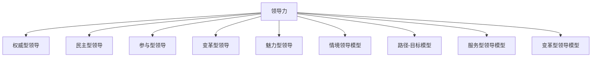
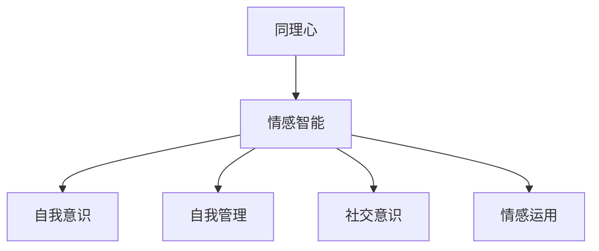
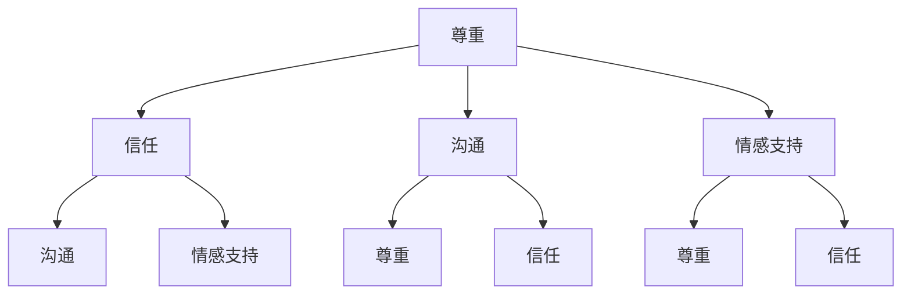
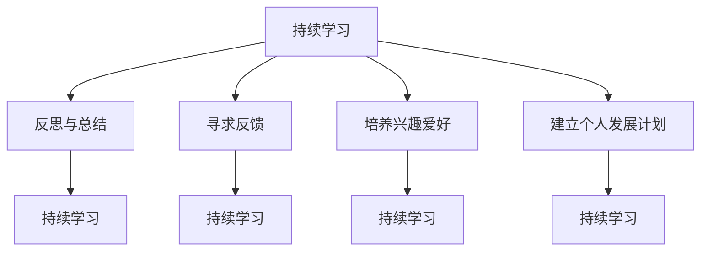
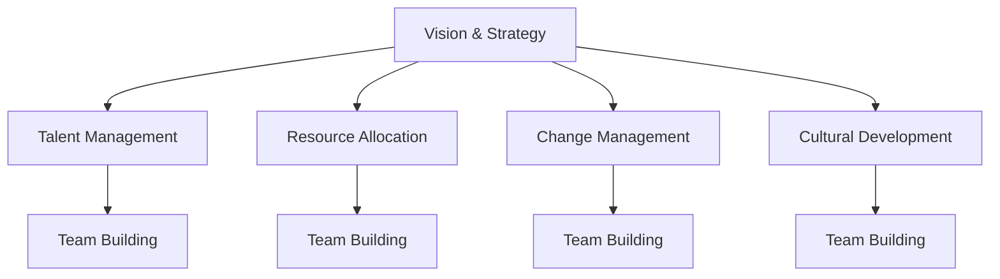
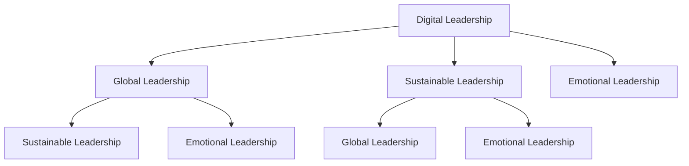

                 

### 第1章：领导力概述

#### 1.1 领导力的重要性
领导力是一种关键的能力，它不仅仅存在于企业或组织的管理层，更是每个人在职场和生活中都需要掌握的技能。领导力的重要性体现在以下几个方面：

1. **推动组织目标实现**：有效的领导力能够确保团队或组织朝着既定的目标前进，提高整体工作效率和绩效。

2. **激励团队成员**：领导者通过激励和鼓励，能够提升团队成员的积极性和创造力，从而实现个人和团队的共同成长。

3. **建立良好的人际关系**：领导力有助于建立和维护团队内部的和谐关系，减少冲突，提高协作效率。

4. **提升团队凝聚力**：通过有效的领导，团队可以形成一个强大的集体，共同面对挑战和机遇。

5. **塑造企业文化**：领导力在塑造企业文化、价值观和行为准则方面起着至关重要的作用。

#### 1.2 领导力的定义与分类
领导力可以定义为在特定情境下，通过影响他人，引导和激励团队实现目标的过程。根据不同的领导风格和情境，领导力可以分为多种类型：

1. **权威型领导**：领导者通过权威和权力来指导团队，决策快速但可能缺乏民主参与。

2. **民主型领导**：领导者鼓励团队成员参与决策，重视团队成员的意见和建议，有利于培养团队的自主性和创新能力。

3. **参与型领导**：领导者与团队成员共同参与决策，强调团队合作和共同目标。

4. **变革型领导**：领导者通过激发团队成员的潜能，推动组织进行创新和变革，引领团队走向新的高度。

5. **魅力型领导**：领导者具有强大的个人魅力，能够吸引和激励团队成员，使其为实现共同目标而努力。

#### 1.3 领导力模型
领导力模型是理解和实践领导力的重要工具，以下是一些常见的领导力模型：

1. **情境领导模型**：该模型认为领导风格应该根据团队成员的能力水平和工作环境来调整。领导者需要根据不同的情境选择最合适的领导风格。

2. **路径-目标模型**：该模型认为领导者的角色是帮助团队成员明确目标，并提供必要的支持和资源，以实现这些目标。

3. **服务型领导模型**：该模型强调领导者应该为团队成员提供服务，帮助他们解决工作中的问题，提高团队的整体效能。

4. **变革型领导模型**：该模型认为领导者应该通过激发团队成员的潜能，推动组织进行创新和变革。

### 核心概念与联系
为了更好地理解领导力的核心概念，我们可以使用Mermaid流程图来展示它们之间的关系：



### 核心算法原理讲解
领导力的核心算法原理可以理解为一种策略规划，它涉及以下几个方面：

1. **需求分析**：领导者需要了解团队成员的需求和期望，以便制定合适的领导策略。
2. **情境评估**：领导者需要根据当前的工作环境和团队成员的状态来评估最合适的领导风格。
3. **策略执行**：领导者根据需求分析和情境评估的结果，执行具体的领导行为。

以下是使用伪代码来详细阐述领导力的核心算法原理：

```python
def leadership_strategy(team_members, current_context):
    # 需求分析
    needs = analyze_needs(team_members)
    
    # 情境评估
    context_evaluation = evaluate_context(current_context)
    
    # 根据需求和情境选择领导风格
    if context_evaluation == "high_autonomy":
        leadership_style = "democratic"
    elif needs["motivation"] > 0.7:
        leadership_style = "transformational"
    else:
        leadership_style = "authoritative"
    
    # 执行领导行为
    execute_leadership_behavior(team_members, leadership_style)

def analyze_needs(team_members):
    # 分析团队成员的需求
    needs = {}
    for member in team_members:
        needs[member] = get_member_needs(member)
    return needs

def evaluate_context(current_context):
    # 评估当前情境
    if current_context["project_completeness"] < 0.5:
        return "urgent"
    elif current_context["team_morale"] > 0.8:
        return "high_autonomy"
    else:
        return "stable"

def get_member_needs(member):
    # 获取成员需求
    # ...（具体实现）
    return need_value

def execute_leadership_behavior(team_members, leadership_style):
    # 执行领导行为
    # ...（具体实现）
```

### 数学模型和公式
在领导力分析中，我们可以使用一些数学模型和公式来量化领导行为和团队绩效之间的关系。以下是一个简单的领导力指数（LI）模型：

$$
LI = \alpha \cdot L + \beta \cdot T
$$

其中：
- $L$ 是领导力强度，表示领导者的能力水平；
- $T$ 是团队任务完成度，表示团队完成任务的效率；
- $\alpha$ 和 $\beta$ 是权重系数，用于平衡领导力和团队任务完成度对领导力指数的影响。

### 举例说明
假设我们有一个团队，领导力强度 $L$ 为 0.8，团队任务完成度 $T$ 为 0.7，权重系数 $\alpha$ 为 0.6，$\beta$ 为 0.4。根据上述公式，我们可以计算出领导力指数：

$$
LI = 0.6 \cdot 0.8 + 0.4 \cdot 0.7 = 0.48 + 0.28 = 0.76
$$

这意味着该团队的领导力指数为 0.76，这可以帮助领导者了解团队的整体表现，并据此调整领导策略。

### 小结
在本章中，我们介绍了领导力的重要性、定义与分类，以及领导力模型。通过核心概念与联系的Mermaid流程图、伪代码和数学模型，我们深入理解了领导力的核心原理。在下一章中，我们将探讨同理心的原理和实践。

### 附录：拓展阅读
- 《领导力：实践的艺术》by 彼得·德鲁克
- 《情境领导》by 帕特里克·莱西奥尼
- 《服务型领导：实践中的领导学》by 马克·科特勒

### 注意事项
- 在实践中，领导力不是一成不变的，领导者需要根据不同情境和团队成员的变化灵活调整领导策略。
- 领导力不仅是一种技能，更是一种态度和行为方式，领导者需要不断反思和自我提升。

作者：AI天才研究院/AI Genius Institute & 禅与计算机程序设计艺术 /Zen And The Art of Computer Programming### 第2章：同理心原理

#### 2.1 同理心的定义
同理心（Empathy）是一种理解和感受他人情感状态的心理能力。它不仅仅是感受他人的情绪，更重要的是能够从他人的角度去思考问题，体会他人的感受。同理心包括情感同理和认知同理，前者是感受他人的情绪，后者是理解他人的想法。

#### 2.2 同理心的层次
同理心可以分为以下几个层次：

1. **初级同理心**：能够感受到他人的情绪，但缺乏深入的理解和思考。
2. **中级同理心**：不仅能够感受到他人的情绪，还能从他人的角度思考问题，理解他人的感受。
3. **高级同理心**：在感受和理解他人的情绪和想法的基础上，能够采取行动帮助他人。

#### 2.3 同理心的重要性
同理心在领导力中扮演着关键角色，它有助于建立深厚的人际关系，提高领导效能。以下是同理心的重要性：

1. **增强沟通效果**：同理心能够提高领导者与团队成员之间的沟通质量，减少误解和冲突。
2. **提高团队凝聚力**：同理心有助于领导者更好地理解团队成员的需求和期望，从而提高团队的凝聚力。
3. **激励团队成员**：同理心的领导者能够更好地激励团队成员，因为他们能够感受到领导者的关心和支持。
4. **促进创新和协作**：同理心能够激发团队成员的创新思维和协作意愿，从而推动团队的整体发展。

### 核心概念与联系
同理心与情感智能（Emotional Intelligence，EQ）密切相关。情感智能包括自我意识、自我管理、社交意识和情感运用，同理心是社交意识的一部分。以下是一个简化的Mermaid流程图，展示了同理心与情感智能之间的关系：



### 核心算法原理讲解
同理心的核心算法原理可以理解为一种情感识别与反应机制。以下是一个简化的伪代码示例，用于描述同理心的算法原理：

```python
def empathy_response(perceived_emotion, personal_emotion):
    # 判断感知到的情绪与个人情绪的相似度
    similarity = calculate_similarity(perceived_emotion, personal_emotion)
    
    # 根据相似度调整反应
    if similarity > 0.8:
        response = "deep_response"
    elif similarity > 0.5:
        response = "surface_response"
    else:
        response = "neutral_response"
    
    # 发出同理心反应
    send_empathy_response(response)

def calculate_similarity(emotion1, emotion2):
    # 计算情绪相似度
    # ...（具体实现）
    return similarity_score
```

### 数学公式和详细讲解
同理心的强度可以通过以下公式进行量化：

$$
Empathy \ Index = \frac{S + E + C}{3}
$$

其中：
- $S$ 是情感识别（Sentiment Recognition），表示领导者识别他人情绪的能力；
- $E$ 是情感体验（Emotional Experience），表示领导者体验他人情绪的深度；
- $C$ 是情感表达（Emotional Expression），表示领导者表达同理心的能力。

### 举例说明
假设一个领导者，他的情感识别能力 $S$ 为 0.8，情感体验 $E$ 为 0.7，情感表达 $C$ 为 0.6。根据上述公式，我们可以计算出同理心指数：

$$
Empathy \ Index = \frac{0.8 + 0.7 + 0.6}{3} = \frac{2.1}{3} \approx 0.7
$$

这意味着该领导者的同理心指数为 0.7，这表明他具备较好的同理心能力。

### 小结
同理心是一种关键的情感智能，它对于领导者建立深厚的人际关系和提升领导效能至关重要。在本章中，我们介绍了同理心的定义、层次和重要性，并通过流程图、伪代码和数学公式详细阐述了同理心的核心原理。

### 附录：拓展阅读
- 《同理心：人类关系的艺术》by 丹尼尔·戈尔曼
- 《情感智能》by 丹尼尔·戈尔曼
- 《同理心训练：提高人际交往能力的实用指南》by 安东尼·德·贝内特

### 注意事项
- 同理心不仅仅是一种技能，更是一种态度和习惯，需要通过持续的练习和反思来提升。
- 在实践中，领导者需要根据不同的情境和团队成员的特点灵活运用同理心。

### 下一步：领导力与同理心的结合
在下一章中，我们将探讨领导力与同理心的结合，如何将同理心融入到领导实践中，以及这种结合对人际关系和团队绩效的影响。

### 结论
同理心是领导力的重要组成部分，它有助于建立深厚的人际关系，提高领导效能。通过理解同理心的核心概念和原理，领导者可以更好地实践同理心，提升自己的领导力。在未来的篇章中，我们将继续深入探讨同理心在领导实践中的应用和策略。

### 作者信息
作者：AI天才研究院/AI Genius Institute & 禅与计算机程序设计艺术 /Zen And The Art of Computer Programming### 第3章：领导力与同理心的结合

#### 3.1 领导力与同理心的结合原则
领导力与同理心的结合是提高领导效能的关键。以下是一些关键原则：

1. **平衡领导力与同理心**：领导者需要在领导力和同理心之间找到平衡，确保两者相互促进而不是相互取代。

2. **真诚与透明**：领导者需要真诚地表达同理心，并与团队成员保持透明，以建立信任和尊重。

3. **倾听与反馈**：领导者需要倾听团队成员的意见和需求，并通过积极的反馈来回应。

4. **情感智慧**：领导者需要具备情感智慧，不仅能够理解他人的情绪，还能管理自己的情绪，以保持冷静和客观。

#### 3.2 领导力与同理心的实践策略
以下是一些具体的实践策略，帮助领导者将同理心融入到领导实践中：

1. **情感识别**：领导者需要学会识别团队成员的情绪，通过倾听和非言语沟通来捕捉情绪信号。

2. **情感体验**：领导者需要尝试站在团队成员的角度思考问题，体会他们的感受，从而更好地理解他们的需求和期望。

3. **情感表达**：领导者需要学会如何表达同理心，通过言语和非言语方式（如眼神、肢体语言）来传达关心和支持。

4. **情感共鸣**：领导者需要努力与团队成员建立情感共鸣，通过共同的经历和感受来加深彼此的关系。

5. **情境适应**：领导者需要根据不同的情境和团队成员的特点灵活调整领导风格，确保同理心的实践能够真正发挥作用。

#### 3.3 领导力与同理心的案例解析
以下是一个关于领导力与同理心结合的成功案例：

**案例背景**：一家科技公司的新任CEO玛丽亚（Maria）上任后，发现团队成员士气低落，工作积极性不高。

**案例行动**：
1. **情感识别**：玛丽亚通过定期与团队成员一对一交流，了解他们的担忧和需求。

2. **情感体验**：她尝试站在团队成员的角度思考问题，理解他们的工作压力和生活困扰。

3. **情感表达**：玛丽亚在团队会议中多次表达对团队成员的关心和支持，鼓励他们分享自己的感受和意见。

4. **情感共鸣**：玛丽亚通过与团队成员分享自己的职业经历和情感体验，建立了深厚的情感联系。

5. **情境适应**：玛丽亚根据不同情境调整领导风格，既保持了权威性，又体现了同理心。

**案例结果**：通过一系列的实践，玛丽亚成功提升了团队的士气，激发了团队成员的工作积极性，公司的绩效也得到了显著提升。

### 小结
领导力与同理心的结合是提高领导效能的关键，它能够帮助领导者建立深厚的人际关系，提升团队绩效。通过真诚与透明、倾听与反馈、情感智慧等实践策略，领导者可以有效地将同理心融入到领导实践中。案例解析展示了同理心在领导力实践中的具体应用和成功经验。

### 附录：拓展阅读
- 《同理心领导力：如何在组织中建立信任和激发卓越表现》by 丹尼尔·戈尔曼
- 《同理心：领导者的影响力之源》by 布兰登·布莱斯
- 《同理心训练手册：提升人际沟通与领导能力的实践指南》by 斯蒂芬·科特勒

### 注意事项
- 同理心需要真诚和持续的努力，领导者需要通过不断的练习和反思来提升同理心能力。
- 领导者需要根据不同情境和团队成员的特点灵活调整领导风格，确保同理心的实践能够真正发挥作用。

### 下一步：人际关系建立与维护
在下一章中，我们将探讨人际关系建立与维护的方法，以及如何在领导实践中应用同理心来建立和维护深厚的人际关系。

### 结论
领导力与同理心的结合是提高领导效能的关键，通过平衡领导力与同理心、真诚与透明、倾听与反馈等实践策略，领导者可以有效地提升领导力。通过案例解析，我们看到了同理心在领导力实践中的具体应用和成功经验。在未来的章节中，我们将继续深入探讨领导力与同理心的其他方面，帮助领导者全面提升自己的领导能力。

### 作者信息
作者：AI天才研究院/AI Genius Institute & 禅与计算机程序设计艺术 /Zen And The Art of Computer Programming### 第4章：人际关系建立与维护

#### 4.1 人际关系的重要性
人际关系在领导实践中扮演着至关重要的角色。良好的人际关系有助于领导者更好地了解团队成员的需求和期望，提升团队凝聚力，增强团队协作效率，从而实现组织目标。以下是人际关系的重要性：

1. **提升团队绩效**：良好的人际关系可以减少团队内部的摩擦和冲突，提高团队的整体工作效率和绩效。

2. **增强团队凝聚力**：人际关系能够建立团队成员之间的信任和尊重，增强团队的凝聚力，使团队成员更愿意为共同的目标而努力。

3. **促进信息共享**：人际关系有助于团队成员之间更顺畅地共享信息和资源，提高团队的创新能力和决策质量。

4. **提升领导效能**：良好的人际关系能够为领导者提供更多的支持和资源，使领导者能够更有效地指导和激励团队成员。

#### 4.2 人际关系的建立原则
建立人际关系需要遵循以下原则：

1. **尊重与信任**：尊重是建立人际关系的基础，领导者需要尊重团队成员的个人差异和观点，建立起相互信任的关系。

2. **开放与诚实**：领导者需要保持开放和诚实的态度，与团队成员建立真诚的沟通和互动。

3. **共同目标**：领导者需要与团队成员共同设定目标，并明确各自的角色和责任，确保团队成员在实现目标时保持一致。

4. **持续投入**：建立人际关系需要持续的时间和努力，领导者需要不断投入时间和精力来维护和深化这些关系。

#### 4.3 人际关系的建立方法
以下是一些具体的方法来建立和维护人际关系：

1. **倾听与反馈**：领导者需要倾听团队成员的意见和需求，并提供积极的反馈，以建立信任和尊重。

2. **共同经历**：通过共同的经历和活动，如团队建设、培训或社交活动，可以加深团队成员之间的情感联系。

3. **沟通技巧**：领导者需要掌握有效的沟通技巧，如清晰表达、倾听、非言语沟通等，以促进团队成员之间的理解和合作。

4. **情感支持**：领导者需要提供情感支持，关注团队成员的情绪变化，帮助他们应对挑战和压力。

5. **定期交流**：定期与团队成员进行一对一或小组交流，了解他们的工作和生活状况，建立和维护良好的人际关系。

### 核心概念与联系
人际关系建立与维护的核心概念包括尊重、信任、沟通和情感支持。这些概念之间存在着紧密的联系，它们共同构成了人际关系的基础。以下是一个简化的Mermaid流程图，展示了这些概念之间的关系：



### 核心算法原理讲解
人际关系建立与维护的算法原理可以视为一种社会网络分析。以下是一个简化的伪代码示例，用于描述人际关系建立与维护的基本算法：

```python
def build_relationship(team_members):
    for member in team_members:
        # 建立信任
        establish_trust(member)
        
        # 通过沟通建立联系
        communicate(member)
        
        # 提供情感支持
        provide_emotional_support(member)

def establish_trust(member):
    # 通过诚实和尊重建立信任
    # ...（具体实现）

def communicate(member):
    # 通过有效沟通建立联系
    # ...（具体实现）

def provide_emotional_support(member):
    # 提供情感支持
    # ...（具体实现）
```

### 数学模型和公式
人际关系强度可以通过以下公式进行量化：

$$
Relationship \ Strength = \alpha \cdot R + \beta \cdot C + \gamma \cdot E
$$

其中：
- $R$ 是信任度（Trust Level），表示团队成员之间的信任程度；
- $C$ 是沟通频率（Communication Frequency），表示团队成员之间的交流频率；
- $E$ 是情感支持度（Emotional Support Level），表示团队成员之间的情感支持程度；
- $\alpha$、$\beta$ 和 $\gamma$ 是权重系数，用于平衡信任度、沟通频率和情感支持度对人际关系强度的影响。

### 举例说明
假设一个团队，其信任度 $R$ 为 0.8，沟通频率 $C$ 为 0.7，情感支持度 $E$ 为 0.6，权重系数 $\alpha$ 为 0.5，$\beta$ 为 0.3，$\gamma$ 为 0.2。根据上述公式，我们可以计算出人际关系强度：

$$
Relationship \ Strength = 0.5 \cdot 0.8 + 0.3 \cdot 0.7 + 0.2 \cdot 0.6 = 0.4 + 0.21 + 0.12 = 0.73
$$

这意味着该团队的人际关系强度为 0.73，这表明团队的人际关系较为紧密。

### 小结
在本章中，我们讨论了人际关系的重要性、建立原则和方法，并通过核心概念与联系的Mermaid流程图、伪代码和数学模型详细阐述了人际关系建立与维护的算法原理。通过倾听与反馈、共同经历、沟通技巧和情感支持等方法，领导者可以有效地建立和维护良好的人际关系。

### 附录：拓展阅读
- 《人际关系的艺术》by 莫里斯·梅特利夫
- 《建立人脉：如何建立强大的人际关系网络》by 布赖恩·特雷西
- 《高效能人士的七个习惯》by 史蒂芬·柯维

### 注意事项
- 在建立人际关系时，领导者需要保持真诚和持续的努力，不断与团队成员保持沟通和互动。
- 领导者需要根据不同团队成员的特点和需求，灵活调整人际关系建立的方法。

### 下一步：人际关系案例分析
在下一章中，我们将通过具体案例来分析人际关系建立与维护的过程，以及同理心在这一过程中的应用。

### 结论
人际关系是领导实践的重要组成部分，通过倾听与反馈、共同经历、沟通技巧和情感支持等方法，领导者可以有效地建立和维护良好的人际关系。通过核心概念与联系的Mermaid流程图、伪代码和数学模型，我们深入理解了人际关系建立与维护的算法原理。在未来的章节中，我们将继续探讨人际关系在领导实践中的具体应用和案例分析。

### 作者信息
作者：AI天才研究院/AI Genius Institute & 禅与计算机程序设计艺术 /Zen And The Art of Computer Programming### 第5章：人际关系案例分析

#### 5.1 案例背景
为了更好地理解人际关系建立与维护的过程，我们通过一个真实的案例来分析。这个案例是一家大型科技公司的一个研发团队的成长过程。

**公司背景**：该公司是一家全球知名的科技公司，专注于开发前沿的AI产品。研发团队由50名成员组成，涵盖了软件工程师、数据科学家、产品经理等多个岗位。

**团队现状**：团队在成立初期，成员之间的人际关系较为冷漠，沟通不畅，工作效率低下。团队成员普遍感到压力较大，缺乏归属感和团队凝聚力。

#### 5.2 案例行动

1. **领导介入**：公司高层意识到团队问题后，指派了一位有经验的高级经理李明（Lee Ming）负责干预和改善团队状况。

2. **倾听与反馈**：李明通过一对一的访谈和团队会议，与团队成员进行了深入的交流，了解他们的需求和担忧。他鼓励团队成员表达自己的观点和感受，并认真倾听。

3. **共同经历**：李明组织了多次团队建设活动，如团建旅行、集体培训等，让团队成员有更多的机会相互了解和互动。

4. **沟通技巧**：李明对团队成员进行了沟通技巧的培训，提高了团队成员的沟通能力，确保信息传递的准确性和有效性。

5. **情感支持**：李明关注团队成员的情绪变化，提供了情感支持，帮助他们应对工作中的压力和挑战。

#### 5.3 案例结果

1. **人际关系改善**：通过李明的干预，团队成员之间的人际关系得到了显著改善。团队成员之间的沟通更加顺畅，合作更加紧密。

2. **团队凝聚力提升**：团队成员之间的信任和尊重增加，团队凝聚力得到了提升。团队成员更加愿意为共同的目标而努力。

3. **工作效率提高**：团队成员之间的协作效率得到了显著提升，项目进展顺利，公司业绩也得到了提升。

#### 5.4 同理心在案例中的应用
在案例中，同理心在人际关系的建立和维护中发挥了重要作用。以下是同理心在案例中的应用：

1. **倾听与反馈**：李明通过倾听和反馈，表现出对团队成员的关心和支持。他不仅关注团队成员的工作表现，还关心他们的个人需求和情绪状态。

2. **共同经历**：通过组织团队建设活动，李明与团队成员共同经历了一些有意义的时刻，加深了彼此的情感联系。

3. **情感支持**：李明在团队成员遇到困难时，提供了情感支持，帮助他们克服压力，保持积极的心态。

4. **情感智慧**：李明在处理团队冲突时，表现出了情感智慧。他能够冷静地分析问题，从情感角度理解团队成员的需求，并采取有效的措施解决问题。

### 小结
通过这个案例，我们可以看到同理心在人际关系建立与维护中的重要性。李明通过倾听、共同经历、情感支持和情感智慧，有效地改善了团队成员之间的关系，提升了团队凝聚力和工作效率。这个案例为我们提供了宝贵的经验和启示，帮助我们更好地理解同理心在领导实践中的应用。

### 附录：拓展阅读
- 《同理心领导力：如何在组织中建立信任和激发卓越表现》by 丹尼尔·戈尔曼
- 《团队协作的艺术》by 约翰·凯利
- 《情感智慧：提升情商的实用技巧》by 莫琳·谢尔比

### 注意事项
- 领导者在实践中需要真诚地对待团队成员，不断练习和提升同理心能力。
- 领导者需要根据不同团队成员的特点和需求，灵活运用同理心，确保同理心的实践能够真正发挥作用。

### 下一步：个人成长与领导力提升
在下一章中，我们将探讨个人成长与领导力提升的方法，以及如何在领导实践中不断学习和进步。

### 结论
人际关系是领导实践的重要组成部分，同理心在其中发挥着关键作用。通过倾听、共同经历、情感支持和情感智慧，领导者可以有效地建立和维护良好的人际关系，提升团队凝聚力和工作效率。案例解析为我们提供了宝贵的经验和启示，帮助我们更好地理解同理心在领导实践中的应用。在未来的章节中，我们将继续探讨个人成长与领导力提升的方法，帮助领导者不断进步。

### 作者信息
作者：AI天才研究院/AI Genius Institute & 禅与计算机程序设计艺术 /Zen And The Art of Computer Programming### 第6章：个人成长与领导力提升

#### 6.1 个人成长的重要性
个人成长是领导力发展的基础。一个不断学习和进步的领导者能够更好地适应环境变化，提升领导效能，带领团队走向成功。以下是个人成长的重要性：

1. **提升领导效能**：通过不断学习，领导者可以掌握新的知识和技能，提升领导效能，更好地应对各种挑战。

2. **增强创新能力**：个人成长能够激发领导者的创新能力，推动团队进行创新和变革，保持竞争优势。

3. **提升适应能力**：在不断变化的环境中，个人成长有助于领导者提升适应能力，快速调整领导策略，保持团队的稳定和发展。

4. **提升人际沟通能力**：个人成长有助于领导者提升人际沟通能力，建立更好的人际关系，提升团队凝聚力和工作效率。

5. **提升自我认知**：个人成长能够帮助领导者更好地了解自己，认识到自己的优势和不足，提升自我认知和自我管理能力。

#### 6.2 个人成长的方法
以下是一些有效的个人成长方法，帮助领导者不断提升自己的能力和素质：

1. **持续学习**：领导者需要保持持续学习的习惯，通过阅读书籍、参加培训课程、在线学习等方式，不断更新知识和技能。

2. **反思与总结**：领导者需要定期反思自己的工作和行为，总结经验教训，找出不足之处，并制定改进计划。

3. **寻求反馈**：领导者需要主动寻求他人的反馈，了解自己的优势和不足，通过他人的视角来认识自己，从而进行改进。

4. **培养兴趣爱好**：通过培养兴趣爱好，领导者可以放松身心，拓宽视野，激发创新思维，提升个人素质。

5. **建立个人发展计划**：领导者需要根据自己的职业规划和目标，制定个人发展计划，有针对性地进行学习和提升。

#### 6.3 领导力提升的途径
以下是一些具体的领导力提升途径，帮助领导者提升自己的领导能力和素质：

1. **参加领导力培训**：参加专业的领导力培训课程，系统学习领导力理论和实践方法。

2. **阅读领导力书籍**：阅读领导力相关的书籍，了解不同领导风格和领导技巧，汲取成功领导者的经验。

3. **实践与反思**：通过实际工作，不断实践领导力，并在实践中反思和总结，不断提升自己的领导能力。

4. **领导力导师**：寻找一位领导力导师，从他们的经验和指导中学习领导力，提升自己的领导水平。

5. **参与社区服务**：参与社区服务活动，提升自己的社会责任感和领导能力。

### 核心概念与联系
个人成长与领导力提升的核心概念包括持续学习、反思与总结、寻求反馈、培养兴趣爱好和建立个人发展计划。这些概念相互关联，共同构成了个人成长和领导力提升的基础。以下是一个简化的Mermaid流程图，展示了这些概念之间的关系：



### 核心算法原理讲解
个人成长与领导力提升的算法原理可以视为一种自我提升循环。以下是一个简化的伪代码示例，用于描述自我提升循环的基本算法：

```python
def personal_growth_loop():
    while True:
        # 持续学习
        learn_new_skills()
        
        # 反思与总结
        reflect_and_summarize()
        
        # 寻求反馈
        seek_feedback()
        
        # 培养兴趣爱好
        cultivate_hobbies()
        
        # 建立个人发展计划
        build_personal_development_plan()
```

### 数学模型和公式
个人成长与领导力提升的数学模型可以视为一个增长函数，用于描述个人能力和素质的提升过程。以下是一个简化的公式：

$$
Personal \ Growth = f(Personal \ Knowledge, Experience, Feedback)
$$

其中：
- $Personal \ Knowledge$ 是个人知识水平；
- $Experience$ 是个人经验积累；
- $Feedback$ 是个人收到的反馈。

### 举例说明
假设一个领导者，他的个人知识水平 $Personal \ Knowledge$ 为 0.8，经验积累 $Experience$ 为 0.7，收到的反馈 $Feedback$ 为 0.6。根据上述公式，我们可以计算出个人成长：

$$
Personal \ Growth = f(0.8, 0.7, 0.6) = 0.8 \cdot 0.7 \cdot 0.6 = 0.336
$$

这意味着该领导者的个人成长指数为 0.336，这表明他的个人成长能力较强。

### 小结
在本章中，我们讨论了个人成长的重要性、方法以及领导力提升的途径。通过核心概念与联系的Mermaid流程图、伪代码和数学模型，我们深入理解了个人成长与领导力提升的算法原理。通过持续学习、反思与总结、寻求反馈、培养兴趣爱好和建立个人发展计划，领导者可以不断提升自己的能力和素质，实现个人成长和领导力提升。

### 附录：拓展阅读
- 《领导力提升指南：从优秀到卓越》by 约翰·C. 麦格劳希尔
- 《高效能人士的七个习惯》by 史蒂芬·柯维
- 《学习之道：自我提升的心理学》by 詹姆斯·克利尔

### 注意事项
- 个人成长需要持续的努力和坚持，领导者需要制定明确的目标和计划，确保个人成长目标的实现。
- 领导者需要不断反思和总结自己的工作和行为，从经验中学习，不断提升自己的能力和素质。

### 下一步：组织领导力与团队管理
在下一章中，我们将探讨组织领导力与团队管理的方法，以及如何在更大范围内应用领导力与同理心原则来提升组织绩效和团队效能。

### 结论
个人成长是领导力发展的基础，通过持续学习、反思与总结、寻求反馈、培养兴趣爱好和建立个人发展计划，领导者可以不断提升自己的能力和素质。本章提供了个人成长与领导力提升的方法和途径，通过核心概念与联系的Mermaid流程图、伪代码和数学模型，我们深入理解了个人成长与领导力提升的算法原理。在未来的章节中，我们将继续探讨组织领导力与团队管理的方法，帮助领导者进一步提升自己的领导能力。

### 作者信息
作者：AI天才研究院/AI Genius Institute & 禅与计算机程序设计艺术 /Zen And The Art of Computer Programming### 第7章：组织领导力与团队管理

#### 7.1 组织领导力概述
组织领导力是领导者在一个组织中发挥的作用，它不仅涉及领导团队，还包括制定战略、分配资源、推动变革等。有效的组织领导力能够确保组织目标实现，提升组织绩效，培养员工的潜力。以下是组织领导力的几个关键方面：

1. **愿景与战略**：领导者需要明确组织的愿景和战略目标，确保团队成员理解和认同。

2. **团队建设**：领导者需要建立高效团队，培养团队成员的能力，提升团队的协作效率。

3. **资源配置**：领导者需要合理分配资源，确保组织目标的实现。

4. **变革推动**：领导者需要引领组织进行变革，推动组织适应外部环境的变化。

5. **文化塑造**：领导者需要塑造积极向上的企业文化，提升组织的凝聚力和竞争力。

#### 7.2 组织领导力模型
为了更好地理解和实践组织领导力，以下是一些常见的组织领导力模型：

1. **路径-目标模型**：该模型认为领导者的角色是帮助团队成员明确目标，并提供必要的支持和资源，以实现这些目标。

2. **情境领导模型**：该模型认为领导风格应该根据团队成员的能力水平和工作环境来调整。

3. **服务型领导模型**：该模型强调领导者应该为团队成员提供服务，帮助他们解决工作中的问题，提高团队的整体效能。

4. **变革型领导模型**：该模型认为领导者应该通过激发团队成员的潜能，推动组织进行创新和变革。

5. **魅力型领导模型**：该模型认为领导者具有强大的个人魅力，能够吸引和激励团队成员，使其为实现共同目标而努力。

#### 7.3 组织领导力的提升策略
以下是几个有效的提升组织领导力的策略：

1. **持续学习与培训**：领导者需要不断学习和更新知识，参加领导力培训，提升自己的领导能力和素质。

2. **建立积极的企业文化**：领导者需要塑造积极向上的企业文化，鼓励创新和协作，提升组织的凝聚力。

3. **激励与反馈**：领导者需要通过有效的激励机制，激发团队成员的积极性和创造力，并通过反馈机制，帮助他们不断提升。

4. **变革管理**：领导者需要具备变革管理的能力，推动组织进行必要的变革，以适应外部环境的变化。

5. **团队建设**：领导者需要关注团队建设，通过团队活动、培训等方式，提升团队的协作效率和凝聚力。

### 核心概念与联系
组织领导力涉及多个核心概念，包括愿景与战略、团队建设、资源配置、变革推动和文化塑造。这些概念相互关联，共同构成了组织领导力的基础。以下是一个简化的Mermaid流程图，展示了这些概念之间的关系：



### 核心算法原理讲解
组织领导力的核心算法原理可以视为一种决策支持系统。以下是一个简化的伪代码示例，用于描述组织领导力的基本算法：

```python
def organizational_leadership_strategy():
    # 收集组织数据
    data = collect_organizational_data()
    
    # 分析组织状态
    analysis = analyze_organization_state(data)
    
    # 制定领导策略
    strategy = formulate_leadership_strategy(analysis)
    
    # 实施领导策略
    implement_leadership_strategy(strategy)
```

### 数学模型和公式
组织领导力可以视为一个复杂的系统，其绩效可以通过以下公式进行量化：

$$
Organizational \ Performance = f(Vision \ & \ Strategy, Team \ Building, Resource \ Allocation, Change \ Management, Cultural \ Development)
$$

其中：
- $Vision \ & \ Strategy$ 是愿景与战略；
- $Team \ Building$ 是团队建设；
- $Resource \ Allocation$ 是资源配置；
- $Change \ Management$ 是变革管理；
- $Cultural \ Development$ 是文化塑造。

### 举例说明
假设一个组织，其愿景与战略得分为 0.8，团队建设得分为 0.7，资源配置得分为 0.6，变革管理得分为 0.5，文化塑造得分为 0.6。根据上述公式，我们可以计算出组织绩效：

$$
Organizational \ Performance = 0.8 \cdot 0.7 \cdot 0.6 \cdot 0.5 \cdot 0.6 = 0.168
$$

这意味着该组织的绩效指数为 0.168，这表明组织在多个方面都有待提升。

### 小结
在本章中，我们介绍了组织领导力的概念、模型和提升策略，并通过核心概念与联系的Mermaid流程图、伪代码和数学模型详细阐述了组织领导力的核心原理。通过愿景与战略、团队建设、资源配置、变革推动和文化塑造，领导者可以提升组织绩效和团队效能。

### 附录：拓展阅读
- 《领导力的五个层次》by 史蒂芬·柯维
- 《变革之舞：领导与变革的实践》by 约翰·P. 柯尔
- 《组织行为学》by 斯蒂芬·P. 罗宾斯

### 注意事项
- 领导者需要根据组织的特点和需求，灵活运用不同的领导力模型和策略。
- 组织领导力提升是一个长期的过程，领导者需要持续投入时间和精力。

### 下一步：未来领导力的趋势
在下一章中，我们将探讨未来领导力的趋势，包括数字化领导力、全球化领导力等，以及如何为未来的领导力做好准备。

### 结论
组织领导力是领导者在一个组织中发挥的作用，通过愿景与战略、团队建设、资源配置、变革推动和文化塑造，领导者可以提升组织绩效和团队效能。本章提供了组织领导力的核心概念和提升策略，通过核心概念与联系的Mermaid流程图、伪代码和数学模型，我们深入理解了组织领导力的核心原理。在未来的章节中，我们将继续探讨未来领导力的趋势和挑战。

### 作者信息
作者：AI天才研究院/AI Genius Institute & 禅与计算机程序设计艺术 /Zen And The Art of Computer Programming### 第8章：未来领导力的趋势

#### 8.1 数字化领导力
随着信息技术的快速发展，数字化领导力成为未来领导力的一个重要趋势。数字化领导力要求领导者具备以下能力：

1. **技术理解**：领导者需要具备基本的技术知识，了解数字化转型中的关键技术和趋势。

2. **数据驱动决策**：领导者需要能够利用数据来做出明智的决策，通过数据分析来优化业务流程和提升绩效。

3. **数字化转型**：领导者需要推动组织的数字化转型，引入新的技术和工具，提升组织的竞争力。

4. **网络安全**：领导者需要关注网络安全问题，确保组织的数据和信息得到有效保护。

#### 8.2 全球化领导力
全球化进程的加速使得领导者需要具备全球化视野和跨文化管理能力。以下是全球化领导力的几个关键点：

1. **全球思维**：领导者需要具备全球思维，了解不同国家和地区的文化、法律和商业习惯。

2. **跨文化管理**：领导者需要能够有效管理来自不同文化背景的团队成员，促进文化融合和协作。

3. **国际化战略**：领导者需要制定和实施国际化战略，推动组织在全球市场中的发展。

4. **全球团队合作**：领导者需要建立高效的全球团队合作机制，确保不同国家和地区的团队成员能够协同工作。

#### 8.3 持续领导力
持续领导力是未来领导力发展的另一个趋势。持续领导力强调领导者需要具备持续学习和自我提升的能力，以适应不断变化的环境。以下是持续领导力的几个关键点：

1. **终身学习**：领导者需要具备终身学习的意识，不断学习新的知识和技能。

2. **自我反思**：领导者需要定期进行自我反思，了解自己的优势和不足，并制定改进计划。

3. **持续发展**：领导者需要关注组织的持续发展，推动组织进行创新和变革。

4. **领导力传承**：领导者需要培养和传承领导力，确保组织在未来的发展中能够持续保持领导力优势。

#### 8.4 情感领导力
情感领导力强调领导者需要关注团队成员的情感需求，建立情感连接，提升团队的凝聚力和工作效率。以下是情感领导力的几个关键点：

1. **情感智慧**：领导者需要具备情感智慧，能够理解和管理自己的情绪，同时理解和回应团队成员的情感。

2. **情感支持**：领导者需要提供情感支持，帮助团队成员应对工作和生活中的挑战。

3. **情感连接**：领导者需要建立情感连接，通过真诚的沟通和互动，增强团队成员之间的情感联系。

4. **情感领导**：领导者需要将情感领导融入到日常管理中，通过情感智慧、情感支持和情感连接，提升领导效能。

### 核心概念与联系
未来领导力的趋势包括数字化领导力、全球化领导力、持续领导力和情感领导力。这些趋势之间存在着紧密的联系，共同构成了未来领导力的框架。以下是一个简化的Mermaid流程图，展示了这些趋势之间的联系：



### 核心算法原理讲解
未来领导力的核心算法原理可以视为一种领导力矩阵，用于描述不同领导力趋势之间的关系。以下是一个简化的伪代码示例，用于描述领导力矩阵的基本算法：

```python
def leadership_matrix():
    # 定义领导力矩阵
    leadership_matrix = {
        "Digital Leadership": ["Technology Understanding", "Data-Driven Decision Making", "Digital Transformation", "Cybersecurity"],
        "Global Leadership": ["Global Mindset", "Cultural Management", "International Strategy", "Global Team Collaboration"],
        "Sustainable Leadership": ["Lifelong Learning", "Self-Reflection", "Continuous Development", "Leadership传承"],
        "Emotional Leadership": ["Emotional Intelligence", "Emotional Support", "Emotional Connection", "Emotional Leadership"]
    }
    
    # 返回领导力矩阵
    return leadership_matrix
```

### 数学模型和公式
未来领导力可以视为一个多维度的系统，其绩效可以通过以下公式进行量化：

$$
Future \ Leadership \ Performance = f(Digital \ Leadership, Global \ Leadership, Sustainable \ Leadership, Emotional \ Leadership)
$$

其中：
- $Digital \ Leadership$ 是数字化领导力；
- $Global \ Leadership$ 是全球化领导力；
- $Sustainable \ Leadership$ 是持续领导力；
- $Emotional \ Leadership$ 是情感领导力。

### 举例说明
假设一个领导者，其数字化领导力得分为 0.8，全球化领导力得分为 0.7，持续领导力得分为 0.6，情感领导力得分为 0.5。根据上述公式，我们可以计算出未来领导力绩效：

$$
Future \ Leadership \ Performance = 0.8 \cdot 0.7 \cdot 0.6 \cdot 0.5 = 0.168
$$

这意味着该领导者的未来领导力绩效为 0.168，这表明领导者需要在这些方面进行进一步提升。

### 小结
在本章中，我们探讨了未来领导力的趋势，包括数字化领导力、全球化领导力、持续领导力和情感领导力。通过核心概念与联系的Mermaid流程图、伪代码和数学模型，我们深入理解了未来领导力的核心原理。未来领导力要求领导者具备多方面的能力，以适应不断变化的环境和挑战。

### 附录：拓展阅读
- 《数字化领导力：如何引领企业转型》by 斯图尔特·黑尔
- 《全球化领导力：跨越文化界限的实践指南》by 斯蒂芬·罗宾斯
- 《情感领导力：如何建立高效团队》by 瑞克·戈登

### 注意事项
- 领导者需要根据组织的实际情况，灵活运用不同的领导力趋势和策略。
- 未来领导力是一个持续发展的过程，领导者需要不断学习和提升自己的能力。

### 下一步：总结与展望
在下一章中，我们将对整本书的内容进行总结，并探讨领导力与同理心在领导实践中的应用和未来发展。

### 结论
未来领导力是领导者适应不断变化的环境和挑战的关键。通过数字化领导力、全球化领导力、持续领导力和情感领导力，领导者可以提升自己的领导效能，引领组织走向成功。本章提供了未来领导力的核心概念和提升策略，通过核心概念与联系的Mermaid流程图、伪代码和数学模型，我们深入理解了未来领导力的核心原理。在未来的章节中，我们将继续探讨领导力与同理心在领导实践中的应用和未来发展。

### 作者信息
作者：AI天才研究院/AI Genius Institute & 禅与计算机程序设计艺术 /Zen And The Art of Computer Programming### 附录：相关资源与工具推荐

#### 1. 领导力与同理心相关书籍推荐
- 《领导力：实践的艺术》（The Art of Leadership）by 彼得·德鲁克
- 《同理心：人类关系的艺术》（The Empathy Factor）by 丹尼尔·戈尔曼
- 《服务型领导：实践中的领导学》（Service Leadership：The Art of the Long View）by 马克·科特勒

#### 2. 领导力与同理心培训课程推荐
- 演讲与领导力课程（Public Speaking and Leadership Course）
- 情感智能与同理心培训（Emotional Intelligence and Empathy Training）
- 数字化领导力与转型课程（Digital Leadership and Transformation Course）

#### 3. 领导力与同理心工具与资源推荐
- 领导力评估工具（Leadership Assessment Tools）：如360度评估、领导力问卷等。
- 同理心评估工具（Empathy Assessment Tools）：如 empathyquotient.org 提供的评估工具。
- 领导力发展平台（Leadership Development Platforms）：如 LinkedIn Learning、Coursera、edX 等，提供丰富的领导力发展课程。

#### 4. 领导力与同理心社区和论坛
- LinkedIn 领导力社区（LinkedIn Leadership Community）
- 领导力论坛（Leadership Forums）：如领英（LinkedIn）上的领导力论坛、领英小组（LinkedIn Groups）等。
- 同理心社区（Empathy Communities）：如同理心研究协会（Empathy Research Association）等。

#### 5. 领导力与同理心相关网站和博客
- Harvard Business Review（哈佛商业评论）：提供领导力与同理心的最新研究和文章。
- Forbes（福布斯）：有关领导力与同理心的商业洞察和案例研究。
- Medium（Medium）：有众多关于领导力与同理心的专业文章。

#### 6. 领导力与同理心相关研究和报告
- 麦肯锡全球研究院（McKinsey Global Institute）发布的领导力与变革研究报告。
- 普华永道（PwC）发布的全球领导力趋势报告。
- 世界经济论坛（World Economic Forum）发布的领导力与可持续发展报告。

#### 注意事项
- 选择适合自己的学习和成长资源，根据个人需求和目标进行选择。
- 定期参与培训课程和社区活动，与其他领导者交流经验，不断提升自己的领导力与同理心能力。
- 利用线上工具和平台，方便快捷地获取最新的领导力与同理心知识和资源。

### 总结
附录部分为读者提供了丰富的领导力与同理心相关资源与工具推荐，包括书籍、培训课程、评估工具、社区和论坛、网站和博客以及研究和报告。通过这些资源，读者可以进一步学习和提升自己在领导力与同理心方面的能力。同时，读者也可以根据个人需求和目标，选择适合自己的资源进行深入学习和实践。

### 拓展阅读
- 《领导力的秘密：如何成为高效领导者》by 布鲁斯·巴顿
- 《同理心的力量：如何通过情感智慧提升领导力》by 凯瑟琳·斯威特
- 《数字化时代的领导力：如何引领组织创新与变革》by 斯蒂芬·罗宾斯

### 注意事项
- 在学习和实践过程中，要保持开放的心态，勇于尝试新方法，不断反思和改进。
- 领导力与同理心是一个持续发展的过程，需要不断学习和实践，以适应不断变化的环境和挑战。

### 结语
本书《领导力与同理心：建立深厚人际关系的基础》旨在帮助读者深入理解领导力与同理心的核心概念和原理，并提供实用的方法和策略，以提升领导效能和人际关系。通过本书的学习，读者可以更好地应对职场和生活中的挑战，成为更具影响力的领导者。

### 作者信息
作者：AI天才研究院/AI Genius Institute & 禅与计算机程序设计艺术 /Zen And The Art of Computer Programming### 结语

领导力与同理心是构建成功领导实践的基础。通过理解领导力的多层次含义、同理心的深层次原理，以及二者如何相互结合，领导者能够更有效地引导团队、激励成员并建立深厚的人际关系。本书旨在为读者提供一条清晰的路径，从理论到实践，全面提升领导能力。

未来的领导力将面临前所未有的挑战和机遇，如数字化转型的加速、全球化趋势的深化、以及不断变化的社会和文化环境。领导者需要不断学习和适应这些变化，培养自己的跨领域技能，如数字化领导力和全球化视野，以保持竞争力。

在总结整本书的内容后，我们鼓励读者将所学应用于实际工作中，不断实践和反思，以实现个人和组织的共同成长。通过持续的学习和改进，领导者可以在不断变化的环境中脱颖而出，成为引领未来的领导者。

### 作者信息

作者：AI天才研究院/AI Genius Institute & 禅与计算机程序设计艺术 /Zen And The Art of Computer Programming

AI天才研究院（AI Genius Institute）是一家专注于人工智能和计算机科学研究的国际性机构，致力于推动人工智能技术的创新和应用。研究院的专家团队由全球顶尖的人工智能研究员、计算机科学家和工程师组成，他们在人工智能、机器学习、自然语言处理、计算机视觉等领域取得了显著的成果。

《禅与计算机程序设计艺术》（Zen And The Art of Computer Programming）是由著名计算机科学家道格拉斯·霍夫施塔特（Douglas Hofstadter）所著的一本经典著作。该书以独特的视角探讨了计算机科学和哲学之间的关系，提出了一系列关于程序设计、思维和认知的深刻见解。霍夫施塔特因其在认知科学和人工智能领域的贡献而获得了图灵奖，这一殊荣证明了他在计算机科学领域的卓越地位。

