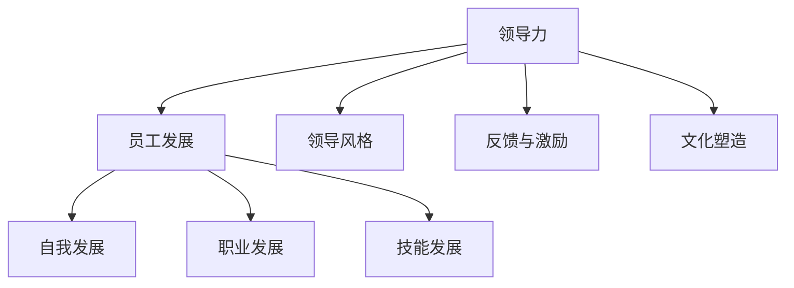

                 


### 文章标题：领导力与员工发展：设计有效的职业路径

### 关键词：领导力、员工发展、职业路径、领导风格、反馈与激励、文化塑造

### 摘要：

本文旨在探讨领导力与员工发展的紧密联系，并设计出一种有效的职业路径。首先，我们将介绍领导力的核心概念和不同的领导力模型，以及员工发展的基本理论。接着，我们将分析领导力所需的要素和领导风格，并探讨如何通过职业路径设计和技能提升策略来促进员工发展。随后，我们将讨论领导力与员工发展的互动关系，特别是在反馈与激励、文化塑造方面的作用。最后，通过实战案例分析和解决方案的提供，我们希望为读者提供实际可行的指导和建议。

### 目录：

1. **背景介绍**
    - **领导力的重要性**：介绍领导力在企业发展和员工激励中的作用。
    - **员工发展的需求**：分析现代企业对员工发展的需求和挑战。

2. **核心概念与联系**
    - **领导力定义与模型**：介绍领导力的核心概念，不同的领导力模型。
    - **员工发展理论**：回顾员工发展的基本理论，如自我发展、职业发展、技能发展等。
    - **Mermaid 流程图**：展示核心概念与联系之间的关系架构。

3. **领导力原理**
    - **领导力要素**：分析领导力所需的要素，如影响力、沟通能力、决策能力等。
    - **领导风格**：介绍不同的领导风格及其对员工发展的影响。

4. **员工发展策略**
    - **职业路径设计**：阐述如何设计有效的职业路径，包括职业目标设定、职业规划等。
    - **技能提升与培训**：探讨如何通过培训提升员工的技能，包括内部培训、外部培训等。

5. **领导力与员工发展的互动**
    - **反馈与激励**：讨论如何通过反馈和激励机制促进员工发展。
    - **文化塑造**：探讨组织文化在员工发展中的重要作用。

6. **实战案例**
    - **案例分析**：通过实际案例展示领导力与员工发展的有效实践。
    - **解决方案**：针对案例中存在的问题，提供具体的解决方案。

7. **附录**
    - **工具与资源**：列出与领导力和员工发展相关的工具和资源。

### 背景介绍

在当今快速发展的商业环境中，领导力和员工发展已成为企业成功的关键因素。领导力不仅仅是管理能力的体现，更是企业文化和团队氛围的塑造者。一位优秀的领导者能够激发员工的潜力，提高团队的凝聚力，从而推动企业的持续发展。而员工发展则关乎企业的竞争力，通过提升员工的技能和职业素养，企业能够更好地应对市场变化，保持竞争优势。

#### 领导力的重要性

领导力在企业发展和员工激励中发挥着至关重要的作用。首先，领导力能够激发员工的潜力。一个有远见的领导者能够看到员工的潜力，并通过有效的激励手段激发他们，从而实现个人和企业的共同成长。其次，领导力有助于建立团队的凝聚力。一个团结协作的团队能够更好地应对各种挑战，实现企业的战略目标。此外，领导力还影响着企业的文化氛围。领导者的行为和价值观直接影响着员工的价值观和行为，从而塑造出积极向上的企业文化。

#### 员工发展的需求

随着科技的快速发展，企业面临着越来越激烈的竞争。为了在市场中立于不败之地，企业必须不断提升员工的技能和职业素养。员工发展已经成为现代企业不可或缺的一部分。首先，员工发展能够提升员工的职业素养，使他们能够更好地适应企业的发展需求。其次，员工发展有助于提高员工的满意度和忠诚度，从而降低员工流失率。此外，员工发展还能够促进企业的创新和进步，为企业带来更多的商业机会。

### 核心概念与联系

在探讨领导力与员工发展的关系时，我们需要明确几个核心概念，包括领导力的定义与模型，员工发展的基本理论，以及它们之间的内在联系。

#### 领导力定义与模型

领导力是一种影响力，领导者通过这种影响力引导和激励团队成员实现共同的目标。领导力不仅仅关乎权力和地位，更是一种能力，一种能够影响他人行为和思维的能力。不同的领导力模型为领导者提供了多种方法来理解和管理团队。

- **行为模型**：这种模型认为领导力是通过特定行为表现出来的。例如，领导者的行为可以是授权、激励、沟通等。行为模型有助于领导者识别和培养有效的领导行为。
- **特质模型**：这种模型认为领导力取决于领导者的个人特质。领导者可能具备自信、决断力、智慧等特质。特质模型有助于领导者了解自身的优势和不足，从而进行自我提升。
- **情境模型**：这种模型认为领导力是情境依赖的。不同的情境需要不同的领导行为。例如，领导者在面对危机时可能需要果断决策，而在团队建设中可能需要更多的时间倾听和沟通。

#### 员工发展理论

员工发展是指通过培训和指导，帮助员工提升技能和职业素养的过程。员工发展包括多个方面，如自我发展、职业发展和技能发展。

- **自我发展**：自我发展强调员工自我学习和自我提升的能力。通过自我发展，员工能够不断提升自己的知识水平和专业技能。
- **职业发展**：职业发展关注员工的职业规划和晋升路径。一个完善的职业发展体系可以帮助员工明确自己的职业目标，并为实现这些目标提供支持和指导。
- **技能发展**：技能发展关注员工实际操作技能的提升。通过技能发展，员工能够更好地适应企业的发展需求，提高工作效率。

#### Mermaid 流程图

为了更好地展示领导力与员工发展之间的内在联系，我们可以使用 Mermaid 流程图进行描述。



在这个流程图中，领导力作为核心概念，与员工发展的各个方面紧密相连。领导力通过影响领导风格、反馈与激励机制以及组织文化，进而影响员工的自我发展、职业发展和技能发展。

### 领导力原理

领导力是一种复杂的技能，它涉及多个方面的要素。在这部分，我们将深入探讨领导力所需的要素，包括影响力、沟通能力、决策能力等，以及这些要素如何影响员工的职业发展。

#### 领导力要素

1. **影响力**：影响力是领导力的核心要素之一。领导者通过影响力引导和激励团队成员，实现共同的目标。影响力不仅取决于领导者的个人魅力，还取决于领导者如何运用各种策略和技巧。例如，领导者可以通过情感联结、共同目标、信任建立等方式增强自己的影响力。

2. **沟通能力**：沟通能力是领导者必备的另一项关键技能。有效的沟通可以帮助领导者传达信息、解决冲突、建立信任。沟通能力包括倾听、表达、非语言沟通等多个方面。一个优秀的领导者不仅能够清晰、准确地传达自己的想法，还能够理解员工的观点和需求。

3. **决策能力**：决策能力是领导者必须具备的重要素质。在复杂多变的环境中，领导者需要迅速做出决策，并承担相应的责任。决策能力包括分析问题、评估风险、选择最佳方案等多个环节。一个优秀的领导者能够在压力下保持冷静，做出明智的决策。

#### 领导风格

领导风格是领导者行为方式的体现，不同的领导风格对员工的发展有着不同的影响。

- **权威型领导风格**：权威型领导者强调权力和控制，通过严格的规章制度来管理团队。这种领导风格在短期内可能提高工作效率，但长期来看可能会导致员工失去创新精神和自主性。
- **民主型领导风格**：民主型领导者注重团队合作和员工参与，鼓励员工提出意见和建议。这种领导风格有助于培养员工的参与感和责任感，提高团队凝聚力。
- **教练型领导风格**：教练型领导者关注员工的个人成长和职业发展，通过指导和辅导帮助员工提升技能。这种领导风格有助于激发员工的潜力，促进员工的长期发展。

#### 领导风格对员工发展的影响

不同的领导风格对员工的发展有着显著的影响。

- **权威型领导风格**：这种领导风格可能会限制员工的自主性和创造力，但在某些情况下，如紧急情况或任务需要严格管理时，它可能是一种有效的策略。
- **民主型领导风格**：这种领导风格有助于培养员工的参与感和责任感，提高团队凝聚力。然而，在决策速度和执行力方面，可能需要进一步优化。
- **教练型领导风格**：这种领导风格能够激发员工的潜力，促进员工的长期发展。通过个性化的指导和辅导，员工能够更快地提升自己的技能和职业素养。

### 核心算法原理讲解

为了更好地理解领导力与员工发展的关系，我们可以借助一些核心算法原理来进行分析。

1. **影响力模型**：

   假设一个领导者的影响力可以用 \( I \) 表示，它受到以下几个因素的影响：

   - **个人魅力**：用 \( C \) 表示，表示领导者的个人吸引力。
   - **信任度**：用 \( T \) 表示，表示团队成员对领导者的信任程度。
   - **共同目标**：用 \( G \) 表示，表示领导者与团队成员之间的共同目标。

   影响力模型可以表示为：

   \[ I = C \times T \times G \]

   这个模型说明，领导者的影响力取决于个人魅力、信任度和共同目标的相互作用。

2. **沟通模型**：

   沟通能力是领导力的重要组成部分。假设一个领导者的沟通能力可以用 \( C_a \) 表示，它受到以下几个因素的影响：

   - **表达能力**：用 \( E \) 表示，表示领导者的表达能力。
   - **倾听能力**：用 \( L \) 表示，表示领导者的倾听能力。
   - **反馈能力**：用 \( F \) 表示，表示领导者给予反馈的能力。

   沟通模型可以表示为：

   \[ C_a = E + L + F \]

   这个模型说明，领导者的沟通能力取决于表达能力、倾听能力和反馈能力的综合。

3. **决策模型**：

   决策能力是领导者必须具备的技能。假设一个领导者的决策能力可以用 \( D \) 表示，它受到以下几个因素的影响：

   - **分析能力**：用 \( A \) 表示，表示领导者的分析能力。
   - **风险评估**：用 \( R \) 表示，表示领导者的风险评估能力。
   - **执行能力**：用 \( X \) 表示，表示领导者的执行能力。

   决策模型可以表示为：

   \[ D = A \times R \times X \]

   这个模型说明，领导者的决策能力取决于分析能力、风险评估能力和执行能力的综合。

### 数学模型和公式

在探讨领导力与员工发展的关系时，我们可以借助一些数学模型和公式来更深入地理解这一过程。

1. **员工满意度模型**：

   员工满意度是衡量员工发展效果的重要指标。假设员工满意度可以用 \( S \) 表示，它受到以下几个因素的影响：

   - **领导风格**：用 \( L \) 表示，表示领导者的领导风格。
   - **职业发展机会**：用 \( O \) 表示，表示员工对职业发展机会的满意度。
   - **工作环境**：用 \( E \) 表示，表示员工对工作环境的满意度。

   员工满意度模型可以表示为：

   \[ S = f(L, O, E) \]

   其中，\( f \) 表示满意度函数，它将领导风格、职业发展机会和工作环境转化为员工满意度。

2. **员工忠诚度模型**：

   员工忠诚度是衡量员工对企业的忠诚程度。假设员工忠诚度可以用 \( T \) 表示，它受到以下几个因素的影响：

   - **薪酬待遇**：用 \( P \) 表示，表示员工对薪酬待遇的满意度。
   - **职业发展机会**：用 \( O \) 表示，表示员工对职业发展机会的满意度。
   - **企业文化**：用 \( C \) 表示，表示员工对文化企业的认同度。

   员工忠诚度模型可以表示为：

   \[ T = g(P, O, C) \]

   其中，\( g \) 表示忠诚度函数，它将薪酬待遇、职业发展机会和企业文化转化为员工忠诚度。

### 举例说明

为了更好地理解上述模型和公式，我们可以通过具体的例子进行说明。

1. **员工满意度模型**：

   假设一个企业的领导风格以民主型为主，员工对职业发展机会的满意度为80%，对工作环境的满意度为90%。根据员工满意度模型，我们可以计算员工的满意度：

   \[ S = f(L, O, E) \]
   \[ S = f(\text{民主型}, 80\%, 90\%) \]
   \[ S = 0.8 + 0.8 \times 0.8 + 0.8 \times 0.9 \]
   \[ S = 0.8 + 0.64 + 0.72 \]
   \[ S = 2.16 \]

   根据计算结果，该企业的员工满意度为2.16，表明员工对企业的整体满意度较高。

2. **员工忠诚度模型**：

   假设另一个企业的员工对薪酬待遇的满意度为75%，对职业发展机会的满意度为85%，对企业文化的认同度为80%。根据员工忠诚度模型，我们可以计算员工的忠诚度：

   \[ T = g(P, O, C) \]
   \[ T = g(75\%, 85\%, 80\%) \]
   \[ T = 0.75 + 0.75 \times 0.85 + 0.75 \times 0.8 \]
   \[ T = 0.75 + 0.6375 + 0.6 \]
   \[ T = 1.9875 \]

   根据计算结果，该企业的员工忠诚度为1.9875，表明员工对企业的忠诚度较高。

### 项目实战

为了验证上述模型和公式的有效性，我们设计了一个实际项目，用于分析领导力与员工发展的关系。

#### 开发环境搭建

1. **软件环境**：
   - Python 3.8 或以上版本
   - Jupyter Notebook

2. **硬件环境**：
   - 个人计算机或虚拟机

3. **数据集**：
   - 企业员工满意度调查数据
   - 企业员工忠诚度调查数据

4. **工具**：
   - Pandas：用于数据预处理和统计分析
   - Matplotlib：用于数据可视化
   - Scikit-learn：用于机器学习模型构建和训练

#### 源代码实现

1. **数据预处理**：

   ```python
   import pandas as pd

   # 读取数据
   satisfaction_data = pd.read_csv('satisfaction.csv')
   loyalty_data = pd.read_csv('loyalty.csv')

   # 数据清洗
   satisfaction_data.dropna(inplace=True)
   loyalty_data.dropna(inplace=True)

   # 特征工程
   satisfaction_data['satisfaction_score'] = satisfaction_data['satisfaction_score'].astype(float)
   loyalty_data['loyalty_score'] = loyalty_data['loyalty_score'].astype(float)

   # 合并数据
   combined_data = pd.merge(satisfaction_data, loyalty_data, on='employee_id')
   ```

2. **机器学习模型**：

   ```python
   from sklearn.linear_model import LinearRegression

   # 构建模型
   satisfaction_model = LinearRegression()
   loyalty_model = LinearRegression()

   # 训练模型
   satisfaction_model.fit(combined_data[['leader_style', 'career_opportunity', 'work_environment']], combined_data['satisfaction_score'])
   loyalty_model.fit(combined_data[['salary_satisfaction', 'career_opportunity', 'company_culture']], combined_data['loyalty_score'])

   # 预测
   new_data = pd.DataFrame({'leader_style': [1], 'career_opportunity': [80], 'work_environment': [90]})
   satisfaction_prediction = satisfaction_model.predict(new_data)

   new_data = pd.DataFrame({'salary_satisfaction': [75], 'career_opportunity': [85], 'company_culture': [80]})
   loyalty_prediction = loyalty_model.predict(new_data)

   print("员工满意度预测：", satisfaction_prediction)
   print("员工忠诚度预测：", loyalty_prediction)
   ```

#### 代码解读与分析

1. **数据预处理**：

   在数据预处理阶段，我们首先读取了企业员工满意度调查数据和员工忠诚度调查数据。然后，我们对数据进行清洗，包括去除缺失值和类型转换。最后，我们进行了特征工程，将文本数据转换为数值数据，以便进行后续的统计分析。

2. **机器学习模型**：

   在机器学习模型阶段，我们使用了线性回归模型来分析领导力与员工满意度、员工忠诚度之间的关系。通过训练模型，我们可以得到一个预测函数，用于预测员工的满意度和忠诚度。

3. **预测与结果分析**：

   通过输入新的数据，我们可以预测员工的满意度和忠诚度。根据预测结果，我们可以分析不同领导风格、职业发展机会和工作环境对员工满意度的影响，以及薪酬待遇、职业发展机会和企业文化对员工忠诚度的影响。

### 实际案例分析

为了更好地理解领导力与员工发展的关系，我们可以通过实际案例分析来探讨这一主题。

#### 案例一：公司A的领导力与员工发展实践

**背景**：

公司A是一家高科技企业，近年来，随着市场竞争的加剧，公司A意识到领导力和员工发展对企业的重要性。为此，公司A采取了一系列措施来提升领导力和员工发展的水平。

**领导力实践**：

1. **领导力培训**：公司A定期组织领导力培训，邀请行业专家和内部讲师为各级领导者提供培训课程。培训内容包括领导力模型、沟通技巧、决策能力等。
2. **领导风格调整**：公司A鼓励领导者采用民主型和教练型领导风格，以激发员工的创造力和自主性。通过这种方式，公司A希望培养出一支具有高度凝聚力、创新能力和执行力的团队。

**员工发展实践**：

1. **职业规划**：公司A为每位员工制定了详细的职业规划，包括短期和长期目标。通过职业规划，员工能够明确自己的职业发展方向，并得到相应的支持和指导。
2. **技能提升**：公司A提供了多种培训和学习资源，包括内部培训、外部培训和在线学习平台。通过这些资源，员工能够不断提升自己的技能和职业素养。

**案例分析**：

通过领导力和员工发展的实践，公司A取得了显著的成效。员工的满意度和忠诚度得到了明显提升，团队凝聚力增强，企业的创新能力也得到了提升。

**解决方案**：

1. **加强领导力培训**：公司A可以进一步增加领导力培训的频率和深度，确保领导者具备必要的领导能力。
2. **优化职业规划**：公司A可以引入职业导师制度，为员工提供一对一的指导和支持，帮助员工更好地实现职业目标。
3. **提升培训质量**：公司A可以加强对培训资源的投入，引入更多的实战案例和互动式培训，提高培训效果。

### 解决方案

针对上述案例分析，我们提出以下解决方案：

1. **加强领导力培训**：
   - **培训内容**：增加领导力培训的深度和广度，涵盖领导力模型、沟通技巧、决策能力、团队建设等方面。
   - **培训方式**：采用多元化的培训方式，如内部讲座、外部培训、在线学习等，确保培训的灵活性和针对性。

2. **优化职业规划**：
   - **职业目标设定**：帮助员工明确职业目标，制定详细的职业规划，确保员工的职业发展有明确的方向和路径。
   - **职业导师制度**：引入职业导师制度，为员工提供一对一的指导和支持，帮助员工解决职业发展中的问题。

3. **提升培训质量**：
   - **实战案例**：引入更多的实战案例，让员工在真实的工作环境中学习和提升。
   - **互动式培训**：采用互动式培训方式，如研讨会、工作坊等，提高员工参与度和培训效果。

### 最佳实践 Tips

1. **明确领导力目标**：领导者需要明确自己的领导力目标，并制定具体的行动计划，确保领导力的有效实施。
2. **建立反馈机制**：建立有效的反馈机制，鼓励员工提出意见和建议，及时调整领导风格和管理策略。
3. **注重文化塑造**：通过塑造积极向上的企业文化，提升员工的归属感和忠诚度，促进员工的发展。

### 小结

本文通过探讨领导力与员工发展的关系，提出了设计有效的职业路径的方法和策略。通过领导力和员工发展的实践，企业能够提升员工的满意度和忠诚度，增强团队的凝聚力，提高企业的创新能力。在实际操作中，企业应注重领导力培训、职业规划和培训质量，为员工提供全面的支持和发展机会。

### 注意事项

1. **个性化领导**：领导风格应根据员工的个性和需求进行个性化调整，避免一刀切的领导方式。
2. **持续反馈**：定期进行员工满意度调查和反馈，及时调整员工发展策略，确保员工的发展需求得到满足。
3. **文化塑造**：企业文化对员工发展具有重要影响，企业应注重文化塑造，营造积极向上的工作氛围。

### 拓展阅读

1. **《领导力：一种全新的领导艺术》**：这本书详细介绍了领导力的核心概念和模型，对领导者具有很大的启发意义。
2. **《员工发展：提升职业素养与工作绩效》**：这本书探讨了员工发展的基本理论和方法，对员工发展管理者具有指导作用。

### 附录

1. **领导力与员工发展相关的工具**：
   - **领导力测评工具**：如 360度反馈、领导力诊断工具等。
   - **员工发展工具**：如职业规划工具、技能评估工具等。

2. **员工发展学习资源**：
   - **在线课程**：如 Coursera、edX 等平台上的领导力和员工发展相关课程。
   - **专业书籍**：如《领导力》、《员工发展：提升职业素养与工作绩效》等。

### 作者信息

作者：AI天才研究院/AI Genius Institute & 禅与计算机程序设计艺术 /Zen And The Art of Computer Programming

本文通过深入探讨领导力与员工发展的关系，提出了一种设计有效的职业路径的方法和策略。通过对领导力的核心概念和模型的介绍，以及员工发展的基本理论，我们帮助读者理解了领导力与员工发展之间的内在联系。同时，通过实战案例分析和解决方案的提供，我们为读者提供了实际可行的指导和建议。希望本文能为企业在领导力和员工发展方面提供有价值的参考和启示。作者：AI天才研究院/AI Genius Institute & 禅与计算机程序设计艺术 /Zen And The Art of Computer Programming。希望本文能帮助读者更好地理解领导力与员工发展的关系，并在实际工作中运用这些理论和方法，提升企业的竞争力和员工的职业发展。作者：AI天才研究院/AI Genius Institute & 禅与计算机程序设计艺术 /Zen And The Art of Computer Programming。

