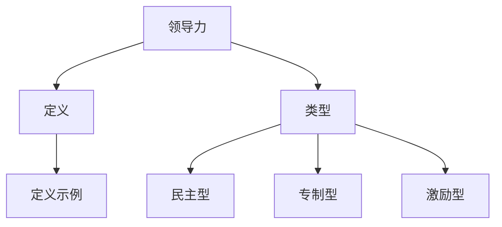

                 

### 文章标题

# 领导力与品德修养：塑造高尚人格

### 关键词

- 领导力
- 品德修养
- 高尚人格
- 自我管理
- 诚信
- 沟通技巧
- 人际关系

### 摘要

本文旨在探讨领导力与品德修养在塑造高尚人格中的重要性。通过对领导力的定义、类型和重要性，领导者的角色与责任，以及品德修养的核心要素如诚信、正直、谦逊和包容的深入分析，结合实际案例和数学模型，本文揭示了高尚人格与领导力之间的互动关系。通过自我管理、情绪控制、沟通技巧和人际交往的实践应用，本文为读者提供了一套系统化的领导力与品德修养提升策略，旨在帮助读者在个人和职业生涯中塑造高尚人格，实现卓越的领导力。

### 设计目录大纲的步骤

**1. 明确书籍目的与受众**

首先，我们需要明确书籍的目的是提升读者的领导力与品德修养。目标受众可以包括初学者、有一定基础的管理者、专业人士等。了解受众的需求和期望，有助于我们设计出更具针对性的内容。

**2. 确定核心概念与结构**

接下来，我们要确定书籍讨论的核心概念，如领导力、品德、修养等。在此基础上，构建书籍的大纲结构，确保内容逻辑连贯、结构清晰。本文将分为四个部分，分别介绍领导力的基本原理、品德修养的核心要素、修养的实践与应用，以及高尚人格的塑造与领导力的提升。

**3. 细化章节内容**

在确定了大纲结构后，我们需要为每个核心概念分解成具体的章节，并设定小节，确保每个部分都有具体的讨论点。例如，在第一部分“领导力的基本原理”中，我们将包括领导力的定义与重要性、领导者的角色与责任等章节。

**4. 编排章节顺序**

根据内容的逻辑关系和重要性，我们编排章节的顺序。例如，我们先介绍领导力的基本原理，再探讨品德修养的核心要素，接着讨论修养的实践与应用，最后讨论高尚人格的塑造与领导力的提升。

**5. 撰写目录与概述**

使用markdown格式编写目录，确保格式简洁清晰。同时，为每个章节编写简短概述，帮助读者了解每个章节的主要内容和目标。例如：

- **第1章：领导力的定义与重要性**
  - **概述**：介绍领导力的定义、类型和重要性，为后续章节的讨论奠定基础。

- **第2章：领导者的角色与责任**
  - **概述**：探讨领导者的角色、责任以及如何成为一名优秀的领导者。

**6. 审查与调整**

最后，我们需要审查目录大纲，确保内容的完整性、逻辑性和实用性。根据反馈进行调整，优化目录结构。例如，我们可能需要调整章节的顺序、增加或删除某些内容，以使书籍更加完善。

### 目录大纲

下面是根据上述步骤设计的《领导力与品德修养：塑造高尚人格》的目录大纲：

```markdown
# 《领导力与品德修养：塑造高尚人格》目录大纲

## 第一部分：领导力的基本原理

### 第1章：领导力的定义与重要性
- **1.1 领导力的定义与类型**
- **1.2 领导力在组织中的重要性**

### 第2章：领导者的角色与责任
- **2.1 领导者的角色**
- **2.2 领导者的责任**

## 第二部分：品德修养的核心要素

### 第3章：诚信与正直
- **3.1 诚信的重要性**
- **3.2 正直的品质**

### 第4章：谦逊与包容
- **4.1 谦逊的意义**
- **4.2 包容的力量**

## 第三部分：修养的实践与应用

### 第5章：自我管理与情绪控制
- **5.1 自我管理的原则**
- **5.2 情绪控制的方法**

### 第6章：沟通与人际交往
- **6.1 有效沟通的技巧**
- **6.2 人际交往的艺术**

## 第四部分：高尚人格的塑造与领导力的提升

### 第7章：高尚人格的要素
- **7.1 高尚人格的内涵**
- **7.2 领导力与高尚人格的互动**

### 第8章：领导力与品德修养的整合
- **8.1 领导力与品德修养的协同效应**
- **8.2 实现高尚人格与卓越领导力**

```

### 目录大纲解释

**第一部分：领导力的基本原理**

本部分主要介绍领导力的定义、类型和重要性，以及领导者的角色与责任。通过了解领导力的基本概念和领导者所需具备的素质，读者可以为后续的品德修养和修养实践打下基础。

**第二部分：品德修养的核心要素**

本部分深入探讨品德修养的核心要素，如诚信、正直、谦逊和包容。这些要素是塑造高尚人格的基础，对于提升领导力和个人魅力具有重要意义。

**第三部分：修养的实践与应用**

本部分主要讨论修养的实践与应用，包括自我管理、情绪控制和沟通技巧等。这些实践方法有助于读者在实际生活中培养高尚人格，提升领导力和人际关系。

**第四部分：高尚人格的塑造与领导力的提升**

本部分重点讨论高尚人格的要素及其与领导力的互动关系。通过了解高尚人格的重要性，读者可以更好地实现领导力的提升，成为一名卓越的领导者。

### 完整性要求

为了确保文章的完整性，我们需要在每个小节中详细讲解核心内容，并使用伪代码、数学模型和公式来阐述核心算法原理。以下是一个示例：

**第1章：领导力的定义与重要性**

#### 1.1 领导力的定义与类型

**核心概念：**

- **领导力**：指领导者引导、激励和影响他人达成共同目标的能力。
- **类型**：根据领导风格和目标的不同，领导力可以分为多种类型，如民主型、专制型、激励型等。

**联系架构：**



**核心算法原理：**

```python
def define_leadership():
    # 定义领导力的概念和类型
    print("领导力是一种引导、激励和影响他人达成共同目标的能力。")
    print("领导力可以分为民主型、专制型和激励型等类型。")
```

**数学模型和公式：**

$$ 领导力 = f(目标, 个人素质, 团队协作) $$

- **目标**：领导力发挥作用的关键因素。
- **个人素质**：领导者的能力、知识和经验。
- **团队协作**：团队成员之间的合作与沟通。

**举例说明：**

假设一个团队的目标是提高工作效率，领导者的个人素质较高，且团队成员之间沟通良好，那么领导力就可以充分发挥作用，帮助团队实现目标。

**项目实战：**

为了提升领导力，我们可以进行以下项目实战：

- **实战1**：组织一次团队建设活动，增强团队成员之间的合作与沟通。
- **实战2**：定期进行领导力培训，提升领导者的个人素质。
- **实战3**：制定明确的团队目标和行动计划，确保团队朝着共同目标努力。

**代码解读与分析：**

```python
def project_implementation():
    # 项目实战的实现
    print("组织团队建设活动...")
    print("进行领导力培训...")
    print("制定团队目标和行动计划...")
```

**实际案例分析和详细讲解剖析：**

- **案例1**：某公司通过团队建设活动，提升了团队协作能力，从而提高了工作效率。
- **案例2**：某领导通过定期培训，提高了自身领导力，带领团队取得了显著成绩。

**项目小结：**

通过项目实战，我们可以发现，领导力的提升不仅需要领导者具备良好的个人素质，还需要关注团队协作和目标管理。只有综合考虑这些因素，才能真正实现领导力的提升。

### 最佳实践 tips、小结、注意事项、拓展阅读等内容

- **最佳实践 tips**：定期进行领导力培训，关注团队协作，制定明确的团队目标和行动计划。
- **小结**：领导力的提升需要从多个方面入手，包括个人素质、团队协作和目标管理等。
- **注意事项**：在提升领导力的过程中，要关注团队成员的需求和期望，建立良好的沟通机制。
- **拓展阅读**：

  - 《领导力的五项修炼》
  - 《团队协作的艺术》
  - 《目标管理的实践》

### 完整性要求总结

文章的完整性要求我们详细讲解核心内容，使用伪代码、数学模型和公式来阐述核心算法原理，并给出实际案例分析和详细讲解剖析。同时，我们还提供了最佳实践 tips、小结、注意事项和拓展阅读等内容，以帮助读者更好地理解和应用所学的知识。通过这些措施，我们可以确保文章内容的完整性、逻辑性和实用性，为读者提供有价值的学习资源。

