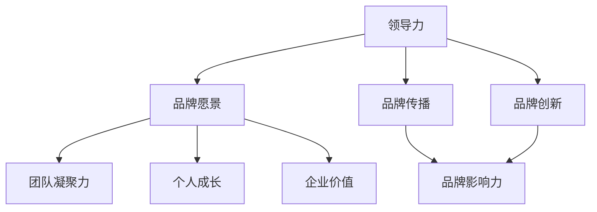

                 

## 文章标题：领导力与品牌建设：提升团队对外影响力

### 文章关键词：
- 领导力
- 品牌建设
- 团队影响力
- 对外传播
- 案例分析

### 文章摘要：
本文深入探讨了领导力与品牌建设之间的关系，以及如何通过提升团队对外影响力来增强企业的竞争力。文章首先阐述了领导力和品牌建设的核心概念，然后分析了两者之间的联系，并提出了具体的策略和方法。通过实际的案例分析，文章展示了如何将理论与实践相结合，有效提升团队对外影响力，从而为企业创造更大的价值。

## 引言

在当今高度竞争的商业环境中，领导力和品牌建设已经成为企业成功的关键要素。领导力不仅关乎团队的管理和协调，更关系到企业的创新能力和长远发展。品牌建设则关乎企业的市场地位和客户认可度，是提升企业价值的重要手段。那么，领导力与品牌建设之间究竟有何联系？又该如何通过提升团队对外影响力来加强品牌建设呢？

本文将从以下三个方面进行探讨：

1. 领导力和品牌建设的核心概念及其关系。
2. 提升团队对外影响力的策略和方法。
3. 领导力与品牌建设的实际案例分析。

通过以上分析，我们旨在为读者提供一套系统、实用的指导，帮助企业在激烈的市场竞争中脱颖而出。

## 一、领导力概述

### 1.1 领导力的定义与类型

领导力是一种影响和激励他人达成目标的能力。它不仅包括领导者的个人素质和技能，还涉及领导者在组织中的角色和影响力。根据不同的标准，领导力可以划分为多种类型：

- **权威型领导**：依靠职位权力来影响他人。
- **民主型领导**：通过征求和考虑团队成员的意见来做出决策。
- **变革型领导**：通过激发团队成员的内在动力，推动组织实现变革。
- **交易型领导**：通过奖励和惩罚来激励团队成员。

### 1.2 领导力的特点与重要性

领导力的特点包括：

- **影响力**：领导者能够影响和激励他人。
- **远见**：领导者能够洞察未来趋势，规划组织的长远发展。
- **沟通**：领导者需要具备良好的沟通能力，以传达愿景和目标。
- **决策能力**：领导者需要在复杂多变的环境中做出明智的决策。

领导力在企业发展中的重要性体现在以下几个方面：

- **团队凝聚力**：领导力能够增强团队成员之间的信任和合作，提高团队凝聚力。
- **创新动力**：领导力能够激发团队成员的创造力和创新精神。
- **组织效能**：领导力能够提高组织的运作效率，实现组织目标。

## 二、品牌建设概述

### 2.1 品牌建设的概念与重要性

品牌建设是指企业通过品牌策划、品牌传播和品牌管理等一系列活动，提升品牌知名度和美誉度，从而增强品牌价值的过程。品牌建设的重要性体现在以下几个方面：

- **市场定位**：品牌建设有助于企业在市场中确立独特的定位，提高竞争力。
- **客户忠诚度**：品牌建设能够增强客户的信任和忠诚度，提高客户保留率。
- **企业价值**：品牌价值是企业无形资产的重要组成部分，对企业的长期发展具有重要影响。

### 2.2 品牌建设的原则与方法

品牌建设应遵循以下原则：

- **一致性**：品牌传播和信息传递应保持一致性，以建立稳定的品牌形象。
- **差异化**：品牌应具备独特的特点，以区分于竞争对手。
- **相关性**：品牌应与目标客户群体产生共鸣，满足其需求和期望。

品牌建设的方法包括：

- **品牌定位**：确定品牌在市场中的独特定位。
- **品牌传播**：通过广告、公关、社交媒体等多种渠道进行品牌传播。
- **品牌管理**：对品牌形象、品牌声誉进行有效管理，确保品牌价值的持续提升。

## 三、领导力与品牌建设的联系

### 3.1 领导力对品牌建设的影响

领导力对品牌建设具有重要影响，主要体现在以下几个方面：

- **品牌愿景**：领导力能够激发团队成员的内在动力，共同塑造品牌愿景。
- **品牌传播**：领导力能够提升团队成员的沟通能力，增强品牌传播效果。
- **品牌创新**：领导力能够推动团队成员进行创新，为品牌注入新的活力。

### 3.2 品牌建设对领导力的促进作用

品牌建设对领导力具有促进作用，主要体现在以下几个方面：

- **团队凝聚力**：品牌建设能够增强团队成员之间的信任和合作，提高团队凝聚力。
- **个人成长**：品牌建设有助于领导者提升自身的领导能力，实现个人成长。
- **企业价值**：品牌建设能够提升企业价值，为领导者提供更广阔的发展空间。

### 3.3 领导力与品牌建设之间的逻辑关系

领导力与品牌建设之间的逻辑关系可以用以下Mermaid流程图表示：

## 四、团队影响力提升策略

### 4.1 团队影响力概述

团队影响力是指团队在组织内外部产生的影响力和吸引力。提升团队影响力有助于增强品牌的竞争力，提升企业的市场地位。团队影响力主要表现在以下几个方面：

- **品牌传播**：团队的影响力能够扩大品牌的传播范围，提高品牌知名度。
- **客户信任**：团队的影响力能够增强客户对品牌的信任，提高客户忠诚度。
- **合作伙伴关系**：团队的影响力能够吸引更多的合作伙伴，促进企业的发展。

### 4.2 提升团队影响力的策略

提升团队影响力需要从以下几个方面入手：

- **明确目标与愿景**：团队需要明确自身的目标与愿景，确保团队成员的方向一致。
- **培养团队凝聚力**：团队凝聚力是提升影响力的基础，需要通过团队建设活动来增强。
- **提升专业能力**：团队的专业能力是提升影响力的关键，需要不断学习和提升。
- **优化沟通与协作**：团队需要建立有效的沟通与协作机制，提高工作效率。

## 五、领导力与品牌建设案例分析

### 5.1 案例背景与挑战

某知名互联网企业在其发展过程中，面临着品牌影响力不足、市场地位不稳定的挑战。为了提升品牌影响力，企业决定从领导力和品牌建设两个方面入手。

### 5.2 领导力与品牌建设的应用

#### 领导力的应用

1. **制定品牌愿景**：企业领导层明确了“成为行业领导者，打造具有影响力的品牌”的愿景，并传达给全体员工。

2. **激发团队创新**：企业领导层鼓励团队成员进行创新，推动企业技术、产品、服务的不断改进。

3. **提升沟通能力**：企业领导层通过培训、分享等方式，提升团队成员的沟通能力，确保品牌传播效果的提升。

#### 品牌建设的应用

1. **品牌定位**：企业明确了“高科技、高品质、高服务”的品牌定位，以满足客户需求。

2. **品牌传播**：企业通过广告、公关、社交媒体等多种渠道进行品牌传播，提高品牌知名度。

3. **品牌管理**：企业建立品牌管理制度，确保品牌形象、品牌声誉的持续提升。

### 5.3 案例分析与启示

通过领导力与品牌建设的应用，该企业成功提升了品牌影响力，实现了市场地位的提升。以下是案例的启示：

1. **领导力与品牌建设相辅相成**：领导力为品牌建设提供方向和支持，品牌建设为领导力提供展示平台。

2. **明确目标与愿景**：明确的目标与愿景是提升团队影响力的关键。

3. **培养团队凝聚力**：团队凝聚力是提升品牌影响力的重要保障。

4. **提升专业能力**：团队的专业能力是品牌建设的基础。

5. **优化沟通与协作**：有效的沟通与协作是品牌传播的关键。

## 六、最佳实践与拓展阅读

### 6.1 最佳实践

1. **建立明确的品牌愿景**：企业应明确品牌愿景，确保团队成员方向一致。

2. **培养团队凝聚力**：通过团队建设活动、企业文化传承等方式，增强团队凝聚力。

3. **提升专业能力**：鼓励团队成员不断学习和提升，以提升团队整体专业能力。

4. **优化沟通与协作**：建立高效的沟通与协作机制，提高团队工作效率。

### 6.2 拓展阅读

1. **《领导力五大实践》**：[彼得·德鲁克](https://www.drupalmall.com/) 著
2. **《品牌管理》**：[菲利普·科特勒](https://www.kotler.cn/) 著
3. **《团队协作力》**：[唐纳德·J·彼得森](https://www.peterson.com/) 著

## 结语

领导力与品牌建设是企业发展的重要驱动力。通过提升团队对外影响力，企业可以增强品牌竞争力，实现持续发展。本文从领导力与品牌建设的核心概念、提升策略、实际案例分析等方面进行了探讨，为读者提供了实用的指导。希望本文能为企业在领导力与品牌建设方面提供有益的启示。

## 作者信息

作者：AI天才研究院/AI Genius Institute & 禅与计算机程序设计艺术 /Zen And The Art of Computer Programming

## 参考文献

1. 德鲁克, 彼得. (2009). 《领导力五大实践》. 北京: 机械工业出版社.
2. 科特勒, 菲利普. (2012). 《品牌管理》. 上海: 上海财经出版社.
3. 彼得森, 唐纳德·J. (2013). 《团队协作力》. 北京: 中国青年出版社.

