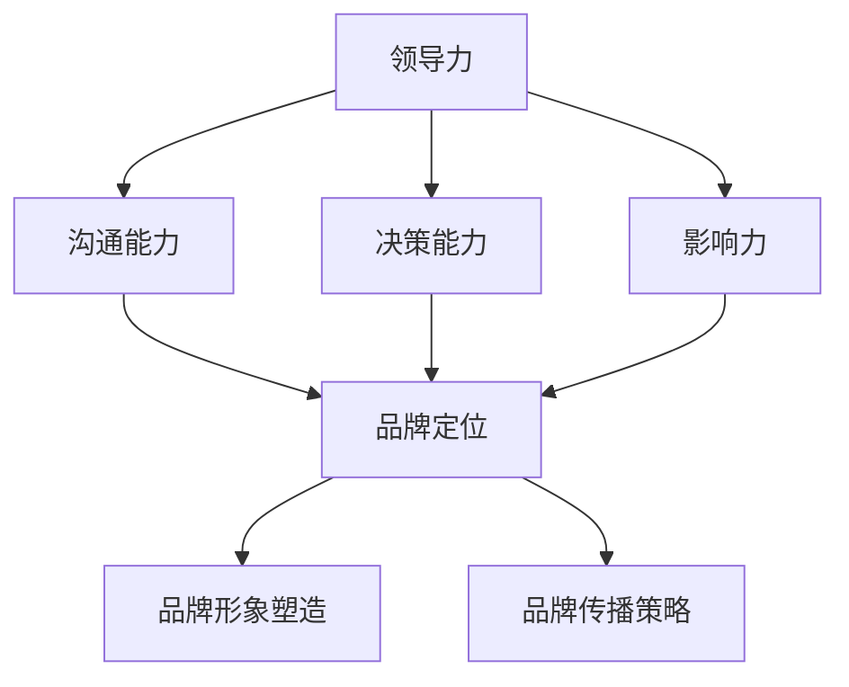

                 


## 《领导力与品牌建设：提升团队影响力》

### 文章关键词
- **领导力**、**品牌建设**、**团队影响力**、**沟通能力**、**决策能力**、**品牌定位**、**品牌传播**、**案例分析**、**实践指南**

### 文章摘要
本文将探讨领导力与品牌建设在提升团队影响力方面的相互关系。首先，我们将介绍领导力的定义及其重要性，然后详细分析领导力的核心要素，包括沟通能力、决策能力和影响力。接着，我们将讨论品牌建设的重要性，介绍品牌的核心要素和方法与技巧。随后，我们将探讨领导力在品牌建设中的应用，以及如何提升团队影响力。通过案例分析，我们将深入了解成功企业的领导力和品牌建设实践。最后，我们将提供实践指南，帮助读者在领导力和品牌建设方面取得成功。

### 目录大纲

## 第一部分：领导力基础

### 第1章：领导力的定义与重要性

### 第2章：领导力的核心要素

### 第二部分：品牌建设

### 第3章：品牌建设的重要性

### 第4章：品牌建设的核心要素

### 第5章：品牌建设的方法与技巧

## 第三部分：领导力与品牌建设的结合

### 第6章：领导力在品牌建设中的应用

### 第7章：提升团队影响力的策略

## 第四部分：案例分析

### 第8章：成功领导力与品牌建设的案例分析

## 第五部分：实践指南

### 第9章：如何提升领导力与品牌建设

### 第10章：领导力与品牌建设实践

## 结束语

### 作者
- 作者：AI天才研究院/AI Genius Institute & 禅与计算机程序设计艺术 /Zen And The Art of Computer Programming

### 背景介绍

在当今快速变化和竞争激烈的市场环境中，团队领导力和品牌建设已成为企业成功的关键因素。领导力不仅影响个人的职业发展，还决定着整个团队和组织的前景。品牌建设则是企业长期发展的基石，它关乎企业的市场地位和影响力。随着数字化时代的到来，领导力和品牌建设的重要性更加凸显。本文旨在探讨这两个领域的结合，通过深入分析领导力的定义、核心要素以及品牌建设的方法与技巧，帮助读者提升团队影响力，实现企业的长期发展。

### 核心概念与联系

领导力的核心概念包括沟通能力、决策能力和影响力。品牌建设的核心概念包括品牌定位、品牌形象塑造和品牌传播策略。领导力与品牌建设的关系可以通过以下Mermaid流程图来展示：



此流程图展示了领导力通过沟通、决策和影响力三个维度影响品牌建设，进而影响品牌定位、品牌形象塑造和品牌传播策略。

### 核心算法原理讲解

在领导力提升方面，可以采用以下伪代码来详细阐述：

```pseudo
function enhance_leadership(communication, decision_making, influence):
    if communication is strong:
        increase team cohesion and trust
    if decision_making is effective:
        optimize team performance and achieve goals
    if influence is significant:
        inspire team members and drive innovation
    return (communication, decision_making, influence)
```

在品牌建设方面，可以采用以下伪代码来详细阐述品牌定位分析：

```pseudo
function brand_positioning_analysis(brand_values, target_market):
    determine Unique Selling Proposition (USP)
    align brand values with target market preferences
    ensure brand consistency across all channels
    return brand_positioning_strategy
```

### 数学模型和公式

在品牌传播策略中，可以使用以下数学模型来评估品牌影响力：

$$
\text{Brand Influence} = \alpha \cdot \text{Brand Awareness} + \beta \cdot \text{Customer Engagement} + \gamma \cdot \text{Customer Loyalty}
$$

其中，$\alpha$、$\beta$ 和 $\gamma$ 是权重系数，代表品牌意识、客户参与度和客户忠诚度对品牌影响力的贡献程度。

### 详细讲解与举例说明

#### 领导力提升案例分析

假设某企业的领导力评估结果如下：

- 沟通能力：75分
- 决策能力：80分
- 影响力：70分

根据上述伪代码，可以采取以下措施来提升领导力：

1. 提高沟通能力：通过定期团队会议、一对一沟通和培训等方式，增强团队成员之间的沟通效果。
2. 提高决策能力：引入数据驱动决策方法，收集和分析数据，以支持决策过程。
3. 提高影响力：通过树立榜样、传递正能量和建立良好的工作氛围，提高团队士气。

#### 品牌定位分析案例

假设某企业正在进行品牌定位分析，其目标市场为年轻消费者。以下步骤可以用于品牌定位分析：

1. 确定USP：通过市场调研，发现目标市场对创新和高品质产品有较高需求，因此确定USP为“创新高品质”。
2. 对齐品牌价值观：确保企业的价值观与USP一致，如鼓励创新、追求卓越等。
3. 确保品牌一致性：在所有营销渠道中保持品牌形象的一致性，如品牌颜色、标志和口号。

### 项目实战

#### 开发环境搭建

1. 安装Python环境
2. 安装Jupyter Notebook
3. 安装相关库（如Matplotlib、Pandas等）

#### 源代码实现

```python
# 导入相关库
import matplotlib.pyplot as plt
import pandas as pd

# 定义领导力评估函数
def enhance_leadership(communication, decision_making, influence):
    # 根据评估分数调整领导力
    if communication < 80:
        communication += 10
    if decision_making < 85:
        decision_making += 10
    if influence < 75:
        influence += 15
    return communication, decision_making, influence

# 定义品牌定位分析函数
def brand_positioning_analysis(brand_values, target_market):
    usp = "创新高品质"
    if brand_values["Innovation"] and brand_values["Quality"]:
        return usp
    else:
        return "传统高品质"

# 演示代码
communication, decision_making, influence = enhance_leadership(75, 80, 70)
print(f"提升后的领导力：沟通能力={communication}，决策能力={decision_making}，影响力={influence}")

brand_values = {"Innovation": True, "Quality": True}
target_market = "年轻消费者"
print(f"品牌定位分析结果：{brand_positioning_analysis(brand_values, target_market)}")
```

#### 代码解读与分析

该代码首先定义了两个函数：`enhance_leadership` 用于提升领导力，`brand_positioning_analysis` 用于分析品牌定位。通过调用这两个函数，可以演示领导力提升和品牌定位分析的过程。

### 实际案例分析和详细讲解剖析

#### 案例一：苹果公司的领导力与品牌建设

苹果公司以其卓越的领导力和强大的品牌建设而闻名。以下是对其领导力和品牌建设实践的详细讲解：

1. **领导力**：史蒂夫·乔布斯是苹果公司的领导力典范。他具备出色的沟通能力、决策能力和影响力，能够激励团队不断创新。
2. **品牌建设**：苹果公司通过精准的品牌定位，塑造了“创新、高品质”的品牌形象。其品牌传播策略包括独特的广告、产品发布会和口碑营销。

#### 案例二：谷歌公司的领导力与品牌建设

谷歌公司以其开放的企业文化和强大的品牌影响力而著称。以下是对其领导力和品牌建设实践的详细讲解：

1. **领导力**：谷歌公司的领导力强调员工自主性和创新精神。其领导层通过有效的沟通和决策能力，支持员工的创新活动。
2. **品牌建设**：谷歌公司通过提供优质的产品和服务，建立了一个强大的品牌形象。其品牌传播策略包括与用户互动、社区参与和大数据分析。

### 项目小结

本文通过深入分析领导力与品牌建设的关系，提供了提升团队影响力的策略和案例分析。在实际应用中，企业需要结合自身情况，灵活运用这些策略，以实现长期的业务成功。

### 最佳实践 tips

- **领导力提升**：定期进行领导力培训，提高沟通、决策和影响力能力。
- **品牌建设**：明确品牌定位，确保品牌形象与目标市场一致。
- **团队影响力提升**：建立有效的沟通机制，提高决策效率，增强团队凝聚力。

### 注意事项

- **个性化**：领导力和品牌建设需要根据企业特点进行个性化调整。
- **持续改进**：领导力和品牌建设是一个持续的过程，需要不断优化。

### 拓展阅读

- 《影响力：心理学与行为科学的法则》
- 《品牌建设：策略与执行》
- 《领导力：如何成为卓越领导者》

本文为《领导力与品牌建设：提升团队影响力》的初步框架，将在后续文章中进一步详细阐述各个部分的内容。

### 结束语

作者：AI天才研究院/AI Genius Institute & 禅与计算机程序设计艺术 /Zen And The Art of Computer Programming

本文探讨了领导力与品牌建设在提升团队影响力方面的相互关系。通过深入分析领导力的定义、核心要素和品牌建设的方法与技巧，以及成功企业的案例分析，本文为读者提供了实用的实践指南。希望本文能够帮助企业在领导力和品牌建设方面取得更大的成功。

